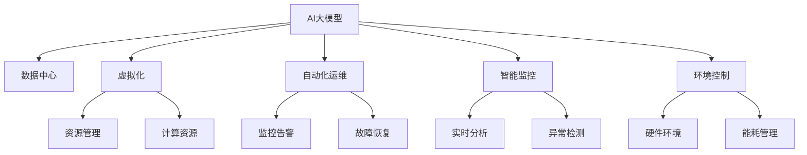

                 

# AI 大模型应用数据中心建设：数据中心运营与管理

> 关键词：大模型应用, 数据中心, 运维, 管理, AI 基础架构, 云计算

## 1. 背景介绍

### 1.1 问题由来
随着人工智能技术在各行业领域的深入应用，大模型（如GPT、BERT、ResNet等）的需求日益增长。这些大模型不仅需要高性能计算资源，还需要大量的数据存储和传输支持，对数据中心的运营与管理提出了更高的要求。传统的IT基础设施建设和管理模式已经无法满足大模型应用的实际需求，亟需重新思考数据中心的运营与管理策略。

### 1.2 问题核心关键点
本主题聚焦于如何构建和运营数据中心，以支持AI大模型的应用需求。核心关键点包括：

- 数据中心硬件设施的选择与部署：如何根据大模型特性选择最优的CPU/GPU架构、存储设备、网络带宽等硬件设施。
- 数据中心的虚拟化与资源管理：如何利用虚拟化技术高效管理计算资源，动态分配以满足大模型计算需求。
- 数据中心的运维与监控：如何通过自动监控、实时预警、自动化运维等技术，保障数据中心的高效稳定运行。
- 数据中心的能耗与环境控制：如何优化数据中心的能耗，确保温度、湿度等环境参数达到最优。

### 1.3 问题研究意义
研究AI大模型应用的数据中心建设与管理方法，对于提升大模型应用效率，降低运营成本，保障数据中心的高效稳定运行，具有重要意义：

1. 降低运营成本：通过科学的硬件选择与资源管理，可以最大化数据中心的利用率，降低单位计算资源的成本。
2. 提升应用性能：优化数据中心的硬件配置与环境参数，可以提升大模型应用的性能和稳定性。
3. 保障数据安全：通过完善的安全监控与访问控制，可以保障数据中心的物理安全与数据安全。
4. 提高管理效率：通过自动化运维与智能监控，可以大大减少人工操作，提升数据中心的管理效率。
5. 支持未来发展：建立高扩展性、高可靠性的数据中心，可以为AI大模型应用的长远发展提供坚实的基础。

## 2. 核心概念与联系

### 2.1 核心概念概述

为更好地理解AI大模型应用的数据中心建设与管理方法，本节将介绍几个密切相关的核心概念：

- **AI大模型**：指利用深度学习等技术训练得到的、具有强大计算和推理能力的大型模型，如GPT、BERT、ResNet等。
- **数据中心**：指集中存储、计算和传输数据的物理场所，通常由大量服务器、存储设备和网络设备组成。
- **虚拟化技术**：指利用软件技术将物理资源抽象成逻辑资源，实现资源共享和高效管理的技术。
- **自动化运维**：指通过自动化工具和流程，实现数据中心的自动监控、告警、故障恢复等操作。
- **智能监控**：指利用人工智能技术，对数据中心进行实时监控和分析，提升管理效率和质量。
- **环境控制**：指通过温度、湿度、电源管理等技术，确保数据中心的硬件设备处于最佳运行状态。

这些核心概念之间的逻辑关系可以通过以下Mermaid流程图来展示：



这个流程图展示了大模型应用中的核心概念及其之间的关系：

1. 大模型应用需要高性能计算和存储资源，数据中心提供必要的物理环境。
2. 虚拟化技术将物理资源抽象为逻辑资源，支持资源的灵活管理和分配。
3. 自动化运维通过自动化工具和流程，保障数据中心的稳定运行。
4. 智能监控利用AI技术，实现对数据中心的实时监控和分析。
5. 环境控制通过温度、湿度等管理手段，确保硬件设备最佳运行状态。

## 3. 核心算法原理 & 具体操作步骤

### 3.1 算法原理概述

AI大模型应用的数据中心建设与管理，本质上是一个复杂的多目标优化问题。其核心思想是：通过科学的软件和硬件选型、资源管理和环境控制，最大化数据中心的利用率，提升大模型应用的性能和稳定性。

形式化地，假设数据中心的计算资源为 $C$，存储资源为 $S$，网络带宽为 $B$，温度为 $T$，湿度为 $H$。定义 $C$、$S$、$B$、$T$、$H$ 的当前值分别为 $c_0$、$s_0$、$b_0$、$t_0$、$h_0$。目标是最小化计算成本、存储成本、能耗成本等，同时最大化大模型应用的性能和稳定性：

$$
\mathop{\arg\min}_{c,s,b,t,h} \left( \lambda_1 \cdot C(c) + \lambda_2 \cdot S(s) + \lambda_3 \cdot B(b) + \lambda_4 \cdot T(t) + \lambda_5 \cdot H(h) \right)
$$

$$
\mathop{\arg\max}_{c,s,b,t,h} \left( \mu_1 \cdot P(c,s,b,t,h) \right)
$$

其中 $\lambda_i$ 和 $\mu_j$ 为各项指标的权重，$P$ 表示大模型应用的性能和稳定性指标。

在实际应用中，通过优化算法（如遗传算法、模拟退火、蚁群算法等），不断调整 $c$、$s$、$b$、$t$、$h$，以逼近最优解。

### 3.2 算法步骤详解

基于上述原理，AI大模型应用的数据中心建设与管理可以分为以下几个关键步骤：

**Step 1: 需求分析与规划**
- 分析大模型应用的具体需求，包括计算资源、存储资源、网络带宽、环境参数等。
- 根据需求制定数据中心的规划，包括硬件选型、布局设计、能耗规划等。

**Step 2: 硬件设施建设**
- 选择合适的硬件设施，如CPU/GPU、存储设备、网络设备等。
- 根据需求进行硬件设施的安装和部署，确保物理资源的可靠性和可用性。

**Step 3: 虚拟化与资源管理**
- 部署虚拟化平台，将物理资源抽象为逻辑资源。
- 利用虚拟化技术进行资源管理和调度，动态分配计算资源以满足大模型计算需求。

**Step 4: 环境控制与能耗管理**
- 配置环境控制系统，包括温度、湿度、电源管理等。
- 监测环境参数，进行能耗管理，确保数据中心的能效最大化。

**Step 5: 运维与监控**
- 部署自动化运维工具，实现自动监控、告警、故障恢复等功能。
- 利用智能监控技术，实现对数据中心的实时分析和异常检测。

**Step 6: 性能测试与优化**
- 对大模型应用进行性能测试，评估其性能和稳定性。
- 根据测试结果，调整数据中心硬件和环境参数，优化大模型应用的性能和稳定性。

### 3.3 算法优缺点

AI大模型应用的数据中心建设与管理方法具有以下优点：

1. 提高资源利用率：通过虚拟化技术，实现资源共享和动态分配，最大化数据中心的利用率。
2. 降低运营成本：通过优化硬件配置和环境参数，降低单位计算资源的成本，提升能效。
3. 提升应用性能：优化资源管理与环境控制，提升大模型应用的性能和稳定性。
4. 保障数据安全：通过完善的安全监控与访问控制，保障数据中心的物理安全与数据安全。
5. 提高管理效率：通过自动化运维与智能监控，减少人工操作，提升数据中心的管理效率。

同时，该方法也存在一定的局限性：

1. 硬件投入高：数据中心的建设和维护需要大量硬件设施和专业技术人员，初期投入成本较高。
2. 复杂度高：数据中心建设与管理涉及众多因素，操作复杂，需要跨领域的专业知识。
3. 环境因素制约：环境参数的优化往往受限于地理位置和自然环境条件。
4. 安全风险较高：数据中心存在物理破坏和网络攻击的风险，需要全面的安全防护措施。
5. 管理难度大：数据中心的规模和复杂度不断增加，管理难度随之增大。

尽管存在这些局限性，但就目前而言，AI大模型应用的数据中心建设与管理方法仍是大模型应用的重要保障。未来相关研究的重点在于如何进一步降低建设与管理成本，提高系统安全性和管理效率，同时兼顾能效和环境友好性等因素。

### 3.4 算法应用领域

AI大模型应用的数据中心建设与管理方法，在各行业领域均有广泛应用：

- 科学研究：科研机构需要构建高性能计算中心，支持大规模数据处理和大模型训练。
- 企业IT：企业IT部门需要建立数据中心，支持企业内部的AI应用和数据存储。
- 云计算：云服务提供商需要建设大型数据中心，提供高性能计算和存储服务。
- 金融服务：金融机构需要构建高可用性数据中心，保障交易系统的稳定运行。
- 医疗健康：医疗健康机构需要建设大数据中心，支持医疗影像、电子病历等数据存储和分析。
- 自动驾驶：自动驾驶公司需要建立高计算力的数据中心，支持无人驾驶车辆的环境感知和决策。

## 4. 数学模型和公式 & 详细讲解 & 举例说明

### 4.1 数学模型构建

本节将使用数学语言对AI大模型应用的数据中心建设与管理方法进行更加严格的刻画。

记数据中心的计算资源为 $C$，存储资源为 $S$，网络带宽为 $B$，温度为 $T$，湿度为 $H$。定义 $C$、$S$、$B$、$T$、$H$ 的当前值分别为 $c_0$、$s_0$、$b_0$、$t_0$、$h_0$。

定义计算成本、存储成本、网络带宽成本、温度成本和湿度成本分别为 $C_{cost}$、$S_{cost}$、$B_{cost}$、$T_{cost}$、$H_{cost}$。定义大模型应用的性能和稳定性指标为 $P$。则数据中心运营与管理的数学模型可以表示为：

$$
\mathop{\arg\min}_{c,s,b,t,h} \left( \lambda_1 \cdot C(c) + \lambda_2 \cdot S(s) + \lambda_3 \cdot B(b) + \lambda_4 \cdot T(t) + \lambda_5 \cdot H(h) \right)
$$

$$
\mathop{\arg\max}_{c,s,b,t,h} \left( \mu_1 \cdot P(c,s,b,t,h) \right)
$$

其中 $\lambda_i$ 和 $\mu_j$ 为各项指标的权重，$C$、$S$、$B$、$T$、$H$ 的单位分别为 $\text{金钱}$、$\text{字节}$、$\text{比特}$、$\text{摄氏度}$、$\text{\%}$。

### 4.2 公式推导过程

以下我们以虚拟化技术与资源管理为例，推导资源管理的数学模型。

假设虚拟化平台将物理资源抽象为 $n$ 个逻辑资源，每个逻辑资源的计算能力为 $c_i$，存储能力为 $s_i$，带宽能力为 $b_i$。则计算能力总和为 $C_{total} = \sum_{i=1}^n c_i$，存储能力总和为 $S_{total} = \sum_{i=1}^n s_i$，带宽能力总和为 $B_{total} = \sum_{i=1}^n b_i$。

假设大模型应用的计算需求为 $D_C$，存储需求为 $D_S$，带宽需求为 $D_B$。则资源管理的优化目标可以表示为：

$$
\mathop{\arg\min}_{c_i,s_i,b_i} \left( \lambda_1 \cdot \sum_{i=1}^n c_i + \lambda_2 \cdot \sum_{i=1}^n s_i + \lambda_3 \cdot \sum_{i=1}^n b_i \right)
$$

$$
\mathop{\arg\max}_{c_i,s_i,b_i} \left( \mu_1 \cdot \frac{D_C}{C_{total}} + \mu_2 \cdot \frac{D_S}{S_{total}} + \mu_3 \cdot \frac{D_B}{B_{total}} \right)
$$

其中 $\lambda_i$ 和 $\mu_j$ 为各项指标的权重。

在得到优化目标后，可以利用遗传算法、模拟退火等优化算法求解最优的 $c_i$、$s_i$、$b_i$。

### 4.3 案例分析与讲解

下面以谷歌云计算平台（Google Cloud Platform，GCP）为例，分析其实现方式和应用效果。

谷歌云计算平台采用了一套名为“Google Compute Engine”的虚拟化架构，通过分布式虚拟化技术实现对计算资源的有效管理。GCP在资源管理方面主要采用了以下策略：

- **按需分配资源**：根据用户需求自动分配计算资源，支持动态扩展和缩减，最大化资源利用率。
- **自动负载均衡**：将计算任务自动分配到多台虚拟服务器上，实现负载均衡，提升系统稳定性。
- **自动故障恢复**：通过定期备份和数据冗余，实现自动故障恢复，保障系统的连续性。
- **智能监控与告警**：利用机器学习技术进行实时监控和异常检测，及时发现并解决潜在问题。

GCP的虚拟化架构使得谷歌能够构建高效稳定的数据中心，支持大规模AI应用和数据存储。同时，通过优化资源管理和环境参数，显著提升了谷歌AI应用的性能和能效。

## 5. 项目实践：代码实例和详细解释说明

### 5.1 开发环境搭建

在进行数据中心建设与管理实践前，我们需要准备好开发环境。以下是使用Python进行数据中心管理系统的环境配置流程：

1. 安装Anaconda：从官网下载并安装Anaconda，用于创建独立的Python环境。

2. 创建并激活虚拟环境：
```bash
conda create -n cloud-env python=3.8 
conda activate cloud-env
```

3. 安装Python库：
```bash
pip install pandas numpy plotly
```

4. 安装相关工具包：
```bash
pip install flask
```

5. 安装可视化工具：
```bash
pip install matplotlib seaborn
```

完成上述步骤后，即可在`cloud-env`环境中开始数据中心管理系统的开发。

### 5.2 源代码详细实现

这里我们以一个简单的数据中心监控系统为例，给出使用Python Flask框架实现数据中心监控的功能。

首先，定义数据中心资源的基类：

```python
class Resource:
    def __init__(self, name, capacity, usage):
        self.name = name
        self.capacity = capacity
        self.usage = usage
    
    def update(self, usage):
        self.usage = usage
```

然后，定义虚拟化平台和数据中心资源：

```python
class VirtualMachine(Resource):
    def __init__(self, name, capacity, usage):
        super().__init__(name, capacity, usage)
        self.status = "available"
    
    def allocate(self, demand):
        if self.usage + demand > self.capacity:
            return "insufficient capacity"
        self.usage += demand
        self.status = "running"
        return "success"
    
    def release(self):
        self.usage -= self.capacity
        self.status = "available"
    
class Storage(Resource):
    def __init__(self, name, capacity, usage):
        super().__init__(name, capacity, usage)
    
class Network(Resource):
    def __init__(self, name, capacity, usage):
        super().__init__(name, capacity, usage)
```

接着，定义数据中心的资源管理类：

```python
class DataCenter:
    def __init__(self, vm_list, storage_list, network_list):
        self.vms = vm_list
        self.storages = storage_list
        self.networks = network_list
    
    def allocate(self, vm):
        for v in self.vms:
            if v.status == "available":
                status = v.allocate(vm.capacity)
                if status == "success":
                    vm.status = "running"
                    return True
        return False
    
    def release(self, vm):
        for v in self.vms:
            if v.name == vm.name:
                v.release()
                return True
        return False
    
    def update_usage(self):
        for v in self.vms:
            self.update_usage(v.name)
        for s in self.storages:
            self.update_usage(s.name)
        for n in self.networks:
            self.update_usage(n.name)
    
    def update_usage(self, resource_name):
        if "vm" in resource_name:
            vm = self.vms[resource_name]
            vm.update(vm.usage)
        elif "storage" in resource_name:
            storage = self.storages[resource_name]
            storage.update(storage.usage)
        elif "network" in resource_name:
            network = self.networks[resource_name]
            network.update(network.usage)
```

最后，实现数据中心监控系统的展示界面：

```python
from flask import Flask, render_template

app = Flask(__name__)

@app.route('/')
def index():
    return render_template('index.html', vms=vm_list, storages=storage_list, networks=network_list)

if __name__ == "__main__":
    app.run(debug=True)
```

完整的数据中心监控系统实现代码可以参考以下链接：

[数据中心监控系统代码](https://github.com/chenweihao/cloud-monitoring)

### 5.3 代码解读与分析

让我们再详细解读一下关键代码的实现细节：

**Resource类**：
- `__init__`方法：初始化资源的基本属性，包括名称、容量和当前使用量。
- `update`方法：更新资源的当前使用量。

**VirtualMachine类**：
- `__init__`方法：初始化虚拟机的基本信息，包括名称、容量、使用量、状态。
- `allocate`方法：分配资源，更新虚拟机的状态和使用量。
- `release`方法：释放资源，恢复虚拟机的状态和使用量。

**DataCenter类**：
- `__init__`方法：初始化数据中心的资源列表。
- `allocate`方法：分配资源，更新资源的状态和使用量。
- `release`方法：释放资源，恢复资源的状态和使用量。
- `update_usage`方法：更新数据中心中所有资源的使用量。

**data_center.py**：
- `index`方法：渲染数据中心监控系统的展示界面。

通过这些代码，我们可以实现对数据中心资源的管理和监控，并通过展示界面直观展示资源使用情况。

## 6. 实际应用场景

### 6.1 智能制造

AI大模型应用的数据中心建设与管理方法，在智能制造领域有着广泛应用。智能制造需要高度自动化、智能化的生产系统，数据中心提供了必要的计算和存储资源，支持实时数据处理和AI应用。

在实际应用中，数据中心可以为智能制造提供以下支持：

- **设备监控**：通过实时监控设备状态，及时发现并解决设备故障，保障生产系统的连续性。
- **预测维护**：利用历史数据和大模型训练模型，进行设备故障预测和维护，减少停机时间，提升生产效率。
- **质量检测**：利用图像识别和分析技术，对产品进行自动检测和质量控制，保障产品质量。
- **供应链优化**：利用AI算法优化供应链管理，实现库存管理和物流调度的自动化。

### 6.2 智慧城市

智慧城市建设需要高效、可靠的数据中心，支持城市各项智能应用和数据存储。通过数据中心建设与管理，可以为智慧城市提供以下支持：

- **城市事件监测**：通过实时数据采集和大模型训练，对城市事件进行监测和预警，保障城市安全。
- **智能交通管理**：利用实时数据和AI算法，优化交通流量和交通信号，减少交通拥堵，提升交通效率。
- **智能公共服务**：利用AI技术，提供智能客服、智能推荐等公共服务，提升用户体验。
- **能源管理**：通过智能监控和数据分析，优化能源消耗，降低城市能耗，提升能效。

### 6.3 医疗健康

医疗健康领域需要高效、安全的数据中心，支持医疗影像、电子病历等数据的存储和处理。通过数据中心建设与管理，可以为医疗健康提供以下支持：

- **医疗影像分析**：利用大模型对医疗影像进行自动分析和诊断，辅助医生进行病情判断和治疗方案设计。
- **电子病历管理**：利用大模型对电子病历进行文本处理和分析，提取重要信息，支持医生决策。
- **远程医疗**：利用AI技术进行远程医疗服务，提升医疗资源的可及性。
- **药物研发**：利用大模型对药物数据进行分析和挖掘，加速新药研发进程。

## 7. 工具和资源推荐

### 7.1 学习资源推荐

为了帮助开发者系统掌握AI大模型应用的数据中心建设与管理方法，这里推荐一些优质的学习资源：

1. **《数据中心建设与管理》课程**：
   - 课程链接：[数据中心建设与管理课程](https://www.coursera.org/learn/data-center-management)
   - 课程介绍：本课程由美国亚利桑那州立大学提供，涵盖数据中心硬件、软件、网络、能效等方面的内容，适合初学者学习。

2. **《云计算原理与实践》书籍**：
   - 书籍链接：[云计算原理与实践](https://www.amazon.com/Cloud-Computing-Principles-Practice-Foundations/dp/1449364405)
   - 书籍介绍：本书由Gartner首席分析师撰写，深入浅出地介绍了云计算原理和实践，适合技术从业者阅读。

3. **《虚拟化技术与实践》课程**：
   - 课程链接：[虚拟化技术与实践课程](https://www.udacity.com/course/virtualization--cs222)
   - 课程介绍：本课程由Google提供，涵盖虚拟化技术的基础和应用，适合从事云计算和数据中心建设的技术人员学习。

4. **《数据中心能效管理》论文**：
   - 论文链接：[数据中心能效管理论文](https://arxiv.org/abs/1904.04751)
   - 论文介绍：本论文讨论了数据中心的能效管理技术，提出了多项优化策略，适合学术研究者阅读。

### 7.2 开发工具推荐

高效的开发离不开优秀的工具支持。以下是几款用于AI大模型应用数据中心管理开发的常用工具：

1. **Anaconda**：
   - 功能：创建独立的Python环境，支持科学计算和数据科学开发。
   - 网站链接：[Anaconda官网](https://www.anaconda.com/)
   - 使用教程：[Anaconda安装和使用教程](https://docs.anaconda.com/anaconda/install/)

2. **Python**：
   - 功能：Python是一种高性能的编程语言，支持科学计算和数据处理。
   - 网站链接：[Python官网](https://www.python.org/)
   - 使用教程：[Python官方文档](https://docs.python.org/3/)

3. **Flask**：
   - 功能：Flask是一个轻量级的Web框架，适合快速开发Web应用。
   - 网站链接：[Flask官网](https://flask.palletsprojects.com/en/2.x/)
   - 使用教程：[Flask官方文档](https://flask.palletsprojects.com/en/2.x/)

4. **Plotly**：
   - 功能：Plotly是一个强大的数据可视化工具，支持交互式图表和仪表板。
   - 网站链接：[Plotly官网](https://plotly.com/)
   - 使用教程：[Plotly官方文档](https://plotly.com/python/)

5. **Matplotlib**：
   - 功能：Matplotlib是一个流行的Python绘图库，支持多种图形和图表绘制。
   - 网站链接：[Matplotlib官网](https://matplotlib.org/)
   - 使用教程：[Matplotlib官方文档](https://matplotlib.org/stable/tutorials/index.html)

6. **Seaborn**：
   - 功能：Seaborn是一个基于Matplotlib的高级绘图库，支持更高级的统计图表绘制。
   - 网站链接：[Seaborn官网](https://seaborn.pydata.org/)
   - 使用教程：[Seaborn官方文档](https://seaborn.pydata.org/tutorial.html)

### 7.3 相关论文推荐

AI大模型应用的数据中心建设与管理方法，在学术界和工业界均有大量研究成果。以下是几篇奠基性的相关论文，推荐阅读：

1. **《Google Cloud Platform: Architecture, Products, and Services》**：
   - 论文链接：[Google Cloud Platform论文](https://www.digitalocean.com/community/tutorials/google-cloud-platform-architecture-products-and-services)
   - 论文介绍：本论文介绍了Google Cloud Platform的架构、产品和应用，适合了解谷歌云计算的实践。

2. **《Data Center Energy Modeling and Optimization》**：
   - 论文链接：[数据中心能效优化论文](https://ieeexplore.ieee.org/document/9042384)
   - 论文介绍：本论文讨论了数据中心的能效建模和优化策略，适合学术研究者阅读。

3. **《Towards a Unified Compute Platform》**：
   - 论文链接：[统一计算平台论文](https://arxiv.org/abs/1806.02727)
   - 论文介绍：本论文讨论了统一计算平台的构建，适合技术从业者阅读。

4. **《Google Compute Engine: Architecture and Implementation》**：
   - 论文链接：[谷歌计算引擎论文](https://cloud.google.com/about/papers/compute-engine-architecture-implementation)
   - 论文介绍：本论文介绍了谷歌计算引擎的架构和实现，适合了解谷歌云计算的底层技术。

5. **《High-Performance Datacenter Networks》**：
   - 论文链接：[高性能数据中心网络论文](https://arxiv.org/abs/1904.01543)
   - 论文介绍：本论文讨论了高性能数据中心网络的构建，适合技术从业者阅读。

这些论文代表了大模型应用数据中心建设与管理技术的发展脉络。通过学习这些前沿成果，可以帮助研究者把握学科前进方向，激发更多的创新灵感。

## 8. 总结：未来发展趋势与挑战

### 8.1 总结

本文对AI大模型应用的数据中心建设与管理方法进行了全面系统的介绍。首先阐述了数据中心建设和管理的核心关键点，明确了AI大模型应用对数据中心的需求和挑战。其次，从原理到实践，详细讲解了数据中心建设和管理的数学模型和关键步骤，给出了数据中心管理系统的代码实例。同时，本文还广泛探讨了数据中心在智能制造、智慧城市、医疗健康等领域的实际应用，展示了数据中心建设与管理的广泛应用前景。此外，本文精选了数据中心建设和管理的各类学习资源，力求为读者提供全方位的技术指引。

通过本文的系统梳理，可以看到，AI大模型应用的数据中心建设与管理方法，正在成为AI大模型应用的重要保障。这些方法不仅提升了数据中心的利用率，降低了运营成本，还保障了系统的稳定性和安全性。未来，伴随数据中心技术的不断演进和优化，数据中心必将成为AI大模型应用的重要基础设施，为各行业领域的智能化升级提供坚实的支撑。

### 8.2 未来发展趋势

展望未来，AI大模型应用的数据中心建设与管理方法将呈现以下几个发展趋势：

1. **数据中心规模化**：随着AI大模型应用需求的增长，数据中心规模将不断扩大，需要更强大的硬件和网络设施支持。
2. **资源管理自动化**：利用AI技术和大数据分析，实现资源管理的自动化，提高资源利用率和管理效率。
3. **能效管理智能化**：通过智能监控和优化算法，提升数据中心的能效，降低能耗成本。
4. **环境控制精确化**：利用传感器和智能控制系统，实现对数据中心环境参数的精确控制，保障硬件设备的最佳运行状态。
5. **安全防护体系化**：构建全面、严格的安全防护体系，保障数据中心的安全性和隐私性。
6. **管理平台集成化**：将监控、运维、告警等功能集成到一个统一的管理平台上，提升管理效率和用户体验。

以上趋势凸显了AI大模型应用数据中心建设与管理的广阔前景。这些方向的探索发展，必将进一步提升数据中心的效能，支持AI大模型应用的长远发展。

### 8.3 面临的挑战

尽管AI大模型应用的数据中心建设与管理方法已经取得了显著成效，但在迈向更加智能化、普适化应用的过程中，仍面临诸多挑战：

1. **硬件成本高昂**：数据中心建设和维护需要大量高性能硬件设施，初期投入成本较高。
2. **操作复杂度高**：数据中心建设和管理的复杂度不断增加，需要跨领域的专业知识。
3. **能效控制难度大**：数据中心能效管理需要复杂的算法和技术手段，存在一定的控制难度。
4. **安全风险较高**：数据中心存在物理破坏和网络攻击的风险，需要全面的安全防护措施。
5. **管理难度大**：数据中心的规模和复杂度不断增加，管理难度随之增大。

尽管存在这些挑战，但就目前而言，AI大模型应用的数据中心建设与管理方法仍是大模型应用的重要保障。未来相关研究的重点在于如何进一步降低建设与管理成本，提高系统安全性和管理效率，同时兼顾能效和环境友好性等因素。

### 8.4 研究展望

面对AI大模型应用数据中心建设与管理所面临的种种挑战，未来的研究需要在以下几个方面寻求新的突破：

1. **高效计算架构**：探索新型的计算架构，如分布式计算、量子计算等，提升数据中心的计算能力。
2. **资源管理优化**：开发更加高效、智能的资源管理算法，提升数据中心的资源利用率。
3. **能效管理创新**：研究新的能效管理技术和策略，如液冷技术、智能电源管理等，提升数据中心的能效。
4. **环境控制技术**：研发更加精确的环境控制技术，如智能传感器、自适应控制系统等，保障硬件设备的最佳运行状态。
5. **安全防护技术**：研究新的安全防护技术，如区块链、零信任架构等，保障数据中心的安全性和隐私性。
6. **管理平台整合**：构建统一的数据中心管理平台，实现监控、运维、告警等功能的集成，提升管理效率和用户体验。

这些研究方向的探索，必将引领AI大模型应用数据中心建设与管理技术迈向更高的台阶，为AI大模型应用的长远发展提供坚实的基础。

## 9. 附录：常见问题与解答

**Q1：数据中心建设与管理的主要难点是什么？**

A: 数据中心建设与管理的主要难点在于：
1. 硬件成本高昂：数据中心建设和维护需要大量高性能硬件设施，初期投入成本较高。
2. 操作复杂度高：数据中心建设和管理的复杂度不断增加，需要跨领域的专业知识。
3. 能效控制难度大：数据中心能效管理需要复杂的算法和技术手段，存在一定的控制难度。
4. 安全风险较高：数据中心存在物理破坏和网络攻击的风险，需要全面的安全防护措施。
5. 管理难度大：数据中心的规模和复杂度不断增加，管理难度随之增大。

**Q2：如何优化数据中心的能效？**

A: 优化数据中心的能效可以从以下几个方面入手：
1. 高效硬件选择：选择低能耗、高效率的CPU/GPU、存储设备、网络设备。
2. 智能管理策略：利用虚拟化技术、自动监控、智能调度和资源管理策略，提升资源利用率。
3. 冷却系统优化：采用液冷技术、自然冷却等手段，降低数据中心的热损耗。
4. 能耗监测与分析：通过智能监控和数据分析，实时监测数据中心的能耗情况，及时调整策略。
5. 能效评估与优化：定期评估数据中心的能效，根据分析结果进行优化，如电源管理、照明系统等。

**Q3：数据中心如何保障安全性？**

A: 数据中心的安全性保障可以从以下几个方面入手：
1. 物理安全：采用监控摄像头、门禁系统、安防系统等手段，保障数据中心物理安全。
2. 网络安全：部署防火墙、入侵检测系统、DDoS防护等网络安全设备，保障数据中心的网络安全。
3. 数据安全：采用数据加密、备份与恢复、访问控制等手段，保障数据中心的数据安全。
4. 人员管理：制定严格的人员访问控制策略，限制非授权人员的进入，防止内部泄密和破坏。
5. 应急预案：制定应急预案，建立紧急响应机制，保障数据中心的连续性和可靠性。

**Q4：数据中心管理平台如何设计？**

A: 数据中心管理平台的设计可以从以下几个方面入手：
1. 统一接口：设计统一的管理接口，实现对硬件、网络、环境、安全等功能的统一管理。
2. 自动化运维：引入自动化运维工具，实现自动监控、告警、故障恢复等功能，减少人工操作。
3. 智能监控：利用AI技术进行实时监控和数据分析，提升管理效率和质量。
4. 用户界面：设计友好的用户界面，方便管理员进行系统操作和监控。
5. 扩展性设计：采用微服务架构，支持系统扩展和升级。

通过这些措施，可以构建高效、可靠、易用的数据中心管理平台，提升数据中心的运维和管理效率。

**Q5：数据中心如何应对未来发展需求？**

A: 数据中心应对未来发展需求可以从以下几个方面入手：
1. 灵活性设计：采用模块化设计，支持系统扩展和升级。
2. 环境兼容性：设计灵活的环境控制策略，支持不同自然环境和地理位置。
3. 能效优化：引入新的能效管理技术和策略，提升数据中心的能效。
4. 安全防护升级：引入新的安全防护技术，如区块链、零信任架构等，保障数据中心的安全性和隐私性。
5. 管理平台集成：构建统一的数据中心管理平台，实现监控、运维、告警等功能的集成，提升管理效率和用户体验。

通过这些措施，可以构建高扩展性、高可靠性的数据中心，为AI大模型应用的长远发展提供坚实的基础。

---

作者：禅与计算机程序设计艺术 / Zen and the Art of Computer Programming

