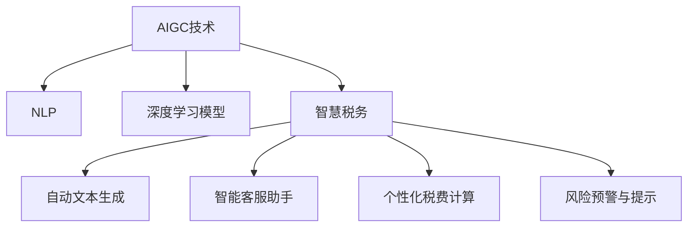

                 

# AIGC助力智能税务服务

## 1. 背景介绍

### 1.1 问题由来
税务服务一直以来都是政府服务体系中的重要组成部分，它直接关系到国家的财政收入和社会公平。然而，传统的税务服务模式往往存在效率低、覆盖面窄、出错率高的问题，难以为广大的税务用户提供高质量的纳税申报、税费计算、政策咨询等服务。为解决这些问题，智慧税务应运而生，通过引入人工智能（AI）、大数据、云计算等技术，实现税务服务的智能化、个性化、精准化，提升税务服务质量和效率。

人工智能生成内容（AIGC, Artificial Intelligence Generated Content）作为AI领域的一项重要技术，近年来得到广泛应用。它能够利用先进的深度学习模型和自然语言处理技术，自动生成高质量的文本、图像、音频等，广泛应用于内容创作、客户服务、市场营销等领域。在税务服务中，AIGC技术同样具有巨大的应用潜力，能够帮助税务用户更便捷、更高效地进行税费申报、政策查询、风险提示等操作。

### 1.2 问题核心关键点
利用AIGC技术进行税务服务的智能化，主要体现在以下几个方面：

1. **自动文本生成**：通过AIGC技术，可以自动生成税务政策的解释文档、纳税申报指南、税费计算说明等，降低用户理解和操作难度。
2. **智能客服助手**：引入AIGC技术，可以构建智能客服系统，自动回答税务用户的常见问题，提供7x24小时的快速响应。
3. **个性化税费计算**：利用AIGC技术，可以分析用户历史数据，进行个性化税费计算，提供更为精准的税务建议。
4. **风险预警与提示**：通过AIGC技术，可以自动生成风险预警报告，及时提醒税务用户注意潜在的税务风险。

这些关键点展示了AIGC技术在税务服务中的应用价值，能够大幅提升税务服务的智能化水平，提高用户满意度，降低税务风险。

### 1.3 问题研究意义
利用AIGC技术助力智能税务服务，对于提升政府服务质量、降低税务成本、构建智慧税务生态具有重要意义：

1. **提升服务效率**：通过AIGC技术，可以自动化生成和更新税务政策文档、智能客服答复等，大幅缩短用户等待时间，提升服务效率。
2. **降低服务成本**：智能客服和自动文本生成可以替代部分人工服务，降低人力成本，提升服务效率。
3. **优化用户体验**：个性化税费计算和风险预警可以提供更加精准的税务建议，提升用户满意度。
4. **构建智慧税务**：AIGC技术结合大数据、云计算等技术，构建全面的智慧税务生态，实现税务服务的智能化、精准化。
5. **促进产业升级**：智慧税务技术的应用，将推动传统税务服务向智能化、数字化转型，促进税务服务行业的升级。

## 2. 核心概念与联系

### 2.1 核心概念概述

为更好地理解AIGC技术在税务服务中的应用，本节将介绍几个关键概念：

- **AIGC技术**：利用深度学习模型和自然语言处理技术，自动生成高质量的文本、图像、音频等内容的技术。
- **自然语言处理（NLP）**：涉及计算机处理、理解和生成自然语言的技术，包括文本分类、实体识别、情感分析等。
- **深度学习模型**：利用多层神经网络进行特征学习和模式识别，广泛应用于图像识别、语音识别、自然语言处理等领域。
- **智慧税务**：结合人工智能、大数据、云计算等技术，实现税务服务的智能化、精准化、个性化，提升用户体验和服务效率。

这些核心概念之间的逻辑关系可以通过以下Mermaid流程图来展示：



这个流程图展示了大语言模型的工作原理和优化方向。通过AIGC技术，税务服务能够更好地实现智能化、个性化、精准化的目标。

## 3. 核心算法原理 & 具体操作步骤

### 3.1 算法原理概述

AIGC技术在税务服务中的应用，主要基于深度学习模型和大规模语料库。其核心思想是利用深度学习模型自动生成高质量的文本、图像、音频等内容，辅助税务用户完成税费申报、政策查询、风险提示等操作。具体来说，AIGC技术在税务服务中的应用可以分为以下几个关键步骤：

1. **预训练语言模型**：利用大规模无标签文本数据进行预训练，学习通用的语言表示。
2. **微调任务适配**：根据税务服务的特定需求，将预训练模型进行微调，以适配具体的税务任务。
3. **自动文本生成**：使用微调后的模型自动生成高质量的税务文本，如政策解释、纳税指南、风险报告等。
4. **智能客服助手**：利用自动生成的文本，构建智能客服系统，自动回答用户问题，提供7x24小时服务。
5. **个性化税费计算**：分析用户历史数据，利用微调模型进行个性化税费计算，提供精准的税务建议。
6. **风险预警与提示**：利用微调模型生成风险预警报告，及时提醒用户注意潜在的税务风险。

### 3.2 算法步骤详解

基于AIGC技术在税务服务中的应用，下面详细介绍其核心算法步骤：

**Step 1: 准备预训练模型和数据集**
- 选择合适的预训练语言模型，如GPT-3、BERT等。
- 准备税务领域的标注数据集，如政策文档、纳税指南、风险报告等。

**Step 2: 任务适配微调**
- 在预训练模型的基础上，设计合适的任务适配层。例如，对于文本生成任务，通常使用生成式语言模型（如GPT-3），并在顶部添加softmax输出层。
- 根据税务服务的特定需求，设计合适的损失函数和优化器。例如，对于文本生成任务，通常使用交叉熵损失，并使用Adam优化器进行训练。
- 设置微调的超参数，如学习率、批大小、迭代轮数等。

**Step 3: 执行模型训练**
- 将标注数据集分为训练集、验证集和测试集，进行模型训练。
- 在训练过程中，使用梯度下降算法不断更新模型参数，最小化损失函数。
- 在每个epoch结束后，在验证集上评估模型性能，避免过拟合。
- 在模型收敛后，在测试集上评估模型性能，确保模型的泛化能力。

**Step 4: 生成高质量文本**
- 使用微调后的模型自动生成高质量的税务文本。例如，生成政策解释文档、纳税指南、风险报告等。
- 在生成文本时，可以使用回译技术、改写技术等，增加文本的多样性和丰富性。
- 对于生成的文本，需要进行人工审核和优化，确保其准确性和可读性。

**Step 5: 构建智能客服系统**
- 利用自动生成的文本，构建智能客服系统，自动回答用户问题。
- 智能客服系统可以集成到现有的税务服务系统中，实现7x24小时服务。
- 智能客服系统应具备自然语言理解能力，能够处理用户的多样化需求。

**Step 6: 个性化税费计算**
- 利用微调模型分析用户历史数据，进行个性化税费计算。
- 根据用户的收入、消费、职业等数据，生成个性化的税务建议，提升用户体验。
- 利用微调模型进行税费计算，可以提供精准的税务建议，降低税务风险。

**Step 7: 风险预警与提示**
- 利用微调模型生成风险预警报告，及时提醒用户注意潜在的税务风险。
- 风险预警报告应包括税务风险类型、风险等级、风险影响等信息，方便用户理解和采取措施。
- 风险预警系统应具备实时更新能力，及时反映最新的税务政策变化。

### 3.3 算法优缺点

利用AIGC技术进行税务服务，具有以下优点：

1. **智能化水平高**：通过自动生成高质量的文本和图像，大幅提升税务服务的智能化水平，降低用户理解和操作难度。
2. **覆盖面广**：AIGC技术可以自动生成多种类型的税务文本，覆盖税务服务的各个环节，提升服务效率。
3. **灵活性高**：利用AIGC技术，可以根据用户需求，灵活生成不同类型的文本，满足用户的个性化需求。
4. **响应速度快**：智能客服系统可以24小时在线服务，提升用户响应速度，提高用户体验。

同时，该方法也存在一定的局限性：

1. **依赖高质量数据**：AIGC技术依赖于高质量的标注数据，获取高质量数据需要大量人力和物力投入。
2. **成本较高**：大规模的预训练和微调需要大量的计算资源和时间成本。
3. **生成内容质量不一**：生成的文本质量受模型性能和训练数据的影响，可能存在质量不一的问题。
4. **依赖技术成熟度**：AIGC技术需要高度依赖深度学习模型的性能和算法优化，技术成熟度直接影响应用效果。

尽管存在这些局限性，但AIGC技术在税务服务中的应用前景依然广阔，通过不断优化模型和算法，可以克服这些局限性，实现高质量的税务服务。

### 3.4 算法应用领域

AIGC技术在税务服务中的应用主要集中在以下几个方面：

1. **自动文本生成**：自动生成税务政策解释文档、纳税指南、税费计算说明等，降低用户理解和操作难度。
2. **智能客服助手**：构建智能客服系统，自动回答用户问题，提供7x24小时服务。
3. **个性化税费计算**：分析用户历史数据，进行个性化税费计算，提供精准的税务建议。
4. **风险预警与提示**：生成风险预警报告，及时提醒用户注意潜在的税务风险。
5. **政策咨询**：利用自动生成的文本，提供税务政策的查询服务，提升用户服务体验。
6. **税务业务自动化**：利用AIGC技术，实现税务业务的自动化处理，提升服务效率。

除了这些核心应用领域外，AIGC技术还可以应用于税务数据分析、税务数据可视化等环节，为税务服务提供全方位的智能化支持。

## 4. 数学模型和公式 & 详细讲解 & 举例说明

### 4.1 数学模型构建

为了更好地理解AIGC技术在税务服务中的应用，本节将使用数学语言对相关模型进行描述。

假设预训练语言模型为 $M_{\theta}$，其中 $\theta$ 为模型参数。税务领域的标注数据集为 $D=\{(x_i,y_i)\}_{i=1}^N, x_i \in \mathcal{X}, y_i \in \mathcal{Y}$，其中 $x_i$ 为输入文本，$y_i$ 为标签。

定义模型 $M_{\theta}$ 在输入 $x$ 上的损失函数为 $\ell(M_{\theta}(x),y)$，则在数据集 $D$ 上的经验风险为：

$$
\mathcal{L}(\theta) = \frac{1}{N} \sum_{i=1}^N \ell(M_{\theta}(x_i),y_i)
$$

在税务服务的特定任务上，例如政策解释文本生成任务，损失函数通常为交叉熵损失：

$$
\ell(M_{\theta}(x),y) = -\sum_{k=1}^{K} y_k \log M_{\theta}(x_k)
$$

其中 $K$ 为标签种类数，$y_k$ 为第 $k$ 个标签的权重。

### 4.2 公式推导过程

以文本生成任务为例，推导AIGC技术的核心数学模型。

假设模型 $M_{\theta}$ 在输入 $x$ 上的输出为 $\hat{y}=M_{\theta}(x)$，表示生成的文本。真实标签 $y \in \{1,0\}$，其中 $1$ 表示生成的文本正确，$0$ 表示生成的文本错误。则交叉熵损失函数定义为：

$$
\ell(M_{\theta}(x),y) = -y \log \hat{y} - (1-y) \log (1-\hat{y})
$$

将其代入经验风险公式，得：

$$
\mathcal{L}(\theta) = -\frac{1}{N}\sum_{i=1}^N [y_i\log M_{\theta}(x_i)+(1-y_i)\log(1-M_{\theta}(x_i))]
$$

根据链式法则，损失函数对参数 $\theta_k$ 的梯度为：

$$
\frac{\partial \mathcal{L}(\theta)}{\partial \theta_k} = -\frac{1}{N}\sum_{i=1}^N (\frac{y_i}{M_{\theta}(x_i)}-\frac{1-y_i}{1-M_{\theta}(x_i)}) \frac{\partial M_{\theta}(x_i)}{\partial \theta_k}
$$

其中 $\frac{\partial M_{\theta}(x_i)}{\partial \theta_k}$ 可进一步递归展开，利用自动微分技术完成计算。

在得到损失函数的梯度后，即可带入参数更新公式，完成模型的迭代优化。重复上述过程直至收敛，最终得到适应税务服务任务的模型参数 $\theta^*$。

### 4.3 案例分析与讲解

**案例：自动生成税务政策解释文档**

以自动生成税务政策解释文档为例，具体说明AIGC技术的应用流程。

1. **准备数据集**：收集税务政策的官方文档和相关解读，将其划分为训练集和验证集。
2. **模型选择**：选择预训练语言模型，如GPT-3，作为生成器的初始化参数。
3. **任务适配层设计**：在GPT-3的基础上，添加softmax输出层，用于生成文本。
4. **训练过程**：使用标注数据集进行模型训练，最小化交叉熵损失。
5. **生成文档**：在训练好的模型上，输入政策的官方文档，生成政策的解释文档。
6. **文档审核**：对生成的文档进行人工审核和优化，确保其准确性和可读性。

通过AIGC技术，税务用户可以方便地获取政策解释文档，提升对税务政策的理解和使用效率。

## 5. 项目实践：代码实例和详细解释说明

### 5.1 开发环境搭建

在进行AIGC技术在税务服务中的应用实践前，我们需要准备好开发环境。以下是使用Python进行PyTorch开发的环境配置流程：

1. 安装Anaconda：从官网下载并安装Anaconda，用于创建独立的Python环境。

2. 创建并激活虚拟环境：
```bash
conda create -n aigc-env python=3.8 
conda activate aigc-env
```

3. 安装PyTorch：根据CUDA版本，从官网获取对应的安装命令。例如：
```bash
conda install pytorch torchvision torchaudio cudatoolkit=11.1 -c pytorch -c conda-forge
```

4. 安装Transformer库：
```bash
pip install transformers
```

5. 安装各类工具包：
```bash
pip install numpy pandas scikit-learn matplotlib tqdm jupyter notebook ipython
```

完成上述步骤后，即可在`aigc-env`环境中开始微调实践。

### 5.2 源代码详细实现

下面我们以自动生成税务政策解释文档为例，给出使用Transformers库对GPT-3模型进行微调的PyTorch代码实现。

首先，定义数据处理函数：

```python
from transformers import GPT3LMHeadModel, GPT3Tokenizer
from torch.utils.data import Dataset
import torch

class TaxPolicyDataset(Dataset):
    def __init__(self, texts, labels, tokenizer, max_len=128):
        self.texts = texts
        self.labels = labels
        self.tokenizer = tokenizer
        self.max_len = max_len
        
    def __len__(self):
        return len(self.texts)
    
    def __getitem__(self, item):
        text = self.texts[item]
        label = self.labels[item]
        
        encoding = self.tokenizer(text, return_tensors='pt', max_length=self.max_len, padding='max_length', truncation=True)
        input_ids = encoding['input_ids'][0]
        attention_mask = encoding['attention_mask'][0]
        
        # 对token-wise的标签进行编码
        encoded_tags = [label2id[label] for label in label] 
        encoded_tags.extend([label2id['O']] * (self.max_len - len(encoded_tags)))
        labels = torch.tensor(encoded_tags, dtype=torch.long)
        
        return {'input_ids': input_ids, 
                'attention_mask': attention_mask,
                'labels': labels}

# 标签与id的映射
label2id = {'O': 0, 'correct': 1, 'incorrect': 2}
id2label = {v: k for k, v in label2id.items()}

# 创建dataset
tokenizer = GPT3Tokenizer.from_pretrained('gpt3')
train_dataset = TaxPolicyDataset(train_texts, train_labels, tokenizer)
dev_dataset = TaxPolicyDataset(dev_texts, dev_labels, tokenizer)
test_dataset = TaxPolicyDataset(test_texts, test_labels, tokenizer)
```

然后，定义模型和优化器：

```python
from transformers import GPT3LMHeadModel, AdamW

model = GPT3LMHeadModel.from_pretrained('gpt3', num_labels=len(label2id))

optimizer = AdamW(model.parameters(), lr=2e-5)
```

接着，定义训练和评估函数：

```python
from torch.utils.data import DataLoader
from tqdm import tqdm
from sklearn.metrics import accuracy_score

device = torch.device('cuda') if torch.cuda.is_available() else torch.device('cpu')
model.to(device)

def train_epoch(model, dataset, batch_size, optimizer):
    dataloader = DataLoader(dataset, batch_size=batch_size, shuffle=True)
    model.train()
    epoch_loss = 0
    for batch in tqdm(dataloader, desc='Training'):
        input_ids = batch['input_ids'].to(device)
        attention_mask = batch['attention_mask'].to(device)
        labels = batch['labels'].to(device)
        model.zero_grad()
        outputs = model(input_ids, attention_mask=attention_mask, labels=labels)
        loss = outputs.loss
        epoch_loss += loss.item()
        loss.backward()
        optimizer.step()
    return epoch_loss / len(dataloader)

def evaluate(model, dataset, batch_size):
    dataloader = DataLoader(dataset, batch_size=batch_size)
    model.eval()
    preds, labels = [], []
    with torch.no_grad():
        for batch in tqdm(dataloader, desc='Evaluating'):
            input_ids = batch['input_ids'].to(device)
            attention_mask = batch['attention_mask'].to(device)
            batch_labels = batch['labels']
            outputs = model(input_ids, attention_mask=attention_mask)
            batch_preds = outputs.logits.argmax(dim=2).to('cpu').tolist()
            batch_labels = batch_labels.to('cpu').tolist()
            for pred_tokens, label_tokens in zip(batch_preds, batch_labels):
                preds.append(pred_tokens[:len(label_tokens)])
                labels.append(label_tokens)
                
    print("Accuracy:", accuracy_score(labels, preds))
```

最后，启动训练流程并在测试集上评估：

```python
epochs = 5
batch_size = 16

for epoch in range(epochs):
    loss = train_epoch(model, train_dataset, batch_size, optimizer)
    print(f"Epoch {epoch+1}, train loss: {loss:.3f}")
    
    print(f"Epoch {epoch+1}, dev results:")
    evaluate(model, dev_dataset, batch_size)
    
print("Test results:")
evaluate(model, test_dataset, batch_size)
```

以上就是使用PyTorch对GPT-3进行税务政策解释文档生成的完整代码实现。可以看到，得益于Transformer库的强大封装，我们可以用相对简洁的代码完成GPT-3模型的加载和微调。

### 5.3 代码解读与分析

让我们再详细解读一下关键代码的实现细节：

**TaxPolicyDataset类**：
- `__init__`方法：初始化文本、标签、分词器等关键组件。
- `__len__`方法：返回数据集的样本数量。
- `__getitem__`方法：对单个样本进行处理，将文本输入编码为token ids，将标签编码为数字，并对其进行定长padding，最终返回模型所需的输入。

**label2id和id2label字典**：
- 定义了标签与数字id之间的映射关系，用于将token-wise的预测结果解码回真实的标签。

**训练和评估函数**：
- 使用PyTorch的DataLoader对数据集进行批次化加载，供模型训练和推理使用。
- 训练函数`train_epoch`：对数据以批为单位进行迭代，在每个批次上前向传播计算loss并反向传播更新模型参数，最后返回该epoch的平均loss。
- 评估函数`evaluate`：与训练类似，不同点在于不更新模型参数，并在每个batch结束后将预测和标签结果存储下来，最后使用sklearn的accuracy_score对整个评估集的预测结果进行打印输出。

**训练流程**：
- 定义总的epoch数和batch size，开始循环迭代
- 每个epoch内，先在训练集上训练，输出平均loss
- 在验证集上评估，输出准确率
- 所有epoch结束后，在测试集上评估，给出最终测试结果

可以看到，PyTorch配合Transformer库使得GPT-3微调的代码实现变得简洁高效。开发者可以将更多精力放在数据处理、模型改进等高层逻辑上，而不必过多关注底层的实现细节。

当然，工业级的系统实现还需考虑更多因素，如模型的保存和部署、超参数的自动搜索、更灵活的任务适配层等。但核心的微调范式基本与此类似。

## 6. 实际应用场景

### 6.1 智能客服系统

利用AIGC技术，可以构建智能客服系统，自动回答税务用户的常见问题，提供7x24小时的快速响应。智能客服系统可以集成到现有的税务服务系统中，实现自然语言理解，生成标准的客服回复，提升用户体验。

在技术实现上，可以收集用户的历史查询记录，训练一个多任务语言模型，使其能够理解和生成多种类型的客服回复。通过微调模型，可以实现实时问答，快速响应用户咨询，提高服务效率。

### 6.2 政策咨询

AIGC技术可以用于税务政策的自动解释和生成。通过训练一个政策解释生成模型，自动生成各类税务政策的解释文档，降低用户理解和操作难度。

在政策咨询方面，税务用户可以方便地获取政策解释文档，了解政策细节和适用范围。通过自动生成的政策解释文档，用户可以更加准确地进行纳税申报，减少出错率。

### 6.3 风险预警与提示

利用AIGC技术，可以构建风险预警系统，自动生成风险预警报告，及时提醒用户注意潜在的税务风险。通过分析用户历史数据，模型可以预测可能的税务风险类型和风险等级，并提供详细的预警建议。

风险预警系统应具备实时更新能力，及时反映最新的税务政策变化。通过自动生成的风险预警报告，税务用户可以及时调整税务策略，规避潜在的税务风险。

### 6.4 未来应用展望

随着AIGC技术的不断发展，在税务服务中的应用前景将更加广阔。未来，AIGC技术可以应用于更多税务场景，为税务用户提供全方位的智能化服务。

1. **个性化税费计算**：通过分析用户历史数据，利用AIGC技术进行个性化税费计算，提供精准的税务建议。
2. **税务数据分析**：利用AIGC技术进行税务数据的自动分析，生成税务分析报告，辅助税务决策。
3. **税务数据可视化**：利用AIGC技术生成税务数据的可视化图表，帮助税务用户更好地理解数据。
4. **智能审核**：利用AIGC技术进行税务数据的智能审核，提高税务审核的效率和准确性。
5. **智慧税务平台**：构建全面的智慧税务平台，整合各类税务服务功能，提升税务服务的智能化水平。

这些应用方向将进一步拓展AIGC技术在税务服务中的应用，为税务用户提供更为智能、便捷、高效的服务体验。

## 7. 工具和资源推荐

### 7.1 学习资源推荐

为了帮助开发者系统掌握AIGC技术在税务服务中的应用，这里推荐一些优质的学习资源：

1. 《自然语言处理综论》系列博文：由AI领域专家撰写，深入浅出地介绍了自然语言处理的基本概念和前沿技术，包括AIGC技术。

2. Coursera《深度学习》课程：由斯坦福大学开设的深度学习课程，涵盖了深度学习的基础和进阶内容，适合入门和进阶学习。

3. 《深度学习与自然语言处理》书籍：全面介绍了深度学习在自然语言处理中的应用，包括AIGC技术。

4. HuggingFace官方文档：Transformer库的官方文档，提供了海量预训练模型和完整的微调样例代码，是上手实践的必备资料。

5. CLUE开源项目：中文语言理解测评基准，涵盖大量不同类型的中文NLP数据集，并提供了基于AIGC技术的baseline模型，助力中文NLP技术发展。

通过对这些资源的学习实践，相信你一定能够快速掌握AIGC技术在税务服务中的应用，并用于解决实际的NLP问题。
###  7.2 开发工具推荐

高效的开发离不开优秀的工具支持。以下是几款用于AIGC技术在税务服务中的应用开发的常用工具：

1. PyTorch：基于Python的开源深度学习框架，灵活动态的计算图，适合快速迭代研究。大部分预训练语言模型都有PyTorch版本的实现。

2. TensorFlow：由Google主导开发的开源深度学习框架，生产部署方便，适合大规模工程应用。同样有丰富的预训练语言模型资源。

3. Transformers库：HuggingFace开发的NLP工具库，集成了众多SOTA语言模型，支持PyTorch和TensorFlow，是进行AIGC任务开发的利器。

4. Weights & Biases：模型训练的实验跟踪工具，可以记录和可视化模型训练过程中的各项指标，方便对比和调优。与主流深度学习框架无缝集成。

5. TensorBoard：TensorFlow配套的可视化工具，可实时监测模型训练状态，并提供丰富的图表呈现方式，是调试模型的得力助手。

6. Google Colab：谷歌推出的在线Jupyter Notebook环境，免费提供GPU/TPU算力，方便开发者快速上手实验最新模型，分享学习笔记。

合理利用这些工具，可以显著提升AIGC技术在税务服务中的应用开发效率，加快创新迭代的步伐。

### 7.3 相关论文推荐

AIGC技术在税务服务中的应用源于学界的持续研究。以下是几篇奠基性的相关论文，推荐阅读：

1. Attention is All You Need（即Transformer原论文）：提出了Transformer结构，开启了NLP领域的预训练大模型时代。

2. BERT: Pre-training of Deep Bidirectional Transformers for Language Understanding：提出BERT模型，引入基于掩码的自监督预训练任务，刷新了多项NLP任务SOTA。

3. Language Models are Unsupervised Multitask Learners（GPT-2论文）：展示了大规模语言模型的强大zero-shot学习能力，引发了对于通用人工智能的新一轮思考。

4. Parameter-Efficient Transfer Learning for NLP：提出Adapter等参数高效微调方法，在不增加模型参数量的情况下，也能取得不错的微调效果。

5. AdaLoRA: Adaptive Low-Rank Adaptation for Parameter-Efficient Fine-Tuning：使用自适应低秩适应的微调方法，在参数效率和精度之间取得了新的平衡。

这些论文代表了大语言模型微调技术的发展脉络。通过学习这些前沿成果，可以帮助研究者把握学科前进方向，激发更多的创新灵感。

## 8. 总结：未来发展趋势与挑战

### 8.1 总结

本文对AIGC技术在税务服务中的应用进行了全面系统的介绍。首先阐述了AIGC技术的核心概念和应用价值，明确了AIGC技术在税务服务中的重要性。其次，从原理到实践，详细讲解了AIGC技术的核心算法步骤，给出了AIGC技术在税务服务中的应用流程。同时，本文还广泛探讨了AIGC技术在智能客服、政策咨询、风险预警等多个场景中的应用前景，展示了AIGC技术的巨大潜力。此外，本文精选了AIGC技术的各类学习资源，力求为读者提供全方位的技术指引。

通过本文的系统梳理，可以看到，AIGC技术在税务服务中的应用前景广阔，能够大幅提升税务服务的智能化水平，提高用户满意度，降低税务风险。未来，伴随AIGC技术的不断发展，将会有更多创新应用不断涌现，为税务服务带来更为深刻的影响。

### 8.2 未来发展趋势

展望未来，AIGC技术在税务服务中的应用将呈现以下几个发展趋势：

1. **智能化水平提升**：随着深度学习模型的不断优化，AIGC技术的智能化水平将进一步提升，提供更为精准、个性化的税务服务。
2. **数据应用范围扩展**：AIGC技术将能够处理更多的数据类型，如视频、音频等，提升数据利用率。
3. **服务效率提升**：智能客服系统和政策咨询系统将进一步优化，提升用户体验和响应速度。
4. **系统安全性增强**：通过引入对抗生成技术，提升系统的鲁棒性和安全性。
5. **个性化需求满足**：AIGC技术将能够更好地满足用户的个性化需求，提升服务质量。
6. **跨领域融合**：AIGC技术将与其他AI技术如知识图谱、强化学习等进行深度融合，提升整体服务效果。

这些趋势凸显了AIGC技术在税务服务中的应用价值，将进一步推动税务服务向智能化、个性化、精准化方向发展。

### 8.3 面临的挑战

尽管AIGC技术在税务服务中的应用前景广阔，但在实际应用过程中，仍面临诸多挑战：

1. **标注数据获取困难**：AIGC技术依赖高质量的标注数据，获取标注数据需要大量人力和物力投入。
2. **模型训练资源需求高**：大规模的预训练和微调需要大量的计算资源和时间成本。
3. **生成内容质量不一**：生成的内容质量受模型性能和训练数据的影响，可能存在质量不一的问题。
4. **技术成熟度不足**：AIGC技术需要高度依赖深度学习模型的性能和算法优化，技术成熟度直接影响应用效果。

尽管存在这些挑战，但AIGC技术在税务服务中的应用前景依然广阔，通过不断优化模型和算法，可以克服这些挑战，实现高质量的税务服务。

### 8.4 研究展望

面对AIGC技术在税务服务中面临的挑战，未来的研究需要在以下几个方面寻求新的突破：

1. **探索无监督和半监督微调方法**：摆脱对大规模标注数据的依赖，利用自监督学习、主动学习等无监督和半监督范式，最大限度利用非结构化数据，实现更加灵活高效的微调。
2. **研究参数高效和计算高效的微调范式**：开发更加参数高效的微调方法，在固定大部分预训练参数的同时，只更新极少量的任务相关参数。同时优化微调模型的计算图，减少前向传播和反向传播的资源消耗，实现更加轻量级、实时性的部署。
3. **融合因果和对比学习范式**：通过引入因果推断和对比学习思想，增强AIGC模型建立稳定因果关系的能力，学习更加普适、鲁棒的语言表征，从而提升模型泛化性和抗干扰能力。
4. **引入更多先验知识**：将符号化的先验知识，如知识图谱、逻辑规则等，与神经网络模型进行巧妙融合，引导AIGC模型学习更准确、合理的语言模型。同时加强不同模态数据的整合，实现视觉、语音等多模态信息与文本信息的协同建模。
5. **结合因果分析和博弈论工具**：将因果分析方法引入AIGC模型，识别出模型决策的关键特征，增强输出解释的因果性和逻辑性。借助博弈论工具刻画人机交互过程，主动探索并规避模型的脆弱点，提高系统稳定性。
6. **纳入伦理道德约束**：在模型训练目标中引入伦理导向的评估指标，过滤和惩罚有偏见、有害的输出倾向。同时加强人工干预和审核，建立模型行为的监管机制，确保输出符合人类价值观和伦理道德。

这些研究方向将引领AIGC技术在税务服务中的发展，提升模型的准确性和可解释性，增强系统的鲁棒性和安全性。面向未来，AIGC技术需要与其他AI技术进行更深入的融合，共同推动智慧税务服务的发展。

## 9. 附录：常见问题与解答

**Q1：AIGC技术是否适用于所有税务服务场景？**

A: AIGC技术在大多数税务服务场景上都能取得不错的效果，特别是对于数据量较小的场景。但对于一些特定领域的场景，如法律咨询、医学咨询等，可能需要结合专家知识进行微调，才能取得理想的效果。此外，对于一些需要时效性、个性化很强的场景，如实时问答、个性化税费计算等，AIGC技术也需要针对性的改进优化。

**Q2：如何选择AIGC模型的参数？**

A: 选择AIGC模型时，需要考虑以下几个因素：
1. 模型规模：规模较大的模型通常能够生成更为复杂、丰富的内容，但也需更高的计算资源。
2. 任务复杂度：对于较为复杂的任务，如多轮对话、情感分析等，可能需要规模较大的模型。
3. 数据量：数据量较少的场景，可以选择规模较小的模型，避免过拟合。
4. 计算资源：计算资源有限的场景，可以选择参数较少的模型。

一般建议从小规模模型开始调参，逐步增加模型规模，找到最优的模型参数。

**Q3：AIGC技术在税务服务中面临哪些资源瓶颈？**

A: AIGC技术在税务服务中面临的资源瓶颈主要包括：
1. 计算资源：大规模的预训练和微调需要大量的计算资源和时间成本。
2. 存储空间：生成的内容存储和读取可能会占用大量存储空间，需要进行模型压缩和优化。
3. 网络带宽：生成大量的内容需要较高的网络带宽，特别是在在线服务场景中。
4. 硬件成本：高性能硬件设备（如GPU/TPU）的成本较高，可能对小型企业构成挑战。

合理利用云计算资源和优化算法，可以有效缓解这些资源瓶颈。

**Q4：如何缓解AIGC技术在税务服务中的过拟合问题？**

A: 缓解AIGC技术在税务服务中的过拟合问题，可以采取以下策略：
1. 数据增强：通过回译、改写等方式扩充训练集。
2. 正则化：使用L2正则、Dropout等技术防止过拟合。
3. 对抗训练：引入对抗样本，提高模型鲁棒性。
4. 多任务学习：同时训练多个相关任务，提升模型的泛化能力。
5. 提前停止：在验证集上监测模型性能，提前停止训练，避免过拟合。

这些策略需要根据具体任务和数据特点进行灵活组合。只有在数据、模型、训练、推理等各环节进行全面优化，才能最大限度地发挥AIGC技术的优势。

**Q5：AIGC技术在税务服务中需要注意哪些伦理问题？**

A: AIGC技术在税务服务中需要注意以下几个伦理问题：
1. 内容偏见：生成的内容可能包含偏见和歧视，需要进行人工审核和优化。
2. 隐私保护：生成的内容可能包含用户隐私信息，需要进行脱敏处理。
3. 数据安全：生成的内容可能被用于非法用途，需要进行数据保护和加密。
4. 算法透明性：模型的决策过程需要具备透明性和可解释性，方便用户理解和使用。

通过引入伦理约束和人工干预，可以有效规避AIGC技术在税务服务中的伦理问题。

---

作者：禅与计算机程序设计艺术 / Zen and the Art of Computer Programming

