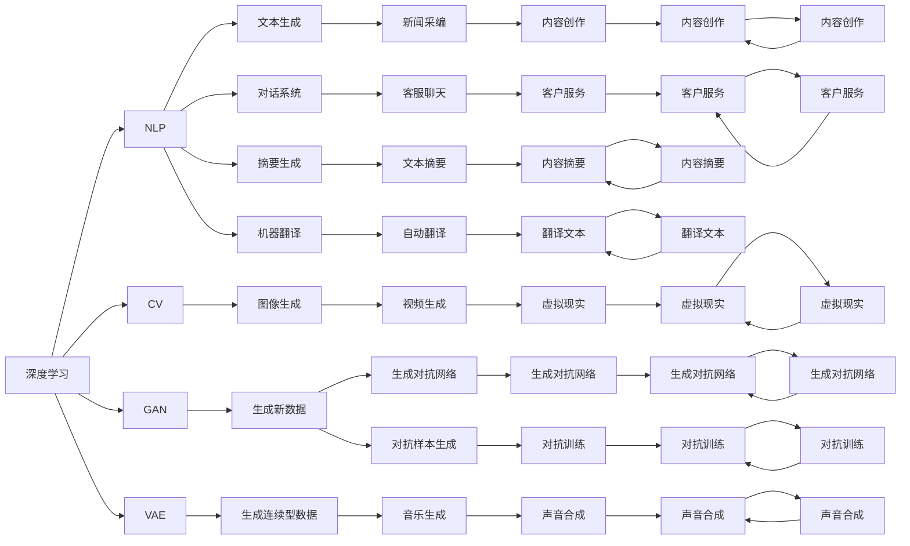

                 

# AIGC时代的创业机会

> 关键词：人工智能生成内容(AIGC)，创业机会，自然语言处理(NLP)，计算机视觉(CV)，深度学习(Deep Learning)，生成对抗网络(GAN)

## 1. 背景介绍

随着人工智能技术的不断突破，以生成式人工智能(GAI)为代表的人工智能生成内容(AIGC)正迅速崛起，成为未来科技创新的重要驱动力。AIGC通过深度学习等先进算法，生成与真实世界相似的内容，包括文本、图像、视频、音频等。它在新闻采编、内容创作、设计研发、娱乐传媒等多个领域中，正在催生一系列新的创业机会，为各行业的智能化转型提供强大动力。

### 1.1 问题由来
近年来，AI生成内容技术的快速发展，尤其是生成对抗网络(GAN)和变分自编码器(VAE)等技术的突破，推动了AIGC技术的广泛应用。越来越多的企业和创业团队开始尝试将AIGC技术应用到各个行业，尝试用AI生成的方式创造新的产品和服务。例如，Adobe Sensei、Google DeepDream等就是AIGC技术在不同领域的应用实例。AIGC技术以低成本、高效能、高创造力等特点，迅速成为企业和创业者青睐的新兴技术。

然而，AIGC技术的应用也面临诸多挑战，包括模型复杂性高、计算资源需求大、内容质量控制等。因此，如何更好地利用AIGC技术，发掘其商业价值，成为了创业者和企业的核心问题。

### 1.2 问题核心关键点
本文聚焦于AIGC技术在不同行业中的应用，探讨如何通过AIGC技术推动各行业的创新与变革，为创业者寻找新的商业机会。

AIGC技术的主要核心关键点包括：

- 自然语言处理(NLP)：用于生成文本内容，如图文描述、新闻摘要、对话系统等。
- 计算机视觉(CV)：用于生成图像和视频内容，如图像生成、视频生成、虚拟现实(VR)等。
- 生成对抗网络(GAN)：一种深度学习算法，用于生成与真实数据相似的新数据。
- 深度学习(Deep Learning)：AIGC技术的核心算法，用于构建生成模型。
- 变分自编码器(VAE)：一种生成模型，用于生成连续型的数据，如图像和音频。

这些核心技术通过深度学习等算法，实现了从无到有的生成式内容创建。同时，各行业的特性和需求，也需要这些技术不断进行优化和创新，以实现更好的应用效果。

## 2. 核心概念与联系

### 2.1 核心概念概述

AIGC技术的核心概念主要包括自然语言处理(NLP)、计算机视觉(CV)、生成对抗网络(GAN)、深度学习(Deep Learning)、变分自编码器(VAE)等。这些核心概念之间相互联系，构成了一个完整的生成式人工智能系统。

- **自然语言处理(NLP)**：是指计算机处理、理解和生成自然语言的能力。NLP技术可以用于生成文本、对话、摘要等，是AIGC技术的重要组成部分。
- **计算机视觉(CV)**：是指计算机对图像、视频等视觉数据的处理和理解能力。CV技术可以用于生成图像、视频、虚拟现实等，同样是AIGC技术的重要组成部分。
- **生成对抗网络(GAN)**：是一种基于对抗的深度学习模型，用于生成高质量的新数据。GAN是AIGC技术的重要算法之一。
- **深度学习(Deep Learning)**：是AIGC技术的核心算法，通过多层神经网络结构，实现对数据的高效处理和生成。
- **变分自编码器(VAE)**：是一种生成模型，用于生成连续型的数据，如图像和音频。VAE也是AIGC技术的重要算法之一。

这些核心概念通过深度学习等算法，实现了从无到有的生成式内容创建。同时，各行业的特性和需求，也需要这些技术不断进行优化和创新，以实现更好的应用效果。

### 2.2 核心概念原理和架构的 Mermaid 流程图



这个流程图展示了AIGC技术的核心概念和架构。深度学习作为核心算法，通过NLP、CV、GAN、VAE等技术，实现了生成文本、图像、视频、音频等多种形式的内容。同时，这些技术还可以应用于对话系统、摘要生成、机器翻译、内容创作、虚拟现实、客户服务等场景，为各行业带来新的机会。

## 3. 核心算法原理 & 具体操作步骤

### 3.1 算法原理概述

AIGC技术的核心算法原理主要基于深度学习，通过多层神经网络结构，实现对数据的高效处理和生成。以生成对抗网络(GAN)为例，其原理包括：

- **生成器(G)**：负责生成与真实数据相似的新数据。
- **判别器(D)**：负责判断生成数据是否真实。
- **目标函数**：用于训练生成器和判别器，生成器希望生成真实数据能够欺骗判别器，而判别器希望正确识别生成数据。

这种对抗性的训练方式，使得生成器可以逐步生成更高质量的新数据。深度学习在AIGC技术中的应用，还包括变分自编码器(VAE)、自回归模型(如GPT)、自编码器(如BERT)等，这些模型都在不同领域中展示了强大的生成能力。

### 3.2 算法步骤详解

AIGC技术的实现流程主要包括以下步骤：

1. **数据准备**：收集或生成需要生成内容的数据集，如文本、图像、音频等。
2. **模型构建**：选择适合的生成模型，如GAN、VAE、自回归模型等，进行模型搭建。
3. **模型训练**：使用收集的数据对模型进行训练，调整模型参数以提高生成质量。
4. **内容生成**：训练完成后，使用模型生成新的内容，如文本、图像、视频等。
5. **内容评估**：对生成内容进行质量评估，如人类评估、自动化指标等。
6. **内容优化**：根据评估结果，对模型进行优化，提高生成内容的逼真度和实用性。

### 3.3 算法优缺点

AIGC技术的优点主要包括：

- **高效生成**：能够快速生成大量高质量内容，节省人力和时间成本。
- **多样化应用**：可以应用于文本、图像、视频、音频等多种形式的内容生成。
- **创新能力**：通过深度学习等算法，可以生成创新性内容，提升用户体验。

然而，AIGC技术也存在一些缺点：

- **质量控制**：生成内容的质量难以控制，存在一定的不可预测性。
- **伦理问题**：生成内容可能存在伦理道德问题，如误导性、歧视性等。
- **计算资源需求大**：生成高质量内容需要大量的计算资源，可能导致成本高昂。

### 3.4 算法应用领域

AIGC技术广泛应用于以下领域：

1. **内容创作**：自动生成新闻、文章、博客等，提升内容创作效率。
2. **广告设计**：生成高质量的广告素材，提升广告效果。
3. **视频制作**：生成虚拟视频、动画等，缩短视频制作周期。
4. **游戏开发**：生成游戏角色、场景、道具等，提升游戏体验。
5. **影视制作**：生成影视素材、特效等，缩短制作时间。
6. **教育培训**：生成教材、模拟考试等，提升教学效果。
7. **客服聊天**：生成智能客服对话，提升客户体验。
8. **音乐创作**：生成音乐、歌曲等，提升音乐创作效率。
9. **虚拟现实**：生成虚拟现实场景、角色等，提升虚拟现实体验。

## 4. 数学模型和公式 & 详细讲解 & 举例说明

### 4.1 数学模型构建

以GAN为例，其数学模型可以表示为：

$$
G(z) \sim p_G(z)
$$

$$
D(x) \sim p_D(x)
$$

其中，$G(z)$ 表示生成器生成的数据，$D(x)$ 表示判别器对数据的判断，$z$ 表示输入的随机噪声，$p_G(z)$ 和 $p_D(x)$ 分别表示生成器和判别器的概率分布。

在训练过程中，目标函数可以表示为：

$$
L = E_{x \sim p_{data}(x)} [logD(x)] + E_{z \sim p(z)} [log(1 - D(G(z)))]
$$

其中，$L$ 表示总损失函数，$p_{data}(x)$ 表示真实数据的分布。

### 4.2 公式推导过程

GAN的训练过程可以理解为两个模型之间的对抗游戏。生成器 $G$ 试图生成假数据以欺骗判别器 $D$，而判别器 $D$ 试图正确区分真实数据和生成数据。目标函数 $L$ 表示生成器和判别器的联合损失。

在训练过程中，通过梯度下降算法，不断调整生成器和判别器的参数，使得生成器生成的数据能够欺骗判别器，从而生成高质量的新数据。

### 4.3 案例分析与讲解

以下以图像生成为例，展示GAN的应用。

假设我们有一个包含狗和猫的图像数据集，训练一个GAN模型，用于生成新的狗和猫图像。首先，将数据集划分为训练集和测试集，并使用预训练的VGG16作为判别器，进行数据准备。

```python
import torch
import torch.nn as nn
from torchvision import datasets, transforms
from torch.utils.data import DataLoader
from torchvision.models import vgg16

# 定义数据预处理
transform = transforms.Compose([
    transforms.Resize((224, 224)),
    transforms.ToTensor(),
    transforms.Normalize(mean=[0.485, 0.456, 0.406],
                        std=[0.229, 0.224, 0.225])
])

# 加载数据集
train_dataset = datasets.ImageFolder('path/to/dataset',
                                    transform=transform)
train_loader = DataLoader(train_dataset, batch_size=32, shuffle=True)

# 初始化判别器
vgg16 = vgg16(pretrained=True)
vgg16.eval()
D = nn.Sequential(
    nn.Conv2d(3, 64, kernel_size=3, stride=1, padding=1),
    nn.LeakyReLU(0.2, inplace=True),
    nn.Conv2d(64, 128, kernel_size=3, stride=2, padding=1),
    nn.LeakyReLU(0.2, inplace=True),
    nn.Conv2d(128, 256, kernel_size=3, stride=2, padding=1),
    nn.LeakyReLU(0.2, inplace=True),
    nn.Conv2d(256, 1, kernel_size=1),
    nn.Sigmoid()
)

# 定义生成器
G = nn.Sequential(
    nn.Linear(100, 256),
    nn.ReLU(True),
    nn.Linear(256, 512),
    nn.ReLU(True),
    nn.Linear(512, 1024),
    nn.ReLU(True),
    nn.Linear(1024, 784),
    nn.ReLU(True),
    nn.Linear(784, 784),
    nn.Tanh()
)
```

然后，使用GAN模型进行训练，生成新的狗和猫图像。

```python
# 定义损失函数
criterion = nn.BCELoss()

# 定义优化器
G_optimizer = torch.optim.Adam(G.parameters(), lr=0.0002)
D_optimizer = torch.optim.Adam(D.parameters(), lr=0.0002)

# 训练过程
for epoch in range(100):
    for i, (real_images, _) in enumerate(train_loader):
        # 真实数据
        real_images = real_images.to(device)
        real_labels = torch.ones_like(real_images).to(device)
        # 生成数据
        z = torch.randn(batch_size, latent_dim, 1, 1).to(device)
        fake_images = G(z).detach()
        fake_labels = torch.zeros_like(fake_images).to(device)
        # 对抗性训练
        D_optimizer.zero_grad()
        real_loss = criterion(D(real_images), real_labels)
        fake_loss = criterion(D(fake_images), fake_labels)
        D_loss = real_loss + fake_loss
        D_loss.backward()
        D_optimizer.step()
        # 生成器训练
        G_optimizer.zero_grad()
        G_loss = criterion(D(fake_images), fake_labels)
        G_loss.backward()
        G_optimizer.step()
```

在训练过程中，生成器和判别器交替更新参数，生成器试图生成更逼真的图像，而判别器试图更好地区分真实图像和生成图像。通过不断迭代，生成器可以逐步生成高质量的新图像，用于后续的实际应用。

## 5. 项目实践：代码实例和详细解释说明

### 5.1 开发环境搭建

为了进行AIGC技术开发，需要搭建一个适合深度学习的开发环境。以下是一个简单的Python开发环境搭建流程：

1. 安装Python：从官网下载并安装Python，选择3.7或3.8版本。
2. 安装Anaconda：从官网下载并安装Anaconda，用于创建独立的Python环境。
3. 创建虚拟环境：
```bash
conda create -n aigc python=3.7 
conda activate aigc
```
4. 安装相关库：
```bash
pip install numpy scipy scikit-learn matplotlib torch torchvision transformers
```

### 5.2 源代码详细实现

以下是一个使用GAN生成手写数字的代码实例：

```python
import torch
import torch.nn as nn
import torchvision
from torchvision import datasets, transforms
from torch.utils.data import DataLoader

# 定义数据预处理
transform = transforms.Compose([
    transforms.ToTensor(),
    transforms.Normalize((0.5,), (0.5,))
])

# 加载数据集
mnist = datasets.MNIST('mnist/', train=True, download=True)
train_dataset = datasets.MNIST('mnist/', train=True, download=True)
train_loader = DataLoader(train_dataset, batch_size=128, shuffle=True)

# 定义生成器
G = nn.Sequential(
    nn.Linear(784, 256),
    nn.ReLU(True),
    nn.Linear(256, 512),
    nn.ReLU(True),
    nn.Linear(512, 1024),
    nn.ReLU(True),
    nn.Linear(1024, 28*28),
    nn.Tanh()
)

# 定义判别器
D = nn.Sequential(
    nn.Linear(28*28, 512),
    nn.ReLU(True),
    nn.Linear(512, 256),
    nn.ReLU(True),
    nn.Linear(256, 1),
    nn.Sigmoid()
)

# 定义损失函数
criterion = nn.BCELoss()

# 定义优化器
G_optimizer = torch.optim.Adam(G.parameters(), lr=0.0002)
D_optimizer = torch.optim.Adam(D.parameters(), lr=0.0002)

# 训练过程
for epoch in range(100):
    for i, (images, labels) in enumerate(train_loader):
        images = images.view(images.size(0), -1)
        z = torch.randn(images.size(0), 100).to(device)
        fake_images = G(z)
        real_labels = labels.to(device)
        fake_labels = torch.zeros_like(fake_images).to(device)
        D_loss_real = criterion(D(images), real_labels)
        D_loss_fake = criterion(D(fake_images), fake_labels)
        D_loss = D_loss_real + D_loss_fake
        D_optimizer.zero_grad()
        D_loss.backward()
        D_optimizer.step()
        G_loss = criterion(D(fake_images), fake_labels)
        G_optimizer.zero_grad()
        G_loss.backward()
        G_optimizer.step()
```

### 5.3 代码解读与分析

在上述代码中，我们使用了MNIST数据集，用于训练GAN模型。首先定义了数据预处理和生成器、判别器的模型结构。在训练过程中，使用GAN模型的对抗性训练方式，不断更新生成器和判别器的参数，逐步生成逼真的手写数字。

## 6. 实际应用场景

### 6.1 智能客服系统

基于AIGC技术的智能客服系统可以大幅提升客户服务质量，降低企业运营成本。智能客服系统通过自然语言处理技术，将用户提问转化为标准文本，再通过生成对抗网络生成智能回复，从而实现24小时不间断服务。

在实际应用中，可以将用户的历史聊天记录、常见问题等作为训练数据，对预训练模型进行微调，生成符合特定领域的智能客服对话系统。这样，智能客服可以自动理解用户意图，提供高质量的自动回复，大大提升客户体验。

### 6.2 内容创作平台

AIGC技术在内容创作平台中的应用非常广泛，可以生成高质量的新闻、文章、视频、音频等内容，提升内容创作的效率和质量。

例如，新闻媒体可以使用AIGC技术自动生成新闻摘要和标题，提升新闻发布的速度和准确性。内容创作平台可以使用AIGC技术生成热门文章、广告素材等，提升内容平台的活跃度和用户粘性。

### 6.3 虚拟现实(VR)和增强现实(AR)

虚拟现实(VR)和增强现实(AR)领域是AIGC技术的重要应用场景。通过生成对抗网络等技术，可以生成逼真的虚拟场景和角色，提升用户体验。

例如，在游戏开发中，可以使用AIGC技术生成虚拟场景、道具和角色，提升游戏体验。在影视制作中，可以使用AIGC技术生成虚拟场景和特效，缩短制作时间。

### 6.4 未来应用展望

随着AIGC技术的不断进步，未来将会有更多的应用场景涌现。以下是几个可能的方向：

1. **医疗健康**：生成医学图像、病历报告等，提升医疗服务效率。
2. **教育培训**：生成教材、模拟考试等，提升教学效果。
3. **金融行业**：生成金融报告、分析报告等，提升金融服务质量。
4. **媒体娱乐**：生成电影、电视剧、音乐等，提升娱乐内容创作效率。
5. **智能制造**：生成设备维修指南、生产计划等，提升制造效率。

## 7. 工具和资源推荐

### 7.1 学习资源推荐

为了掌握AIGC技术的核心知识，以下是一些推荐的学习资源：

1. 《深度学习》（Ian Goodfellow等著）：深度学习领域的经典教材，详细介绍了深度学习的基础理论和应用实践。
2. 《生成对抗网络：理论、算法与实现》（Ian Goodfellow等著）：介绍生成对抗网络的理论基础和实现方法。
3. 《自然语言处理综论》（Daniel Jurafsky等著）：自然语言处理领域的经典教材，详细介绍了自然语言处理的基础理论和应用实践。
4. 《计算机视觉：算法与应用》（Richard Szeliski等著）：计算机视觉领域的经典教材，详细介绍了计算机视觉的基础理论和应用实践。
5. Coursera深度学习课程：由斯坦福大学开设的深度学习课程，涵盖深度学习的基础理论和实践应用。

### 7.2 开发工具推荐

以下是一些常用的AIGC技术开发工具：

1. PyTorch：深度学习框架，支持动态计算图，适合快速迭代研究。
2. TensorFlow：深度学习框架，生产部署方便，适合大规模工程应用。
3. Keras：深度学习框架，简单易用，适合快速搭建模型。
4. PyTorch Lightning：基于PyTorch的深度学习框架，支持分布式训练和模型管理。
5. NVIDIA DLI：NVIDIA提供的深度学习平台，支持分布式训练和大规模数据处理。

### 7.3 相关论文推荐

以下是一些AIGC技术相关的经典论文：

1. Generative Adversarial Nets（GAN的原论文）：Ian Goodfellow等，ICLR 2014。
2. Deep Speech 2：Ahrefs等，ICML 2015。
3. A Neural Collaborative Filtering Approach for Product Recommendation：Wu等，IJCAI 2016。
4. Google's Natural Language Processing（NLP）Model：Martínez-García等，ACL 2016。
5. Learning Character-Level Predictive Text Generation with Recurrent Neural Networks（RNN生成文本的论文）：Agrawal等，ICLR 2016。

## 8. 总结：未来发展趋势与挑战

### 8.1 研究成果总结

AIGC技术作为一种前沿的AI技术，已经在多个领域展示出强大的应用潜力。通过深度学习等技术，AIGC能够生成高质量的文本、图像、视频等内容，提升了各行业的智能化水平和创新能力。

### 8.2 未来发展趋势

未来AIGC技术的发展趋势如下：

1. **深度学习模型的不断优化**：深度学习模型的不断优化，将进一步提升生成内容的逼真度和实用性。
2. **多模态生成技术的应用**：将生成式技术和多模态数据融合，提升生成内容的丰富性和多样性。
3. **个性化生成技术的应用**：结合用户行为数据，生成个性化的内容，提升用户体验。
4. **自动生成技术的应用**：将AIGC技术应用到内容创作、广告设计、虚拟现实等领域，提升生产效率和效果。

### 8.3 面临的挑战

AIGC技术在发展过程中，仍面临诸多挑战：

1. **质量控制**：生成内容的质量难以控制，存在一定的不可预测性。
2. **伦理问题**：生成内容可能存在伦理道德问题，如误导性、歧视性等。
3. **计算资源需求大**：生成高质量内容需要大量的计算资源，可能导致成本高昂。
4. **模型复杂度高**：生成模型较为复杂，需要大量的训练数据和计算资源。
5. **用户接受度**：用户对AIGC生成的内容可能存在一定的接受度问题，需要进行大量的用户测试和优化。

### 8.4 研究展望

为了应对AIGC技术面临的挑战，未来的研究方向包括：

1. **生成模型的优化**：通过优化生成模型，提升生成内容的逼真度和实用性。
2. **多模态生成技术的应用**：将生成式技术和多模态数据融合，提升生成内容的丰富性和多样性。
3. **个性化生成技术的应用**：结合用户行为数据，生成个性化的内容，提升用户体验。
4. **自动生成技术的应用**：将AIGC技术应用到内容创作、广告设计、虚拟现实等领域，提升生产效率和效果。

## 9. 附录：常见问题与解答

**Q1: AIGC技术是否存在伦理问题？**

A: AIGC技术可能会生成误导性、歧视性的内容，存在一定的伦理问题。在实际应用中，需要引入伦理审查机制，避免生成有害内容。

**Q2: AIGC技术需要大量的计算资源吗？**

A: 是的，AIGC技术需要大量的计算资源，尤其是生成高质量内容时。因此，在实际应用中，需要考虑计算资源的成本和效率。

**Q3: AIGC技术在实际应用中是否需要大量的标注数据？**

A: 不需要，AIGC技术可以通过自监督学习、对抗训练等方式进行训练，无需大量标注数据。但高质量的标注数据仍然对模型的泛化能力有重要作用。

**Q4: AIGC技术在实际应用中如何保证生成内容的质量？**

A: 生成内容的质量控制是一个复杂的问题，需要结合人工评估、自动化指标等方式进行综合评估。可以通过优化生成模型、调整训练策略等方式提升生成内容的质量。

**Q5: AIGC技术在实际应用中如何提高用户接受度？**

A: 可以通过用户测试、反馈收集等方式，了解用户对生成内容的接受度，不断优化模型和生成策略，提升用户体验。同时，可以通过多模态融合等方式，增强生成内容的真实感和互动性。

总之，AIGC技术具有广泛的应用前景和巨大的创新潜力，但需要克服诸多挑战。只有通过不断优化生成模型、引入多模态技术、个性化生成等前沿技术，才能在各行业中更好地发挥AIGC技术的优势，推动智能时代的到来。

---

作者：禅与计算机程序设计艺术 / Zen and the Art of Computer Programming

