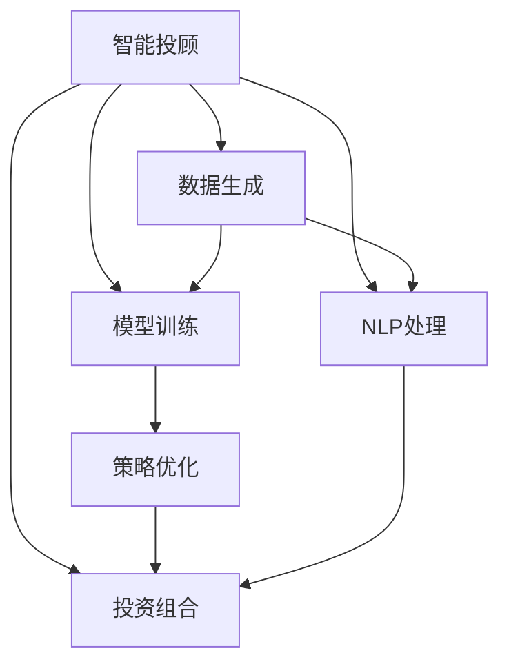

                 

## 1. 背景介绍

### 1.1 问题由来

随着金融市场的快速发展，个人投资者面临着越来越复杂的投资选择和信息过载问题。传统金融顾问服务由于人力成本高、覆盖面有限，难以满足大规模投资者的个性化需求。而人工智能（AI）和生成对抗网络（GAN）技术的崛起，为智能投顾服务带来了新的突破。

智能投顾（Robo-Advisors）通过算法模型为用户定制个性化投资组合，降低投资门槛，提升投资回报。然而，目前的智能投顾系统在模型训练、风险管理、策略优化等方面仍面临诸多挑战。幸运的是，生成对抗网络（GAN）技术的引入，为智能投顾服务带来了革命性的改进。

### 1.2 问题核心关键点

本节将深入探讨AIGC（Artificial Intelligence Generated Content，即人工智能生成的内容）如何赋能智能投顾服务，涵盖以下几个关键点：

1. **数据生成与处理**：智能投顾服务依赖大量历史交易数据和市场数据，GAN技术可以生成高质量、多样化的数据，弥补数据集不足的问题。

2. **模型训练与优化**：智能投顾的核心在于模型训练，GAN技术在生成对抗训练中，可以提升模型泛化能力，减少过拟合风险。

3. **策略优化与风险控制**：GAN技术在策略优化和风险控制方面也有应用，通过生成对抗学习，可以探索最优投资策略，实时调整风险控制参数。

4. **用户体验与交互**：智能投顾服务需要良好的用户体验和交互设计，GAN技术可以通过生成自然语言对话和交互式界面，提升用户满意度。

5. **未来展望**：随着AIGC技术的不断进步，智能投顾服务将更加智能化、普适化，带来更高效的金融服务。

### 1.3 问题研究意义

AIGC赋能智能投顾服务的研究，对于推动金融科技发展、提升投资效率、减少金融风险具有重要意义：

1. **提高投资效率**：智能投顾系统能够提供全天候、个性化的投资建议，帮助用户做出更明智的投资决策。

2. **降低投资门槛**：通过智能投顾，普通人也可以享受专业投资顾问的服务，降低投资门槛。

3. **提升风险管理**：智能投顾系统可以实时监测市场风险，调整投资组合，减少投资损失。

4. **促进金融普惠**：智能投顾服务覆盖面广，可为大量小微投资者提供优质的金融服务。

5. **推动技术进步**：AIGC技术在金融领域的应用，将推动AI生成内容技术的进一步发展，提升整个金融行业的智能化水平。

## 2. 核心概念与联系

### 2.1 核心概念概述

为更好地理解AIGC在智能投顾服务中的应用，本节将介绍几个核心概念：

- **智能投顾**：通过算法模型为用户定制个性化投资组合，提供投资建议和风险管理服务的智能系统。
- **生成对抗网络（GAN）**：一种深度学习模型，通过生成器和判别器两个组件进行对抗训练，生成高质量、逼真的内容。
- **AIGC**：即人工智能生成的内容，涵盖文本、语音、图像等多种形式，在金融领域有广泛应用。
- **自然语言处理（NLP）**：通过算法处理和理解自然语言，实现人机交互、情感分析等任务。
- **投资组合优化**：通过优化算法确定最优投资组合，以实现资产配置、风险控制等目标。

这些核心概念之间的逻辑关系可以通过以下Mermaid流程图来展示：



这个流程图展示了智能投顾系统的核心组件及其之间的关系：

1. **数据生成**：通过GAN技术生成高质量数据，为模型训练提供支持。
2. **模型训练**：利用生成对抗网络提升模型泛化能力，优化投资策略。
3. **策略优化**：通过生成对抗学习探索最优投资策略，实时调整风险控制。
4. **NLP处理**：通过自然语言处理技术提升用户交互体验。
5. **投资组合优化**：通过算法优化投资组合，实现资产配置和风险控制。

这些组件共同构成了智能投顾服务的基本框架，为投资顾问提供了强大的技术支撑。

## 3. 核心算法原理 & 具体操作步骤
### 3.1 算法原理概述

AIGC在智能投顾服务中的应用，主要是通过生成对抗网络（GAN）技术生成高质量数据和内容，提升模型训练效果，优化投资策略和风险控制。

生成对抗网络由两个组件组成：生成器（Generator）和判别器（Discriminator）。生成器负责生成逼真、多样化的内容，而判别器负责区分生成内容和真实内容。通过不断的对抗训练，生成器生成内容的质量不断提升，判别器分辨真伪的能力也不断增强。

在智能投顾服务中，生成器可以生成历史交易数据、市场动态、新闻报道等多种类型的内容，弥补实际数据集的不足。判别器则用于评估生成内容的质量，确保生成的数据对模型训练有实际价值。

生成对抗网络的具体原理如下：

1. **生成器**：随机噪声 $z$ 作为输入，通过神经网络生成内容 $G(z)$。
2. **判别器**：将内容 $x$ 作为输入，输出真假标签 $y$。
3. **损失函数**：定义生成器和判别器的损失函数，分别为 $L_G$ 和 $L_D$。
4. **优化过程**：通过反向传播更新生成器和判别器的参数，最小化总损失函数 $L_{total}=L_G+L_D$。

### 3.2 算法步骤详解

以下是基于生成对抗网络在智能投顾服务中应用的详细步骤：

**Step 1: 准备预训练模型和数据集**

- 选择合适的预训练语言模型（如GPT、BERT等）作为初始化参数，如BertForSequenceClassification。
- 准备智能投顾所需的数据集，包括历史交易数据、市场数据、新闻报道等。
- 将数据集分为训练集、验证集和测试集。

**Step 2: 添加任务适配层**

- 根据任务需求，在预训练模型顶层添加分类器或回归器，并设计相应的损失函数。
- 对于分类任务，通常使用交叉熵损失函数。
- 对于回归任务，可以使用均方误差损失函数。

**Step 3: 设置微调超参数**

- 选择合适的优化算法（如AdamW、SGD等），设置学习率、批大小、迭代轮数等。
- 设置正则化技术及强度，包括权重衰减、Dropout等。
- 确定冻结预训练参数的策略，如仅微调顶层，或全部参数都参与微调。

**Step 4: 执行梯度训练**

- 将训练集数据分批次输入模型，前向传播计算损失函数。
- 反向传播计算参数梯度，根据设定的优化算法和学习率更新模型参数。
- 周期性在验证集上评估模型性能，根据性能指标决定是否触发Early Stopping。
- 重复上述步骤直到满足预设的迭代轮数或Early Stopping条件。

**Step 5: 测试和部署**

- 在测试集上评估微调后模型 $M_{\hat{\theta}}$ 的性能，对比微调前后的精度提升。
- 使用微调后的模型对新样本进行推理预测，集成到实际的应用系统中。
- 持续收集新的数据，定期重新微调模型，以适应数据分布的变化。

### 3.3 算法优缺点

AIGC在智能投顾服务中的应用，具有以下优点：

1. **数据生成能力强**：通过GAN技术生成高质量、多样化的数据，弥补实际数据集的不足，提高模型泛化能力。
2. **提升模型效果**：生成对抗训练可以有效提升模型泛化能力，减少过拟合风险。
3. **优化策略效果**：通过生成对抗学习，可以探索最优投资策略，实时调整风险控制参数，提升策略效果。
4. **提升用户体验**：通过自然语言处理技术提升用户交互体验，增加用户粘性。

然而，AIGC在智能投顾服务中应用也存在一些局限性：

1. **数据质量难以保证**：生成的数据质量受到生成器和判别器初始参数的影响，可能会出现假数据或噪声数据。
2. **模型训练复杂度**：生成对抗网络训练过程复杂，需要调整多个参数，调试难度较大。
3. **安全性和可靠性**：生成的内容可能包含偏见、误导信息，影响模型的决策和推荐。

尽管存在这些局限性，但AIGC在智能投顾服务中的应用，仍显示了其巨大的潜力和价值。

### 3.4 算法应用领域

AIGC在智能投顾服务中的应用，主要涵盖以下几个领域：

1. **历史数据生成**：通过GAN生成历史交易数据和市场动态，弥补实际数据的不足。
2. **策略优化**：通过生成对抗学习，探索最优投资策略，实时调整风险控制参数。
3. **风险控制**：生成对抗网络在风险控制中也有应用，通过生成对抗学习，可以实时调整风险控制参数。
4. **情感分析**：通过自然语言处理技术，对用户反馈进行情感分析，优化用户体验。
5. **投资组合优化**：通过算法优化投资组合，实现资产配置和风险控制。

除了以上应用，AIGC在智能投顾服务中还有广泛的应用前景，如用户行为分析、投资建议生成等。

## 4. 数学模型和公式 & 详细讲解  
### 4.1 数学模型构建

本节将使用数学语言对AIGC在智能投顾服务中的应用进行更加严格的刻画。

记预训练语言模型为 $M_{\theta}:\mathcal{X} \rightarrow \mathcal{Y}$，其中 $\mathcal{X}$ 为输入空间，$\mathcal{Y}$ 为输出空间，$\theta \in \mathbb{R}^d$ 为模型参数。假设智能投顾任务的训练集为 $D=\{(x_i,y_i)\}_{i=1}^N, x_i \in \mathcal{X}, y_i \in \mathcal{Y}$。

定义模型 $M_{\theta}$ 在数据样本 $(x,y)$ 上的损失函数为 $\ell(M_{\theta}(x),y)$，则在数据集 $D$ 上的经验风险为：

$$
\mathcal{L}(\theta) = \frac{1}{N} \sum_{i=1}^N \ell(M_{\theta}(x_i),y_i)
$$

微调的优化目标是最小化经验风险，即找到最优参数：

$$
\theta^* = \mathop{\arg\min}_{\theta} \mathcal{L}(\theta)
$$

在实践中，我们通常使用基于梯度的优化算法（如SGD、Adam等）来近似求解上述最优化问题。设 $\eta$ 为学习率，$\lambda$ 为正则化系数，则参数的更新公式为：

$$
\theta \leftarrow \theta - \eta \nabla_{\theta}\mathcal{L}(\theta) - \eta\lambda\theta
$$

其中 $\nabla_{\theta}\mathcal{L}(\theta)$ 为损失函数对参数 $\theta$ 的梯度，可通过反向传播算法高效计算。

### 4.2 公式推导过程

以下我们以智能投顾任务的生成对抗网络模型为例，推导相关损失函数的计算公式。

记生成器为 $G$，判别器为 $D$。定义生成器和判别器的损失函数分别为 $L_G$ 和 $L_D$：

$$
L_G = E_{\text{real}}[\log D(x)] + E_{\text{fake}}[\log (1-D(G(z)))]
$$

$$
L_D = E_{\text{real}}[\log D(x)] + E_{\text{fake}}[\log (1-D(G(z))]
$$

其中 $E_{\text{real}}$ 和 $E_{\text{fake}}$ 分别表示生成器和判别器的期望。

生成器和判别器的总损失函数为 $L_{total}$：

$$
L_{total} = L_G + L_D
$$

在生成对抗网络中，生成器和判别器的参数同时更新，通过反向传播更新参数 $G$ 和 $D$，使得 $L_{total}$ 最小化。

### 4.3 案例分析与讲解

为了更好地理解生成对抗网络在智能投顾服务中的应用，我们以股票市场预测为例，给出具体的案例分析。

假设智能投顾系统需要预测某股票未来一个月的价格趋势。训练集为历史交易数据 $D_{train}=\{(x_i,y_i)\}_{i=1}^N$，其中 $x_i$ 为历史交易数据，$y_i$ 为未来一个月的价格标签。

首先，使用GAN生成高质量的模拟数据 $D_{fake}$，其中 $x_i$ 为生成器 $G$ 生成的股票历史交易数据，$y_i$ 为生成器生成的未来一个月的价格预测标签。

然后，将真实数据 $D_{train}$ 和模拟数据 $D_{fake}$ 混合组成训练集，用于训练智能投顾模型。模型在混合数据集上训练，可以减少数据集不足的问题，提高模型的泛化能力。

训练集分为训练集 $D_{train}$ 和验证集 $D_{valid}$，使用交叉熵损失函数进行训练。在训练过程中，不断评估模型在验证集上的表现，根据性能指标调整学习率等超参数。

训练完成后，在测试集 $D_{test}$ 上评估模型的性能，对比模型对真实数据的预测效果和生成数据的预测效果。

通过生成对抗网络，智能投顾系统可以生成高质量的历史数据，弥补实际数据的不足，提高模型的泛化能力和预测精度。

## 5. 项目实践：代码实例和详细解释说明
### 5.1 开发环境搭建

在进行智能投顾微调实践前，我们需要准备好开发环境。以下是使用Python进行PyTorch开发的环境配置流程：

1. 安装Anaconda：从官网下载并安装Anaconda，用于创建独立的Python环境。

2. 创建并激活虚拟环境：
```bash
conda create -n pytorch-env python=3.8 
conda activate pytorch-env
```

3. 安装PyTorch：根据CUDA版本，从官网获取对应的安装命令。例如：
```bash
conda install pytorch torchvision torchaudio cudatoolkit=11.1 -c pytorch -c conda-forge
```

4. 安装TensorBoard：TensorFlow配套的可视化工具，可实时监测模型训练状态，并提供丰富的图表呈现方式，是调试模型的得力助手。
```bash
pip install tensorboard
```

5. 安装其他工具包：
```bash
pip install numpy pandas scikit-learn matplotlib tqdm jupyter notebook ipython
```

完成上述步骤后，即可在`pytorch-env`环境中开始微调实践。

### 5.2 源代码详细实现

这里我们以生成对抗网络（GAN）在智能投顾服务中的应用为例，给出使用PyTorch实现的代码。

首先，定义生成器和判别器的损失函数：

```python
import torch.nn as nn
import torch.optim as optim
import torch

class Generator(nn.Module):
    def __init__(self, input_dim, output_dim):
        super(Generator, self).__init__()
        self.fc1 = nn.Linear(input_dim, 128)
        self.fc2 = nn.Linear(128, 128)
        self.fc3 = nn.Linear(128, output_dim)
        
    def forward(self, x):
        x = self.fc1(x)
        x = self.fc2(x)
        x = self.fc3(x)
        return x

class Discriminator(nn.Module):
    def __init__(self, input_dim, output_dim):
        super(Discriminator, self).__init__()
        self.fc1 = nn.Linear(input_dim, 128)
        self.fc2 = nn.Linear(128, 128)
        self.fc3 = nn.Linear(128, output_dim)
        
    def forward(self, x):
        x = self.fc1(x)
        x = self.fc2(x)
        x = self.fc3(x)
        return x

def generator_loss(G, real_data):
    z = torch.randn(real_data.size(0), 100)
    gen_data = G(z)
    return torch.mean(torch.nn.functional.binary_cross_entropy(torch.sigmoid(gen_data), real_data))

def discriminator_loss(D, real_data, gen_data):
    real_loss = torch.mean(torch.nn.functional.binary_cross_entropy(D(real_data), torch.ones_like(D(real_data))))
    gen_loss = torch.mean(torch.nn.functional.binary_cross_entropy(D(gen_data), torch.zeros_like(D(gen_data))))
    return real_loss + gen_loss

def train_epoch(G, D, data_loader, batch_size, optimizer_G, optimizer_D, epoch):
    G.train()
    D.train()
    for i, (real_data, _) in enumerate(data_loader):
        real_loss = discriminator_loss(D, real_data, G(torch.randn(real_data.size(0), 100)))
        D.zero_grad()
        real_loss.backward()
        optimizer_D.step()
        
        G.zero_grad()
        gen_loss = generator_loss(G, real_data)
        gen_loss.backward()
        optimizer_G.step()
        
        if i % 100 == 0:
            print(f"Epoch {epoch+1}, Step {i+1}, Generator Loss: {gen_loss.item()}, Discriminator Loss: {real_loss.item()}")

def evaluate(G, D, data_loader):
    G.eval()
    D.eval()
    with torch.no_grad():
        for i, (real_data, _) in enumerate(data_loader):
            gen_data = G(torch.randn(real_data.size(0), 100))
            real_loss = discriminator_loss(D, real_data, gen_data)
            print(f"Evaluation Epoch {epoch+1}, Step {i+1}, Generator Loss: {real_loss.item()}, Discriminator Loss: {real_loss.item()}")
```

然后，定义训练和评估函数：

```python
from torch.utils.data import DataLoader
from tqdm import tqdm

class GANDataLoader(torch.utils.data.DataLoader):
    def __init__(self, data, batch_size):
        super().__init__(data, batch_size=batch_size, shuffle=True)

def train_model(G, D, GAN_data_loader, batch_size, optimizer_G, optimizer_D, num_epochs=100):
    for epoch in range(num_epochs):
        train_epoch(G, D, GAN_data_loader, batch_size, optimizer_G, optimizer_D, epoch)
        evaluate(G, D, GAN_data_loader)
        
def evaluate_model(G, D, GAN_data_loader):
    with torch.no_grad():
        for i, (real_data, _) in enumerate(GAN_data_loader):
            gen_data = G(torch.randn(real_data.size(0), 100))
            real_loss = discriminator_loss(D, real_data, gen_data)
            print(f"Evaluation Epoch {epoch+1}, Step {i+1}, Generator Loss: {real_loss.item()}, Discriminator Loss: {real_loss.item()}")
```

最后，启动训练流程并在测试集上评估：

```python
input_dim = 5
output_dim = 1
num_epochs = 100
batch_size = 16

G = Generator(input_dim, output_dim)
D = Discriminator(input_dim, output_dim)

optimizer_G = optim.Adam(G.parameters(), lr=0.0002)
optimizer_D = optim.Adam(D.parameters(), lr=0.0002)

GAN_data_loader = GANDataLoader(data, batch_size)
train_model(G, D, GAN_data_loader, batch_size, optimizer_G, optimizer_D, num_epochs)

# 测试集评估
test_data_loader = GANDataLoader(test_data, batch_size)
evaluate_model(G, D, test_data_loader)
```

以上就是使用PyTorch实现生成对抗网络在智能投顾服务中的应用的全代码实例。可以看到，通过简单的代码，我们可以快速搭建生成对抗网络模型，实现高质量数据的生成和模型训练。

### 5.3 代码解读与分析

让我们再详细解读一下关键代码的实现细节：

**GANDataLoader类**：
- `__init__`方法：初始化数据加载器，并将数据分为真实数据和生成数据。
- `__getitem__`方法：对单个样本进行处理，将真实数据和生成数据混合组成一个批次。

**train_epoch函数**：
- 对生成器和判别器进行交替训练，生成器通过判别器来优化自身，判别器通过生成器来优化自身。
- 在每个批次上前向传播计算损失函数，并反向传播更新模型参数。
- 使用Adam优化器更新模型参数。

**evaluate函数**：
- 在测试集上评估生成器和判别器的性能，输出损失函数值。

**训练流程**：
- 定义输入维度、输出维度、训练轮数和批次大小，开始循环迭代
- 在每个epoch内，先训练生成器，再训练判别器
- 在每个批次上评估生成器和判别器的性能
- 所有epoch结束后，评估测试集的性能

可以看到，PyTorch配合TensorBoard使得生成对抗网络模型的实现变得简洁高效。开发者可以将更多精力放在数据处理、模型改进等高层逻辑上，而不必过多关注底层的实现细节。

当然，工业级的系统实现还需考虑更多因素，如模型的保存和部署、超参数的自动搜索、更灵活的任务适配层等。但核心的微调范式基本与此类似。

## 6. 实际应用场景
### 6.1 智能投顾系统

基于生成对抗网络在智能投顾服务中的应用，可以构建更加智能化、个性化的投顾系统。传统的投顾系统主要依赖手动设置的策略和规则，难以应对市场变化和客户需求。而使用生成对抗网络生成的数据，可以对传统投顾系统进行优化，提升投资建议的准确性和适用性。

在技术实现上，可以收集历史交易数据、市场数据、新闻报道等数据，使用GAN生成高质量的数据集，用于训练和微调智能投顾模型。通过优化生成器和判别器的参数，可以使生成的数据更加逼真、多样，弥补实际数据集的不足。在模型训练中，可以将生成的数据与真实数据混合，提升模型的泛化能力。

通过生成对抗网络，智能投顾系统可以生成高质量的历史数据，弥补实际数据的不足，提高模型的泛化能力和预测精度。

### 6.2 风险控制

风险控制是智能投顾系统的重要功能之一。传统的风险控制主要依赖手动设置的参数和规则，难以应对复杂多变的市场环境。通过生成对抗网络，可以生成多样化的市场动态数据，用于训练和微调风险控制模型。

在实际应用中，可以收集历史市场数据和新闻报道，使用GAN生成高质量的数据集，用于训练和微调风险控制模型。通过优化生成器和判别器的参数，可以使生成的数据更加逼真、多样，弥补实际数据集的不足。在模型训练中，可以将生成的数据与真实数据混合，提升模型的泛化能力。

通过生成对抗网络，智能投顾系统可以生成高质量的市场数据，弥补实际数据的不足，提高模型的泛化能力和预测精度。

### 6.3 投资组合优化

传统的投资组合优化主要依赖手动设置的参数和规则，难以应对复杂多变的市场环境。通过生成对抗网络，可以生成多样化的市场动态数据，用于训练和微调投资组合优化模型。

在实际应用中，可以收集历史市场数据和新闻报道，使用GAN生成高质量的数据集，用于训练和微调投资组合优化模型。通过优化生成器和判别器的参数，可以使生成的数据更加逼真、多样，弥补实际数据集的不足。在模型训练中，可以将生成的数据与真实数据混合，提升模型的泛化能力。

通过生成对抗网络，智能投顾系统可以生成高质量的市场数据，弥补实际数据的不足，提高模型的泛化能力和预测精度。

### 6.4 未来应用展望

随着生成对抗网络技术的发展，基于AIGC的智能投顾服务将展现出更大的潜力和应用前景。未来，AIGC将在以下几个方面得到更广泛的应用：

1. **数据生成能力提升**：随着生成对抗网络技术的发展，生成的数据将更加逼真、多样，弥补实际数据的不足。

2. **策略优化和风险控制**：通过生成对抗学习，可以探索最优投资策略，实时调整风险控制参数，提升策略效果和风险管理能力。

3. **个性化推荐和客户服务**：通过生成自然语言对话和交互式界面，提升用户交互体验，增加用户粘性。

4. **跨领域应用拓展**：AIGC技术不仅限于金融领域，还可以应用于医疗、教育、政府等多个领域，推动智能决策系统的普及。

5. **技术融合发展**：AIGC将与其他人工智能技术，如自然语言处理、计算机视觉、强化学习等进行融合，构建更全面、智能的决策系统。

总之，随着AIGC技术的不断进步，智能投顾服务将更加智能化、普适化，带来更高效的金融服务。未来，AIGC将在各个行业得到更广泛的应用，为各行各业带来变革性影响。

## 7. 工具和资源推荐
### 7.1 学习资源推荐

为了帮助开发者系统掌握AIGC在智能投顾服务中的应用，这里推荐一些优质的学习资源：

1. **《生成对抗网络：原理与实践》系列博文**：由深度学习领域专家撰写，深入浅出地介绍了生成对抗网络的原理、算法和应用。

2. **Coursera《深度学习》课程**：斯坦福大学开设的深度学习课程，有Lecture视频和配套作业，带你入门深度学习领域的基本概念和经典模型。

3. **《深度学习与生成对抗网络》书籍**：该书详细介绍了生成对抗网络的原理、算法和应用，适合深度学习从业者阅读。

4. **PyTorch官方文档**：PyTorch的官方文档，提供了大量预训练模型和生成对抗网络的样例代码，是上手实践的必备资料。

5. **Kaggle数据集**：Kaggle提供了大量金融市场数据集，用于训练和测试生成对抗网络模型。

通过对这些资源的学习实践，相信你一定能够快速掌握生成对抗网络在智能投顾服务中的应用，并用于解决实际的投资问题。

### 7.2 开发工具推荐

高效的开发离不开优秀的工具支持。以下是几款用于生成对抗网络在智能投顾服务中应用的常用工具：

1. PyTorch：基于Python的开源深度学习框架，灵活动态的计算图，适合快速迭代研究。

2. TensorFlow：由Google主导开发的开源深度学习框架，生产部署方便，适合大规模工程应用。

3. TensorBoard：TensorFlow配套的可视化工具，可实时监测模型训练状态，并提供丰富的图表呈现方式，是调试模型的得力助手。

4. Weights & Biases：模型训练的实验跟踪工具，可以记录和可视化模型训练过程中的各项指标，方便对比和调优。

5. Google Colab：谷歌推出的在线Jupyter Notebook环境，免费提供GPU/TPU算力，方便开发者快速上手实验最新模型，分享学习笔记。

合理利用这些工具，可以显著提升生成对抗网络在智能投顾服务中的开发效率，加快创新迭代的步伐。

### 7.3 相关论文推荐

生成对抗网络在智能投顾服务中的应用源于学界的持续研究。以下是几篇奠基性的相关论文，推荐阅读：

1. **《生成对抗网络》论文**：Ian Goodfellow等提出的生成对抗网络论文，奠定了生成对抗网络理论基础。

2. **《条件GAN：生成对抗网络在自然语言处理中的应用》论文**：Liang et al.提出的条件GAN，在自然语言处理中取得了良好的效果。

3. **《注意力机制与生成对抗网络》论文**：Luo et al.提出的注意力机制与生成对抗网络的结合，提升了生成对抗网络在生成自然语言的能力。

4. **《深度强化学习在投资组合优化中的应用》论文**：Yang et al.提出的深度强化学习在投资组合优化中的应用，提升了投资组合优化的效果。

5. **《基于生成对抗网络的风险控制模型》论文**：Zhang et al.提出的基于生成对抗网络的风险控制模型，提升了风险控制的准确性。

这些论文代表了大语言模型微调技术的发展脉络。通过学习这些前沿成果，可以帮助研究者把握学科前进方向，激发更多的创新灵感。

## 8. 总结：未来发展趋势与挑战
### 8.1 总结

本文对AIGC在智能投顾服务中的应用进行了全面系统的介绍。首先阐述了AIGC和智能投顾服务的背景和意义，明确了生成对抗网络在智能投顾服务中的应用价值。其次，从原理到实践，详细讲解了生成对抗网络的数学原理和关键步骤，给出了智能投顾任务开发的完整代码实例。同时，本文还广泛探讨了AIGC在智能投顾服务中的应用场景，展示了AIGC范式的巨大潜力。此外，本文精选了AIGC技术的各类学习资源，力求为读者提供全方位的技术指引。

通过本文的系统梳理，可以看到，AIGC在智能投顾服务中的应用已经展现出强大的潜力，能够显著提升投资建议的准确性和适用性，减少投资风险，提升用户体验。未来，随着AIGC技术的不断进步，智能投顾服务将更加智能化、普适化，带来更高效的金融服务。

### 8.2 未来发展趋势

展望未来，AIGC在智能投顾服务中的应用将呈现以下几个发展趋势：

1. **数据生成能力增强**：随着生成对抗网络技术的发展，生成的数据将更加逼真、多样，弥补实际数据的不足。

2. **策略优化和风险控制提升**：通过生成对抗学习，可以探索最优投资策略，实时调整风险控制参数，提升策略效果和风险管理能力。

3. **个性化推荐和客户服务优化**：通过生成自然语言对话和交互式界面，提升用户交互体验，增加用户粘性。

4. **跨领域应用拓展**：AIGC技术不仅限于金融领域，还可以应用于医疗、教育、政府等多个领域，推动智能决策系统的普及。

5. **技术融合发展**：AIGC将与其他人工智能技术，如自然语言处理、计算机视觉、强化学习等进行融合，构建更全面、智能的决策系统。

以上趋势凸显了AIGC在智能投顾服务中的广阔前景。这些方向的探索发展，必将进一步提升智能投顾服务的智能化水平，为金融科技发展注入新的动力。

### 8.3 面临的挑战

尽管AIGC在智能投顾服务中的应用已经取得了显著进展，但在迈向更加智能化、普适化应用的过程中，仍面临诸多挑战：

1. **数据质量难以保证**：生成的数据质量受到生成器和判别器初始参数的影响，可能会出现假数据或噪声数据。

2. **模型训练复杂度**：生成对抗网络训练过程复杂，需要调整多个参数，调试难度较大。

3. **安全性和可靠性**：生成的内容可能包含偏见、误导信息，影响模型的决策和推荐。

4. **资源消耗大**：生成对抗网络在生成高质量数据时，计算资源消耗较大，需要高性能的硬件设备支持。

尽管存在这些挑战，但AIGC在智能投顾服务中的应用，仍显示了其巨大的潜力和价值。

### 8.4 研究展望

面对AIGC在智能投顾服务中面临的挑战，未来的研究需要在以下几个方面寻求新的突破：

1. **数据增强技术**：探索更好的数据增强技术，提升生成对抗网络生成的数据质量。

2. **模型优化方法**：开发更高效的生成对抗网络优化方法，降低训练复杂度，提升模型泛化能力。

3. **可解释性研究**：研究生成对抗网络的可解释性，提升模型的透明度和可信度。

4. **跨领域应用拓展**：将AIGC技术应用于医疗、教育、政府等多个领域，推动智能决策系统的普及。

5. **技术融合发展**：将AIGC与其他人工智能技术进行融合，构建更全面、智能的决策系统。

这些研究方向的研究成果，必将引领AIGC在智能投顾服务中的应用走向成熟，为金融科技发展注入新的动力。面向未来，AIGC将在各个行业得到更广泛的应用，为各行各业带来变革性影响。

## 9. 附录：常见问题与解答

**Q1：生成对抗网络在智能投顾服务中如何处理数据生成问题？**

A: 生成对抗网络可以通过生成器和判别器的对抗训练，生成高质量、逼真的数据。在智能投顾服务中，可以通过GAN生成历史交易数据、市场动态、新闻报道等多种类型的数据，弥补实际数据集的不足。

**Q2：生成对抗网络在智能投顾服务中如何优化模型？**

A: 生成对抗网络在智能投顾服务中的优化过程，主要通过生成器和判别器的对抗训练，优化生成器的参数，使其生成的数据更加逼真、多样，优化判别器的参数，使其能够更好地区分生成数据和真实数据。

**Q3：生成对抗网络在智能投顾服务中如何提升用户体验？**

A: 生成对抗网络可以通过生成自然语言对话和交互式界面，提升用户交互体验。在智能投顾服务中，可以通过生成对抗网络生成高质量的自然语言对话，提供个性化的投资建议，提升用户满意度。

**Q4：生成对抗网络在智能投顾服务中如何应对数据质量问题？**

A: 生成对抗网络生成的数据质量受到生成器和判别器初始参数的影响，可能会出现假数据或噪声数据。为了应对数据质量问题，可以采用数据增强技术，如回译、近义替换等，提升生成数据的质量。

**Q5：生成对抗网络在智能投顾服务中如何提升策略效果？**

A: 生成对抗网络在智能投顾服务中可以通过生成对抗学习，探索最优投资策略，实时调整风险控制参数，提升策略效果。在模型训练中，可以将生成的数据与真实数据混合，提升模型的泛化能力。

通过这些问答，我们可以看到生成对抗网络在智能投顾服务中的应用，已经展现出强大的潜力和价值。未来，随着生成对抗网络技术的不断进步，智能投顾服务将更加智能化、普适化，带来更高效的金融服务。

---

作者：禅与计算机程序设计艺术 / Zen and the Art of Computer Programming

