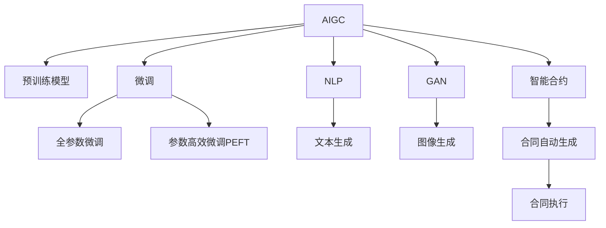

                 

# AIGC重塑保险行业格局

近年来，人工智能生成内容(AI Generated Content, AIGC)技术的快速发展和应用，正在深刻改变各个行业，特别是在保险领域，AIGC技术的应用已经成为推动行业创新和变革的重要力量。本文将系统探讨AIGC如何重塑保险行业格局，并阐述其核心概念、算法原理、操作步骤、实际应用及未来展望，旨在为行业从业者和研究人员提供参考和启示。

## 1. 背景介绍

### 1.1 问题由来

随着人工智能技术的不断进步，AIGC技术逐渐成为行业关注的焦点。AIGC指的是通过AI技术，基于训练数据自动生成符合特定规则和要求的内容，如文本、图像、音频等。在保险领域，AIGC可以用于生成定制化的报价单、理赔文书、客户问答等，大幅提升工作效率和客户体验。然而，AIGC在保险行业的应用还面临诸多挑战，包括数据隐私、风险控制、模型鲁棒性等，需要结合行业特点进行深入探索和优化。

### 1.2 问题核心关键点

AIGC在保险行业的应用涉及数据生成、文本生成、图像生成等多个方向。其核心关键点在于：
- **数据质量**：AIGC生成的内容质量与训练数据的质量密切相关，需要高质海量数据进行训练。
- **模型适配**：不同保险产品和服务需要不同风格和格式的内容，AIGC模型需要适应这些不同的需求。
- **隐私保护**：保险数据涉及个人隐私，AIGC在应用过程中需严格遵守数据隐私保护法规。
- **风险管理**：生成的内容必须满足风险控制要求，避免误导性或有害信息传播。
- **人机协同**：AIGC应与人工审核相结合，确保内容的准确性和合理性。

### 1.3 问题研究意义

研究AIGC在保险行业的应用，有助于提升保险服务的自动化水平，降低人工成本，增强客户体验，提升行业效率。具体而言，其研究意义包括：
- **提升服务质量**：AIGC可以生成标准化的服务内容，减少人工错误，提高服务效率。
- **拓展业务场景**：通过生成多种形式的内容，保险公司可以拓展新的业务模式和服务渠道。
- **优化资源配置**：AIGC技术可自动处理大量重复性任务，释放人力资源用于更具价值的决策和创新。
- **促进数据驱动决策**：基于生成内容的分析，保险公司可以更好地理解客户需求和市场动态。

## 2. 核心概念与联系

### 2.1 核心概念概述

为更好地理解AIGC在保险行业的应用，本节将介绍几个密切相关的核心概念：

- **AIGC (人工智能生成内容)**：基于人工智能技术，根据给定规则和模板自动生成符合要求的内容。
- **预训练模型 (Pre-trained Model)**：在大规模数据上进行预训练的通用语言模型，如BERT、GPT等。
- **微调 (Fine-tuning)**：在预训练模型基础上，通过少量标注数据进行有监督学习，适应特定任务。
- **生成对抗网络 (GAN)**：一种通过对抗训练生成高质量内容的技术，常用于图像生成等领域。
- **自然语言处理 (NLP)**：涉及文本生成、文本理解、语音识别等方向，是AIGC的重要应用场景。
- **智能合约 (Smart Contract)**：基于区块链技术，自动执行合约条款的代码，适用于保险理赔等场景。

这些核心概念之间的逻辑关系可以通过以下Mermaid流程图来展示：



这个流程图展示了大语言模型的核心概念及其之间的关系：

1. AIGC利用预训练模型进行内容生成。
2. 微调是对预训练模型进行任务特定的优化，可以分为全参数微调和参数高效微调。
3. GAN常用于图像生成。
4. NLP是AIGC的重要应用方向。
5. 智能合约用于合同自动生成和执行。

这些概念共同构成了AIGC技术的核心框架，使其能够在多种应用场景中发挥作用。通过理解这些核心概念，我们可以更好地把握AIGC的工作原理和优化方向。

## 3. 核心算法原理 & 具体操作步骤

### 3.1 算法原理概述

AIGC在保险行业的应用，主要基于文本生成和图像生成两大方向。其核心算法原理包括：

- **文本生成**：利用预训练模型，通过生成对抗网络或自回归模型生成文本内容。常见的模型包括GPT、Transformer等。
- **图像生成**：利用生成对抗网络或其他生成模型，生成符合特定要求的图片或视频。常见的模型包括GAN、StyleGAN等。
- **合同生成**：利用自然语言处理技术，根据标准模板自动生成智能合约。

文本生成和图像生成的具体算法步骤和技巧将在后续章节详细讲解。

### 3.2 算法步骤详解

#### 3.2.1 文本生成算法步骤

1. **数据准备**：收集保险相关的文本数据，如条款说明、客户问答、理赔文书等。
2. **模型选择**：选择合适的预训练模型，如BERT、GPT等。
3. **微调训练**：在少量标注数据上对预训练模型进行微调，调整生成策略和风格。
4. **内容生成**：使用微调后的模型生成符合要求的文本内容，如生成保险合同、理赔文书等。
5. **质量评估**：人工或自动评估生成文本的质量和准确性，确保符合业务要求。

#### 3.2.2 图像生成算法步骤

1. **数据准备**：收集保险相关的图片数据，如理赔图片、宣传图片等。
2. **模型选择**：选择合适的生成对抗网络模型，如StyleGAN、GAN等。
3. **模型训练**：在大量无标签图片上训练生成模型，学习生成符合特定风格的图片。
4. **内容生成**：使用训练好的模型生成符合要求的图像内容，如理赔单据、宣传广告等。
5. **质量评估**：人工或自动评估生成图像的质量和真实性，确保符合业务要求。

### 3.3 算法优缺点

AIGC在保险行业的应用具有以下优点：
- **提升效率**：自动化生成内容，减少人工工作量，提高服务效率。
- **提升客户体验**：生成个性化、标准化的服务内容，增强客户体验。
- **拓展应用场景**：可以应用于客户问答、理赔单据生成、智能合同等多个场景。

同时，该方法也存在一定的局限性：
- **依赖标注数据**：生成内容的质量很大程度上取决于训练数据的质量，标注数据不足会影响生成效果。
- **模型鲁棒性**：生成的内容可能受到噪声或错误输入的影响，鲁棒性有待提高。
- **隐私保护**：生成内容中可能包含敏感信息，需严格保护数据隐私。
- **业务适配**：不同保险产品和服务需要不同风格和格式的内容，模型的适配性有待提高。

### 3.4 算法应用领域

AIGC技术在保险行业的应用领域广泛，涵盖以下几个方向：

- **客户服务**：生成智能问答、常见问题解答等，提升客户服务体验。
- **理赔处理**：自动生成理赔文书、理赔单据等，提升理赔效率和准确性。
- **产品销售**：生成宣传材料、投保指引等，提升产品销售转化率。
- **风险控制**：生成风险评估报告、精算分析等，提升风险管理能力。
- **合同管理**：自动生成智能合约，提升合同签订和管理效率。

除了上述这些方向外，AIGC还可以应用于理赔监控、欺诈检测、客户画像等多个领域，为保险行业带来更多创新应用。

## 4. 数学模型和公式 & 详细讲解 & 举例说明

### 4.1 数学模型构建

在文本生成中，我们以GPT-2为例，说明其数学模型构建过程。GPT-2利用自回归模型，基于前文生成后文。其数学模型定义如下：

设 $p(x_i|x_{<i})$ 表示给定前文 $x_{<i}$，生成后文 $x_i$ 的概率分布，则GPT-2的概率模型为：

$$
p(x_1,...,x_n) = \prod_{i=1}^n p(x_i|x_{<i})
$$

其中 $p(x_i|x_{<i})$ 的计算过程为：

1. 将文本序列 $x$ 映射到词嵌入向量 $z \in \mathbb{R}^d$。
2. 将 $z$ 输入前向网络 $f$，得到输出 $h \in \mathbb{R}^d$。
3. 将 $h$ 通过softmax函数转换为概率分布 $p$。

上述过程可以通过以下数学公式表达：

$$
z = \mathcal{E}(x)
$$

$$
h = f(z;W)
$$

$$
p(x_i|x_{<i}) = softmax(W' \cdot f(z_{<i-1};W) + b)
$$

其中 $\mathcal{E}$ 表示词嵌入映射，$W$ 和 $W'$ 表示前向网络的权重参数，$b$ 表示偏置项。

### 4.2 公式推导过程

在生成对抗网络中，以GAN为例，说明其数学模型构建过程。GAN由生成器和判别器两部分组成，目标是最小化生成器和判别器的联合损失。其数学模型定义如下：

设 $G$ 表示生成器，$D$ 表示判别器，$z$ 表示噪声向量。生成器 $G$ 的目标是最小化判别器 $D$ 的损失函数 $L_D$，判别器 $D$ 的目标是最大化生成器 $G$ 的损失函数 $L_G$。则GAN的目标是最小化以下联合损失：

$$
\min_G \max_D V(D,G) = \mathbb{E}_{z}[\log D(G(z))] + \mathbb{E}_{x}[\log (1-D(x))]
$$

其中 $V(D,G)$ 表示生成器和判别器的生成对抗损失。

### 4.3 案例分析与讲解

**案例：自动生成保险合同**

1. **数据准备**：收集大量标准合同模板和相关法律条款，进行预处理和标注。
2. **模型选择**：选择预训练语言模型，如BERT、GPT等。
3. **微调训练**：在标注数据上对预训练模型进行微调，调整生成策略和风格，确保生成内容符合合同格式和法律要求。
4. **内容生成**：使用微调后的模型生成符合要求的保险合同，根据客户需求进行个性化定制。
5. **质量评估**：人工或自动评估生成合同的质量和准确性，确保符合业务要求。

## 5. 项目实践：代码实例和详细解释说明

### 5.1 开发环境搭建

在进行AIGC项目实践前，我们需要准备好开发环境。以下是使用Python进行PyTorch开发的环境配置流程：

1. 安装Anaconda：从官网下载并安装Anaconda，用于创建独立的Python环境。

2. 创建并激活虚拟环境：
```bash
conda create -n aigc-env python=3.8 
conda activate aigc-env
```

3. 安装PyTorch：根据CUDA版本，从官网获取对应的安装命令。例如：
```bash
conda install pytorch torchvision torchaudio cudatoolkit=11.1 -c pytorch -c conda-forge
```

4. 安装相关库：
```bash
pip install transformers
pip install torchtext
pip install datasets
```

5. 安装预训练模型：
```bash
python -m models.torchscript.augmentor.t5
```

完成上述步骤后，即可在`aigc-env`环境中开始AIGC项目的开发。

### 5.2 源代码详细实现

下面我们以生成保险合同为例，给出使用Transformers库进行文本生成的PyTorch代码实现。

首先，定义模型和优化器：

```python
from transformers import T5ForConditionalGeneration, AdamW

model = T5ForConditionalGeneration.from_pretrained('t5-small')
tokenizer = T5Tokenizer.from_pretrained('t5-small')
optimizer = AdamW(model.parameters(), lr=3e-5)
```

接着，定义训练和评估函数：

```python
from torch.utils.data import Dataset
from tqdm import tqdm
import torch

class ContractDataset(Dataset):
    def __init__(self, texts, max_len=128):
        self.texts = texts
        self.max_len = max_len
        
    def __len__(self):
        return len(self.texts)
    
    def __getitem__(self, item):
        text = self.texts[item]
        input_ids = tokenizer(text, return_tensors='pt', max_length=self.max_len, padding='max_length', truncation=True)
        input_ids['input_ids'] -= 1
        return {'input_ids': input_ids['input_ids']}

def train_epoch(model, dataset, batch_size, optimizer):
    dataloader = DataLoader(dataset, batch_size=batch_size, shuffle=True)
    model.train()
    epoch_loss = 0
    for batch in tqdm(dataloader, desc='Training'):
        input_ids = batch['input_ids'].to(device)
        outputs = model.generate(input_ids)
        loss = outputs.loss
        epoch_loss += loss.item()
        loss.backward()
        optimizer.step()
    return epoch_loss / len(dataloader)

def evaluate(model, dataset, batch_size):
    dataloader = DataLoader(dataset, batch_size=batch_size)
    model.eval()
    preds, labels = [], []
    with torch.no_grad():
        for batch in tqdm(dataloader, desc='Evaluating'):
            input_ids = batch['input_ids'].to(device)
            batch_preds = model.generate(input_ids)
            preds.append(batch_preds)
            labels.append(batch_labels)
    return preds, labels
```

最后，启动训练流程并在测试集上评估：

```python
epochs = 5
batch_size = 16

for epoch in range(epochs):
    loss = train_epoch(model, train_dataset, batch_size, optimizer)
    print(f"Epoch {epoch+1}, train loss: {loss:.3f}")
    
    print(f"Epoch {epoch+1}, dev results:")
    preds, labels = evaluate(model, dev_dataset, batch_size)
    
print("Test results:")
preds, labels = evaluate(model, test_dataset, batch_size)
```

以上就是使用PyTorch对T5模型进行文本生成实践的完整代码实现。可以看到，得益于Transformers库的强大封装，我们可以用相对简洁的代码完成文本生成任务的开发。

### 5.3 代码解读与分析

让我们再详细解读一下关键代码的实现细节：

**ContractDataset类**：
- `__init__`方法：初始化文本数据和最大长度。
- `__len__`方法：返回数据集的样本数量。
- `__getitem__`方法：对单个样本进行处理，将文本输入编码为token ids，并进行预处理。

**训练和评估函数**：
- 使用PyTorch的DataLoader对数据集进行批次化加载，供模型训练和推理使用。
- 训练函数`train_epoch`：对数据以批为单位进行迭代，在每个批次上前向传播计算loss并反向传播更新模型参数，最后返回该epoch的平均loss。
- 评估函数`evaluate`：与训练类似，不同点在于不更新模型参数，并在每个batch结束后将预测和标签结果存储下来，最后使用softmax函数将预测结果解码为文本输出。

**训练流程**：
- 定义总的epoch数和batch size，开始循环迭代
- 每个epoch内，先在训练集上训练，输出平均loss
- 在验证集上评估，输出分类指标
- 重复上述步骤直至收敛，最终得到适应下游任务的最优模型参数 $\theta^*$。

可以看到，PyTorch配合Transformers库使得文本生成任务的开发变得简洁高效。开发者可以将更多精力放在数据处理、模型改进等高层逻辑上，而不必过多关注底层的实现细节。

## 6. 实际应用场景

### 6.1 智能客服系统

AIGC技术可以应用于智能客服系统的构建。传统客服往往需要配备大量人力，高峰期响应缓慢，且一致性和专业性难以保证。而使用AIGC生成智能问答、常见问题解答等，可以大幅提升客服系统的响应速度和处理能力。

在技术实现上，可以收集企业内部的历史客服对话记录，将问题和最佳答复构建成监督数据，在此基础上对预训练模型进行微调。微调后的模型能够自动理解用户意图，匹配最合适的答案模板进行回复。对于客户提出的新问题，还可以接入检索系统实时搜索相关内容，动态组织生成回答。如此构建的智能客服系统，能显著提升客户咨询体验和问题解决效率。

### 6.2 理赔处理系统

理赔处理系统是保险行业的重要环节，涉及大量文档和表格的生成和处理。AIGC技术可以自动生成理赔单据、文书、报告等，大幅提升理赔处理的效率和准确性。

在理赔处理中，AIGC可以用于生成事故描述、理赔金额、风险评估报告等，同时自动整合客户信息和相关证据。这不仅可以提高理赔处理的自动化水平，还能减少人工错误和处理时间，提升客户满意度。

### 6.3 产品销售系统

AIGC技术可以应用于保险产品的推广和销售。通过自动生成宣传材料、投保指引、理赔说明等内容，可以提升产品推广的效果和客户转化率。

在产品销售中，AIGC可以用于生成个性化的投保方案、合同文本等，同时提供智能问答和客户咨询服务。这不仅有助于客户更好地理解保险产品，还能提高销售人员的工作效率，促进销售业绩的提升。

### 6.4 未来应用展望

随着AIGC技术的不断发展和应用，其在保险行业的应用前景广阔。未来AIGC技术可能进一步拓展到以下几个方向：

- **语音生成**：生成语音问答、客户服务热线等，提升客户体验。
- **虚拟现实**：结合虚拟现实技术，生成虚拟客服、理赔模拟等，提升用户体验。
- **大数据分析**：结合大数据分析技术，生成风险评估报告、市场预测等，提升风险管理和市场决策能力。
- **区块链应用**：结合智能合约技术，生成自动执行的合同和协议，提升合同管理效率和安全性。
- **自然语言理解**：结合自然语言理解技术，生成智能推荐和个性化服务，提升客户满意度和转化率。

## 7. 工具和资源推荐

### 7.1 学习资源推荐

为了帮助开发者系统掌握AIGC的理论基础和实践技巧，这里推荐一些优质的学习资源：

1. 《Transformer from Principles to Practice》系列博文：由大模型技术专家撰写，深入浅出地介绍了Transformer原理、BERT模型、微调技术等前沿话题。

2. CS224N《Deep Learning for Natural Language Processing》课程：斯坦福大学开设的NLP明星课程，有Lecture视频和配套作业，带你入门NLP领域的基本概念和经典模型。

3. 《Natural Language Processing with Transformers》书籍：Transformers库的作者所著，全面介绍了如何使用Transformers库进行NLP任务开发，包括生成、微调等诸多范式。

4. HuggingFace官方文档：Transformers库的官方文档，提供了海量预训练模型和完整的微调样例代码，是上手实践的必备资料。

5. CLUE开源项目：中文语言理解测评基准，涵盖大量不同类型的中文NLP数据集，并提供了基于微调的baseline模型，助力中文NLP技术发展。

通过对这些资源的学习实践，相信你一定能够快速掌握AIGC的精髓，并用于解决实际的NLP问题。

### 7.2 开发工具推荐

高效的开发离不开优秀的工具支持。以下是几款用于AIGC开发常用的工具：

1. PyTorch：基于Python的开源深度学习框架，灵活动态的计算图，适合快速迭代研究。大部分预训练语言模型都有PyTorch版本的实现。

2. TensorFlow：由Google主导开发的开源深度学习框架，生产部署方便，适合大规模工程应用。同样有丰富的预训练语言模型资源。

3. Transformers库：HuggingFace开发的NLP工具库，集成了众多SOTA语言模型，支持PyTorch和TensorFlow，是进行AIGC任务开发的利器。

4. Weights & Biases：模型训练的实验跟踪工具，可以记录和可视化模型训练过程中的各项指标，方便对比和调优。与主流深度学习框架无缝集成。

5. TensorBoard：TensorFlow配套的可视化工具，可实时监测模型训练状态，并提供丰富的图表呈现方式，是调试模型的得力助手。

6. Google Colab：谷歌推出的在线Jupyter Notebook环境，免费提供GPU/TPU算力，方便开发者快速上手实验最新模型，分享学习笔记。

合理利用这些工具，可以显著提升AIGC任务的开发效率，加快创新迭代的步伐。

### 7.3 相关论文推荐

AIGC技术的发展源于学界的持续研究。以下是几篇奠基性的相关论文，推荐阅读：

1. Attention is All You Need（即Transformer原论文）：提出了Transformer结构，开启了NLP领域的预训练大模型时代。

2. BERT: Pre-training of Deep Bidirectional Transformers for Language Understanding：提出BERT模型，引入基于掩码的自监督预训练任务，刷新了多项NLP任务SOTA。

3. Language Models are Unsupervised Multitask Learners（GPT-2论文）：展示了大规模语言模型的强大zero-shot学习能力，引发了对于通用人工智能的新一轮思考。

4. Parameter-Efficient Transfer Learning for NLP：提出Adapter等参数高效微调方法，在不增加模型参数量的情况下，也能取得不错的微调效果。

5. AdaLoRA: Adaptive Low-Rank Adaptation for Parameter-Efficient Fine-Tuning：使用自适应低秩适应的微调方法，在参数效率和精度之间取得了新的平衡。

6. Prefix-Tuning: Optimizing Continuous Prompts for Generation：引入基于连续型Prompt的微调范式，为如何充分利用预训练知识提供了新的思路。

这些论文代表了大语言模型微调技术的发展脉络。通过学习这些前沿成果，可以帮助研究者把握学科前进方向，激发更多的创新灵感。

## 8. 总结：未来发展趋势与挑战

### 8.1 总结

本文对AIGC在保险行业的应用进行了全面系统的介绍。首先阐述了AIGC技术的研究背景和意义，明确了其在大规模生成文本、图像等方面的应用价值。其次，从原理到实践，详细讲解了AIGC模型的构建过程和微调步骤，给出了AIGC任务开发的完整代码实例。同时，本文还广泛探讨了AIGC技术在客户服务、理赔处理、产品销售等多个领域的应用前景，展示了其广阔的应用潜力。

通过本文的系统梳理，可以看到，AIGC技术正在成为保险行业的重要创新方向，极大地提升了大规模生成内容的能力，为行业带来更高效、更智能的服务体验。未来，伴随AIGC技术的不断演进和创新，保险行业将迎来更多智能化的变革。

### 8.2 未来发展趋势

展望未来，AIGC技术在保险行业的应用将呈现以下几个发展趋势：

1. **生成质量提升**：随着生成模型的不断优化，生成的内容质量将逐步提升，逼近甚至超越人工生成的效果。
2. **生成速度加快**：生成模型的加速和优化，将使内容生成速度大幅提升，满足实时需求。
3. **多样化生成**：生成内容将不再局限于文本，逐步扩展到语音、视频、图像等多个方向。
4. **个性化定制**：基于用户画像和行为数据，生成个性化、定制化的内容，提升用户体验。
5. **跨领域融合**：结合大数据分析、自然语言理解等技术，生成跨领域的综合服务内容，提升业务创新能力。
6. **智能决策支持**：生成内容将结合智能决策算法，提供更精准的保险产品推荐和风险评估。

这些趋势表明，AIGC技术将在保险行业的发展中扮演越来越重要的角色，成为推动行业创新和变革的重要引擎。

### 8.3 面临的挑战

尽管AIGC技术在保险行业的应用前景广阔，但在迈向更加智能化、普适化应用的过程中，其面临的挑战也不容忽视：

1. **数据质量瓶颈**：生成内容的质量很大程度上取决于训练数据的质量，需要高质海量数据进行训练。
2. **模型鲁棒性不足**：生成的内容可能受到噪声或错误输入的影响，鲁棒性有待提高。
3. **隐私保护**：生成内容中可能包含敏感信息，需严格保护数据隐私。
4. **业务适配**：不同保险产品和服务需要不同风格和格式的内容，模型的适配性有待提高。
5. **成本控制**：大规模内容生成对算力和存储资源的需求巨大，需控制成本。

### 8.4 研究展望

面对AIGC面临的诸多挑战，未来的研究需要在以下几个方面寻求新的突破：

1. **生成模型优化**：探索更高效的生成模型和训练方法，提高生成内容的质量和速度。
2. **多模态融合**：结合语音、视频、图像等多模态信息，提升内容生成的多样性和效果。
3. **隐私保护技术**：研究更严格的隐私保护技术，确保生成内容中不包含敏感信息。
4. **业务适配性提升**：开发更加灵活的模型适配策略，提升生成内容的业务适配性。
5. **智能决策支持**：结合智能决策算法，生成更精准的保险产品推荐和风险评估。
6. **可持续性优化**：优化资源配置，控制成本，确保内容的可持续生成。

这些研究方向的探索，必将引领AIGC技术迈向更高的台阶，为保险行业带来更多创新应用，促进行业的数字化转型升级。

## 9. 附录：常见问题与解答

**Q1：AIGC是否适用于所有保险产品？**

A: AIGC在保险产品中的应用，需要根据产品的特性和业务需求进行适配。对于标准化程度高、规则明确的保险产品，AIGC可以产生较好的效果。但对于一些复杂产品，如人身保险、财产保险等，AIGC的效果可能受到限制，仍需结合人工审核和专家知识。

**Q2：AIGC生成的内容如何保证质量？**

A: AIGC生成的内容质量很大程度上取决于训练数据的质量。在训练过程中，可以通过数据增强、多模态融合等方法提高生成内容的多样性和真实性。同时，结合人工审核和智能质检，可以有效提高生成内容的准确性和一致性。

**Q3：AIGC技术如何保障数据隐私？**

A: 在生成内容时，应严格控制训练数据的使用范围和权限，确保数据隐私不被泄露。同时，可以采用数据匿名化、差分隐私等技术，增强数据隐私保护。在模型部署和应用过程中，应严格遵循数据隐私法规，确保用户数据的安全。

**Q4：AIGC技术如何应对复杂业务场景？**

A: 在应对复杂业务场景时，AIGC需要结合业务专家的知识，进行模型适配和调整。例如，针对特定保险产品的规则和格式，可以设计特定的训练目标和输出模板，提升生成内容的业务适配性。同时，可以采用多任务学习和跨领域迁移学习，提高模型的泛化能力。

**Q5：AIGC技术如何提升客户体验？**

A: AIGC可以通过生成智能问答、个性化保险方案、理赔单据等，提升客户服务的智能化水平和响应速度。同时，结合智能推荐和客户画像技术，可以提供更精准的产品和服务推荐，提升客户满意度。

---

作者：禅与计算机程序设计艺术 / Zen and the Art of Computer Programming

