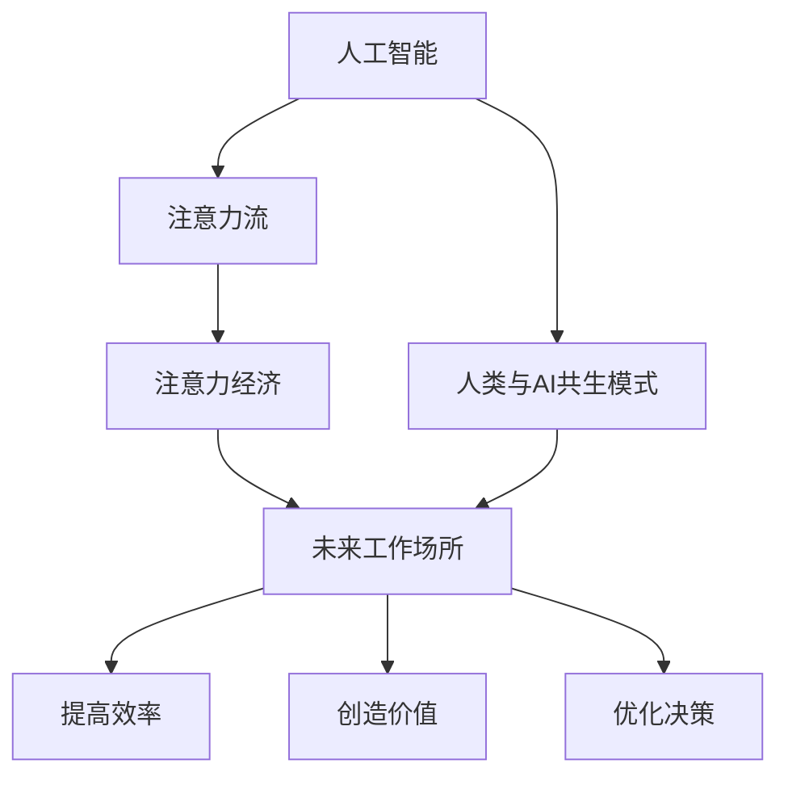

                 

# AI与人类注意力流：未来的工作场所与注意力经济

> 关键词：人工智能,人类注意力流,注意力经济,未来工作场所,人工智能与人类共生

## 1. 背景介绍

随着科技的不断进步，人工智能(AI)已经深刻地改变了人类社会的方方面面，尤其在职场和日常工作中。AI技术的快速发展不仅提升了工作效率，同时也带来了新的经济形态——注意力经济。这种经济模式强调的是如何吸引和利用人类的注意力，创造价值。本文将探讨AI与人类注意力流之间的关系，分析未来工作场所的变革趋势，并展望注意力经济的发展前景。

### 1.1 人工智能与人类共生

AI技术的兴起让机器能够处理复杂的数据和任务，但真正发挥其价值的是其与人类共生的模式。AI通过自动化和智能决策，解放了人类的脑力劳动，使其能够专注于更需要人类直觉和创造力的工作。这不仅提高了工作效率，也激发了新的创新能力。

### 1.2 注意力经济的概念

注意力经济是指在信息爆炸的时代，如何吸引和利用人类的注意力，创造出有价值的产品和服务。它强调的是“注意力”作为稀缺资源的价值，而不是传统的资本和劳动力。在AI的助力下，注意力经济正在成为新的经济增长点。

## 2. 核心概念与联系

### 2.1 核心概念概述

为了更好地理解AI与注意力经济之间的关系，我们需要先了解以下几个核心概念：

- **人工智能(AI)**：通过算法和数据训练，使机器具备学习、推理、决策等智能能力的技术。
- **注意力流**：人类在日常工作和学习中，注意力从一个任务转移到另一个任务的过程。
- **注意力经济**：以吸引和利用人类注意力为核心的经济模式，强调如何有效分配和利用有限的注意力资源。
- **未来工作场所**：随着AI技术的普及，未来工作场所将变得更加灵活、智能和高效。
- **人类与AI共生模式**：AI技术在帮助人类解放脑力劳动的同时，也增强了人类对AI的依赖，形成一种共生关系。

### 2.2 核心概念原理和架构的 Mermaid 流程图



这个流程图展示了AI、注意力流、注意力经济、未来工作场所以及人类与AI共生模式之间的关系：

1. AI通过学习人类的行为模式和注意力流，提升工作效率和决策质量。
2. 在AI的帮助下，人类能够更有效地分配注意力，创造出更多的价值。
3. 未来工作场所将更加智能和高效，从而推动经济增长。
4. 人类与AI形成共生模式，共同提升生产力和生活品质。

## 3. 核心算法原理 & 具体操作步骤

### 3.1 算法原理概述

AI与人类注意力流之间的交互是通过智能算法和数据处理来实现的。这些算法旨在理解人类行为模式，预测注意力流，并通过自动化任务和智能决策来优化资源配置。具体来说，AI在以下几个方面发挥作用：

- **数据分析**：通过收集和分析大量的工作行为数据，AI可以理解人类在不同任务中的注意力流模式。
- **预测注意力**：AI可以预测人类在下一个任务中需要投入的注意力，从而优化任务分配。
- **智能决策**：AI能够基于历史数据和实时反馈，做出更优的决策，提高生产效率。

### 3.2 算法步骤详解

基于以上原理，AI与人类注意力流交互的算法步骤可以分为以下几个阶段：

**Step 1: 数据收集与预处理**
- 收集人类在工作中的数据，包括任务执行时间、切换频率、任务类型等。
- 对数据进行清洗和标注，去除噪声和不相关数据。

**Step 2: 注意力模型训练**
- 使用机器学习算法（如深度学习）训练注意力模型，识别不同任务之间的注意力转移模式。
- 优化模型参数，提高预测准确率。

**Step 3: 实时注意力预测**
- 在实际工作中，实时监测人类注意力流，预测下一个任务所需的注意力。
- 根据预测结果，自动调整任务分配，优化工作流程。

**Step 4: 智能决策与优化**
- 基于实时注意力流预测结果，智能决策最优任务分配和执行路径。
- 对任务执行进行监控和优化，提高整体效率。

### 3.3 算法优缺点

AI与人类注意力流交互的算法具有以下优点：

- **效率提升**：通过智能决策和任务优化，提高工作效率和生产力。
- **灵活性**：适应不同的工作环境和任务类型，提供灵活的解决方案。
- **个性化**：根据个体差异和工作习惯，个性化调整工作流程。

同时，这种算法也存在一些缺点：

- **隐私问题**：数据收集和分析可能涉及个人隐私，需要严格的数据保护措施。
- **技术依赖**：对AI技术的依赖可能导致系统复杂度增加，维护成本上升。
- **适应性问题**：新任务和环境变化可能导致算法适应性不足，需要持续优化和调整。

### 3.4 算法应用领域

AI与人类注意力流交互的算法已经在多个领域得到了应用，例如：

- **生产制造**：通过分析工人注意力流，优化生产线和任务分配，提升生产效率。
- **医疗诊断**：利用AI分析医生和护士的注意力流，优化诊疗流程，提高诊断准确率。
- **教育培训**：在教育领域，AI可以分析学生注意力流，个性化调整教学内容和节奏。
- **市场营销**：通过分析消费者的注意力流，优化广告投放和客户服务，提升销售效果。

## 4. 数学模型和公式 & 详细讲解 & 举例说明

### 4.1 数学模型构建

为了更好地理解AI与人类注意力流交互的算法原理，我们引入一个简单的数学模型。假设一个员工在一天中会执行$n$个任务，每个任务$i$需要$T_i$的时间和注意力$A_i$。AI的目标是根据历史数据预测员工在下一个任务$j$所需的注意力$A_j$，从而优化任务分配。

### 4.2 公式推导过程

设员工执行任务$i$所需的注意力为$A_i$，根据历史数据，我们可以建立一个注意力模型：

$$
A_j = \mathcal{M}(A_{j-1}, T_{j-1}, T_j, \alpha)
$$

其中，$\mathcal{M}$表示注意力模型，$\alpha$为模型的参数，$T_{j-1}$和$T_j$分别为上一个任务和下一个任务的时间长度。

模型的训练目标是最小化预测误差：

$$
\min_\alpha \sum_{i=1}^n ||A_i - \mathcal{M}(A_{i-1}, T_{i-1}, T_i, \alpha)||^2
$$

使用最小二乘法优化模型参数$\alpha$，即可得到最优的注意力模型。

### 4.3 案例分析与讲解

假设一个员工在上午9点到11点之间完成两个任务，第一个任务耗时2小时，注意力耗时3小时；第二个任务耗时1小时，注意力耗时2小时。根据上述模型，我们可以预测员工在下一个任务所需的注意力：

- 如果下一个任务耗时1小时，注意力模型预测所需的注意力为2小时。
- 如果下一个任务耗时2小时，注意力模型预测所需的注意力为3小时。

通过这种预测，AI可以动态调整任务分配，避免员工过度疲劳，提高工作效率。

## 5. 项目实践：代码实例和详细解释说明

### 5.1 开发环境搭建

在进行项目实践前，我们需要准备好开发环境。以下是使用Python进行PyTorch开发的环境配置流程：

1. 安装Anaconda：从官网下载并安装Anaconda，用于创建独立的Python环境。

2. 创建并激活虚拟环境：
```bash
conda create -n pytorch-env python=3.8 
conda activate pytorch-env
```

3. 安装PyTorch：根据CUDA版本，从官网获取对应的安装命令。例如：
```bash
conda install pytorch torchvision torchaudio cudatoolkit=11.1 -c pytorch -c conda-forge
```

4. 安装TensorFlow：从官网下载并安装TensorFlow。

5. 安装各类工具包：
```bash
pip install numpy pandas scikit-learn matplotlib tqdm jupyter notebook ipython
```

完成上述步骤后，即可在`pytorch-env`环境中开始项目实践。

### 5.2 源代码详细实现

我们使用一个简单的任务分配模型来说明AI与人类注意力流交互的实现过程。首先，定义一个员工的任务数据类：

```python
class EmployeeTask:
    def __init__(self, task_id, start_time, end_time, attention_duration):
        self.task_id = task_id
        self.start_time = start_time
        self.end_time = end_time
        self.attention_duration = attention_duration
```

然后，定义一个简单的注意力模型，使用线性回归来预测下一个任务所需的注意力：

```python
import torch
import torch.nn as nn
import torch.optim as optim

class AttentionModel(nn.Module):
    def __init__(self, input_dim, output_dim):
        super(AttentionModel, self).__init__()
        self.linear = nn.Linear(input_dim, output_dim)
        
    def forward(self, x):
        x = self.linear(x)
        return x
```

接下来，定义训练函数，使用历史数据来训练注意力模型：

```python
def train_model(data, model, loss_fn, optimizer, num_epochs=10):
    for epoch in range(num_epochs):
        running_loss = 0.0
        for i, data in enumerate(data):
            inputs = data['input']
            labels = data['label']
            
            optimizer.zero_grad()
            outputs = model(inputs)
            loss = loss_fn(outputs, labels)
            loss.backward()
            optimizer.step()
            
            running_loss += loss.item()
            if i % 100 == 99:
                print('[%d, %5d] loss: %.3f' % (epoch+1, i+1, running_loss / 100))
                running_loss = 0.0
```

最后，使用训练好的模型进行预测：

```python
def predict(model, data):
    with torch.no_grad():
        for i, data in enumerate(data):
            inputs = data['input']
            outputs = model(inputs)
            labels = outputs.detach().numpy()
            print(labels)
```

### 5.3 代码解读与分析

让我们再详细解读一下关键代码的实现细节：

**EmployeeTask类**：
- `__init__`方法：初始化任务的基本属性，包括任务ID、开始时间、结束时间和注意力耗时。

**AttentionModel类**：
- `__init__`方法：定义模型的线性层，用于预测下一个任务的注意力耗时。
- `forward`方法：将输入数据通过线性层进行前向传播，输出预测结果。

**train_model函数**：
- 在每个epoch内，对数据进行遍历，计算损失函数并反向传播更新模型参数。

**predict函数**：
- 使用训练好的模型对输入数据进行预测，输出预测结果。

可以看到，通过使用PyTorch库，我们可以用相对简洁的代码完成AI与人类注意力流交互的实现。开发者可以将更多精力放在模型优化、数据处理等高层逻辑上，而不必过多关注底层的实现细节。

## 6. 实际应用场景

### 6.1 生产制造

在生产制造领域，AI与人类注意力流交互可以帮助企业优化生产流程。传统生产方式往往依赖人工调度和管理，效率较低，且容易发生错误。通过AI分析工人注意力流，可以实时调整生产线的任务分配，提高生产效率和质量。

例如，智能制造系统可以通过分析工人注意力集中度和任务执行时间，自动调整机器和设备的调度，减少停机时间，提升生产效率。同时，AI还可以根据历史数据和实时反馈，预测下一个任务所需的时间，优化任务分配，避免资源浪费。

### 6.2 医疗诊断

在医疗诊断领域，AI与人类注意力流交互可以帮助医生提高诊断效率和准确率。传统医疗诊断依赖人工解读影像和病历，耗时较长且易出错。通过AI分析医生和护士的注意力流，可以优化诊疗流程，提高诊断准确率。

例如，智能诊断系统可以实时监测医生和护士的注意力集中度，根据注意力流预测下一个任务，优化诊疗路径。同时，AI还可以根据历史数据和实时反馈，预测疾病发展趋势，提前预警并制定应对措施，提高诊疗效果。

### 6.3 教育培训

在教育培训领域，AI与人类注意力流交互可以帮助教师和学生提高教学和学习效率。传统教学方式依赖人工管理，难以适应不同学生的学习需求。通过AI分析学生的注意力流，可以个性化调整教学内容和节奏，提高教学效果。

例如，智能教育系统可以实时监测学生的注意力集中度，根据注意力流预测下一个学习任务，优化教学路径。同时，AI还可以根据历史数据和实时反馈，预测学生的学习效果，制定个性化的学习计划，提升学习效率。

## 7. 工具和资源推荐

### 7.1 学习资源推荐

为了帮助开发者系统掌握AI与人类注意力流交互的理论基础和实践技巧，这里推荐一些优质的学习资源：

1. 《深度学习》系列书籍：由多位深度学习专家撰写，全面介绍了深度学习的基本原理和应用。
2. 《人工智能基础》在线课程：由斯坦福大学开设的AI入门课程，涵盖AI的各个领域，包括机器学习、自然语言处理等。
3. 《人工智能与人类共生》论文集：收录了大量关于AI与人类共生的前沿研究和应用案例。
4. 《注意力机制》论文集：深入探讨了注意力机制在深度学习中的作用和应用。

通过对这些资源的学习实践，相信你一定能够快速掌握AI与人类注意力流交互的精髓，并用于解决实际的AI应用问题。

### 7.2 开发工具推荐

高效的开发离不开优秀的工具支持。以下是几款用于AI与人类注意力流交互开发的常用工具：

1. PyTorch：基于Python的开源深度学习框架，灵活动态的计算图，适合快速迭代研究。
2. TensorFlow：由Google主导开发的开源深度学习框架，生产部署方便，适合大规模工程应用。
3. TensorBoard：TensorFlow配套的可视化工具，可实时监测模型训练状态，并提供丰富的图表呈现方式。
4. Weights & Biases：模型训练的实验跟踪工具，可以记录和可视化模型训练过程中的各项指标。
5. Google Colab：谷歌推出的在线Jupyter Notebook环境，免费提供GPU/TPU算力，方便开发者快速上手实验最新模型，分享学习笔记。

合理利用这些工具，可以显著提升AI与人类注意力流交互任务的开发效率，加快创新迭代的步伐。

### 7.3 相关论文推荐

AI与人类注意力流交互的研究源于学界的持续研究。以下是几篇奠基性的相关论文，推荐阅读：

1. 《注意力机制》论文：介绍注意力机制在深度学习中的作用和应用。
2. 《人类与AI共生》论文：探讨人类与AI共生的模式和未来发展方向。
3. 《智能制造与AI》论文：研究AI在智能制造中的应用，优化生产流程。
4. 《智能诊断与AI》论文：研究AI在智能诊断中的应用，提高诊断效率和准确率。
5. 《智能教育与AI》论文：研究AI在智能教育中的应用，提升教学和学习效果。

这些论文代表了大语言模型微调技术的发展脉络。通过学习这些前沿成果，可以帮助研究者把握学科前进方向，激发更多的创新灵感。

## 8. 总结：未来发展趋势与挑战

### 8.1 总结

本文对AI与人类注意力流交互的方法进行了全面系统的介绍。首先阐述了AI与人类共生的模式以及注意力经济的概念，明确了AI在优化人类注意力流中的作用。其次，从原理到实践，详细讲解了AI与人类注意力流交互的数学模型和关键步骤，给出了AI与人类注意力流交互的完整代码实例。同时，本文还探讨了AI与人类注意力流交互在多个行业领域的应用前景，展示了其广阔的发展空间。

通过本文的系统梳理，可以看到，AI与人类注意力流交互技术正在成为AI应用的重要范式，极大地拓展了AI在生产制造、医疗诊断、教育培训等领域的应用范围，提升了人类工作和生活的智能化水平。未来，伴随AI技术的持续演进，AI与人类注意力流交互技术必将发挥更大的价值。

### 8.2 未来发展趋势

展望未来，AI与人类注意力流交互技术将呈现以下几个发展趋势：

1. **深度融合**：AI技术将深度融合到人类工作流程中，提高整体效率和生产力。
2. **个性化优化**：通过个性化分析，AI将更好地适应不同个体和任务的需求，提供更加精准的服务。
3. **跨领域应用**：AI与人类注意力流交互的应用将扩展到更多领域，如金融、零售、物流等，推动各行业的数字化转型。
4. **多模态协同**：AI将结合视觉、语音、文本等多种模态数据，提供更全面、更智能的服务。
5. **伦理与安全性**：AI与人类共生将引发更多伦理和安全问题，如何构建安全的AI生态系统将成为重要的研究课题。

以上趋势凸显了AI与人类注意力流交互技术的广阔前景。这些方向的探索发展，必将进一步提升AI在人类工作和生活中的价值，推动社会进步。

### 8.3 面临的挑战

尽管AI与人类注意力流交互技术已经取得了瞩目成就，但在迈向更加智能化、普适化应用的过程中，它仍面临着诸多挑战：

1. **隐私与安全问题**：数据收集和分析可能涉及个人隐私，需要严格的数据保护措施。同时，如何避免恶意攻击和数据泄露，也需要更多的技术手段。
2. **技术复杂性**：AI与人类注意力流交互的算法复杂度较高，模型训练和优化需要更多的计算资源和专业知识。
3. **适应性问题**：新任务和环境变化可能导致算法适应性不足，需要持续优化和调整。
4. **伦理与法律问题**：AI与人类共生将引发更多的伦理和法律问题，如何构建公平、透明、可解释的AI系统，将是重要的研究课题。

正视AI与人类注意力流交互技术所面临的这些挑战，积极应对并寻求突破，将是其未来发展的关键。只有不断改进技术，完善制度，才能真正实现AI与人类共生的美好愿景。

### 8.4 研究展望

面对AI与人类注意力流交互技术所面临的挑战，未来的研究需要在以下几个方面寻求新的突破：

1. **隐私保护技术**：开发更加高效的数据保护技术，如联邦学习、差分隐私等，保护用户隐私。
2. **简化模型结构**：开发更加轻量级的AI模型，提升计算效率，降低资源消耗。
3. **增强可解释性**：开发更加可解释的AI算法，提高系统的透明度和可解释性。
4. **融合多模态数据**：结合视觉、语音、文本等多种模态数据，提供更全面、更智能的服务。
5. **引入伦理约束**：在AI模型训练目标中引入伦理导向的评估指标，过滤和惩罚有偏见、有害的输出倾向。

这些研究方向的探索，必将引领AI与人类注意力流交互技术迈向更高的台阶，为构建安全、可靠、可解释、可控的智能系统铺平道路。面向未来，AI与人类注意力流交互技术还需要与其他人工智能技术进行更深入的融合，如知识表示、因果推理、强化学习等，多路径协同发力，共同推动自然语言理解和智能交互系统的进步。只有勇于创新、敢于突破，才能不断拓展AI与人类共生的边界，让智能技术更好地造福人类社会。

## 9. 附录：常见问题与解答

**Q1：AI与人类注意力流交互是否适用于所有行业？**

A: AI与人类注意力流交互在大多数行业都有应用前景，特别是对于生产制造、医疗诊断、教育培训等需要优化流程和提高效率的行业。但对于一些高度依赖人类直觉和创造力的行业，如艺术、娱乐等，AI的介入可能会带来新的挑战。

**Q2：AI与人类注意力流交互如何提高工作效率？**

A: AI与人类注意力流交互通过智能决策和任务优化，可以实时调整工作流程，避免资源浪费，提高整体效率。例如，在生产制造中，AI可以根据员工注意力流预测下一个任务，优化生产线调度，减少停机时间。在医疗诊断中，AI可以根据医生注意力流预测下一个检查项目，优化诊疗流程，提高诊断效率。

**Q3：AI与人类注意力流交互是否涉及隐私问题？**

A: AI与人类注意力流交互需要收集和分析个人数据，可能涉及隐私问题。为保护用户隐私，应采取严格的数据保护措施，如差分隐私、联邦学习等技术，确保数据安全。同时，应建立透明的数据使用规则，让用户了解和同意数据的使用方式。

**Q4：AI与人类注意力流交互如何应对新任务和环境变化？**

A: AI与人类注意力流交互需要持续优化和调整，以应对新任务和环境变化。可以通过增量学习、在线学习等技术，实时更新模型参数，提高适应性。同时，可以引入更多的领域知识和专家规则，引导AI更好地适应新任务。

**Q5：AI与人类注意力流交互的未来发展方向是什么？**

A: AI与人类注意力流交互的未来发展方向包括：深度融合、个性化优化、跨领域应用、多模态协同、伦理与安全性等。未来，伴随技术的持续演进，AI与人类共生的模式将更加丰富多样，进一步提升人类工作和生活的智能化水平。

通过本文的系统梳理，可以看到，AI与人类注意力流交互技术正在成为AI应用的重要范式，极大地拓展了AI在生产制造、医疗诊断、教育培训等领域的应用范围，提升了人类工作和生活的智能化水平。未来，伴随AI技术的持续演进，AI与人类注意力流交互技术必将发挥更大的价值。只有不断改进技术，完善制度，才能真正实现AI与人类共生的美好愿景。

