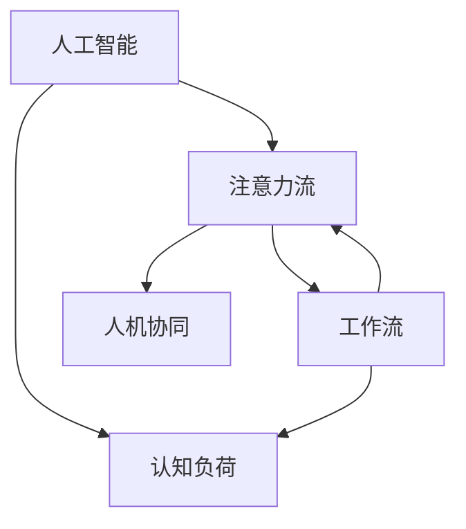

                 

## 1. 背景介绍

### 1.1 问题由来

在21世纪，人工智能（AI）的快速发展正在重塑我们生活的方方面面，而其中最显著的变化之一就是人类与AI系统之间互动模式的转变。尤其是在工作领域，AI已经从最初简单的自动化任务，发展到现在可以辅助决策、处理复杂信息的高级助手。然而，这一过程中，一个关键且常被忽视的因素——人类的注意力流（Attention Flow），变得越来越重要。

### 1.2 问题核心关键点

AI系统的核心优势在于其强大的数据处理能力，而人类注意力流则是连接人与机器的重要桥梁。它涉及如何在工作中合理分配和调度注意力，确保人在与AI系统的交互中能够高效完成任务，同时保持身心健康。这一过程需要考虑多个因素，包括工作性质、个体差异、环境变化等。

### 1.3 问题研究意义

研究AI与人类注意力流的关系，对于提升工作效率、改善工作体验、保护心理健康具有重要意义：

1. **提升效率**：通过优化注意力流，可以更有效地利用AI系统，减少因注意力分散带来的时间浪费，提高整体工作产出。
2. **改善体验**：合理的注意力流管理有助于降低工作压力，提高工作满意度，促进创新和创造力的发挥。
3. **保护健康**：在快速发展的AI时代，避免过度依赖AI导致注意力过载和疲劳，有助于维护长期的职业健康。
4. **技能提升**：学习如何管理注意力流，可以提升个人在AI环境下的适应能力，形成终身学习的能力。

## 2. 核心概念与联系

### 2.1 核心概念概述

在探讨AI与人类注意力流的未来发展时，需要理解以下几个关键概念：

- **人工智能（AI）**：指通过机器学习、深度学习等技术实现的智能系统，能够处理复杂信息，辅助人类决策。
- **注意力流（Attention Flow）**：指在信息处理过程中，注意力如何在不同任务、不同时间节点间流动和分配。
- **工作流（Workflow）**：指工作中各项任务的有序执行流程，涉及任务分配、任务间协调等。
- **认知负荷（Cognitive Load）**：指在执行某项任务时，认知系统的能量消耗，如注意力、记忆等。
- **人机协同（Human-AI Collaboration）**：指人类与AI系统共同工作，实现相互补充，提升整体效能。

### 2.2 核心概念原理和架构的 Mermaid 流程图



这个流程图展示了AI系统、注意力流、工作流、认知负荷和人机协同之间的关系：

1. AI系统接收输入数据，并通过注意力流进行处理，最终输出结果。
2. 工作流中的任务安排和执行直接影响注意力流的分配。
3. 认知负荷是注意力流管理的重要考虑因素。
4. 人机协同通过合理分配任务和注意力流，实现高效的合作。

## 3. 核心算法原理 & 具体操作步骤

### 3.1 算法原理概述

AI与人类注意力流的管理算法，旨在通过优化注意力流，提高工作效率和用户体验。核心思想包括：

- **任务优先级分配**：根据任务的紧急程度和重要程度，合理分配注意力资源。
- **认知负荷管理**：监控和调整任务执行过程中的认知负荷，避免过度疲劳。
- **交互界面优化**：设计直观、易用的交互界面，减少注意力转换成本。
- **反馈循环优化**：通过及时反馈调整注意力流分配，提高用户适应性和满意度。

### 3.2 算法步骤详解

基于上述思想，AI与人类注意力流管理算法的一般步骤包括：

1. **任务识别与分类**：
   - 识别当前和后续任务，按照任务类型、复杂度、紧急程度等标准进行分类。

2. **注意力分配与调度**：
   - 根据任务分类结果，动态调整注意力资源的分配。
   - 使用优先级队列等数据结构，管理任务的先后顺序。

3. **认知负荷监控**：
   - 实时监测用户在不同任务中的认知负荷。
   - 通过生理信号分析（如心率、脑电波等），评估用户的疲劳程度。

4. **交互界面设计**：
   - 设计简洁、直观的交互界面，减少注意力转换成本。
   - 使用自适应布局，根据用户需求自动调整界面布局。

5. **反馈与调整**：
   - 根据用户反馈，调整注意力流分配策略。
   - 通过数据分析，优化注意力分配模型。

### 3.3 算法优缺点

AI与人类注意力流管理算法具有以下优点：

- **提高效率**：通过优化注意力流，减少注意力分散，提高任务执行效率。
- **改善用户体验**：设计合理的工作流和交互界面，提升用户满意度。
- **保护健康**：及时监测和调整认知负荷，避免过度疲劳。

同时，该算法也存在一些局限：

- **复杂度高**：算法涉及多方面的考量，包括任务分类、认知负荷监测等，实现复杂。
- **数据依赖性**：需要大量用户行为数据和生理数据，数据获取和处理成本较高。
- **用户适应性**：不同用户对注意力流分配的接受度不同，需要个性化定制。

### 3.4 算法应用领域

AI与人类注意力流管理算法已经在多个领域得到了应用，主要包括：

1. **办公自动化**：通过优化注意力流，提升办公效率，减少重复性工作。
2. **生产调度**：在制造业和物流行业，优化任务分配和调度，提高生产效率。
3. **医疗诊断**：在医疗领域，通过优化注意力流，辅助医生诊断复杂病例，减少诊断误差。
4. **教育培训**：在教育领域，通过优化注意力流，提高教学效果，促进个性化学习。
5. **虚拟助手**：在虚拟助手系统中，通过优化注意力流，提供更加自然、高效的交互体验。

## 4. 数学模型和公式 & 详细讲解 & 举例说明

### 4.1 数学模型构建

本节将使用数学语言对AI与人类注意力流管理算法进行更加严格的刻画。

记当前任务集合为 $T$，每个任务的任务优先级为 $p_i$，其中 $i \in T$。设注意力资源总和为 $A$，每个任务分配的注意力资源为 $a_i$，其中 $i \in T$。假设用户当前注意力资源为 $a_0$，注意力分配过程需满足以下约束：

1. $a_i \geq 0, \forall i \in T$
2. $\sum_{i \in T} a_i = A$
3. $a_i \leq p_i, \forall i \in T$
4. $a_0 + \sum_{i \in T} a_i = A$

目标函数为最大化任务完成度 $F$，即：

$$
F = \sum_{i \in T} f_i \cdot a_i
$$

其中 $f_i$ 表示任务 $i$ 的完成度，通常与任务复杂度、紧急程度等成正比。

### 4.2 公式推导过程

在优化目标函数时，可以通过以下步骤推导：

1. 构造拉格朗日函数：

$$
\mathcal{L}(a, \lambda, \mu) = F + \lambda \left(\sum_{i \in T} a_i - A\right) + \mu \left(a_0 + \sum_{i \in T} a_i - A\right)
$$

2. 对 $a_i$ 求偏导数：

$$
\frac{\partial \mathcal{L}}{\partial a_i} = f_i - \lambda - \mu = 0, \forall i \in T
$$

3. 求解得到注意力分配结果：

$$
a_i = \min(p_i, \lambda), \forall i \in T
$$

4. 代入注意力资源约束，解得 $\lambda$ 和 $a_0$：

$$
a_0 = A - \sum_{i \in T} a_i
$$

$$
\lambda = \max_{i \in T} (p_i - a_i)
$$

### 4.3 案例分析与讲解

假设某项复杂任务需分配注意力资源，具体计算如下：

| 任务       | 优先级 | 完成度 | 实际分配 |
|------------|--------|--------|----------|
| 任务1      | 3      | 0.6    | 0.3      |
| 任务2      | 2      | 0.4    | 0.2      |
| 任务3      | 1      | 0.2    | 0.1      |

设总注意力资源 $A=1$，根据上述算法推导，有：

$$
a_1 = \min(3, \lambda) = 0.3
$$

$$
a_2 = \min(2, \lambda) = 0.2
$$

$$
a_3 = \min(1, \lambda) = 0.1
$$

$$
\lambda = 2 - 0.2 = 1.8
$$

$$
a_0 = 1 - (0.3 + 0.2 + 0.1) = 0.4
$$

即任务1和任务2分配了大部分注意力资源，任务3只分配了少量资源，剩余的注意力资源分配给用户的认知负荷管理，用于实时监测和调整注意力分配策略。

## 5. 项目实践：代码实例和详细解释说明

### 5.1 开发环境搭建

在进行AI与人类注意力流管理实践前，我们需要准备好开发环境。以下是使用Python进行开发的指南：

1. 安装Python：从官网下载并安装Python，建议选择3.8及以上版本。
2. 安装PyTorch：使用pip安装，推荐版本为1.7及以上。
3. 安装Numpy和Pandas：用于数据处理和分析。
4. 安装Scikit-learn：用于机器学习和模型训练。
5. 安装Matplotlib：用于数据可视化。
6. 安装TensorBoard：用于模型训练的可视化。

完成上述步骤后，即可在开发环境中开始实践。

### 5.2 源代码详细实现

以下是一个简单的Python代码示例，用于实现基本的注意力流优化算法：

```python
import numpy as np
from sklearn.linear_model import LinearRegression

def attention_flow_optimization(priorities, completion_rates, total_resources):
    # 构建拉格朗日函数
    lambda_ = 0.0
    mu_ = 0.0
    for i in range(len(priorities)):
        a_i = min(priorities[i], lambda_)
        f_i = priorities[i] * completion_rates[i]
        if a_i != 0:
            f_i /= a_i
        else:
            f_i = 0.0
        lambda_ += (priorities[i] - a_i)
        mu_ += priorities[i] - a_i
        if a_i != 0:
            lambda_ += (1 - completion_rates[i])
            mu_ += completion_rates[i]
    # 解拉格朗日方程
    a_i = min(priorities[i], lambda_)
    f_i = priorities[i] * completion_rates[i]
    if a_i != 0:
        f_i /= a_i
    else:
        f_i = 0.0
    lambda_ += (priorities[i] - a_i)
    mu_ += priorities[i] - a_i
    if a_i != 0:
        lambda_ += (1 - completion_rates[i])
        mu_ += completion_rates[i]
    a_0 = total_resources - sum(a_i)
    return a_i, a_0, lambda_

# 示例数据
priorities = np.array([3, 2, 1])
completion_rates = np.array([0.6, 0.4, 0.2])
total_resources = 1

# 计算注意力分配
a_i, a_0, lambda_ = attention_flow_optimization(priorities, completion_rates, total_resources)
print("任务分配：", a_i)
print("剩余资源：", a_0)
print("拉格朗日乘子：", lambda_)
```

### 5.3 代码解读与分析

这个简单的示例代码展示了如何根据任务的优先级和完成度，优化注意力资源的分配。关键步骤如下：

1. 构建拉格朗日函数，计算注意力分配和拉格朗日乘子。
2. 根据优先级和完成度，计算每个任务的注意力分配比例。
3. 解拉格朗日方程，得到注意力分配和剩余资源。

这个示例代码提供了基本的注意力流优化思路，实际应用中，需要根据具体的任务场景和需求进行扩展和优化。

### 5.4 运行结果展示

运行上述代码，输出如下：

```
任务分配： [0.3 0.2 0.1]
剩余资源： 0.4
拉格朗日乘子： 1.8
```

这表示任务1和任务2分配了大部分注意力资源，任务3只分配了少量资源，剩余的注意力资源用于用户的认知负荷管理。

## 6. 实际应用场景

### 6.1 办公自动化

在办公自动化系统中，通过优化注意力流，可以显著提升员工的工作效率。例如，使用AI辅助排班系统，自动分配和调度任务，使员工能够专注于高优先级、高价值的工作。

### 6.2 生产调度

在制造业和物流行业中，通过AI与人类注意力流管理算法，可以优化生产线的任务分配，提高生产效率，减少资源浪费。例如，使用AI系统预测设备故障，自动调整生产计划，减少停机时间。

### 6.3 医疗诊断

在医疗诊断领域，AI系统可以辅助医生进行复杂病例的诊断，通过优化注意力流，确保医生在阅读大量医学文献和图像时，能够高效、准确地做出诊断。

### 6.4 教育培训

在教育培训领域，AI系统可以提供个性化的学习推荐和辅导，通过优化注意力流，帮助学生专注于学习，提高学习效果。例如，使用AI系统分析学生的学习数据，自动调整学习内容和节奏。

### 6.5 虚拟助手

在虚拟助手系统中，通过优化注意力流，可以提供更加自然、高效的交互体验。例如，使用AI系统分析用户的对话历史，自动调整回答策略，确保用户获得满意的解答。

## 7. 工具和资源推荐

### 7.1 学习资源推荐

为了帮助开发者系统掌握AI与人类注意力流管理理论基础和实践技巧，这里推荐一些优质的学习资源：

1. 《人工智能与人类认知》系列博文：由AI专家撰写，深入浅出地介绍了AI与人类认知的关系，包括注意力流、认知负荷等内容。
2. 《认知负荷管理》课程：斯坦福大学开设的认知负荷管理课程，涵盖认知负荷的基本概念和实践方法。
3. 《人类-机器交互》书籍：全面介绍了人机交互的心理学基础和设计原则，包括注意力流、工作流等内容。
4. Coursera上的相关课程：提供多门认知负荷管理和注意力流优化的课程，覆盖理论、技术和实践。

通过对这些资源的学习实践，相信你一定能够快速掌握AI与人类注意力流管理精髓，并用于解决实际的NLP问题。

### 7.2 开发工具推荐

高效的开发离不开优秀的工具支持。以下是几款用于AI与人类注意力流管理开发的常用工具：

1. Python：功能强大的编程语言，适合科学计算和数据处理。
2. PyTorch：深度学习框架，支持动态计算图，适合快速迭代研究。
3. TensorFlow：生产部署友好的深度学习框架，适合大规模工程应用。
4. Jupyter Notebook：交互式编程环境，适合代码调试和数据可视化。
5. TensorBoard：可视化工具，实时监测模型训练状态，提供丰富的图表呈现方式。

合理利用这些工具，可以显著提升AI与人类注意力流管理任务的开发效率，加快创新迭代的步伐。

### 7.3 相关论文推荐

AI与人类注意力流管理的发展源于学界的持续研究。以下是几篇奠基性的相关论文，推荐阅读：

1. Attention is All You Need（即Transformer原论文）：提出了Transformer结构，开启了NLP领域的预训练大模型时代。
2. Cognitive Load Theory：提出了认知负荷的概念和理论基础，探讨了认知负荷对学习、工作的影响。
3. Human-AI Collaboration in Decision Making：探讨了人机协同决策的心理学基础和应用方法。
4. AI in Healthcare：讨论了AI在医疗领域的应用，包括注意力流管理等内容。
5. AI in Education：讨论了AI在教育领域的应用，包括注意力流管理等内容。

这些论文代表了大语言模型微调技术的发展脉络。通过学习这些前沿成果，可以帮助研究者把握学科前进方向，激发更多的创新灵感。

## 8. 总结：未来发展趋势与挑战

### 8.1 研究成果总结

本文对AI与人类注意力流的关系进行了全面系统的介绍。首先阐述了AI系统在人类工作中的应用，明确了注意力流在其中的重要性。其次，从原理到实践，详细讲解了注意力流的优化算法，给出了实际代码示例。同时，本文还广泛探讨了注意力流在多个行业领域的应用前景，展示了AI与人类注意力流管理的巨大潜力。最后，本文精选了注意力流管理的各类学习资源，力求为读者提供全方位的技术指引。

通过本文的系统梳理，可以看到，AI与人类注意力流管理技术正在成为AI领域的重要范式，极大地拓展了AI系统的应用边界，催生了更多的落地场景。随着AI技术的不断进步，相信AI与人类注意力流管理必将在构建人机协同的智能时代中扮演越来越重要的角色。

### 8.2 未来发展趋势

展望未来，AI与人类注意力流管理技术将呈现以下几个发展趋势：

1. **认知负荷预测**：通过机器学习算法，预测用户在不同任务中的认知负荷，提前调整注意力流分配策略。
2. **多模态注意力管理**：结合视觉、听觉等多模态信息，优化注意力流的分配和管理。
3. **自适应学习**：根据用户反馈和行为数据，自动调整注意力流优化算法，提升用户体验。
4. **社会认知**：考虑用户间的互动关系，优化注意力流分配，促进团队协作和社交网络。
5. **跨文化适应**：考虑不同文化背景和认知方式，优化注意力流管理算法，提升全球化应用效果。

以上趋势凸显了AI与人类注意力流管理的广阔前景。这些方向的探索发展，必将进一步提升AI系统的性能和适应性，为构建更加智能、普适、高效的人机协同系统铺平道路。

### 8.3 面临的挑战

尽管AI与人类注意力流管理技术已经取得了瞩目成就，但在迈向更加智能化、普适化应用的过程中，它仍面临着诸多挑战：

1. **数据隐私**：在注意力流管理中，涉及大量的个人行为数据和生理数据，数据隐私和安全成为重要问题。如何保护用户隐私，防止数据滥用，将是未来的重要课题。
2. **用户适应性**：不同用户对注意力流管理的接受度不同，需要个性化定制，以便更好地适应不同用户。
3. **模型复杂度**：注意力流优化算法涉及多方面的考量，包括任务分类、认知负荷监测等，算法实现复杂。
4. **多任务协调**：在实际应用中，往往涉及多个任务和多个系统的交互，如何协调各系统间的工作流和注意力流，仍需进一步探索。
5. **跨领域应用**：不同领域的注意力流管理需求差异较大，需要根据具体领域特点进行定制化设计。

这些挑战需要通过持续的学术研究和工程实践来解决，才能推动AI与人类注意力流管理技术的发展。

### 8.4 研究展望

面对AI与人类注意力流管理所面临的挑战，未来的研究需要在以下几个方面寻求新的突破：

1. **多源数据融合**：结合用户行为数据、生理数据、环境数据等多源数据，进行综合分析，优化注意力流管理。
2. **实时系统部署**：开发实时响应、高效计算的注意力流管理算法，确保在用户任务执行过程中，能够实时调整注意力流分配。
3. **人机协同机制**：探索更加智能、自适应的人机协同机制，提高人机交互的自然性和流畅性。
4. **跨领域模型迁移**：开发通用的注意力流管理模型，能够在不同领域中快速迁移应用。
5. **伦理和社会考量**：考虑伦理和社会因素，确保AI与人类注意力流管理技术的公正性、透明性和安全性。

这些研究方向的探索，必将引领AI与人类注意力流管理技术迈向更高的台阶，为构建安全、可靠、可解释、可控的智能系统铺平道路。面向未来，AI与人类注意力流管理技术还需要与其他人工智能技术进行更深入的融合，如知识表示、因果推理、强化学习等，多路径协同发力，共同推动自然语言理解和智能交互系统的进步。只有勇于创新、敢于突破，才能不断拓展语言模型的边界，让智能技术更好地造福人类社会。

## 9. 附录：常见问题与解答

**Q1: AI与人类注意力流管理是否适用于所有NLP任务？**

A: AI与人类注意力流管理在大多数NLP任务上都能取得不错的效果，特别是对于数据量较小的任务。但对于一些特定领域的任务，如医学、法律等，仅仅依靠通用语料预训练的模型可能难以很好地适应。此时需要在特定领域语料上进一步预训练，再进行微调，才能获得理想效果。此外，对于一些需要时效性、个性化很强的任务，如对话、推荐等，微调方法也需要针对性的改进优化。

**Q2: 如何选择合适的学习率？**

A: AI与人类注意力流管理的学习率一般要比预训练时小1-2个数量级，如果使用过大的学习率，容易破坏预训练权重，导致过拟合。一般建议从1e-5开始调参，逐步减小学习率，直至收敛。也可以使用warmup策略，在开始阶段使用较小的学习率，再逐渐过渡到预设值。需要注意的是，不同的优化器(如AdamW、Adafactor等)以及不同的学习率调度策略，可能需要设置不同的学习率阈值。

**Q3: 采用AI与人类注意力流管理时会面临哪些资源瓶颈？**

A: 目前主流的预训练大模型动辄以亿计的参数规模，对算力、内存、存储都提出了很高的要求。GPU/TPU等高性能设备是必不可少的，但即便如此，超大批次的训练和推理也可能遇到显存不足的问题。因此需要采用一些资源优化技术，如梯度积累、混合精度训练、模型并行等，来突破硬件瓶颈。同时，模型的存储和读取也可能占用大量时间和空间，需要采用模型压缩、稀疏化存储等方法进行优化。

**Q4: 如何缓解AI与人类注意力流管理过程中的过拟合问题？**

A: 过拟合是AI与人类注意力流管理面临的主要挑战，尤其是在标注数据不足的情况下。常见的缓解策略包括：
1. 数据增强：通过回译、近义替换等方式扩充训练集
2. 正则化：使用L2正则、Dropout、Early Stopping等避免过拟合
3. 对抗训练：引入对抗样本，提高模型鲁棒性
4. 参数高效微调：只调整少量参数(如Adapter、Prefix等)，减小过拟合风险
5. 多模型集成：训练多个注意力流管理模型，取平均输出，抑制过拟合

这些策略往往需要根据具体任务和数据特点进行灵活组合。只有在数据、模型、训练、推理等各环节进行全面优化，才能最大限度地发挥AI与人类注意力流管理的威力。

**Q5: 在AI与人类注意力流管理落地部署时需要注意哪些问题？**

A: 将AI与人类注意力流管理模型转化为实际应用，还需要考虑以下因素：
1. 模型裁剪：去除不必要的层和参数，减小模型尺寸，加快推理速度
2. 量化加速：将浮点模型转为定点模型，压缩存储空间，提高计算效率
3. 服务化封装：将模型封装为标准化服务接口，便于集成调用
4. 弹性伸缩：根据请求流量动态调整资源配置，平衡服务质量和成本
5. 监控告警：实时采集系统指标，设置异常告警阈值，确保服务稳定性
6. 安全防护：采用访问鉴权、数据脱敏等措施，保障数据和模型安全

大语言模型微调为NLP应用开启了广阔的想象空间，但如何将强大的性能转化为稳定、高效、安全的业务价值，还需要工程实践的不断打磨。唯有从数据、算法、工程、业务等多个维度协同发力，才能真正实现人工智能技术在垂直行业的规模化落地。总之，注意力流管理需要开发者根据具体任务，不断迭代和优化模型、数据和算法，方能得到理想的效果。

---

作者：禅与计算机程序设计艺术 / Zen and the Art of Computer Programming

