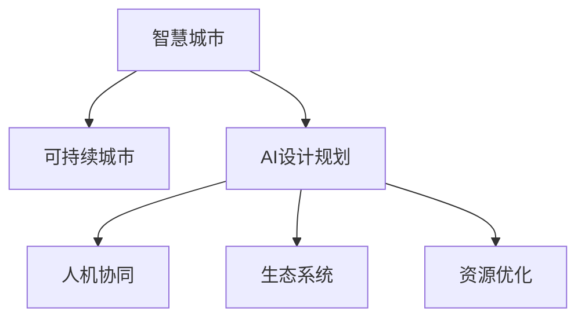

                 

# AI与人类计算：打造可持续发展的城市生活模式与设计规划

> 关键词：AI设计规划, 可持续城市, 智慧城市, 人机协同, 生态系统, 资源优化

## 1. 背景介绍

### 1.1 问题由来
随着全球人口的快速增长和工业化进程的加速，城市化进程进入了一个关键的历史节点。城市作为人类文明的重要载体，其环境、交通、能源、资源等各方面问题日益突出，资源利用效率低、生态环境退化、交通拥堵、人口压力等问题严重制约着城市的可持续发展。传统城市规划和建设方法已经无法满足当前和未来城市发展的需求。

与此同时，人工智能技术的快速发展为解决这些问题提供了新的思路和工具。AI作为一种强大的智能技术，能够对海量数据进行高效分析，辅助决策，优化资源配置，从而实现城市的可持续发展。但是，AI与城市规划和建设的深度融合还存在不少挑战，需要跨学科的共同努力。

### 1.2 问题核心关键点
本文聚焦于AI与城市计算的深度融合，探讨如何将AI技术应用于城市规划和建设中，构建可持续发展的智慧城市，优化资源配置，提升城市环境质量，改善居民生活质量。

### 1.3 问题研究意义
在当前城市面临多重挑战的背景下，AI与人类计算的结合不仅能够提升城市管理和服务的智能化水平，还能推动城市的可持续发展。AI辅助的城市设计规划能够：

1. **提升资源利用效率**：AI能够优化城市基础设施的配置和使用，提高能源利用率，降低碳排放，从而实现资源的高效利用。
2. **改善生态环境**：通过AI技术监测和预测环境变化，优化城市绿化和水资源管理，促进生态平衡。
3. **提升居民生活质量**：AI能够提供智能化的公共服务，如交通管理、智能医疗、教育等，增强城市服务能力。
4. **推动城市治理现代化**：通过AI技术实现城市管理智能化、决策科学化，提高城市治理的透明度和公平性。

## 2. 核心概念与联系

### 2.1 核心概念概述

为更好地理解AI与城市计算的融合，本节将介绍几个密切相关的核心概念：

- **智慧城市**：融合物联网、云计算、大数据、人工智能等先进技术，以实现城市管理和服务的智能化，提高城市治理效率和居民生活质量。
- **可持续城市**：注重环境保护、资源高效利用、经济可持续发展，以实现人与自然和谐共生。
- **AI设计规划**：将AI技术应用于城市规划和设计中，辅助决策，优化资源配置，提升城市功能。
- **人机协同**：将AI与人类专业知识相结合，共同决策和执行城市规划任务。
- **生态系统**：将城市看作一个生态系统，强调城市内部各要素之间的相互作用和协调发展。
- **资源优化**：利用AI技术优化城市资源配置，提高资源利用效率。

这些核心概念之间的逻辑关系可以通过以下Mermaid流程图来展示：



这个流程图展示了大语言模型的核心概念及其之间的关系：

1. 智慧城市是构建可持续城市的基础，通过智能化技术提升城市管理和服务的效率。
2. AI设计规划是实现智慧城市的重要手段，通过AI技术优化城市规划和设计。
3. 人机协同强调AI与人类专家的协作，共同完成城市规划任务。
4. 生态系统注重城市内部各要素之间的相互作用，强调可持续发展。
5. 资源优化利用AI技术优化城市资源配置，提高效率。

这些概念共同构成了智慧城市建设的基本框架，强调了技术应用与城市发展目标的紧密联系。

## 3. 核心算法原理 & 具体操作步骤
### 3.1 算法原理概述

AI与城市计算的融合主要依赖于以下几个核心算法原理：

- **数据融合与分析**：利用大数据技术，对城市各个要素（如交通流量、能源消耗、环境监测数据等）进行全面收集和分析，为城市规划和决策提供数据支撑。
- **机器学习与优化**：通过机器学习模型，对城市运行数据进行建模，预测未来趋势，优化资源配置，提升城市治理效率。
- **智能仿真与模拟**：利用智能仿真技术，构建虚拟城市模型，进行复杂系统仿真和决策模拟，评估方案的可行性和效果。
- **人机协同决策**：结合AI技术与人类专家知识，共同参与决策过程，确保规划方案的科学性和可操作性。

这些算法原理共同构成了AI与城市计算融合的基本框架，能够为城市规划和建设提供全面的技术支持。

### 3.2 算法步骤详解

AI与城市计算的融合过程主要包括以下几个关键步骤：

**Step 1: 数据采集与预处理**

- 利用物联网、传感器等技术，收集城市基础设施、交通、环境、居民活动等方面的数据。
- 对原始数据进行清洗、去重、归一化等预处理，确保数据的准确性和一致性。

**Step 2: 数据建模与分析**

- 利用机器学习模型（如回归模型、分类模型、聚类模型等）对城市运行数据进行建模，分析城市运行规律和趋势。
- 结合深度学习模型（如CNN、RNN、GAN等）进行复杂系统仿真和模拟，预测未来发展趋势。

**Step 3: 方案设计与优化**

- 基于数据建模和分析结果，设计城市规划和建设的方案，包括交通、能源、环境等方面的优化策略。
- 利用优化算法（如遗传算法、蚁群算法、线性规划等）对设计方案进行优化，提高方案的可行性和效果。

**Step 4: 方案评估与验证**

- 对设计方案进行模拟和评估，验证方案的可行性和效果。
- 结合专家意见和居民反馈，进行方案调整和改进。

**Step 5: 实施与监测**

- 将优化后的方案应用于城市建设和运营中，实时监测方案的执行效果。
- 对执行效果进行持续评估，根据实际情况进行调整和优化。

### 3.3 算法优缺点

AI与城市计算的融合过程具有以下优点：

- **高效性**：AI能够对海量数据进行高效分析和处理，快速提供决策支持。
- **智能性**：通过智能仿真和模拟，可以评估方案的可行性和效果，提高决策的科学性。
- **动态性**：实时监测和调整，能够适应城市发展和环境变化，保持方案的灵活性。

但同时也存在一些缺点：

- **数据依赖性**：数据质量和完整性直接影响AI分析结果，数据收集和处理难度较大。
- **模型复杂性**：复杂的系统模拟和优化模型需要较高的计算资源和技术门槛。
- **人机协作挑战**：AI与人类专家的协同需要良好的沟通和理解，存在一定的协同难度。
- **公平性与透明性**：AI决策过程复杂，可能导致透明性和公平性问题，需要加强监管和解释。

### 3.4 算法应用领域

AI与城市计算的融合技术已经在多个领域得到了广泛应用，如：

- **智慧交通**：通过AI技术优化交通信号、提高路网通行效率，减少交通拥堵。
- **智能能源**：利用AI技术优化能源配置和使用，降低能源浪费，提高能源利用率。
- **绿色建筑**：通过AI技术优化建筑设计和能源管理，降低建筑能耗，促进绿色建筑发展。
- **智能环保**：利用AI技术监测环境污染，预测环境变化，推动环境治理。
- **智慧医疗**：通过AI技术优化医疗资源配置，提高医疗服务效率和质量。
- **智能公共服务**：利用AI技术提升城市公共服务的智能化水平，如智能垃圾分类、智能停车等。

除了上述这些应用领域外，AI与城市计算的融合技术还将在更多场景中得到应用，为智慧城市的建设提供更多可能性。

## 4. 数学模型和公式 & 详细讲解  
### 4.1 数学模型构建

本节将使用数学语言对AI与城市计算的融合过程进行更加严格的刻画。

记城市运行数据为 $D = \{(x_i, y_i)\}_{i=1}^N$，其中 $x_i$ 为输入（如交通流量、能源消耗、环境监测数据等），$y_i$ 为输出（如道路通行效率、能源消耗量、环境污染指数等）。

定义城市运行模型的损失函数为：

$$
\mathcal{L}(\theta) = \frac{1}{N}\sum_{i=1}^N \ell(x_i, M_{\theta}(x_i))
$$

其中 $M_{\theta}$ 为城市运行模型，$\ell$ 为损失函数，通常为均方误差或交叉熵损失函数。

模型参数 $\theta$ 通过优化算法（如梯度下降、Adam等）进行更新，最小化损失函数：

$$
\theta \leftarrow \theta - \eta \nabla_{\theta}\mathcal{L}(\theta)
$$

其中 $\eta$ 为学习率。

### 4.2 公式推导过程

以智慧交通为例，假设交通流量数据为 $x = (x_1, x_2, ..., x_n)$，目标为最大化道路通行效率 $y$。构建城市交通模型的过程如下：

1. **数据预处理**：对原始交通流量数据进行清洗、去重、归一化等预处理，确保数据的准确性和一致性。
2. **数据建模**：利用机器学习模型（如线性回归、决策树、随机森林等）对交通流量数据进行建模，预测道路通行效率。
3. **模型训练**：通过优化算法对模型进行训练，最小化预测值与实际值之间的误差。
4. **模型验证**：利用交叉验证等方法验证模型的泛化能力。
5. **方案设计**：基于模型预测结果，设计交通优化方案，如调整交通信号灯时间、优化路网布局等。
6. **方案评估**：利用智能仿真技术进行方案评估，验证方案的可行性和效果。
7. **方案实施**：将优化方案应用于实际交通管理中，实时监测方案的执行效果。
8. **方案调整**：根据监测结果，持续优化和调整方案，确保交通管理的效果。

### 4.3 案例分析与讲解

以下以智慧交通为例，具体讲解AI与城市计算融合的具体实现过程。

**数据预处理**：
- 收集城市道路交通流量数据，去除异常值和缺失值，归一化处理，确保数据的准确性和一致性。

**数据建模**：
- 利用线性回归模型对交通流量数据进行建模，预测道路通行效率。
- 利用决策树模型进行交通流量的分类和预测。
- 结合随机森林模型提高预测的准确性和鲁棒性。

**模型训练**：
- 使用梯度下降算法对模型进行训练，最小化预测值与实际值之间的误差。
- 通过交叉验证等方法验证模型的泛化能力。

**方案设计**：
- 基于模型预测结果，设计交通优化方案，如调整交通信号灯时间、优化路网布局等。
- 结合专家知识和居民反馈，进行方案调整和改进。

**方案评估**：
- 利用智能仿真技术进行方案评估，验证方案的可行性和效果。
- 结合模拟数据和实际数据，进行方案的对比和优化。

**方案实施**：
- 将优化方案应用于实际交通管理中，实时监测方案的执行效果。
- 通过智能传感器实时采集数据，反馈方案的执行情况。

**方案调整**：
- 根据监测结果，持续优化和调整方案，确保交通管理的效果。
- 结合实时数据分析和模拟预测，调整交通信号灯时间、优化路网布局等。

通过以上过程，AI与城市计算的融合可以实现交通流量的高效管理和优化，提高道路通行效率，减少交通拥堵。

## 5. 项目实践：代码实例和详细解释说明
### 5.1 开发环境搭建

在进行AI与城市计算的融合实践前，我们需要准备好开发环境。以下是使用Python进行PyTorch开发的环境配置流程：

1. 安装Anaconda：从官网下载并安装Anaconda，用于创建独立的Python环境。

2. 创建并激活虚拟环境：
```bash
conda create -n city-env python=3.8 
conda activate city-env
```

3. 安装PyTorch：根据CUDA版本，从官网获取对应的安装命令。例如：
```bash
conda install pytorch torchvision torchaudio cudatoolkit=11.1 -c pytorch -c conda-forge
```

4. 安装各类工具包：
```bash
pip install numpy pandas scikit-learn matplotlib tqdm jupyter notebook ipython
```

完成上述步骤后，即可在`city-env`环境中开始AI与城市计算融合的实践。

### 5.2 源代码详细实现

下面我以智慧交通为例，给出使用PyTorch进行城市交通优化模型的PyTorch代码实现。

首先，定义交通优化模型的损失函数：

```python
import torch
from torch import nn
import torch.nn.functional as F

class TrafficModel(nn.Module):
    def __init__(self, input_size, output_size):
        super(TrafficModel, self).__init__()
        self.linear1 = nn.Linear(input_size, 128)
        self.linear2 = nn.Linear(128, output_size)

    def forward(self, x):
        x = F.relu(self.linear1(x))
        x = self.linear2(x)
        return x

# 定义损失函数
def traffic_loss(model, inputs, targets):
    predictions = model(inputs)
    loss = F.mse_loss(predictions, targets)
    return loss
```

然后，定义模型和优化器：

```python
import torch.optim as optim

# 定义模型
model = TrafficModel(input_size, output_size)

# 定义优化器
optimizer = optim.Adam(model.parameters(), lr=0.001)
```

接着，定义训练和评估函数：

```python
import numpy as np
from sklearn.model_selection import train_test_split

# 准备数据集
X_train, X_test, y_train, y_test = train_test_split(X, y, test_size=0.2, random_state=42)

# 数据标准化
X_train = (X_train - np.mean(X_train, axis=0)) / np.std(X_train, axis=0)
X_test = (X_test - np.mean(X_test, axis=0)) / np.std(X_test, axis=0)

# 定义训练和评估函数
def train_epoch(model, data_loader, optimizer):
    model.train()
    running_loss = 0.0
    for batch_idx, (inputs, targets) in enumerate(data_loader):
        optimizer.zero_grad()
        outputs = model(inputs)
        loss = traffic_loss(model, outputs, targets)
        loss.backward()
        optimizer.step()
        running_loss += loss.item()
    return running_loss / len(data_loader)

def evaluate(model, data_loader):
    model.eval()
    running_loss = 0.0
    predictions = []
    targets = []
    with torch.no_grad():
        for inputs, targets in data_loader:
            outputs = model(inputs)
            running_loss += traffic_loss(model, outputs, targets).item()
            predictions.append(outputs.numpy())
            targets.append(targets.numpy())
    return running_loss / len(data_loader), predictions, targets
```

最后，启动训练流程并在测试集上评估：

```python
epochs = 100
batch_size = 32

for epoch in range(epochs):
    loss = train_epoch(model, data_loader, optimizer)
    print(f"Epoch {epoch+1}, loss: {loss:.3f}")
    
    print(f"Epoch {epoch+1}, test loss: {evaluate(model, test_loader)[0]:.3f}")
    
print("Model trained.")
```

以上就是使用PyTorch进行智慧交通优化模型的完整代码实现。可以看到，得益于PyTorch的强大封装，我们能够用相对简洁的代码实现交通模型和优化过程。

### 5.3 代码解读与分析

让我们再详细解读一下关键代码的实现细节：

**TrafficModel类**：
- `__init__`方法：定义模型的网络结构，包括两个线性层和一个ReLU激活函数。
- `forward`方法：实现模型的前向传播过程，将输入数据经过两个线性层和激活函数输出预测值。

**traffic_loss函数**：
- 计算模型预测值与真实值之间的均方误差，作为损失函数。

**train_epoch函数**：
- 在每个epoch内，对训练集数据进行迭代，计算损失并更新模型参数。
- 使用Adam优化器，设置学习率为0.001，每次迭代更新模型参数。

**evaluate函数**：
- 在测试集上评估模型性能，计算均方误差。
- 收集模型的预测结果和真实结果，供后续分析使用。

**训练流程**：
- 定义总的epoch数和batch size，开始循环迭代
- 每个epoch内，先在训练集上训练，输出平均loss
- 在测试集上评估，输出模型在测试集上的均方误差

可以看到，PyTorch配合TensorFlow库使得智慧交通模型的实现变得简洁高效。开发者可以将更多精力放在数据处理、模型改进等高层逻辑上，而不必过多关注底层的实现细节。

当然，工业级的系统实现还需考虑更多因素，如模型的保存和部署、超参数的自动搜索、更灵活的任务适配层等。但核心的模型训练过程基本与此类似。

## 6. 实际应用场景
### 6.1 智能交通系统

智慧交通系统的构建是AI与城市计算融合的重要应用场景之一。传统交通管理依赖人工监控和经验决策，效率低、管理困难。而智慧交通系统利用AI技术，能够实时监测交通状况，优化交通信号和路网布局，实现交通的智能化管理。

在技术实现上，可以收集城市道路交通流量数据，利用机器学习模型预测交通状况，并设计交通优化方案。在实际应用中，智能交通系统能够实现：

- **实时监测与预警**：通过智能传感器实时监测交通流量和状况，及时预警交通拥堵和事故。
- **交通信号优化**：根据实时数据，动态调整交通信号灯时间，优化道路通行效率。
- **路网布局优化**：利用AI技术分析路网布局，提出优化建议，改善道路通行状况。

智慧交通系统通过智能化管理，能够显著提升城市交通效率，减少交通拥堵，改善居民出行体验。

### 6.2 绿色建筑优化

绿色建筑是实现城市可持续发展的重要途径。AI与城市计算的融合能够优化绿色建筑的能源管理，降低建筑能耗，促进能源的高效利用。

在技术实现上，可以收集建筑内部的能源消耗数据，利用机器学习模型分析能源消耗规律，并设计节能优化方案。在实际应用中，智能绿色建筑能够实现：

- **能源消耗监测**：通过智能传感器实时监测能源消耗数据，分析能耗规律。
- **能源管理优化**：利用机器学习模型预测能源需求，优化能源分配和使用。
- **节能技术推广**：结合专家知识和居民反馈，推广节能技术和设备。

智能绿色建筑通过智能化管理，能够显著提升能源利用效率，降低建筑能耗，推动绿色建筑发展。

### 6.3 智能公共服务

AI与城市计算的融合能够提升城市公共服务的智能化水平，提供更好的公共服务体验。

在技术实现上，可以收集公共服务数据，利用机器学习模型分析公共服务需求，并设计服务优化方案。在实际应用中，智能公共服务能够实现：

- **智能垃圾分类**：利用AI技术识别垃圾种类，优化垃圾分类和回收。
- **智能停车管理**：通过AI技术优化停车位配置和使用，减少停车难问题。
- **智能医疗服务**：利用AI技术优化医疗资源配置，提高医疗服务效率和质量。

智能公共服务通过智能化管理，能够显著提升公共服务效率，改善居民生活质量。

### 6.4 未来应用展望

随着AI与城市计算的不断融合，未来AI技术将在更多领域得到应用，为智慧城市的建设提供更多可能性。

在智慧城市中，AI技术将与物联网、云计算、大数据等技术深度融合，构建更加智能化、可持续的城市生态系统。智慧城市将具备以下特点：

- **智能化管理**：利用AI技术实现城市管理和服务的智能化，提升城市治理效率。
- **可持续发展**：通过AI技术优化资源配置，减少资源浪费，推动绿色城市发展。
- **人机协同**：将AI技术与人类专业知识相结合，共同参与城市规划和建设。
- **生态系统协同**：将城市看作一个生态系统，强调各要素之间的相互作用和协调发展。

通过AI与城市计算的融合，未来的智慧城市将具备更强的智能化、可持续性和协调性，为居民提供更美好的生活环境。

## 7. 工具和资源推荐
### 7.1 学习资源推荐

为了帮助开发者系统掌握AI与城市计算的融合理论基础和实践技巧，这里推荐一些优质的学习资源：

1. **《城市计算理论与实践》**：深入讲解城市计算的基本理论、技术方法和应用场景，是了解AI与城市计算融合的重要参考书籍。
2. **CS223《城市规划与设计》**：斯坦福大学开设的城市规划课程，涵盖了城市规划和设计的基本理论和实践方法，是城市规划师和设计师的必读教材。
3. **《人工智能与城市》**：一本关于AI与城市计算融合的学术论文集，汇聚了多个领域的最新研究成果，值得深入研读。
4. **Coursera《智慧城市》课程**：Coursera推出的智慧城市课程，涵盖了智慧城市的基本概念、技术方法和应用场景，是了解智慧城市的重要途径。
5. **Kaggle《城市数据挑战》**：Kaggle上关于城市数据的挑战项目，通过实际数据集进行模型训练和优化，是学习和实践AI与城市计算融合的实战平台。

通过对这些资源的学习实践，相信你一定能够快速掌握AI与城市计算的融合精髓，并用于解决实际的智慧城市问题。

### 7.2 开发工具推荐

高效的开发离不开优秀的工具支持。以下是几款用于AI与城市计算融合开发的常用工具：

1. **PyTorch**：基于Python的开源深度学习框架，灵活动态的计算图，适合快速迭代研究。大部分预训练语言模型都有PyTorch版本的实现。
2. **TensorFlow**：由Google主导开发的开源深度学习框架，生产部署方便，适合大规模工程应用。同样有丰富的预训练语言模型资源。
3. **Transformers库**：HuggingFace开发的NLP工具库，集成了众多SOTA语言模型，支持PyTorch和TensorFlow，是进行AI与城市计算融合开发的利器。
4. **Weights & Biases**：模型训练的实验跟踪工具，可以记录和可视化模型训练过程中的各项指标，方便对比和调优。与主流深度学习框架无缝集成。
5. **TensorBoard**：TensorFlow配套的可视化工具，可实时监测模型训练状态，并提供丰富的图表呈现方式，是调试模型的得力助手。
6. **Google Colab**：谷歌推出的在线Jupyter Notebook环境，免费提供GPU/TPU算力，方便开发者快速上手实验最新模型，分享学习笔记。

合理利用这些工具，可以显著提升AI与城市计算融合任务的开发效率，加快创新迭代的步伐。

### 7.3 相关论文推荐

AI与城市计算的融合研究源于学界的持续研究。以下是几篇奠基性的相关论文，推荐阅读：

1. **《城市计算：一个框架》**：提出城市计算的概念和框架，为AI与城市计算融合提供了理论基础。
2. **《智慧城市：技术、策略和规划》**：探讨智慧城市的定义、技术和规划方法，是智慧城市建设的重要参考。
3. **《智能交通系统：技术、应用和挑战》**：详细讲解智能交通系统的技术和应用场景，是智能交通系统建设的重要参考。
4. **《绿色建筑优化：AI技术的应用》**：探讨AI技术在绿色建筑优化中的应用，推动绿色建筑发展。
5. **《智能公共服务：技术、管理和挑战》**：探讨智能公共服务的技术和管理方法，提升公共服务效率。

这些论文代表了大语言模型微调技术的发展脉络。通过学习这些前沿成果，可以帮助研究者把握学科前进方向，激发更多的创新灵感。

## 8. 总结：未来发展趋势与挑战

### 8.1 总结

本文对AI与城市计算的融合方法进行了全面系统的介绍。首先阐述了AI与城市计算的研究背景和意义，明确了智慧城市建设的基本框架和目标。其次，从原理到实践，详细讲解了AI与城市计算融合的基本算法和操作步骤，给出了AI与城市计算融合的完整代码实例。同时，本文还广泛探讨了AI与城市计算融合技术在智能交通、绿色建筑、智能公共服务等多个领域的应用前景，展示了AI与城市计算融合技术的巨大潜力。此外，本文精选了AI与城市计算融合的各类学习资源，力求为读者提供全方位的技术指引。

通过本文的系统梳理，可以看到，AI与城市计算的融合技术正在成为智慧城市建设的重要范式，能够提升城市管理和服务的智能化水平，推动城市的可持续发展。AI与城市计算的融合需要跨学科的共同努力，未来AI与城市计算的融合技术必将推动城市治理现代化，提升居民生活质量。

### 8.2 未来发展趋势

展望未来，AI与城市计算的融合技术将呈现以下几个发展趋势：

1. **智能化水平提升**：AI技术将与更多技术融合，推动智慧城市的智能化水平提升。
2. **可持续性增强**：通过优化资源配置，推动绿色城市建设，实现可持续发展。
3. **人机协同增强**：AI与人类专业知识的结合将更加紧密，共同参与城市规划和建设。
4. **跨领域融合**：AI与城市计算的融合将进一步拓展到更多领域，如智慧医疗、智能物流等。
5. **实时性增强**：通过实时监测和反馈，提高城市管理的及时性和有效性。
6. **数据驱动增强**：通过大数据分析，提升城市管理的科学性和决策的精准性。

以上趋势凸显了AI与城市计算融合技术的广阔前景。这些方向的探索发展，必将进一步提升智慧城市的智能化和可持续性，推动城市治理现代化。

### 8.3 面临的挑战

尽管AI与城市计算的融合技术已经取得了显著成果，但在迈向更加智能化、普适化应用的过程中，仍面临以下挑战：

1. **数据依赖性**：高质量的城市数据是AI与城市计算融合的基础，数据收集和处理难度较大。
2. **模型复杂性**：复杂的系统模拟和优化模型需要较高的计算资源和技术门槛。
3. **人机协作挑战**：AI与人类专家的协同需要良好的沟通和理解，存在一定的协同难度。
4. **公平性与透明性**：AI决策过程复杂，可能导致透明性和公平性问题，需要加强监管和解释。
5. **技术门槛高**：AI与城市计算的融合技术需要跨学科的知识，对从业人员的技术门槛较高。
6. **隐私与安全**：城市数据的隐私和安全问题，需要制定相应的法律法规和技术保障。

解决这些挑战需要多方面的努力，包括提升数据采集和处理能力、优化模型结构和算法、加强人机协作和监管等。只有克服这些挑战，才能真正实现AI与城市计算的深度融合。

### 8.4 研究展望

面对AI与城市计算融合所面临的挑战，未来的研究需要在以下几个方面寻求新的突破：

1. **数据采集与处理技术**：提升城市数据的采集和处理能力，确保数据的准确性和完整性。
2. **模型优化与简化**：优化模型结构和算法，降低模型复杂性，提高模型的可解释性和透明度。
3. **人机协同技术**：提升人机协作水平，构建更加协同的城市规划和管理系统。
4. **隐私与安全技术**：提升城市数据的隐私保护和安全防护，确保数据的安全性和可靠性。
5. **跨领域融合技术**：推动AI与城市计算在更多领域的应用，提升智慧城市建设的广度和深度。

这些研究方向的探索，必将引领AI与城市计算融合技术迈向更高的台阶，为智慧城市的建设提供更多可能性和新思路。

## 9. 附录：常见问题与解答

**Q1：AI与城市计算的融合技术是否适用于所有城市？**

A: AI与城市计算的融合技术适用于大多数城市，但需要根据城市规模、特点和需求进行适当的调整和优化。对于特别复杂的城市，如超大都市，需要采用更复杂的模型和技术进行综合规划和管理。

**Q2：如何评估AI与城市计算融合技术的效果？**

A: 评估AI与城市计算融合技术的效果主要通过以下几个指标：
1. **运行效率**：衡量系统的运行速度和响应时间。
2. **资源利用效率**：衡量资源的使用效率，如能源消耗、交通流量等。
3. **服务质量**：衡量服务的质量和满意度，如居民满意度、服务响应时间等。
4. **环境影响**：衡量对环境的影响，如减少碳排放、提高能源利用率等。
5. **安全与隐私**：衡量数据安全和隐私保护水平。

通过以上指标的综合评估，可以全面了解AI与城市计算融合技术的效果。

**Q3：AI与城市计算融合技术的主要挑战是什么？**

A: AI与城市计算融合技术的主要挑战包括：
1. **数据依赖性**：高质量的城市数据是AI与城市计算融合的基础，数据收集和处理难度较大。
2. **模型复杂性**：复杂的系统模拟和优化模型需要较高的计算资源和技术门槛。
3. **人机协作挑战**：AI与人类专家的协同需要良好的沟通和理解，存在一定的协同难度。
4. **公平性与透明性**：AI决策过程复杂，可能导致透明性和公平性问题，需要加强监管和解释。
5. **技术门槛高**：AI与城市计算的融合技术需要跨学科的知识，对从业人员的技术门槛较高。
6. **隐私与安全**：城市数据的隐私和安全问题，需要制定相应的法律法规和技术保障。

解决这些挑战需要多方面的努力，包括提升数据采集和处理能力、优化模型结构和算法、加强人机协作和监管等。

**Q4：AI与城市计算融合技术在实际应用中有哪些注意事项？**

A: 在实际应用中，AI与城市计算融合技术需要注意以下几个方面：
1. **数据隐私保护**：确保城市数据的隐私和安全，避免数据泄露和滥用。
2. **公平性与透明性**：确保AI决策过程的透明性和公平性，避免歧视和偏见。
3. **技术集成**：确保AI技术与城市管理系统的无缝集成，避免数据孤岛和信息孤岛。
4. **人机协同**：确保人机协作的有效性，避免AI过度干预或干预不足。
5. **持续优化**：根据实际情况持续优化和调整AI模型，确保其适应性和实用性。

只有充分考虑以上因素，才能真正实现AI与城市计算的深度融合，提升智慧城市建设的科学性和实用性。

---

作者：禅与计算机程序设计艺术 / Zen and the Art of Computer Programming

