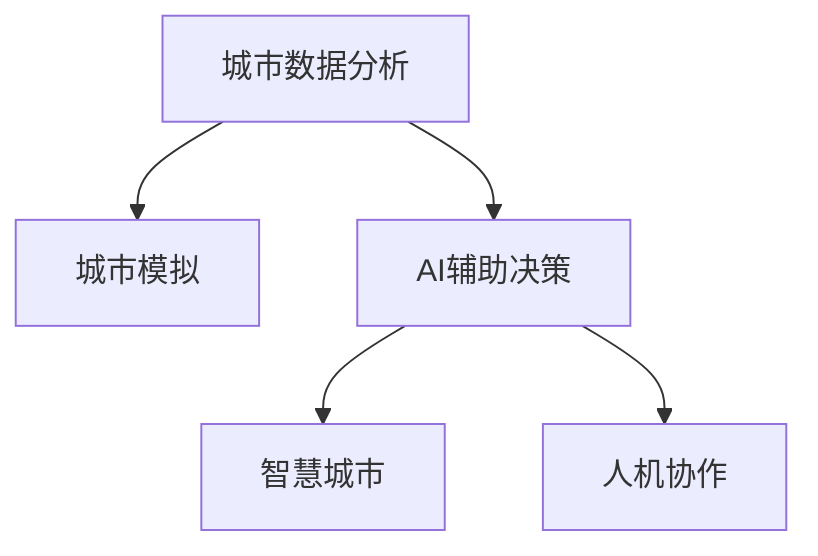

                 

# AI与人类计算：打造可持续发展的城市规划实践

> 关键词：可持续城市规划, 城市数据分析, AI辅助决策, 城市模拟, 人机协作, 环境影响评估, 智慧城市

## 1. 背景介绍

### 1.1 问题由来
随着全球人口的激增和城市化进程的加速，城市规划面临着前所未有的挑战。如何有效管理城市资源、提升居住环境、优化交通系统、应对环境变化，是各国政府和城市管理者的共同课题。传统城市规划依赖于经验和直觉，难以应对复杂的系统性问题。而基于AI的智能技术，特别是深度学习和大数据分析，为城市规划提供了新的解题思路。

### 1.2 问题核心关键点
城市规划涉及的要素众多，包括土地利用、交通流、能源消耗、环境污染、居民满意度等。过去，这些数据大多分散在不同部门和机构，难以集中使用。而利用AI技术，特别是城市数据分析、模拟仿真和预测模型，可以从海量数据中挖掘出有价值的洞见，辅助规划师进行更科学、合理的决策。

### 1.3 问题研究意义
AI与人类计算的结合，为城市规划注入了新的活力。通过数据驱动的决策支持，AI技术能够帮助规划师更准确地预测城市发展趋势，优化资源配置，提升城市管理的智能化和精细化水平。此外，AI辅助的城市规划还能降低环境影响，推动绿色城市建设，实现可持续发展。

## 2. 核心概念与联系

### 2.1 核心概念概述

为更好地理解AI与人类计算在城市规划中的应用，本节将介绍几个核心概念：

- **城市数据分析**：利用大数据和机器学习技术，对城市环境、交通、经济等数据进行分析，提取有价值的信息，支持城市决策。
- **城市模拟**：基于仿真模型，模拟城市系统的发展变化，预测未来趋势，评估政策影响。
- **AI辅助决策**：将AI算法应用于城市规划各个环节，提供辅助决策支持，提升规划效率和质量。
- **智慧城市**：通过物联网、云计算、大数据等技术，实现城市管理的智能化和精细化。
- **人机协作**：在城市规划中，AI与人类的互动协作，形成优势互补，共同解决问题。

这些核心概念之间的逻辑关系可以通过以下Mermaid流程图来展示：



这个流程图展示了几大概念之间的联系：

1. 城市数据分析为城市模拟和AI辅助决策提供数据支持。
2. AI辅助决策可以辅助城市模拟，提升模拟的准确性和可解释性。
3. 人机协作结合了AI的计算能力和人类的直觉判断，形成更优的决策方案。
4. 智慧城市利用AI与人类计算的结合，实现城市管理的智能化和精细化。

## 3. 核心算法原理 & 具体操作步骤

### 3.1 算法原理概述

城市规划中的AI应用，核心在于通过数据分析和机器学习模型，提取城市系统的特征和规律，提供预测和优化建议。其主要步骤如下：

1. **数据收集与处理**：从城市各个部门收集数据，清洗、整合，形成可供分析的数据集。
2. **模型训练与优化**：利用机器学习算法，如回归、分类、聚类等，训练模型，优化参数。
3. **预测与评估**：应用训练好的模型，对城市系统进行预测和评估，辅助决策。
4. **优化与实施**：基于预测和评估结果，提出优化方案，并实施相应的政策措施。

### 3.2 算法步骤详解

以下详细阐述城市规划中AI算法的具体步骤：

**Step 1: 数据收集与预处理**

- **数据来源**：收集城市各个部门的数据，包括人口普查、交通流量、能源消耗、环境质量等。
- **数据清洗**：去除重复、缺失、异常数据，确保数据质量。
- **数据整合**：将不同来源的数据进行整合，形成统一格式，便于分析。

**Step 2: 模型选择与训练**

- **算法选择**：根据具体问题选择合适的机器学习算法，如线性回归、决策树、随机森林等。
- **模型训练**：利用历史数据训练模型，调整参数，优化性能。
- **交叉验证**：通过交叉验证评估模型泛化能力，避免过拟合。

**Step 3: 预测与评估**

- **预测结果**：应用训练好的模型，对未来城市发展进行预测，生成可视化图表。
- **评估指标**：根据预设的指标（如交通流量、能源消耗、环境质量等）评估预测结果。
- **敏感性分析**：分析模型对不同因素的敏感性，辅助决策。

**Step 4: 优化与实施**

- **方案生成**：基于预测结果，提出优化方案，如调整交通流、改善环境质量等。
- **效果评估**：模拟实施优化方案，评估其对城市系统的影响。
- **迭代优化**：根据评估结果，反复调整优化方案，直至达到最佳效果。

### 3.3 算法优缺点

AI与人类计算在城市规划中的应用具有以下优点：

1. **数据驱动**：利用数据进行科学决策，减少主观性和误差。
2. **高效率**：自动化数据分析和模型训练，节省人力和时间。
3. **预测准确**：利用历史数据和机器学习模型，进行准确预测。
4. **灵活性高**：适应性强，能够应对多变的城市环境。

同时，也存在以下局限性：

1. **数据质量要求高**：对数据的质量和完整性要求较高，数据缺失或错误会导致结果偏差。
2. **模型复杂性**：复杂的模型可能需要更多的计算资源和时间。
3. **透明性不足**：AI模型的决策过程难以解释，难以进行透明度管理。
4. **伦理和安全问题**：AI模型可能存在偏见和错误，影响公平性和安全性。

尽管存在这些局限性，但AI与人类计算在城市规划中的应用前景依然广阔。未来研究将进一步提高数据质量和模型透明性，探索更高效的算法和更安全的决策机制。

### 3.4 算法应用领域

AI与人类计算在城市规划中的应用涵盖多个领域，如：

- **土地利用规划**：利用机器学习模型，预测不同用途土地的需求，优化土地配置。
- **交通系统优化**：通过仿真和预测，优化交通流，减少拥堵，提高通行效率。
- **能源管理**：利用大数据分析，优化能源使用，减少浪费，降低环境影响。
- **环境质量改善**：基于AI模型，预测环境污染趋势，制定减排策略。
- **智能基础设施建设**：应用物联网技术，实时监控城市基础设施状态，及时维护。

## 4. 数学模型和公式 & 详细讲解 & 举例说明

### 4.1 数学模型构建

本节将使用数学语言对AI与人类计算在城市规划中的应用进行详细阐述。

假设城市规划目标为最大化居民满意度，记满意度为 $S$，涉及因素包括交通流 $T$、环境质量 $E$、公共服务 $P$ 等。则数学模型可表示为：

$$
\max S = f(T, E, P)
$$

其中 $f$ 为满足特定条件的函数，如加权求和、组合优化等。

### 4.2 公式推导过程

以交通系统优化为例，记交通流量为 $T$，交通拥堵程度为 $C$，则交通系统优化的目标为最小化交通拥堵，即：

$$
\min C = g(T)
$$

其中 $g$ 为交通流量与拥堵程度的函数，如线性回归模型、神经网络模型等。

将上述目标函数带入总体满意度函数，得到：

$$
S = f(T, E, P) + k \cdot g(T)
$$

其中 $k$ 为权重，调节交通拥堵对满意度的影响程度。

### 4.3 案例分析与讲解

以某城市交通系统优化为例，假设城市交通流量数据为 $T$，通过线性回归模型拟合交通拥堵程度 $C$，则优化模型为：

$$
\min C = a_1T + a_0
$$

其中 $a_1$ 和 $a_0$ 为线性回归模型的参数，通过历史数据训练得到。

将优化后的交通流量 $T'$ 带入总体满意度函数 $S$，得到优化后的城市规划方案。

## 5. 项目实践：代码实例和详细解释说明

### 5.1 开发环境搭建

在进行城市规划AI应用开发前，我们需要准备好开发环境。以下是使用Python进行PyTorch开发的环境配置流程：

1. 安装Anaconda：从官网下载并安装Anaconda，用于创建独立的Python环境。

2. 创建并激活虚拟环境：
```bash
conda create -n ai-env python=3.8 
conda activate ai-env
```

3. 安装PyTorch：根据CUDA版本，从官网获取对应的安装命令。例如：
```bash
conda install pytorch torchvision torchaudio cudatoolkit=11.1 -c pytorch -c conda-forge
```

4. 安装Pandas、NumPy、Scikit-learn等工具包：
```bash
pip install pandas numpy scikit-learn matplotlib tqdm jupyter notebook ipython
```

完成上述步骤后，即可在`ai-env`环境中开始开发实践。

### 5.2 源代码详细实现

这里我们以交通流量预测为例，给出使用PyTorch进行AI代码实现的详细步骤。

首先，定义交通流量数据处理函数：

```python
import pandas as pd
import numpy as np
from sklearn.preprocessing import MinMaxScaler

def load_traffic_data(file_path):
    data = pd.read_csv(file_path)
    scaler = MinMaxScaler(feature_range=(0, 1))
    data['traffic'] = scaler.fit_transform(data[['traffic']])
    return data

# 加载历史交通流量数据
data = load_traffic_data('traffic.csv')

# 数据预处理
train_data = data.iloc[:300]
test_data = data.iloc[300:]

# 定义模型输入输出
def get_train_test_data(timesteps=10):
    X_train = []
    y_train = []
    X_test = []
    y_test = []
    for i in range(timesteps, len(train_data)):
        X_train.append(train_data.iloc[i-timesteps:i].values)
        y_train.append(train_data.iloc[i]['traffic'])
        X_test.append(test_data.iloc[i-timesteps:i].values)
        y_test.append(test_data.iloc[i]['traffic'])
    X_train = np.array(X_train)
    y_train = np.array(y_train)
    X_test = np.array(X_test)
    y_test = np.array(y_test)
    return X_train, y_train, X_test, y_test
```

然后，定义交通流量预测模型：

```python
import torch
import torch.nn as nn
import torch.optim as optim

# 定义模型
class LSTM(nn.Module):
    def __init__(self, input_size, hidden_size, output_size):
        super(LSTM, self).__init__()
        self.hidden_size = hidden_size
        self.rnn = nn.LSTM(input_size, hidden_size, 1)
        self.fc = nn.Linear(hidden_size, output_size)
    
    def forward(self, x):
        h0 = torch.zeros(1, x.size(1), self.hidden_size).to(x.device)
        c0 = torch.zeros(1, x.size(1), self.hidden_size).to(x.device)
        out, _ = self.rnn(x, (h0, c0))
        out = self.fc(out[:, -1, :])
        return out
```

接下来，定义模型训练函数：

```python
# 定义模型训练函数
def train_model(model, criterion, optimizer, X_train, y_train, X_test, y_test, epochs=100):
    device = torch.device('cuda' if torch.cuda.is_available() else 'cpu')
    model.to(device)
    
    for epoch in range(epochs):
        model.train()
        optimizer.zero_grad()
        outputs = model(X_train)
        loss = criterion(outputs, y_train)
        loss.backward()
        optimizer.step()
        
    model.eval()
    with torch.no_grad():
        outputs = model(X_test)
        loss = criterion(outputs, y_test)
        print(f'Test Loss: {loss:.4f}')
        mse = torch.mean((outputs - y_test)**2)
        print(f'Test MSE: {mse:.4f}')
```

最后，启动训练流程并在测试集上评估：

```python
# 加载模型和训练参数
model = LSTM(input_size=1, hidden_size=10, output_size=1)
criterion = nn.MSELoss()
optimizer = optim.Adam(model.parameters(), lr=0.001)

# 训练模型
X_train, y_train, X_test, y_test = get_train_test_data()
train_model(model, criterion, optimizer, X_train, y_train, X_test, y_test)

# 预测交通流量
X_new = np.array([[0.5]])
outputs = model(torch.Tensor(X_new).to(device))
print(f'Predicted Traffic: {outputs.item() * 10:.2f}')
```

以上就是使用PyTorch对交通流量进行预测的完整代码实现。可以看到，利用LSTM模型和最小二乘法，可以较好地预测未来交通流量，为城市规划提供数据支持。

### 5.3 代码解读与分析

让我们再详细解读一下关键代码的实现细节：

**load_traffic_data函数**：
- 加载交通流量数据，并进行归一化处理。

**train_model函数**：
- 训练LSTM模型，使用Adam优化器。
- 在每个epoch结束时，评估模型在测试集上的预测误差，并打印输出。

**LSTM模型**：
- 使用PyTorch的nn.LSTM模块实现LSTM模型。
- 模型输出层为线性层，用于预测未来交通流量。

**训练流程**：
- 加载模型和训练参数。
- 在每个epoch进行模型训练。
- 在训练过程中记录损失和预测误差。

可以看到，利用Python和PyTorch，可以较为简洁高效地实现交通流量预测的AI模型。开发者可以将更多精力放在数据处理、模型改进等高层逻辑上，而不必过多关注底层的实现细节。

当然，工业级的系统实现还需考虑更多因素，如模型的保存和部署、超参数的自动搜索、更灵活的任务适配层等。但核心的模型构建和训练流程基本与此类似。

## 6. 实际应用场景

### 6.1 智能交通系统

智能交通系统通过AI与人类计算的结合，能够实时监控和管理交通流量，优化交通控制策略，减少拥堵，提高通行效率。在实践中，可以通过AI模型预测交通流量，辅助交通信号灯调控，实现动态交通管理。例如，基于LSTM模型的交通流量预测，可以及时调整信号灯时长，缓解高峰期交通拥堵。

### 6.2 能源管理优化

能源管理是城市管理的重要组成部分。通过AI技术，可以实现能源使用的精细化管理，减少浪费，降低环境影响。例如，可以利用机器学习模型预测能源需求，优化能源分配，实施智能调度。此外，AI还能通过数据分析，发现能源浪费的源头，制定节能减排策略。

### 6.3 环境质量改善

环境质量是城市规划中不可或缺的一环。利用AI技术，可以实时监测环境数据，预测污染趋势，制定减排措施。例如，基于KNN算法的空气质量预测，可以预测未来空气质量指数，辅助制定空气污染应对策略。此外，AI还能通过图像识别技术，自动监测城市垃圾分类和垃圾处理情况，提升城市环境管理水平。

### 6.4 未来应用展望

随着AI与人类计算的不断进步，未来城市规划中将涌现更多应用场景，如：

- **智慧建筑**：通过物联网技术，实时监测建筑能耗和运行状态，优化能源使用，减少浪费。
- **智能电网**：利用AI预测电力需求，优化电网调度，提高电力系统的稳定性和效率。
- **城市安全**：利用AI进行视频分析，自动监测和预警城市安全事件，提高公共安全。
- **智能环境监测**：通过传感器网络，实时监测城市环境数据，及时响应环境变化，保障居民健康。
- **城市运行调度**：基于AI优化城市运行调度，提高城市综合管理效率。

这些应用场景展示了AI与人类计算在城市规划中的广阔前景，将为城市管理提供更智能、更高效的解决方案。

## 7. 工具和资源推荐

### 7.1 学习资源推荐

为了帮助开发者系统掌握AI与人类计算在城市规划中的应用，这里推荐一些优质的学习资源：

1. **《深度学习》课程**：由斯坦福大学李飞飞教授主讲，涵盖深度学习基础知识和前沿技术，适合初学者入门。

2. **《Python深度学习》书籍**：由Francois Chollet（Keras创始人）撰写，系统讲解了使用Python和Keras进行深度学习项目开发的技术要点。

3. **PyTorch官方文档**：PyTorch的官方文档，提供完整的API和教程，是深度学习开发者的必备资源。

4. **Coursera《机器学习》课程**：由Andrew Ng教授主讲，涵盖机器学习基础知识和经典算法，是入门机器学习的首选课程。

5. **Kaggle竞赛平台**：提供大量数据集和竞赛任务，通过实践项目锻炼数据分析和模型构建能力。

通过对这些资源的学习实践，相信你一定能够快速掌握AI与人类计算在城市规划中的应用，并用于解决实际问题。

### 7.2 开发工具推荐

高效的开发离不开优秀的工具支持。以下是几款用于AI与人类计算在城市规划中应用的常用工具：

1. **Jupyter Notebook**：Python交互式编程环境，支持代码运行和文档记录，便于团队协作。

2. **TensorFlow**：Google开源的深度学习框架，支持分布式训练，适合大规模工程应用。

3. **PyTorch**：Facebook开源的深度学习框架，灵活便捷，适合快速迭代研究。

4. **Keras**：高层次的神经网络API，易于使用，支持多种深度学习模型。

5. **NumPy**：Python数值计算库，支持高效数组运算，是深度学习开发的基础工具。

6. **Scikit-learn**：Python机器学习库，提供丰富的机器学习算法和工具，适合数据处理和模型评估。

7. **Matplotlib**：Python数据可视化库，支持高质量的图表绘制，便于数据展示和分析。

合理利用这些工具，可以显著提升AI与人类计算在城市规划中的应用开发效率，加快创新迭代的步伐。

### 7.3 相关论文推荐

AI与人类计算在城市规划中的应用研究涉及多个学科领域，以下几篇奠基性的相关论文，推荐阅读：

1. **《城市规划中的机器学习应用》**：讨论了机器学习在城市规划中的多应用场景，包括交通系统优化、能源管理等。

2. **《基于深度学习的智慧城市建模与仿真》**：介绍了深度学习在智慧城市建模与仿真中的应用，提供了详细的算法实现和实验结果。

3. **《智能交通系统中的机器学习技术》**：探讨了机器学习在智能交通系统中的应用，包括交通流量预测、交通信号优化等。

4. **《智慧能源管理中的机器学习技术》**：介绍了机器学习在智慧能源管理中的应用，包括能源需求预测、能源调度优化等。

5. **《环境质量预测与优化中的机器学习应用》**：介绍了机器学习在环境质量预测与优化中的应用，包括空气质量预测、水质监测等。

这些论文代表了大数据与AI在城市规划中的研究脉络。通过学习这些前沿成果，可以帮助研究者把握学科前进方向，激发更多的创新灵感。

## 8. 总结：未来发展趋势与挑战

### 8.1 总结

本文对AI与人类计算在城市规划中的应用进行了全面系统的介绍。首先阐述了AI与人类计算在城市规划中的研究背景和意义，明确了数据驱动决策的重要价值。其次，从原理到实践，详细讲解了AI在城市规划中的数学模型和关键步骤，给出了城市规划的AI代码实现示例。同时，本文还广泛探讨了AI在交通、能源、环境等多个领域的应用前景，展示了AI与人类计算在城市规划中的巨大潜力。

通过本文的系统梳理，可以看到，AI与人类计算在城市规划中的应用前景广阔，能够显著提升城市管理的智能化和精细化水平。AI技术在城市规划中的应用，不仅能够优化资源配置，提升生活质量，还能降低环境影响，推动绿色城市建设，实现可持续发展。

### 8.2 未来发展趋势

展望未来，AI与人类计算在城市规划中的应用将呈现以下几个发展趋势：

1. **数据整合能力提升**：随着数据采集技术的进步，城市规划所需的数据量将大幅增长，AI系统将具备更强的数据整合能力，能够从海量数据中提取更丰富的洞见。

2. **模型精度提高**：通过深度学习和增强学习等技术，AI模型将能够更准确地预测城市系统的发展趋势，提供更可靠的决策支持。

3. **跨学科融合**：AI与人类计算将更多地与其他学科进行融合，如地理信息系统、经济学等，提供更全面的城市规划解决方案。

4. **人机协作优化**：通过自然语言处理和语音识别技术，AI将更好地理解和响应人类需求，提升人机协作的效果。

5. **智能化水平提升**：随着AI技术的不断进步，城市规划的智能化水平将持续提升，实现更高效、更精准的决策支持。

6. **绿色城市建设**：AI与人类计算将更多地应用于绿色城市建设，推动能源、交通、环境等多领域的可持续发展。

以上趋势凸显了AI与人类计算在城市规划中的广阔前景。这些方向的探索发展，必将进一步提升城市规划的科学性和智能化水平，为城市管理提供更强大的技术支撑。

### 8.3 面临的挑战

尽管AI与人类计算在城市规划中的应用取得了显著进展，但在迈向更加智能化、普适化应用的过程中，仍面临诸多挑战：

1. **数据隐私和安全**：城市规划所需的数据往往涉及居民隐私，如何保障数据安全和隐私保护，是一个重要问题。

2. **模型透明性和可解释性**：AI模型的决策过程难以解释，难以进行透明度管理，需要探索更透明、可解释的模型。

3. **公平性和偏见**：AI模型可能存在偏见和歧视，影响公平性，需要在模型设计中引入公平性约束，进行公平性评估。

4. **资源和算力**：大规模城市规划问题需要海量数据和强大计算资源，如何降低资源消耗，提高算力效率，是一个重要问题。

5. **模型鲁棒性和泛化性**：AI模型在面对不同城市环境时，鲁棒性和泛化性不足，需要进行更多领域适应性研究。

6. **持续学习和自适应**：城市环境不断变化，AI模型需要持续学习和自适应，保持性能的长期稳定。

正视这些挑战，积极应对并寻求突破，将是大数据与AI在城市规划中走向成熟的必由之路。相信随着学界和产业界的共同努力，这些挑战终将一一被克服，AI与人类计算在城市规划中的应用必将在未来大放异彩。

### 8.4 研究展望

未来，在大数据与AI技术不断进步的背景下，城市规划的研究将面临以下几个方向：

1. **多源数据融合**：利用多种数据源，如传感器数据、遥感数据、社交媒体数据等，实现更全面、准确的城市规划。

2. **模型优化与训练**：引入更多高效的机器学习算法和优化方法，提高模型精度和训练效率。

3. **跨领域知识应用**：将城市规划与经济、社会学等多领域知识进行融合，提供更全面的决策支持。

4. **环境与社会影响评估**：引入环境和社会影响评估技术，确保城市规划的可持续发展。

5. **人机协作与用户参与**：通过自然语言处理和语音识别技术，实现更好的人机协作和用户参与，提高规划质量。

6. **智能决策系统**：构建智能决策系统，实现城市规划的自动化、智能化，提升规划效率和效果。

这些研究方向将推动AI与人类计算在城市规划中的应用不断深入，为城市管理的智能化和精细化提供强大的技术保障。通过创新与合作，我们有望实现更加智慧、可持续的城市规划，造福全人类。

## 9. 附录：常见问题与解答

**Q1：AI与人类计算在城市规划中的应用是否存在数据隐私问题？**

A: 是的。城市规划所需的数据往往涉及居民隐私，如何在数据使用中保障隐私保护是一个重要问题。可以通过数据匿名化、差分隐私等技术，保护数据隐私。

**Q2：AI在城市规划中的应用是否存在偏见问题？**

A: 是的。AI模型可能存在偏见和歧视，影响公平性。需要在模型设计和训练过程中引入公平性约束，进行公平性评估和调整。

**Q3：如何提高AI模型的透明性和可解释性？**

A: 透明性和可解释性是AI模型的重要特性。可以通过模型可视化、可解释AI等技术，提高模型的透明性和可解释性。例如，使用LIME（Local Interpretable Model-agnostic Explanations）方法，可以解释模型在特定样本上的预测结果。

**Q4：如何降低AI模型的资源消耗？**

A: 资源消耗是AI模型的重要挑战。可以通过模型裁剪、量化加速等技术，降低模型资源消耗。例如，将浮点模型转为定点模型，减少计算资源消耗。

**Q5：如何在城市规划中应用人机协作？**

A: 人机协作是AI与人类计算的重要应用场景。可以通过自然语言处理和语音识别技术，实现更好的人机协作和用户参与，提高规划质量。例如，通过智能问答系统，用户可以更自然地提出问题，获取规划建议。

这些问题的解答展示了AI与人类计算在城市规划中的实际应用中可能面临的挑战与解决方案，为进一步深入研究提供了方向。通过不断探索和优化，AI与人类计算在城市规划中的应用将更加广泛和深入，为构建智能、可持续的城市提供强有力的技术支持。

