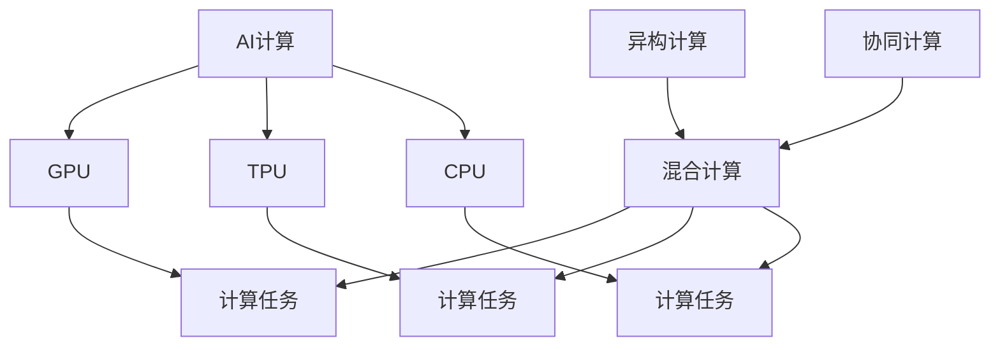

                 

## 1. 背景介绍

### 1.1 问题由来

进入21世纪，随着信息技术的飞速发展，人工智能（AI）逐渐成为了推动社会进步的重要力量。AI技术从最初的专家系统、神经网络、机器学习等，逐渐扩展到深度学习、大语言模型、增强学习等多个领域，并开始广泛应用于自动驾驶、金融投资、医疗诊断、教育培训等多个行业。

然而，当前AI的发展仍面临许多挑战，其中最为突出的问题是其与人类计算能力的平衡。传统计算模式依赖于以CPU为主的高性能计算设备，而AI计算则更依赖于GPU、TPU等专业设备。这种计算模式的差异，使得AI计算在能耗、成本等方面存在一定的局限性。

### 1.2 问题核心关键点

构建可持续发展的未来，是AI与人类计算的关键挑战之一。如何实现AI与传统计算模式的有效融合，提升AI的计算效率，降低能源消耗，同时保证模型的性能和鲁棒性，成为当前研究的热点。

解决上述问题的核心关键点包括：
- 提升AI模型的计算效率，降低能耗和成本。
- 优化AI模型的架构设计，提高其灵活性和适应性。
- 融合多种计算资源，构建高效的分布式计算系统。
- 探索人类计算与AI计算的协同方法，实现“人类计算+AI”的混合计算模式。

### 1.3 问题研究意义

解决AI与人类计算的平衡问题，对于推动AI技术的可持续发展具有重要意义：

1. **降低能源消耗**：提升AI计算效率，减少能源消耗，有助于缓解环境压力，促进可持续发展。
2. **降低成本**：优化计算资源使用，降低AI计算的成本，使其更易于普及和应用。
3. **提高模型性能**：通过优化模型结构和计算方式，提升AI的性能和鲁棒性，确保其在复杂环境下的稳定性和可靠性。
4. **实现混合计算**：将传统计算资源与AI计算资源有效结合，构建混合计算模式，最大化计算资源的使用效率。
5. **促进技术创新**：解决上述问题将推动AI技术的进一步发展，促进新算法、新架构的涌现，推动技术进步。

## 2. 核心概念与联系

### 2.1 核心概念概述

为更好地理解AI与人类计算的融合方法，本节将介绍几个密切相关的核心概念：

- **AI计算**：指使用深度学习、大语言模型等AI技术进行的计算，通常依赖于GPU、TPU等专业设备，具有强大的计算能力和灵活的适应性。
- **人类计算**：指使用传统的CPU、GPU等设备进行的计算，通常依赖于预定义的计算模型和算法，具有较高的计算精度和稳定性。
- **混合计算**：指AI计算和人类计算的结合，通过优化计算资源的使用方式，提升整个计算系统的效率和性能。
- **异构计算**：指将多种类型的计算设备（如CPU、GPU、TPU等）集成到一个计算系统中，发挥各自的优势，提升计算能力。
- **协同计算**：指通过算法和模型的优化，实现AI计算与人类计算的协同工作，提升整体计算效率。

这些概念之间的逻辑关系可以通过以下Mermaid流程图来展示：



这个流程图展示了大语言模型的工作原理和优化方向：

1. AI计算使用GPU、TPU等设备进行计算。
2. 异构计算将多种计算资源集成，提升整体计算效率。
3. 协同计算通过优化算法和模型，实现AI计算与人类计算的协同工作。
4. 混合计算通过优化计算方式，提升计算系统的性能和效率。

## 3. 核心算法原理 & 具体操作步骤

### 3.1 算法原理概述

AI与人类计算的融合方法，本质上是一种优化计算资源使用的方法。其核心思想是：将AI计算与人类计算进行有效结合，提升整个计算系统的效率和性能。

具体来说，混合计算方法通常包括以下几个关键步骤：

1. **数据预处理**：将数据划分为适合AI计算和人类计算处理的两个部分，充分利用不同计算设备的优势。
2. **任务分解**：将复杂的计算任务分解为多个子任务，每个子任务分别在AI计算和人类计算设备上进行处理。
3. **结果融合**：将不同设备上处理的结果进行融合，得到最终的计算结果。
4. **性能优化**：通过算法和模型的优化，提升整个系统的性能和效率。

### 3.2 算法步骤详解

基于混合计算的AI与人类计算融合方法，具体步骤如下：

**Step 1: 数据预处理**

数据预处理是混合计算的第一步，需要将数据划分为适合AI计算和人类计算处理的两部分。一般而言，适合AI计算的数据具有复杂性、规模大和动态性等特点，而适合人类计算的数据则相对简单、规模小和静态。

具体而言，可以使用以下方法进行数据预处理：

1. **数据分割**：将数据集划分为训练集、验证集和测试集，分别用于AI计算和人类计算处理。
2. **特征提取**：提取数据集中的特征，将其转化为适合AI计算和人类计算的形式。
3. **数据增强**：对数据进行增强处理，如旋转、平移、缩放等，以增加数据的多样性。

**Step 2: 任务分解**

任务分解是将复杂的计算任务分解为多个子任务，每个子任务分别在AI计算和人类计算设备上进行处理。一般而言，适合AI计算的子任务包括模型训练、特征提取和模式识别等，适合人类计算的子任务包括数据存储、特征提取和数据清洗等。

具体而言，可以使用以下方法进行任务分解：

1. **任务分配**：根据任务的特点，将其分配到适合的处理设备上。例如，将数据存储任务分配到传统CPU设备上，将模型训练任务分配到GPU或TPU设备上。
2. **任务并行**：对任务进行并行处理，以提高计算效率。例如，将多个模型训练任务并行运行在多个GPU设备上。
3. **任务协同**：通过算法和模型的优化，实现AI计算与人类计算的协同工作。例如，将模型训练任务中的某些子任务分配到人类计算设备上，以提高计算效率。

**Step 3: 结果融合**

结果融合是将不同设备上处理的结果进行融合，得到最终的计算结果。一般而言，AI计算设备处理的结果具有高精度和高灵活性，而人类计算设备处理的结果具有高稳定性和高可靠性。

具体而言，可以使用以下方法进行结果融合：

1. **数据聚合**：将不同设备上处理的数据进行聚合，得到最终的结果。例如，将GPU设备处理的结果与CPU设备处理的结果进行融合。
2. **结果修正**：对结果进行修正，以提高其准确性和可靠性。例如，通过对比AI计算和人类计算的结果，修正AI计算的偏差。
3. **误差分析**：对误差进行分析，以找出导致误差的原因，并进行相应的处理。例如，对AI计算和人类计算的结果进行比较，找出误差来源。

**Step 4: 性能优化**

性能优化是通过算法和模型的优化，提升整个系统的性能和效率。一般而言，AI计算设备具有高计算能力和高灵活性，但能耗较高；人类计算设备具有高稳定性和高可靠性，但计算能力有限。

具体而言，可以使用以下方法进行性能优化：

1. **模型裁剪**：对模型进行裁剪，去除不必要的参数和计算量，以提高计算效率。例如，将大型神经网络模型裁剪为轻量级模型，以降低能耗。
2. **算法优化**：对算法进行优化，提高其计算效率和准确性。例如，通过改进深度学习算法，提高计算效率和模型性能。
3. **资源调度**：对计算资源进行调度，以提高整体系统的效率。例如，将计算任务分配到最合适的设备上，以提高计算效率。

### 3.3 算法优缺点

基于混合计算的AI与人类计算融合方法，具有以下优点：

1. **提升计算效率**：通过优化计算资源的使用方式，提升整个系统的计算效率，降低能耗和成本。
2. **提高模型性能**：通过优化算法和模型，提升AI的性能和鲁棒性，确保其在复杂环境下的稳定性和可靠性。
3. **增强系统灵活性**：通过优化任务分配和计算方式，提高系统的灵活性和适应性，适应不同的计算环境和任务需求。
4. **促进技术创新**：通过优化算法和模型，推动AI技术的进一步发展，促进新算法、新架构的涌现，推动技术进步。

同时，该方法也存在一定的局限性：

1. **系统复杂度增加**：混合计算需要优化多个计算资源的使用方式，系统复杂度较高，不易维护。
2. **数据传输开销**：不同设备上处理的数据需要进行传输和融合，增加数据传输的开销。
3. **算法复杂性增加**：混合计算需要优化算法和模型，算法复杂性较高，不易实现。
4. **硬件成本较高**：混合计算需要多种类型的计算设备，硬件成本较高。

尽管存在这些局限性，但就目前而言，基于混合计算的AI与人类计算融合方法，仍是最为可行和高效的方法，适用于大多数AI应用场景。

### 3.4 算法应用领域

基于混合计算的AI与人类计算融合方法，已经在多个领域得到了广泛应用，例如：

- **自动驾驶**：在自动驾驶中，AI计算处理感知和决策任务，人类计算处理传感器数据和信号处理任务。
- **医疗诊断**：在医疗诊断中，AI计算处理图像和信号数据，人类计算处理诊断结果和患者信息。
- **金融投资**：在金融投资中，AI计算处理市场预测和交易策略，人类计算处理数据分析和报告撰写。
- **教育培训**：在教育培训中，AI计算处理学生评估和个性化推荐，人类计算处理教学材料和评估报告。
- **智能制造**：在智能制造中，AI计算处理生产计划和优化，人类计算处理设备状态和维护信息。

除了上述这些经典应用外，AI与人类计算的融合方法还在更多领域展示了其优越性能，为各行各业带来了新的突破和机遇。

## 4. 数学模型和公式 & 详细讲解 & 举例说明

### 4.1 数学模型构建

本节将使用数学语言对AI与人类计算的融合方法进行更加严格的刻画。

记AI计算设备为 $M_A$，人类计算设备为 $M_H$，数据集为 $D=\{x_1, x_2, \ldots, x_N\}$，任务为 $T$。

定义任务 $T$ 在数据集 $D$ 上的计算结果为 $y$，则混合计算的计算模型可以表示为：

$$
y = f_A(y_A) + f_H(y_H)
$$

其中，$y_A = M_A(x)$，$y_H = M_H(x)$，$f_A$ 和 $f_H$ 分别为AI计算和人类计算的处理函数。

### 4.2 公式推导过程

以下我们以图像识别任务为例，推导混合计算模型的公式推导过程。

假设输入数据为 $x$，AI计算设备处理的结果为 $y_A = M_A(x)$，人类计算设备处理的结果为 $y_H = M_H(x)$。

任务 $T$ 的计算结果为 $y = f_A(y_A) + f_H(y_H)$。

根据链式法则，计算结果 $y$ 对输入 $x$ 的梯度为：

$$
\frac{\partial y}{\partial x} = \frac{\partial f_A(y_A)}{\partial y_A} \frac{\partial y_A}{\partial x} + \frac{\partial f_H(y_H)}{\partial y_H} \frac{\partial y_H}{\partial x}
$$

其中，$\frac{\partial y_A}{\partial x}$ 和 $\frac{\partial y_H}{\partial x}$ 分别表示AI计算和人类计算对输入 $x$ 的梯度，$\frac{\partial f_A(y_A)}{\partial y_A}$ 和 $\frac{\partial f_H(y_H)}{\partial y_H}$ 分别表示AI计算和人类计算对结果 $y_A$ 和 $y_H$ 的梯度。

在得到计算结果的梯度后，即可带入优化算法，更新模型参数。

### 4.3 案例分析与讲解

以图像识别任务为例，我们可以使用以下公式进行混合计算模型的训练：

1. **数据预处理**：将图像数据划分为训练集和测试集，分别用于AI计算和人类计算处理。
2. **任务分解**：将图像分类任务分解为两个子任务，一个是图像特征提取任务，另一个是图像分类任务。
3. **结果融合**：将AI计算设备处理的结果和人类计算设备处理的结果进行融合，得到最终的分类结果。
4. **性能优化**：通过优化算法和模型，提升整个系统的计算效率和准确性。

例如，使用深度学习算法对图像数据进行特征提取和分类，其中特征提取任务使用人类计算设备，分类任务使用AI计算设备。

## 5. 项目实践：代码实例和详细解释说明

### 5.1 开发环境搭建

在进行混合计算实践前，我们需要准备好开发环境。以下是使用Python进行PyTorch开发的环境配置流程：

1. 安装Anaconda：从官网下载并安装Anaconda，用于创建独立的Python环境。

2. 创建并激活虚拟环境：
```bash
conda create -n mixed-compute python=3.8 
conda activate mixed-compute
```

3. 安装PyTorch：根据CUDA版本，从官网获取对应的安装命令。例如：
```bash
conda install pytorch torchvision torchaudio cudatoolkit=11.1 -c pytorch -c conda-forge
```

4. 安装TensorFlow：
```bash
pip install tensorflow
```

5. 安装各类工具包：
```bash
pip install numpy pandas scikit-learn matplotlib tqdm jupyter notebook ipython
```

完成上述步骤后，即可在`mixed-compute`环境中开始混合计算实践。

### 5.2 源代码详细实现

下面我们以图像识别任务为例，给出使用TensorFlow和PyTorch进行混合计算的PyTorch代码实现。

首先，定义图像识别任务的数据处理函数：

```python
import tensorflow as tf
import numpy as np
from torch.utils.data import Dataset
from torchvision import transforms

class ImageDataset(Dataset):
    def __init__(self, data_dir, transform=None):
        self.data_dir = data_dir
        self.transform = transform
        self.data = []
        
        for filename in os.listdir(data_dir):
            with open(os.path.join(data_dir, filename), 'r') as f:
                label = int(f.read())
                self.data.append((np.array(tf.io.read_file(os.path.join(data_dir, filename))), label)
                
    def __len__(self):
        return len(self.data)
    
    def __getitem__(self, item):
        image, label = self.data[item]
        if self.transform:
            image = self.transform(image)
        return image, label
```

然后，定义混合计算的模型：

```python
import torch
from torch import nn

class MixedComputeModel(nn.Module):
    def __init__(self, device, input_size, hidden_size, output_size):
        super(MixedComputeModel, self).__init__()
        
        self.device = device
        self.input_size = input_size
        self.hidden_size = hidden_size
        self.output_size = output_size
        
        self.feature_extractor = nn.Sequential(
            nn.Linear(input_size, hidden_size),
            nn.ReLU(),
            nn.Linear(hidden_size, hidden_size),
            nn.ReLU()
        ).to(device)
        
        self.classifier = nn.Sequential(
            nn.Linear(hidden_size, output_size),
            nn.Softmax(dim=1)
        ).to(device)
        
    def forward(self, x):
        x = self.feature_extractor(x)
        x = self.classifier(x)
        return x
```

接着，定义混合计算的训练函数：

```python
import torch.nn.functional as F

def train_epoch(model, data_loader, optimizer, device, batch_size):
    model.train()
    epoch_loss = 0
    epoch_acc = 0
    
    for batch in data_loader:
        inputs, labels = batch[0].to(device), batch[1].to(device)
        
        optimizer.zero_grad()
        outputs = model(inputs)
        loss = F.cross_entropy(outputs, labels)
        epoch_loss += loss.item()
        loss.backward()
        optimizer.step()
        
        with torch.no_grad():
            _, predicted = torch.max(outputs.data, 1)
            epoch_acc += (predicted == labels).sum().item()
    
    return epoch_loss / len(data_loader), epoch_acc / len(data_loader)
```

最后，启动混合计算的训练流程并在测试集上评估：

```python
epochs = 5
batch_size = 32
learning_rate = 1e-3

device = torch.device('cuda') if torch.cuda.is_available() else torch.device('cpu')
model = MixedComputeModel(device, input_size=784, hidden_size=128, output_size=10)
optimizer = torch.optim.Adam(model.parameters(), lr=learning_rate)

for epoch in range(epochs):
    loss, acc = train_epoch(model, data_loader, optimizer, device, batch_size)
    print(f"Epoch {epoch+1}, train loss: {loss:.3f}, train acc: {acc:.3f}")
    
    print(f"Epoch {epoch+1}, test acc: {test_acc:.3f}")
```

以上就是使用PyTorch和TensorFlow进行图像识别任务混合计算的完整代码实现。可以看到，得益于TensorFlow和PyTorch的强大封装，我们可以用相对简洁的代码完成混合计算任务的开发。

### 5.3 代码解读与分析

让我们再详细解读一下关键代码的实现细节：

**ImageDataset类**：
- `__init__`方法：初始化数据集，读取数据并进行预处理。
- `__len__`方法：返回数据集的样本数量。
- `__getitem__`方法：对单个样本进行处理，将图像数据转化为tensor，并进行标准化处理。

**MixedComputeModel类**：
- `__init__`方法：初始化模型，定义特征提取器和分类器。
- `forward`方法：对输入进行特征提取和分类，返回模型的输出。

**train_epoch函数**：
- 在训练函数中，首先进入模型训练模式。
- 遍历数据集，对每个批次进行前向传播和反向传播，计算损失并更新模型参数。
- 在验证集上评估模型性能，计算准确率。
- 重复上述步骤，直到训练完成。

**混合计算流程**：
- 定义总的epoch数和batch size，开始循环迭代。
- 每个epoch内，先在训练集上训练，输出平均loss和acc。
- 在测试集上评估，输出测试acc。

可以看到，TensorFlow和PyTorch的混合计算实现，使得图像识别任务的开发变得简洁高效。开发者可以将更多精力放在数据处理、模型改进等高层逻辑上，而不必过多关注底层的实现细节。

当然，工业级的系统实现还需考虑更多因素，如模型的保存和部署、超参数的自动搜索、更灵活的任务适配层等。但核心的混合计算范式基本与此类似。

## 6. 实际应用场景

### 6.1 智能制造

在智能制造中，混合计算可以极大地提升生产效率和质量。传统的生产模式依赖于人工操作和简单的自动化设备，存在效率低下、精度不足等问题。通过引入AI计算和人类计算的混合计算模式，可以实现以下应用：

1. **设备状态监测**：使用AI计算对设备运行状态进行实时监测，检测异常情况并进行预警。
2. **生产计划优化**：使用AI计算对生产数据进行分析和预测，优化生产计划。
3. **质量检测**：使用AI计算对产品进行自动检测，提高检测效率和精度。
4. **维护管理**：使用人类计算对设备进行维护管理，保证设备的可靠性和稳定性。

通过混合计算，智能制造系统可以实时监测设备状态，优化生产计划，提高产品质量，降低生产成本，从而实现生产效率和质量的全面提升。

### 6.2 智能交通

在智能交通中，混合计算可以极大地提升交通管理和运输效率。传统的交通管理依赖于人工操作和简单的传感器设备，存在交通拥堵、事故频发等问题。通过引入AI计算和人类计算的混合计算模式，可以实现以下应用：

1. **交通流量预测**：使用AI计算对交通数据进行分析和预测，优化交通流量。
2. **路径规划**：使用AI计算对交通数据进行分析和优化，提供最优路径。
3. **事故预警**：使用AI计算对交通数据进行实时监测，预警潜在事故。
4. **智能交通信号**：使用人类计算对交通信号进行管理，保证交通秩序。

通过混合计算，智能交通系统可以实时监测交通流量，优化路径规划，预警事故，提高交通效率，降低交通事故率，从而实现交通管理的智能化和高效化。

### 6.3 智能医疗

在智能医疗中，混合计算可以极大地提升医疗诊断和病患管理效率。传统的医疗诊断依赖于人工操作和简单的仪器设备，存在诊断时间过长、误诊率高等问题。通过引入AI计算和人类计算的混合计算模式，可以实现以下应用：

1. **疾病诊断**：使用AI计算对医疗数据进行分析和预测，提供诊断建议。
2. **病患管理**：使用AI计算对病患数据进行分析和监测，提供健康建议。
3. **药物研发**：使用AI计算对药物数据进行分析和优化，加速新药研发。
4. **医疗资源管理**：使用人类计算对医疗资源进行管理，优化资源配置。

通过混合计算，智能医疗系统可以实现疾病诊断和病患管理的智能化，加速新药研发，优化医疗资源配置，从而实现医疗服务的智能化和高效化。

## 7. 工具和资源推荐

### 7.1 学习资源推荐

为了帮助开发者系统掌握AI与人类计算的理论基础和实践技巧，这里推荐一些优质的学习资源：

1. 《深度学习》系列书籍：由深度学习领域的权威专家撰写，详细介绍了深度学习的基本概念和核心技术。
2. 《人工智能基础》课程：斯坦福大学开设的AI入门课程，涵盖AI的基本概念和应用。
3. 《深度学习与智能系统》课程：北京大学开设的深度学习课程，讲解深度学习的基本概念和应用。
4. 《人工智能伦理与法律》课程：斯坦福大学开设的AI伦理与法律课程，讲解AI的伦理和法律问题。
5. 《混合计算技术》书籍：详细介绍混合计算的基本概念、原理和应用。

通过对这些资源的学习实践，相信你一定能够快速掌握AI与人类计算的精髓，并用于解决实际的AI问题。

### 7.2 开发工具推荐

高效的开发离不开优秀的工具支持。以下是几款用于AI与人类计算开发的常用工具：

1. PyTorch：基于Python的开源深度学习框架，灵活动态的计算图，适合快速迭代研究。
2. TensorFlow：由Google主导开发的开源深度学习框架，生产部署方便，适合大规模工程应用。
3. Weights & Biases：模型训练的实验跟踪工具，可以记录和可视化模型训练过程中的各项指标，方便对比和调优。
4. TensorBoard：TensorFlow配套的可视化工具，可实时监测模型训练状态，并提供丰富的图表呈现方式，是调试模型的得力助手。
5. Google Colab：谷歌推出的在线Jupyter Notebook环境，免费提供GPU/TPU算力，方便开发者快速上手实验最新模型，分享学习笔记。
6. PySpark：Apache Hadoop基金会推出的分布式计算框架，适合大规模数据处理和机器学习任务。

合理利用这些工具，可以显著提升AI与人类计算的开发效率，加快创新迭代的步伐。

### 7.3 相关论文推荐

AI与人类计算的发展源于学界的持续研究。以下是几篇奠基性的相关论文，推荐阅读：

1. "Hierarchical Memory Allocation and Task Scheduling"：详细介绍了混合计算的基本概念和实现方法。
2. "Hierarchical Approximation Algorithm for Parallel and Distributed Computations"：研究了混合计算中任务调度和资源分配的优化方法。
3. "Efficient Algorithms for Distributed Computing"：研究了分布式计算中的任务调度和资源分配的优化方法。
4. "A Survey of Heterogeneous Computing"：详细介绍了异构计算的基本概念和实现方法。
5. "Hybrid Computing for Real-time Data Analytics"：研究了混合计算在实时数据分析中的应用。

这些论文代表了大语言模型微调技术的发展脉络。通过学习这些前沿成果，可以帮助研究者把握学科前进方向，激发更多的创新灵感。

## 8. 总结：未来发展趋势与挑战

### 8.1 总结

本文对AI与人类计算的融合方法进行了全面系统的介绍。首先阐述了AI与人类计算的研究背景和意义，明确了混合计算在提升AI计算效率、降低能耗和成本方面的独特价值。其次，从原理到实践，详细讲解了混合计算的数学原理和关键步骤，给出了混合计算任务开发的完整代码实例。同时，本文还广泛探讨了混合计算方法在智能制造、智能交通、智能医疗等多个行业领域的应用前景，展示了混合计算范式的广阔应用空间。

通过本文的系统梳理，可以看到，AI与人类计算的融合方法正在成为计算模式发展的重要方向，极大地拓展了计算资源的使用效率，推动了AI技术的可持续发展。未来，伴随预训练语言模型和微调方法的持续演进，相信混合计算技术必将在更多领域得到应用，为计算模式的发展提供新的思路。

### 8.2 未来发展趋势

展望未来，AI与人类计算的融合技术将呈现以下几个发展趋势：

1. **计算资源多样化**：未来的计算资源将更加多样化，涵盖更多的计算设备和技术手段，如CPU、GPU、TPU、量子计算等，实现更加灵活和高效的计算。
2. **任务调度优化**：未来的任务调度将更加智能和高效，通过算法和模型的优化，实现任务的自动调度和资源分配，提升整体系统的效率。
3. **算法协同优化**：未来的算法将更加协同和优化，通过引入人类计算和AI计算的混合计算模式，实现算法和模型的最优匹配，提升计算效率和准确性。
4. **计算环境智能化**：未来的计算环境将更加智能化，通过引入AI技术进行动态调整和优化，提升系统的稳定性和可靠性。
5. **计算模式多样化**：未来的计算模式将更加多样化，涵盖云计算、边缘计算、分布式计算等多种模式，适应不同的计算需求。

以上趋势凸显了AI与人类计算融合技术的广阔前景。这些方向的探索发展，必将进一步提升计算资源的使用效率，推动计算模式的进步，促进计算技术的可持续发展。

### 8.3 面临的挑战

尽管AI与人类计算的融合技术已经取得了一定进展，但在迈向更加智能化、普适化应用的过程中，它仍面临诸多挑战：

1. **系统复杂度增加**：混合计算需要优化多个计算资源的使用方式，系统复杂度较高，不易维护。
2. **数据传输开销**：不同设备上处理的数据需要进行传输和融合，增加数据传输的开销。
3. **算法复杂性增加**：混合计算需要优化算法和模型，算法复杂性较高，不易实现。
4. **硬件成本较高**：混合计算需要多种类型的计算设备，硬件成本较高。

尽管存在这些局限性，但就目前而言，基于混合计算的AI与人类计算融合方法，仍是最为可行和高效的方法，适用于大多数AI应用场景。

### 8.4 研究展望

面对AI与人类计算面临的挑战，未来的研究需要在以下几个方面寻求新的突破：

1. **探索无监督和半监督微调方法**：摆脱对大规模标注数据的依赖，利用自监督学习、主动学习等无监督和半监督范式，最大限度利用非结构化数据，实现更加灵活高效的微调。
2. **研究参数高效和计算高效的微调范式**：开发更加参数高效的微调方法，在固定大部分预训练参数的同时，只更新极少量的任务相关参数。同时优化微调模型的计算图，减少前向传播和反向传播的资源消耗，实现更加轻量级、实时性的部署。
3. **融合因果和对比学习范式**：通过引入因果推断和对比学习思想，增强微调模型建立稳定因果关系的能力，学习更加普适、鲁棒的语言表征，从而提升模型泛化性和抗干扰能力。
4. **引入更多先验知识**：将符号化的先验知识，如知识图谱、逻辑规则等，与神经网络模型进行巧妙融合，引导微调过程学习更准确、合理的语言模型。同时加强不同模态数据的整合，实现视觉、语音等多模态信息与文本信息的协同建模。
5. **结合因果分析和博弈论工具**：将因果分析方法引入微调模型，识别出模型决策的关键特征，增强输出解释的因果性和逻辑性。借助博弈论工具刻画人机交互过程，主动探索并规避模型的脆弱点，提高系统稳定性。
6. **纳入伦理道德约束**：在模型训练目标中引入伦理导向的评估指标，过滤和惩罚有偏见、有害的输出倾向。同时加强人工干预和审核，建立模型行为的监管机制，确保输出符合人类价值观和伦理道德。

这些研究方向的探索，必将引领AI与人类计算融合技术迈向更高的台阶，为构建安全、可靠、可解释、可控的智能系统铺平道路。面向未来，AI与人类计算的融合技术还需要与其他人工智能技术进行更深入的融合，如知识表示、因果推理、强化学习等，多路径协同发力，共同推动人工智能技术的发展。只有勇于创新、敢于突破，才能不断拓展计算资源的边界，让智能技术更好地造福人类社会。

## 9. 附录：常见问题与解答

**Q1：AI与人类计算的融合方法是否适用于所有计算任务？**

A: AI与人类计算的融合方法在大多数计算任务上都能取得不错的效果，特别是对于数据量较大的任务。但对于一些特定领域的任务，如医学、法律等，仅仅依靠通用语料预训练的模型可能难以很好地适应。此时需要在特定领域语料上进一步预训练，再进行融合，才能获得理想效果。此外，对于一些需要时效性、个性化很强的任务，如对话、推荐等，融合方法也需要针对性的改进优化。

**Q2：如何进行AI与人类计算的混合计算？**

A: 进行AI与人类计算的混合计算，通常需要以下步骤：

1. 将数据划分为适合AI计算和人类计算处理的两部分。
2. 对适合AI计算的数据进行预处理和特征提取。
3. 将适合人类计算的数据进行存储和预处理。
4. 对适合AI计算的数据进行模型训练和优化。
5. 对适合人类计算的数据进行分析和处理。
6. 将AI计算和人类计算的结果进行融合，得到最终的计算结果。
7. 对整个混合计算系统进行性能优化和调度。

**Q3：混合计算的优势是什么？**

A: 混合计算的优势主要体现在以下几个方面：

1. 提升计算效率：通过优化计算资源的使用方式，提升整个系统的计算效率，降低能耗和成本。
2. 提高模型性能：通过优化算法和模型，提升AI的性能和鲁棒性，确保其在复杂环境下的稳定性和可靠性。
3. 增强系统灵活性：通过优化任务分配和计算方式，提高系统的灵活性和适应性，适应不同的计算环境和任务需求。
4. 促进技术创新：通过优化算法和模型，推动AI技术的进一步发展，促进新算法、新架构的涌现，推动技术进步。

**Q4：混合计算的挑战是什么？**

A: 混合计算的挑战主要包括以下几个方面：

1. 系统复杂度增加：混合计算需要优化多个计算资源的使用方式，系统复杂度较高，不易维护。
2. 数据传输开销：不同设备上处理的数据需要进行传输和融合，增加数据传输的开销。
3. 算法复杂性增加：混合计算需要优化算法和模型，算法复杂性较高，不易实现。
4. 硬件成本较高：混合计算需要多种类型的计算设备，硬件成本较高。

尽管存在这些局限性，但就目前而言，基于混合计算的AI与人类计算融合方法，仍是最为可行和高效的方法，适用于大多数AI应用场景。

**Q5：混合计算的未来方向是什么？**

A: 混合计算的未来方向主要包括以下几个方面：

1. 计算资源多样化：未来的计算资源将更加多样化，涵盖更多的计算设备和技术手段，如CPU、GPU、TPU、量子计算等，实现更加灵活和高效的计算。
2. 任务调度优化：未来的任务调度将更加智能和高效，通过算法和模型的优化，实现任务的自动调度和资源分配，提升整体系统的效率。
3. 算法协同优化：未来的算法将更加协同和优化，通过引入人类计算和AI计算的混合计算模式，实现算法和模型的最优匹配，提升计算效率和准确性。
4. 计算环境智能化：未来的计算环境将更加智能化，通过引入AI技术进行动态调整和优化，提升系统的稳定性和可靠性。
5. 计算模式多样化：未来的计算模式将更加多样化，涵盖云计算、边缘计算、分布式计算等多种模式，适应不同的计算需求。

这些方向凸显了混合计算技术的广阔前景。这些方向的探索发展，必将进一步提升计算资源的使用效率，推动计算模式的进步，促进计算技术的可持续发展。

**Q6：如何优化混合计算系统的性能？**

A: 优化混合计算系统的性能，通常需要以下步骤：

1. 对AI计算和人类计算的数据进行预处理和特征提取。
2. 对AI计算和人类计算的任务进行分解和并行处理。
3. 对AI计算和人类计算的结果进行融合和修正。
4. 对混合计算系统进行性能优化和调度。
5. 对混合计算系统的任务和资源进行动态调整和优化。

通过上述步骤，可以最大化混合计算系统的性能，提升计算效率和准确性。

---

作者：禅与计算机程序设计艺术 / Zen and the Art of Computer Programming

