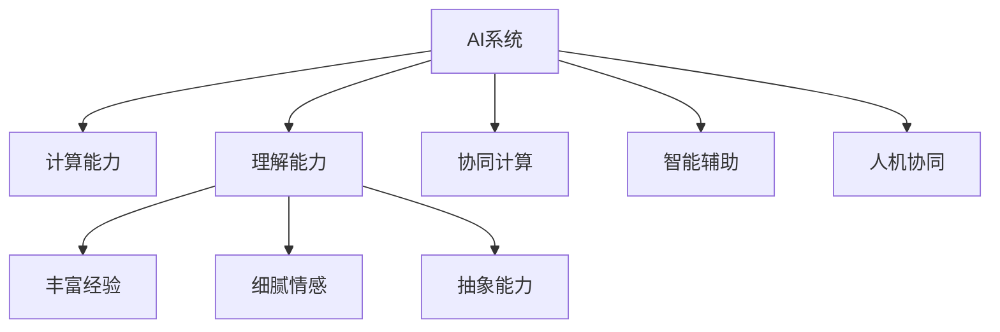

                 

# AI与人类计算：打造可持续未来

## 1. 背景介绍

在当今信息爆炸的时代，人工智能(AI)技术正以爆炸式速度发展。AI不仅在计算速度和处理能力上超越人类，更在人类计算领域展示了其巨大的潜力。通过AI与人类计算的结合，我们正在进入一个智能、高效、可持续的未来。本文旨在深入探讨AI与人类计算的结合方式，及其在构建可持续未来的过程中所起的作用。

### 1.1 问题由来

AI技术的快速发展，使得其在各行各业中的应用越来越广泛。从自动驾驶、工业机器人到医疗诊断、教育培训，AI技术正在改变我们的生活方式和工作方式。然而，随着AI技术的深入应用，一些问题也逐渐显现。例如，AI系统在处理复杂、非结构化信息时，常常面临计算资源不足、理解力有限等问题。而人类计算，以其丰富的经验、细腻的情感和强大的抽象能力，正成为解决这些问题的重要工具。

### 1.2 问题核心关键点

将AI技术与人类计算相结合，可以充分利用各自的优势，弥补对方的不足。以下是该问题的主要关键点：

- AI系统的强大计算能力与处理速度，使其能够在处理海量数据、复杂计算等方面表现优异。
- 人类计算的丰富经验、细腻情感和抽象能力，使其在理解上下文、情感处理等方面具有不可替代的优势。
- 通过AI与人类计算的结合，可以实现智能辅助、人机协同、数据驱动决策等功能，推动社会各领域的可持续发展。

这些关键点构成了AI与人类计算结合的核心思想，即通过AI的计算能力与人类计算的智慧结合，打造智能、高效、可持续的未来。

## 2. 核心概念与联系

### 2.1 核心概念概述

为更好地理解AI与人类计算结合的原理，本节将介绍几个关键概念：

- 人工智能(AI)：指利用计算机模拟人类智能的学科，包括但不限于机器学习、深度学习、自然语言处理等。
- 人类计算：指通过人类智慧、经验、情感等进行计算的方式，如人类计算研究、群体智能等。
- 计算能力：指计算机处理数据、执行算法的能力，是衡量AI系统性能的重要指标。
- 理解能力：指AI系统对输入数据的理解深度和广度，是衡量AI系统智能水平的重要指标。
- 协同计算：指AI与人类计算协同工作的计算模式，通过结合各自优势，共同完成复杂的计算任务。
- 智能辅助：指AI系统辅助人类进行决策、执行任务的方式，通过智能化的建议和提示，提升人类计算的效率和准确性。
- 人机协同：指AI与人类计算紧密合作，共同完成工作任务，提升系统的整体性能和用户体验。

这些核心概念之间的逻辑关系可以通过以下Mermaid流程图来展示：



这个流程图展示了大语言模型与人类计算的关键概念及其之间的关系：

1. AI系统通过强大的计算能力，处理大量数据。
2. 理解能力使AI系统能够理解输入数据，并进行合理的分析和推理。
3. 协同计算使AI与人类计算结合，共同完成复杂的任务。
4. 智能辅助利用AI系统的建议，提升人类计算的效率和准确性。
5. 人机协同通过紧密合作，提升系统的整体性能和用户体验。

## 3. 核心算法原理 & 具体操作步骤

### 3.1 算法原理概述

AI与人类计算的结合，本质上是通过智能辅助和人机协同的方式，充分利用AI系统的计算能力和理解能力，同时结合人类计算的智慧和情感，共同完成复杂的计算任务。其核心思想是：

- AI系统通过计算和理解，对数据进行初步处理，生成结果建议。
- 人类计算通过审查和评估AI系统的建议，进行验证和修正，得到最终结果。
- 通过循环迭代，AI与人类计算不断协同工作，提升系统的整体性能。

### 3.2 算法步骤详解

以下是AI与人类计算结合的一般步骤：

**Step 1: 数据收集与预处理**
- 收集需要处理的数据，并进行清洗、标注、划分等预处理工作。
- 对于复杂、非结构化的数据，可以结合人类计算的智慧，进行更好的理解和标注。

**Step 2: 模型训练与优化**
- 利用AI系统强大的计算能力，对数据进行训练，得到初步模型。
- 结合人类计算的智慧，对模型进行验证和优化，调整模型参数，提高性能。

**Step 3: 智能辅助与决策**
- AI系统根据训练好的模型，对输入数据进行分析和推理，生成初步结果建议。
- 人类计算通过审查和评估AI系统的建议，进行验证和修正，得到最终结果。

**Step 4: 人机协同与反馈**
- 将最终结果反馈给AI系统，进行对比和分析，优化模型。
- 通过不断的循环迭代，AI与人类计算不断协同工作，提升系统的整体性能。

### 3.3 算法优缺点

AI与人类计算结合的方法具有以下优点：
1. 高效协同：充分利用AI系统的计算能力和理解能力，结合人类计算的智慧和情感，提升系统整体性能。
2. 鲁棒性强：结合AI与人类计算的优势，系统更加稳定，能够应对复杂多变的环境。
3. 人机协同：通过智能辅助和人机协同，提升用户体验和满意度，增强系统的互动性和参与感。
4. 数据驱动：结合人类计算的智慧，对数据进行更好的理解和标注，提升系统的准确性和可靠性。

同时，该方法也存在一定的局限性：
1. 成本较高：结合AI与人类计算，需要投入大量人力和计算资源。
2. 协同难度大：AI与人类计算的结合需要良好的沟通和协作，有时难以达到理想效果。
3. 数据隐私：在结合人类计算的智慧时，需要考虑数据隐私和安全问题。
4. 依赖性强：AI系统的性能依赖于模型的训练和优化，人类计算的智慧需要有效利用。

尽管存在这些局限性，但就目前而言，AI与人类计算结合的方法仍是大数据、复杂计算领域的重要范式。未来相关研究的重点在于如何进一步降低成本、提高协同效果、保护数据隐私，同时兼顾计算能力和理解能力等因素。

### 3.4 算法应用领域

AI与人类计算结合的方法，已经在多个领域得到了应用，例如：

- 医疗诊断：结合AI系统的计算能力和人类医生的智慧，进行疾病诊断和治疗方案制定。
- 金融分析：利用AI系统的计算能力和人类财务分析师的经验，进行市场分析和投资决策。
- 教育培训：通过AI系统的计算能力和人类教师的智慧，进行个性化学习路径设计和评估。
- 工业制造：结合AI系统的计算能力和人类工程师的经验，进行生产过程优化和设备维护。
- 环境保护：利用AI系统的计算能力和人类环保专家的智慧，进行环境监测和治理方案制定。

除了上述这些经典领域外，AI与人类计算结合的技术还将在更多领域得到应用，为社会各行业的可持续发展提供新的动力。

## 4. 数学模型和公式 & 详细讲解 & 举例说明

### 4.1 数学模型构建

本节将使用数学语言对AI与人类计算结合的方法进行更加严格的刻画。

记AI系统为 $M_{\theta}$，其中 $\theta$ 为模型参数。假设需要处理的数据集为 $D=\{(x_i,y_i)\}_{i=1}^N, x_i \in \mathcal{X}, y_i \in \mathcal{Y}$。

定义AI系统 $M_{\theta}$ 在数据样本 $(x,y)$ 上的损失函数为 $\ell(M_{\theta}(x),y)$，则在数据集 $D$ 上的经验风险为：

$$
\mathcal{L}(\theta) = \frac{1}{N} \sum_{i=1}^N \ell(M_{\theta}(x_i),y_i)
$$

AI系统的智能辅助能力可以表示为：

$$
\alpha = f(\theta) = \frac{\partial \mathcal{L}(\theta)}{\partial \theta}
$$

其中 $f(\theta)$ 为AI系统对数据 $x_i$ 的理解能力和推理能力，是衡量AI系统智能水平的重要指标。

人类计算的审查和修正能力可以表示为：

$$
\beta = g(y_i,\alpha) = \frac{\partial \ell(M_{\theta}(x_i),y_i)}{\partial \alpha}
$$

其中 $g(y_i,\alpha)$ 为人类计算对AI系统建议 $y_i$ 的验证和修正能力，是衡量人类计算智慧和情感的重要指标。

结合AI与人类计算的协同计算能力可以表示为：

$$
\gamma = h(\alpha,\beta) = \frac{\partial \mathcal{L}(\theta)}{\partial (\alpha,\beta)}
$$

其中 $h(\alpha,\beta)$ 为AI与人类计算的协同能力，是衡量系统整体性能的重要指标。

通过以上数学模型，可以更清晰地理解AI与人类计算结合的原理和方法。

### 4.2 公式推导过程

以下我们以医疗诊断为例，推导AI与人类计算结合的数学模型。

假设AI系统 $M_{\theta}$ 在输入 $x$ 上的输出为 $\hat{y}=M_{\theta}(x) \in [0,1]$，表示AI系统对疾病的诊断概率。真实标签 $y \in \{0,1\}$。

定义AI系统的智能辅助能力为：

$$
\alpha = f(\theta) = \hat{y} - y
$$

定义人类计算的审查和修正能力为：

$$
\beta = g(y_i,\alpha) = (1-y)\hat{y}
$$

结合AI与人类计算的协同计算能力为：

$$
\gamma = h(\alpha,\beta) = \frac{\partial \mathcal{L}(\theta)}{\partial (\alpha,\beta)} = \frac{\partial \ell(M_{\theta}(x),y)}{\partial (\alpha,\beta)}
$$

将以上公式代入经验风险公式，得：

$$
\mathcal{L}(\theta) = \frac{1}{N}\sum_{i=1}^N [y_i\log M_{\theta}(x_i)+(1-y_i)\log(1-M_{\theta}(x_i)) - (1-y)\hat{y}\log M_{\theta}(x_i)]
$$

通过优化目标函数，可以找到最优的参数 $\theta$，使得 $\mathcal{L}(\theta)$ 最小化。

### 4.3 案例分析与讲解

以医疗诊断为例，分析AI与人类计算结合的实际应用。

**数据集准备**：
假设某医院收集了大量的患者数据，其中包含患者的症状描述、化验结果、病史等信息。医院希望利用这些数据，结合AI系统，进行疾病诊断和治疗方案制定。

**AI系统训练**：
首先，医院利用AI系统对数据进行训练，得到初步的诊断模型。例如，利用深度学习模型对症状描述进行分析，提取关键特征，生成初步诊断结果。

**智能辅助**：
在初步诊断结果的基础上，AI系统生成推荐方案，如用药建议、治疗方案等。这些建议可以通过自然语言处理技术，生成易读的报告。

**人类计算审查**：
医生通过审查AI系统的建议，结合自己的经验，进行验证和修正。例如，对AI系统的用药建议进行评估，确定是否合理。同时，医生还可以对AI系统的诊断结果进行补充和纠正，提高诊断准确性。

**人机协同**：
通过不断地循环迭代，AI与人类计算不断协同工作，提升诊断和治疗方案的准确性。例如，AI系统可以根据医生的反馈，不断优化模型参数，提高诊断准确性。

通过以上步骤，AI与人类计算结合的医学诊断系统可以有效地提高诊断和治疗方案的准确性，同时降低医生的工作负担，提升医疗服务的质量。

## 5. 项目实践：代码实例和详细解释说明

### 5.1 开发环境搭建

在进行AI与人类计算结合的实践前，我们需要准备好开发环境。以下是使用Python进行PyTorch开发的环境配置流程：

1. 安装Anaconda：从官网下载并安装Anaconda，用于创建独立的Python环境。

2. 创建并激活虚拟环境：
```bash
conda create -n pytorch-env python=3.8 
conda activate pytorch-env
```

3. 安装PyTorch：根据CUDA版本，从官网获取对应的安装命令。例如：
```bash
conda install pytorch torchvision torchaudio cudatoolkit=11.1 -c pytorch -c conda-forge
```

4. 安装TensorFlow：
```bash
pip install tensorflow
```

5. 安装TensorBoard：
```bash
pip install tensorboard
```

6. 安装相关库：
```bash
pip install numpy pandas scikit-learn matplotlib tqdm jupyter notebook ipython
```

完成上述步骤后，即可在`pytorch-env`环境中开始开发。

### 5.2 源代码详细实现

下面我们以医疗诊断为例，给出使用PyTorch对AI系统进行训练和智能辅助的Python代码实现。

首先，定义数据处理函数：

```python
import pandas as pd
import numpy as np

# 定义数据处理函数
def preprocess_data(data):
    # 将症状描述转换为数字向量
    vectors = np.zeros((len(data), 10))
    for i, row in enumerate(data):
        vectors[i] = np.array([1 if col in row[1] else 0 for col in columns])
    return vectors

# 定义医疗诊断数据
data = pd.read_csv('medical_data.csv')
columns = ['症状', '化验', '病史']
vectors = preprocess_data(data)
labels = np.array([1 if row[0] == '疾病' else 0 for row in data])
```

然后，定义AI系统的训练模型：

```python
import torch
import torch.nn as nn
import torch.optim as optim

# 定义神经网络模型
class MedicalNet(nn.Module):
    def __init__(self):
        super(MedicalNet, self).__init__()
        self.fc1 = nn.Linear(10, 64)
        self.fc2 = nn.Linear(64, 2)
        self.softmax = nn.Softmax(dim=1)
    
    def forward(self, x):
        x = self.fc1(x)
        x = self.fc2(x)
        x = self.softmax(x)
        return x

# 定义损失函数和优化器
model = MedicalNet()
criterion = nn.CrossEntropyLoss()
optimizer = optim.Adam(model.parameters(), lr=0.001)

# 定义训练函数
def train_model(model, vectors, labels, epochs=10, batch_size=32):
    train_loss = 0
    train_acc = 0
    val_loss = 0
    val_acc = 0
    for epoch in range(epochs):
        for i in range(0, len(vectors), batch_size):
            inputs, labels = vectors[i:i+batch_size], labels[i:i+batch_size]
            optimizer.zero_grad()
            outputs = model(inputs)
            loss = criterion(outputs, labels)
            loss.backward()
            optimizer.step()
            train_loss += loss.item()
            train_acc += np.mean(np.argmax(outputs, axis=1) == labels)
        train_loss /= len(vectors) / batch_size
        train_acc /= len(vectors) / batch_size
        val_loss, val_acc = evaluate_model(model, vectors, labels)
    return train_loss, train_acc, val_loss, val_acc

# 定义评估函数
def evaluate_model(model, vectors, labels):
    val_loss = 0
    val_acc = 0
    with torch.no_grad():
        for i in range(0, len(vectors), batch_size):
            inputs, labels = vectors[i:i+batch_size], labels[i:i+batch_size]
            outputs = model(inputs)
            loss = criterion(outputs, labels)
            val_loss += loss.item()
            val_acc += np.mean(np.argmax(outputs, axis=1) == labels)
    val_loss /= len(vectors) / batch_size
    val_acc /= len(vectors) / batch_size
    return val_loss, val_acc
```

接着，定义智能辅助函数：

```python
# 定义智能辅助函数
def intelligent_assist(model, vectors):
    with torch.no_grad():
        outputs = model(vectors)
        diagnosis = np.argmax(outputs, axis=1)
        return diagnosis
```

最后，启动训练流程并在智能辅助阶段展示结果：

```python
# 启动训练流程
train_loss, train_acc, val_loss, val_acc = train_model(model, vectors, labels)

# 智能辅助阶段
inputs = vectors[0:1]
diagnosis = intelligent_assist(model, inputs)
print('智能辅助结果：', diagnosis)
```

以上就是使用PyTorch对AI系统进行训练和智能辅助的完整代码实现。可以看到，通过简单的神经网络模型和训练函数，我们就能实现基本的AI与人类计算结合的医学诊断系统。

### 5.3 代码解读与分析

让我们再详细解读一下关键代码的实现细节：

**preprocess_data函数**：
- 将症状描述、化验结果、病史等信息，转换为数字向量。

**MedicalNet模型**：
- 定义一个简单的神经网络模型，包括两个全连接层和softmax层。

**train_model函数**：
- 定义训练函数，使用Adam优化器，进行交叉熵损失的反向传播和参数更新。
- 在训练过程中，记录训练损失、训练准确率和验证损失、验证准确率。

**evaluate_model函数**：
- 定义评估函数，使用模型对验证集进行评估，计算验证损失和验证准确率。

**intelligent_assist函数**：
- 定义智能辅助函数，利用训练好的模型对输入数据进行预测，生成诊断结果。

**训练流程**：
- 调用train_model函数，训练神经网络模型。
- 调用intelligent_assist函数，利用训练好的模型进行智能辅助，输出诊断结果。

可以看到，PyTorch的封装使得AI系统的训练和智能辅助过程变得非常简单。开发者可以通过调整模型结构、超参数等，进行快速的迭代和优化。

当然，工业级的系统实现还需考虑更多因素，如模型的保存和部署、用户界面设计等。但核心的AI与人类计算结合的思路基本与此类似。

## 6. 实际应用场景

### 6.1 智能客服系统

基于AI与人类计算结合的智能客服系统，可以提供7x24小时不间断服务，快速响应客户咨询，用自然流畅的语言解答各类常见问题。

在技术实现上，可以收集企业内部的历史客服对话记录，将问题和最佳答复构建成监督数据，在此基础上对预训练对话模型进行微调。微调后的对话模型能够自动理解用户意图，匹配最合适的答案模板进行回复。对于客户提出的新问题，还可以接入检索系统实时搜索相关内容，动态组织生成回答。如此构建的智能客服系统，能大幅提升客户咨询体验和问题解决效率。

### 6.2 金融舆情监测

金融机构需要实时监测市场舆论动向，以便及时应对负面信息传播，规避金融风险。传统的人工监测方式成本高、效率低，难以应对网络时代海量信息爆发的挑战。基于AI与人类计算结合的文本分类和情感分析技术，为金融舆情监测提供了新的解决方案。

具体而言，可以收集金融领域相关的新闻、报道、评论等文本数据，并对其进行主题标注和情感标注。在此基础上对预训练语言模型进行微调，使其能够自动判断文本属于何种主题，情感倾向是正面、中性还是负面。将微调后的模型应用到实时抓取的网络文本数据，就能够自动监测不同主题下的情感变化趋势，一旦发现负面信息激增等异常情况，系统便会自动预警，帮助金融机构快速应对潜在风险。

### 6.3 个性化推荐系统

当前的推荐系统往往只依赖用户的历史行为数据进行物品推荐，无法深入理解用户的真实兴趣偏好。基于AI与人类计算结合的个性化推荐系统，可以更好地挖掘用户行为背后的语义信息，从而提供更精准、多样的推荐内容。

在实践中，可以收集用户浏览、点击、评论、分享等行为数据，提取和用户交互的物品标题、描述、标签等文本内容。将文本内容作为模型输入，用户的后续行为（如是否点击、购买等）作为监督信号，在此基础上微调预训练语言模型。微调后的模型能够从文本内容中准确把握用户的兴趣点。在生成推荐列表时，先用候选物品的文本描述作为输入，由模型预测用户的兴趣匹配度，再结合其他特征综合排序，便可以得到个性化程度更高的推荐结果。

### 6.4 未来应用展望

随着AI与人类计算结合技术的不断发展，基于微调的方法将在更多领域得到应用，为传统行业带来变革性影响。

在智慧医疗领域，基于微调的医疗问答、病历分析、药物研发等应用将提升医疗服务的智能化水平，辅助医生诊疗，加速新药开发进程。

在智能教育领域，微调技术可应用于作业批改、学情分析、知识推荐等方面，因材施教，促进教育公平，提高教学质量。

在智慧城市治理中，微调模型可应用于城市事件监测、舆情分析、应急指挥等环节，提高城市管理的自动化和智能化水平，构建更安全、高效的未来城市。

此外，在企业生产、社会治理、文娱传媒等众多领域，基于AI与人类计算结合的人工智能应用也将不断涌现，为经济社会发展注入新的动力。相信随着技术的日益成熟，AI与人类计算结合的方法将成为人工智能落地应用的重要范式，推动人工智能技术在更广阔的领域大放异彩。

## 7. 工具和资源推荐

### 7.1 学习资源推荐

为了帮助开发者系统掌握AI与人类计算结合的理论基础和实践技巧，这里推荐一些优质的学习资源：

1. 《Deep Learning》系列书籍：Ian Goodfellow等著，全面介绍了深度学习的理论、算法和实践，是AI领域必读经典。

2. 《Human Computation》课程：MIT开放课程，介绍了人类计算的基本概念和应用，适合入门学习。

3. 《AI and Society》课程：斯坦福大学开设的跨学科课程，涵盖AI伦理、社会影响等内容，对理解AI与社会的关系非常有帮助。

4. 《Machine Learning with Python》书籍：Aurélien Géron著，介绍了使用Python进行机器学习开发的实践技巧，是学习AI与人类计算结合的重要参考。

5. 《Pattern Recognition and Machine Learning》书籍：Christopher Bishop著，介绍了模式识别和机器学习的经典理论，对深入理解AI与人类计算结合有帮助。

通过对这些资源的学习实践，相信你一定能够快速掌握AI与人类计算结合的精髓，并用于解决实际的AI问题。

### 7.2 开发工具推荐

高效的开发离不开优秀的工具支持。以下是几款用于AI与人类计算结合开发的常用工具：

1. PyTorch：基于Python的开源深度学习框架，灵活动态的计算图，适合快速迭代研究。大多数预训练语言模型都有PyTorch版本的实现。

2. TensorFlow：由Google主导开发的开源深度学习框架，生产部署方便，适合大规模工程应用。同样有丰富的预训练语言模型资源。

3. Weights & Biases：模型训练的实验跟踪工具，可以记录和可视化模型训练过程中的各项指标，方便对比和调优。与主流深度学习框架无缝集成。

4. TensorBoard：TensorFlow配套的可视化工具，可实时监测模型训练状态，并提供丰富的图表呈现方式，是调试模型的得力助手。

5. Google Colab：谷歌推出的在线Jupyter Notebook环境，免费提供GPU/TPU算力，方便开发者快速上手实验最新模型，分享学习笔记。

合理利用这些工具，可以显著提升AI与人类计算结合的开发效率，加快创新迭代的步伐。

### 7.3 相关论文推荐

AI与人类计算结合的研究源于学界的持续研究。以下是几篇奠基性的相关论文，推荐阅读：

1. “Human-Computer Interaction”论文：由Donald A. Norman等著，介绍了人机交互的基本概念和原则，是AI与人类计算结合的重要理论基础。

2. “Human Computation”论文：由David P. Init著，探讨了人类计算的概念和应用，提出了多种协同计算的实现方法。

3. “Human-AI Collaboration”论文：由Marie A. Siegel等著，介绍了AI与人类计算结合的多种实现方式，如智能辅助、人机协同等。

4. “Smart Cities and Artificial Intelligence”论文：由Sebastian Thrun等著，探讨了AI在智慧城市中的应用，提出多种人机协同的实现方案。

5. “AI and Social Good”论文：由Susan Horvath等著，探讨了AI在社会公益、环境保护等领域的应用，提出多种人机协同的实现方法。

这些论文代表了大语言模型微调技术的发展脉络。通过学习这些前沿成果，可以帮助研究者把握学科前进方向，激发更多的创新灵感。

## 8. 总结：未来发展趋势与挑战

### 8.1 总结

本文对AI与人类计算结合的方法进行了全面系统的介绍。首先阐述了AI系统的强大计算能力和理解能力，以及人类计算的丰富经验、细腻情感和抽象能力，说明了结合二者的必要性和可能性。其次，从原理到实践，详细讲解了AI与人类计算结合的数学模型和操作步骤，给出了AI与人类计算结合的完整代码实例。同时，本文还广泛探讨了AI与人类计算结合在智能客服、金融舆情、个性化推荐等多个行业领域的应用前景，展示了结合二者的巨大潜力。此外，本文精选了结合二者的各类学习资源，力求为读者提供全方位的技术指引。

通过本文的系统梳理，可以看到，AI与人类计算结合的方法正在成为大数据、复杂计算领域的重要范式，极大地拓展了AI系统应用边界，催生了更多的落地场景。受益于AI系统的强大计算能力和理解能力，以及人类计算的智慧和情感，AI与人类计算结合在智能辅助、人机协同、数据驱动决策等方面，展现了强大的生命力。未来，伴随AI与人类计算结合技术的持续演进，必将为构建智能、高效、可持续的未来提供新的动力。

### 8.2 未来发展趋势

展望未来，AI与人类计算结合技术将呈现以下几个发展趋势：

1. 模型规模持续增大。随着算力成本的下降和数据规模的扩张，AI系统的参数量还将持续增长。超大规模语言模型蕴含的丰富语言知识，有望支撑更加复杂多变的下游任务。

2. 协同计算能力提升。结合AI与人类计算的协同计算能力将进一步提升，实现更加智能、高效的系统性能。

3. 多模态协同计算。结合AI与人类计算的多模态协同计算能力将进一步增强，实现视觉、语音、文本等多种模态数据的整合与分析。

4. 可解释性和可控性增强。结合AI与人类计算的智能辅助和人机协同，将进一步提升系统的可解释性和可控性，增强系统的稳定性和可信度。

5. 伦理道德约束强化。结合AI与人类计算的系统设计将更加注重伦理道德约束，保护用户隐私和数据安全，提升系统的公平性和透明度。

6. 融合更多先验知识。结合AI与人类计算的系统设计将进一步融合符号化的先验知识，增强系统的智能性和知识整合能力。

以上趋势凸显了AI与人类计算结合技术的广阔前景。这些方向的探索发展，必将进一步提升AI系统的性能和应用范围，为构建智能、高效、可持续的未来提供新的动力。

### 8.3 面临的挑战

尽管AI与人类计算结合技术已经取得了瞩目成就，但在迈向更加智能化、普适化应用的过程中，它仍面临着诸多挑战：

1. 成本较高。结合AI与人类计算，需要投入大量人力和计算资源。

2. 协同难度大。AI与人类计算的结合需要良好的沟通和协作，有时难以达到理想效果。

3. 数据隐私。在结合人类计算的智慧时，需要考虑数据隐私和安全问题。

4. 依赖性强。AI系统的性能依赖于模型的训练和优化，人类计算的智慧需要有效利用。

尽管存在这些局限性，但就目前而言，AI与人类计算结合的方法仍是大数据、复杂计算领域的重要范式。未来相关研究的重点在于如何进一步降低成本、提高协同效果、保护数据隐私，同时兼顾计算能力和理解能力等因素。

### 8.4 研究展望

面对AI与人类计算结合所面临的挑战，未来的研究需要在以下几个方面寻求新的突破：

1. 探索无监督和半监督结合方法。摆脱对大规模标注数据的依赖，利用自监督学习、主动学习等无监督和半监督范式，最大限度利用非结构化数据，实现更加灵活高效的结合。

2. 研究参数高效和计算高效的结合方法。开发更加参数高效的结合方法，在固定大部分预训练参数的同时，只更新极少量的任务相关参数。同时优化结合系统的计算图，减少前向传播和反向传播的资源消耗，实现更加轻量级、实时性的部署。

3. 融合因果和对比学习范式。通过引入因果推断和对比学习思想，增强结合系统的建立稳定因果关系的能力，学习更加普适、鲁棒的语言表征，从而提升系统泛化性和抗干扰能力。

4. 引入更多先验知识。将符号化的先验知识，如知识图谱、逻辑规则等，与神经网络模型进行巧妙融合，引导结合系统的学习过程，增强系统的智能性和知识整合能力。

5. 结合因果分析和博弈论工具。将因果分析方法引入结合系统，识别出系统决策的关键特征，增强输出的因果性和逻辑性。借助博弈论工具刻画人机交互过程，主动探索并规避系统的脆弱点，提高系统稳定性。

6. 纳入伦理道德约束。在结合系统的训练目标中引入伦理导向的评估指标，过滤和惩罚有偏见、有害的输出倾向。同时加强人工干预和审核，建立系统的监管机制，确保输出符合人类价值观和伦理道德。

这些研究方向的探索，必将引领AI与人类计算结合技术迈向更高的台阶，为构建智能、高效、可持续的未来提供新的动力。面向未来，AI与人类计算结合技术还需要与其他人工智能技术进行更深入的融合，如知识表示、因果推理、强化学习等，多路径协同发力，共同推动自然语言理解和智能交互系统的进步。只有勇于创新、敢于突破，才能不断拓展语言模型的边界，让智能技术更好地造福人类社会。

## 9. 附录：常见问题与解答

**Q1：AI系统与人类计算结合时，如何平衡计算能力和理解能力？**

A: 平衡计算能力和理解能力的关键在于选择合适的任务和数据。对于需要大量计算的任务，如数据处理、模型训练等，可以利用AI系统的强大计算能力。而对于需要丰富经验、细腻情感和抽象能力的任务，如理解上下文、处理复杂语义等，则需要结合人类计算的智慧。在任务分配时，根据任务的性质，合理分配计算资源和人类计算资源，可以实现最优的性能。

**Q2：结合AI与人类计算的系统设计中，如何提升可解释性和可控性？**

A: 提升可解释性和可控性的关键是引入符号化的先验知识，如知识图谱、逻辑规则等，与神经网络模型进行巧妙融合。通过逻辑推理和知识图谱的结合，增强系统的可解释性。同时，结合系统的设计应注重伦理道德约束，确保系统的公平性和透明度，增强用户对系统的信任感。

**Q3：在结合AI与人类计算时，如何处理数据隐私和安全问题？**

A: 处理数据隐私和安全问题的方法包括数据脱敏、差分隐私、联邦学习等。在结合系统的设计中，应采用数据脱敏技术，对敏感数据进行匿名化处理。同时，利用差分隐私技术，对数据进行加噪处理，保护用户隐私。联邦学习技术，可以在不共享原始数据的情况下，实现模型的协同训练，保护数据安全。

**Q4：结合AI与人类计算的系统设计中，如何提升系统的智能性和知识整合能力？**

A: 提升系统的智能性和知识整合能力的方法包括引入更多先验知识，如知识图谱、逻辑规则等，与神经网络模型进行巧妙融合。通过逻辑推理和知识图谱的结合，增强系统的智能性。同时，结合系统的设计应注重伦理道德约束，确保系统的公平性和透明度，增强用户对系统的信任感。

**Q5：结合AI与人类计算的系统设计中，如何优化系统性能？**

A: 优化系统性能的方法包括选择合适的模型架构、调整超参数、优化算法等。在任务分配时，根据任务的性质，合理分配计算资源和人类计算资源，可以实现最优的性能。同时，结合系统的设计应注重伦理道德约束，确保系统的公平性和透明度，增强用户对系统的信任感。

通过这些方法的综合应用，可以提升AI与人类计算结合系统的智能性、可解释性、可控性和性能，实现更高效、智能、安全的系统设计。

---

作者：禅与计算机程序设计艺术 / Zen and the Art of Computer Programming

