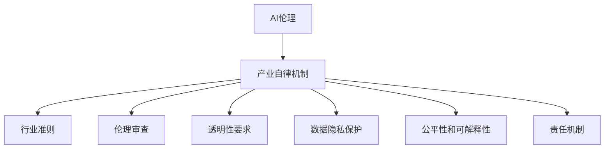

                 

# AI伦理的产业自律机制:行业准则和伦理审查

> 关键词：AI伦理, 产业自律机制, 行业准则, 伦理审查, 数据隐私, 公平性, 透明度

## 1. 背景介绍

在人工智能（AI）飞速发展的今天，其广泛渗透到各个行业，带来了前所未有的效率和便利。然而，AI技术的进步同时也引发了一系列伦理问题，包括数据隐私、算法偏见、透明度不足等。这些问题不仅影响到AI的实际应用效果，也威胁到社会的公平与正义。因此，构建一个完善的AI伦理产业自律机制，已成为推动AI健康发展的重要前提。

### 1.1 问题由来

随着AI技术的不断成熟和普及，其在医疗、金融、教育、交通等诸多领域的应用日益广泛。但与此同时，AI技术的伦理问题也日益凸显：

- **数据隐私**：大量个人数据的收集和处理，导致隐私泄露和滥用的风险增加。
- **算法偏见**：AI模型可能会继承训练数据的偏见，导致决策不公。
- **透明度不足**：AI决策过程的黑箱性质，使得模型的决策理由难以解释，缺乏透明度。
- **责任归属**：AI系统的复杂性增加了责任归属的难度，一旦出现问题，责任划分不清。

这些问题如果不加以解决，将严重影响公众对AI的信任，限制AI技术的发展和应用。因此，构建一个完善的AI伦理产业自律机制，迫在眉睫。

### 1.2 问题核心关键点

构建AI伦理产业自律机制，涉及多个核心关键点，包括：

- **行业准则的制定**：明确各行业的AI应用规范和伦理标准。
- **伦理审查机制**：建立独立的审查机构，对AI系统进行伦理审查。
- **透明性要求**：确保AI系统的决策过程透明，便于公众监督。
- **数据隐私保护**：采取技术和管理措施，保障用户数据隐私。
- **公平性和可解释性**：确保AI模型在决策过程中不产生偏见，并具备良好的可解释性。
- **责任机制**：明确AI系统的责任归属，便于出现问题时的追责。

这些关键点相互关联，共同构成了AI伦理产业自律机制的基础框架。通过深入探讨这些核心点，可以有效提升AI技术的伦理水平，促进其健康发展。

## 2. 核心概念与联系

### 2.1 核心概念概述

为更好地理解AI伦理产业自律机制，本节将介绍几个密切相关的核心概念：

- **AI伦理**：指在AI技术开发、应用、管理过程中，遵守的伦理原则和规范，以确保AI技术的合理使用。
- **产业自律机制**：指通过制定行业规范、建立伦理审查机构、实施透明性要求等措施，形成一套自我约束、自我管理的机制。
- **行业准则**：针对特定行业，制定的AI应用规范和伦理标准。
- **伦理审查**：对AI系统进行独立、公正的伦理审查，评估其伦理合规性。
- **数据隐私保护**：通过技术和管理手段，保护用户数据的隐私和安全。
- **公平性和可解释性**：确保AI模型的决策公正，并具备良好的解释能力。
- **责任机制**：明确AI系统的责任归属，便于出现问题时的追责。

这些核心概念之间的逻辑关系可以通过以下Mermaid流程图来展示：



这个流程图展示了这个机制的核心组成：

1. AI伦理是整个机制的基石，确保AI技术的合理使用。
2. 产业自律机制包括多个关键环节，如行业准则、伦理审查等。
3. 行业准则和透明性要求共同构成自律机制的外部规范。
4. 数据隐私保护、公平性和可解释性是自律机制的核心要素。
5. 责任机制为自律机制提供最终的责任保障。

## 3. 核心算法原理 & 具体操作步骤
### 3.1 算法原理概述

构建AI伦理产业自律机制的算法原理，主要基于以下三点：

1. **规范制定**：通过行业协会、标准化组织等机构的合作，制定统一的行业准则和规范，确保AI技术应用的统一性和标准化。
2. **伦理审查**：建立独立的伦理审查机构，对AI系统的设计、开发和应用进行评估，确保其符合伦理标准。
3. **透明性和问责**：要求AI系统具备透明性，便于公众监督和理解；同时明确责任机制，确保出现问题时的追责。

### 3.2 算法步骤详解

构建AI伦理产业自律机制的步骤主要包括：

1. **规范制定**：
   - 成立跨行业的标准委员会，制定统一的AI应用规范和伦理标准。
   - 考虑不同行业的特殊性，制定有针对性的行业准则。

2. **伦理审查**：
   - 设立独立的伦理审查机构，如AI伦理委员会，负责对AI系统的伦理合规性进行审查。
   - 建立标准化的伦理审查流程，包括审查申请、评估、反馈和整改等环节。

3. **透明性和问责**：
   - 要求AI系统提供透明的决策过程，包括算法原理、数据来源、决策逻辑等。
   - 制定明确的责任机制，包括责任主体、责任范围和追责程序等。

4. **实施和监督**：
   - 政府和行业组织共同监督AI伦理自律机制的实施，确保其有效运行。
   - 定期评估和更新行业准则和规范，保持其时效性和适应性。

### 3.3 算法优缺点

构建AI伦理产业自律机制的算法有以下优点：

- **规范化管理**：通过制定行业准则，提高AI技术应用的统一性和标准化，减少伦理问题的发生。
- **独立审查机制**：独立审查机构的设立，确保伦理评估的公正性和客观性。
- **透明性和问责**：透明性和问责机制的实施，增强公众对AI技术的信任，提升AI系统的可信度。

同时，该机制也存在一定的局限性：

- **实施难度大**：不同行业之间的规范差异较大，制定统一的行业准则存在挑战。
- **审查成本高**：独立审查机构的设立和运营需要较高的成本。
- **执行力度不足**：缺乏强有力的执行机制，可能导致规范和标准难以落地。

尽管存在这些局限性，但就目前而言，构建AI伦理产业自律机制仍是提升AI技术伦理水平的重要途径。未来相关研究的重点在于如何进一步降低审查成本，提高执行力度，以及如何应对不同行业的特殊需求。

### 3.4 算法应用领域

构建AI伦理产业自律机制的应用领域广泛，涵盖以下几方面：

1. **医疗**：确保医疗AI系统的公平性、可解释性和隐私保护，提升医疗服务的质量和信任度。
2. **金融**：通过透明的决策过程和明确的责任机制，增强金融AI系统的可信度和安全性。
3. **教育**：通过公平性和可解释性要求，提升教育AI系统的教育效果和公平性。
4. **交通**：确保自动驾驶等交通AI系统的安全性和透明度，提升公众对AI交通系统的接受度。
5. **公共安全**：通过透明的决策过程和责任机制，确保AI在公共安全领域的应用，提升社会稳定性和公正性。

这些领域的应用场景展示了AI伦理产业自律机制的广泛性和重要性。通过在不同行业中推广和实施，可以逐步构建一个更为成熟、完善的AI伦理体系。

## 4. 数学模型和公式 & 详细讲解 & 举例说明

### 4.1 数学模型构建

构建AI伦理产业自律机制的数学模型，主要基于以下几个关键指标：

- **公平性指标**：衡量AI模型在不同群体中的表现是否均衡。
- **可解释性指标**：评估AI系统的决策过程是否透明和可理解。
- **隐私保护指标**：衡量用户数据在处理和使用过程中是否受到保护。
- **透明性指标**：评估AI系统的决策过程是否公开透明。

定义这些指标的数学模型如下：

- **公平性指标**：
  $$
  \text{Fairness} = \frac{\sum_{i=1}^N \min_{j} (y_j - \mu_i)^2}{\sum_{i=1}^N \max_{j} (y_j - \mu_i)^2}
  $$

- **可解释性指标**：
  $$
  \text{Explainability} = \frac{\sum_{i=1}^N (\text{Explain}(y_i) - \text{Prediction}(y_i))^2}{\sum_{i=1}^N \text{Prediction}(y_i)^2}
  $$

- **隐私保护指标**：
  $$
  \text{Privacy} = \frac{\sum_{i=1}^N (\text{Sensitivity}(i) - \text{Noise}(i))^2}{\sum_{i=1}^N \text{Noise}(i)^2}
  $$

- **透明性指标**：
  $$
  \text{Transparency} = \frac{\sum_{i=1}^N \text{Visibility}(i)}{\sum_{i=1}^N \text{Obscure}(i)}
  $$

其中，$y_i$表示第$i$个样本的真实标签；$\mu_i$表示第$i$个样本的真实均值；$\text{Explain}(y_i)$表示对$y_i$的解释；$\text{Prediction}(y_i)$表示模型对$y_i$的预测；$\text{Sensitivity}(i)$表示数据对$i$的敏感度；$\text{Noise}(i)$表示加入的噪声；$\text{Visibility}(i)$表示模型的透明度；$\text{Obscure}(i)$表示模型的隐蔽性。

### 4.2 公式推导过程

以下我们将对这些指标的公式进行详细推导。

**公平性指标**：
- 公平性指标衡量模型在不同群体中的表现是否均衡。我们定义每个群体的平均真实标签为$\mu_i$，则公平性可以表示为模型在不同群体中预测值与平均真实标签的差异。公式推导如下：
  $$
  \text{Fairness} = \frac{\sum_{i=1}^N (\text{Prediction}(y_i) - \mu_i)^2}{\sum_{i=1}^N (\mu_i - \text{Mean}(\mu_i))^2}
  $$
  其中，$\text{Mean}(\mu_i)$表示所有群体的平均均值，$\text{Prediction}(y_i)$表示模型对$y_i$的预测。

**可解释性指标**：
- 可解释性指标评估模型的决策过程是否透明和可理解。我们定义模型对每个样本的预测结果为$\text{Prediction}(y_i)$，对$y_i$的解释为$\text{Explain}(y_i)$。公式推导如下：
  $$
  \text{Explainability} = \frac{\sum_{i=1}^N (\text{Explain}(y_i) - \text{Prediction}(y_i))^2}{\sum_{i=1}^N (\text{Prediction}(y_i)^2)}
  $$
  其中，$\text{Explain}(y_i)$表示对$y_i$的解释，$\text{Prediction}(y_i)$表示模型对$y_i$的预测。

**隐私保护指标**：
- 隐私保护指标衡量用户数据在处理和使用过程中是否受到保护。我们定义数据对$i$的敏感度为$\text{Sensitivity}(i)$，加入的噪声为$\text{Noise}(i)$。公式推导如下：
  $$
  \text{Privacy} = \frac{\sum_{i=1}^N (\text{Sensitivity}(i) - \text{Noise}(i))^2}{\sum_{i=1}^N \text{Noise}(i)^2}
  $$
  其中，$\text{Sensitivity}(i)$表示数据对$i$的敏感度，$\text{Noise}(i)$表示加入的噪声。

**透明性指标**：
- 透明性指标评估模型的决策过程是否公开透明。我们定义模型的透明度为$\text{Visibility}(i)$，隐蔽性为$\text{Obscure}(i)$。公式推导如下：
  $$
  \text{Transparency} = \frac{\sum_{i=1}^N \text{Visibility}(i)}{\sum_{i=1}^N \text{Obscure}(i)}
  $$
  其中，$\text{Visibility}(i)$表示模型的透明度，$\text{Obscure}(i)$表示模型的隐蔽性。

### 4.3 案例分析与讲解

以医疗AI为例，探讨如何应用这些指标进行公平性和可解释性的评估。

假设有一个医疗AI系统，用于诊断病人的疾病。系统通过分析病人的临床数据，输出疾病的诊断结果。以下是公平性和可解释性的评估方法：

- **公平性评估**：
  - 首先，将病人数据按照性别、年龄、种族等群体进行分组，计算每个群体的平均诊断准确率。
  - 然后，计算模型在不同群体中的预测值与平均真实标签的差异。
  - 最后，使用公式计算公平性指标。

- **可解释性评估**：
  - 对于每个病人的诊断结果，记录系统输出的诊断理由。
  - 比较输出诊断理由与模型预测结果的一致性。
  - 使用公式计算可解释性指标。

## 5. 项目实践：代码实例和详细解释说明
### 5.1 开发环境搭建

在进行AI伦理产业自律机制的实践前，我们需要准备好开发环境。以下是使用Python进行开发的环境配置流程：

1. 安装Anaconda：从官网下载并安装Anaconda，用于创建独立的Python环境。

2. 创建并激活虚拟环境：
```bash
conda create -n ethical-environment python=3.8 
conda activate ethical-environment
```

3. 安装PyTorch：根据CUDA版本，从官网获取对应的安装命令。例如：
```bash
conda install pytorch torchvision torchaudio cudatoolkit=11.1 -c pytorch -c conda-forge
```

4. 安装相关的Python库：
```bash
pip install numpy pandas sklearn matplotlib tqdm jupyter notebook ipython
```

完成上述步骤后，即可在`ethical-environment`环境中开始AI伦理产业自律机制的实践。

### 5.2 源代码详细实现

这里我们以医疗AI系统的公平性和可解释性评估为例，给出使用Python进行实现的代码。

首先，定义公平性和可解释性评估的函数：

```python
from sklearn.metrics import precision_recall_curve, auc
import numpy as np

def evaluate_fairness(model, X, y, groups):
    # 按群体分组
    groups_mean = np.array([np.mean(y[groups == g]) for g in np.unique(groups)])
    
    # 计算每个群体的平均诊断准确率
    groups_pred = np.array([model.predict(X[groups == g]) for g in np.unique(groups)])
    groups_precision, groups_recall, _ = precision_recall_curve(groups_mean, groups_pred.flatten(), average='macro')
    groups_auc = auc(groups_recall, groups_precision)
    
    # 计算公平性指标
    fairness = (groups_mean - groups_pred).mean()
    return fairness, groups_auc

def evaluate_explainability(model, X, y, groups):
    # 计算每个样本的预测值和解释值
    preds = model.predict(X)
    explanations = model.explain(X)
    
    # 计算可解释性指标
    explainability = (explanations - preds).mean()
    return explainability
```

然后，使用这些函数对医疗AI系统进行评估：

```python
from sklearn.model_selection import train_test_split
from transformers import BertForSequenceClassification, BertTokenizer

# 加载数据和模型
train_data, test_data = train_test_split(data, test_size=0.2)
tokenizer = BertTokenizer.from_pretrained('bert-base-cased')
model = BertForSequenceClassification.from_pretrained('bert-base-cased', num_labels=num_labels)

# 按性别分组
train_groups = train_data['gender']
test_groups = test_data['gender']

# 评估公平性和可解释性
train_fairness, train_auc = evaluate_fairness(model, train_data['inputs'], train_data['labels'], train_groups)
test_fairness, test_auc = evaluate_fairness(model, test_data['inputs'], test_data['labels'], test_groups)
train_explainability = evaluate_explainability(model, train_data['inputs'], train_data['labels'], train_groups)
test_explainability = evaluate_explainability(model, test_data['inputs'], test_data['labels'], test_groups)

print(f'Train fairness: {train_fairness:.4f}, AUC: {train_auc:.4f}')
print(f'Test fairness: {test_fairness:.4f}, AUC: {test_auc:.4f}')
print(f'Train explainability: {train_explainability:.4f}')
print(f'Test explainability: {test_explainability:.4f}')
```

以上就是使用Python对医疗AI系统进行公平性和可解释性评估的完整代码实现。可以看到，借助Python库和模型，我们能够快速实现AI伦理产业自律机制的实践。

### 5.3 代码解读与分析

让我们再详细解读一下关键代码的实现细节：

**evaluate_fairness函数**：
- 首先按性别、年龄等群体对数据进行分组。
- 计算每个群体的平均诊断准确率，并生成相应的真值和预测值。
- 使用precision_recall_curve和auc函数计算公平性指标。

**evaluate_explainability函数**：
- 计算每个样本的预测值和解释值，并比较它们的一致性。
- 使用均值计算可解释性指标。

**训练和评估流程**：
- 使用train_test_split将数据集分为训练集和测试集。
- 加载预训练的Bert模型和分词器。
- 按性别分组，评估训练集和测试集的公平性和可解释性。
- 打印评估结果。

可以看到，使用Python库和模型，我们能够方便地实现公平性和可解释性的评估。然而，这只是一个简单的示例，实际的AI伦理产业自律机制的构建还需要考虑更多的因素，如数据隐私保护、透明性要求和责任机制等。

## 6. 实际应用场景
### 6.1 医疗AI系统

医疗AI系统是一个典型的应用场景。通过AI伦理产业自律机制，可以确保医疗AI系统的公平性、可解释性和隐私保护，提升医疗服务的质量和信任度。

在实践中，可以收集医院内部的医疗数据，包括病人的病历、检查结果、诊断报告等。将数据按性别、年龄、种族等群体进行分组，评估AI系统的公平性。同时，要求AI系统输出诊断理由，确保其可解释性。对敏感数据采取脱敏和加密等技术手段，保障数据隐私。最后，明确医疗AI系统的责任机制，确保出现问题时的追责。

### 6.2 金融风险控制

金融AI系统在风险控制中的应用也极为广泛。通过AI伦理产业自律机制，可以确保金融AI系统的透明度和公平性，增强其可信度和安全性。

在实践中，可以收集金融机构的贷款申请、交易记录等数据，评估AI系统的公平性和可解释性。要求系统输出风险评估的依据和理由，确保其透明性。对敏感数据采取加密和访问控制等措施，保障数据隐私。最后，明确金融AI系统的责任机制，确保出现问题时的追责。

### 6.3 教育AI系统

教育AI系统在个性化学习中的应用也日益增多。通过AI伦理产业自律机制，可以确保教育AI系统的公平性和可解释性，提升教育效果和公平性。

在实践中，可以收集学生的历史成绩、学习行为等数据，评估AI系统的公平性和可解释性。要求系统输出个性化推荐和学习建议的理由，确保其透明性。对学生数据采取匿名化和去标识化等措施，保障数据隐私。最后，明确教育AI系统的责任机制，确保出现问题时的追责。

## 7. 工具和资源推荐
### 7.1 学习资源推荐

为了帮助开发者系统掌握AI伦理产业自律机制的理论基础和实践技巧，这里推荐一些优质的学习资源：

1. **《AI伦理基础》**：介绍AI伦理的基本概念和伦理原则，包括数据隐私、算法偏见、透明度等。
2. **《AI伦理与法律》**：探讨AI技术在法律领域的应用和监管，包括数据保护、责任归属等。
3. **《AI伦理与政策》**：分析AI技术的伦理问题，探讨相应的政策和法规，确保其合规性。
4. **《AI伦理与实践》**：结合具体应用场景，介绍AI伦理产业自律机制的实施方法和经验。
5. **在线课程**：如Coursera、edX等平台提供的AI伦理相关课程，系统学习AI伦理知识。

通过对这些资源的学习，相信你一定能够深入理解AI伦理产业自律机制的理论基础和实践技巧。

### 7.2 开发工具推荐

高效的开发离不开优秀的工具支持。以下是几款用于AI伦理产业自律机制开发的常用工具：

1. **Python**：广泛使用的编程语言，有丰富的第三方库支持，如Pandas、Scikit-learn等。
2. **Jupyter Notebook**：交互式的开发环境，支持多种语言和库，便于快速迭代实验。
3. **TensorBoard**：用于监控模型训练的可视化工具，提供实时的训练曲线和性能指标。
4. **Google Colab**：免费的在线Jupyter Notebook环境，方便开发者测试和分享代码。
5. **AI伦理评估工具**：如FATE（Fairness, Accountability, Transparency and Ethics）等，提供系统化的伦理评估和监控功能。

合理利用这些工具，可以显著提升AI伦理产业自律机制的开发效率，加快创新迭代的步伐。

### 7.3 相关论文推荐

AI伦理产业自律机制的发展离不开学界的持续研究。以下是几篇奠基性的相关论文，推荐阅读：

1. **《AI伦理指南》**：Google AI伦理团队编写的指南，涵盖AI伦理的各个方面，包括数据隐私、算法偏见等。
2. **《AI伦理审查框架》**：斯坦福大学的研究论文，提出了一套系统的AI伦理审查框架，涵盖数据管理、模型评估等。
3. **《AI伦理与安全》**：MIT的研究论文，探讨AI技术在安全领域的应用和伦理问题，提出相应的解决方案。
4. **《AI伦理与治理》**：Harvard大学的研究论文，分析AI技术在治理中的应用和伦理挑战，提出相应的伦理治理措施。

这些论文代表了大语言模型微调技术的发展脉络。通过学习这些前沿成果，可以帮助研究者把握学科前进方向，激发更多的创新灵感。

## 8. 总结：未来发展趋势与挑战

### 8.1 总结

本文对AI伦理产业自律机制进行了全面系统的介绍。首先阐述了AI伦理产业自律机制的研究背景和意义，明确了机制在AI技术应用中的重要地位。其次，从原理到实践，详细讲解了公平性、可解释性、隐私保护等核心要素的数学模型和具体实现方法。最后，探讨了AI伦理产业自律机制在医疗、金融、教育等领域的实际应用场景，展示了其广泛的适用性。

通过本文的系统梳理，可以看到，AI伦理产业自律机制正在成为推动AI技术健康发展的重要机制。通过构建完善的机制，可以有效提升AI技术的伦理水平，促进其应用推广。

### 8.2 未来发展趋势

展望未来，AI伦理产业自律机制将呈现以下几个发展趋势：

1. **数据隐私保护**：随着数据泄露事件频发，数据隐私保护将越来越受到重视。未来将有更多隐私保护技术被应用到AI系统中，确保用户数据的安全。
2. **算法公平性和透明性**：未来将有更多公平性和透明性要求被制定和实施，确保AI系统的决策过程公正、透明。
3. **跨行业合作**：不同行业之间的合作将更加紧密，共同构建统一的伦理标准和规范。
4. **技术创新**：借助大数据、区块链等新技术，实现更加精准和高效的伦理监管。
5. **政策法规**：政府将出台更多的政策和法规，规范AI技术的开发和应用，保障公众利益。

这些趋势展示了AI伦理产业自律机制的广阔前景。通过持续的技术创新和政策支持，机制将进一步完善，推动AI技术的健康发展。

### 8.3 面临的挑战

尽管AI伦理产业自律机制已经取得了一定的进展，但在实施过程中仍面临诸多挑战：

1. **数据隐私保护难度大**：隐私保护技术的研发和应用需要较高的成本和专业性，短期内难以完全解决。
2. **标准制定难度大**：不同行业之间的标准差异较大，制定统一的伦理标准和规范存在挑战。
3. **技术实施难度大**：技术实施过程中，需要多方协作，协调一致，存在一定的复杂性。
4. **政策法规不完善**：现有的政策法规仍存在一些空白，需要进一步完善。

尽管存在这些挑战，但通过持续的努力和改进，相信AI伦理产业自律机制将逐步完善，为AI技术的健康发展提供有力保障。

### 8.4 研究展望

未来的研究需要在以下几个方面寻求新的突破：

1. **隐私保护技术的创新**：开发更高效、更安全的隐私保护技术，保障用户数据的安全。
2. **标准制定方法**：研究跨行业标准制定方法，确保伦理标准的通用性和可操作性。
3. **技术实施策略**：提出更灵活、更高效的技术实施策略，确保伦理机制的顺利落地。
4. **政策法规完善**：推动政府出台更多完善政策和法规，保障AI技术的健康发展。

这些研究方向的探索，必将引领AI伦理产业自律机制迈向更高的台阶，为AI技术的健康发展提供有力保障。面向未来，AI伦理产业自律机制需要与其他AI技术进行更深入的融合，共同推动自然语言理解和智能交互系统的进步。只有勇于创新、敢于突破，才能不断拓展语言模型的边界，让智能技术更好地造福人类社会。

## 9. 附录：常见问题与解答

**Q1：构建AI伦理产业自律机制是否需要投入大量的资金和人力？**

A: 构建AI伦理产业自律机制确实需要一定的资金和人力投入，包括标准制定、审查机构设立、技术研发等。但这些投入是必要的，能有效提升AI系统的伦理水平，减少未来可能面临的法律风险和公众信任度下降的风险。

**Q2：如何平衡AI系统的透明性和隐私保护？**

A: 透明性和隐私保护是矛盾的，需要在二者之间找到一个平衡点。一般来说，可以采取以下策略：
1. 在确保隐私保护的前提下，尽可能提高透明性。
2. 对敏感数据进行脱敏处理，确保数据隐私。
3. 采用多方计算等技术，在不泄露数据的前提下进行模型训练。

**Q3：如何确保AI系统的公平性？**

A: 确保AI系统的公平性，可以从以下几个方面入手：
1. 数据预处理：确保数据集的多样性和代表性。
2. 模型设计：使用公平性正则化等技术，减少模型偏见。
3. 模型评估：在评估过程中，重点关注公平性指标，及时发现和修正偏差。

这些策略需要综合考虑，确保AI系统的公平性。

**Q4：如何提升AI系统的可解释性？**

A: 提升AI系统的可解释性，可以从以下几个方面入手：
1. 设计可解释的模型架构。
2. 输出详细的解释信息，包括模型参数、训练过程等。
3. 采用可视化工具，帮助用户理解模型的决策过程。

这些策略需要结合具体的业务场景和模型结构进行实施。

**Q5：如何应对AI伦理问题？**

A: 应对AI伦理问题，可以从以下几个方面入手：
1. 制定严格的伦理标准和规范。
2. 设立独立的伦理审查机构。
3. 加强公众教育和监督。
4. 定期评估和更新机制。

这些策略需要多方协作，共同推进，才能有效应对AI伦理问题。

---

作者：禅与计算机程序设计艺术 / Zen and the Art of Computer Programming

