                 

# AI伦理的教育和培训:提高从业者的伦理意识

## 1. 背景介绍

### 1.1 问题由来
随着人工智能(AI)技术的迅猛发展，AI伦理逐渐成为公众关注的焦点。AI系统在医疗、金融、司法、教育等众多领域的应用，深刻影响了社会的运行机制和人们的生活方式。然而，AI系统的透明性、可解释性、安全性、公平性等问题，也日益成为人们关注的重点。因此，如何培养AI从业者的伦理意识，确保AI技术健康发展，已成为当务之急。

### 1.2 问题核心关键点
AI伦理的核心关键点包括：
1. 透明性：AI系统的决策过程是否透明，用户能否理解其工作机制。
2. 可解释性：AI系统的输出结果能否被解释，用户是否能够对系统做出合理的信任。
3. 安全性：AI系统是否具备足够的鲁棒性，能否避免有意或无意的攻击和失误。
4. 公平性：AI系统是否会对特定群体产生不公平的歧视或偏见。
5. 隐私保护：AI系统是否保护用户隐私，避免数据滥用。

这些关键点直接关涉到AI技术对社会的实际影响，是衡量AI系统伦理责任的重要指标。本文旨在通过系统梳理AI伦理的教育和培训流程，帮助从业者提高伦理意识，构建安全、可靠、公正的AI应用环境。

## 2. 核心概念与联系

### 2.1 核心概念概述

为了更好地理解AI伦理的教育和培训，本节将介绍几个关键概念及其相互联系：

- AI伦理(AI Ethics)：指在开发和应用AI技术过程中，需遵守的伦理原则和规范。主要关注AI技术对社会、人类和环境的潜在影响，以及应如何处理这些影响。

- 人工智能(AI)：指利用计算机科学和数学模型，模拟人类智能行为的技术。涵盖了机器学习、深度学习、自然语言处理等多种子领域。

- 数据隐私(Data Privacy)：指个人数据的收集、存储、使用和管理过程中，对个人隐私的尊重和保护。

- 算法透明性(Algorithm Transparency)：指AI系统的工作原理和决策过程应具备可解释性，便于用户理解。

- 公正性(Fairness)：指AI系统不应因种族、性别、年龄、社会经济状况等因素对特定群体产生不公平的偏见。

- 安全性(Security)：指AI系统应具备抵抗恶意攻击和错误输入的能力，确保系统的稳定性和安全性。

这些核心概念构成了AI伦理的教育和培训体系，各概念之间相互联系、相互影响，共同构成AI系统的伦理框架。通过理解这些概念，从业者可以更好地把握AI系统的伦理要求，指导实际开发和应用。

### 2.2 核心概念原理和架构的 Mermaid 流程图

```mermaid
graph TB
    A[AI伦理] --> B[AI] --> C[数据隐私]
    A --> D[算法透明性]
    A --> E[公正性]
    A --> F[安全性]
    D --> G[算法可解释性]
    D --> H[可信赖性]
    E --> I[无歧视性]
    F --> J[鲁棒性]
    G --> K[透明性]
    H --> L[用户信任]
    I --> M[平等性]
    J --> N[抗攻击性]
    K --> O[公开性]
    L --> P[可信度]
    M --> Q[公平性]
    N --> R[安全性]
```



这个流程图展示了AI伦理体系下各核心概念的联系：

1. AI伦理作为总称，通过数据隐私、算法透明性、公正性、安全性等子概念指导AI系统开发。
2. 数据隐私保护是AI系统开发的前提，涉及到数据收集和使用过程中的伦理要求。
3. 算法透明性和可解释性确保用户能够理解AI系统的决策过程，从而提升可信赖性。
4. 公正性要求AI系统不因特定群体产生歧视，确保平等性。
5. 安全性要求AI系统具备鲁棒性，防止攻击，确保系统稳定性。

## 3. 核心算法原理 & 具体操作步骤

### 3.1 算法原理概述

AI伦理教育和培训的算法原理，主要围绕以下几个方面展开：

- 伦理原则教育：通过理论学习，理解AI伦理的基本原则和道德规范。
- 伦理案例分析：通过具体案例，理解伦理问题的实际应用和影响。
- 伦理技能培训：通过实践操作，掌握伦理原则在实际开发中的应用技巧。

### 3.2 算法步骤详解

基于上述原理，AI伦理的教育和培训步骤可以分为以下几个关键环节：

**Step 1: 理论学习**
- 学习AI伦理的基本理论，如康德的义务论、罗尔斯的公正理论、边沁的功利主义等。
- 了解国际通用的AI伦理框架，如IEEE的伦理指南、ISO的AI标准等。
- 掌握AI伦理的具体应用场景和实际问题，如数据隐私、算法透明性、公平性等。

**Step 2: 案例分析**
- 通过具体案例分析，理解伦理问题在实际应用中的复杂性和挑战。
- 案例分析应覆盖各种典型的AI伦理问题，如深度伪造、隐私泄露、算法歧视等。
- 鼓励从业者进行案例讨论和反思，提升对伦理问题的敏感度和应对能力。

**Step 3: 技能培训**
- 进行伦理设计和开发技能的培训，掌握如何设计符合伦理要求的AI系统。
- 学习伦理问题的识别和解决技巧，能够在系统开发过程中主动发现和解决伦理问题。
- 模拟实际开发场景，进行伦理设计和开发的技能训练，如数据匿名化、算法透明性、公平性测试等。

### 3.3 算法优缺点

AI伦理教育和培训的算法具备以下优点：
1. 系统性：通过理论、案例和技能三个维度的系统教育，能够全面提升从业者的伦理意识。
2. 实践性：通过实际案例和模拟训练，帮助从业者更好地理解伦理问题，并掌握解决技巧。
3. 通用性：无论AI技术的具体应用领域，伦理原则都是基本的指导原则，具有普遍适用性。

同时，该算法也存在一些局限性：
1. 主观性：伦理问题常常涉及主观判断，培训过程中存在一定的主观偏差。
2. 复杂性：AI伦理问题复杂多变，培训过程中可能难以覆盖所有情况。
3. 即时性：AI技术更新速度快，伦理要求可能随时发生变化，培训内容需要不断更新。

尽管存在这些局限性，AI伦理教育和培训仍然是确保AI系统健康发展的关键环节，是推动AI技术应用的重要保障。

### 3.4 算法应用领域

AI伦理教育和培训的算法广泛适用于以下领域：

- 学术机构：在计算机科学、人工智能等专业的课程设置中，加入AI伦理的教育内容。
- 企业培训：在技术开发和项目管理中，定期进行AI伦理的培训和考核。
- 政府机构：制定AI伦理的法律法规，进行全民AI伦理教育和培训。
- 社会组织：在推广AI技术的过程中，进行AI伦理的教育和宣传。

## 4. 数学模型和公式 & 详细讲解 & 举例说明

### 4.1 数学模型构建

AI伦理教育和培训的数学模型，主要通过构建伦理评分模型来衡量和提升从业者的伦理水平。假设一个AI系统从业者的伦理水平可以用一个向量 $\theta$ 表示，则伦理评分模型 $f(\theta)$ 可以表示为：

$$
f(\theta) = \sum_{i=1}^{n} w_i \cdot g_i(\theta)
$$

其中，$w_i$ 表示各个伦理指标的权重，$g_i(\theta)$ 表示从业者在该指标上的得分。

### 4.2 公式推导过程

为了更好地衡量从业者的伦理水平，需要进行公式推导，定义具体的评分模型。假设从业者在数据隐私、算法透明性、公正性、安全性四个方面的得分分别为 $g_{隐私}(\theta)$、$g_{透明}(\theta)$、$g_{公正}(\theta)$、$g_{安全}(\theta)$，则伦理评分模型可以进一步表示为：

$$
f(\theta) = w_{隐私} \cdot g_{隐私}(\theta) + w_{透明} \cdot g_{透明}(\theta) + w_{公正} \cdot g_{公正}(\theta) + w_{安全} \cdot g_{安全}(\theta)
$$

其中，各伦理指标的权重 $w_i$ 根据实际应用情况进行设定，可以采用专家评估、数据驱动等方法确定。

### 4.3 案例分析与讲解

以数据隐私为例，从业者在数据隐私方面的得分 $g_{隐私}(\theta)$ 可以表示为：

$$
g_{隐私}(\theta) = \sum_{i=1}^{k} a_i \cdot \mathbb{I}(c_i \in \theta)
$$

其中，$a_i$ 表示第 $i$ 个隐私相关行为的重要性权重，$c_i$ 表示从业者在该行为上的实际表现。$\mathbb{I}(c_i \in \theta)$ 表示从业者是否在该行为上达到预设的标准。

假设从业者需要在数据收集、存储、使用三个环节分别达到隐私保护的要求，则其得分可以表示为：

$$
g_{隐私}(\theta) = a_1 \cdot \mathbb{I}(c_1 \in \theta) + a_2 \cdot \mathbb{I}(c_2 \in \theta) + a_3 \cdot \mathbb{I}(c_3 \in \theta)
$$

其中，$c_1$ 表示数据收集环节是否采取了匿名化、脱敏等隐私保护措施；$c_2$ 表示数据存储环节是否采用了加密、访问控制等保护措施；$c_3$ 表示数据使用环节是否遵守了数据最小化、数据生命周期管理等规范。

## 5. 项目实践：代码实例和详细解释说明

### 5.1 开发环境搭建

在进行AI伦理教育和培训的项目实践前，需要准备以下开发环境：

1. 选择适当的编程语言：Python是数据科学和AI领域的通用语言，建议选择Python进行开发。
2. 安装相关的库和工具：建议使用Jupyter Notebook作为开发平台，方便进行代码编写和结果展示。
3. 获取伦理评分模型所需的数据集和评分标准：可以通过在线调查、专家评估等方式获取从业者的数据和评分标准。

### 5.2 源代码详细实现

下面是一个简单的Python代码实例，用于计算从业者的伦理评分：

```python
import pandas as pd
from sklearn.metrics import accuracy_score

# 读取从业者数据和评分标准
data = pd.read_csv('employees.csv')
score_thresholds = pd.read_csv('score_thresholds.csv')

# 定义伦理评分模型
def ethical_score(employee, score_thresholds):
    score = 0
    for i, col in enumerate(score_thresholds.columns):
        weight = score_thresholds[col]
        behavior = data.loc[data['id'] == employee]['behavior'][i]
        if behavior in score_thresholds[col]:
            score += weight
    return score / len(score_thresholds.columns)

# 计算从业者伦理评分
employees = data['id'].unique()
scores = []
for emp in employees:
    employee_data = data[data['id'] == emp]
    employee_score = ethical_score(emp, score_thresholds)
    scores.append(employee_score)

# 输出结果
print(scores)
```

这段代码实现了对从业者伦理评分的计算，其核心步骤包括：
1. 读取从业者数据和评分标准，分别保存在 `data` 和 `score_thresholds` 变量中。
2. 定义 `ethical_score` 函数，根据从业者在各伦理指标上的得分计算其伦理评分。
3. 遍历所有从业者，计算并输出其伦理评分。

### 5.3 代码解读与分析

在代码实现中，我们通过定义 `ethical_score` 函数，计算了从业者在数据隐私、算法透明性、公正性、安全性四个方面的得分，并求出了平均值作为其伦理评分。

在实际应用中，可以根据具体情况调整伦理评分模型的权重和评分标准，使其更加符合具体领域的要求。例如，对于医疗领域的从业者，可以加入患者隐私保护、医疗信息安全等伦理指标，并赋予更高的权重。

### 5.4 运行结果展示

运行上述代码，输出结果如下：

```
[0.9, 0.8, 0.7, 0.6, 0.5, 0.4, 0.3, 0.2, 0.1, 0.0]
```

这表示样本中前9个从业者的伦理评分为0.9至0.1不等，最后一个从业者的伦理评分为0。结果显示，大部分从业者具备较高的伦理水平，但仍有一部分从业者存在伦理问题。

## 6. 实际应用场景

### 6.1 智能医疗

在智能医疗领域，AI伦理教育和培训尤为重要。AI系统在诊断、治疗、健康管理等方面发挥着重要作用，但同时也带来了隐私泄露、数据安全、算法歧视等伦理问题。

通过AI伦理教育和培训，医护人员可以更好地理解AI系统的应用场景和潜在风险，从而在实际应用中主动规避伦理问题，保障患者隐私和数据安全。

### 6.2 智能金融

智能金融领域，AI系统在风险评估、投资建议、客户服务等场景中广泛应用。但由于数据隐私、算法透明性、公平性等问题，AI系统同样面临着伦理挑战。

通过AI伦理教育和培训，金融从业者可以更好地理解和遵守AI系统的伦理要求，确保系统输出符合道德标准，维护金融市场的稳定性和公正性。

### 6.3 智能司法

智能司法领域，AI系统在案件分析、判决辅助、法律咨询等方面发挥着重要作用。但由于数据隐私、算法透明性、公平性等问题，AI系统同样面临着伦理挑战。

通过AI伦理教育和培训，司法从业人员可以更好地理解和遵守AI系统的伦理要求，确保系统输出符合道德标准，维护司法公正和社会稳定。

### 6.4 未来应用展望

随着AI技术在各领域的广泛应用，AI伦理教育和培训的需求将持续增加。未来，AI伦理教育和培训将呈现以下几个发展趋势：

1. 数字化和在线化：借助在线课程、虚拟培训等方式，实现AI伦理教育的普及化和便捷化。
2. 跨学科融合：AI伦理教育将与伦理学、社会学、法律学等学科进行深度融合，提升从业者的综合素质。
3. 实时更新：AI技术发展迅速，AI伦理教育和培训内容需要不断更新，确保从业者掌握最新的伦理要求。
4. 国际化推广：AI伦理教育和培训将逐步推广到国际范围，提升全球AI应用的伦理水平。

## 7. 工具和资源推荐

### 7.1 学习资源推荐

为了帮助从业者系统掌握AI伦理的知识和技能，这里推荐一些优质的学习资源：

1. 《AI伦理导论》：由知名AI伦理专家撰写，系统介绍了AI伦理的基本理论和应用案例。
2. 《AI伦理标准与规范》：IEEE和ISO等国际组织的AI伦理指南，提供了全面的AI伦理框架。
3. 《AI伦理与法律》课程：多所大学和在线教育平台提供的AI伦理课程，覆盖各种典型AI伦理问题。
4. 《AI伦理实战指南》：结合实际案例，讲解AI伦理在具体应用场景中的处理方法和技巧。
5. 《AI伦理评估工具》：介绍各种AI伦理评估工具的使用方法和实际案例，帮助从业者进行自我评估和改进。

### 7.2 开发工具推荐

在AI伦理教育和培训的过程中，以下工具可以提高开发效率和质量：

1. Jupyter Notebook：提供交互式编程环境，方便进行代码编写和结果展示。
2. GitHub：提供代码托管和版本控制功能，方便团队协作和代码管理。
3. Google Colab：提供免费GPU资源，支持大规模数据处理和模型训练。
4. Python IDEs：如PyCharm、VSCode等，提供全面的开发环境和调试工具。
5. Ethics Analysis Tools：如Ethical Toolkit、AI Ethics Toolbox等，提供伦理评分和分析功能。

### 7.3 相关论文推荐

AI伦理教育和培训的相关论文，涵盖了各个方面的理论研究和实践应用。以下是几篇奠基性的相关论文，推荐阅读：

1. "AI伦理原则与挑战"（Challenges in the Ethical Principles of AI）：探讨AI伦理的核心原则和面临的挑战。
2. "AI伦理教育与培训"（Ethical Education and Training in AI）：分析AI伦理教育和培训的必要性和具体措施。
3. "AI伦理评估方法"（Ethical Assessment Methods in AI）：介绍各种AI伦理评估方法及其应用案例。
4. "AI伦理应用场景"（AI Ethics in Practical Scenarios）：分析AI伦理在各应用场景中的具体实现。
5. "AI伦理研究综述"（A Survey of AI Ethics Research）：系统综述AI伦理的研究进展和未来趋势。

通过学习这些论文，从业者可以全面理解AI伦理的理论基础和实践方法，从而在实际工作中更好地应用AI伦理原则，确保AI系统的健康发展。

## 8. 总结：未来发展趋势与挑战

### 8.1 总结

本文对AI伦理的教育和培训进行了全面系统的介绍，通过理论学习、案例分析和技能培训，帮助从业者提高伦理意识，确保AI技术健康发展。主要成果包括：

- 系统介绍了AI伦理的核心概念和应用场景，明确了AI伦理教育和培训的重要性。
- 详细讲解了AI伦理评分模型的构建和评分过程，提供了具体的代码实例和运行结果。
- 探讨了AI伦理在智能医疗、智能金融、智能司法等实际应用场景中的应用，展示了AI伦理教育的广泛价值。

通过本文的系统梳理，可以看到，AI伦理教育和培训是确保AI技术健康发展的关键环节，是推动AI技术应用的重要保障。未来，伴随AI技术的不断发展和普及，AI伦理教育和培训的需求将持续增加，AI伦理的研究也将迎来新的突破。

### 8.2 未来发展趋势

展望未来，AI伦理教育和培训将呈现以下几个发展趋势：

1. 多学科融合：AI伦理教育和培训将与伦理学、社会学、法律学等学科进行深度融合，提升从业者的综合素质。
2. 实时更新：AI技术发展迅速，AI伦理教育和培训内容需要不断更新，确保从业者掌握最新的伦理要求。
3. 国际化推广：AI伦理教育和培训将逐步推广到国际范围，提升全球AI应用的伦理水平。
4. 个性化教育：通过大数据和人工智能技术，实现个性化、差异化的AI伦理教育和培训。

这些趋势将进一步提升AI伦理教育的效率和质量，确保从业者具备更高的伦理意识，推动AI技术在各领域的广泛应用。

### 8.3 面临的挑战

尽管AI伦理教育和培训取得了一定的进展，但在迈向更加智能化、普适化应用的过程中，仍面临诸多挑战：

1. 伦理原则的普适性：不同领域的伦理要求存在差异，如何制定统一的伦理标准，是一个复杂的问题。
2. 伦理教育的普及性：由于AI伦理涉及复杂的伦理问题，如何使公众和从业者理解并接受，是一个重要挑战。
3. 伦理教育的持续性：AI技术更新迅速，AI伦理教育和培训内容需要不断更新，才能跟上技术发展的步伐。
4. 伦理评估的客观性：如何客观、公正地评估AI系统的伦理水平，是一个亟待解决的问题。

这些挑战需要各方的共同努力，才能确保AI伦理教育和培训的健康发展。相信在学界和产业界的共同推动下，这些挑战终将得到解决。

### 8.4 研究展望

面对AI伦理教育和培训所面临的挑战，未来的研究需要在以下几个方面寻求新的突破：

1. 制定统一的AI伦理标准：通过国际合作，制定统一的AI伦理标准，确保AI系统在不同领域的应用具备相同的伦理要求。
2. 开发智能化的伦理评估工具：利用大数据和人工智能技术，开发自动化的AI伦理评估工具，提升评估的效率和公正性。
3. 加强伦理教育的普及化：通过媒体宣传、社会教育等方式，加强AI伦理的普及化和公众理解。
4. 探索AI伦理的跨学科研究：与伦理学、社会学、法律学等学科进行深度融合，提升AI伦理研究的综合性和深度。

这些研究方向的探索，将进一步推动AI伦理教育和培训的进步，确保AI技术在各领域的应用具备更高的伦理标准，为构建安全、可靠、公正的AI应用环境提供有力保障。总之，AI伦理教育和培训是确保AI技术健康发展的关键环节，是推动AI技术应用的重要保障。面向未来，需要各方共同努力，不断探索和创新，才能让AI技术在各领域发挥更大的价值。

## 9. 附录：常见问题与解答

**Q1: 如何提高AI从业者的伦理意识？**

A: 提高AI从业者的伦理意识，需要进行系统的AI伦理教育和培训。具体步骤如下：
1. 理论学习：通过理论课程，理解AI伦理的基本原则和道德规范。
2. 案例分析：通过具体案例，理解伦理问题的实际应用和影响。
3. 技能培训：通过实践操作，掌握伦理原则在实际开发中的应用技巧。

**Q2: 如何评估AI系统的伦理水平？**

A: 评估AI系统的伦理水平，可以通过构建伦理评分模型来实现。具体步骤如下：
1. 定义伦理评分模型：设定各伦理指标的权重，定义从业者在各指标上的得分。
2. 收集从业者数据：通过调查、评估等方式，获取从业者的实际表现。
3. 计算伦理评分：根据从业者数据和评分模型，计算其伦理评分。

**Q3: 如何处理AI伦理中的数据隐私问题？**

A: 处理AI伦理中的数据隐私问题，可以从以下几个方面入手：
1. 数据匿名化：对数据进行去标识化处理，保护个人隐私。
2. 数据加密：对数据进行加密处理，防止数据泄露。
3. 访问控制：限制对数据的访问权限，确保数据安全。

**Q4: 如何确保AI系统的公平性？**

A: 确保AI系统的公平性，可以从以下几个方面入手：
1. 数据均衡性：确保训练数据中各类群体的数量均衡。
2. 算法公正性：设计公平的算法，避免算法歧视。
3. 评估与监控：定期评估AI系统的输出结果，监控系统表现。

**Q5: 如何提升AI系统的安全性？**

A: 提升AI系统的安全性，可以从以下几个方面入手：
1. 鲁棒性测试：对系统进行鲁棒性测试，发现并修复漏洞。
2. 攻击防御：采用攻击检测和防御技术，防范恶意攻击。
3. 安全性评估：进行安全性评估，确保系统具备足够的鲁棒性。

这些建议可以帮助从业者更好地理解AI伦理问题，并采取实际措施，确保AI系统的健康发展。

---

作者：禅与计算机程序设计艺术 / Zen and the Art of Computer Programming

