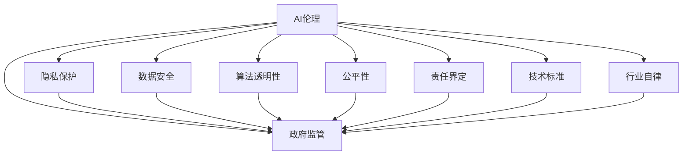

                 

# AI伦理规范的制定:行业自律还是政府监管

> 关键词：AI伦理,行业自律,政府监管,技术标准,隐私保护,公平性,算法透明

## 1. 背景介绍

### 1.1 问题由来

随着人工智能(AI)技术的迅猛发展，AI应用逐渐渗透到社会的各个领域，从自动驾驶、智慧医疗到智能客服、推荐系统，AI已经极大地改变了人们的生活方式和思维方式。然而，随之而来的伦理问题也日益凸显，包括隐私保护、数据安全、算法偏见、公平性等诸多方面。

近年来，随着一系列AI伦理事件的曝光，如人脸识别滥用、AI推荐偏见、智能决策失误等，社会各界对AI伦理的关注度越来越高。如何制定合适的AI伦理规范，平衡技术发展与社会伦理之间的关系，已经成为全球AI行业亟待解决的问题。

### 1.2 问题核心关键点

AI伦理规范的制定，涉及到多方面的核心关键点：

- **隐私保护**：如何确保AI系统对用户数据的保护，防止数据泄露和滥用。
- **数据安全**：如何保障AI训练和推理过程中数据的安全性，避免数据被恶意攻击。
- **算法透明性**：如何使得AI系统的决策过程透明可解释，增强用户对AI的信任。
- **公平性**：如何确保AI系统不会产生偏见，避免对特定群体的不公平对待。
- **责任界定**：当AI系统出现错误或滥用时，责任应当如何界定，如何追责。
- **法律与伦理的协调**：如何在法律框架内制定AI伦理规范，同时确保其能够适应技术发展的需要。

这些关键点相互交织，共同构成AI伦理规范制定的复杂场景。

## 2. 核心概念与联系

### 2.1 核心概念概述

为了更好地理解AI伦理规范的制定过程，我们需要先明确几个核心概念：

- **AI伦理**：指在人工智能开发、应用和部署过程中，应遵循的伦理原则和行为规范。
- **行业自律**：指行业内企业自发制定并遵循的自律性规范和行为准则。
- **政府监管**：指政府机构通过法律、法规和政策，对AI活动进行管理和监督。
- **技术标准**：指为确保技术可靠、安全和公平，制定的规范性技术文件和指南。
- **隐私保护**：指保护个人隐私不被非法收集、使用和泄露的行为。
- **公平性**：指确保AI系统对所有用户群体都一视同仁，避免任何形式的歧视。
- **算法透明性**：指AI系统决策过程的透明性，用户能够理解和解释AI的决策依据。
- **责任界定**：指在AI系统出现错误或滥用时，明确责任归属，确保问责机制的健全。

这些概念之间的逻辑关系可以通过以下Mermaid流程图来展示：



这个流程图展示了AI伦理规范制定过程中，各个核心概念之间的相互关系和作用机制。

## 3. 核心算法原理 & 具体操作步骤

### 3.1 算法原理概述

AI伦理规范的制定，本质上是一个多利益相关方参与的协同决策过程。其核心算法原理包括以下几个方面：

1. **利益相关方协调**：
   - 涉及政府、企业、学术界、用户等多方利益相关者，需要通过协调机制，确保各方利益和目标的一致性。
2. **共识形成**：
   - 在多方利益相关者之间，通过讨论、协商、投票等方式，形成共识和统一的伦理规范。
3. **规范落实**：
   - 将达成的伦理规范转化为具体的技术标准和操作规范，确保其在AI系统中的应用和执行。

### 3.2 算法步骤详解

AI伦理规范的制定步骤主要包括以下几个环节：

**Step 1: 多方参与**

- 组建由政府、企业、学术界、用户等代表组成的伦理委员会，确保多方参与和利益均衡。

**Step 2: 利益冲突识别与解决**

- 识别多方利益冲突点，如隐私保护与数据使用、公平性与算法偏见等，提出解决方案。

**Step 3: 规范草案制定**

- 基于利益相关方协调和共识形成，制定初步的AI伦理规范草案。

**Step 4: 规范审议与修订**

- 将草案提交给伦理委员会和相关利益相关者，进行审议和修订，确保规范的合理性和可行性。

**Step 5: 规范发布与实施**

- 规范经审核通过后，发布并推动各方按规范执行，确保规范的有效落实。

### 3.3 算法优缺点

AI伦理规范制定的主要优点包括：

1. **多方利益均衡**：通过多方参与，确保伦理规范能够兼顾各方的利益和目标。
2. **透明度与可解释性**：规范制定过程公开透明，有助于增强社会对AI系统的信任。
3. **灵活性与适应性**：规范能够及时调整和更新，适应技术发展和应用场景的变化。

然而，该方法也存在一些局限性：

1. **执行难度大**：规范的制定和实施需要多方协调，可能会遇到执行困难。
2. **法律与伦理冲突**：一些技术标准和伦理规范可能与现有法律框架存在冲突。
3. **技术进步迅速**：AI技术发展迅猛，伦理规范可能难以跟上技术进步的步伐。
4. **资源消耗高**：规范制定和实施过程需要大量人力、物力和时间。

### 3.4 算法应用领域

AI伦理规范的制定，在多个应用领域中具有重要意义，包括但不限于：

1. **医疗领域**：确保AI系统在医疗诊断、治疗推荐中的伦理责任，保护患者隐私。
2. **金融领域**：规范AI在信用评估、风险控制中的应用，确保数据安全和公平性。
3. **司法领域**：确保AI在司法决策中的透明性和公正性，避免算法偏见。
4. **教育领域**：规范AI在教育资源推荐、评估中的应用，确保教育公平和隐私保护。
5. **公共安全领域**：确保AI在安防、公共管理中的应用，保护公众隐私和数据安全。

## 4. 数学模型和公式 & 详细讲解 & 举例说明

### 4.1 数学模型构建

为了对AI伦理规范的制定过程进行数学建模，我们可以将其视为一个多变量决策问题，其中每个变量代表不同的利益相关方，每个变量取值代表该利益相关方对规范的支持度或反对度。

设AI伦理规范涉及的利益相关方为 $n$ 个，每个利益相关方的支持度为 $x_i$，则总体的支持度 $S$ 可以表示为：

$$
S = \sum_{i=1}^n x_i
$$

其中，$x_i$ 的取值范围为 $[0,1]$，表示利益相关方 $i$ 对规范的支持度。

### 4.2 公式推导过程

在多变量决策问题中，一个常用的求解方法是使用加权投票机制。假设每个利益相关方对规范的支持度 $x_i$ 权重为 $w_i$，则加权投票的结果 $V$ 可以表示为：

$$
V = \sum_{i=1}^n w_i x_i
$$

为了确保加权投票的结果能够反映各方的真实意愿，$w_i$ 的取值应与利益相关方的重要性成正比。在实际操作中，$w_i$ 可以通过问卷调查、专家评估等方式获得。

### 4.3 案例分析与讲解

假设某AI伦理规范涉及三个利益相关方：政府、企业、用户，其支持度分别为 $x_1, x_2, x_3$，权重分别为 $w_1, w_2, w_3$。通过问卷调查获得各方的支持度和权重，假设调查结果如下：

- 政府支持度 $x_1=0.8$，权重 $w_1=0.3$
- 企业支持度 $x_2=0.6$，权重 $w_2=0.2$
- 用户支持度 $x_3=0.5$，权重 $w_3=0.5$

代入公式计算得：

$$
V = 0.3 \times 0.8 + 0.2 \times 0.6 + 0.5 \times 0.5 = 0.578
$$

根据投票结果，AI伦理规范获得总体支持度 $V=0.578$，建议在多方协调的基础上，发布并推动各方按规范执行。

## 5. 项目实践：代码实例和详细解释说明

### 5.1 开发环境搭建

为了进行AI伦理规范的制定和评估，需要搭建一个多方参与的平台，支持数据收集、问卷调查、投票决策等功能。以下是Python环境搭建的步骤：

1. 安装Python：下载Python 3.x版本，安装到系统中。
2. 安装第三方库：使用pip安装必要的第三方库，如numpy、pandas、scikit-learn等。
3. 搭建Web平台：使用Flask等Web框架搭建平台，支持数据收集和展示。

### 5.2 源代码详细实现

以下是使用Flask搭建多方参与平台的Python代码示例：

```python
from flask import Flask, render_template, request
import pandas as pd

app = Flask(__name__)

@app.route('/')
def index():
    return render_template('index.html')

@app.route('/submit', methods=['POST'])
def submit():
    data = request.form.getlist('data')
    return str(data)

if __name__ == '__main__':
    app.run(debug=True)
```

### 5.3 代码解读与分析

在上述代码中，我们通过Flask搭建了一个简单的Web平台，支持数据提交和显示。当用户访问平台时，显示一个表单，用户可以选择各利益相关方的支持度，并提交投票结果。服务器接收到投票结果后，将其保存并显示在页面上。

### 5.4 运行结果展示

在实际运行时，用户可以通过Web平台提交投票结果，服务器接收到数据后，将其保存到数据库中。运行结果展示在Web页面上，方便各方查看和分析。

## 6. 实际应用场景

### 6.1 医疗领域

在医疗领域，AI伦理规范的制定尤为重要。AI系统在医疗诊断和治疗推荐中的应用，涉及患者隐私、数据安全、算法公正性等多个伦理问题。因此，需要多方参与，制定并落实相应的伦理规范。

**案例分析**：某医院采用AI系统进行疾病诊断和治疗推荐。在使用过程中，发现AI系统对某些少数群体存在算法偏见，导致误诊率高。通过多方协调，制定并落实了公平性规范，引入多样化的训练数据，改善了AI系统的偏见问题。

### 6.2 金融领域

在金融领域，AI伦理规范的制定也至关重要。AI系统在信用评估、风险控制中的应用，直接关系到用户的经济利益和数据安全。

**案例分析**：某银行使用AI系统进行信用评估。在使用过程中，发现AI系统对某些低收入群体存在算法歧视，导致贷款申请被拒绝。通过多方协调，制定并落实了公平性规范，引入多样化的训练数据，改善了AI系统的偏见问题。

### 6.3 教育领域

在教育领域，AI伦理规范的制定能够保障教育公平和隐私保护。AI系统在教育资源推荐和评估中的应用，直接关系到学生的学习效果和数据安全。

**案例分析**：某在线教育平台使用AI系统进行学习资源推荐。在使用过程中，发现AI系统对某些偏远地区的学生存在算法偏见，导致推荐资源不平衡。通过多方协调，制定并落实了公平性规范，引入多样化的训练数据，改善了AI系统的偏见问题。

## 7. 工具和资源推荐

### 7.1 学习资源推荐

为了帮助开发者系统掌握AI伦理规范的制定方法，推荐以下学习资源：

1. **《人工智能伦理导论》**：一本系统介绍AI伦理规范的书籍，涵盖隐私保护、算法透明性、公平性等多个方面。
2. **IEEE标准**：IEEE等国际组织发布的AI伦理标准和指南，提供权威的技术标准和操作规范。
3. **ACM会议论文**：ACM等计算机科学领域顶级会议上发表的AI伦理相关论文，提供最新的研究成果和实践经验。
4. **OpenAI伦理手册**：OpenAI发布的AI伦理手册，提供丰富的案例分析和操作指南。
5. **AI伦理课程**：各大在线平台提供的AI伦理相关课程，涵盖理论基础和实践应用。

### 7.2 开发工具推荐

为了支持AI伦理规范的制定和评估，推荐以下开发工具：

1. **Flask**：Python Web框架，支持数据收集和展示。
2. **SQLite**：轻量级数据库，支持数据存储和管理。
3. **Pandas**：数据处理库，支持数据清洗和分析。
4. **NumPy**：数值计算库，支持高效的数据处理和计算。
5. **Scikit-learn**：机器学习库，支持数据建模和预测。

### 7.3 相关论文推荐

为了深入理解AI伦理规范的制定方法，推荐以下相关论文：

1. **《人工智能伦理：原则、规范与实践》**：一本系统介绍AI伦理规范的书籍，涵盖隐私保护、数据安全、公平性等多个方面。
2. **《AI伦理标准与规范制定指南》**：IEEE等国际组织发布的AI伦理标准和指南，提供权威的技术标准和操作规范。
3. **《AI伦理的挑战与应对》**：ACM等计算机科学领域顶级会议上发表的AI伦理相关论文，提供最新的研究成果和实践经验。
4. **《AI伦理规范制定方法研究》**：OpenAI发布的AI伦理手册，提供丰富的案例分析和操作指南。
5. **《人工智能伦理规范的研究现状与展望》**：学术期刊上发表的AI伦理规范相关论文，提供系统性和前瞻性的研究成果。

## 8. 总结：未来发展趋势与挑战

### 8.1 研究成果总结

AI伦理规范的制定，已经成为AI领域的重要研究方向。现有的研究成果主要集中在以下几个方面：

1. **隐私保护**：提出了一系列隐私保护技术，如差分隐私、联邦学习等，确保用户数据的安全性。
2. **数据安全**：提出了数据加密、安全传输等技术，保障数据在传输和存储过程中的安全。
3. **公平性**：提出了消除算法偏见的多种方法，如数据增强、对抗训练等，确保AI系统的公平性。
4. **算法透明性**：提出了多种可解释性技术，如LIME、SHAP等，增强AI系统的透明性和可解释性。
5. **责任界定**：提出了AI系统责任界定的多种方法，如责任矩阵、责任追溯等，确保责任的明确和可追溯性。

### 8.2 未来发展趋势

展望未来，AI伦理规范的制定将呈现以下几个趋势：

1. **法律与伦理的协调**：随着AI技术的发展，AI伦理规范将逐步与法律框架进行协调，确保技术发展与伦理标准的统一。
2. **全球化规范的制定**：随着AI技术的全球化应用，全球统一的AI伦理规范将逐步制定和推广。
3. **技术标准的完善**：AI伦理规范将逐步完善为技术标准，提供明确的指导和操作规范。
4. **多方参与的协同**：AI伦理规范将逐步实现多方参与的协同决策，确保各方的利益和目标一致。
5. **动态更新的机制**：AI伦理规范将逐步实现动态更新的机制，及时适应技术发展和应用场景的变化。

### 8.3 面临的挑战

尽管AI伦理规范的制定取得了一定进展，但在实现过程中仍面临诸多挑战：

1. **利益冲突的协调**：多方参与的协同决策过程中，利益冲突难以避免，如何协调各方利益成为一大难题。
2. **技术标准的统一**：不同国家和地区对AI伦理规范的理解和要求存在差异，技术标准的统一仍然存在挑战。
3. **法律框架的滞后**：现有法律框架可能无法及时适应AI技术的发展，滞后于技术进步。
4. **多方参与的资源投入**：多方参与的协同决策需要大量的人力、物力和时间，资源投入巨大。
5. **技术进步的迅速**：AI技术发展迅猛，伦理规范的制定和实施难以跟上技术进步的步伐。

### 8.4 研究展望

未来的研究需要在以下几个方向进行深入探索：

1. **利益冲突的解决机制**：建立多方利益相关者之间的协调机制，解决利益冲突。
2. **技术标准的一致性**：制定全球统一的AI伦理规范，确保技术标准的协调和一致。
3. **法律框架的更新**：及时更新现有法律框架，确保其与AI技术的发展相适应。
4. **多方参与的资源优化**：优化多方参与的资源投入，提高决策效率。
5. **动态更新的机制**：建立动态更新的机制，及时适应技术发展的需要。

## 9. 附录：常见问题与解答

**Q1: 如何理解AI伦理规范的制定过程？**

A: AI伦理规范的制定过程是一个多方参与、协同决策的过程。在多方利益相关者之间，通过讨论、协商、投票等方式，形成共识和统一的伦理规范。这个过程中，需要平衡各方的利益和目标，确保规范的合理性和可行性。

**Q2: 制定AI伦理规范需要考虑哪些因素？**

A: 制定AI伦理规范需要考虑隐私保护、数据安全、算法透明性、公平性、责任界定等多个因素。需要确保AI系统对用户数据的保护，防止数据泄露和滥用；保障数据在传输和存储过程中的安全性；增强AI系统的透明性和可解释性；确保AI系统对所有用户群体的公平对待；明确AI系统出现错误或滥用时的责任归属。

**Q3: 如何确保AI伦理规范的落实？**

A: 制定AI伦理规范后，需要通过多方协调和监督，确保规范的落实。可以建立伦理委员会，定期审查和评估规范的执行情况；引入第三方评估机构，对规范的实施效果进行独立评估；对违规行为进行惩罚和问责，确保规范的有效性。

---

作者：禅与计算机程序设计艺术 / Zen and the Art of Computer Programming

