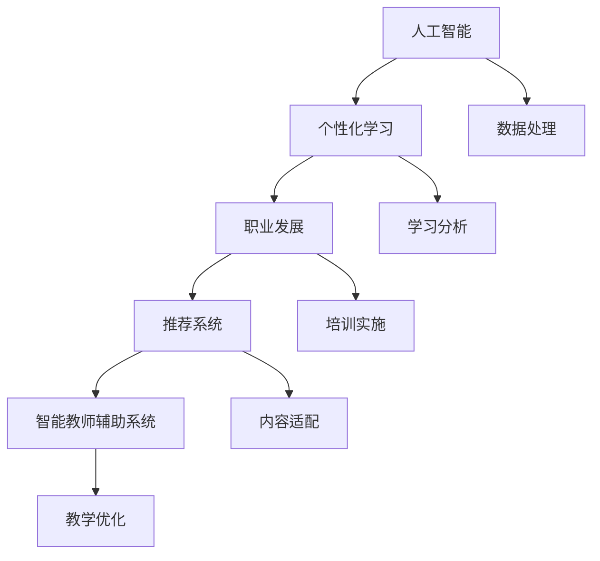
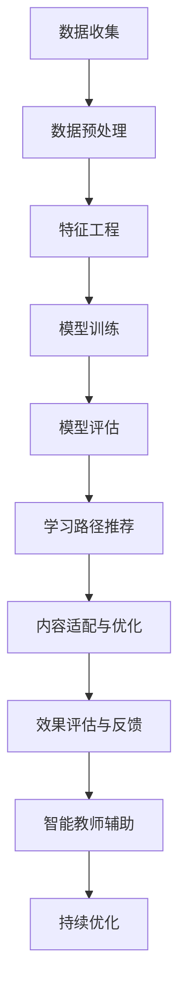

                 

# AI在个性化职场技能培训中的应用：促进职业发展

> 关键词：人工智能,个性化,职业发展,职场技能培训,推荐系统

## 1. 背景介绍

### 1.1 问题由来

随着人工智能(AI)技术的飞速发展，个性化学习和职业发展逐渐成为教育领域和人力资源管理的重要趋势。传统的“一刀切”式培训模式已无法满足员工个性化发展的需求。AI技术，尤其是机器学习和深度学习，在数据分析、模式识别和预测等方面具备显著优势，成为个性化职业发展培训的强大工具。通过AI技术，可以实现学习路径的个性化推荐、培训内容的适配以及培训效果的评估，从而大大提升职业发展的针对性和有效性。

### 1.2 问题核心关键点

AI在个性化职场技能培训中的应用，核心关键点包括：
- 个性化学习路径推荐
- 培训内容适配与优化
- 学习效果评估与反馈
- 智能化教师辅助系统

AI技术的应用，使个性化培训能够更加高效、精准地满足不同员工的学习需求和职业目标。

## 2. 核心概念与联系

### 2.1 核心概念概述

为更好地理解AI在个性化职场技能培训中的应用，本节将介绍几个关键核心概念及其相互联系：

- **人工智能(AI)**：包括机器学习、深度学习、自然语言处理等子领域，通过模拟人类智能，实现对数据的自动分析和决策。
- **个性化学习(PL)**：根据个体差异，定制个性化的学习路径、内容和评估方式，提高学习效率和成果。
- **职业发展(CD)**：通过系统的培训和实践，使员工掌握新技能，提升职业竞争力，实现个人职业目标。
- **推荐系统(Recommender System)**：根据用户的历史行为和偏好，自动推荐合适的培训内容和路径。
- **智能教师辅助系统(ITAS)**：通过AI技术，对传统教师进行辅助，提高教学质量和效率。

这些核心概念之间的联系如图示所示：



### 2.2 核心概念原理和架构的 Mermaid 流程图

下图展示了AI在个性化职场技能培训中的流程架构，每个环节的具体技术和方法：



## 3. 核心算法原理 & 具体操作步骤

### 3.1 算法原理概述

AI在个性化职场技能培训中的核心算法原理包括：
- 个性化推荐算法：根据用户的历史行为和兴趣，自动推荐合适的培训内容。
- 学习分析算法：通过学习路径推荐和学习效果评估，提供个性化的培训建议。
- 智能教师辅助算法：使用自然语言处理技术，帮助教师制定个性化教学方案。

这些算法共同构成了个性化培训的完整流程，确保培训的针对性和有效性。

### 3.2 算法步骤详解

AI在个性化职场技能培训的应用主要分为以下几个步骤：

1. **数据收集与预处理**：
   - 收集员工的培训历史、工作绩效、职业兴趣等数据。
   - 对数据进行清洗和预处理，如去除噪声、处理缺失值等。

2. **特征工程**：
   - 将原始数据转化为模型能够理解的特征。
   - 设计合适的特征，包括但不限于：员工资历、培训历史、工作绩效等。

3. **模型训练与评估**：
   - 选择适合的目标算法，如协同过滤、深度学习、强化学习等。
   - 训练模型，并进行交叉验证等评估手段，确保模型性能稳定。

4. **学习路径推荐**：
   - 根据员工特征和历史行为，生成个性化的学习路径。
   - 结合目标算法，推荐最合适的培训课程和内容。

5. **内容适配与优化**：
   - 根据学习路径和员工反馈，调整培训内容，提供定制化学习材料。
   - 使用自然语言处理技术，优化培训材料的质量和适配度。

6. **效果评估与反馈**：
   - 使用评估指标，如学习成果、知识掌握度等，评估培训效果。
   - 收集员工反馈，进行持续优化。

7. **智能教师辅助**：
   - 使用自然语言处理技术，帮助教师制定个性化教学方案。
   - 实时监控和反馈，提高教学质量。

8. **持续优化**：
   - 根据员工反馈和评估结果，持续调整和优化培训内容。
   - 使用强化学习等方法，不断提升个性化培训的效果。

### 3.3 算法优缺点

AI在个性化职场技能培训中的算法具有以下优点：
- 高效精准：AI算法可以根据大量数据快速生成个性化的培训方案。
- 灵活适应：能够根据员工的变化实时调整培训内容。
- 自动化程度高：减少人工干预，提高培训效率。

同时，也存在以下缺点：
- 数据依赖：算法效果受数据质量和数量的影响。
- 模型复杂：某些算法如深度学习模型，训练和优化较为复杂。
- 可解释性不足：AI模型往往难以解释其决策过程，缺乏透明性。

### 3.4 算法应用领域

AI在个性化职场技能培训中的应用领域广泛，包括但不限于：
- 技术培训：如编程、数据分析、人工智能等。
- 软技能培训：如领导力、沟通技巧、团队协作等。
- 职业发展规划：如职业定位、职业转型、职业晋升等。
- 绩效提升：如提升工作效率、改善工作质量等。

## 4. 数学模型和公式 & 详细讲解 & 举例说明

### 4.1 数学模型构建

AI在个性化培训中的应用，常基于以下数学模型进行建模：
- 协同过滤模型(Collaborative Filtering, CF)：根据用户历史行为数据，生成个性化的推荐列表。
- 深度学习模型(Deep Learning Model, DL)：通过多层神经网络，提取复杂的特征。
- 强化学习模型(Reinforcement Learning Model, RL)：根据员工反馈，动态调整培训内容。

### 4.2 公式推导过程

以协同过滤模型为例，其基本公式为：

$$
\hat{r}_{ui} = \alpha \sum_{j \in \mathcal{N}(u)} \frac{r_{uj} \cdot \hat{p}_{ij}}{p_{uj}}
$$

其中：
- $r_{ui}$ 为用户 $u$ 对物品 $i$ 的预测评分。
- $\alpha$ 为常数，通常取值较小。
- $\mathcal{N}(u)$ 为用户 $u$ 的邻居集合，即与 $u$ 有相似行为的用户集合。
- $r_{uj}$ 为邻居用户 $j$ 对物品 $i$ 的实际评分。
- $\hat{p}_{ij}$ 为物品 $i$ 的隐向量 $p_i$ 在用户 $j$ 的隐向量 $p_j$ 上的投影。
- $p_{uj}$ 为用户 $u$ 的隐向量 $p_u$ 在物品 $j$ 的隐向量 $p_j$ 上的投影。

### 4.3 案例分析与讲解

假设某企业希望为一名员工推荐适合的技术培训课程。通过协同过滤模型，可以计算该员工对各个培训课程的评分，并选择评分最高的课程作为推荐。该员工的历史行为数据可能包括：
- 参加的培训课程
- 完成的项目数量
- 在项目中的角色

模型通过计算员工与历史行为相似的用户的评分，来预测该员工对各个课程的评分，从而生成个性化推荐。

## 5. 项目实践：代码实例和详细解释说明

### 5.1 开发环境搭建

以下是使用Python和TensorFlow搭建AI个性化培训项目的基本环境：

1. 安装Anaconda：从官网下载并安装Anaconda，用于创建独立的Python环境。
2. 创建并激活虚拟环境：
```bash
conda create -n ai_training python=3.8 
conda activate ai_training
```
3. 安装TensorFlow和相关依赖：
```bash
conda install tensorflow
```
4. 准备数据集：如员工培训历史数据、项目记录等。

### 5.2 源代码详细实现

以下是一个简单的基于协同过滤模型的代码实现：

```python
import tensorflow as tf
from tensorflow.keras.layers import Dense, Input
from tensorflow.keras.models import Model

# 定义用户和物品的隐向量维度
d = 100

# 定义输入层
user_input = Input(shape=(1,))
item_input = Input(shape=(1,))

# 定义共享权重
W_user = tf.Variable(tf.random.normal([N, d]))
W_item = tf.Variable(tf.random.normal([M, d]))

# 定义用户隐向量
user_embedding = Dense(d, activation='relu')(user_input)
user_embedding = tf.keras.layers.Lambda(lambda x: x * W_user)(user_embedding)

# 定义物品隐向量
item_embedding = Dense(d, activation='relu')(item_input)
item_embedding = tf.keras.layers.Lambda(lambda x: x * W_item)(item_embedding)

# 定义预测层
predictions = Dense(1, activation='sigmoid')(tf.add(tf.multiply(user_embedding, item_embedding), tf.reduce_mean(tf.multiply(user_embedding, user_embedding))))

# 定义模型
model = Model([user_input, item_input], predictions)

# 编译模型
model.compile(optimizer='adam', loss='binary_crossentropy')

# 训练模型
model.fit(x_train, y_train, epochs=10, batch_size=32)

# 预测评分
predictions = model.predict([user_test, item_test])
```

### 5.3 代码解读与分析

**用户输入层**：定义了用户的输入向量。
**物品输入层**：定义了物品的输入向量。
**共享权重**：定义了用户和物品的隐向量维度。
**用户隐向量**：将用户输入与共享权重相乘，得到用户隐向量。
**物品隐向量**：将物品输入与共享权重相乘，得到物品隐向量。
**预测层**：将用户隐向量和物品隐向量相加，通过sigmoid激活函数，得到预测评分。
**模型**：将输入层和预测层连接，定义完整的模型结构。
**编译模型**：设置优化器和损失函数，准备训练。
**训练模型**：使用训练数据训练模型，并设定训练轮数和批大小。
**预测评分**：使用模型对新用户和物品的评分进行预测。

## 6. 实际应用场景

### 6.1 个性化职业发展规划

AI技术可以基于员工的职业历史和当前状态，推荐适合的职业发展规划路径。通过自然语言处理技术，帮助员工制定个性化的职业发展计划。

以某大型企业为例，员工可以通过AI系统提交职业发展需求，系统根据员工的历史表现、技能和兴趣，生成推荐的职业路径，并提供相应的培训和资源支持。员工可以实时跟踪自己的职业发展进度，及时调整职业目标。

### 6.2 技术培训课程推荐

AI技术可以根据员工的技能水平和职业目标，推荐合适的技术培训课程。系统通过收集员工的历史培训数据和课程评价，使用协同过滤、深度学习等方法，生成个性化推荐。

例如，某软件工程师希望提升Python编程技能。通过AI系统，可以推荐适合的Python培训课程，包括在线课程、书籍和实战项目，并根据其学习进度和反馈，动态调整推荐内容，确保学习效果最大化。

### 6.3 绩效提升与软技能培训

AI技术可以基于员工的工作表现和反馈，推荐提升绩效的培训课程和软技能培训。系统通过分析员工的工作日志和绩效评估数据，使用强化学习等方法，生成个性化的培训建议。

例如，某销售人员希望提升客户关系管理能力。通过AI系统，可以推荐适合的CRM培训课程，并提供相关的客户案例分析，帮助其提升客户关系维护和谈判技巧，提升销售额。

## 7. 工具和资源推荐

### 7.1 学习资源推荐

为帮助开发者深入理解AI在个性化职业发展中的应用，以下是推荐的资源：

1. **《深度学习》（Ian Goodfellow等著）**：涵盖深度学习的基础理论和最新进展，适合初学者和研究者。
2. **《机器学习实战》（Peter Harrington著）**：提供丰富的实战案例和代码，帮助理解机器学习的应用。
3. **《Python自然语言处理》（Steven Bird等著）**：详细讲解自然语言处理技术和工具，包括文本分析和处理。
4. **《推荐系统实战》（Danny Sarafian著）**：介绍推荐系统的理论基础和实践技巧，适合工程师和产品经理。
5. **《深度学习与自然语言处理》（Kaiming He等著）**：涵盖深度学习和自然语言处理的最新进展，适合研究者。

### 7.2 开发工具推荐

AI在个性化职业发展中的应用，常用的开发工具包括：

1. **TensorFlow**：Google推出的开源深度学习框架，提供丰富的API和工具，支持分布式计算。
2. **PyTorch**：Facebook推出的开源深度学习框架，灵活易用，支持动态计算图。
3. **Jupyter Notebook**：交互式的Python开发环境，支持代码编写、数据可视化、模型训练等。
4. **Keras**：高层次的深度学习API，支持快速搭建和训练深度学习模型。
5. **Scikit-learn**：Python机器学习库，提供常用的机器学习算法和工具。

### 7.3 相关论文推荐

以下是几篇具有代表性的论文，推荐深入阅读：

1. **《协同过滤推荐算法》**（S. Koren, et al., 2009）：介绍协同过滤算法的原理和实现。
2. **《深度学习在推荐系统中的应用》**（C. Burges, et al., 2013）：探讨深度学习在推荐系统中的潜力。
3. **《强化学习在推荐系统中的应用》**（V. Kvetal等，2017）：介绍强化学习在推荐系统中的应用。
4. **《自然语言处理在智能推荐中的应用》**（J. Boyd-Graber等，2009）：探讨自然语言处理技术在推荐系统中的应用。
5. **《机器学习在职业发展规划中的应用》**（J. McAfee等，2021）：探讨机器学习在职业发展规划中的应用。

## 8. 总结：未来发展趋势与挑战

### 8.1 总结

本文系统介绍了AI在个性化职业发展培训中的应用，探讨了个性化推荐、学习分析、智能教师辅助等关键技术。AI技术通过高效精准地推荐培训内容、个性化学习路径和优化培训效果，显著提升了员工职业发展的针对性和有效性。未来，AI在个性化培训中的应用将更加广泛和深入，成为提升企业竞争力的重要手段。

### 8.2 未来发展趋势

展望未来，AI在个性化职业发展培训中的应用将呈现以下趋势：
1. **多模态融合**：将图像、视频等多模态数据与文本数据结合，提升培训内容的丰富性和交互性。
2. **动态学习路径**：根据员工的学习进度和反馈，实时调整学习路径，实现动态学习。
3. **智能化教师辅助**：通过自然语言处理技术，辅助教师制定个性化教学方案，提升教学质量。
4. **跨领域应用**：从技术培训扩展到软技能培训、职业发展规划等多个领域，覆盖更广泛的应用场景。
5. **智能评估与反馈**：结合情感分析和自然语言处理技术，提供实时的学习评估和反馈，帮助员工持续改进。

### 8.3 面临的挑战

尽管AI在个性化职业发展培训中具备显著优势，但也面临以下挑战：
1. **数据质量和数量**：培训数据的质量和数量直接影响模型的性能，高质量数据的获取和标注需要大量资源。
2. **模型复杂度**：深度学习和强化学习等算法的复杂度较高，模型训练和优化需要较高的技术门槛。
3. **可解释性**：AI模型的决策过程缺乏透明性，难以解释其内部逻辑和推理过程。
4. **隐私与安全**：员工的培训数据涉及个人隐私，需要严格的隐私保护措施。
5. **成本投入**：开发和维护AI系统需要大量的技术投入和人力资源。

### 8.4 研究展望

未来的研究应关注以下方向：
1. **数据增强**：通过数据扩充和增强，提升模型的泛化能力和鲁棒性。
2. **模型压缩**：通过模型压缩和优化，降低模型的计算和存储成本。
3. **跨领域知识融合**：将符号化的先验知识与神经网络模型结合，提升模型的知识整合能力。
4. **伦理与隐私保护**：在模型设计和应用中引入伦理和隐私保护机制，确保数据安全和员工隐私。
5. **可解释性研究**：开发更可解释的AI模型，提高模型的透明度和可信度。

总之，AI在个性化职业发展培训中的应用具有广阔的前景，但需在数据、算法、伦理等方面持续优化和改进，才能更好地服务于员工职业发展和企业人力资源管理。

## 9. 附录：常见问题与解答

### Q1: 什么是协同过滤推荐算法？

A: 协同过滤推荐算法是一种基于用户历史行为数据和物品相似性的推荐算法。其基本思想是，找到与目标用户相似的用户集合，并根据这些用户的偏好预测目标用户的偏好，从而推荐适合的用户。

### Q2: 如何评估AI在职业发展培训中的应用效果？

A: 评估AI在职业发展培训中的应用效果，可以从以下几个方面考虑：
1. 培训完成的课程数量和质量。
2. 员工职业发展的进度和绩效提升。
3. 员工对培训的满意度和反馈。
4. 培训资源的利用率和成本效益。

### Q3: 如何优化AI在职业发展培训中的应用？

A: 优化AI在职业发展培训中的应用，可以从以下几个方面考虑：
1. 数据质量和数量的提升，确保模型的准确性。
2. 选择合适的算法和模型结构，提升推荐精度。
3. 引入自然语言处理技术，提高学习路径和内容适配的个性化程度。
4. 使用强化学习等方法，动态调整培训内容。
5. 定期评估和反馈，持续优化模型和应用效果。

### Q4: AI在职业发展培训中的应用有哪些潜在风险？

A: AI在职业发展培训中的应用，潜在风险包括：
1. 数据隐私泄露。员工培训数据的隐私保护需要严格措施。
2. 模型偏见。AI模型可能存在固有的偏见，影响推荐结果的公正性。
3. 过度依赖。员工可能过度依赖AI推荐，忽视自身的主动性和能动性。
4. 成本高昂。开发和维护AI系统需要大量的技术投入和资源。

总之，AI在职业发展培训中的应用具有广阔的前景，但需在数据、算法、伦理等方面持续优化和改进，才能更好地服务于员工职业发展和企业人力资源管理。

