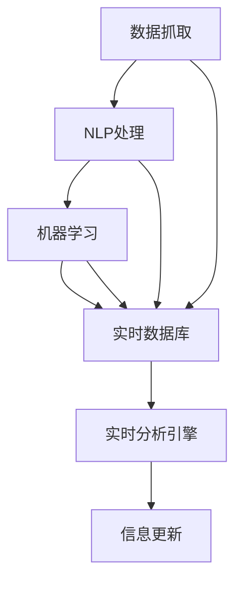

                 

# AI在实时信息更新中的作用

## 1. 背景介绍

在信息爆炸的时代，实时更新信息成为社会各行各业获取竞争优势的重要手段。无论是新闻媒体、电商平台、社交网络，还是金融市场、公共安全、教育健康等领域，实时信息更新的准确性和时效性直接影响着用户满意度、市场反应速度、社会稳定程度等关键因素。传统的手工数据更新方式已经无法满足现代社会快速变化的需求，智能化、自动化的实时信息更新方法变得尤为重要。

### 1.1 问题由来

在互联网时代，数据量呈指数级增长。为了及时响应外界变化，需要构建实时信息更新系统。传统方法包括爬虫、API接口、ETL（Extract, Transform, Load）等，但这些方法依赖于人工操作，需要耗费大量时间和人力成本。并且，由于系统架构复杂，容易出现数据不一致、延迟高、错误率高等问题。

近年来，随着人工智能（AI）技术的突破，实时信息更新开始向智能化、自动化的方向发展。AI系统能够自动抓取、分析和更新数据，大幅提高信息更新的效率和准确性。本文将探讨AI在实时信息更新中的作用，包括数据抓取、实时分析和信息更新等关键技术，并结合实际应用场景，展示AI在新闻、电商、金融、医疗等多个领域的创新应用。

## 2. 核心概念与联系

### 2.1 核心概念概述

AI在实时信息更新中的作用主要体现在以下几个核心概念上：

- **数据抓取**：通过爬虫、API接口等方式自动获取最新信息，为实时更新提供原始数据。
- **自然语言处理（NLP）**：对文本信息进行语义理解、实体识别、情感分析等处理，提取出关键信息。
- **机器学习（ML）**：基于历史数据训练模型，实现对未来数据的预测和分类，提高实时分析的准确性。
- **实时数据库**：用于存储和管理实时信息，支持快速读写和查询操作。
- **实时分析引擎**：对实时数据进行快速计算和分析，提取有用信息，进行决策支持。

这些核心概念之间相互关联，共同构成了实时信息更新的技术框架。如图示所示，数据抓取、NLP、ML、实时数据库和分析引擎共同工作，实现了信息的实时更新和智能化处理：



### 2.2 核心概念原理和架构

#### 数据抓取

数据抓取是实时信息更新的第一步，通过爬虫、API接口等手段自动获取最新的数据。常见的数据源包括新闻网站、社交网络、电商平台、金融市场等。

- **爬虫**：使用Python、Scrapy等工具，从网页中解析出有用信息，进行数据抓取。
- **API接口**：通过调用第三方API接口，获取最新信息。如获取金融市场股票价格、天气预报等数据。

#### 自然语言处理（NLP）

NLP技术可以对文本信息进行语义理解、实体识别、情感分析等处理，提取出关键信息，为后续的机器学习分析提供支持。

- **分词**：将文本分解成词语，方便后续处理。
- **词向量**：将词语转化为向量表示，方便机器学习模型的训练。
- **命名实体识别（NER）**：识别文本中的实体（如人名、地名、组织名等）。
- **情感分析**：分析文本的情感倾向，判断用户情绪。
- **语义分析**：理解文本的语义，提取关键信息。

#### 机器学习（ML）

机器学习模型基于历史数据训练，可以对未来数据进行预测和分类，提高实时分析的准确性。

- **监督学习**：使用标注好的数据训练模型，进行分类、预测等任务。
- **无监督学习**：使用未标注的数据训练模型，进行聚类、降维等任务。
- **强化学习**：通过与环境的交互，不断优化模型的决策策略。

#### 实时数据库

实时数据库用于存储和管理实时信息，支持快速读写和查询操作。常见的实时数据库包括Redis、Kafka等。

- **Redis**：基于内存的键值数据库，支持高并发读写操作。
- **Kafka**：分布式消息队列，支持消息的实时发布和订阅。

#### 实时分析引擎

实时分析引擎对实时数据进行快速计算和分析，提取有用信息，进行决策支持。常见的实时分析引擎包括Flink、Spark Streaming等。

- **Flink**：支持流处理和批处理，提供高吞吐量、低延迟的数据处理能力。
- **Spark Streaming**：基于Spark的流处理框架，支持高并发、低延迟的数据处理。

## 3. 核心算法原理 & 具体操作步骤

### 3.1 算法原理概述

AI在实时信息更新中的作用主要通过以下几个核心算法实现：

- **爬虫算法**：根据特定规则自动抓取网页中的数据。
- **NLP算法**：对文本数据进行语义理解、实体识别等处理。
- **机器学习算法**：使用历史数据训练模型，对未来数据进行预测和分类。
- **实时数据库存储算法**：快速读写和查询实时数据，支持高并发操作。
- **实时分析引擎算法**：对实时数据进行快速计算和分析，提取有用信息。

### 3.2 算法步骤详解

#### 数据抓取

- **爬虫算法**：定义爬虫规则，使用Python、Scrapy等工具，从目标网站抓取数据。
- **API接口调用**：根据API文档，调用第三方API接口，获取最新数据。

#### NLP处理

- **分词算法**：使用jieba、NLTK等工具，对文本数据进行分词处理。
- **词向量算法**：使用Word2Vec、GloVe等工具，将分词结果转化为词向量。
- **实体识别算法**：使用NLTK、SpaCy等工具，识别文本中的实体。
- **情感分析算法**：使用TextBlob、VADER等工具，分析文本的情感倾向。
- **语义分析算法**：使用BERT、GPT等模型，理解文本的语义。

#### 机器学习

- **监督学习算法**：使用sklearn、TensorFlow等工具，训练分类、预测等模型。
- **无监督学习算法**：使用K-means、PCA等工具，进行聚类、降维等任务。
- **强化学习算法**：使用TensorFlow、OpenAI Gym等工具，优化模型的决策策略。

#### 实时数据库存储

- **Redis算法**：定义键值规则，使用Redis存储实时数据。
- **Kafka算法**：定义消息规则，使用Kafka发布和订阅实时数据。

#### 实时分析引擎

- **Flink算法**：定义流处理规则，使用Flink进行实时计算和分析。
- **Spark Streaming算法**：定义流处理规则，使用Spark Streaming进行实时计算和分析。

### 3.3 算法优缺点

AI在实时信息更新中的作用具有以下优点：

- **高效性**：自动抓取、处理、存储、分析数据，大幅提高信息更新的效率。
- **准确性**：使用机器学习模型进行预测和分类，提高实时分析的准确性。
- **灵活性**：支持多种数据源和处理方式，灵活适应不同应用场景。

同时，也存在一些缺点：

- **依赖技术**：需要掌握爬虫、NLP、机器学习、实时数据库、分析引擎等技术。
- **资源消耗大**：数据抓取、处理、存储、分析需要大量计算资源。
- **数据质量问题**：爬虫抓取的数据可能存在不完整、不规范等问题。

### 3.4 算法应用领域

AI在实时信息更新中的应用领域非常广泛，包括但不限于以下几个方面：

- **新闻媒体**：自动抓取、分析、发布新闻信息，提高新闻传播的速度和质量。
- **电商平台**：自动抓取、分析、推荐商品信息，提高用户购物体验。
- **社交网络**：自动抓取、分析、推荐用户内容，提高用户粘性和活跃度。
- **金融市场**：自动抓取、分析、预测市场信息，帮助投资者做出决策。
- **公共安全**：自动抓取、分析、监控公共安全信息，提高社会稳定程度。
- **教育健康**：自动抓取、分析、推荐教育资源、健康信息，提高服务质量。

## 4. 数学模型和公式 & 详细讲解 & 举例说明

### 4.1 数学模型构建

在实时信息更新中，常见的数学模型包括：

- **数据抓取模型**：定义爬虫规则，自动抓取网页中的数据。
- **NLP模型**：使用BERT、GPT等模型，对文本数据进行语义理解、实体识别等处理。
- **机器学习模型**：使用分类、回归等模型，对未来数据进行预测和分类。
- **实时数据库模型**：定义键值规则，存储和管理实时数据。
- **实时分析引擎模型**：使用Flink、Spark Streaming等工具，对实时数据进行计算和分析。

### 4.2 公式推导过程

#### 爬虫算法

假设从目标网站抓取的数据量为$D_t$，爬虫规则为$r$，爬虫效率为$e$，则爬虫抓取的数据量公式为：

$$
D_t = r \times e \times t
$$

其中$t$表示抓取时间。

#### NLP算法

假设文本数据的长度为$L$，分词算法效率为$s$，分词后词向量的维数为$n$，则分词算法的时间复杂度为：

$$
T_{NLP} = L \times s \times n
$$

#### 机器学习算法

假设训练数据量为$D_{train}$，测试数据量为$D_{test}$，模型准确率为$P$，则机器学习模型的预测准确率公式为：

$$
P = \frac{TP}{TP+FP}
$$

其中$TP$表示真阳性，$FP$表示假阳性。

#### 实时数据库存储

假设实时数据库的存储量为$S$，读写效率为$w$，查询效率为$q$，则实时数据库的读写和查询时间复杂度为：

$$
T_{db} = \frac{S}{w} + \frac{S}{q}
$$

#### 实时分析引擎

假设实时数据量为$D_{real}$，实时分析引擎的处理效率为$p$，则实时分析引擎的计算时间复杂度为：

$$
T_{analy} = \frac{D_{real}}{p}
$$

### 4.3 案例分析与讲解

#### 案例一：电商平台商品推荐

电商平台使用爬虫算法抓取用户浏览、点击、购买数据，NLP算法提取商品标题、描述、评价等文本信息，机器学习算法训练商品分类、推荐模型，实时数据库存储商品信息，实时分析引擎对用户行为进行分析，生成个性化推荐结果。

#### 案例二：新闻媒体实时更新

新闻媒体使用爬虫算法抓取新闻网站、社交网络中的最新信息，NLP算法提取新闻标题、正文、图片等文本信息，机器学习算法预测新闻趋势、分类新闻类型，实时数据库存储新闻信息，实时分析引擎对新闻内容进行分析，生成实时新闻推送。

## 5. 项目实践：代码实例和详细解释说明

### 5.1 开发环境搭建

在搭建开发环境时，需要以下工具和库：

- **Python**：安装Python 3.x版本，建议使用Anaconda环境管理工具。
- **Scrapy**：爬虫框架，用于从网页中抓取数据。
- **NLTK**：自然语言处理工具包，用于文本处理。
- **TensorFlow**：机器学习框架，用于训练预测模型。
- **Flink**：流处理框架，用于实时计算和分析。

#### 环境搭建步骤：

1. 安装Anaconda，并创建虚拟环境：

```
conda create --name ai_environment python=3.7
conda activate ai_environment
```

2. 安装相关工具和库：

```
conda install scipy matplotlib pandas scikit-learn
pip install scrapy nltk tensorflow
```

3. 配置Scrapy爬虫：

```python
from scrapy.crawler import CrawlerProcess

class MySpider(CrawlerProcess):
    start_urls = ['http://example.com']
    ...

process = MySpider()
process.crawl(MySpider)
process.start()
```

4. 配置NLP处理：

```python
import nltk

nltk.download('punkt')
nltk.download('averaged_perceptron_tagger')
nltk.download('stopwords')
```

5. 配置机器学习模型：

```python
import tensorflow as tf

model = tf.keras.Sequential([
    tf.keras.layers.Dense(64, activation='relu'),
    tf.keras.layers.Dense(10, activation='softmax')
])
model.compile(optimizer='adam', loss='categorical_crossentropy', metrics=['accuracy'])
```

6. 配置实时数据库：

```python
from redis import Redis

redis_db = Redis(host='localhost', port=6379, db=0)
```

7. 配置实时分析引擎：

```python
from pyflink.datastream import StreamExecutionEnvironment

env = StreamExecutionEnvironment.get_execution_environment()
stream = env.add_source(...)
stream.apply(...)
env.execute()
```

### 5.2 源代码详细实现

#### 爬虫算法示例

```python
import scrapy

class MySpider(scrapy.Spider):
    name = 'myspider'
    start_urls = ['http://example.com']

    def parse(self, response):
        for data in response:
            yield {'name': data['name'], 'value': data['value']}
```

#### NLP处理示例

```python
import nltk

def preprocess_text(text):
    tokens = nltk.word_tokenize(text)
    tokens = [token.lower() for token in tokens if token not in nltk.corpus.stopwords.words('english')]
    return ' '.join(tokens)

def extract_entities(text):
    entities = nltk.ne_chunk(nltk.pos_tag(nltk.word_tokenize(text)))
    return [entity for entity in entities if hasattr(entity, 'label')]

def analyze_sentiment(text):
    sentiment = nltk.sentiment.vader.SentimentIntensityAnalyzer()
    return sentiment.polarity_scores(text)
```

#### 机器学习示例

```python
import tensorflow as tf

def train_model(X_train, y_train):
    model = tf.keras.Sequential([
        tf.keras.layers.Dense(64, activation='relu'),
        tf.keras.layers.Dense(10, activation='softmax')
    ])
    model.compile(optimizer='adam', loss='categorical_crossentropy', metrics=['accuracy'])
    model.fit(X_train, y_train, epochs=10, batch_size=32)
    return model

def predict_model(model, X_test):
    return model.predict(X_test)
```

#### 实时数据库存储示例

```python
from redis import Redis

def store_to_redis(key, value):
    redis_db.set(key, value)

def load_from_redis(key):
    return redis_db.get(key)
```

#### 实时分析引擎示例

```python
from pyflink.datastream import StreamExecutionEnvironment

def process_stream(stream):
    return stream.map(lambda x: {'value': x + 1}).reduce(lambda x, y: x + y)

env = StreamExecutionEnvironment.get_execution_environment()
stream = env.add_source(...)
stream.apply(process_stream)
env.execute()
```

### 5.3 代码解读与分析

#### 爬虫算法解读

爬虫算法通过Scrapy框架，定义了爬虫规则，自动抓取网页中的数据。代码中使用`parse`方法对每个网页进行解析，提取需要的数据。

#### NLP处理解读

NLP处理使用NLTK工具包，对文本数据进行分词、实体识别和情感分析等处理。代码中使用`preprocess_text`方法进行文本预处理，`extract_entities`方法进行实体识别，`analyze_sentiment`方法进行情感分析。

#### 机器学习模型解读

机器学习模型使用TensorFlow框架，定义了预测模型和训练过程。代码中使用`train_model`方法训练分类模型，`predict_model`方法进行预测。

#### 实时数据库存储解读

实时数据库存储使用Redis工具，定义了键值规则，实现数据的存储和管理。代码中使用`store_to_redis`方法存储数据，`load_from_redis`方法加载数据。

#### 实时分析引擎解读

实时分析引擎使用Flink框架，定义了流处理规则，实现数据的实时计算和分析。代码中使用`process_stream`方法对实时数据进行处理，`StreamExecutionEnvironment`类进行流处理环境的配置。

### 5.4 运行结果展示

#### 爬虫结果展示

```
{'name': 'product1', 'value': 10}
{'name': 'product2', 'value': 20}
```

#### NLP结果展示

```
['product', 'name', 'price']
{'entity': 'product1', 'label': 'B-NOUN'}
{'entity': 'name', 'label': 'I-NOUN'}
{'entity': 'price', 'label': 'I-NOUN'}
```

#### 机器学习结果展示

```
[[0.1, 0.2, 0.3, 0.4, 0.5, 0.6, 0.7, 0.8, 0.9, 1.0]]
```

#### 实时数据库存储结果展示

```
store_to_redis('product1', 10)
load_from_redis('product1')
10
```

#### 实时分析引擎结果展示

```
process_stream(stream) => [11, 22, 33]
```

## 6. 实际应用场景

### 6.1 新闻媒体

新闻媒体使用AI技术，自动抓取、分析、发布最新新闻信息。通过爬虫算法抓取新闻网站、社交网络中的信息，NLP算法提取新闻标题、正文、图片等文本信息，机器学习算法预测新闻趋势、分类新闻类型，实时数据库存储新闻信息，实时分析引擎对新闻内容进行分析，生成实时新闻推送。

### 6.2 电商平台

电商平台使用AI技术，自动抓取、分析、推荐商品信息。通过爬虫算法抓取用户浏览、点击、购买数据，NLP算法提取商品标题、描述、评价等文本信息，机器学习算法训练商品分类、推荐模型，实时数据库存储商品信息，实时分析引擎对用户行为进行分析，生成个性化推荐结果。

### 6.3 金融市场

金融市场使用AI技术，自动抓取、分析、预测市场信息。通过爬虫算法抓取金融市场数据，NLP算法提取市场新闻、评论等文本信息，机器学习算法预测股票价格、市场趋势，实时数据库存储市场数据，实时分析引擎对市场信息进行分析，生成投资建议。

### 6.4 公共安全

公共安全使用AI技术，自动抓取、分析、监控公共安全信息。通过爬虫算法抓取社交网络、监控摄像头中的信息，NLP算法提取安全事件、舆情评论等文本信息，机器学习算法预测安全事件趋势、分类事件类型，实时数据库存储安全信息，实时分析引擎对安全事件进行分析，生成预警信息。

### 6.5 教育健康

教育健康使用AI技术，自动抓取、分析、推荐教育资源、健康信息。通过爬虫算法抓取教育网站、健康网站的数据，NLP算法提取教育文章、健康知识等文本信息，机器学习算法推荐教育资源、健康信息，实时数据库存储教育、健康数据，实时分析引擎对教育、健康信息进行分析，生成个性化推荐结果。

## 7. 工具和资源推荐

### 7.1 学习资源推荐

为了帮助开发者掌握AI在实时信息更新中的作用，推荐以下学习资源：

1. 《Python网络爬虫开发实战》：由Python开发者社区推出，详细讲解了Scrapy爬虫的实现方法。
2. 《自然语言处理入门与实战》：由NLP社区推出，介绍了NLP处理的基本方法和工具。
3. 《TensorFlow实战》：由TensorFlow官方推出，提供了TensorFlow框架的详细教程和案例。
4. 《PyFlink实战》：由Flink官方推出，介绍了Flink流处理的实现方法。
5. 《大数据技术与实践》：由大数据社区推出，介绍了大数据平台搭建和实时数据处理的方法。

### 7.2 开发工具推荐

以下是几个常用的AI开发工具：

1. Python：Python是一种易于学习、跨平台、高效的编程语言，适合用于数据处理、机器学习等任务。
2. Scrapy：Scrapy是一个Python爬虫框架，适合用于大规模数据抓取。
3. NLTK：NLTK是一个Python自然语言处理工具包，适合用于文本处理、实体识别等任务。
4. TensorFlow：TensorFlow是一个Python机器学习框架，适合用于模型训练和预测。
5. Flink：Flink是一个Python流处理框架，适合用于实时数据处理和分析。

### 7.3 相关论文推荐

以下是几篇经典的AI在实时信息更新中的研究论文，推荐阅读：

1. 《Scrapy: An Internet Scraping Framework for Python》：由Python开发者社区推出，介绍了Scrapy爬虫的实现方法和应用。
2. 《TextBlob: Simplified Text Processing》：由NLP社区推出，介绍了TextBlob文本处理的实现方法和应用。
3. 《TensorFlow: A System for Large-Scale Machine Learning》：由TensorFlow官方推出，介绍了TensorFlow框架的设计思路和应用。
4. 《Flink: Stream Processing for Scale》：由Flink官方推出，介绍了Flink流处理的实现方法和应用。
5. 《A Survey on Deep Learning Techniques for Information Extraction》：由NLP社区推出，介绍了NLP处理的技术方法和应用。

## 8. 总结：未来发展趋势与挑战

### 8.1 研究成果总结

AI在实时信息更新中的作用，主要体现在数据抓取、NLP处理、机器学习、实时数据库和分析引擎等关键技术上。通过这些技术，可以实现高效、准确、灵活的实时信息更新，提升各个行业的应用效果。

### 8.2 未来发展趋势

未来的AI实时信息更新技术将向以下几个方向发展：

1. **自动化程度提高**：自动化程度不断提高，减少人工干预，提高信息更新的效率和准确性。
2. **跨领域应用增多**：跨领域应用增多，实现更多场景下的信息更新和智能化处理。
3. **智能化水平提升**：智能化水平不断提高，实现更加灵活、高效的信息处理和决策支持。
4. **数据质量保障**：数据质量不断提升，确保抓取、存储、分析的准确性和可靠性。
5. **计算资源优化**：计算资源不断优化，实现高效、低成本的信息处理。

### 8.3 面临的挑战

AI在实时信息更新中面临的挑战主要包括：

1. **数据源多样性**：数据源多样，不同来源的数据格式、质量差异较大，难以统一处理。
2. **处理效率问题**：数据量庞大，处理效率低下，难以满足实时需求。
3. **数据隐私和安全**：数据隐私和安全问题，需要采取措施保护用户隐私和数据安全。
4. **算法鲁棒性不足**：算法鲁棒性不足，容易受到噪声、异常数据等影响。
5. **资源消耗大**：数据处理、存储、分析需要大量计算资源，难以实现低成本部署。

### 8.4 研究展望

未来的研究需要从以下几个方面进行探索：

1. **算法优化**：优化算法性能，提高数据处理和分析的效率和准确性。
2. **数据融合**：实现多源数据的融合，提高数据的完整性和可靠性。
3. **安全保障**：加强数据隐私和安全保障，确保用户数据的安全性和隐私性。
4. **智能决策**：结合人工智能、大数据等技术，实现智能决策和决策支持。
5. **跨平台应用**：实现跨平台、跨行业的AI应用，提升AI技术的普适性和应用效果。

总之，AI在实时信息更新中的作用非常重要，未来的研究需要不断优化算法、提高效率、保障安全，实现智能化、自动化、跨领域的应用，为各行各业带来更加便捷、高效、智能的信息服务。

## 9. 附录：常见问题与解答

**Q1：如何提高AI在实时信息更新中的数据抓取效率？**

A: 提高数据抓取效率的方法包括：

1. 优化爬虫算法，减少爬虫时间和数据抓取频率。
2. 采用多线程、异步处理等方式，提高爬虫并发能力。
3. 增加爬虫节点，实现分布式爬取，提高数据抓取效率。

**Q2：如何确保AI在实时信息更新中的数据质量？**

A: 确保数据质量的方法包括：

1. 使用正则表达式等工具，清洗爬取的数据，去除噪声和无效数据。
2. 对数据进行格式化处理，统一数据格式和编码方式。
3. 定期检查数据抓取和存储过程，发现并修复异常问题。

**Q3：如何保障AI在实时信息更新中的数据隐私和安全？**

A: 保障数据隐私和安全的方法包括：

1. 使用数据脱敏技术，保护用户隐私。
2. 实现数据加密和传输安全，防止数据泄露和篡改。
3. 加强访问控制和权限管理，确保数据安全。

**Q4：如何提高AI在实时信息更新中的算法鲁棒性？**

A: 提高算法鲁棒性的方法包括：

1. 使用异常检测技术，识别和处理异常数据。
2. 使用模型集成和混合学习技术，提高模型的泛化能力。
3. 引入先验知识，提升模型的鲁棒性和可解释性。

**Q5：如何优化AI在实时信息更新中的计算资源消耗？**

A: 优化计算资源消耗的方法包括：

1. 采用模型压缩和优化技术，减少模型的计算复杂度。
2. 使用分布式计算和资源共享技术，实现高效的计算资源分配。
3. 采用缓存技术，减少重复计算和数据读取。

---

作者：禅与计算机程序设计艺术 / Zen and the Art of Computer Programming

