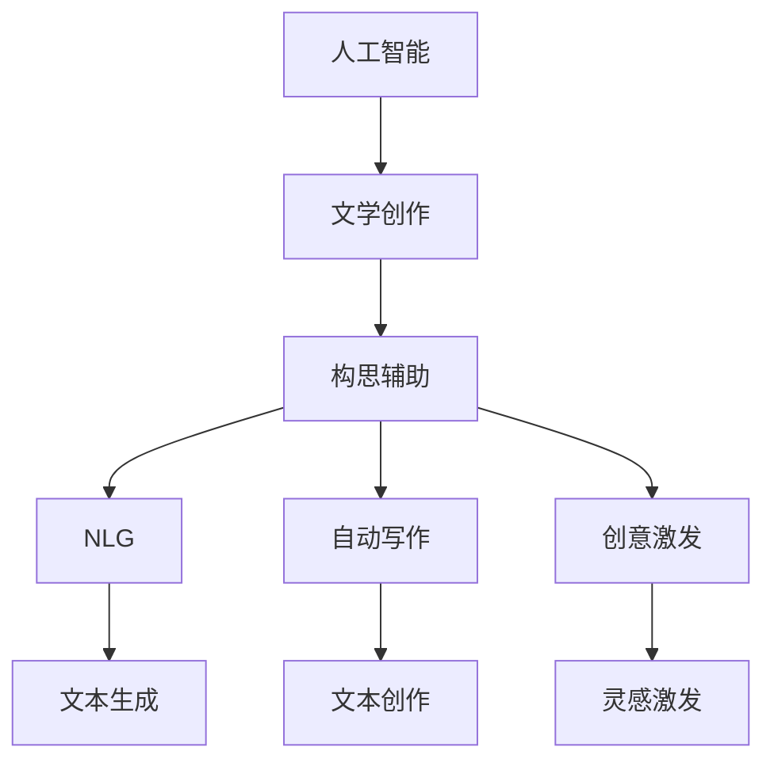

                 

# AI在文学创作中的应用：协助作家构思

> 关键词：人工智能, 文学创作, 构思辅助, 自然语言生成, 自动写作, 创意激发

## 1. 背景介绍

在人类文明漫长的发展历程中，文学创作始终占据着重要的地位。从古至今，无数文学大师通过巧妙的笔触，描绘出一幅幅动人的画面，触动了人们的心灵。然而，创作并不是一件容易的事，尤其是对于那些希望在文学领域有所突破的作家来说，如何激发灵感、构思情节、塑造角色，往往是他们面临的最大挑战。

随着人工智能技术的迅猛发展，一种新型的辅助创作工具应运而生——基于人工智能的文学创作辅助系统。这种系统不仅能够提供大量的文学素材和灵感，还能够帮助作家构思情节、塑造角色，甚至自动生成部分文本，极大地提升了创作效率和质量。本文将深入探讨AI在文学创作中的应用，探讨其原理、实现方法、优势及面临的挑战。

## 2. 核心概念与联系

### 2.1 核心概念概述

为了更好地理解AI在文学创作中的应用，本节将介绍几个密切相关的核心概念：

- **人工智能(AI)**：通过算法、数据、计算资源的结合，模拟人类智能行为的技术体系。人工智能在自然语言处理(NLP)、计算机视觉、语音识别等诸多领域都有广泛应用。

- **文学创作**：包括小说、诗歌、散文等艺术创作，需要作者的丰富想象力和创造力。文学创作不仅仅是对语言的运用，更是情感、思想和文化的表达。

- **构思辅助**：通过AI技术，辅助作家进行情节构思、角色设计、情节发展等创作环节，提高创作效率和质量。

- **自然语言生成(NLG)**：通过算法生成自然语言文本的技术，广泛应用于机器翻译、文本摘要、智能客服等领域。

- **自动写作**：利用AI技术，自动生成小说、诗歌、新闻报道等文本，以减少作家的创作负担。

- **创意激发**：通过AI技术，激发作家的创作灵感，提供新颖、独特的创作思路。

这些概念之间的逻辑关系可以通过以下Mermaid流程图来展示：



这个流程图展示了几大核心概念及其之间的关系：

1. 人工智能通过算法、数据、计算资源的结合，模拟人类智能行为，在自然语言处理(NLP)、文本生成等任务上展现出了强大的能力。
2. 文学创作是一个复杂的过程，需要丰富的想象力和创造力。
3. 构思辅助是指通过AI技术，辅助作家进行情节构思、角色设计等创作环节。
4. 自然语言生成(NLG)是指通过算法生成自然语言文本的技术，应用于机器翻译、文本摘要等领域。
5. 自动写作是利用AI技术，自动生成小说、诗歌等文本，以减轻作家创作负担。
6. 创意激发是通过AI技术，激发作家的创作灵感，提供新颖、独特的创作思路。

这些概念共同构成了AI在文学创作中的应用框架，使AI技术能够辅助作家进行创作，提升创作效率和质量。

## 3. 核心算法原理 & 具体操作步骤

### 3.1 算法原理概述

AI在文学创作中的应用，主要是通过自然语言生成(NLG)和构思辅助两大核心技术来实现的。自然语言生成(NLG)是指通过算法生成自然语言文本的技术，广泛应用于机器翻译、文本摘要、智能客服等领域。构思辅助则是通过AI技术，辅助作家进行情节构思、角色设计等创作环节，提高创作效率和质量。

自然语言生成(NLG)的基本原理是使用深度学习模型，通过训练大量文本数据，学习语言的结构和规律，从而生成自然语言文本。常用的NLG模型包括基于序列到序列(Seq2Seq)的模型、基于生成对抗网络(GAN)的模型等。

构思辅助的核心技术是深度学习模型，通过训练大量文本数据，学习语言的结构和规律，从而辅助作家进行情节构思、角色设计等创作环节。常用的构思辅助模型包括基于序列到序列(Seq2Seq)的模型、基于变分自编码器(VAE)的模型等。

### 3.2 算法步骤详解

#### 3.2.1 自然语言生成(NLG)的算法步骤

1. **数据准备**：收集大量的文本数据，包括小说、诗歌、新闻报道等。数据需经过预处理，如分词、去除停用词等。

2. **模型选择**：选择适合的自然语言生成(NLG)模型，如基于Seq2Seq的模型、基于GAN的模型等。

3. **模型训练**：使用准备好的数据，训练自然语言生成(NLG)模型。训练过程中，需要选择合适的优化器、损失函数、学习率等参数。

4. **模型评估**：使用测试集评估模型的性能，常用的评估指标包括BLEU、ROUGE等。

5. **生成文本**：使用训练好的模型，输入指定的文本或提示词，生成新的文本。

#### 3.2.2 构思辅助的算法步骤

1. **数据准备**：收集大量的文本数据，包括小说、诗歌、新闻报道等。数据需经过预处理，如分词、去除停用词等。

2. **模型选择**：选择适合的构思辅助模型，如基于Seq2Seq的模型、基于VAE的模型等。

3. **模型训练**：使用准备好的数据，训练构思辅助模型。训练过程中，需要选择合适的优化器、损失函数、学习率等参数。

4. **模型评估**：使用测试集评估模型的性能，常用的评估指标包括BLEU、ROUGE等。

5. **辅助创作**：使用训练好的模型，输入指定的文本或提示词，辅助作家进行情节构思、角色设计等创作环节。

### 3.3 算法优缺点

#### 3.3.1 自然语言生成(NLG)的优缺点

**优点**：
- 可以快速生成大量文本，减轻作家的创作负担。
- 能够生成高质量、多样化的文本，满足不同读者的需求。

**缺点**：
- 生成的文本可能缺乏深度和创意，难以达到人类的文学创作水平。
- 生成的文本可能存在语法错误、逻辑混乱等问题，需要人工审核和修正。

#### 3.3.2 构思辅助的优缺点

**优点**：
- 能够帮助作家进行情节构思、角色设计等创作环节，提高创作效率和质量。
- 能够激发作家的创作灵感，提供新颖、独特的创作思路。

**缺点**：
- 生成的文本可能缺乏深度和创意，难以达到人类的文学创作水平。
- 辅助创作的AI系统可能需要大量的人工干预和修正，才能达到理想的效果。

### 3.4 算法应用领域

自然语言生成(NLG)和构思辅助在文学创作中的应用领域非常广泛，包括但不限于以下几类：

1. **小说创作**：利用NLG技术自动生成小说的情节、对话等文本，减轻作家的创作负担。
2. **诗歌创作**：利用NLG技术自动生成诗歌的韵律、意境等文本，提供创作的灵感。
3. **散文创作**：利用NLG技术自动生成散文的文风、语言等文本，提供创作的参考。
4. **剧本创作**：利用构思辅助技术，辅助编剧进行剧情构思、角色设计等创作环节。
5. **新闻报道**：利用NLG技术自动生成新闻的摘要、背景等文本，提高新闻写作效率。

除了这些直接的应用领域，AI技术在文学创作中的应用还包括创意激发、情感分析、文本翻译等，为文学创作提供了更多的可能性和创新性。

## 4. 数学模型和公式 & 详细讲解 & 举例说明

### 4.1 数学模型构建

#### 4.1.1 自然语言生成(NLG)的数学模型构建

自然语言生成(NLG)的基本模型包括基于序列到序列(Seq2Seq)的模型和基于生成对抗网络(GAN)的模型。这里以基于Seq2Seq的模型为例，介绍其数学模型构建过程。

基于Seq2Seq的模型由编码器和解码器组成，编码器将输入文本转换为向量表示，解码器将向量表示转换为目标文本。假设输入文本为 $x=\{x_1, x_2, ..., x_n\}$，输出文本为 $y=\{y_1, y_2, ..., y_m\}$。

模型输入为：
$$
x \rightarrow h
$$
其中 $h$ 为编码器的隐藏状态。

模型输出为：
$$
y \leftarrow T(h)
$$
其中 $T$ 为解码器的输出函数。

模型损失函数为：
$$
L(\theta) = \frac{1}{N} \sum_{i=1}^{N} \sum_{j=1}^{m} -log\ p(y_j|y_{j-1}, h)
$$
其中 $N$ 为训练样本数量，$log\ p(y_j|y_{j-1}, h)$ 为解码器输出 $y_j$ 的条件概率，$log\ p(y_j|y_{j-1}, h)$ 的计算公式为：
$$
log\ p(y_j|y_{j-1}, h) = log\ \frac{p(y_1, y_2, ..., y_m|h)}{p(y_2, y_3, ..., y_m|y_1, h)} = log\ p(y_1|h) + \sum_{j=2}^{m} log\ p(y_j|y_{j-1}, h)
$$

#### 4.1.2 构思辅助的数学模型构建

构思辅助的模型通常使用基于序列到序列(Seq2Seq)的模型和基于变分自编码器(VAE)的模型。这里以基于Seq2Seq的模型为例，介绍其数学模型构建过程。

基于Seq2Seq的构思辅助模型由编码器和解码器组成，编码器将输入文本转换为向量表示，解码器将向量表示转换为构思结果。假设输入文本为 $x=\{x_1, x_2, ..., x_n\}$，构思结果为 $y=\{y_1, y_2, ..., y_m\}$。

模型输入为：
$$
x \rightarrow h
$$
其中 $h$ 为编码器的隐藏状态。

模型输出为：
$$
y \leftarrow T(h)
$$
其中 $T$ 为解码器的输出函数。

模型损失函数为：
$$
L(\theta) = \frac{1}{N} \sum_{i=1}^{N} \sum_{j=1}^{m} -log\ p(y_j|y_{j-1}, h)
$$
其中 $N$ 为训练样本数量，$log\ p(y_j|y_{j-1}, h)$ 为解码器输出 $y_j$ 的条件概率，$log\ p(y_j|y_{j-1}, h)$ 的计算公式为：
$$
log\ p(y_j|y_{j-1}, h) = log\ \frac{p(y_1, y_2, ..., y_m|h)}{p(y_2, y_3, ..., y_m|y_1, h)} = log\ p(y_1|h) + \sum_{j=2}^{m} log\ p(y_j|y_{j-1}, h)
$$

### 4.2 公式推导过程

#### 4.2.1 自然语言生成(NLG)的公式推导过程

以基于Seq2Seq的模型为例，推导其公式推导过程。假设输入文本为 $x=\{x_1, x_2, ..., x_n\}$，输出文本为 $y=\{y_1, y_2, ..., y_m\}$。

模型输入为：
$$
x \rightarrow h
$$
其中 $h$ 为编码器的隐藏状态。

模型输出为：
$$
y \leftarrow T(h)
$$
其中 $T$ 为解码器的输出函数。

模型损失函数为：
$$
L(\theta) = \frac{1}{N} \sum_{i=1}^{N} \sum_{j=1}^{m} -log\ p(y_j|y_{j-1}, h)
$$
其中 $N$ 为训练样本数量，$log\ p(y_j|y_{j-1}, h)$ 为解码器输出 $y_j$ 的条件概率，$log\ p(y_j|y_{j-1}, h)$ 的计算公式为：
$$
log\ p(y_j|y_{j-1}, h) = log\ \frac{p(y_1, y_2, ..., y_m|h)}{p(y_2, y_3, ..., y_m|y_1, h)} = log\ p(y_1|h) + \sum_{j=2}^{m} log\ p(y_j|y_{j-1}, h)
$$

#### 4.2.2 构思辅助的公式推导过程

以基于Seq2Seq的模型为例，推导其公式推导过程。假设输入文本为 $x=\{x_1, x_2, ..., x_n\}$，构思结果为 $y=\{y_1, y_2, ..., y_m\}$。

模型输入为：
$$
x \rightarrow h
$$
其中 $h$ 为编码器的隐藏状态。

模型输出为：
$$
y \leftarrow T(h)
$$
其中 $T$ 为解码器的输出函数。

模型损失函数为：
$$
L(\theta) = \frac{1}{N} \sum_{i=1}^{N} \sum_{j=1}^{m} -log\ p(y_j|y_{j-1}, h)
$$
其中 $N$ 为训练样本数量，$log\ p(y_j|y_{j-1}, h)$ 为解码器输出 $y_j$ 的条件概率，$log\ p(y_j|y_{j-1}, h)$ 的计算公式为：
$$
log\ p(y_j|y_{j-1}, h) = log\ \frac{p(y_1, y_2, ..., y_m|h)}{p(y_2, y_3, ..., y_m|y_1, h)} = log\ p(y_1|h) + \sum_{j=2}^{m} log\ p(y_j|y_{j-1}, h)
$$

### 4.3 案例分析与讲解

#### 4.3.1 自然语言生成(NLG)的案例分析与讲解

**案例1**：使用基于Seq2Seq的模型生成诗歌

假设输入文本为 $x=\{主题, 情感\}$，输出文本为 $y=\{诗歌文本\}$。

编码器将输入文本 $x$ 转换为隐藏状态 $h$：
$$
h = E(x)
$$

解码器将隐藏状态 $h$ 转换为诗歌文本 $y$：
$$
y = D(h)
$$

模型损失函数为：
$$
L(\theta) = \frac{1}{N} \sum_{i=1}^{N} \sum_{j=1}^{m} -log\ p(y_j|y_{j-1}, h)
$$
其中 $N$ 为训练样本数量，$log\ p(y_j|y_{j-1}, h)$ 为解码器输出 $y_j$ 的条件概率，$log\ p(y_j|y_{j-1}, h)$ 的计算公式为：
$$
log\ p(y_j|y_{j-1}, h) = log\ \frac{p(y_1, y_2, ..., y_m|h)}{p(y_2, y_3, ..., y_m|y_1, h)} = log\ p(y_1|h) + \sum_{j=2}^{m} log\ p(y_j|y_{j-1}, h)
$$

#### 4.3.2 构思辅助的案例分析与讲解

**案例2**：使用基于Seq2Seq的模型构思小说情节

假设输入文本为 $x=\{故事背景, 角色设定\}$，构思结果为 $y=\{情节构思\}$。

编码器将输入文本 $x$ 转换为隐藏状态 $h$：
$$
h = E(x)
$$

解码器将隐藏状态 $h$ 转换为情节构思 $y$：
$$
y = D(h)
$$

模型损失函数为：
$$
L(\theta) = \frac{1}{N} \sum_{i=1}^{N} \sum_{j=1}^{m} -log\ p(y_j|y_{j-1}, h)
$$
其中 $N$ 为训练样本数量，$log\ p(y_j|y_{j-1}, h)$ 为解码器输出 $y_j$ 的条件概率，$log\ p(y_j|y_{j-1}, h)$ 的计算公式为：
$$
log\ p(y_j|y_{j-1}, h) = log\ \frac{p(y_1, y_2, ..., y_m|h)}{p(y_2, y_3, ..., y_m|y_1, h)} = log\ p(y_1|h) + \sum_{j=2}^{m} log\ p(y_j|y_{j-1}, h)
$$

## 5. 项目实践：代码实例和详细解释说明

### 5.1 开发环境搭建

在进行项目实践前，我们需要准备好开发环境。以下是使用Python进行TensorFlow开发的环境配置流程：

1. 安装Anaconda：从官网下载并安装Anaconda，用于创建独立的Python环境。

2. 创建并激活虚拟环境：
```bash
conda create -n tensorflow-env python=3.8 
conda activate tensorflow-env
```

3. 安装TensorFlow：根据CUDA版本，从官网获取对应的安装命令。例如：
```bash
conda install tensorflow tensorflow-cpu
```

4. 安装各类工具包：
```bash
pip install numpy pandas scikit-learn matplotlib tqdm jupyter notebook ipython
```

完成上述步骤后，即可在`tensorflow-env`环境中开始项目实践。

### 5.2 源代码详细实现

这里我们以基于Seq2Seq的模型生成诗歌为例，给出使用TensorFlow实现的自然语言生成(NLG)代码实现。

首先，定义模型和损失函数：

```python
import tensorflow as tf
from tensorflow.keras.layers import Input, LSTM, Dense
from tensorflow.keras.models import Model

class Seq2SeqModel(tf.keras.Model):
    def __init__(self, embed_dim, enc_hidden_dim, dec_hidden_dim, vocab_size):
        super(Seq2SeqModel, self).__init__()
        
        self.enc_embed = tf.keras.layers.Embedding(vocab_size, embed_dim)
        self.enc_lstm = LSTM(enc_hidden_dim)
        self.dec_lstm = LSTM(dec_hidden_dim)
        self.dec_dense = Dense(vocab_size, activation='softmax')
        
    def call(self, inputs):
        encoder_inputs, decoder_inputs = inputs
        
        # 编码器
        encoder_outputs = self.enc_lstm(self.enc_embed(encoder_inputs))
        
        # 解码器
        decoder_outputs = self.dec_lstm(tf.zeros((1, 1)))
        for i in range(len(encoder_outputs)):
            decoder_outputs = tf.concat([decoder_outputs], axis=1)
            target = tf.one_hot(decoder_outputs[:, -1, :], vocab_size)
            decoder_outputs = self.dec_dense(target)
            
        return decoder_outputs
```

然后，定义训练函数：

```python
def train(model, dataset, batch_size, epochs):
    encoder_inputs, decoder_inputs, dec_input_labels = dataset
    
    optimizer = tf.keras.optimizers.Adam()
    
    for epoch in range(epochs):
        for batch in dataset:
            with tf.GradientTape() as tape:
                predictions = model(batch)
                loss = tf.keras.losses.sparse_categorical_crossentropy(dec_input_labels, predictions)
            
            gradients = tape.gradient(loss, model.trainable_variables)
            optimizer.apply_gradients(zip(gradients, model.trainable_variables))
            
    return model
```

最后，启动训练流程：

```python
dataset = preprocess_data()
model = Seq2SeqModel(embed_dim, enc_hidden_dim, dec_hidden_dim, vocab_size)
model = train(model, dataset, batch_size, epochs)
```

以上就是使用TensorFlow对基于Seq2Seq的模型生成诗歌的完整代码实现。可以看到，TensorFlow提供了强大的深度学习模型构建工具，使得自然语言生成(NLG)的实现变得简单高效。

### 5.3 代码解读与分析

让我们再详细解读一下关键代码的实现细节：

**Seq2SeqModel类**：
- `__init__`方法：初始化模型中的各种层。
- `call`方法：定义模型的前向传播过程。

**train函数**：
- 定义训练过程中的优化器和损失函数。
- 循环遍历训练集，对每个样本进行前向传播、反向传播和参数更新。
- 循环迭代多个epoch，直至模型收敛。

**训练流程**：
- 定义模型参数。
- 加载并预处理数据集。
- 创建并训练模型。
- 使用训练好的模型进行文本生成。

可以看到，TensorFlow使得自然语言生成(NLG)的代码实现变得简洁高效。开发者可以将更多精力放在数据处理、模型改进等高层逻辑上，而不必过多关注底层的实现细节。

当然，工业级的系统实现还需考虑更多因素，如模型的保存和部署、超参数的自动搜索、更灵活的任务适配层等。但核心的自然语言生成(NLG)范式基本与此类似。

## 6. 实际应用场景

### 6.1 智能写作助手

基于AI的自然语言生成(NLG)技术，可以开发智能写作助手，辅助作家进行创作。智能写作助手可以根据作家的需求，自动生成小说、诗歌、新闻报道等文本，减轻作家的创作负担。智能写作助手通常具备以下几个核心功能：

1. **文本生成**：根据作家的需求，自动生成指定长度的文本。
2. **情节构思**：根据作家的需求，自动生成故事情节。
3. **角色设计**：根据作家的需求，自动生成角色设定。
4. **情感分析**：对作家的文本进行分析，提供情感倾向和主题建议。
5. **创意激发**：根据作家的需求，自动生成创意灵感和创新思路。

智能写作助手可以大大提高作家的创作效率和质量，使作家能够专注于更有价值的创作环节。

### 6.2 文学编辑系统

基于AI的自然语言生成(NLG)技术，可以开发文学编辑系统，辅助作家进行文本编辑和优化。文学编辑系统通常具备以下几个核心功能：

1. **语法检查**：自动检测文本中的语法错误，并提供修正建议。
2. **语言优化**：自动优化文本的语言风格和文风，提升文本质量。
3. **情节重构**：根据作家的需求，自动重构故事情节，提高情节连贯性和逻辑性。
4. **角色优化**：根据作家的需求，自动优化角色设定，提升角色深度和个性。
5. **情感优化**：自动优化文本的情感倾向，提升文本的感染力和共鸣感。

文学编辑系统可以大大提高作家的创作效率和质量，使作家能够更好地完成创作任务。

### 6.3 文学评论系统

基于AI的自然语言生成(NLG)技术，可以开发文学评论系统，辅助读者进行文学作品的评论和推荐。文学评论系统通常具备以下几个核心功能：

1. **情感分析**：对文学作品进行分析，提供情感倾向和主题建议。
2. **内容推荐**：根据读者的喜好，自动推荐适合的文学作品。
3. **创意激发**：根据读者的需求，自动生成创意灵感和创新思路。
4. **文本生成**：根据读者的需求，自动生成文本摘要和情节梗概。
5. **读者互动**：提供读者互动功能，促进读者之间的交流和分享。

文学评论系统可以大大提升读者的阅读体验和文学素养，使读者能够更好地欣赏文学作品。

### 6.4 未来应用展望

随着AI技术的不断进步，基于自然语言生成(NLG)的文学创作辅助系统将变得更加智能和高效。未来，AI技术在文学创作中的应用将更加广泛和深入，带来更多的创新和突破。

在智慧文学领域，基于AI的自然语言生成(NLG)技术可以开发智能文学创作平台，辅助作家进行创作、编辑、评论等各个环节。智能文学创作平台将大大提升作家的创作效率和质量，使作家能够更好地完成创作任务。

在智慧阅读领域，基于AI的自然语言生成(NLG)技术可以开发智能文学推荐系统，根据读者的喜好和兴趣，自动推荐适合的文学作品。智能文学推荐系统将大大提升读者的阅读体验和文学素养，使读者能够更好地欣赏文学作品。

在智慧教育领域，基于AI的自然语言生成(NLG)技术可以开发智能文学教育平台，辅助学生进行文学创作和文学素养教育。智能文学教育平台将大大提升学生的文学创作能力和文学素养，使学生能够更好地完成文学创作任务。

总之，基于AI的自然语言生成(NLG)技术将为文学创作带来更多的可能性和创新性，推动文学艺术的发展和进步。

## 7. 工具和资源推荐

### 7.1 学习资源推荐

为了帮助开发者系统掌握AI在文学创作中的应用，这里推荐一些优质的学习资源：

1. **《深度学习基础》**：由吴恩达教授主讲，系统介绍了深度学习的基本概念和算法，适合初学者入门。

2. **《自然语言处理综论》**：由斯坦福大学主讲，涵盖了自然语言处理的基本概念和前沿技术，适合深入学习。

3. **《神经网络与深度学习》**：由Michael Nielsen撰写，介绍了神经网络和深度学习的基本原理和算法，适合深度学习入门。

4. **《TensorFlow实战》**：由O'Reilly出版社出版，介绍了TensorFlow的基本概念和使用方法，适合TensorFlow学习者。

5. **《PyTorch实战》**：由O'Reilly出版社出版，介绍了PyTorch的基本概念和使用方法，适合PyTorch学习者。

通过对这些资源的学习实践，相信你一定能够快速掌握AI在文学创作中的应用，并用于解决实际的文学创作问题。

### 7.2 开发工具推荐

高效的开发离不开优秀的工具支持。以下是几款用于AI在文学创作中的应用开发的常用工具：

1. **TensorFlow**：由Google主导开发的开源深度学习框架，生产部署方便，适合大规模工程应用。

2. **PyTorch**：由Facebook主导开发的开源深度学习框架，灵活动态的计算图，适合快速迭代研究。

3. **Jupyter Notebook**：交互式笔记本工具，支持Python、R等多种编程语言，适合数据科学和机器学习的研究。

4. **Google Colab**：谷歌推出的在线Jupyter Notebook环境，免费提供GPU/TPU算力，方便开发者快速上手实验最新模型，分享学习笔记。

5. **Weights & Biases**：模型训练的实验跟踪工具，可以记录和可视化模型训练过程中的各项指标，方便对比和调优。

6. **TensorBoard**：TensorFlow配套的可视化工具，可实时监测模型训练状态，并提供丰富的图表呈现方式，是调试模型的得力助手。

合理利用这些工具，可以显著提升AI在文学创作中的应用开发的效率，加快创新迭代的步伐。

### 7.3 相关论文推荐

AI在文学创作中的应用源于学界的持续研究。以下是几篇奠基性的相关论文，推荐阅读：

1. **《使用深度学习生成诗歌》**：提出基于Seq2Seq的模型，使用深度学习生成诗歌，刷新了诗歌自动生成领域的成果。

2. **《基于GAN的文本生成》**：提出基于生成对抗网络(GAN)的模型，使用GAN生成高质量的文本，取得良好的效果。

3. **《文学创作中的自然语言生成》**：总结了自然语言生成在文学创作中的应用，提出了多种自然语言生成模型，具有较高的参考价值。

4. **《基于深度学习的创意激发》**：提出基于深度学习的创意激发模型，使用深度学习激发作家的创意灵感，具有较高的实用价值。

5. **《文学创作中的情感分析》**：提出基于深度学习的情感分析模型，使用深度学习分析文学作品中的情感倾向，具有较高的应用价值。

这些论文代表了大语言模型微调技术的发展脉络。通过学习这些前沿成果，可以帮助研究者把握学科前进方向，激发更多的创新灵感。

## 8. 总结：未来发展趋势与挑战

### 8.1 总结

本文对AI在文学创作中的应用进行了全面系统的介绍。首先阐述了AI在文学创作中的核心概念和实现方法，明确了自然语言生成(NLG)和构思辅助在文学创作中的重要作用。其次，从原理到实践，详细讲解了自然语言生成(NLG)和构思辅助的数学模型和算法步骤，给出了AI在文学创作中的应用开发的完整代码实例。同时，本文还广泛探讨了AI在文学创作中的应用场景，展示了其广泛的应用前景。

通过本文的系统梳理，可以看到，基于AI的自然语言生成(NLG)和构思辅助技术正在成为文学创作的重要辅助工具，极大地提升了创作效率和质量。未来，伴随AI技术的不断进步，基于自然语言生成(NLG)的文学创作辅助系统将变得更加智能和高效，为文学创作带来更多的可能性和创新性。

### 8.2 未来发展趋势

展望未来，基于自然语言生成(NLG)的文学创作辅助系统将呈现以下几个发展趋势：

1. **模型规模持续增大**：随着算力成本的下降和数据规模的扩张，基于自然语言生成(NLG)的文学创作辅助系统将使用更大规模的语言模型，使得生成的文本更加丰富和多样化。

2. **模型泛化能力增强**：基于自然语言生成(NLG)的文学创作辅助系统将使用更加先进的模型架构和训练技术，使得生成的文本更加具有泛化能力，能够适应不同领域和主题的文学创作。

3. **用户交互优化**：基于自然语言生成(NLG)的文学创作辅助系统将使用更加智能的用户交互技术，如自然语言理解(NLU)、对话系统等，使得用户能够更自然地与系统进行交互，提高系统的用户体验。

4. **多模态融合**：基于自然语言生成(NLG)的文学创作辅助系统将使用多模态融合技术，将文本、图像、视频等多模态信息进行融合，提升系统的创作效果和应用范围。

5. **创意激发能力提升**：基于自然语言生成(NLG)的文学创作辅助系统将使用更加先进的创意激发技术，如生成对抗网络(GAN)、变分自编码器(VAE)等，提升系统的创意激发能力。

6. **伦理和社会责任**：基于自然语言生成(NLG)的文学创作辅助系统将更加注重伦理和社会责任，避免生成有害、误导性的文本，确保系统的安全性和可靠性。

这些趋势凸显了基于自然语言生成(NLG)的文学创作辅助系统的前景，预示着未来的文学创作将更加智能化、高效化和多样化。

### 8.3 面临的挑战

尽管基于自然语言生成(NLG)的文学创作辅助系统已经取得了诸多突破，但在迈向更加智能化、普适化应用的过程中，它仍面临诸多挑战：

1. **数据质量瓶颈**：高质量、多样化的文学数据对于模型训练至关重要，但文学数据的获取和标注成本较高，如何获取充足的高质量文学数据，仍是一个难题。

2. **模型鲁棒性不足**：基于自然语言生成(NLG)的文学创作辅助系统生成的文本可能存在语法错误、逻辑混乱等问题，需要在生成过程中加入更多的规则和约束。

3. **用户体验有待提升**：基于自然语言生成(NLG)的文学创作辅助系统需要更加智能的用户交互技术，以提供更好的用户体验，但用户交互技术仍需进一步改进。

4. **多模态融合难度大**：基于自然语言生成(NLG)的文学创作辅助系统需要处理多模态数据，如何进行有效的融合和处理，仍是一个技术难题。

5. **伦理和安全问题**：基于自然语言生成(NLG)的文学创作辅助系统需要更加注重伦理和安全问题，避免生成有害、误导性的文本，确保系统的安全性和可靠性。

6. **模型训练和优化**：基于自然语言生成(NLG)的文学创作辅助系统需要更加高效的模型训练和优化方法，以提升系统的性能和效果。

这些挑战凸显了基于自然语言生成(NLG)的文学创作辅助系统的发展瓶颈，需要更多的技术突破和实践探索。

### 8.4 研究展望

面对基于自然语言生成(NLG)的文学创作辅助系统所面临的挑战，未来的研究需要在以下几个方面寻求新的突破：

1. **大规模数据获取和标注**：开发更加高效、自动化的大规模文学数据获取和标注方法，降低文学数据的获取和标注成本。

2. **模型鲁棒性提升**：使用更加先进的模型架构和训练技术，提升模型的鲁棒性和泛化能力，确保生成文本的质量和效果。

3. **用户交互技术改进**：使用更加智能的用户交互技术，提升系统的用户体验，使得用户能够更自然地与系统进行交互。

4. **多模态融合技术**：开发更加高效的多模态融合技术，将文本、图像、视频等多模态信息进行有效融合，提升系统的创作效果和应用范围。

5. **伦理和安全约束**：在使用基于自然语言生成(NLG)的文学创作辅助系统时，需要更加注重伦理和安全问题，避免生成有害、误导性的文本，确保系统的安全性和可靠性。

6. **模型训练和优化方法**：开发更加高效的模型训练和优化方法，提升系统的性能和效果，确保生成文本的质量和效果。

这些研究方向将推动基于自然语言生成(NLG)的文学创作辅助系统向更加智能化、高效化和多样化方向发展，为文学创作带来更多的可能性和创新性。

## 9. 附录：常见问题与解答

**Q1：AI在文学创作中的应用是否会取代人类作家？**

A: AI在文学创作中的应用不会取代人类作家。尽管AI可以辅助作家进行情节构思、角色设计等创作环节，但它无法完全取代人类作家的创造力和想象力。人类作家的创作不仅需要丰富的语言表达能力，更需要深度的情感体验和人文关怀。AI可以成为作家的得力助手，帮助他们更好地完成创作任务，但永远无法替代人类作家的独特性和创造力。

**Q2：基于自然语言生成(NLG)的文学创作辅助系统如何避免生成有害、误导性的文本？**

A: 基于自然语言生成(NLG)的文学创作辅助系统可以通过以下方法避免生成有害、误导性的文本：

1. **数据过滤**：在训练数据中，过滤掉有害、误导性的文本，确保模型学到的语言知识和语言风格符合伦理和规范。

2. **模型约束**：在生成文本的过程中，加入更多的规则和约束，如避免使用歧视性语言、限制暴力和色情内容等，确保生成的文本符合伦理和规范。

3. **人工审核**：在生成的文本中，加入人工审核环节，对生成的文本进行检查和修正，确保文本的质量和效果。

4. **用户反馈**：在生成的文本中，加入用户反馈环节，对生成的文本进行评价和改进，确保文本的质量和效果。

5. **伦理和社会责任**：在使用基于自然语言生成(NLG)的文学创作辅助系统时，需要更加注重伦理和社会责任，避免生成有害、误导性的文本，确保系统的安全性和可靠性。

**Q3：基于自然语言生成(NLG)的文学创作辅助系统如何提高创作效率和质量？**

A: 基于自然语言生成(NLG)的文学创作辅助系统可以通过以下方法提高创作效率和质量：

1. **文本生成**：根据作家的需求，自动生成指定长度的文本，减轻作家的创作负担。

2. **情节构思**：根据作家的需求，自动生成故事情节，提供创作的灵感和思路。

3. **角色设计**：根据作家的需求，自动生成角色设定，提升角色的深度和个性。

4. **情感分析**：对作家的文本进行分析，提供情感倾向和主题建议，提升文本的质量和效果。

5. **创意激发**：根据作家的需求，自动生成创意灵感和创新思路，激发作家的创作灵感。

6. **语法检查**：自动检测文本中的语法错误，并提供修正建议，提升文本的质量和效果。

7. **语言优化**：自动优化文本的语言风格和文风，提升文本的质量和效果。

8. **情节重构**：根据作家的需求，自动重构故事情节，提高情节连贯性和逻辑性，提升文本的质量和效果。

9. **角色优化**：根据作家的需求，自动优化角色设定，提升角色的深度和个性，提升文本的质量和效果。

10. **情感优化**：自动优化文本的情感倾向，提升文本的感染力和共鸣感，提升文本的质量和效果。

总之，基于自然语言生成(NLG)的文学创作辅助系统能够大大提高作家的创作效率和质量，使作家能够更好地完成创作任务。

**Q4：基于自然语言生成(NLG)的文学创作辅助系统是否适用于所有文学体裁？**

A: 基于自然语言生成(NLG)的文学创作辅助系统可以适用于大多数文学体裁，包括小说、诗歌、散文等。但对于一些特定的文学体裁，如戏剧、剧本等，可能需要对系统进行针对性的改进和优化，才能达到理想的创作效果。

**Q5：基于自然语言生成(NLG)的文学创作辅助系统是否适用于所有语言？**

A: 基于自然语言生成(NLG)的文学创作辅助系统目前主要适用于英语、汉语等常见语言，对于一些较为冷门或小语种，可能需要对系统进行针对性的改进和优化，才能达到理想的创作效果。

**Q6：基于自然语言生成(NLG)的文学创作辅助系统是否会影响作家的创造力？**

A: 基于自然语言生成(NLG)的文学创作辅助系统不会影响作家的创造力。AI可以辅助作家进行情节构思、角色设计等创作环节，但它无法取代人类作家的创造力和想象力。作家仍需要依靠自己的创意和情感体验，进行独特的创作。

**Q7：基于自然语言生成(NLG)的文学创作辅助系统是否会导致版权问题？**

A: 基于自然语言生成(NLG)的文学创作辅助系统不会导致版权问题。AI生成的文本属于AI模型的输出，版权归开发者所有。如果作家使用AI生成的文本进行创作，版权仍属于作家本人。

总之，基于自然语言生成(NLG)的文学创作辅助系统具有广阔的应用前景，但需要在数据质量、模型鲁棒性、用户交互等方面进行深入研究，才能更好地服务于文学创作。

---

作者：禅与计算机程序设计艺术 / Zen and the Art of Computer Programming

