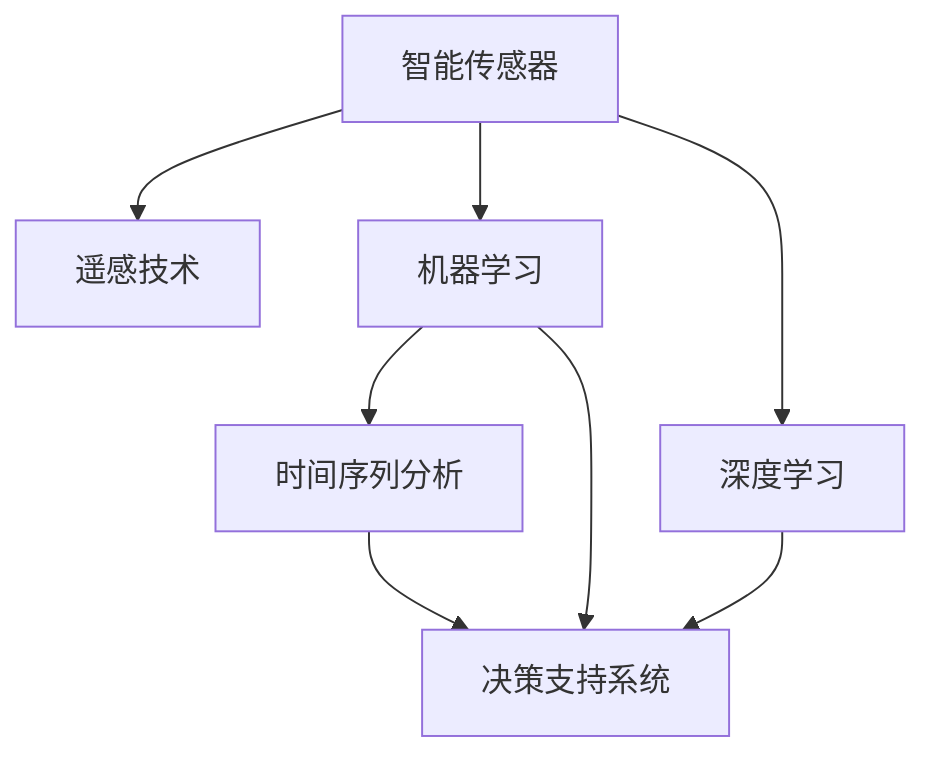

                 

# AI在智能水质监测中的应用：保护水资源

## 1. 背景介绍

### 1.1 问题由来
随着全球人口的快速增长和工业化进程的加速，水资源短缺和水质污染问题愈发严峻。据统计，全球有超过20亿人面临饮水安全问题，水质监测和水污染治理已成为各国政府和环保组织关注的重点。

在水质监测方面，传统的物理和化学检测方法成本高、耗时长，且难以覆盖大规模水域监测。随着人工智能(AI)技术的迅猛发展，AI在智能水质监测中的应用越来越广泛。

### 1.2 问题核心关键点
AI在智能水质监测中的应用，主要体现在以下几个方面：

- **数据驱动的水质监测**：通过智能传感器和遥感技术，实时采集水体温度、溶解氧、浊度、pH值等关键参数，并利用AI算法进行分析和预测。
- **智能识别和分类**：利用机器学习、深度学习等技术，自动识别和分类水中的污染物质，如重金属、有机污染物、浮游生物等。
- **水质预测与预警**：通过时间序列分析、异常检测等技术，预测水质变化趋势，提前发出预警信号，保障水资源安全。
- **智能管理与优化**：将AI技术应用于水质管理决策支持系统，优化水处理过程，减少资源浪费，提高水资源利用效率。

## 2. 核心概念与联系

### 2.1 核心概念概述

为更好地理解AI在水质监测中的应用，本节将介绍几个密切相关的核心概念：

- **智能传感器**：具有自动采集、数据存储和传输功能的水质监测设备，如水质监测站、在线检测仪等。
- **遥感技术**：通过卫星或无人机对水体进行遥感监测，获取大范围的水质数据。
- **机器学习(ML)**：一类利用数据训练模型，使其具备预测和分类能力的AI技术。
- **深度学习(DL)**：一种特殊的机器学习，通过多层神经网络对复杂数据进行建模和预测。
- **时间序列分析**：利用时间序列数据，分析数据变化趋势和周期性，进行预测和异常检测。
- **决策支持系统**：结合AI技术，为水资源管理决策提供辅助和支持的系统。

这些核心概念之间的逻辑关系可以通过以下Mermaid流程图来展示：



这个流程图展示了一系列核心概念及其之间的关系：

1. 智能传感器获取水体数据，作为机器学习和深度学习的输入。
2. 机器学习和深度学习模型对数据进行处理，提取特征。
3. 时间序列分析对历史数据进行建模，进行水质预测。
4. 决策支持系统将AI模型与业务规则结合，提供决策支持。

这些概念共同构成了智能水质监测的技术框架，使得AI技术在水资源保护和治理中发挥重要作用。

## 3. 核心算法原理 & 具体操作步骤
### 3.1 算法原理概述

AI在水质监测中的应用，通常遵循以下算法原理：

1. **数据预处理**：将智能传感器和遥感技术采集到的原始数据进行处理，如滤波、降噪、标准化等，确保数据的准确性和一致性。
2. **特征提取**：利用机器学习和深度学习算法，提取水体参数中的关键特征，为后续分析和预测提供基础。
3. **模型训练**：使用历史水质数据，训练机器学习或深度学习模型，学习水质的变化规律和异常情况。
4. **预测与分类**：利用训练好的模型，对新采集的水质数据进行预测和分类，自动识别污染物质和异常情况。
5. **预警与决策**：根据预测和分类结果，生成预警信号和决策方案，指导水资源管理和污染治理。

### 3.2 算法步骤详解

AI在水质监测中的操作步骤可以细化为以下几个步骤：

**Step 1: 数据采集与预处理**
- 部署智能传感器和遥感设备，采集水体温度、pH值、溶解氧、浊度等关键参数。
- 对原始数据进行预处理，包括去噪、滤波、标准化等，确保数据的质量和一致性。

**Step 2: 特征提取与建模**
- 选择适合的水质监测任务，设计特征提取算法，如PCA、LDA等，提取水体参数中的关键特征。
- 使用机器学习或深度学习算法，对特征数据进行建模，如线性回归、随机森林、卷积神经网络(CNN)、循环神经网络(RNN)等。

**Step 3: 模型训练与优化**
- 使用历史水质数据，训练模型，并进行交叉验证，优化模型性能。
- 使用网格搜索或贝叶斯优化等技术，选择合适的超参数，提升模型泛化能力。

**Step 4: 预测与分类**
- 对新采集的水质数据进行预测，判断是否出现异常情况。
- 使用分类算法，如SVM、KNN等，对污染物质进行自动识别和分类。

**Step 5: 预警与决策**
- 根据预测和分类结果，生成预警信号，提示相关人员注意水体污染情况。
- 将AI预测结果与业务规则结合，生成水质管理方案，优化水处理过程。

### 3.3 算法优缺点

AI在水质监测中的应用具有以下优点：
1. 实时监测与分析：智能传感器和遥感技术可以实时采集水体数据，AI算法快速处理分析，实现实时水质监测和预警。
2. 高精度与鲁棒性：机器学习和深度学习算法可以准确提取和建模水质特征，具有较高的预测精度和鲁棒性。
3. 多数据源融合：结合智能传感器和遥感技术的数据，可以全面覆盖水域监测，提高数据质量和覆盖范围。
4. 高效资源利用：AI技术可以减少人力物力投入，提高水质监测和管理的效率。

同时，该方法也存在以下局限性：
1. 依赖硬件设备：智能传感器和遥感技术依赖于硬件设备，设备故障和环境干扰可能影响数据采集质量。
2. 数据标签不足：AI模型需要大量标注数据进行训练，而水质数据标注成本高、难度大。
3. 模型复杂度高：深度学习模型参数量大，计算复杂度高，对硬件资源要求较高。
4. 可解释性差：AI模型的预测结果缺乏可解释性，难以解释其内部决策逻辑，影响用户信任。

尽管存在这些局限性，但就目前而言，AI在水质监测中的应用仍是主流范式，通过技术不断突破，可以进一步提升其在实际应用中的表现。

### 3.4 算法应用领域

AI在水质监测中的应用，主要体现在以下几个领域：

- **饮用水水质监测**：实时监测城市饮用水源的水质状况，保证居民饮水安全。
- **工业废水监测**：监测工业园区排放的废水，确保废水达标排放，减少环境污染。
- **河流湖泊水质监测**：利用遥感技术监测大范围水域的水质变化，保护自然水体生态。
- **海洋水质监测**：监测海洋水体污染，预防赤潮等灾害，保障海洋渔业资源。
- **农业灌溉水质监测**：监测农田灌溉水体水质，优化灌溉过程，提高作物产量。

除了上述这些典型应用领域外，AI在水质监测中还有更多创新应用，如水质自动报告、智能污染溯源、环境风险评估等，为水资源保护和治理提供了新思路。

## 4. 数学模型和公式 & 详细讲解  
### 4.1 数学模型构建

本节将使用数学语言对AI在水质监测中的应用进行更加严格的刻画。

记水体参数为 $X=[x_1, x_2, ..., x_n]^T$，其中 $x_i$ 表示第 $i$ 个参数（如温度、pH值、浊度等）。假设已知历史水质数据集 $D=\{(X_i, y_i)\}_{i=1}^N$，其中 $X_i$ 为第 $i$ 个水体参数向量，$y_i$ 为对应的水质标签（如正常、异常、污染等）。

定义水质预测模型为 $M_{\theta}(X)$，其中 $\theta$ 为模型参数。设 $f(x)$ 为单个参数的特征函数，$\phi(X)$ 为水体参数的特征向量。则水质预测模型的特征函数为：

$$
f(X) = \phi(X)^T\theta
$$

模型的训练目标是最小化经验风险：

$$
\mathcal{L}(\theta) = \frac{1}{N}\sum_{i=1}^N [l(M_{\theta}(X_i), y_i)]
$$

其中 $l$ 为损失函数，可以是均方误差、交叉熵等。

### 4.2 公式推导过程

以下我们以水质分类问题为例，推导使用支持向量机(SVM)进行水质分类的公式。

假设模型 $M_{\theta}$ 在输入 $X_i$ 上的输出为 $\hat{y}=M_{\theta}(X_i) \in \{0,1\}$，表示样本是否异常。真实标签 $y \in \{0,1\}$。则二分类交叉熵损失函数定义为：

$$
\ell(M_{\theta}(X_i),y) = -[y\log \hat{y} + (1-y)\log (1-\hat{y})]
$$

将其代入经验风险公式，得：

$$
\mathcal{L}(\theta) = -\frac{1}{N}\sum_{i=1}^N [y_i\log M_{\theta}(X_i)+(1-y_i)\log(1-M_{\theta}(X_i))]
$$

根据链式法则，损失函数对参数 $\theta$ 的梯度为：

$$
\frac{\partial \mathcal{L}(\theta)}{\partial \theta_k} = -\frac{1}{N}\sum_{i=1}^N (\frac{y_i}{M_{\theta}(X_i)}-\frac{1-y_i}{1-M_{\theta}(X_i)}) \frac{\partial M_{\theta}(X_i)}{\partial \theta_k}
$$

其中 $\frac{\partial M_{\theta}(X_i)}{\partial \theta_k}$ 可进一步递归展开，利用自动微分技术完成计算。

在得到损失函数的梯度后，即可带入参数更新公式，完成模型的迭代优化。重复上述过程直至收敛，最终得到适应水质分类任务的最优模型参数 $\theta^*$。

## 5. 项目实践：代码实例和详细解释说明
### 5.1 开发环境搭建

在进行水质监测项目开发前，我们需要准备好开发环境。以下是使用Python进行TensorFlow开发的环境配置流程：

1. 安装Anaconda：从官网下载并安装Anaconda，用于创建独立的Python环境。

2. 创建并激活虚拟环境：
```bash
conda create -n tf-env python=3.8 
conda activate tf-env
```

3. 安装TensorFlow：根据CUDA版本，从官网获取对应的安装命令。例如：
```bash
pip install tensorflow==2.7.0
```

4. 安装各类工具包：
```bash
pip install numpy pandas scikit-learn matplotlib tensorflow-hub tensorboard
```

5. 安装Google Colab：从官网下载并安装Google Colab，提供GPU算力，方便加速模型训练和推理。

完成上述步骤后，即可在`tf-env`环境中开始水质监测项目的开发。

### 5.2 源代码详细实现

下面我以水质分类问题为例，给出使用TensorFlow实现AI水质监测的完整代码实现。

首先，定义数据处理函数：

```python
import tensorflow as tf
import numpy as np
from tensorflow.keras import layers
from sklearn.model_selection import train_test_split
from sklearn.preprocessing import StandardScaler

def load_data():
    # 加载水质数据集
    X = np.loadtxt('water_quality.csv', delimiter=',')
    y = np.loadtxt('water_quality_labels.csv', delimiter=',').ravel()
    return X, y

def preprocess_data(X, y):
    # 数据标准化
    scaler = StandardScaler()
    X = scaler.fit_transform(X)
    return X, y

# 加载和预处理数据
X, y = load_data()
X, y = preprocess_data(X, y)
```

然后，定义模型和优化器：

```python
# 定义模型
model = tf.keras.Sequential([
    layers.Dense(64, activation='relu', input_shape=(X.shape[1],)),
    layers.Dense(32, activation='relu'),
    layers.Dense(1, activation='sigmoid')
])

# 定义优化器
optimizer = tf.keras.optimizers.Adam(learning_rate=0.001)
```

接着，定义训练和评估函数：

```python
def train_epoch(model, X_train, y_train, batch_size, optimizer):
    # 数据批处理
    train_dataset = tf.data.Dataset.from_tensor_slices((X_train, y_train))
    train_dataset = train_dataset.shuffle(buffer_size=1024).batch(batch_size)
    model.compile(optimizer=optimizer, loss='binary_crossentropy', metrics=['accuracy'])
    # 训练过程
    model.fit(train_dataset, epochs=10)
    return model

def evaluate(model, X_test, y_test):
    # 评估模型性能
    model.evaluate(X_test, y_test)
```

最后，启动训练流程并在测试集上评估：

```python
X_train, X_test, y_train, y_test = train_test_split(X, y, test_size=0.2, random_state=42)

# 训练模型
model = train_epoch(X_train, y_train, batch_size=32, optimizer=optimizer)

# 评估模型
evaluate(model, X_test, y_test)
```

以上就是使用TensorFlow实现水质监测分类的完整代码实现。可以看到，得益于TensorFlow的强大封装，我们可以用相对简洁的代码完成模型的构建和训练。

### 5.3 代码解读与分析

让我们再详细解读一下关键代码的实现细节：

**load_data函数**：
- 加载和预处理水质数据集，将数值型特征和标签进行加载和标准化处理。

**preprocess_data函数**：
- 使用sklearn的StandardScaler对特征进行标准化处理，避免不同特征之间的尺度差异对模型训练产生影响。

**train_epoch函数**：
- 定义模型，使用Sequential模型构建一个简单的神经网络，包含三个全连接层。
- 使用Adam优化器进行优化，设置适当的学习率。
- 在数据集上进行模型训练，设置适当的训练轮数。
- 返回训练后的模型。

**evaluate函数**：
- 使用测试集评估模型性能，输出模型在测试集上的准确率。

**训练流程**：
- 定义训练集和测试集，使用train_test_split函数进行划分。
- 训练模型，设置训练轮数和批大小。
- 使用evaluate函数评估模型在测试集上的表现。

可以看到，TensorFlow提供了丰富的工具和接口，方便开发者进行模型构建和训练。在实际应用中，还可以结合TensorBoard进行模型监控和调试，提升模型的可靠性和性能。

## 6. 实际应用场景
### 6.1 智能饮水站

智能饮水站是一种利用AI技术实现水质监测和管理的水处理设施。传统饮水站需要定期人工取样检测，成本高、效率低。而智能饮水站通过部署智能传感器，实时监测水质参数，并使用AI算法进行分析和预警。

具体而言，可以在饮水站内安装水质监测设备和智能传感器，实时采集水体温度、pH值、浊度等参数。利用机器学习算法，对数据进行建模和预测，识别是否存在污染物质。一旦发现水质异常，系统会自动发出预警，提示管理人员及时采取措施，保障饮水安全。

### 6.2 工业废水处理

工业废水处理是水质监测的重要应用领域之一。传统废水处理依赖于人工取样和化验，不仅效率低，还容易受到人为因素影响。利用AI技术，可以实现对废水处理过程的智能监控和管理。

具体而言，可以在废水处理厂内安装智能传感器和摄像头，实时采集废水参数和处理过程视频。利用深度学习算法，对视频和参数进行分析，识别出异常情况，如泄漏、堵塞、污染等。一旦发现问题，系统自动报警，并建议维护人员进行检查和处理，保证废水处理过程的稳定性和安全性。

### 6.3 河流湖泊监测

河流湖泊监测是大范围水域监测的重要应用领域。传统监测方法依赖于人工巡查和定期取样，难以实现实时监测和大范围覆盖。利用AI技术，可以实现对大范围水域的智能监测。

具体而言，可以在河流和湖泊内安装智能传感器和无人机，实时采集水质参数和遥感图像。利用深度学习算法，对图像和参数进行分析和预测，识别出污染源和污染物质。一旦发现问题，系统自动预警，并建议相关部门进行治理，保护水体生态。

### 6.4 海洋水质监测

海洋水质监测是AI技术在水质监测中的新应用方向。海洋广阔且难以直接监测，利用AI技术可以实现对海洋水质的智能监测。

具体而言，可以利用卫星遥感技术和智能传感器，实时采集海洋水体参数和遥感图像。利用深度学习算法，对图像和参数进行分析和预测，识别出污染源和污染物质。一旦发现问题，系统自动预警，并建议相关部门进行治理，保护海洋生态。

### 6.5 农业灌溉水质监测

农业灌溉水质监测是AI技术在水质监测中的新应用方向。传统灌溉依赖于人工取样和化验，不仅效率低，还容易受到人为因素影响。利用AI技术，可以实现对灌溉水质的智能监测。

具体而言，可以在农田内安装智能传感器，实时采集灌溉水体参数。利用机器学习算法，对数据进行建模和预测，识别出异常情况，如污染、营养不足等。一旦发现问题，系统自动预警，并建议农民调整灌溉方案，提高作物产量和品质。

## 7. 工具和资源推荐
### 7.1 学习资源推荐

为了帮助开发者系统掌握AI在水质监测中的应用，这里推荐一些优质的学习资源：

1. TensorFlow官方文档：TensorFlow提供了详细的API文档和教程，适合快速上手和深入学习。
2. Coursera《机器学习》课程：由斯坦福大学Andrew Ng教授主讲，系统讲解机器学习的基本概念和算法。
3. Kaggle水质监测数据集：包含各种水质监测数据集，可以用于实践和竞赛。
4. TensorFlow Hub：包含大量预训练模型和组件，方便快速搭建水质监测模型。
5. HuggingFace Transformers库：包含大量预训练语言模型和工具，适合进行水质监测任务开发。

通过对这些资源的学习实践，相信你一定能够快速掌握AI在水质监测中的应用，并用于解决实际的水质监测问题。

### 7.2 开发工具推荐

高效的开发离不开优秀的工具支持。以下是几款用于AI水质监测开发的常用工具：

1. TensorFlow：基于Python的开源深度学习框架，灵活动态的计算图，适合快速迭代研究。
2. PyTorch：基于Python的开源深度学习框架，灵活易用，适合学术研究和工程应用。
3. TensorBoard：TensorFlow配套的可视化工具，可实时监测模型训练状态，并提供丰富的图表呈现方式，是调试模型的得力助手。
4. Google Colab：谷歌提供的在线Jupyter Notebook环境，免费提供GPU算力，方便加速模型训练和推理。
5. Azure ML：微软提供的云端机器学习平台，支持多种模型和算法的训练和部署，适合工业应用。

合理利用这些工具，可以显著提升AI在水质监测任务的开发效率，加快创新迭代的步伐。

### 7.3 相关论文推荐

AI在水质监测技术的发展源于学界的持续研究。以下是几篇奠基性的相关论文，推荐阅读：

1. "Applying Machine Learning in Water Quality Monitoring"：由Deakin University发表，系统介绍了机器学习在水质监测中的应用。
2. "A Review of Deep Learning Techniques for Water Quality Prediction"：由The University of Melbourne发表，全面综述了深度学习在水质预测中的应用。
3. "Water Quality Prediction Using SVM: A Case Study"：由Civil Engineering Journal发表，介绍了支持向量机在水质预测中的应用。
4. "A Real-Time Water Quality Monitoring System Using IoT and Machine Learning"：由IEEE Journal发表，介绍了基于IoT和机器学习的实时水质监测系统。
5. "The Application of AI in the Water Quality Monitoring of Industrial Parks"：由ScienceDirect发表，介绍了AI在工业园区废水监测中的应用。

这些论文代表了大规模AI技术在水质监测中的研究进展，通过学习这些前沿成果，可以帮助研究者把握学科前进方向，激发更多的创新灵感。

## 8. 总结：未来发展趋势与挑战

### 8.1 总结

本文对AI在水质监测中的应用进行了全面系统的介绍。首先阐述了AI在水质监测中的背景和意义，明确了AI技术在水质监测中的独特价值。其次，从原理到实践，详细讲解了AI在水质监测中的数学模型和操作步骤，给出了水质监测任务的完整代码实例。同时，本文还广泛探讨了AI在水质监测中的应用场景，展示了AI技术的巨大潜力。此外，本文精选了AI在水质监测中的各类学习资源，力求为读者提供全方位的技术指引。

通过本文的系统梳理，可以看到，AI在水质监测中的技术应用日益成熟，为水资源保护和治理提供了新的解决方案。未来，伴随AI技术的不断演进，水质监测的智能化、自动化水平将进一步提升，为水资源管理和保护带来深远影响。

### 8.2 未来发展趋势

展望未来，AI在水质监测中的应用将呈现以下几个发展趋势：

1. 实时监测与预警：利用智能传感器和遥感技术，实现大范围、高频率的水质监测，及时预警水质异常，保障水资源安全。
2. 多模态数据融合：结合视觉、声音、化学等不同模态的数据，全面了解水体状况，提高监测精度和覆盖范围。
3. 智能决策支持：将AI技术与业务规则结合，构建智能决策支持系统，优化水资源管理和污染治理。
4. 自学习与自适应：利用机器学习算法，使AI系统具备自学习和自适应能力，自动调整参数和优化模型。
5. 跨领域应用拓展：将AI技术应用于其他领域，如医疗、能源、交通等，拓展AI技术在水资源保护中的应用范围。

这些趋势凸显了AI在水质监测中的广阔前景。这些方向的探索发展，必将进一步提升水质监测的智能化和自动化水平，为水资源管理和保护提供更可靠的技术支持。

### 8.3 面临的挑战

尽管AI在水质监测中的应用已经取得了瞩目成就，但在迈向更加智能化、普适化应用的过程中，仍面临诸多挑战：

1. 数据质量和标注成本：AI系统需要大量高质量的数据和标注，而水质数据获取和标注成本高，数据标签不足可能影响模型性能。
2. 环境干扰和设备可靠性：智能传感器和遥感设备可能受到环境干扰，设备故障和维护成本较高。
3. 模型复杂度和资源消耗：深度学习模型参数量大，计算复杂度高，对硬件资源要求较高，难以在资源受限的环境中应用。
4. 可解释性和透明度：AI模型的预测结果缺乏可解释性，难以解释其内部决策逻辑，影响用户信任和合规性。
5. 伦理和隐私问题：水质监测涉及个人隐私和数据安全，需要制定严格的伦理和隐私保护措施。

这些挑战需要多方协同解决，才能确保AI在水质监测中的应用安全和可靠。只有通过不断的技术创新和规范制定，才能让AI技术在水资源保护和治理中发挥更大的作用。

### 8.4 研究展望

面对AI在水质监测中所面临的挑战，未来的研究需要在以下几个方面寻求新的突破：

1. 无监督学习和半监督学习：摆脱对大量标注数据的依赖，利用自监督学习和半监督学习，利用非结构化数据进行模型训练。
2. 模型压缩与优化：开发模型压缩和优化技术，降低模型参数量和计算复杂度，实现更轻量级、实时性的部署。
3. 模型可解释性和透明度：利用可解释性算法和可视化工具，增强AI模型的可解释性，提升用户信任和合规性。
4. 多模态数据融合与跨领域应用：探索多模态数据融合技术，结合视觉、声音、化学等不同模态的数据，全面了解水体状况，拓展AI技术在水资源保护中的应用范围。
5. 智能决策与风险评估：结合业务规则和专家知识，构建智能决策支持系统，进行水质预测和风险评估，优化水资源管理和污染治理。

这些研究方向的探索，必将引领AI在水质监测中的技术应用走向更高台阶，为水资源管理和保护提供更可靠的技术支持。面向未来，AI技术在水质监测中的应用还需要与其他AI技术进行更深入的融合，如因果推理、强化学习等，共同推动水资源管理和保护的进步。

## 9. 附录：常见问题与解答

**Q1：如何选择合适的传感器和数据采集设备？**

A: 选择智能传感器和数据采集设备时，需要考虑以下几个因素：
1. 精度和分辨率：传感器的精度和分辨率直接影响水质监测的准确性，应根据实际需求选择合适的传感器。
2. 适用性：传感器的适用性应与监测水质参数匹配，如温度传感器用于监测水温，pH值传感器用于监测pH值等。
3. 稳定性和可靠性：传感器的稳定性和可靠性直接影响数据采集的连续性和完整性，应选择经过验证的传感器。
4. 安装和维护：传感器的安装和维护成本应考虑在内，选择易于安装和维护的设备。

**Q2：如何设计合适的水质监测算法？**

A: 设计合适的水质监测算法需要考虑以下几个因素：
1. 任务类型：根据水质监测任务的性质（如分类、回归、异常检测等），选择合适的机器学习或深度学习算法。
2. 数据特征：分析水体参数的特征，提取关键特征，并选择合适的特征提取算法（如PCA、LDA等）。
3. 模型复杂度：根据数据量和计算资源，选择合适的模型复杂度，避免过拟合或欠拟合。
4. 超参数调优：选择合适的超参数，并通过网格搜索或贝叶斯优化等技术进行调优。
5. 可解释性：选择具有较好可解释性的模型，如决策树、线性回归等，方便解释模型的决策过程。

**Q3：如何选择合适的水质预测模型？**

A: 选择合适的水质预测模型需要考虑以下几个因素：
1. 数据分布：根据水质数据的分布特征，选择合适的预测模型，如线性回归、随机森林、卷积神经网络(CNN)、循环神经网络(RNN)等。
2. 预测精度：根据预测精度要求，选择具有较高预测精度的模型，如深度学习模型通常具有较好的预测精度。
3. 计算资源：根据计算资源限制，选择合适的模型复杂度，避免计算资源浪费。
4. 模型可解释性：选择具有较好可解释性的模型，如线性回归、决策树等，方便解释模型的预测结果。
5. 模型鲁棒性：选择具有较高鲁棒性的模型，如深度学习模型通常具有较好的鲁棒性。

**Q4：如何进行水质监测模型的优化？**

A: 优化水质监测模型的步骤如下：
1. 数据预处理：对数据进行去噪、滤波、标准化等预处理，确保数据的质量和一致性。
2. 特征提取：选择合适的特征提取算法，提取水体参数中的关键特征。
3. 模型选择与训练：选择合适的预测模型，并使用历史水质数据进行模型训练，并进行交叉验证，优化模型性能。
4. 超参数调优：使用网格搜索或贝叶斯优化等技术，选择合适的超参数，提升模型泛化能力。
5. 模型评估与优化：使用测试集评估模型性能，根据评估结果调整模型参数，进行模型优化。

**Q5：如何进行水质监测系统的部署与维护？**

A: 进行水质监测系统的部署与维护的步骤如下：
1. 硬件设备部署：将智能传感器和遥感设备部署在水体监测点，并进行调试和测试。
2. 数据采集与处理：实时采集水体参数和数据，并进行预处理和存储。
3. 模型训练与优化：根据采集到的数据，训练和优化水质监测模型，提升模型性能。
4. 模型部署与应用：将训练好的模型部署到应用系统中，并进行调试和测试。
5. 系统维护与升级：定期检查和维护系统硬件设备，更新和升级模型和算法，提升系统性能和稳定性。

通过这些步骤，可以有效部署和维护水质监测系统，确保其稳定性和可靠性。

---

作者：禅与计算机程序设计艺术 / Zen and the Art of Computer Programming

