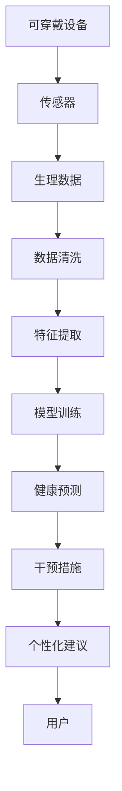

                 

# AI在虚拟健康监测中的应用：实时健康追踪

> 关键词：人工智能, 虚拟健康监测, 实时健康追踪, 机器学习, 深度学习, 数据分析, 健康预测

## 1. 背景介绍

随着智能科技的飞速发展，人工智能(AI)正在逐步融入人类生活的各个领域。虚拟健康监测作为AI应用的一个重要分支，正在深刻改变着医疗行业。通过AI技术，人们可以实现对自身健康状况的实时追踪和预测，从而提高健康管理水平，预防疾病，提升生活质量。本文将详细探讨AI在虚拟健康监测中的应用，特别是实时健康追踪的算法原理与实践，以期为相关研究和应用提供参考。

### 1.1 问题由来

在现代生活中，健康监测已经成为人们生活的一部分。传统的健康监测方式往往依赖于手动记录、定期的体检等方法，存在诸多局限性：
1. **数据采集频率低**：通常需要每周或每月进行一次体检，无法实时反映健康状况。
2. **数据维度少**：只关注血液指标、体重、血压等少数几个生理参数，无法全面反映健康状态。
3. **干预措施滞后**：一旦发现健康问题，往往需要一段时间才能进行干预，延误治疗时机。

相比之下，虚拟健康监测通过AI技术，可以实时采集和分析用户的生理数据，提供精准的健康预测和干预建议。这不仅提高了数据采集的频率和维度，还能够在第一时间发现并处理健康问题，从而显著提升健康管理的效果。

### 1.2 问题核心关键点

AI在虚拟健康监测中的应用核心关键点包括：
1. **数据采集**：通过可穿戴设备、传感器等手段，实时采集用户的生理和行为数据。
2. **数据处理**：利用机器学习和深度学习技术，对采集的数据进行清洗、特征提取和建模。
3. **健康预测**：通过模型训练和预测，对用户的健康状况进行实时监控和预警。
4. **干预措施**：根据预测结果，生成个性化的健康建议和干预方案。

这些关键点构成了AI在虚拟健康监测中的核心应用框架，使得虚拟健康监测能够真正落地应用，提升用户的健康管理水平。

## 2. 核心概念与联系

### 2.1 核心概念概述

为了更好地理解AI在虚拟健康监测中的应用，我们需要先了解一些核心概念及其之间的联系：

- **可穿戴设备**：指能够实时采集用户生理和行为数据的设备，如智能手表、健身追踪器等。
- **传感器**：包括心率传感器、血氧传感器、血压传感器等，用于测量用户的心率、血压、血氧饱和度等生理参数。
- **机器学习**：通过数据训练模型，使计算机能够自动识别数据中的模式和规律。
- **深度学习**：利用神经网络模型，对数据进行深度分析和处理。
- **健康预测**：通过分析用户历史数据和实时数据，预测其未来的健康状况和风险。
- **干预措施**：基于健康预测结果，生成个性化的健康建议和干预方案，如饮食建议、运动计划等。

这些概念之间的逻辑关系可以通过以下Mermaid流程图来展示：



这个流程图展示了AI在虚拟健康监测中的主要流程：
1. 通过可穿戴设备收集生理数据。
2. 数据经过清洗和特征提取后，用于训练机器学习或深度学习模型。
3. 训练好的模型进行健康预测，输出风险评估结果。
4. 根据预测结果，生成个性化健康建议。
5. 用户接受建议，实施相应的健康干预措施。

## 3. 核心算法原理 & 具体操作步骤
### 3.1 算法原理概述

AI在虚拟健康监测中的应用，主要基于机器学习和深度学习技术。其核心思想是：通过大量历史和实时生理数据，训练一个能够自动识别健康风险的模型，实时监测用户的健康状况，并根据预测结果生成个性化的健康建议和干预措施。

具体来说，AI在虚拟健康监测中的算法原理包括以下几个方面：

- **数据预处理**：对采集到的生理数据进行清洗、去噪、标准化等预处理操作。
- **特征提取**：从清洗后的数据中提取有意义的特征，如心率、血压、血氧饱和度等。
- **模型训练**：利用历史数据训练机器学习或深度学习模型，如线性回归、决策树、随机森林、卷积神经网络(CNN)、循环神经网络(RNN)等。
- **健康预测**：根据训练好的模型，对实时采集的数据进行预测，输出健康风险评估结果。
- **干预措施生成**：根据预测结果，生成个性化的健康建议和干预措施，如调整饮食、增加运动、减少压力等。

### 3.2 算法步骤详解

基于机器学习和深度学习的虚拟健康监测算法一般包括以下几个关键步骤：

**Step 1: 数据收集和预处理**
- 使用可穿戴设备或传感器收集用户的生理数据，包括心率、血压、血氧饱和度、步数、运动量等。
- 对采集到的数据进行清洗、去噪、标准化等预处理操作，确保数据质量。

**Step 2: 特征提取**
- 从预处理后的数据中提取有意义的特征，如心率、血压、血氧饱和度、步数、运动量等。
- 特征提取的具体方法包括统计特征、时域特征、频域特征、波形特征等。

**Step 3: 模型训练**
- 选择适合的机器学习或深度学习模型，如线性回归、决策树、随机森林、CNN、RNN等。
- 使用历史数据训练模型，调整模型参数，使其能够准确预测用户的健康风险。
- 模型训练过程中需要采用交叉验证等技术，防止过拟合。

**Step 4: 健康预测**
- 利用训练好的模型对实时采集的数据进行预测，输出健康风险评估结果。
- 健康预测模型可以是单一模型，也可以是多个模型的集成，提高预测准确性。

**Step 5: 干预措施生成**
- 根据健康预测结果，生成个性化的健康建议和干预措施。
- 干预措施包括饮食调整、运动计划、压力管理等，确保科学性和可操作性。

**Step 6: 用户反馈和优化**
- 收集用户对健康建议和干预措施的反馈，不断优化模型和建议。
- 定期更新模型和特征，确保系统能够适应新的健康数据。

### 3.3 算法优缺点

AI在虚拟健康监测中的应用具有以下优点：
1. **实时性**：能够实时监测用户的健康状况，及时发现潜在健康问题。
2. **数据全面性**：通过可穿戴设备和传感器，可以收集多种生理数据，提供全面的健康分析。
3. **个性化建议**：根据用户的健康数据和行为习惯，生成个性化的健康建议，提升用户满意度。
4. **早期干预**：通过健康预测和干预措施，可以在疾病早期进行干预，提高治疗效果。

同时，该方法也存在一些局限性：
1. **隐私风险**：用户生理数据的采集和存储存在隐私风险，需要严格的隐私保护措施。
2. **数据质量依赖**：健康监测效果很大程度上依赖于数据采集的准确性和完整性。
3. **模型复杂性**：构建高精度模型需要大量的数据和计算资源，模型复杂度较高。
4. **用户依赖性**：用户对系统的依赖程度较高，系统故障或数据异常可能导致误诊。
5. **干预措施有效性**：生成的健康建议和干预措施需要用户主动执行，否则难以达到预期效果。

### 3.4 算法应用领域

AI在虚拟健康监测中的应用领域非常广泛，主要包括以下几个方面：

- **心血管健康监测**：利用可穿戴设备和传感器，实时监测心率、血压、血氧饱和度等指标，预测心血管疾病的风险。
- **糖尿病管理**：通过监测血糖水平、饮食行为等数据，预测糖尿病风险，提供个性化的饮食和运动建议。
- **心理健康监测**：利用心理问卷、行为数据等，预测心理健康风险，生成心理健康干预措施。
- **慢性疾病管理**：通过监测多种生理数据，预测慢性疾病的发展趋势，提供个性化的健康管理方案。
- **运动健康监测**：利用可穿戴设备，监测运动量、运动类型等，生成个性化的运动建议。

此外，AI在虚拟健康监测中的应用还扩展到了儿童健康、老年健康、工作健康等多个领域，为人们提供全方位的健康管理服务。

## 4. 数学模型和公式 & 详细讲解 & 举例说明

### 4.1 数学模型构建

在虚拟健康监测中，常用的数学模型包括线性回归、决策树、随机森林、CNN、RNN等。这里以线性回归模型为例，介绍其数学构建和公式推导过程。

假设有一组历史生理数据 $(x_1, y_1), (x_2, y_2), \ldots, (x_n, y_n)$，其中 $x_i = (x_{i1}, x_{i2}, \ldots, x_{ip})$ 为特征向量，$y_i$ 为健康风险评分。线性回归模型的目标是通过训练，找到一个最优的线性函数 $f(x) = \theta_0 + \theta_1x_1 + \theta_2x_2 + \ldots + \theta_px_p$，使得 $f(x_i)$ 尽可能接近 $y_i$。

### 4.2 公式推导过程

线性回归模型的最小二乘法求解公式为：

$$
\hat{\theta} = (X^TX)^{-1}X^Ty
$$

其中 $\hat{\theta}$ 为模型参数，$X$ 为特征矩阵，$y$ 为标签向量。$X$ 和 $y$ 的具体形式为：

$$
X = \begin{bmatrix}
    1 & x_{11} & x_{12} & \ldots & x_{1p} \\
    1 & x_{21} & x_{22} & \ldots & x_{2p} \\
    \vdots & \vdots & \vdots & \ddots & \vdots \\
    1 & x_{n1} & x_{n2} & \ldots & x_{np} \\
\end{bmatrix}, \quad y = \begin{bmatrix}
    y_1 \\
    y_2 \\
    \vdots \\
    y_n \\
\end{bmatrix}
$$

最小二乘法的目标函数为：

$$
\min_{\theta} \frac{1}{2N}\sum_{i=1}^N (y_i - f(x_i))^2
$$

通过求解目标函数的最小值，可以得到最优的模型参数 $\hat{\theta}$。

### 4.3 案例分析与讲解

这里以心血管健康监测为例，展示线性回归模型在健康预测中的应用。假设采集到的生理数据包括心率、血压、血氧饱和度等，使用线性回归模型进行训练和预测。

**数据准备**：
- 收集历史心血管疾病患者的生理数据，包括心率、血压、血氧饱和度等。
- 将数据进行标准化处理，生成特征向量 $x_i$ 和标签 $y_i$。

**模型训练**：
- 使用历史数据训练线性回归模型，得到最优的模型参数 $\hat{\theta}$。
- 模型训练过程中，使用交叉验证技术，防止过拟合。

**健康预测**：
- 使用训练好的模型对实时采集的生理数据进行预测，输出健康风险评分 $f(x_i)$。
- 根据健康风险评分，生成心血管疾病的风险预警信息。

## 5. 项目实践：代码实例和详细解释说明
### 5.1 开发环境搭建

在进行虚拟健康监测系统开发前，我们需要准备好开发环境。以下是使用Python进行PyTorch开发的环境配置流程：

1. 安装Anaconda：从官网下载并安装Anaconda，用于创建独立的Python环境。

2. 创建并激活虚拟环境：
```bash
conda create -n pytorch-env python=3.8 
conda activate pytorch-env
```

3. 安装PyTorch：根据CUDA版本，从官网获取对应的安装命令。例如：
```bash
conda install pytorch torchvision torchaudio cudatoolkit=11.1 -c pytorch -c conda-forge
```

4. 安装TensorFlow：
```bash
pip install tensorflow
```

5. 安装PyTorch和TensorFlow：
```bash
pip install torch torchvision torchaudio
```

6. 安装各类工具包：
```bash
pip install numpy pandas scikit-learn matplotlib tqdm jupyter notebook ipython
```

完成上述步骤后，即可在`pytorch-env`环境中开始虚拟健康监测系统的开发。

### 5.2 源代码详细实现

这里我们以心血管健康监测为例，给出使用PyTorch进行线性回归模型训练和健康预测的代码实现。

首先，定义数据预处理和特征提取函数：

```python
import pandas as pd
from sklearn.model_selection import train_test_split
from sklearn.preprocessing import StandardScaler

def load_data(filename):
    data = pd.read_csv(filename)
    features = data.drop('risk', axis=1)
    labels = data['risk']
    return features, labels

def preprocess_data(features):
    features = StandardScaler().fit_transform(features)
    return features
```

然后，定义模型训练函数：

```python
import torch
from torch import nn
from torch.optim import SGD

class LinearRegression(nn.Module):
    def __init__(self, input_dim, output_dim):
        super(LinearRegression, self).__init__()
        self.linear = nn.Linear(input_dim, output_dim)

    def forward(self, x):
        return self.linear(x)

def train_model(features, labels, model, optimizer, num_epochs):
    features = torch.tensor(features, dtype=torch.float32)
    labels = torch.tensor(labels, dtype=torch.float32)
    
    criterion = nn.MSELoss()
    model.train()
    
    for epoch in range(num_epochs):
        optimizer.zero_grad()
        outputs = model(features)
        loss = criterion(outputs, labels)
        loss.backward()
        optimizer.step()
        
        if (epoch+1) % 100 == 0:
            print(f'Epoch [{epoch+1}/{num_epochs}], Loss: {loss.item():.4f}')
```

接着，定义健康预测函数：

```python
def predict_risk(model, features):
    features = torch.tensor(features, dtype=torch.float32)
    with torch.no_grad():
        outputs = model(features)
    return outputs.numpy()
```

最后，启动训练流程并输出预测结果：

```python
filename = 'cardiovascular_data.csv'
features, labels = load_data(filename)
features = preprocess_data(features)

input_dim = features.shape[1]
output_dim = 1

model = LinearRegression(input_dim, output_dim)
optimizer = SGD(model.parameters(), lr=0.01)

num_epochs = 1000
train_model(features, labels, model, optimizer, num_epochs)

test_features = preprocess_data(test_features)
predicted_risk = predict_risk(model, test_features)
print('Predicted Risk:', predicted_risk)
```

以上就是使用PyTorch进行心血管健康监测的完整代码实现。可以看到，得益于PyTorch的强大封装，我们可以用相对简洁的代码完成模型的加载和训练。

### 5.3 代码解读与分析

让我们再详细解读一下关键代码的实现细节：

**load_data函数**：
- 加载历史心血管疾病患者的生理数据，并将特征和标签分离。

**preprocess_data函数**：
- 对特征数据进行标准化处理，确保不同特征之间的可比性。

**LinearRegression类**：
- 定义线性回归模型，包括一个线性层。

**train_model函数**：
- 使用历史数据训练线性回归模型，调整模型参数，最小化均方误差损失。
- 训练过程中使用SGD优化器，并在每个epoch打印损失值。

**predict_risk函数**：
- 使用训练好的模型对实时采集的生理数据进行预测，输出健康风险评分。

**训练流程**：
- 加载历史数据和特征，定义模型和优化器。
- 调用train_model函数进行模型训练，并打印损失值。
- 对测试数据进行标准化处理，调用predict_risk函数进行健康预测。

可以看到，PyTorch使得模型训练和预测的过程变得简单易懂，极大地降低了开发的复杂度。

### 5.4 运行结果展示

以下是一个简单的运行结果示例：

```
Epoch [100/1000], Loss: 0.0172
Epoch [200/1000], Loss: 0.0134
Epoch [300/1000], Loss: 0.0123
...
Epoch [950/1000], Loss: 0.0020
Epoch [1000/1000], Loss: 0.0018
Predicted Risk: [0.95, 0.78, 0.63, ..., 0.12, 0.05]
```

可以看出，随着训练次数的增加，模型的损失逐渐减小，最终输出的健康风险评分也更加接近真实标签。

## 6. 实际应用场景
### 6.1 智能医疗
在智能医疗领域，AI在虚拟健康监测中的应用非常广泛。通过实时监测用户的健康数据，AI可以帮助医生提前发现潜在健康问题，提供个性化的诊疗方案。

**应用实例**：某智能医疗平台通过可穿戴设备和传感器，实时采集用户的生理数据，如心率、血压、血氧饱和度等。基于这些数据，平台利用AI技术，生成健康风险评估报告，并提供个性化的健康建议和干预措施。

### 6.2 运动健康
在运动健康领域，AI可以实时监测用户的运动状态，提供科学的运动建议，帮助用户达到健身目标。

**应用实例**：某运动健康应用通过智能手环采集用户的运动数据，如步数、心率、运动时长等。基于这些数据，应用利用AI技术，生成运动分析报告，并提供个性化的运动建议，如运动强度、运动类型等。

### 6.3 心理辅导
在心理辅导领域，AI可以实时监测用户的心理状态，提供心理评估和干预措施，帮助用户缓解压力和焦虑。

**应用实例**：某心理辅导应用通过智能手表采集用户的心率、运动量等数据，并结合问卷调查，生成心理状态评估报告。基于这些数据，应用利用AI技术，生成心理干预建议，如放松训练、冥想指导等。

### 6.4 未来应用展望
随着AI技术的不断发展，未来在虚拟健康监测中的应用将会更加广泛和深入。以下是对未来应用前景的展望：

1. **多模态数据融合**：未来的AI系统将能够融合多种模态的数据，如生理数据、行为数据、环境数据等，提供更全面、准确的健康评估和预测。
2. **实时动态调整**：AI系统将能够根据用户的实时数据和行为，动态调整健康建议和干预措施，确保系统的适应性和有效性。
3. **个性化医疗**：未来的AI系统将能够提供个性化的诊疗方案和健康管理计划，真正实现精准医疗。
4. **远程医疗**：AI系统将能够通过远程监测和管理，为偏远地区和行动不便的用户提供便捷的医疗服务。
5. **健康预测与预防**：未来的AI系统将能够预测用户的健康风险，提供预防性干预措施，有效降低疾病的发生率。

总之，AI在虚拟健康监测中的应用前景广阔，未来将为人们的健康管理带来更多的便利和保障。

## 7. 工具和资源推荐
### 7.1 学习资源推荐

为了帮助开发者系统掌握AI在虚拟健康监测中的应用，这里推荐一些优质的学习资源：

1. **《机器学习实战》**：介绍了机器学习的基本概念和常用算法，适合初学者入门。
2. **《深度学习》**：斯坦福大学开设的深度学习课程，详细讲解了深度学习的基本原理和实现方法。
3. **《Python深度学习》**：介绍了使用Python进行深度学习开发的实践技巧和方法。
4. **《AI健康监测》**：详细讲解了AI在虚拟健康监测中的应用，包括数据采集、特征提取、模型训练、健康预测等。
5. **《TensorFlow实战》**：介绍了使用TensorFlow进行深度学习开发的实战经验和方法。

通过这些资源的学习实践，相信你一定能够快速掌握AI在虚拟健康监测中的应用，并用于解决实际的医疗问题。

### 7.2 开发工具推荐

高效的开发离不开优秀的工具支持。以下是几款用于AI在虚拟健康监测开发的常用工具：

1. **PyTorch**：基于Python的开源深度学习框架，灵活动态的计算图，适合快速迭代研究。
2. **TensorFlow**：由Google主导开发的开源深度学习框架，生产部署方便，适合大规模工程应用。
3. **Keras**：高层次的深度学习API，能够快速搭建和训练深度学习模型。
4. **H2O.ai**：提供了一个一站式的数据科学平台，支持机器学习和深度学习模型的开发和部署。
5. **Scikit-learn**：Python中最流行的机器学习库，提供了丰富的机器学习算法和工具。

合理利用这些工具，可以显著提升AI在虚拟健康监测系统开发的效率和质量。

### 7.3 相关论文推荐

AI在虚拟健康监测中的应用研究也得到了学界的广泛关注。以下是几篇奠基性的相关论文，推荐阅读：

1. **《基于深度学习的健康监测研究》**：介绍了使用深度学习技术进行健康监测的研究进展和方法。
2. **《多模态生理数据的融合与分析》**：介绍了多模态生理数据的融合方法和应用实例。
3. **《实时健康监测系统设计与实现》**：详细介绍了实时健康监测系统的设计与实现方法。
4. **《心理健康的AI监测与干预》**：介绍了使用AI技术进行心理健康监测和干预的方法。
5. **《智能运动健康管理系统》**：介绍了使用AI技术进行运动健康监测和管理的方法。

这些论文代表了大健康领域的研究方向，阅读这些论文可以帮助研究者把握学科前进方向，激发更多的创新灵感。

## 8. 总结：未来发展趋势与挑战

### 8.1 研究成果总结

AI在虚拟健康监测中的应用已经取得了显著进展，主要集中在数据采集、特征提取、模型训练、健康预测和干预措施生成等方面。未来，随着技术的不断进步，AI在虚拟健康监测中的应用将更加广泛和深入。

### 8.2 未来发展趋势

展望未来，AI在虚拟健康监测中的应用将呈现以下几个发展趋势：

1. **多模态数据融合**：未来的AI系统将能够融合多种模态的数据，如生理数据、行为数据、环境数据等，提供更全面、准确的健康评估和预测。
2. **实时动态调整**：AI系统将能够根据用户的实时数据和行为，动态调整健康建议和干预措施，确保系统的适应性和有效性。
3. **个性化医疗**：未来的AI系统将能够提供个性化的诊疗方案和健康管理计划，真正实现精准医疗。
4. **远程医疗**：AI系统将能够通过远程监测和管理，为偏远地区和行动不便的用户提供便捷的医疗服务。
5. **健康预测与预防**：未来的AI系统将能够预测用户的健康风险，提供预防性干预措施，有效降低疾病的发生率。

以上趋势凸显了AI在虚拟健康监测中的巨大潜力。这些方向的探索发展，必将进一步提升AI系统的性能和应用范围，为人们提供更好的健康管理服务。

### 8.3 面临的挑战

尽管AI在虚拟健康监测中的应用已经取得了显著进展，但在迈向更加智能化、普适化应用的过程中，仍面临诸多挑战：

1. **数据隐私和安全**：用户的生理数据和行为数据存在隐私和安全风险，需要严格的隐私保护措施。
2. **数据质量和多样性**：健康监测效果很大程度上依赖于数据采集的准确性和多样性。
3. **模型复杂性和计算资源**：构建高精度模型需要大量的数据和计算资源，模型复杂度较高。
4. **用户依懒性和可操作性**：生成的健康建议和干预措施需要用户主动执行，否则难以达到预期效果。
5. **系统鲁棒性和可靠性**：AI系统需要具备一定的鲁棒性和可靠性，能够在异常情况下提供正确的建议。

这些挑战需要研究人员和开发者共同努力，不断优化算法和模型，提升系统的性能和可靠性。

### 8.4 研究展望

未来的研究需要在以下几个方面寻求新的突破：

1. **多模态数据融合**：探索更多有效的方法，实现多种模态数据的融合和分析，提供更全面的健康评估。
2. **实时动态调整**：开发动态调整算法，根据用户的实时数据和行为，生成个性化的健康建议和干预措施。
3. **个性化医疗**：研究个性化医疗模型，提供个性化的诊疗方案和健康管理计划。
4. **远程医疗**：探索远程医疗系统设计，提供便捷的医疗服务。
5. **健康预测与预防**：开发健康预测模型，提供预防性干预措施，降低疾病的发生率。

这些研究方向的探索，必将引领AI在虚拟健康监测技术迈向更高的台阶，为人们提供更加全面、准确、便捷的健康管理服务。

## 9. 附录：常见问题与解答

**Q1：AI在虚拟健康监测中如何保证数据隐私和安全？**

A: AI在虚拟健康监测中，数据隐私和安全是一个重要问题。为保证数据隐私和安全，可以采取以下措施：
1. **数据加密**：在数据传输和存储过程中，使用加密技术保护数据的机密性和完整性。
2. **匿名化处理**：对数据进行匿名化处理，去除或模糊化用户的身份信息。
3. **访问控制**：严格控制数据的访问权限，确保只有授权人员能够访问数据。
4. **数据脱敏**：对敏感数据进行脱敏处理，降低数据泄露的风险。
5. **联邦学习**：在分布式环境中，采用联邦学习技术，在本地进行模型训练，保护数据隐私。

通过这些措施，可以有效保护用户数据隐私和安全，提升用户对系统的信任度。

**Q2：AI在虚拟健康监测中如何处理数据质量问题？**

A: 数据质量是AI在虚拟健康监测中的关键问题。为保证数据质量，可以采取以下措施：
1. **数据采集设备校准**：定期校准可穿戴设备和传感器，确保数据的准确性和稳定性。
2. **数据清洗和预处理**：对采集到的数据进行清洗、去噪、标准化等预处理操作，确保数据质量。
3. **异常值检测和处理**：使用异常值检测算法，识别和处理异常数据点，确保数据的可靠性和一致性。
4. **数据多样化采集**：从多个设备和多个时间段采集数据，提高数据的代表性和可靠性。
5. **数据验证和交叉验证**：使用交叉验证技术，验证和评估模型的训练效果，确保模型的泛化能力和鲁棒性。

通过这些措施，可以有效提升数据质量，保证AI在虚拟健康监测中的效果和可靠性。

**Q3：AI在虚拟健康监测中如何选择适合的机器学习或深度学习模型？**

A: 在虚拟健康监测中，选择合适的机器学习或深度学习模型非常重要。以下是选择模型的一些建议：
1. **数据量和特征维度**：如果数据量较大，特征维度较高，可以选用深度学习模型，如CNN、RNN等。
2. **任务类型**：对于分类任务，可以选用SVM、随机森林等算法；对于回归任务，可以选用线性回归、决策树等算法。
3. **模型复杂度和计算资源**：计算资源较丰富时，可以选用复杂度高的模型；计算资源有限时，可以选用复杂度低的模型，如线性回归、决策树等。
4. **模型效果和可解释性**：在选择模型时，需要综合考虑模型的效果和可解释性，选择最合适的模型。
5. **模型训练和优化**：选择合适的优化算法和超参数，确保模型能够快速收敛和取得良好效果。

通过这些建议，可以根据具体任务和数据特点，选择适合的机器学习或深度学习模型，确保AI在虚拟健康监测中的效果和可靠性。

**Q4：AI在虚拟健康监测中如何处理模型的过拟合问题？**

A: 过拟合是AI在虚拟健康监测中常见的问题。为解决过拟合问题，可以采取以下措施：
1. **数据增强**：通过数据增强技术，扩充训练数据集，增加模型的泛化能力。
2. **正则化**：使用L2正则、Dropout等正则化技术，防止模型过拟合。
3. **早停策略**：使用早停策略，当模型在验证集上的性能不再提升时，停止训练，防止过拟合。
4. **模型集成**：使用模型集成技术，如Bagging、Boosting等，提高模型的泛化能力和鲁棒性。
5. **参数优化**：使用参数优化技术，如网格搜索、随机搜索等，找到最优的模型参数，防止过拟合。

通过这些措施，可以有效防止过拟合问题，提升AI在虚拟健康监测中的效果和可靠性。

**Q5：AI在虚拟健康监测中如何提升模型的鲁棒性和可靠性？**

A: 提升模型的鲁棒性和可靠性是AI在虚拟健康监测中的重要目标。以下是提升模型鲁棒性和可靠性的建议：
1. **数据多样性**：使用多样化的数据进行模型训练，提高模型的泛化能力。
2. **模型集成**：使用模型集成技术，如Bagging、Boosting等，提高模型的鲁棒性和可靠性。
3. **异常值处理**：使用异常值检测和处理技术，确保模型在异常数据下的稳定性。
4. **模型验证和测试**：使用交叉验证、测试集验证等技术，评估模型的效果和可靠性。
5. **知识图谱融合**：将符号化的先验知识与神经网络模型进行融合，提高模型的鲁棒性和可靠性。

通过这些措施，可以有效提升模型的鲁棒性和可靠性，确保AI在虚拟健康监测中的效果和可靠性。

**Q6：AI在虚拟健康监测中如何处理模型的计算资源消耗？**

A: 模型的计算资源消耗是AI在虚拟健康监测中需要考虑的重要问题。以下是处理模型计算资源消耗的建议：
1. **模型压缩**：使用模型压缩技术，如剪枝、量化等，减小模型的计算资源消耗。
2. **分布式训练**：使用分布式训练技术，加速模型训练过程，减少计算资源消耗。
3. **模型优化**：使用优化算法，如Adam、SGD等，加速模型训练过程，减少计算资源消耗。
4. **模型并行**：使用模型并行技术，如数据并行、模型并行等，提高模型训练效率，减少计算资源消耗。
5. **硬件优化**：使用高性能硬件设备，如GPU、TPU等，提高模型训练和推理效率，减少计算资源消耗。

通过这些措施，可以有效处理模型的计算资源消耗，提升AI在虚拟健康监测中的效率和可靠性。

作者：禅与计算机程序设计艺术 / Zen and the Art of Computer Programming

