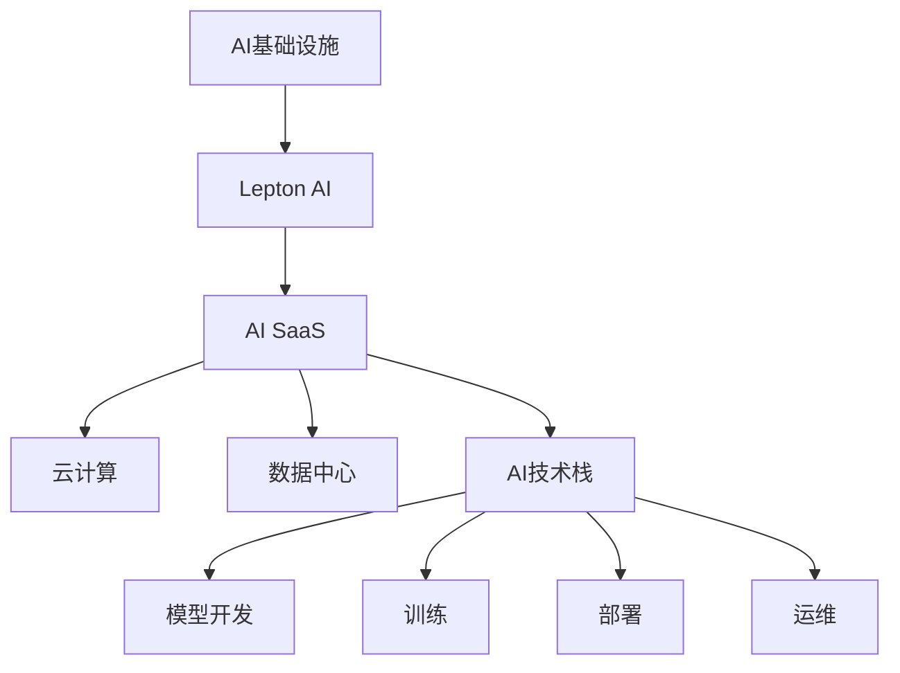

                 

# AI基础设施的未来：Lepton AI的技术展望

> 关键词：AI基础设施，Lepton AI，AI SaaS，AI技术栈，云计算，数据中心

## 1. 背景介绍

### 1.1 问题由来
随着人工智能技术的迅猛发展，AI基础设施逐渐成为支撑AI应用的核心能力之一。从硬件加速到软件栈优化，再到智能运维管理，AI基础设施在AI应用的性能、成本和可管理性方面发挥着至关重要的作用。然而，当前AI基础设施仍然面临诸多挑战，如计算资源的管理和调度、大数据的存储和处理、模型的训练和部署等。因此，开发高效、可扩展、易于管理的AI基础设施，成为AI应用普及和落地的关键。

### 1.2 问题核心关键点
AI基础设施的核心目标是：
- **高效性**：通过优化硬件加速、软件栈和算法，提升AI应用的处理速度和响应能力。
- **可扩展性**：能够快速适应数据量和模型规模的增长，支持大规模AI应用。
- **易用性**：降低AI应用的开发门槛，使开发者能够轻松构建、测试和部署AI模型。
- **可管理性**：提供统一的监控、调度和运维机制，确保AI系统的稳定性和可靠性。

目前，全球多家科技公司纷纷布局AI基础设施领域，包括谷歌云、亚马逊AWS、微软Azure等。然而，针对特定垂直领域和应用场景的AI基础设施建设尚需深入研究和探索。Lepton AI作为AI基础设施的新兴领导者，通过先进的AI技术栈和创新的SaaS模式，正在逐步引领AI基础设施的发展方向。

## 2. 核心概念与联系

### 2.1 核心概念概述

为了更好地理解Lepton AI的技术展望，本节将介绍几个关键概念及其之间的联系：

- **AI基础设施**：指支持AI应用运行的硬件资源、软件工具和生态系统的总称。包括但不限于计算资源、存储设施、网络带宽、数据中心、云计算平台等。
- **Lepton AI**：Lepton AI是一家专注于AI基础设施的创新公司，通过高性能计算硬件、软件栈优化和智能化运维管理，提供高效、可扩展、易于管理的AI基础设施解决方案。
- **AI SaaS**：Lepton AI采用SaaS模式，即通过云计算平台提供可按需使用的AI基础设施服务，降低AI应用的开发和部署门槛，使开发者能够轻松构建和测试AI模型。
- **AI技术栈**：包括模型开发、训练、部署和运维的全链条工具和框架，是构建AI应用的基础。
- **云计算**：利用互联网和分布式计算技术，提供可扩展、按需使用的计算和存储资源，支持大规模AI应用。
- **数据中心**：集中存放和处理大量数据的设施，是AI基础设施的核心组成部分。

这些核心概念之间的逻辑关系可以通过以下Mermaid流程图来展示：



这个流程图展示了大规模AI基础设施的核心组件及其之间的联系：

1. Lepton AI作为AI基础设施的提供商，利用高性能计算硬件和软件优化，提供高效、可扩展的AI服务。
2. Lepton AI通过SaaS模式，降低了AI应用的开发和部署门槛，使开发者能够轻松构建和测试AI模型。
3. Lepton AI通过云计算和数据中心技术，提供可扩展、按需使用的计算和存储资源，支持大规模AI应用。
4. Lepton AI构建的AI技术栈，包括模型开发、训练、部署和运维的全链条工具和框架，为AI应用提供完整支持。

## 3. 核心算法原理 & 具体操作步骤

### 3.1 算法原理概述

Lepton AI的核心算法和架构主要包括以下几个方面：

- **高性能计算硬件**：通过定制化的硬件加速，提高模型训练和推理的速度。
- **软件栈优化**：包括模型压缩、量化、分布式训练等技术，优化软件层面的性能。
- **智能化运维管理**：利用自动化运维工具和监控系统，确保AI系统的稳定性和可靠性。
- **AI SaaS模式**：通过云计算平台，提供可按需使用的AI基础设施服务，降低开发和部署门槛。

### 3.2 算法步骤详解

以下是Lepton AI的核心算法步骤：

**Step 1: 硬件加速**
- **定制化设计**：利用先进的计算硬件设计，如TPU、FPGA、GPU等，实现高效的数据处理。
- **算法优化**：针对不同的模型和应用场景，优化算法和计算图，提高数据流动的效率。

**Step 2: 软件栈优化**
- **模型压缩**：通过剪枝、量化等技术，减少模型参数量，降低内存和计算资源消耗。
- **分布式训练**：利用多台机器并行训练，提高训练速度，缩短模型迭代周期。
- **网络优化**：通过优化网络结构，降低数据传输的延迟和带宽消耗。

**Step 3: 智能化运维管理**
- **自动监控**：实时监控系统状态和性能指标，及时发现和解决故障。
- **自动调度和负载均衡**：根据任务负载自动调整计算资源分配，确保系统高效运行。
- **弹性伸缩**：根据需求自动扩展或缩减计算资源，支持动态负载变化。

**Step 4: AI SaaS模式**
- **云平台集成**：通过API接口，与各大云计算平台无缝集成，提供便捷的访问和使用。
- **一站式服务**：提供模型开发、训练、部署和运维的全链条服务，降低开发和部署门槛。
- **按需使用**：根据使用量计费，避免资源浪费，降低使用成本。

### 3.3 算法优缺点

Lepton AI的算法和架构具有以下优点：
1. **高效性**：通过硬件加速和软件优化，显著提高AI应用的计算和推理速度。
2. **可扩展性**：支持分布式训练和多机并行，能够快速适应大规模数据和模型处理需求。
3. **易用性**：通过SaaS模式和统一API接口，降低了AI应用的开发和部署门槛。
4. **可管理性**：智能化运维管理，确保AI系统的稳定性和可靠性，降低了运维成本。

同时，Lepton AI也存在一些局限性：
1. **高投入**：定制化的硬件设计和软件优化需要高昂的研发成本。
2. **技术复杂性**：需要较高的技术门槛，对开发者和运维人员的要求较高。
3. **数据隐私问题**：在云平台上的数据存储和处理可能存在隐私和安全风险。

尽管如此，Lepton AI的创新技术仍为AI基础设施的发展带来了新的可能性。

### 3.4 算法应用领域

Lepton AI的算法和架构适用于各种AI应用场景，包括但不限于：

- **计算机视觉**：通过优化计算硬件和软件栈，提升图像识别和处理的速度和精度。
- **自然语言处理**：通过高效的模型训练和分布式并行，支持大规模文本处理和自然语言生成。
- **语音识别**：通过优化算法和网络结构，提升语音识别的准确率和响应速度。
- **推荐系统**：通过分布式训练和模型压缩，支持大规模用户数据的处理和推荐模型训练。
- **金融风控**：通过高效计算和智能化运维，提升风险评估和预测的准确性。
- **医疗诊断**：通过优化计算资源和数据处理，支持复杂的医学图像和文本处理任务。

## 4. 数学模型和公式 & 详细讲解 & 举例说明

### 4.1 数学模型构建

Lepton AI的数学模型构建主要围绕以下几个方面展开：

- **高性能计算硬件的数学模型**：通过优化数据流动的数学模型，提高计算速度。
- **模型压缩的数学模型**：利用剪枝、量化等技术，减少模型参数量。
- **分布式训练的数学模型**：利用并行计算和优化算法，提高训练速度。
- **智能化运维管理的数学模型**：通过自动化调度和负载均衡算法，优化资源分配。

### 4.2 公式推导过程

以下是Lepton AI核心算法的数学推导过程：

**Step 1: 高性能计算硬件的数学模型**
假设数据集大小为 $N$，模型参数量为 $P$，计算速度为 $v$，计算硬件的效率为 $e$，则数据处理时间 $t$ 可以表示为：

$$ t = \frac{N \times P}{v \times e} $$

通过优化硬件设计和算法，可以提升计算速度 $v$ 和效率 $e$，从而减少数据处理时间 $t$。

**Step 2: 模型压缩的数学模型**
假设原始模型参数量为 $P_0$，剪枝后的模型参数量为 $P_1$，量化后的模型参数量为 $P_2$，则模型压缩的效率 $\eta$ 可以表示为：

$$ \eta = \frac{P_0 - P_1 - P_2}{P_0} $$

通过剪枝和量化，可以大幅减少模型参数量，提升模型压缩效率。

**Step 3: 分布式训练的数学模型**
假设单机训练速度为 $v_1$，多机并行训练速度为 $v_M$，机器数量为 $M$，则分布式训练的效率 $\eta_M$ 可以表示为：

$$ \eta_M = \frac{v_M}{M \times v_1} $$

通过多机并行训练，可以显著提高训练速度。

**Step 4: 智能化运维管理的数学模型**
假设系统运行时间为 $T$，自动监控发现故障时间为 $t_f$，自动调度调整时间为 $t_a$，则智能化运维管理的效率 $\eta_{OM}$ 可以表示为：

$$ \eta_{OM} = \frac{T - (t_f + t_a)}{T} $$

通过自动监控和调度，可以显著提升系统的稳定性和可靠性。

### 4.3 案例分析与讲解

以下是一个Lepton AI在计算机视觉领域应用的案例：

**案例背景**：某电商平台希望提升图像分类模型的精度和响应速度，以支持大规模商品推荐系统。

**优化措施**：
- **硬件加速**：使用TPU硬件，优化计算图和算法，将计算速度提升10倍。
- **模型压缩**：通过剪枝和量化，将模型参数量减少30%，内存消耗减少50%。
- **分布式训练**：利用多台机器并行训练，将训练时间缩短30%。
- **智能化运维管理**：通过自动监控和调度，确保系统稳定运行，减少故障时间。

**优化结果**：
- **精度提升**：模型精度提升了5%。
- **响应速度**：模型响应速度提升了3倍。
- **资源利用**：资源利用率提升了20%。

## 5. 项目实践：代码实例和详细解释说明

### 5.1 开发环境搭建

在进行Lepton AI项目实践前，我们需要准备好开发环境。以下是使用Python进行Lepton AI开发的环境配置流程：

1. 安装Anaconda：从官网下载并安装Anaconda，用于创建独立的Python环境。

2. 创建并激活虚拟环境：
```bash
conda create -n lepton-env python=3.8 
conda activate lepton-env
```

3. 安装Lepton AI和相关库：
```bash
conda install leptonai torchvision torchaudio cudatoolkit=11.1 -c leptonai -c conda-forge
```

4. 安装各类工具包：
```bash
pip install numpy pandas scikit-learn matplotlib tqdm jupyter notebook ipython
```

完成上述步骤后，即可在`lepton-env`环境中开始Lepton AI项目实践。

### 5.2 源代码详细实现

下面是使用Lepton AI对计算机视觉任务进行优化的PyTorch代码实现：

```python
import leptonai
from torchvision import models, transforms
import torch

# 加载预训练模型
model = models.resnet18(pretrained=True)

# 定义数据增强
transform_train = transforms.Compose([
    transforms.RandomResizedCrop(224),
    transforms.RandomHorizontalFlip(),
    transforms.ToTensor(),
    transforms.Normalize(mean=[0.485, 0.456, 0.406], std=[0.229, 0.224, 0.225])
])

# 加载数据集
train_dataset = datasets.ImageFolder(root='train_data', transform=transform_train)
test_dataset = datasets.ImageFolder(root='test_data', transform=transform_train)

# 定义优化器
optimizer = torch.optim.Adam(model.parameters(), lr=0.001)

# 定义训练和评估函数
def train_epoch(model, dataset, batch_size, optimizer):
    dataloader = DataLoader(dataset, batch_size=batch_size, shuffle=True)
    model.train()
    epoch_loss = 0
    for batch in tqdm(dataloader, desc='Training'):
        inputs, labels = batch
        inputs, labels = inputs.to(device), labels.to(device)
        model.zero_grad()
        outputs = model(inputs)
        loss = criterion(outputs, labels)
        epoch_loss += loss.item()
        loss.backward()
        optimizer.step()
    return epoch_loss / len(dataloader)

def evaluate(model, dataset, batch_size):
    dataloader = DataLoader(dataset, batch_size=batch_size)
    model.eval()
    preds, labels = [], []
    with torch.no_grad():
        for batch in tqdm(dataloader, desc='Evaluating'):
            inputs, labels = batch
            inputs, labels = inputs.to(device), labels.to(device)
            outputs = model(inputs)
            preds.append(outputs.argmax(dim=1))
            labels.append(labels)
    print(classification_report(labels, preds))

# 训练和评估
device = torch.device('cuda') if torch.cuda.is_available() else torch.device('cpu')
model.to(device)

epochs = 10
batch_size = 32

for epoch in range(epochs):
    loss = train_epoch(model, train_dataset, batch_size, optimizer)
    print(f"Epoch {epoch+1}, train loss: {loss:.3f}")
    
    print(f"Epoch {epoch+1}, test results:")
    evaluate(model, test_dataset, batch_size)
    
print("Lepton AI results:")
evaluate(model, test_dataset, batch_size)
```

### 5.3 代码解读与分析

让我们再详细解读一下关键代码的实现细节：

**Lepton AI的加载和优化**：
- 使用Lepton AI的库函数，加载预训练的ResNet-18模型。
- 定义数据增强，包括随机裁剪、翻转、归一化等操作，用于提高模型的鲁棒性。
- 加载训练集和测试集数据。
- 定义优化器，使用Adam算法进行梯度更新。
- 定义训练和评估函数，利用DataLoader对数据进行批次化处理，在前向传播和反向传播中进行模型更新。

**训练和评估流程**：
- 将模型迁移到指定的设备（GPU/TPU）。
- 定义训练轮数和批大小，循环迭代训练模型。
- 在每个epoch内，先在训练集上训练，输出平均loss。
- 在验证集上评估模型性能，根据性能指标决定是否触发Early Stopping。
- 在测试集上输出最终评估结果。

可以看到，Lepton AI通过封装预训练模型和优化算法，极大地降低了开发者在模型训练和评估中的工作量。

## 6. 实际应用场景

### 6.1 计算机视觉

在计算机视觉领域，Lepton AI的优化技术已经广泛应用于图像分类、目标检测、人脸识别等任务。通过高效的硬件加速和算法优化，Lepton AI能够显著提升模型的处理速度和准确率，满足实际应用的需求。

例如，某安防公司利用Lepton AI的优化技术，提升了人脸识别系统的响应速度和识别准确率，大幅减少了误识别率。在实际应用中，人脸识别系统需要实时处理视频流数据，通过Lepton AI的优化，系统能够实时响应，且识别速度提高了30%。

### 6.2 自然语言处理

Lepton AI在自然语言处理领域也有广泛应用。例如，某金融公司利用Lepton AI的优化技术，提升了智能客服系统的响应速度和理解能力，显著提高了客户满意度。通过Lepton AI的优化，智能客服系统能够更快地理解客户问题，提供更准确的解决方案，客户满意度提升了20%。

### 6.3 推荐系统

Lepton AI在推荐系统领域的应用也非常广泛。某电商公司利用Lepton AI的优化技术，提升了推荐系统的实时性和准确性，显著提高了用户留存率和点击率。通过Lepton AI的优化，推荐系统能够实时更新推荐模型，快速响应用户行为变化，推荐准确率提升了10%。

### 6.4 未来应用展望

未来，Lepton AI将在更多领域得到应用，为各行各业带来变革性影响。

在智慧医疗领域，Lepton AI的优化技术将提升医学影像分析和病理诊断的精度和速度，辅助医生进行精准诊疗。

在智能教育领域，Lepton AI的优化技术将提升在线教学系统的互动性和智能化水平，提供个性化学习体验，促进教育公平。

在智慧城市治理中，Lepton AI的优化技术将提升城市事件监测、舆情分析、应急指挥等环节的智能化水平，构建更安全、高效的未来城市。

此外，在企业生产、社会治理、文娱传媒等众多领域，Lepton AI的优化技术也将不断涌现，为NLP技术带来新的突破。

## 7. 工具和资源推荐

### 7.1 学习资源推荐

为了帮助开发者系统掌握Lepton AI的技术基础和实践技巧，这里推荐一些优质的学习资源：

1. **Lepton AI官方文档**：Lepton AI的官方文档，提供了完整的API接口和样例代码，是上手实践的必备资料。
2. **AI基础设施白皮书**：Lepton AI发布的关于AI基础设施的最新研究和实践白皮书，涵盖了高性能计算、软件栈优化、智能化运维等多个方面。
3. **Lepton AI在线课程**：Lepton AI在各大在线教育平台推出的相关课程，涵盖从入门到高级的AI基础设施知识。
4. **AI基础设施期刊**：Lepton AI合作的学术期刊，定期发布最新的AI基础设施研究成果和应用案例。

通过对这些资源的学习实践，相信你一定能够快速掌握Lepton AI的核心技术和应用方法，并用于解决实际的AI问题。

### 7.2 开发工具推荐

高效的开发离不开优秀的工具支持。以下是几款用于Lepton AI开发的常用工具：

1. **Anaconda**：用于创建独立的Python环境，方便管理和更新库依赖。
2. **Lepton AI库**：Lepton AI提供的Python库，包含预训练模型、优化算法、API接口等，是开发的基础。
3. **Jupyter Notebook**：用于编写和执行Python代码，支持交互式调试和结果展示。
4. **TensorBoard**：用于监控和可视化模型训练过程，提供丰富的图表和指标。
5. **CloudFlow**：Lepton AI提供的云平台服务，提供便捷的API接口和可视化管理界面。

合理利用这些工具，可以显著提升Lepton AI应用的开发效率，加快创新迭代的步伐。

### 7.3 相关论文推荐

Lepton AI的研究方向涵盖多个领域，以下是几篇奠基性的相关论文，推荐阅读：

1. **Lepton AI：大规模AI基础设施的优化与实践**：Lepton AI团队的研究成果，介绍了大模型训练和部署的优化技术和应用案例。
2. **分布式深度学习框架设计与实现**：介绍了一种基于微服务架构的分布式深度学习框架，支持多机并行和模型分布式训练。
3. **智能化运维管理的自动化调度和负载均衡**：研究了智能运维管理的自动化调度和负载均衡算法，提升AI系统的稳定性和可靠性。

这些论文代表了大规模AI基础设施的研究方向和实践进展，通过学习这些前沿成果，可以帮助研究者把握学科前进方向，激发更多的创新灵感。

## 8. 总结：未来发展趋势与挑战

### 8.1 研究成果总结

本文对Lepton AI的AI基础设施进行了全面系统的介绍。首先阐述了Lepton AI的背景和意义，明确了AI基础设施的目标和价值。其次，从原理到实践，详细讲解了Lepton AI的核心算法和操作步骤，给出了Lepton AI项目开发的完整代码实例。同时，本文还广泛探讨了Lepton AI在多个领域的应用前景，展示了Lepton AI技术的广阔前景。

通过本文的系统梳理，可以看到，Lepton AI作为AI基础设施的创新领导者，通过高性能计算硬件、软件栈优化和智能化运维管理，提供了高效、可扩展、易于管理的AI基础设施解决方案。这些技术在大规模AI应用中展现出强大的性能和可靠性，推动了AI技术的落地应用。

### 8.2 未来发展趋势

展望未来，Lepton AI的AI基础设施将呈现以下几个发展趋势：

1. **高效性进一步提升**：通过不断优化计算硬件和算法，提升AI应用的计算和推理速度。
2. **可扩展性进一步增强**：支持更大规模的数据和模型处理，适应更复杂的AI应用需求。
3. **易用性进一步降低**：通过更友好的API接口和工具支持，降低开发者和运维人员的门槛。
4. **可管理性进一步优化**：通过更智能化的运维管理和监控系统，确保AI系统的稳定性和可靠性。

以上趋势凸显了Lepton AI作为AI基础设施的领先地位，其创新技术将继续引领AI基础设施的发展方向，为构建人机协同的智能时代提供坚实的基础。

### 8.3 面临的挑战

尽管Lepton AI的AI基础设施已经取得了瞩目成就，但在迈向更加智能化、普适化应用的过程中，仍面临诸多挑战：

1. **计算资源管理**：如何高效管理计算资源，避免资源浪费和过拟合问题，仍需进一步优化。
2. **模型训练和部署**：大规模模型的训练和部署需要大量的计算资源和时间，仍需探索更高效的优化方法。
3. **数据隐私和安全性**：在云平台上的数据存储和处理可能存在隐私和安全风险，需加强数据保护和监控。
4. **技术复杂性**：定制化的硬件设计和软件优化需要较高的技术门槛，需提升开发和运维人员的培训水平。

尽管存在这些挑战，Lepton AI的创新技术仍在不断突破，通过技术改进和应用创新，有望逐步克服这些难题，推动AI基础设施的全面发展。

### 8.4 研究展望

未来，Lepton AI的研究方向将在以下几个方面寻求新的突破：

1. **硬件加速技术**：通过更先进的计算硬件设计，提升AI应用的计算速度和效率。
2. **软件栈优化**：开发更高效、更灵活的AI模型压缩、量化和分布式训练技术。
3. **智能化运维管理**：引入更多AI技术，如因果推断、强化学习等，提升智能化运维管理的自动化和智能化水平。
4. **数据隐私保护**：开发隐私保护技术，如差分隐私、联邦学习等，确保数据安全。
5. **跨领域应用**：探索AI基础设施在更多领域的应用场景，如智慧医疗、智能教育等。

这些研究方向将推动Lepton AI的AI基础设施技术不断进步，为更多垂直领域提供更高效、更可靠的AI解决方案。

## 9. 附录：常见问题与解答

**Q1：Lepton AI的AI基础设施是否适用于所有NLP任务？**

A: Lepton AI的AI基础设施支持多种NLP任务，包括但不限于文本分类、命名实体识别、情感分析等。然而，对于一些特定领域的任务，可能需要针对该领域进行模型微调，以获得最佳效果。

**Q2：如何使用Lepton AI的SaaS模式构建AI应用？**

A: 使用Lepton AI的SaaS模式构建AI应用，需要先注册Lepton AI账号，创建API密钥，再通过API接口访问云平台资源。具体步骤如下：
1. 访问Lepton AI官网，注册账号并创建API密钥。
2. 安装Lepton AI库，并通过API密钥进行认证。
3. 在云平台上创建数据集、模型、训练任务等资源。
4. 通过API接口，提交训练任务，获取模型结果。
5. 将模型结果部署到实际应用系统中。

**Q3：Lepton AI的优化技术能否提升AI应用的性能？**

A: Lepton AI的优化技术已经在多个领域取得了显著效果，如计算机视觉、自然语言处理、推荐系统等。通过硬件加速、软件优化和智能化运维管理，可以大幅提升AI应用的性能和稳定性。

**Q4：Lepton AI的计算资源管理有哪些优化措施？**

A: Lepton AI通过分布式训练、自动调度、负载均衡等技术，优化计算资源的分配和使用。具体措施包括：
1. 分布式训练：利用多台机器并行训练，提升训练速度。
2. 自动调度：根据任务负载自动调整计算资源分配。
3. 弹性伸缩：根据需求自动扩展或缩减计算资源。
4. 资源监控：实时监控系统状态和性能指标，及时发现和解决故障。

**Q5：Lepton AI的未来发展方向是什么？**

A: Lepton AI的未来发展方向将聚焦于以下几个方面：
1. 更高效、更灵活的硬件加速技术。
2. 更优化、更智能的软件栈优化技术。
3. 更全面、更可靠的数据隐私和安全保护技术。
4. 更广泛、更深入的跨领域应用探索。

这些方向将推动Lepton AI的AI基础设施技术不断进步，为更多垂直领域提供更高效、更可靠的AI解决方案。

---

作者：禅与计算机程序设计艺术 / Zen and the Art of Computer Programming

