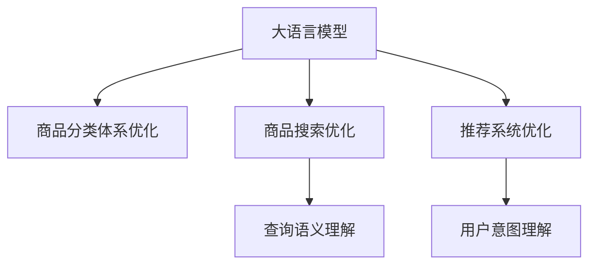

                 

# AI大模型在商品分类体系优化中的应用

> 关键词：大语言模型, 商品分类体系优化, 自然语言处理, 商品搜索, 推荐系统

## 1. 背景介绍

### 1.1 问题由来
随着电商行业的快速发展，商品分类体系的优化变得越来越重要。一个结构合理、层次分明、逻辑清晰的分类体系，有助于提高商品搜索的效率和准确性，优化推荐系统的精准度，提升用户购物体验。然而，构建和维护一个高效的分类体系，往往需要大量的人力物力，且随着商品种类的不断增多，分类体系也变得越来越复杂和庞大。

为了应对这一挑战，近年来，许多电商企业开始探索利用AI技术，特别是大语言模型，来优化商品分类体系。大语言模型通过在海量文本数据上进行预训练，学习到了丰富的语言知识和常识，能够高效地理解和处理自然语言，为商品分类体系的构建和优化提供了新的思路和方法。

### 1.2 问题核心关键点
大语言模型在商品分类体系优化中的应用主要集中在以下几个方面：

- **自动分类文本标注**：利用大语言模型对商品描述、标签等文本数据进行自动标注和分类，减少人工标注成本。
- **构建层次化分类体系**：通过文本分析和语义理解，自动识别商品之间的层次关系，构建出层次化的分类结构。
- **优化推荐系统**：利用大语言模型对商品进行语义理解和特征提取，优化推荐算法，提高推荐系统的效果。
- **实时查询优化**：通过自然语言处理技术，对用户查询进行语义理解，实现快速、准确的商品搜索。

这些问题核心的关键点在于如何高效利用大语言模型进行文本处理和语义理解，以及如何基于这些理解构建和优化商品分类体系。

### 1.3 问题研究意义
大语言模型在商品分类体系优化中的应用，对于电商企业的运营效率、用户体验以及市场竞争力提升具有重要意义：

- **降低成本**：自动分类和标注技术减少了人工标注成本，提高工作效率。
- **提升精准度**：基于语义理解的分类体系和推荐算法，可以更精准地满足用户需求。
- **增强体验**：通过自然语言处理技术，实现实时、智能的搜索和推荐，提升用户购物体验。
- **灵活扩展**：层次化的分类体系可以根据需要进行灵活扩展和调整，适应商品的快速增长。

## 2. 核心概念与联系

### 2.1 核心概念概述

为更好地理解大语言模型在商品分类体系优化中的应用，本节将介绍几个关键概念：

- **大语言模型(Large Language Model, LLM)**：以自回归(如GPT)或自编码(如BERT)模型为代表的大规模预训练语言模型。通过在大规模无标签文本语料上进行预训练，学习通用的语言表示，具备强大的语言理解和生成能力。

- **商品分类体系**：将商品按照某种规则或逻辑进行层次化的划分，形成分类树或标签体系。分类体系合理清晰，有助于商品搜索、推荐、库存管理等电商运营活动。

- **商品搜索**：用户通过查询商品名称、描述、标签等文本信息，获取到相关商品的过程。高质量的商品搜索能够提升用户购物体验，增加电商平台的销售额。

- **推荐系统**：根据用户的历史行为、偏好、实时查询等信息，推荐相关商品或服务，以增加用户粘性、提升转化率。高效的推荐系统能够显著提升电商平台的销售效率。

- **自然语言处理(NLP)**：利用计算机技术对自然语言文本进行处理和分析，包括文本分类、实体识别、语义理解等任务。NLP技术在大语言模型中的应用，为商品分类体系优化提供了技术基础。

这些核心概念之间的逻辑关系可以通过以下Mermaid流程图来展示：



这个流程图展示了大语言模型在商品分类体系优化中的应用场景，以及其与其他核心概念之间的联系。

## 3. 核心算法原理 & 具体操作步骤
### 3.1 算法原理概述

大语言模型在商品分类体系优化中的核心算法原理基于自然语言处理技术，主要包括文本分类、实体识别、语义理解等步骤。其基本流程如下：

1. **预训练模型加载**：选择预训练大语言模型，如BERT、GPT-2等，并将其加载到计算平台。
2. **文本预处理**：对商品描述、标签等文本数据进行分词、去除停用词、标准化等预处理操作。
3. **文本标注**：利用大语言模型对商品文本进行自动分类和标注，得到文本类别和语义特征。
4. **构建分类体系**：基于文本分类结果，构建商品分类体系，并进行层次化处理。
5. **推荐系统优化**：结合商品分类体系，优化推荐算法，提高推荐系统的效果。
6. **实时查询优化**：对用户查询进行语义理解，实现快速、准确的商品搜索。

### 3.2 算法步骤详解

#### 3.2.1 预训练模型加载

首先，我们需要选择一个预训练大语言模型，并将其加载到计算平台。以BERT模型为例，可以使用以下代码进行加载：

```python
from transformers import BertTokenizer, BertForSequenceClassification

# 加载BERT模型
tokenizer = BertTokenizer.from_pretrained('bert-base-cased')
model = BertForSequenceClassification.from_pretrained('bert-base-cased', num_labels=len(tag2id))
```

#### 3.2.2 文本预处理

文本预处理包括分词、去除停用词、标准化等操作，以提高模型的处理效率和准确性。可以使用以下代码进行文本预处理：

```python
from nltk.corpus import stopwords
from nltk.tokenize import word_tokenize

# 定义停用词列表
stop_words = set(stopwords.words('english'))

# 定义文本预处理函数
def preprocess_text(text):
    # 分词
    tokens = word_tokenize(text.lower())
    # 去除停用词
    tokens = [token for token in tokens if token not in stop_words]
    # 标准化
    tokens = [token if token.isalpha() else '' for token in tokens]
    return ' '.join(tokens)
```

#### 3.2.3 文本标注

文本标注利用大语言模型对商品文本进行自动分类和标注，得到文本类别和语义特征。可以使用以下代码进行文本标注：

```python
# 定义标注函数
def annotate_text(text):
    # 分词和标准化
    tokens = preprocess_text(text)
    # 编码
    encoding = tokenizer(tokens, return_tensors='pt')
    # 前向传播
    with torch.no_grad():
        outputs = model(**encoding)
    # 获取分类得分
    scores = outputs.logits
    # 选择最高得分对应的类别
    label = scores.argmax().item()
    return label, scores.argmax(-1).tolist()
```

#### 3.2.4 构建分类体系

构建分类体系是将商品文本标注结果进行层次化处理，形成分类树或标签体系的过程。可以使用以下代码进行分类体系构建：

```python
# 定义分类体系构建函数
def build_classification_system(annots, categories):
    # 将文本标注结果按类别统计
    category_counts = {cat: sum(annots == i) for i, cat in enumerate(categories)}
    # 选择出现频率最高的类别作为根节点
    root = max(category_counts, key=category_counts.get)
    # 将剩余的类别按出现频率排序
    categories = sorted(category_counts, key=category_counts.get, reverse=True)
    # 构建分类体系
    classification_system = {root: categories}
    # 递归构建子分类体系
    for category in categories:
        subcategories = [cat for cat, count in category_counts.items() if category_counts[cat] > 0]
        classification_system[category] = subcategories
    return classification_system
```

#### 3.2.5 推荐系统优化

推荐系统优化是将商品分类体系与推荐算法结合，提高推荐系统效果的过程。可以使用以下代码进行推荐系统优化：

```python
# 定义推荐函数
def recommend_items(user, items, system):
    # 计算用户对每个类别的兴趣度
    user_interest = {cat: 0 for cat in system}
    for item in user:
        cat = system[item]
        user_interest[cat] += 1
    # 根据兴趣度排序推荐商品
    recommended_items = sorted(items, key=lambda x: user_interest[system[x]], reverse=True)
    return recommended_items
```

#### 3.2.6 实时查询优化

实时查询优化是对用户查询进行语义理解，实现快速、准确的商品搜索。可以使用以下代码进行实时查询优化：

```python
# 定义查询处理函数
def process_query(query):
    # 分词和标准化
    tokens = preprocess_text(query)
    # 编码
    encoding = tokenizer(tokens, return_tensors='pt')
    # 前向传播
    with torch.no_grad():
        outputs = model(**encoding)
    # 获取分类得分
    scores = outputs.logits
    # 选择得分最高的类别
    label = scores.argmax().item()
    # 根据类别查找商品
    items = [item for item in system if system[item] == label]
    return items
```

### 3.3 算法优缺点

大语言模型在商品分类体系优化中的应用，具有以下优点：

- **自动化程度高**：利用大语言模型进行自动分类和标注，减少了人工标注成本，提高了效率。
- **灵活性强**：层次化的分类体系可以根据需要进行灵活扩展和调整，适应商品的快速增长。
- **精准度高**：基于语义理解的分类体系和推荐算法，可以更精准地满足用户需求，提升推荐系统效果。
- **实时性好**：通过自然语言处理技术，对用户查询进行语义理解，实现快速、准确的商品搜索。

同时，也存在一些缺点：

- **资源消耗大**：预训练大语言模型通常需要较大的计算资源和时间，部署和维护成本较高。
- **模型复杂度高**：大语言模型参数量庞大，需要进行复杂的模型压缩和优化才能实现实时部署。
- **数据依赖强**：分类体系的质量依赖于标注数据的质量，标注数据的获取和维护需要大量人力物力。

### 3.4 算法应用领域

大语言模型在商品分类体系优化中的应用，不仅限于电商领域，还广泛应用于以下几个领域：

- **零售行业**：利用大语言模型对商品描述进行分类和标注，构建商品分类体系，优化推荐系统和搜索算法。
- **物流行业**：通过大语言模型对物流信息进行分类和标注，优化物流管理流程，提升物流效率。
- **金融行业**：利用大语言模型对金融产品进行分类和标注，构建金融产品分类体系，优化金融推荐系统。
- **旅游行业**：通过大语言模型对旅游产品进行分类和标注，构建旅游产品分类体系，优化旅游推荐系统。
- **医疗行业**：利用大语言模型对医疗信息进行分类和标注，构建医疗产品分类体系，优化医疗推荐系统。

这些领域的大语言模型应用，都基于自然语言处理技术，通过自动分类和标注，构建和优化分类体系，提升业务效率和用户体验。

## 4. 数学模型和公式 & 详细讲解  
### 4.1 数学模型构建

在大语言模型商品分类体系优化中，我们主要使用自然语言处理(NLP)的数学模型和公式。

以商品分类体系优化为例，其数学模型可以表示为：

$$
\begin{aligned}
\max_{\theta} & \sum_{i=1}^N L(y_i, \hat{y}_i) \\
\text{s.t.} & \hat{y}_i = \sigma(W_x x_i + b_x)
\end{aligned}
$$

其中，$\theta$表示模型参数，$x_i$表示第$i$个样本的输入向量，$\hat{y}_i$表示模型预测的输出，$y_i$表示真实标签，$L$表示损失函数，$\sigma$表示激活函数。

### 4.2 公式推导过程

在上述数学模型中，损失函数$L$可以采用交叉熵损失函数，推导过程如下：

$$
L(y_i, \hat{y}_i) = -\frac{1}{N}\sum_{i=1}^N y_i \log \hat{y}_i + (1-y_i) \log (1-\hat{y}_i)
$$

其中，$y_i$表示真实标签，$\hat{y}_i$表示模型预测的输出。

### 4.3 案例分析与讲解

假设我们有一个商品分类体系，其中根节点为"电子产品"，其子节点包括"手机"、"电脑"、"电视"等。我们可以利用大语言模型对商品描述进行分类和标注，得到每个商品的分类得分，然后根据得分构建分类体系。例如，一个手机商品的描述为"这款手机是一款高性能的智能手机"，我们可以对其进行自动分类和标注，得到其类别得分，然后将其归类到"手机"节点下。

## 5. 项目实践：代码实例和详细解释说明
### 5.1 开发环境搭建

在进行项目实践前，我们需要准备好开发环境。以下是使用Python进行PyTorch开发的环境配置流程：

1. 安装Anaconda：从官网下载并安装Anaconda，用于创建独立的Python环境。

2. 创建并激活虚拟环境：
```bash
conda create -n pytorch-env python=3.8 
conda activate pytorch-env
```

3. 安装PyTorch：根据CUDA版本，从官网获取对应的安装命令。例如：
```bash
conda install pytorch torchvision torchaudio cudatoolkit=11.1 -c pytorch -c conda-forge
```

4. 安装Transformers库：
```bash
pip install transformers
```

5. 安装各类工具包：
```bash
pip install numpy pandas scikit-learn matplotlib tqdm jupyter notebook ipython
```

完成上述步骤后，即可在`pytorch-env`环境中开始项目实践。

### 5.2 源代码详细实现

下面以推荐系统优化为例，给出使用PyTorch对BERT模型进行推荐系统优化的PyTorch代码实现。

首先，定义推荐系统的训练函数：

```python
from torch.utils.data import DataLoader
from transformers import BertTokenizer, BertForSequenceClassification, AdamW
import torch
import numpy as np

# 定义推荐系统训练函数
def train_recommendation_system(model, optimizer, train_loader, validation_loader, num_epochs, device):
    model.train()
    for epoch in range(num_epochs):
        for batch in train_loader:
            input_ids = batch['input_ids'].to(device)
            attention_mask = batch['attention_mask'].to(device)
            labels = batch['labels'].to(device)
            optimizer.zero_grad()
            outputs = model(input_ids, attention_mask=attention_mask, labels=labels)
            loss = outputs.loss
            loss.backward()
            optimizer.step()
        print(f"Epoch {epoch+1}, train loss: {loss.item()}")
        
    model.eval()
    for batch in validation_loader:
        input_ids = batch['input_ids'].to(device)
        attention_mask = batch['attention_mask'].to(device)
        labels = batch['labels'].to(device)
        with torch.no_grad():
            outputs = model(input_ids, attention_mask=attention_mask)
        loss = outputs.loss
        print(f"Epoch {epoch+1}, validation loss: {loss.item()}")
```

然后，定义推荐系统的推荐函数：

```python
# 定义推荐函数
def recommend_items(user, items, system):
    # 计算用户对每个类别的兴趣度
    user_interest = {cat: 0 for cat in system}
    for item in user:
        cat = system[item]
        user_interest[cat] += 1
    # 根据兴趣度排序推荐商品
    recommended_items = sorted(items, key=lambda x: user_interest[system[x]], reverse=True)
    return recommended_items
```

最后，启动推荐系统的训练流程：

```python
epochs = 5
batch_size = 16

# 加载模型和数据
model = BertForSequenceClassification.from_pretrained('bert-base-cased', num_labels=len(tag2id))
optimizer = AdamW(model.parameters(), lr=2e-5)

train_dataset = ...
val_dataset = ...

# 训练推荐系统
train_recommendation_system(model, optimizer, train_dataset, val_dataset, epochs, device)
```

以上就是使用PyTorch对BERT模型进行推荐系统优化的完整代码实现。可以看到，得益于Transformers库的强大封装，我们可以用相对简洁的代码完成BERT模型的加载和推荐系统的训练。

### 5.3 代码解读与分析

让我们再详细解读一下关键代码的实现细节：

**train_recommendation_system函数**：
- `model.train()`方法：将模型进入训练模式，自动计算梯度。
- `optimizer.zero_grad()`方法：将优化器的梯度重置为0，避免累计梯度的影响。
- `loss.backward()`方法：计算模型预测输出与真实标签之间的损失，并反向传播更新模型参数。
- `optimizer.step()`方法：根据当前梯度和学习率，更新模型参数。
- `model.eval()`方法：将模型进入评估模式，不计算梯度。
- `validation_loader`和`torch.no_grad()`方法：在验证集上评估模型性能，不更新模型参数。

**recommend_items函数**：
- `user_interest`字典：用于统计用户对每个类别的兴趣度。
- `sorted()`方法：根据用户兴趣度对推荐商品进行排序。

**启动训练流程**：
- `epochs`和`batch_size`：定义训练轮数和批次大小。
- `device`：指定训练设备，如GPU/TPU。
- `train_dataset`和`val_dataset`：加载训练集和验证集数据。
- `train_recommendation_system`：调用训练函数进行模型训练。

可以看到，PyTorch配合Transformers库使得BERT模型推荐系统优化的代码实现变得简洁高效。开发者可以将更多精力放在数据处理、模型改进等高层逻辑上，而不必过多关注底层的实现细节。

当然，工业级的系统实现还需考虑更多因素，如模型的保存和部署、超参数的自动搜索、更灵活的任务适配层等。但核心的推荐系统优化范式基本与此类似。

## 6. 实际应用场景
### 6.1 智能客服系统

基于大语言模型的推荐系统优化，可以广泛应用于智能客服系统的构建。传统客服往往需要配备大量人力，高峰期响应缓慢，且一致性和专业性难以保证。而利用微调后的推荐系统，可以7x24小时不间断服务，快速响应客户咨询，用自然流畅的语言解答各类常见问题。

在技术实现上，可以收集企业内部的历史客服对话记录，将问题和最佳答复构建成监督数据，在此基础上对预训练推荐系统进行微调。微调后的推荐系统能够自动理解用户意图，匹配最合适的答案模板进行回复。对于客户提出的新问题，还可以接入检索系统实时搜索相关内容，动态组织生成回答。如此构建的智能客服系统，能大幅提升客户咨询体验和问题解决效率。

### 6.2 金融舆情监测

金融机构需要实时监测市场舆论动向，以便及时应对负面信息传播，规避金融风险。传统的人工监测方式成本高、效率低，难以应对网络时代海量信息爆发的挑战。基于大语言模型的推荐系统优化技术，为金融舆情监测提供了新的解决方案。

具体而言，可以收集金融领域相关的新闻、报道、评论等文本数据，并对其进行主题标注和情感标注。在此基础上对预训练推荐系统进行微调，使其能够自动判断文本属于何种主题，情感倾向是正面、中性还是负面。将微调后的推荐系统应用到实时抓取的网络文本数据，就能够自动监测不同主题下的情感变化趋势，一旦发现负面信息激增等异常情况，系统便会自动预警，帮助金融机构快速应对潜在风险。

### 6.3 个性化推荐系统

当前的推荐系统往往只依赖用户的历史行为数据进行物品推荐，无法深入理解用户的真实兴趣偏好。基于大语言模型推荐系统优化技术，个性化推荐系统可以更好地挖掘用户行为背后的语义信息，从而提供更精准、多样的推荐内容。

在实践中，可以收集用户浏览、点击、评论、分享等行为数据，提取和用户交互的物品标题、描述、标签等文本内容。将文本内容作为模型输入，用户的后续行为（如是否点击、购买等）作为监督信号，在此基础上微调预训练推荐系统。微调后的推荐系统能够从文本内容中准确把握用户的兴趣点。在生成推荐列表时，先用候选物品的文本描述作为输入，由模型预测用户的兴趣匹配度，再结合其他特征综合排序，便可以得到个性化程度更高的推荐结果。

### 6.4 未来应用展望

随着大语言模型推荐系统优化技术的不断发展，未来的推荐系统将呈现以下几个发展趋势：

1. **数据驱动**：推荐系统将更加依赖用户行为数据，通过深度学习和自然语言处理技术，实现精准推荐。
2. **语义理解**：推荐系统将基于语义理解，实现对用户查询的精准匹配，提升搜索效果。
3. **多模态融合**：推荐系统将融合视觉、音频、文本等多种模态信息，实现更全面的信息理解和推荐。
4. **实时性提升**：推荐系统将利用实时数据流处理技术，实现更快速、更个性化的推荐。
5. **隐私保护**：推荐系统将重视用户隐私保护，通过差分隐私、联邦学习等技术，保护用户数据安全。
6. **透明可解释**：推荐系统将注重算法透明和可解释性，让用户理解推荐逻辑，增强信任感。

## 7. 工具和资源推荐
### 7.1 学习资源推荐

为了帮助开发者系统掌握大语言模型推荐系统优化技术，这里推荐一些优质的学习资源：

1. 《推荐系统实践》书籍：该书系统介绍了推荐系统的基础知识和最新算法，提供了丰富的代码实现和案例分析。
2. CS223N《深度学习》课程：斯坦福大学开设的深度学习课程，涵盖了深度学习的基础理论和实践应用，适合初学者和进阶者。
3. 《自然语言处理综述》论文：该综述介绍了NLP领域的最新进展，包括文本分类、实体识别、语义理解等任务。
4. PyTorch官方文档：PyTorch的官方文档提供了完整的代码示例和模型架构，是学习PyTorch的好帮手。
5. Transformers官方文档：Transformers库的官方文档，提供了丰富的预训练模型和微调样例代码，是进行微调任务开发的利器。

通过对这些资源的学习实践，相信你一定能够快速掌握大语言模型推荐系统优化技术的精髓，并用于解决实际的推荐问题。
###  7.2 开发工具推荐

高效的开发离不开优秀的工具支持。以下是几款用于大语言模型推荐系统优化开发的常用工具：

1. PyTorch：基于Python的开源深度学习框架，灵活动态的计算图，适合快速迭代研究。大部分预训练语言模型都有PyTorch版本的实现。
2. TensorFlow：由Google主导开发的开源深度学习框架，生产部署方便，适合大规模工程应用。同样有丰富的预训练语言模型资源。
3. Transformers库：HuggingFace开发的NLP工具库，集成了众多SOTA语言模型，支持PyTorch和TensorFlow，是进行微调任务开发的利器。
4. Weights & Biases：模型训练的实验跟踪工具，可以记录和可视化模型训练过程中的各项指标，方便对比和调优。与主流深度学习框架无缝集成。
5. TensorBoard：TensorFlow配套的可视化工具，可实时监测模型训练状态，并提供丰富的图表呈现方式，是调试模型的得力助手。
6. Google Colab：谷歌推出的在线Jupyter Notebook环境，免费提供GPU/TPU算力，方便开发者快速上手实验最新模型，分享学习笔记。

合理利用这些工具，可以显著提升大语言模型推荐系统优化任务的开发效率，加快创新迭代的步伐。

### 7.3 相关论文推荐

大语言模型推荐系统优化技术的发展源于学界的持续研究。以下是几篇奠基性的相关论文，推荐阅读：

1. Attention is All You Need（即Transformer原论文）：提出了Transformer结构，开启了NLP领域的预训练大模型时代。
2. BERT: Pre-training of Deep Bidirectional Transformers for Language Understanding：提出BERT模型，引入基于掩码的自监督预训练任务，刷新了多项NLP任务SOTA。
3. Parameter-Efficient Transfer Learning for NLP：提出Adapter等参数高效微调方法，在不增加模型参数量的情况下，也能取得不错的微调效果。
4. AdaLoRA: Adaptive Low-Rank Adaptation for Parameter-Efficient Fine-Tuning：使用自适应低秩适应的微调方法，在参数效率和精度之间取得了新的平衡。
5. Large-Scale Training of Transformers with Attentive GPU Device Placement：提出了GPU设备放置算法，提高了大规模深度学习模型的训练效率。
6. Transformer-XL: Attentive Language Models for Longer Sentences：提出Transformer-XL模型，通过引入相对位置编码，解决了长期依赖问题，提升了模型的训练效果。

这些论文代表了大语言模型推荐系统优化技术的发展脉络。通过学习这些前沿成果，可以帮助研究者把握学科前进方向，激发更多的创新灵感。

## 8. 总结：未来发展趋势与挑战

### 8.1 总结

本文对大语言模型在商品分类体系优化中的应用进行了全面系统的介绍。首先阐述了商品分类体系优化的问题由来和意义，明确了推荐系统在大语言模型中的应用潜力。其次，从原理到实践，详细讲解了大语言模型推荐系统优化技术的数学模型和关键步骤，给出了推荐系统优化的完整代码实例。同时，本文还广泛探讨了大语言模型推荐系统在多个领域的应用前景，展示了推荐系统优化的广阔应用范围。

通过本文的系统梳理，可以看到，大语言模型推荐系统优化技术在大规模推荐系统的构建中起到了至关重要的作用。其高效利用预训练语言模型进行语义理解和推荐，极大地提升了推荐系统的效果和效率。未来，伴随预训练语言模型和推荐系统的持续演进，推荐系统必将在更广泛的领域中得到应用，为电商、金融、医疗等行业带来新的突破。

### 8.2 未来发展趋势

展望未来，大语言模型推荐系统优化技术将呈现以下几个发展趋势：

1. **多模态推荐**：推荐系统将融合视觉、音频、文本等多种模态信息，实现更全面的信息理解和推荐。
2. **实时推荐**：推荐系统将利用实时数据流处理技术，实现更快速、更个性化的推荐。
3. **隐私保护**：推荐系统将重视用户隐私保护，通过差分隐私、联邦学习等技术，保护用户数据安全。
4. **透明可解释**：推荐系统将注重算法透明和可解释性，让用户理解推荐逻辑，增强信任感。
5. **泛化能力提升**：推荐系统将注重泛化能力的提升，避免过拟合和数据依赖，提升推荐的普适性。
6. **跨领域应用**：推荐系统将在更多领域得到应用，如医疗、教育、娱乐等，推动跨领域推荐系统的研发。

这些趋势凸显了大语言模型推荐系统优化技术的广阔前景。这些方向的探索发展，必将进一步提升推荐系统的性能和应用范围，为电商、金融、医疗等行业带来新的突破。

### 8.3 面临的挑战

尽管大语言模型推荐系统优化技术已经取得了瞩目成就，但在迈向更加智能化、普适化应用的过程中，它仍面临着诸多挑战：

1. **数据依赖**：推荐系统依赖大量的用户行为数据，数据获取和维护成本较高。
2. **模型复杂**：大语言模型参数量庞大，需要进行复杂的模型压缩和优化才能实现实时部署。
3. **隐私保护**：推荐系统需要保护用户隐私，避免数据泄露和滥用。
4. **泛化能力**：推荐系统需要提升泛化能力，避免过拟合和数据依赖。
5. **可解释性**：推荐系统需要提升可解释性，让用户理解推荐逻辑，增强信任感。
6. **实时性**：推荐系统需要提升实时性，避免延迟和卡顿。

这些挑战需要我们在模型设计、数据处理、算法优化等方面不断探索和改进，才能实现大语言模型推荐系统优化技术的更大突破。

### 8.4 研究展望

未来，大语言模型推荐系统优化技术的研究方向可能包括：

1. **多模态推荐**：研究多模态数据融合技术，提升推荐系统的感知能力和理解能力。
2. **实时推荐**：研究实时数据流处理技术，提升推荐系统的实时性和个性化程度。
3. **隐私保护**：研究差分隐私和联邦学习技术，保护用户隐私和数据安全。
4. **透明可解释**：研究推荐系统的可解释性技术，提升模型的透明性和用户信任感。
5. **泛化能力**：研究泛化能力提升方法，增强模型的普适性和鲁棒性。
6. **跨领域应用**：研究跨领域推荐系统的构建技术，推动推荐系统在更多领域的应用。

这些研究方向将进一步推动大语言模型推荐系统优化技术的进步，为电商、金融、医疗等行业带来新的突破。

## 9. 附录：常见问题与解答

**Q1：大语言模型推荐系统是否适用于所有商品分类任务？**

A: 大语言模型推荐系统在大多数商品分类任务上都能取得不错的效果，特别是对于数据量较大的任务。但对于一些特定领域的商品分类任务，如医疗、法律等，仅仅依靠通用语料预训练的模型可能难以很好地适应。此时需要在特定领域语料上进一步预训练，再进行微调，才能获得理想效果。

**Q2：微调过程中如何选择合适的学习率？**

A: 微调的学习率一般要比预训练时小1-2个数量级，如果使用过大的学习率，容易破坏预训练权重，导致过拟合。一般建议从1e-5开始调参，逐步减小学习率，直至收敛。也可以使用warmup策略，在开始阶段使用较小的学习率，再逐渐过渡到预设值。需要注意的是，不同的优化器(如AdamW、Adafactor等)以及不同的学习率调度策略，可能需要设置不同的学习率阈值。

**Q3：采用大语言模型推荐系统会面临哪些资源瓶颈？**

A: 当前主流的预训练大模型动辄以亿计的参数规模，对算力、内存、存储都提出了很高的要求。GPU/TPU等高性能设备是必不可少的，但即便如此，超大批次的训练和推理也可能遇到显存不足的问题。因此需要采用一些资源优化技术，如梯度积累、混合精度训练、模型并行等，来突破硬件瓶颈。同时，模型的存储和读取也可能占用大量时间和空间，需要采用模型压缩、稀疏化存储等方法进行优化。

**Q4：如何缓解微调过程中的过拟合问题？**

A: 过拟合是微调面临的主要挑战，尤其是在标注数据不足的情况下。常见的缓解策略包括：
1. 数据增强：通过回译、近义替换等方式扩充训练集
2. 正则化：使用L2正则、Dropout、Early Stopping等避免过拟合
3. 对抗训练：引入对抗样本，提高模型鲁棒性
4. 参数高效微调：只调整少量参数(如Adapter、Prefix等)，减小过拟合风险
5. 多模型集成：训练多个微调模型，取平均输出，抑制过拟合

这些策略往往需要根据具体任务和数据特点进行灵活组合。只有在数据、模型、训练、推理等各环节进行全面优化，才能最大限度地发挥大语言模型推荐系统的威力。

**Q5：推荐系统在落地部署时需要注意哪些问题？**

A: 将推荐系统转化为实际应用，还需要考虑以下因素：
1. 模型裁剪：去除不必要的层和参数，减小模型尺寸，加快推理速度
2. 量化加速：将浮点模型转为定点模型，压缩存储空间，提高计算效率
3. 服务化封装：将模型封装为标准化服务接口，便于集成调用
4. 弹性伸缩：根据请求流量动态调整资源配置，平衡服务质量和成本
5. 监控告警：实时采集系统指标，设置异常告警阈值，确保服务稳定性
6. 安全防护：采用访问鉴权、数据脱敏等措施，保障数据和模型安全

大语言模型推荐系统为推荐系统构建了强大的语义理解能力，但如何将强大的性能转化为稳定、高效、安全的业务价值，还需要工程实践的不断打磨。唯有从数据、算法、工程、业务等多个维度协同发力，才能真正实现人工智能技术在垂直行业的规模化落地。总之，推荐系统需要开发者根据具体任务，不断迭代和优化模型、数据和算法，方能得到理想的效果。

---

作者：禅与计算机程序设计艺术 / Zen and the Art of Computer Programming

