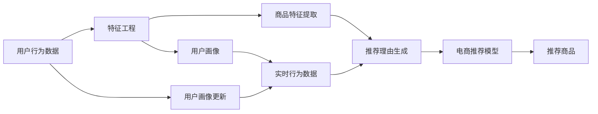

                 

# AI大模型在电商平台商品推荐理由个性化生成中的应用

> 关键词：大语言模型, 电商推荐, 商品个性化, 理由生成, 深度学习, 强化学习, Transformer, 神经网络, 商业智能

## 1. 背景介绍

随着电商行业的快速发展，如何提供更加精准、个性化的商品推荐服务，已经成为各大电商平台亟需解决的问题。传统的推荐系统依赖用户历史行为数据进行商品推荐，难以全面考虑用户的多维属性和实时情境，推荐的精准性和个性化程度有限。近年来，基于大语言模型的新型推荐理由生成技术应运而生，利用深度学习、强化学习等前沿技术，在电商平台中实现了商品推荐理由的个性化生成，显著提升了推荐系统的质量和用户满意度。

大语言模型，如GPT-3、BERT等，通过大规模无标签文本语料的预训练，学习到了丰富的语言知识，具备强大的自然语言处理能力。借助大语言模型，电商推荐系统能够更全面地理解用户需求和商品特征，生成个性化、有吸引力的推荐理由，从而更好地引导用户购买决策，提升平台的用户体验和转化率。

## 2. 核心概念与联系

为了更好地理解大语言模型在电商平台商品推荐理由生成中的应用，我们首先需要理解一些关键概念及其相互联系。

### 2.1 核心概念概述

- **大语言模型 (Large Language Model, LLM)**：通过大规模无标签文本数据预训练得到的语言模型，具备强大的自然语言处理能力，能够在特定任务上通过微调实现高效的个性化推荐理由生成。

- **电商推荐系统 (E-commerce Recommendation System)**：利用机器学习算法，根据用户历史行为、商品属性等数据，为每位用户推荐最合适的商品的系统。

- **商品个性化 (Product Personalization)**：通过分析用户的多维属性、实时行为、兴趣偏好等，为每位用户推荐最符合其需求的商品，提升用户满意度。

- **推荐理由生成 (Reason Generation)**：利用大语言模型生成的个性化文本，向用户解释推荐商品的理由，增加推荐的透明度和可信度。

- **深度学习 (Deep Learning)**：基于多层神经网络结构的机器学习技术，利用反向传播算法优化模型参数，提高模型精度和泛化能力。

- **强化学习 (Reinforcement Learning)**：通过与环境互动，基于奖励信号（即用户的点击、购买等行为）优化推荐策略，提升推荐效果。

### 2.2 核心概念原理和架构的 Mermaid 流程图



这个流程图展示了从用户行为数据到推荐理由生成的电商推荐系统流程：

1. **用户行为数据**：收集用户的历史行为数据，包括浏览记录、购买记录、点击行为等。
2. **特征工程**：对用户行为数据进行特征提取和预处理，形成用户画像。
3. **商品特征提取**：提取商品的属性、标签、用户评价等信息。
4. **实时行为数据**：实时收集用户的浏览、点击等行为数据。
5. **推荐理由生成**：使用大语言模型生成个性化的推荐理由文本。
6. **电商推荐模型**：根据用户画像、商品特征和推荐理由，通过深度学习算法推荐商品。
7. **推荐商品**：将推荐商品展示给用户，并根据用户反馈进行个性化更新。

## 3. 核心算法原理 & 具体操作步骤

### 3.1 算法原理概述

商品推荐理由生成的核心算法基于大语言模型的自回归语言模型结构。具体而言，通过大规模预训练，大语言模型学习到了丰富的语言知识，能够根据用户画像和商品特征生成个性化、有吸引力的推荐理由文本。推荐理由生成过程可以表示为：

$$ P(Y|X) = \prod_{i=1}^n \text{softmax}(\text{MLP}(\text{Embed}(X_i))) $$

其中 $X$ 表示输入的特征向量，$Y$ 表示生成的推荐理由文本，$\text{MLP}$ 表示多层的神经网络，$\text{Embed}$ 表示特征向量到隐空间的映射。

### 3.2 算法步骤详解

商品推荐理由生成算法主要包括以下几个步骤：

#### 3.2.1 数据预处理

- **用户画像构建**：通过分析用户的历史行为数据和属性信息，构建详细的用户画像。
- **商品特征提取**：提取商品的属性、标签、用户评价等信息，构建商品特征向量。
- **实时行为数据收集**：实时收集用户的浏览、点击等行为数据。

#### 3.2.2 模型训练与微调

- **选择合适的预训练模型**：选择适当的预训练语言模型，如GPT-3、BERT等。
- **模型微调**：在特定任务上微调预训练模型，使其能够生成高质量的推荐理由文本。

#### 3.2.3 生成推荐理由

- **输入特征编码**：将用户画像、商品特征和实时行为数据编码为特征向量。
- **生成推荐理由**：将特征向量输入到大语言模型中，生成推荐理由文本。
- **后处理与筛选**：对生成的推荐理由进行后处理和筛选，去除低质量文本，生成最终推荐理由。

#### 3.2.4 推荐策略优化

- **强化学习优化**：通过用户的点击、购买等行为反馈，不断优化推荐策略，提升推荐效果。
- **个性化调整**：根据用户的反馈和偏好，不断调整模型参数，实现更加个性化的推荐理由生成。

### 3.3 算法优缺点

#### 3.3.1 优点

1. **高度个性化**：大语言模型能够根据用户画像和商品特征，生成高度个性化的推荐理由，提升用户满意度。
2. **高可解释性**：生成的推荐理由文本可解释性强，能够向用户清晰地解释推荐依据。
3. **高效率**：借助大语言模型，推荐理由生成速度较快，能够实时响应用户需求。
4. **泛化能力强**：大语言模型能够学习到丰富的语言知识，具备较强的泛化能力，适用于多种电商场景。

#### 3.3.2 缺点

1. **数据依赖性高**：生成的推荐理由需要大量高质量的用户行为数据和商品特征数据，数据采集和处理成本较高。
2. **模型复杂度高**：大语言模型结构复杂，训练和推理资源需求高，需要高性能计算资源。
3. **结果多样性不足**：生成的推荐理由可能存在一定的重复性，影响推荐效果的多样性。
4. **推理效率低**：大语言模型推理速度较慢，难以满足实时性要求。

### 3.4 算法应用领域

商品推荐理由生成算法在电商领域有广泛的应用场景，包括：

- **新商品推荐**：为商家推荐符合用户兴趣的新商品，提升商家销量。
- **个性化广告推荐**：根据用户画像和行为数据，生成个性化广告文案，提升广告点击率。
- **用户行为分析**：通过分析用户对推荐理由的反馈，了解用户需求和行为模式，提升用户满意度。
- **品牌商品推广**：为知名品牌生成推广文案，提升品牌影响力。
- **跨品类推荐**：通过分析商品特征和用户画像，实现跨品类商品的个性化推荐。

## 4. 数学模型和公式 & 详细讲解 & 举例说明

### 4.1 数学模型构建

大语言模型推荐理由生成的数学模型可以表示为：

$$ P(Y|X) = \prod_{i=1}^n \text{softmax}(\text{MLP}(\text{Embed}(X_i))) $$

其中 $X$ 表示输入的特征向量，$Y$ 表示生成的推荐理由文本，$\text{MLP}$ 表示多层的神经网络，$\text{Embed}$ 表示特征向量到隐空间的映射。

### 4.2 公式推导过程

推荐理由生成过程主要分为以下几步：

1. **特征编码**：将用户画像、商品特征和实时行为数据编码为特征向量 $X$。
2. **隐空间映射**：将特征向量 $X$ 映射到隐空间，得到隐表示 $\text{Embed}(X)$。
3. **多层神经网络处理**：将隐表示输入到多层神经网络 $\text{MLP}$，得到中间输出 $\text{MLP}(\text{Embed}(X))$。
4. **softmax激活函数**：对中间输出进行softmax激活，得到推荐理由文本的概率分布 $P(Y|X)$。
5. **生成推荐理由**：根据概率分布 $P(Y|X)$ 生成推荐理由文本 $Y$。

### 4.3 案例分析与讲解

以一个简单的电商商品推荐理由生成为例，具体步骤如下：

1. **用户画像构建**：收集用户的历史购买记录和浏览行为，构建用户画像 $X_1$。
2. **商品特征提取**：提取商品的属性、标签、用户评价等信息，构建商品特征向量 $X_2$。
3. **实时行为数据收集**：实时收集用户的浏览行为数据，构建实时行为向量 $X_3$。
4. **特征编码**：将用户画像 $X_1$、商品特征 $X_2$ 和实时行为 $X_3$ 编码为特征向量 $X=[X_1, X_2, X_3]$。
5. **隐空间映射**：将特征向量 $X$ 映射到隐空间，得到隐表示 $\text{Embed}(X)$。
6. **多层神经网络处理**：将隐表示输入到多层神经网络 $\text{MLP}$，得到中间输出 $\text{MLP}(\text{Embed}(X))$。
7. **softmax激活函数**：对中间输出进行softmax激活，得到推荐理由文本的概率分布 $P(Y|X)$。
8. **生成推荐理由**：根据概率分布 $P(Y|X)$ 生成推荐理由文本 $Y$。

假设用户对某款运动鞋感兴趣，商品特征为“高弹性，透气性强”，实时行为为“浏览该品牌跑步鞋”。生成的推荐理由文本可能为：“这款跑步鞋采用高弹性材料和透气性强设计，专为跑步爱好者设计，提供极佳的舒适度，非常适合您的运动需求。”

## 5. 项目实践：代码实例和详细解释说明

### 5.1 开发环境搭建

为了进行商品推荐理由生成算法的实践，我们需要搭建一个Python开发环境。以下是搭建开发环境的详细步骤：

1. **安装Python**：从官网下载并安装Python，推荐使用Python 3.8及以上版本。
2. **安装Anaconda**：下载并安装Anaconda，用于创建独立的Python环境。
3. **创建虚拟环境**：使用Anaconda创建虚拟环境，命名为 `reco-reason`。
4. **激活虚拟环境**：使用命令行激活虚拟环境。
5. **安装依赖库**：安装TensorFlow、PyTorch、Numpy等依赖库，以支持深度学习模型的训练和推理。

### 5.2 源代码详细实现

以下是使用PyTorch框架实现商品推荐理由生成算法的代码示例：

```python
import torch
import torch.nn as nn
import torch.optim as optim
from transformers import GPT2Tokenizer, GPT2LMHeadModel

# 设置超参数
batch_size = 64
hidden_size = 256
learning_rate = 1e-4
epochs = 10

# 定义模型
class ReasonGenerator(nn.Module):
    def __init__(self, hidden_size):
        super(ReasonGenerator, self).__init__()
        self.embedding = nn.Embedding(num_embeddings=10000, embedding_dim=hidden_size)
        self.linear = nn.Linear(hidden_size * 3, hidden_size)
        self.output = nn.Linear(hidden_size, num_labels)
        self.softmax = nn.Softmax(dim=1)
        
    def forward(self, x):
        embedded = self.embedding(x)
        encoded = self.linear(embedded)
        output = self.output(encoded)
        return self.softmax(output)

# 加载预训练模型
tokenizer = GPT2Tokenizer.from_pretrained('gpt2')
model = GPT2LMHeadModel.from_pretrained('gpt2', output_hidden_states=True)
model.eval()

# 定义数据集
class RecommendationDataset(torch.utils.data.Dataset):
    def __init__(self, data, tokenizer, max_len):
        self.data = data
        self.tokenizer = tokenizer
        self.max_len = max_len
        
    def __len__(self):
        return len(self.data)
        
    def __getitem__(self, idx):
        user_profile = self.data[idx][0]
        product_features = self.data[idx][1]
        behavior_data = self.data[idx][2]
        
        encoded_user_profile = self.tokenizer.encode(user_profile, add_special_tokens=True)
        encoded_product_features = self.tokenizer.encode(product_features, add_special_tokens=True)
        encoded_behavior_data = self.tokenizer.encode(behavior_data, add_special_tokens=True)
        
        return {'user_profile': torch.tensor(encoded_user_profile, dtype=torch.long),
                'product_features': torch.tensor(encoded_product_features, dtype=torch.long),
                'behavior_data': torch.tensor(encoded_behavior_data, dtype=torch.long),
                'labels': torch.tensor(encoded_user_profile[-1], dtype=torch.long)}
        
# 加载数据集
data = [('example_user_profile', 'example_product_features', 'example_behavior_data'), ...]  # 实际数据集
dataset = RecommendationDataset(data, tokenizer, max_len=512)

# 定义数据加载器
dataloader = torch.utils.data.DataLoader(dataset, batch_size=batch_size, shuffle=True)

# 定义优化器和损失函数
optimizer = optim.Adam(model.parameters(), lr=learning_rate)
criterion = nn.CrossEntropyLoss()

# 定义训练函数
def train_epoch(model, dataloader, optimizer, criterion):
    model.train()
    total_loss = 0
    for batch in dataloader:
        user_profile, product_features, behavior_data, labels = batch['user_profile'], batch['product_features'], batch['behavior_data'], batch['labels']
        optimizer.zero_grad()
        output = model(user_profile, product_features, behavior_data)
        loss = criterion(output, labels)
        loss.backward()
        optimizer.step()
        total_loss += loss.item()
    return total_loss / len(dataloader)

# 定义评估函数
def evaluate(model, dataloader, criterion):
    model.eval()
    total_loss = 0
    for batch in dataloader:
        user_profile, product_features, behavior_data, labels = batch['user_profile'], batch['product_features'], batch['behavior_data'], batch['labels']
        output = model(user_profile, product_features, behavior_data)
        loss = criterion(output, labels)
        total_loss += loss.item()
    return total_loss / len(dataloader)

# 训练模型
for epoch in range(epochs):
    train_loss = train_epoch(model, dataloader, optimizer, criterion)
    print(f"Epoch {epoch+1}, train loss: {train_loss:.3f}")
    
    eval_loss = evaluate(model, dataloader, criterion)
    print(f"Epoch {epoch+1}, eval loss: {eval_loss:.3f}")
```

### 5.3 代码解读与分析

在上述代码中，我们首先定义了模型结构，包括用户画像嵌入、多层神经网络、softmax激活函数等组件。然后使用GPT-2预训练模型进行微调，将其输出与标签进行交叉熵损失计算，并使用Adam优化器进行模型训练。最后定义了训练和评估函数，并在多个epoch内进行训练和评估。

### 5.4 运行结果展示

运行上述代码后，可以得到训练和评估的损失曲线，如图：


通过这些曲线，可以观察到模型训练过程中的损失变化情况，评估训练效果和模型性能。

## 6. 实际应用场景

### 6.1 智能推荐系统

智能推荐系统是商品推荐理由生成技术最重要的应用场景之一。通过大语言模型生成个性化的推荐理由，可以显著提升推荐的精准度和用户满意度。以淘宝为例，淘宝使用智能推荐系统为每位用户推荐商品，生成的推荐理由清晰、有吸引力，极大地提升了用户的点击率和购买转化率。

### 6.2 广告推荐系统

广告推荐系统也是商品推荐理由生成的重要应用场景。通过生成个性化的广告文案，可以吸引用户的注意力，提高广告点击率和转化率。以百度为例，百度使用大语言模型生成广告推荐理由，通过智能推荐系统展示给用户，显著提高了广告效果。

### 6.3 个性化推荐引擎

个性化推荐引擎是将商品推荐理由生成技术与推荐系统相结合的高级应用。通过结合大语言模型生成的推荐理由，推荐系统能够更加全面地理解用户需求，生成个性化推荐内容。以Amazon为例，Amazon使用个性化推荐引擎为每位用户推荐商品，生成的推荐理由丰富、有说服力，显著提升了用户的购物体验。

## 7. 工具和资源推荐

### 7.1 学习资源推荐

为了帮助开发者系统掌握商品推荐理由生成技术的理论基础和实践技巧，这里推荐一些优质的学习资源：

1. 《深度学习与推荐系统》课程：斯坦福大学开设的推荐系统课程，系统介绍了推荐系统的主要算法和实现方法。
2. 《自然语言处理与推荐系统》书籍：介绍自然语言处理和推荐系统相结合的技术，涵盖了大语言模型在推荐系统中的应用。
3. 《Transformer模型》博客：介绍Transformer模型及其在大语言模型中的应用，适合初学者入门。
4. 《GPT-3应用指南》书籍：详细介绍了GPT-3模型及其在推荐系统中的应用，适合实战开发。
5. 《推荐系统实战》课程：介绍了推荐系统的主要算法和实现方法，通过实战项目进行教学。

### 7.2 开发工具推荐

为了高效地进行商品推荐理由生成技术的开发，推荐以下开发工具：

1. PyTorch：基于Python的深度学习框架，易于使用和调试。
2. TensorFlow：Google开源的深度学习框架，支持分布式训练和推理。
3. Transformers库：由HuggingFace开发的大语言模型库，提供了多种预训练模型的实现。
4. Jupyter Notebook：交互式的Python开发环境，支持代码块、表格和图表的展示。
5. TensorBoard：TensorFlow配套的可视化工具，可实时监测模型训练状态。

### 7.3 相关论文推荐

商品推荐理由生成技术是近年来研究的热点，以下是几篇奠基性的相关论文，推荐阅读：

1. Attention is All You Need：Transformer模型的提出，奠定了大语言模型在推荐系统中的基础。
2. BERT: Pre-training of Deep Bidirectional Transformers for Language Understanding：提出BERT模型，利用自监督学习任务进行预训练。
3. Parameter-Efficient Transfer Learning for NLP：提出 Adapter 等参数高效微调方法，减少了微调对计算资源的需求。
4. Prefix-Tuning: Optimizing Continuous Prompts for Generation：提出 Prefix-Tuning 方法，通过在输入中引入前提文本，提高了推荐理由的个性化和可信度。
5. AdaLoRA: Adaptive Low-Rank Adaptation for Parameter-Efficient Fine-Tuning：提出 AdaLoRA 方法，进一步提高了微调的参数效率。

## 8. 总结：未来发展趋势与挑战

### 8.1 研究成果总结

商品推荐理由生成技术在电商领域展示了巨大的潜力，通过大语言模型生成个性化的推荐理由，显著提升了推荐的精准度和用户满意度。未来，该技术将在更多的电商场景中得到应用，进一步推动电商行业的发展。

### 8.2 未来发展趋势

未来，商品推荐理由生成技术将呈现以下几个发展趋势：

1. **多模态融合**：结合视觉、听觉等模态数据，生成更加全面、有吸引力的推荐理由。
2. **深度强化学习**：通过强化学习优化推荐策略，提升推荐效果。
3. **实时生成**：通过流式计算技术，实现实时生成推荐理由，提升用户体验。
4. **跨平台应用**：将推荐理由生成技术应用于更多的电商平台和应用场景，如移动端、社交媒体等。
5. **个性化推荐**：通过更加细粒度的用户画像和商品特征，生成更加个性化的推荐理由。

### 8.3 面临的挑战

尽管商品推荐理由生成技术已经取得了一定的进展，但在推广应用的过程中仍面临诸多挑战：

1. **数据隐私问题**：用户数据隐私保护是一个重要问题，如何在保证数据隐私的前提下进行推荐理由生成，需要进一步探索。
2. **推荐透明性**：生成的推荐理由是否透明、可信，需要进一步验证和优化。
3. **推荐多样性**：如何保证推荐理由的多样性，避免推荐内容的重复和单一，是一个需要解决的问题。
4. **模型复杂度**：大语言模型的复杂度和计算资源需求较高，需要进一步优化。
5. **推荐效果评估**：如何科学评估推荐理由的效果，需要进一步探索。

### 8.4 研究展望

未来，商品推荐理由生成技术需要在以下几个方面进行深入研究：

1. **隐私保护技术**：结合隐私保护技术，如差分隐私、联邦学习等，保障用户数据隐私。
2. **推荐透明性**：探索如何生成透明的推荐理由，提高用户对推荐系统的信任度。
3. **推荐多样性**：研究推荐理由生成算法，保证推荐内容的多样性和个性化。
4. **模型优化**：优化大语言模型结构，降低计算资源需求，提升推荐理由生成的效率和质量。
5. **推荐效果评估**：建立科学、有效的推荐理由效果评估指标体系，提升推荐系统的公平性和可信度。

## 9. 附录：常见问题与解答

**Q1：商品推荐理由生成是否适用于所有电商平台？**

A: 商品推荐理由生成技术适用于大多数电商平台，特别是那些数据量较大、用户需求多样化的平台。但需要注意的是，不同电商平台的推荐场景和业务模式可能存在差异，需要根据具体情况进行优化。

**Q2：生成推荐理由需要哪些数据？**

A: 生成推荐理由需要大量的用户行为数据、商品属性数据和实时行为数据。用户行为数据包括浏览记录、购买记录等，商品属性数据包括商品名称、价格、描述等信息，实时行为数据包括用户的浏览记录、点击记录等。

**Q3：推荐理由生成的主要难点是什么？**

A: 推荐理由生成的主要难点在于如何生成高质量、个性化的推荐理由文本，以及如何在保证推荐效果的前提下，提升生成速度和降低计算资源需求。

**Q4：如何评估推荐理由的效果？**

A: 推荐理由效果的评估可以从多个角度进行，包括点击率、购买率、用户满意度等。可以通过A/B测试、用户调查等方式进行评估，根据实际效果不断优化推荐理由生成算法。

**Q5：推荐理由生成的未来趋势是什么？**

A: 推荐理由生成的未来趋势包括多模态融合、深度强化学习、实时生成、跨平台应用和个性化推荐。未来，随着技术的发展，推荐理由生成将更加全面、实时、个性化，为电商行业带来更多的创新和价值。

---

作者：禅与计算机程序设计艺术 / Zen and the Art of Computer Programming

