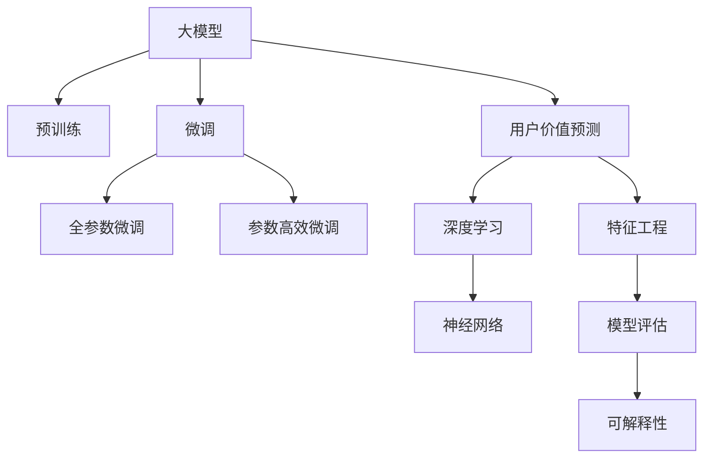

                 

# AI大模型在电商平台用户价值预测中的应用

> 关键词：大模型,用户价值预测,电商平台,深度学习,神经网络,数据驱动,特征工程,模型评估,可解释性,推荐系统

## 1. 背景介绍

### 1.1 问题由来
在当今数字经济时代，电商平台已成为全球消费者购买商品和服务的主要渠道之一。随着市场的激烈竞争和用户需求的多样化，电商平台需要通过精细化的用户分析来提升运营效率和用户体验，从而在竞争中获得优势。传统的数据驱动用户分析方法存在数据量大、特征工程复杂、模型计算资源消耗大等挑战，难以满足大规模电商平台的实时性和精度要求。而基于深度学习的大模型技术，通过预训练和微调的方式，可以在更少的标注数据和更短的时间内，提升用户价值预测模型的性能，成为电商领域用户分析的重要技术手段。

### 1.2 问题核心关键点
基于深度学习的大模型在电商平台用户价值预测中的应用，主要包括以下几个关键点：
1. **预训练模型的构建**：使用大规模无标签数据对大模型进行预训练，学习通用的用户行为特征。
2. **用户行为数据的标注**：从电商平台的交易、浏览、互动等数据中，标注用户行为标签，构建监督学习任务。
3. **微调模型的训练**：使用标注数据对预训练模型进行微调，学习特定电商平台的特征。
4. **特征工程与模型融合**：根据电商平台的实际需求，设计和融合合适的特征工程模块，提升模型性能。
5. **模型评估与迭代优化**：使用多种评估指标，对模型进行持续评估和迭代优化。
6. **可解释性与透明度**：开发可解释性强的模型，增强用户信任和平台透明度。

这些关键点共同构成了一个从数据预处理到模型评估的完整用户价值预测流程，通过这一流程，电商平台能够实时预测用户的行为和价值，进而提供更加个性化的服务，提升用户满意度和平台竞争力。

## 2. 核心概念与联系

### 2.1 核心概念概述

为更好地理解基于大模型技术的电商用户价值预测方法，本节将介绍几个核心概念及其联系：

- **大模型(Large Model)**：指具有亿级以上参数规模的深度学习模型，如BERT、GPT等。这些模型通过在大规模无标签数据上进行预训练，学习到通用的语言或图像表示，具备强大的自监督学习能力和特征提取能力。
- **预训练(Pre-training)**：指在大规模无标签数据上，通过自监督学习任务对模型进行初始化训练的过程。常见的预训练任务包括语言模型、图像分类、对象检测等。
- **微调(Fine-tuning)**：指在预训练模型的基础上，使用特定领域的数据对其进行有监督学习训练，以适应特定应用场景的过程。微调可以显著提升模型在特定任务上的性能，但计算资源消耗较大。
- **用户价值预测(User Value Prediction)**：指通过分析用户行为数据，预测用户未来的购买行为、流失风险、生命周期价值等指标的过程。用户价值预测是电商平台精准营销和用户运营的重要基础。
- **深度学习(Deep Learning)**：指使用多层神经网络结构，通过反向传播算法，从数据中自动学习特征表示的机器学习方法。深度学习模型在图像、语音、自然语言处理等领域取得了重大突破。
- **神经网络(Neural Network)**：指由大量人工神经元组成的非线性模型，能够模拟复杂函数关系，是深度学习的重要组成部分。
- **特征工程(Feature Engineering)**：指根据数据特性和模型需求，设计、选择和构建合适的输入特征的过程。特征工程对于提升模型性能至关重要。
- **模型评估(Model Evaluation)**：指使用各种评估指标和工具，对训练好的模型进行性能评估和调优的过程。模型评估是确保模型可靠性和实用性的重要环节。
- **可解释性(Explainability)**：指模型能够提供清晰、易于理解的操作解释，增强用户信任和透明度。

这些核心概念之间的逻辑关系可以通过以下Mermaid流程图来展示：



这个流程图展示了大模型在用户价值预测中的应用框架：

1. 大模型通过预训练获得基础能力。
2. 微调是对预训练模型进行任务特定的优化，可以分为全参数微调和参数高效微调（PEFT）。
3. 用户价值预测任务中的深度学习和神经网络模块，提供了模型预测的基础架构。
4. 特征工程模块设计了输入特征，增强了模型的预测能力。
5. 模型评估模块用于评估模型性能，指导模型的优化和调参。
6. 可解释性模块提升了模型透明度，增强了用户信任。

这些概念共同构成了电商平台用户价值预测的技术框架，使其能够高效、准确地预测用户价值。

## 3. 核心算法原理 & 具体操作步骤
### 3.1 算法原理概述

基于大模型技术的电商平台用户价值预测，本质上是一个深度学习的监督学习过程。其核心思想是：使用预训练的大模型，在电商平台的标注数据上进行微调，学习特定平台的用户行为特征和购买行为规律，从而预测用户的未来行为和价值。

形式化地，假设预训练模型为 $M_{\theta}$，其中 $\theta$ 为预训练得到的模型参数。给定电商平台的标注数据集 $D=\{(x_i, y_i)\}_{i=1}^N$，其中 $x_i$ 为用户行为数据，$y_i$ 为用户价值标签（如购买概率、流失概率等）。微调的目标是找到新的模型参数 $\hat{\theta}$，使得：

$$
\hat{\theta}=\mathop{\arg\min}_{\theta} \mathcal{L}(M_{\theta},D)
$$

其中 $\mathcal{L}$ 为针对电商平台的损失函数，用于衡量模型预测输出与真实标签之间的差异。常见的损失函数包括均方误差、交叉熵等。

通过梯度下降等优化算法，微调过程不断更新模型参数 $\theta$，最小化损失函数 $\mathcal{L}$，使得模型输出逼近真实标签。由于 $\theta$ 已经通过预训练获得了较好的初始化，因此即便在电商平台的标注数据集上，微调过程也能快速收敛到理想的模型参数 $\hat{\theta}$。

### 3.2 算法步骤详解

基于大模型的电商平台用户价值预测，通常包括以下几个关键步骤：

**Step 1: 准备预训练模型和数据集**
- 选择合适的预训练大模型，如BERT、GPT等，作为初始化参数。
- 收集电商平台的用户行为数据，并标注出用户价值标签，构建标注数据集。

**Step 2: 添加任务适配层**
- 根据电商平台的业务需求，在预训练模型顶层设计合适的输出层和损失函数。
- 对于用户价值预测任务，通常使用sigmoid函数作为激活函数，输出0-1之间的概率，并以二元交叉熵为损失函数。

**Step 3: 设置微调超参数**
- 选择合适的优化算法及其参数，如Adam、SGD等，设置学习率、批大小、迭代轮数等。
- 设置正则化技术及强度，包括L2正则、Dropout、Early Stopping等。
- 确定冻结预训练参数的策略，如仅微调顶层，或全部参数都参与微调。

**Step 4: 执行梯度训练**
- 将标注数据集数据分批次输入模型，前向传播计算损失函数。
- 反向传播计算参数梯度，根据设定的优化算法和学习率更新模型参数。
- 周期性在验证集上评估模型性能，根据性能指标决定是否触发 Early Stopping。
- 重复上述步骤直到满足预设的迭代轮数或 Early Stopping 条件。

**Step 5: 测试和部署**
- 在测试集上评估微调后模型 $M_{\hat{\theta}}$ 的性能，对比微调前后的精度提升。
- 使用微调后的模型对新用户行为数据进行预测，集成到实际的应用系统中。
- 持续收集新的用户行为数据，定期重新微调模型，以适应数据分布的变化。

以上是基于大模型的电商平台用户价值预测的一般流程。在实际应用中，还需要针对具体平台的需求，对微调过程的各个环节进行优化设计，如改进训练目标函数，引入更多的正则化技术，搜索最优的超参数组合等，以进一步提升模型性能。

### 3.3 算法优缺点

基于大模型的电商平台用户价值预测方法具有以下优点：
1. 数据需求较低。与传统的特征工程方法相比，基于大模型的微调方法需要较少的特征工程，能够直接从原始数据中学习特征表示。
2. 模型性能优越。大模型的预训练能力和微调后的泛化能力，使其在用户行为预测上具有优势。
3. 实时性较好。大模型训练和推理速度较快，能够实现实时预测，满足电商平台对实时性要求。
4. 可扩展性强。大模型可以通过增加更多层的参数和计算资源，进一步提升预测精度。

同时，该方法也存在一定的局限性：
1. 数据隐私问题。电商平台的标注数据可能涉及用户隐私，收集和处理需要谨慎。
2. 计算资源消耗大。大模型需要大量的计算资源进行训练和推理，对硬件要求较高。
3. 模型可解释性不足。大模型的复杂性使其难以解释内部的决策过程。
4. 存在模型偏见。预训练模型可能学习到数据中的偏见，影响预测结果的公平性。

尽管存在这些局限性，但就目前而言，基于大模型的电商平台用户价值预测方法仍是目前最主流范式。未来相关研究的重点在于如何进一步降低计算资源消耗，提高模型可解释性和公平性，同时兼顾实时性和精度。

### 3.4 算法应用领域

基于大模型的电商平台用户价值预测方法已经在用户行为分析、个性化推荐、流失预警等多个领域得到广泛应用，成为电商平台数据分析和运营的重要手段。具体而言，该方法可以应用于：

- 用户流失预测：预测用户在一定时间内流失的概率，及时进行干预。
- 个性化推荐：根据用户行为数据，预测用户可能感兴趣的商品，提升用户购物体验。
- 生命周期价值预测：预测用户未来在平台上的消费总价值，帮助企业进行精准营销。
- 广告效果评估：评估平台广告投放的效果，优化广告投放策略。
- 用户满意度调查：通过用户行为数据预测用户满意度，提升平台服务质量。

除了上述这些经典应用外，大模型在电商平台用户价值预测领域还有更多创新的应用场景，如动态定价、库存优化、供应链管理等，为电商平台带来了全新的商业价值。

## 4. 数学模型和公式 & 详细讲解 & 举例说明
### 4.1 数学模型构建

本节将使用数学语言对基于大模型的电商平台用户价值预测过程进行更加严格的刻画。

记预训练大模型为 $M_{\theta}$，其中 $\theta$ 为预训练得到的模型参数。假设电商平台标注数据集为 $D=\{(x_i, y_i)\}_{i=1}^N$，其中 $x_i$ 为用户的浏览、点击、购买等行为数据，$y_i$ 为用户在未来 $t$ 天内的流失概率、购买概率等标签。

定义模型 $M_{\theta}$ 在输入 $x_i$ 上的输出为 $\hat{y}=M_{\theta}(x_i) \in [0,1]$，表示用户流失或购买的概率预测。真实标签 $y_i \in \{0,1\}$。则二元交叉熵损失函数定义为：

$$
\ell(M_{\theta}(x_i),y_i) = -[y_i\log \hat{y}_i + (1-y_i)\log (1-\hat{y}_i)]
$$

将其代入经验风险公式，得：

$$
\mathcal{L}(\theta) = -\frac{1}{N}\sum_{i=1}^N [y_i\log \hat{y}_i + (1-y_i)\log(1-\hat{y}_i)]
$$

根据链式法则，损失函数对参数 $\theta_k$ 的梯度为：

$$
\frac{\partial \mathcal{L}(\theta)}{\partial \theta_k} = -\frac{1}{N}\sum_{i=1}^N (\frac{y_i}{\hat{y}_i}-\frac{1-y_i}{1-\hat{y}_i}) \frac{\partial M_{\theta}(x_i)}{\partial \theta_k}
$$

其中 $\frac{\partial M_{\theta}(x_i)}{\partial \theta_k}$ 可进一步递归展开，利用自动微分技术完成计算。

### 4.2 公式推导过程

以下我们以用户流失预测为例，推导二元交叉熵损失函数及其梯度的计算公式。

假设模型 $M_{\theta}$ 在输入 $x_i$ 上的输出为 $\hat{y}=M_{\theta}(x_i) \in [0,1]$，表示用户流失的概率预测。真实标签 $y_i \in \{0,1\}$。则二元交叉熵损失函数定义为：

$$
\ell(M_{\theta}(x_i),y_i) = -[y_i\log \hat{y}_i + (1-y_i)\log (1-\hat{y}_i)]
$$

将其代入经验风险公式，得：

$$
\mathcal{L}(\theta) = -\frac{1}{N}\sum_{i=1}^N [y_i\log \hat{y}_i + (1-y_i)\log(1-\hat{y}_i)]
$$

根据链式法则，损失函数对参数 $\theta_k$ 的梯度为：

$$
\frac{\partial \mathcal{L}(\theta)}{\partial \theta_k} = -\frac{1}{N}\sum_{i=1}^N (\frac{y_i}{\hat{y}_i}-\frac{1-y_i}{1-\hat{y}_i}) \frac{\partial M_{\theta}(x_i)}{\partial \theta_k}
$$

在得到损失函数的梯度后，即可带入参数更新公式，完成模型的迭代优化。重复上述过程直至收敛，最终得到适应电商平台用户行为预测的最优模型参数 $\theta^*$。

## 5. 项目实践：代码实例和详细解释说明
### 5.1 开发环境搭建

在进行电商平台用户价值预测微调实践前，我们需要准备好开发环境。以下是使用Python进行PyTorch开发的环境配置流程：

1. 安装Anaconda：从官网下载并安装Anaconda，用于创建独立的Python环境。

2. 创建并激活虚拟环境：
```bash
conda create -n pytorch-env python=3.8 
conda activate pytorch-env
```

3. 安装PyTorch：根据CUDA版本，从官网获取对应的安装命令。例如：
```bash
conda install pytorch torchvision torchaudio cudatoolkit=11.1 -c pytorch -c conda-forge
```

4. 安装Transformers库：
```bash
pip install transformers
```

5. 安装各类工具包：
```bash
pip install numpy pandas scikit-learn matplotlib tqdm jupyter notebook ipython
```

完成上述步骤后，即可在`pytorch-env`环境中开始微调实践。

### 5.2 源代码详细实现

下面我们以用户流失预测任务为例，给出使用Transformers库对BERT模型进行微调的PyTorch代码实现。

首先，定义用户流失预测任务的标注数据处理函数：

```python
from transformers import BertTokenizer
from torch.utils.data import Dataset
import torch

class UserChurnDataset(Dataset):
    def __init__(self, data, tokenizer, max_len=128):
        self.data = data
        self.tokenizer = tokenizer
        self.max_len = max_len
        
    def __len__(self):
        return len(self.data)
    
    def __getitem__(self, item):
        user_data = self.data[item]
        features = tokenizer(user_data, padding='max_length', max_length=self.max_len, truncation=True)
        input_ids = features['input_ids']
        attention_mask = features['attention_mask']
        label = user_data[-1]
        
        return {'input_ids': input_ids, 
                'attention_mask': attention_mask,
                'label': label}

# 读取标注数据
data = read_data('user_churn.csv')

# 初始化分词器和数据集
tokenizer = BertTokenizer.from_pretrained('bert-base-cased')
train_dataset = UserChurnDataset(data['train'], tokenizer)
dev_dataset = UserChurnDataset(data['dev'], tokenizer)
test_dataset = UserChurnDataset(data['test'], tokenizer)
```

然后，定义模型和优化器：

```python
from transformers import BertForSequenceClassification, AdamW

model = BertForSequenceClassification.from_pretrained('bert-base-cased', num_labels=2)

optimizer = AdamW(model.parameters(), lr=2e-5)
```

接着，定义训练和评估函数：

```python
from torch.utils.data import DataLoader
from tqdm import tqdm
from sklearn.metrics import classification_report

device = torch.device('cuda') if torch.cuda.is_available() else torch.device('cpu')
model.to(device)

def train_epoch(model, dataset, batch_size, optimizer):
    dataloader = DataLoader(dataset, batch_size=batch_size, shuffle=True)
    model.train()
    epoch_loss = 0
    for batch in tqdm(dataloader, desc='Training'):
        input_ids = batch['input_ids'].to(device)
        attention_mask = batch['attention_mask'].to(device)
        labels = batch['label'].to(device)
        model.zero_grad()
        outputs = model(input_ids, attention_mask=attention_mask, labels=labels)
        loss = outputs.loss
        epoch_loss += loss.item()
        loss.backward()
        optimizer.step()
    return epoch_loss / len(dataloader)

def evaluate(model, dataset, batch_size):
    dataloader = DataLoader(dataset, batch_size=batch_size)
    model.eval()
    preds, labels = [], []
    with torch.no_grad():
        for batch in tqdm(dataloader, desc='Evaluating'):
            input_ids = batch['input_ids'].to(device)
            attention_mask = batch['attention_mask'].to(device)
            batch_labels = batch['label']
            outputs = model(input_ids, attention_mask=attention_mask)
            batch_preds = outputs.logits.argmax(dim=2).to('cpu').tolist()
            batch_labels = batch_labels.to('cpu').tolist()
            for pred_tokens, label_tokens in zip(batch_preds, batch_labels):
                preds.append(pred_tokens[:len(label_tokens)])
                labels.append(label_tokens)
                
    print(classification_report(labels, preds))
```

最后，启动训练流程并在验证集上评估：

```python
epochs = 5
batch_size = 16

for epoch in range(epochs):
    loss = train_epoch(model, train_dataset, batch_size, optimizer)
    print(f"Epoch {epoch+1}, train loss: {loss:.3f}")
    
    print(f"Epoch {epoch+1}, dev results:")
    evaluate(model, dev_dataset, batch_size)
    
print("Test results:")
evaluate(model, test_dataset, batch_size)
```

以上就是使用PyTorch对BERT进行用户流失预测任务微调的完整代码实现。可以看到，得益于Transformers库的强大封装，我们可以用相对简洁的代码完成BERT模型的加载和微调。

### 5.3 代码解读与分析

让我们再详细解读一下关键代码的实现细节：

**UserChurnDataset类**：
- `__init__`方法：初始化用户行为数据、分词器等关键组件。
- `__len__`方法：返回数据集的样本数量。
- `__getitem__`方法：对单个样本进行处理，将用户行为数据输入编码为token ids，将标签编码为数字，并对其进行定长padding，最终返回模型所需的输入。

**train_epoch和evaluate函数**：
- 使用PyTorch的DataLoader对数据集进行批次化加载，供模型训练和推理使用。
- 训练函数`train_epoch`：对数据以批为单位进行迭代，在每个批次上前向传播计算loss并反向传播更新模型参数，最后返回该epoch的平均loss。
- 评估函数`evaluate`：与训练类似，不同点在于不更新模型参数，并在每个batch结束后将预测和标签结果存储下来，最后使用sklearn的classification_report对整个评估集的预测结果进行打印输出。

**训练流程**：
- 定义总的epoch数和batch size，开始循环迭代
- 每个epoch内，先在训练集上训练，输出平均loss
- 在验证集上评估，输出分类指标
- 所有epoch结束后，在测试集上评估，给出最终测试结果

可以看到，PyTorch配合Transformers库使得BERT微调的用户流失预测代码实现变得简洁高效。开发者可以将更多精力放在数据处理、模型改进等高层逻辑上，而不必过多关注底层的实现细节。

当然，工业级的系统实现还需考虑更多因素，如模型的保存和部署、超参数的自动搜索、更灵活的任务适配层等。但核心的微调范式基本与此类似。

## 6. 实际应用场景
### 6.1 电商平台的流失预警

基于大模型技术的用户流失预测模型，可以广泛应用于电商平台的流失预警系统。传统流失预警方法依赖于复杂的规则和特征工程，难以应对实时数据的变化。而使用微调后的用户流失预测模型，可以实时监测用户行为，快速预警高流失风险用户，提升平台的用户留存率。

在技术实现上，可以收集电商平台的各类用户行为数据，如浏览、点击、购买、评价等，并将其标注为流失或不流失两种标签。在此基础上对预训练模型进行微调，使其能够自动理解用户行为特征，预测用户流失风险。对于高流失风险用户，系统可以及时进行干预，如推送个性化推荐、提供优惠券等，提升用户粘性和留存率。

### 6.2 个性化推荐系统

用户流失预测模型不仅适用于流失预警，还可以与个性化推荐系统结合，提升用户推荐效果。个性化推荐系统通过分析用户的历史行为数据，预测用户可能感兴趣的商品，从而提升推荐效果。而流失预测模型则可以预测用户未来的流失行为，及时调整推荐策略，减少用户流失。

具体而言，可以在推荐系统中引入流失预测模型，对每个用户的行为数据进行预测。对于流失概率较高的用户，调整推荐策略，推荐更有吸引力的商品，增加用户满意度，降低流失风险。对于流失概率较低的用户，继续保持现有推荐策略，提升个性化推荐效果。

### 6.3 用户生命周期价值预测

电商平台的生命周期价值预测模型可以预测用户在平台上的消费总价值，从而进行精准营销和资源优化。通过用户流失预测模型，可以对用户进行分类，预测不同生命周期阶段的消费行为。对于高价值用户，进行个性化营销，提升消费频率和消费金额。对于低价值用户，优化资源分配，提升转化率。

在具体实现中，可以将用户行为数据作为输入，使用流失预测模型对用户进行分类，根据不同类别预测用户的消费总价值。根据预测结果，制定不同的营销策略，提升整体平台效益。

### 6.4 未来应用展望

随着大模型和微调技术的不断发展，基于大模型的电商平台用户价值预测方法将在更多领域得到应用，为电商平台带来更大的价值。

在智慧零售领域，大模型可以帮助零售商优化库存管理、提升供应链效率、增强市场竞争力。

在金融领域，用户价值预测模型可以用于风险管理、信用评估、精准营销等方面，提升金融机构的服务质量和用户体验。

在物流配送领域，大模型可以优化配送路径、提升配送效率、降低运营成本。

此外，在在线教育、智能制造、智能家居等众多领域，基于大模型的用户价值预测方法也将不断涌现，为不同行业的数字化转型提供新的技术支撑。

## 7. 工具和资源推荐
### 7.1 学习资源推荐

为了帮助开发者系统掌握大模型在电商平台用户价值预测中的理论基础和实践技巧，这里推荐一些优质的学习资源：

1. 《深度学习》系列书籍：由多位知名专家共同编写，深入浅出地介绍了深度学习的基本概念和前沿技术。
2. CS231n《卷积神经网络》课程：斯坦福大学开设的经典课程，介绍了图像处理、卷积神经网络等核心内容。
3. Coursera《深度学习专项课程》：由深度学习领域的顶尖学者开设，涵盖了深度学习的基础理论和实践应用。
4. Udacity《深度学习 Nanodegree》：实战导向的深度学习学习项目，通过实际项目提升深度学习技能。
5. Kaggle平台：提供丰富的数据集和竞赛，适合数据驱动应用的学习和实践。

通过对这些资源的学习实践，相信你一定能够快速掌握大模型在电商平台用户价值预测中的应用。

### 7.2 开发工具推荐

高效的开发离不开优秀的工具支持。以下是几款用于大模型电商应用开发的常用工具：

1. PyTorch：基于Python的开源深度学习框架，灵活动态的计算图，适合快速迭代研究。
2. TensorFlow：由Google主导开发的开源深度学习框架，生产部署方便，适合大规模工程应用。
3. TensorBoard：TensorFlow配套的可视化工具，可实时监测模型训练状态，并提供丰富的图表呈现方式。
4. Weights & Biases：模型训练的实验跟踪工具，可以记录和可视化模型训练过程中的各项指标。
5. Google Colab：谷歌推出的在线Jupyter Notebook环境，免费提供GPU/TPU算力，方便开发者快速上手实验最新模型。

合理利用这些工具，可以显著提升大模型在电商平台用户价值预测任务中的开发效率，加快创新迭代的步伐。

### 7.3 相关论文推荐

大模型和电商用户价值预测技术的发展源于学界的持续研究。以下是几篇奠基性的相关论文，推荐阅读：

1. Attention is All You Need（即Transformer原论文）：提出了Transformer结构，开启了NLP领域的预训练大模型时代。
2. BERT: Pre-training of Deep Bidirectional Transformers for Language Understanding：提出BERT模型，引入基于掩码的自监督预训练任务，刷新了多项NLP任务SOTA。
3. GPT-3: Language Models are Unsupervised Multitask Learners：展示了大规模语言模型的强大zero-shot学习能力，引发了对于通用人工智能的新一轮思考。
4. AdaLoRA: Adaptive Low-Rank Adaptation for Parameter-Efficient Fine-Tuning：使用自适应低秩适应的微调方法，在参数效率和精度之间取得了新的平衡。
5. Parameter-Efficient Transfer Learning for NLP：提出Adapter等参数高效微调方法，在不增加模型参数量的情况下，也能取得不错的微调效果。

这些论文代表了大模型和微调技术的发展脉络。通过学习这些前沿成果，可以帮助研究者把握学科前进方向，激发更多的创新灵感。

## 8. 总结：未来发展趋势与挑战
### 8.1 总结

本文对基于大模型技术的电商平台用户价值预测方法进行了全面系统的介绍。首先阐述了大模型和微调技术在电商领域的应用背景和意义，明确了该技术在提升电商平台运营效率和用户体验方面的独特价值。其次，从原理到实践，详细讲解了电商平台用户价值预测的数学模型和关键步骤，给出了微调任务开发的完整代码实例。同时，本文还广泛探讨了该方法在电商平台的流失预警、个性化推荐、生命周期价值预测等多个领域的应用前景，展示了大模型在电商平台中的广泛适用性和巨大潜力。

通过本文的系统梳理，可以看到，基于大模型的电商平台用户价值预测方法正在成为电商领域的重要技术手段，极大地提升了电商平台的数据分析能力和运营效率。未来，伴随预训练语言模型和微调方法的持续演进，相信电商平台用户价值预测技术还将迎来更多的创新突破，为电商行业的数字化转型提供更强大的技术支撑。

### 8.2 未来发展趋势

展望未来，大模型和电商用户价值预测技术将呈现以下几个发展趋势：

1. **模型规模不断增大**：随着算力成本的下降和数据规模的扩张，预训练语言模型的参数量还将持续增长。超大规模语言模型蕴含的丰富语言知识，有望支撑更加复杂多变的电商平台用户价值预测任务。

2. **微调方法更加多样化**：除了传统的全参数微调外，未来会涌现更多参数高效的微调方法，如Prefix-Tuning、LoRA等，在节省计算资源的同时也能保证微调精度。

3. **持续学习成为常态**：随着电商平台的运营数据不断变化，微调模型也需要持续学习新知识以保持性能。如何在不遗忘原有知识的同时，高效吸收新样本信息，将成为重要的研究课题。

4. **少样本学习和跨领域迁移能力提升**：通过进一步提升模型在少样本条件下的学习和泛化能力，以及增强模型在不同领域间的迁移能力，可以在更多应用场景中实现更灵活、高效的微调。

5. **可解释性和透明度增强**：开发更可解释的模型，增强用户信任和平台透明度，是未来电商用户价值预测技术的重要发展方向。

6. **与其他人工智能技术结合**：与知识表示、因果推理、强化学习等前沿技术结合，将进一步提升电商用户价值预测模型的性能和应用范围。

以上趋势凸显了大模型在电商平台用户价值预测中的广阔前景。这些方向的探索发展，必将进一步提升电商平台用户价值预测技术的性能和应用范围，为电商行业的数字化转型提供更强大的技术支撑。

### 8.3 面临的挑战

尽管大模型和微调技术在电商用户价值预测中取得了显著进展，但在迈向更加智能化、普适化应用的过程中，仍面临诸多挑战：

1. **数据隐私和安全问题**：电商平台的标注数据涉及用户隐私，如何在保证数据隐私的同时，实现有效的用户行为分析和预测，是一个重要的研究课题。

2. **计算资源消耗大**：大模型需要大量的计算资源进行训练和推理，对硬件要求较高。如何在不牺牲模型性能的前提下，降低计算资源消耗，是一个亟待解决的问题。

3. **模型可解释性不足**：大模型的复杂性使其难以解释内部的决策过程，这对电商平台的业务决策和用户信任构成挑战。

4. **模型鲁棒性不足**：当前模型面对域外数据时，泛化性能往往大打折扣，如何提高模型的鲁棒性，避免灾难性遗忘，还需要更多理论和实践的积累。

5. **少样本学习和跨领域迁移能力有待提升**：现有方法在少样本条件下的学习和泛化能力还需进一步提升，模型在不同领域间的迁移能力也需进一步增强。

6. **与其他人工智能技术的结合度不够高**：当前大模型更多关注单一任务，与其他AI技术的结合度还有待提高，如何实现协同优化，提升整体性能，是一个重要的研究方向。

尽管存在这些挑战，但大模型和微调技术在电商平台用户价值预测中的巨大潜力是显而易见的。相信随着学界和产业界的共同努力，这些挑战终将一一被克服，大模型在电商平台用户价值预测中的应用将更加广泛和深入。

### 8.4 研究展望

面对大模型在电商平台用户价值预测中面临的挑战，未来的研究需要在以下几个方面寻求新的突破：

1. **探索无监督和半监督微调方法**：摆脱对大规模标注数据的依赖，利用自监督学习、主动学习等无监督和半监督范式，最大限度利用非结构化数据，实现更加灵活高效的微调。

2. **研究参数高效和计算高效的微调范式**：开发更加参数高效的微调方法，在固定大部分预训练参数的同时，只更新极少量的任务相关参数。同时优化微调模型的计算图，减少前向传播和反向传播的资源消耗，实现更加轻量级、实时性的部署。

3. **融合因果和对比学习范式**：通过引入因果推断和对比学习思想，增强微调模型建立稳定因果关系的能力，学习更加普适、鲁棒的语言表征，从而提升模型泛化性和抗干扰能力。

4. **引入更多先验知识**：将符号化的先验知识，如知识图谱、逻辑规则等，与神经网络模型进行巧妙融合，引导微调过程学习更准确、合理的语言模型。同时加强不同模态数据的整合，实现视觉、语音等多模态信息与文本信息的协同建模。

5. **结合因果分析和博弈论工具**：将因果分析方法引入微调模型，识别出模型决策的关键特征，增强输出解释的因果性和逻辑性。借助博弈论工具刻画人机交互过程，主动探索并规避模型的脆弱点，提高系统稳定性。

6. **纳入伦理道德约束**：在模型训练目标中引入伦理导向的评估指标，过滤和惩罚有偏见、有害的输出倾向。同时加强人工干预和审核，建立模型行为的监管机制，确保输出符合人类价值观和伦理道德。

这些研究方向的探索，必将引领大模型在电商平台用户价值预测技术迈向更高的台阶，为构建安全、可靠、可解释、可控的智能系统铺平道路。面向未来，大模型和微调技术还需要与其他人工智能技术进行更深入的融合，如知识表示、因果推理、强化学习等，多路径协同发力，共同推动电商平台用户价值预测系统的进步。只有勇于创新、敢于突破，才能不断拓展语言模型的边界，让智能技术更好地造福电商平台和用户。

## 9. 附录：常见问题与解答

**Q1：大模型在电商平台用户价值预测中的优缺点是什么？**

A: 大模型在电商平台用户价值预测中的优点主要包括：
1. 数据需求较低。与传统的特征工程方法相比，基于大模型的微调方法需要较少的特征工程，能够直接从原始数据中学习特征表示。
2. 模型性能优越。大模型的预训练能力和微调后的泛化能力，使其在用户行为预测上具有优势。
3. 实时性较好。大模型训练和推理速度较快，能够实现实时预测，满足电商平台对实时性要求。
4. 可扩展性强。大模型可以通过增加更多层的参数和计算资源，进一步提升预测精度。

大模型在电商平台用户价值预测中的缺点主要包括：
1. 数据隐私问题。电商平台的标注数据涉及用户隐私，收集和处理需要谨慎。
2. 计算资源消耗大。大模型需要大量的计算资源进行训练和推理，对硬件要求较高。
3. 模型可解释性不足。大模型的复杂性使其难以解释内部的决策过程。
4. 存在模型偏见。预训练模型可能学习到数据中的偏见，影响预测结果的公平性。

**Q2：如何在电商平台用户价值预测中实现模型的高效微调？**

A: 在电商平台用户价值预测中实现模型的高效微调，主要可以考虑以下几个方面：
1. 数据增强：通过回译、近义替换等方式扩充训练集，增加模型泛化能力。
2. 正则化技术：使用L2正则、Dropout、Early Stopping等避免过拟合，提高模型鲁棒性。
3. 参数高效微调：只调整少量参数(如Adapter、Prefix等)，减小过拟合风险，提升计算效率。
4. 可解释性增强：开发可解释性强的模型，增强用户信任和平台透明度。
5. 多模型集成：训练多个微调模型，取平均输出，抑制过拟合，提高模型稳定性。
6. 实时优化：在模型训练过程中，动态调整超参数和优化算法，优化模型性能。

通过这些方法的综合应用，可以显著提升电商平台用户价值预测模型的效率和性能。

**Q3：电商平台用户价值预测模型在实际应用中需要注意哪些问题？**

A: 电商平台用户价值预测模型在实际应用中需要注意以下几个问题：
1. 数据隐私和安全问题：电商平台的标注数据涉及用户隐私，需要在保护用户隐私的前提下，实现有效的用户行为分析和预测。
2. 计算资源消耗大：大模型需要大量的计算资源进行训练和推理，需要合理配置硬件资源。
3. 模型可解释性不足：大模型的复杂性使其难以解释内部的决策过程，需要开发可解释性强的模型，增强用户信任和平台透明度。
4. 模型鲁棒性不足：当前模型面对域外数据时，泛化性能往往大打折扣，需要提高模型的鲁棒性，避免灾难性遗忘。
5. 少样本学习和跨领域迁移能力有待提升：现有方法在少样本条件下的学习和泛化能力还需进一步提升，模型在不同领域间的迁移能力也需进一步增强。
6. 与其他人工智能技术的结合度不够高：当前大模型更多关注单一任务，与其他AI技术的结合度还有待提高，需要实现协同优化，提升整体性能。

通过综合考虑这些问题，可以在实际应用中更好地发挥电商平台用户价值预测模型的潜力，提升用户满意度和平台竞争力。

**Q4：大模型在电商平台用户价值预测中的未来发展方向是什么？**

A: 大模型在电商平台用户价值预测中的未来发展方向主要包括以下几个方面：
1. 模型规模不断增大：随着算力成本的下降和数据规模的扩张，预训练语言模型的参数量还将持续增长，超大规模语言模型蕴含的丰富语言知识，有望支撑更加复杂多变的电商平台用户价值预测任务。
2. 微调方法更加多样化：未来会涌现更多参数高效的微调方法，如Prefix-Tuning、LoRA等，在节省计算资源的同时也能保证微调精度。
3. 持续学习成为常态：随着电商平台的运营数据不断变化，微调模型也需要持续学习新知识以保持性能。如何在不遗忘原有知识的同时，高效吸收新样本信息，将成为重要的研究课题。
4. 少样本学习和跨领域迁移能力提升：通过进一步提升模型在少样本条件下的学习和泛化能力，以及增强模型在不同领域间的迁移能力，可以在更多应用场景中实现更灵活、高效的微调。
5. 可解释性和透明度增强：开发更可解释的模型，增强用户信任和平台透明度。
6. 与其他人工智能技术的结合度提高：与知识表示、因果推理、强化学习等前沿技术结合，实现协同优化，提升整体性能。

通过这些方向的探索发展，大模型在电商平台用户价值预测中的应用将更加广泛和深入，为电商行业的数字化转型提供更强大的技术支撑。

**Q5：大模型在电商平台用户价值预测中如何处理数据隐私和安全问题？**

A: 在电商平台用户价值预测中，处理数据隐私和安全问题主要可以从以下几个方面入手：
1. 数据匿名化：对用户行为数据进行去标识化处理，如去除姓名、地址等敏感信息，降低隐私风险。
2. 差分隐私：在数据处理过程中引入差分隐私技术，添加噪声干扰，保护用户隐私。
3. 安全多方计算：利用安全多方计算技术，在保护用户隐私的前提下，实现数据的安全共享和分析。
4. 联邦学习：通过联邦学习技术，在本地设备上训练模型，不将数据集中上传，保护用户隐私。
5. 模型透明化：在模型设计和应用过程中，透明化数据处理和预测过程，增强用户信任。
6. 法律法规遵守：遵守相关法律法规，如GDPR、CCPA等，保护用户隐私和数据安全。

通过这些方法的综合应用，可以在电商平台用户价值预测中实现数据隐私和安全保护，同时实现有效的用户行为分析和预测。

---

作者：禅与计算机程序设计艺术 / Zen and the Art of Computer Programming

