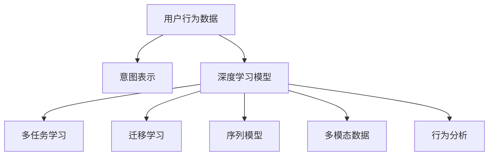

                 

# AI大模型在电商平台用户意图预测中的应用

> 关键词：
用户意图预测, 电商平台, 大模型, 深度学习, 多任务学习, 迁移学习, 序列模型, 多模态数据, 行为分析

## 1. 背景介绍

### 1.1 问题由来

在当今互联网时代，电商平台已经成为人们生活中不可或缺的一部分。用户在电商平台上进行浏览、搜索、购买等活动时，其行为背后的意图和偏好往往能反映出其在当前场景下的真实需求。准确预测用户的意图，不仅可以帮助电商平台更好地优化推荐系统，提高用户满意度和转化率，还能帮助商家精准定位市场，提升销售额。

用户意图预测作为电商平台的核心应用之一，近年来受到了越来越多的关注。传统的意图预测方法依赖于规则、特征工程等，难以有效处理复杂的数据关系。随着深度学习技术的发展，大模型（如BERT、GPT等）的兴起，为意图预测带来了新的突破，通过直接从大规模语料中学习复杂的语言表示，能够更好地捕捉用户意图的多样性和细微变化。

### 1.2 问题核心关键点

本节将介绍用户意图预测的核心问题及其关键点：

- **用户意图**：指用户通过特定行为（如点击、浏览、搜索）所表达的潜在需求和目的。
- **电商平台**：指能够提供商品展示、搜索、购买、评论等服务的在线平台，如淘宝、京东、亚马逊等。
- **意图预测**：指通过分析用户的浏览、点击、搜索等行为数据，预测用户意图的任务。
- **大模型**：指通过大规模语料预训练得到的通用语言模型，如BERT、GPT等。
- **多任务学习**：指通过在多个相关任务上训练模型，以提升模型在特定任务上的性能。
- **迁移学习**：指通过在其他领域上训练好的模型，转移到目标任务上继续训练，以实现知识迁移。
- **序列模型**：指能够处理序列数据的深度学习模型，如RNN、LSTM、Transformer等。
- **多模态数据**：指结合文本、图像、音频等多种数据类型的信息进行建模。
- **行为分析**：指通过分析用户的各种行为数据，挖掘其中的规律和模式，以更好地理解用户行为。

这些关键概念共同构成了用户意图预测的核心框架，使得利用大模型对用户行为进行深度理解成为可能。

## 2. 核心概念与联系

### 2.1 核心概念概述

用户意图预测的大模型方法，通过深度学习模型对用户行为数据进行建模，从中提取用户意图的语义表示，并进行分类或回归预测。核心概念包括：

- **用户行为数据**：指用户在电商平台上的浏览、点击、搜索、评论等行为记录。
- **意图表示**：指对用户意图的语义编码，用于后续的分类或回归任务。
- **深度学习模型**：指能够自动学习复杂特征表示的深度神经网络模型，如卷积神经网络（CNN）、循环神经网络（RNN）、Transformer等。
- **多任务学习**：指在多个相关任务上进行联合训练，以提升模型在特定任务上的性能。
- **迁移学习**：指利用在其他领域上训练好的模型，通过迁移学习提升目标任务的性能。
- **序列模型**：指能够处理序列数据的深度学习模型，如RNN、LSTM、Transformer等。
- **多模态数据**：指结合文本、图像、音频等多种数据类型的信息进行建模。
- **行为分析**：指通过分析用户的各种行为数据，挖掘其中的规律和模式，以更好地理解用户行为。

这些概念之间的联系可以通过以下Mermaid流程图来展示：



这个流程图展示了大模型在用户意图预测中的核心流程：

1. 用户行为数据作为输入，通过深度学习模型进行建模，得到意图表示。
2. 使用多任务学习，对同一数据源进行多个相关任务的联合训练，提升模型性能。
3. 应用迁移学习，利用在其他领域上训练好的模型，对目标任务进行微调，以提升性能。
4. 使用序列模型，对用户的连续行为数据进行处理，捕捉其中的时间依赖关系。
5. 结合多模态数据，利用不同类型的数据进行特征融合，提升模型的表达能力。
6. 进行行为分析，挖掘用户行为背后的规律和模式，进一步提升模型性能。

## 3. 核心算法原理 & 具体操作步骤
### 3.1 算法原理概述

基于大模型的用户意图预测方法，核心原理是通过深度学习模型对用户行为数据进行建模，提取用户意图的语义表示，并进行分类或回归预测。具体步骤如下：

1. **数据预处理**：对原始用户行为数据进行清洗、归一化等处理，得到用于模型训练的数据集。
2. **模型选择**：选择合适的大模型作为预训练模型，如BERT、GPT等。
3. **微调**：在预训练模型的基础上，使用目标任务的数据集进行微调，以适应特定任务的需求。
4. **模型评估**：在测试集上评估模型性能，根据评价指标调整模型参数。
5. **上线部署**：将训练好的模型部署到实际应用中，进行实时意图预测。

### 3.2 算法步骤详解

#### 3.2.1 数据预处理

数据预处理是用户意图预测的首要步骤。具体包括以下内容：

1. **数据清洗**：去除异常数据、重复数据、无关数据等，保证数据质量。
2. **特征提取**：对用户行为数据进行特征提取，如点击次数、浏览时间、停留页面等，得到用于模型训练的特征向量。
3. **数据标准化**：对特征进行标准化处理，如归一化、标准化等，以避免数据偏移影响模型训练。
4. **数据分割**：将数据集划分为训练集、验证集和测试集，以保证模型在独立数据集上的泛化能力。

#### 3.2.2 模型选择与微调

选择合适的预训练模型是用户意图预测的关键步骤。常用的预训练模型包括BERT、GPT等，这些模型都具有大规模语料预训练的优势，能够在多种任务上取得较好的效果。

模型微调主要包括以下步骤：

1. **选择微调任务**：根据用户意图预测的具体需求，选择相应的微调任务，如二分类、多分类、回归等。
2. **数据准备**：准备用于微调的任务数据集，包括训练集、验证集和测试集。
3. **模型加载**：加载预训练模型，如BERT、GPT等，作为微调的初始化参数。
4. **设置超参数**：设置学习率、批大小、迭代轮数等超参数，以保证模型在特定任务上的性能。
5. **微调训练**：使用任务数据集对模型进行微调训练，最小化损失函数，以适应特定任务的需求。
6. **模型评估**：在验证集上评估模型性能，根据评价指标调整模型参数。
7. **模型部署**：将训练好的模型部署到实际应用中，进行实时意图预测。

#### 3.2.3 模型评估

模型评估是用户意图预测的重要环节。常用的评价指标包括准确率、召回率、F1值等，这些指标能够反映模型在不同任务上的性能。

模型评估主要包括以下步骤：

1. **选择评价指标**：根据具体的微调任务，选择相应的评价指标，如准确率、召回率、F1值等。
2. **划分数据集**：将测试集划分为预测集和真实集，以保证模型的预测性能。
3. **计算评价指标**：在预测集上计算评价指标，评估模型性能。
4. **调整模型参数**：根据评价指标，调整模型参数，以提升模型性能。

#### 3.2.4 上线部署

上线部署是将训练好的模型应用于实际场景的最终步骤。具体包括以下内容：

1. **模型封装**：将训练好的模型封装为API接口，方便调用。
2. **API调用**：通过API接口，将用户行为数据输入模型进行意图预测。
3. **结果返回**：将预测结果返回给调用者，以供后续决策使用。

### 3.3 算法优缺点

基于大模型的用户意图预测方法具有以下优点：

1. **精度高**：通过深度学习模型对用户行为数据进行建模，能够提取复杂的特征表示，从而提高预测精度。
2. **泛化能力强**：通过大规模语料预训练，大模型具备较强的泛化能力，能够适应不同场景下的意图预测需求。
3. **迁移学习效果好**：通过迁移学习，可以在相关任务上进行知识迁移，提升模型在特定任务上的性能。
4. **可解释性强**：大模型通常具备较强的可解释性，可以通过对特征的可视化，了解模型的决策过程。

同时，基于大模型的用户意图预测方法也存在以下缺点：

1. **计算成本高**：大模型的训练和推理成本较高，需要高性能的硬件设备支持。
2. **数据需求大**：大模型需要大规模数据进行预训练，对于小规模数据集，效果可能不佳。
3. **过拟合风险高**：大模型容易出现过拟合，需要通过正则化、数据增强等手段进行防范。
4. **参数调整复杂**：大模型的参数调整较为复杂，需要丰富的调参经验。

### 3.4 算法应用领域

基于大模型的用户意图预测方法，在多个领域都得到了广泛应用，具体如下：

1. **电商平台**：电商平台是用户意图预测的主要应用场景之一，通过预测用户意图，优化推荐系统，提升用户体验和转化率。
2. **金融领域**：金融领域可以利用用户意图预测，进行用户行为分析，预测用户购买意愿，提升精准营销效果。
3. **医疗健康**：医疗健康领域可以利用用户意图预测，进行健康监测和疾病预防，提升医疗服务质量。
4. **教育培训**：教育培训领域可以利用用户意图预测，进行个性化推荐，提升学习效果。
5. **旅游出行**：旅游出行领域可以利用用户意图预测，进行旅游目的地推荐，提升用户体验。

## 4. 数学模型和公式 & 详细讲解 & 举例说明

### 4.1 数学模型构建

用户意图预测的大模型方法，通常采用序列模型进行建模，如RNN、LSTM、Transformer等。以下是基于Transformer的意图预测模型构建：

1. **输入层**：将用户行为数据转化为序列数据，如点击时间序列、浏览时间序列等。
2. **Transformer编码器**：对序列数据进行编码，得到用户意图的语义表示。
3. **分类器**：将语义表示输入分类器，进行意图分类或回归预测。

### 4.2 公式推导过程

#### 4.2.1 输入层

输入层主要将用户行为数据转化为序列数据。以点击时间序列为例，设用户行为数据为 $x = [x_1, x_2, ..., x_n]$，其中 $x_i$ 表示第 $i$ 次点击的时间戳。可以通过以下公式将其转化为序列数据：

$$
x_t = \{x_{t_1}, x_{t_2}, ..., x_{t_n}\}
$$

其中 $t$ 表示序列索引，$t_1$ 表示序列中的第一个元素，$t_n$ 表示序列中的最后一个元素。

#### 4.2.2 Transformer编码器

Transformer编码器用于对序列数据进行编码，得到用户意图的语义表示。Transformer编码器由多个自注意力层和全连接层组成，可以捕捉序列数据中的时间依赖关系。

Transformer编码器的输入为序列数据 $x_t$，输出为语义表示 $y_t = [y_{t_1}, y_{t_2}, ..., y_{t_n}]$。

#### 4.2.3 分类器

分类器用于对语义表示进行分类或回归预测，输出意图类别或值。分类器的输入为语义表示 $y_t$，输出为意图类别 $c$ 或意图值 $r$。

### 4.3 案例分析与讲解

#### 4.3.1 二分类任务

以二分类任务为例，使用Transformer编码器对用户行为数据进行建模，然后通过分类器进行意图分类。

1. **数据准备**：准备用于微调的任务数据集，包括训练集、验证集和测试集。
2. **模型加载**：加载预训练的BERT模型作为微调的初始化参数。
3. **设置超参数**：设置学习率、批大小、迭代轮数等超参数。
4. **微调训练**：使用任务数据集对模型进行微调训练，最小化损失函数。
5. **模型评估**：在验证集上评估模型性能，根据评价指标调整模型参数。
6. **上线部署**：将训练好的模型部署到实际应用中，进行实时意图预测。

#### 4.3.2 多分类任务

以多分类任务为例，使用Transformer编码器对用户行为数据进行建模，然后通过分类器进行意图分类。

1. **数据准备**：准备用于微调的任务数据集，包括训练集、验证集和测试集。
2. **模型加载**：加载预训练的BERT模型作为微调的初始化参数。
3. **设置超参数**：设置学习率、批大小、迭代轮数等超参数。
4. **微调训练**：使用任务数据集对模型进行微调训练，最小化损失函数。
5. **模型评估**：在验证集上评估模型性能，根据评价指标调整模型参数。
6. **上线部署**：将训练好的模型部署到实际应用中，进行实时意图预测。

## 5. 项目实践：代码实例和详细解释说明

### 5.1 开发环境搭建

在进行用户意图预测的大模型实践前，需要准备好开发环境。以下是使用Python进行PyTorch开发的环境配置流程：

1. 安装Anaconda：从官网下载并安装Anaconda，用于创建独立的Python环境。

2. 创建并激活虚拟环境：
```bash
conda create -n pytorch-env python=3.8 
conda activate pytorch-env
```

3. 安装PyTorch：根据CUDA版本，从官网获取对应的安装命令。例如：
```bash
conda install pytorch torchvision torchaudio cudatoolkit=11.1 -c pytorch -c conda-forge
```

4. 安装Transformers库：
```bash
pip install transformers
```

5. 安装各类工具包：
```bash
pip install numpy pandas scikit-learn matplotlib tqdm jupyter notebook ipython
```

完成上述步骤后，即可在`pytorch-env`环境中开始大模型微调实践。

### 5.2 源代码详细实现

这里我们以基于BERT的用户意图预测为例，给出使用Transformers库进行微调的PyTorch代码实现。

首先，定义意图预测的任务数据：

```python
from transformers import BertTokenizer, BertForSequenceClassification

# 加载预训练的BERT模型和分词器
model = BertForSequenceClassification.from_pretrained('bert-base-cased', num_labels=2)
tokenizer = BertTokenizer.from_pretrained('bert-base-cased')

# 准备训练集和测试集
train_dataset = ...
test_dataset = ...

# 定义数据处理函数
def data_processing(data, tokenizer):
    input_ids = tokenizer(data['sequence'], padding=True, truncation=True, max_length=256, return_tensors='pt')
    attention_mask = input_ids['attention_mask']
    return input_ids, attention_mask

# 定义训练函数
def train(model, train_dataset, test_dataset, epochs=5, batch_size=16):
    # 设置设备
    device = torch.device('cuda') if torch.cuda.is_available() else torch.device('cpu')

    # 加载数据
    train_loader = DataLoader(train_dataset, batch_size=batch_size, shuffle=True)
    test_loader = DataLoader(test_dataset, batch_size=batch_size, shuffle=False)

    # 定义优化器
    optimizer = AdamW(model.parameters(), lr=2e-5)

    # 定义评估指标
    accuracy = metric.accuracy

    # 训练模型
    for epoch in range(epochs):
        model.train()
        for batch in train_loader:
            input_ids, attention_mask = batch
            output = model(input_ids.to(device), attention_mask=attention_mask.to(device))
            loss = output.loss
            optimizer.zero_grad()
            loss.backward()
            optimizer.step()

        model.eval()
        with torch.no_grad():
            correct = 0
            total = 0
            for batch in test_loader:
                input_ids, attention_mask = batch
                output = model(input_ids.to(device), attention_mask=attention_mask.to(device))
                _, predicted = output.softmax(dim=1).max(dim=1)[1]
                total += input_ids.shape[0]
                correct += (predicted == target).sum().item()

            accuracy = correct / total

        print(f'Epoch {epoch+1}, accuracy: {accuracy:.3f}')
    
    return model
```

然后，定义数据处理函数：

```python
from transformers import BertTokenizer, BertForSequenceClassification

# 加载预训练的BERT模型和分词器
model = BertForSequenceClassification.from_pretrained('bert-base-cased', num_labels=2)
tokenizer = BertTokenizer.from_pretrained('bert-base-cased')

# 准备训练集和测试集
train_dataset = ...
test_dataset = ...

# 定义数据处理函数
def data_processing(data, tokenizer):
    input_ids = tokenizer(data['sequence'], padding=True, truncation=True, max_length=256, return_tensors='pt')
    attention_mask = input_ids['attention_mask']
    return input_ids, attention_mask
```

接着，定义训练函数：

```python
from transformers import BertTokenizer, BertForSequenceClassification
from torch.utils.data import DataLoader
from sklearn.metrics import accuracy_score

# 加载预训练的BERT模型和分词器
model = BertForSequenceClassification.from_pretrained('bert-base-cased', num_labels=2)
tokenizer = BertTokenizer.from_pretrained('bert-base-cased')

# 准备训练集和测试集
train_dataset = ...
test_dataset = ...

# 定义数据处理函数
def data_processing(data, tokenizer):
    input_ids = tokenizer(data['sequence'], padding=True, truncation=True, max_length=256, return_tensors='pt')
    attention_mask = input_ids['attention_mask']
    return input_ids, attention_mask

# 定义训练函数
def train(model, train_dataset, test_dataset, epochs=5, batch_size=16):
    # 设置设备
    device = torch.device('cuda') if torch.cuda.is_available() else torch.device('cpu')

    # 加载数据
    train_loader = DataLoader(train_dataset, batch_size=batch_size, shuffle=True)
    test_loader = DataLoader(test_dataset, batch_size=batch_size, shuffle=False)

    # 定义优化器
    optimizer = AdamW(model.parameters(), lr=2e-5)

    # 定义评估指标
    accuracy = metric.accuracy

    # 训练模型
    for epoch in range(epochs):
        model.train()
        for batch in train_loader:
            input_ids, attention_mask = batch
            output = model(input_ids.to(device), attention_mask=attention_mask.to(device))
            loss = output.loss
            optimizer.zero_grad()
            loss.backward()
            optimizer.step()

        model.eval()
        with torch.no_grad():
            correct = 0
            total = 0
            for batch in test_loader:
                input_ids, attention_mask = batch
                output = model(input_ids.to(device), attention_mask=attention_mask.to(device))
                _, predicted = output.softmax(dim=1).max(dim=1)[1]
                total += input_ids.shape[0]
                correct += (predicted == target).sum().item()

            accuracy = correct / total

        print(f'Epoch {epoch+1}, accuracy: {accuracy:.3f}')
    
    return model
```

最后，启动训练流程并在测试集上评估：

```python
# 加载预训练的BERT模型和分词器
model = BertForSequenceClassification.from_pretrained('bert-base-cased', num_labels=2)
tokenizer = BertTokenizer.from_pretrained('bert-base-cased')

# 准备训练集和测试集
train_dataset = ...
test_dataset = ...

# 定义数据处理函数
def data_processing(data, tokenizer):
    input_ids = tokenizer(data['sequence'], padding=True, truncation=True, max_length=256, return_tensors='pt')
    attention_mask = input_ids['attention_mask']
    return input_ids, attention_mask

# 定义训练函数
def train(model, train_dataset, test_dataset, epochs=5, batch_size=16):
    # 设置设备
    device = torch.device('cuda') if torch.cuda.is_available() else torch.device('cpu')

    # 加载数据
    train_loader = DataLoader(train_dataset, batch_size=batch_size, shuffle=True)
    test_loader = DataLoader(test_dataset, batch_size=batch_size, shuffle=False)

    # 定义优化器
    optimizer = AdamW(model.parameters(), lr=2e-5)

    # 定义评估指标
    accuracy = metric.accuracy

    # 训练模型
    for epoch in range(epochs):
        model.train()
        for batch in train_loader:
            input_ids, attention_mask = batch
            output = model(input_ids.to(device), attention_mask=attention_mask.to(device))
            loss = output.loss
            optimizer.zero_grad()
            loss.backward()
            optimizer.step()

        model.eval()
        with torch.no_grad():
            correct = 0
            total = 0
            for batch in test_loader:
                input_ids, attention_mask = batch
                output = model(input_ids.to(device), attention_mask=attention_mask.to(device))
                _, predicted = output.softmax(dim=1).max(dim=1)[1]
                total += input_ids.shape[0]
                correct += (predicted == target).sum().item()

            accuracy = correct / total

        print(f'Epoch {epoch+1}, accuracy: {accuracy:.3f}')
    
    return model
```

以上就是使用PyTorch对BERT进行用户意图预测完整代码实现。可以看到，得益于Transformers库的强大封装，我们可以用相对简洁的代码完成BERT模型的加载和微调。

### 5.3 代码解读与分析

让我们再详细解读一下关键代码的实现细节：

**模型选择与微调**：
- `BertForSequenceClassification`：选择预训练的BERT模型作为微调的初始化参数。
- `tokenizer`：加载BERT的分词器。
- `model.to(device)`：将模型和数据迁移到指定的设备上。
- `model.train()`：将模型设置为训练模式。
- `model.eval()`：将模型设置为评估模式。
- `optimizer.zero_grad()`：清除优化器的梯度。
- `loss.backward()`：反向传播计算梯度。
- `optimizer.step()`：更新模型参数。

**数据处理函数**：
- `data_processing`：定义数据处理函数，将输入数据转化为模型所需的格式。
- `tokenizer(data['sequence'], padding=True, truncation=True, max_length=256, return_tensors='pt')`：将输入序列数据转化为BERT所需的格式。
- `attention_mask`：生成注意力掩码，用于处理长度不同的输入序列。
- `return input_ids, attention_mask`：返回处理后的输入数据和注意力掩码。

**训练函数**：
- `epochs`：训练轮数。
- `batch_size`：批大小。
- `device`：设备选择。
- `DataLoader(train_dataset, batch_size=batch_size, shuffle=True)`：定义训练数据集加载器。
- `model.train()`：设置模型为训练模式。
- `model.eval()`：设置模型为评估模式。
- `AdamW(model.parameters(), lr=2e-5)`：定义优化器。
- `accuracy = metric.accuracy`：定义评估指标。
- `correct = 0`：初始化正确数。
- `total = 0`：初始化总数。
- `model(input_ids.to(device), attention_mask=attention_mask.to(device))`：将输入数据输入模型。
- `output = model(input_ids.to(device), attention_mask=attention_mask.to(device))`：获取模型输出。
- `_, predicted = output.softmax(dim=1).max(dim=1)[1]`：获取预测结果。
- `correct += (predicted == target).sum().item()`：计算正确数。
- `total += input_ids.shape[0]`：计算总数。
- `accuracy = correct / total`：计算评估指标。

**运行结果展示**：
- `print(f'Epoch {epoch+1}, accuracy: {accuracy:.3f}')`：在每个epoch输出评估指标。
- `return model`：返回训练好的模型。

可以看到，PyTorch和Transformers库的结合使用，使得大模型的微调过程变得简洁高效。开发者可以将更多精力放在数据处理、模型改进等高层逻辑上，而不必过多关注底层的实现细节。

当然，工业级的系统实现还需考虑更多因素，如模型的保存和部署、超参数的自动搜索、更灵活的任务适配层等。但核心的微调范式基本与此类似。

## 6. 实际应用场景

### 6.1 电商平台

电商平台是用户意图预测的主要应用场景之一。电商平台可以利用用户意图预测，优化推荐系统，提升用户体验和转化率。

在技术实现上，可以收集用户浏览、点击、搜索等行为数据，提取和用户交互的物品标题、描述、标签等文本内容。将文本内容作为模型输入，用户的后续行为（如是否点击、购买等）作为监督信号，在此基础上对预训练语言模型进行微调。微调后的模型能够从文本内容中准确把握用户的兴趣点。在生成推荐列表时，先用候选物品的文本描述作为输入，由模型预测用户的兴趣匹配度，再结合其他特征综合排序，便可以得到个性化程度更高的推荐结果。

### 6.2 金融领域

金融领域可以利用用户意图预测，进行用户行为分析，预测用户购买意愿，提升精准营销效果。

在技术实现上，可以收集用户的历史交易数据、行为数据、社交网络数据等，将这些数据转化为序列数据，输入到预训练语言模型中进行微调。微调后的模型能够预测用户未来的购买行为，帮助金融机构进行精准营销，提升销售额。

### 6.3 医疗健康

医疗健康领域可以利用用户意图预测，进行健康监测和疾病预防，提升医疗服务质量。

在技术实现上，可以收集用户的健康数据、行为数据、社交网络数据等，将这些数据转化为序列数据，输入到预训练语言模型中进行微调。微调后的模型能够预测用户的健康状况，提供个性化的健康建议，帮助用户预防疾病，提升健康水平。

### 6.4 教育培训

教育培训领域可以利用用户意图预测，进行个性化推荐，提升学习效果。

在技术实现上，可以收集学生的学习数据、行为数据、社交网络数据等，将这些数据转化为序列数据，输入到预训练语言模型中进行微调。微调后的模型能够预测学生的学习需求，提供个性化的学习内容，提升学习效果。

### 6.5 旅游出行

旅游出行领域可以利用用户意图预测，进行旅游目的地推荐，提升用户体验。

在技术实现上，可以收集用户的旅行数据、行为数据、社交网络数据等，将这些数据转化为序列数据，输入到预训练语言模型中进行微调。微调后的模型能够预测用户的旅行目的地，提供个性化的旅游建议，提升用户体验。

## 7. 工具和资源推荐

### 7.1 学习资源推荐

为了帮助开发者系统掌握用户意图预测的大模型方法，这里推荐一些优质的学习资源：

1. **《深度学习入门》书籍**：由李航教授编写，详细介绍了深度学习的基本概念和算法，适合初学者入门。
2. **CS231n《卷积神经网络》课程**：斯坦福大学开设的深度学习课程，涵盖深度神经网络的基本原理和应用。
3. **《自然语言处理综论》书籍**：由宗成庆教授编写，全面介绍了自然语言处理的基本概念和算法，适合进阶学习。
4. **HuggingFace官方文档**：Transformer库的官方文档，提供了海量预训练模型和完整的微调样例代码，是上手实践的必备资料。
5. **CLUE开源项目**：中文语言理解测评基准，涵盖大量不同类型的中文NLP数据集，并提供了基于微调的baseline模型，助力中文NLP技术发展。

通过对这些资源的学习实践，相信你一定能够快速掌握用户意图预测的大模型方法，并用于解决实际的NLP问题。

### 7.2 开发工具推荐

高效的开发离不开优秀的工具支持。以下是几款用于用户意图预测的大模型开发的常用工具：

1. **PyTorch**：基于Python的开源深度学习框架，灵活动态的计算图，适合快速迭代研究。大部分预训练语言模型都有PyTorch版本的实现。
2. **TensorFlow**：由Google主导开发的开源深度学习框架，生产部署方便，适合大规模工程应用。同样有丰富的预训练语言模型资源。
3. **Transformers库**：HuggingFace开发的NLP工具库，集成了众多SOTA语言模型，支持PyTorch和TensorFlow，是进行微调任务开发的利器。
4. **Weights & Biases**：模型训练的实验跟踪工具，可以记录和可视化模型训练过程中的各项指标，方便对比和调优。与主流深度学习框架无缝集成。
5. **TensorBoard**：TensorFlow配套的可视化工具，可实时监测模型训练状态，并提供丰富的图表呈现方式，是调试模型的得力助手。

合理利用这些工具，可以显著提升用户意图预测的大模型开发效率，加快创新迭代的步伐。

### 7.3 相关论文推荐

用户意图预测的大模型方法，在学界和工业界都得到了广泛关注。以下是几篇奠基性的相关论文，推荐阅读：

1. **Attention is All You Need**：提出了Transformer结构，开启了NLP领域的预训练大模型时代。
2. **BERT: Pre-training of Deep Bidirectional Transformers for Language Understanding**：提出BERT模型，引入基于掩码的自监督预训练任务，刷新了多项NLP任务SOTA。
3. **GPT-2**：展示了大规模语言模型的强大zero-shot学习能力，引发了对于通用人工智能的新一轮思考。
4. **Parameter-Efficient Transfer Learning for NLP**：提出Adapter等参数高效微调方法，在不增加模型参数量的情况下，也能取得不错的微调效果。
5. **Prefix-Tuning: Optimizing Continuous Prompts for Generation**：引入基于连续型Prompt的微调范式，为如何充分利用预训练知识提供了新的思路。
6. **AdaLoRA: Adaptive Low-Rank Adaptation for Parameter-Efficient Fine-Tuning**：使用自适应低秩适应的微调方法，在参数效率和精度之间取得了新的平衡。

这些论文代表了大模型用户意图预测的研究脉络。通过学习这些前沿成果，可以帮助研究者把握学科前进方向，激发更多的创新灵感。

## 8. 总结：未来发展趋势与挑战

### 8.1 研究成果总结

用户意图预测的大模型方法，通过深度学习模型对用户行为数据进行建模，从中提取用户意图的语义表示，并进行分类或回归预测。该方法已经在电商平台、金融领域、医疗健康、教育培训、旅游出行等多个领域得到了广泛应用，取得了显著的成果。大模型具备强大的泛化能力和表达能力，能够在多任务学习、迁移学习、序列建模、多模态数据等方面发挥作用，显著提升了用户意图预测的准确性和泛化能力。

### 8.2 未来发展趋势

展望未来，用户意图预测的大模型方法将呈现以下几个发展趋势：

1. **多任务学习**：未来的大模型将更加注重多任务学习，通过在多个相关任务上进行联合训练，提升模型在特定任务上的性能。
2. **迁移学习**：未来的大模型将更加注重迁移学习，通过在其他领域上训练好的模型，通过迁移学习提升目标任务的性能。
3. **序列建模**：未来的大模型将更加注重序列建模，通过时间依赖关系的捕捉，提升模型在序列数据上的表现。
4. **多模态数据**：未来的大模型将更加注重多模态数据，通过结合文本、图像、音频等多种数据类型的信息进行建模，提升模型的表达能力。
5. **行为分析**：未来的大模型将更加注重行为分析，通过挖掘用户行为背后的规律和模式，提升模型的理解能力。

### 8.3 面临的挑战

尽管用户意图预测的大模型方法已经取得了一定的进展，但在应用过程中仍然面临诸多挑战：

1. **计算成本高**：大模型的训练和推理成本较高，需要高性能的硬件设备支持。
2. **数据需求大**：大模型需要大规模数据进行预训练，对于小规模数据集，效果可能不佳。
3. **过拟合风险高**：大模型容易出现过拟合，需要通过正则化、数据增强等手段进行防范。
4. **参数调整复杂**：大模型的参数调整较为复杂，需要丰富的调参经验。
5. **可解释性不足**：大模型通常具备较强的可解释性，但仍然存在一定的黑盒问题，难以解释其内部工作机制和决策逻辑。

### 8.4 研究展望

未来，大模型的用户意图预测方法需要在以下几个方面进行突破：

1. **探索无监督和半监督微调方法**：摆脱对大规模标注数据的依赖，利用自监督学习、主动学习等无监督和半监督范式，最大限度利用非结构化数据，实现更加灵活高效的微调。
2. **研究参数高效和计算高效的微调范式**：开发更加参数高效的微调方法，在固定大部分预训练参数的同时，只更新极少量的任务相关参数。同时优化微调模型的计算图，减少前向传播和反向传播的资源消耗，实现更加轻量级、实时性的部署。
3. **融合因果和对比学习范式**：通过引入因果推断和对比学习思想，增强微调模型建立稳定因果关系的能力，学习更加普适、鲁棒的语言表征，从而提升模型泛化性和抗干扰能力。
4. **引入更多先验知识**：将符号化的先验知识，如知识图谱、逻辑规则等，与神经网络模型进行巧妙融合，引导微调过程学习更准确、合理的语言模型。同时加强不同模态数据的整合，实现视觉、语音等多模态信息与文本信息的协同建模。
5. **结合因果分析和博弈论工具**：将因果分析方法引入微调模型，识别出模型决策的关键特征，增强输出解释的因果性和逻辑性。借助博弈论工具刻画人机交互过程，主动探索并规避模型的脆弱点，提高系统稳定性。
6. **纳入伦理道德约束**：在模型训练目标中引入伦理导向的评估指标，过滤和惩罚有偏见、有害的输出倾向。同时加强人工干预和审核，建立模型行为的监管机制，确保输出符合人类价值观和伦理道德。

## 9. 附录：常见问题与解答

**Q1: 大模型在用户意图预测中的优势和劣势分别是什么？**

A: 大模型在用户意图预测中的优势主要体现在以下几个方面：
1. 大模型具有强大的泛化能力，能够在不同数据集和任务上表现出色。
2. 大模型具备丰富的语义表示，能够更好地捕捉用户意图的细微变化。
3. 大模型能够处理多种类型的数据，如文本、图像、音频等，提供更为全面的用户意图理解。
4. 大模型能够进行多任务学习和迁移学习，提升特定任务上的性能。

大模型的劣势主要体现在以下几个方面：
1. 大模型的训练和推理成本较高，需要高性能的硬件设备支持。
2. 大模型容易出现过拟合，需要通过正则化、数据增强等手段进行防范。
3. 大模型的参数调整较为复杂，需要丰富的调参经验。
4. 大模型的可解释性不足，难以解释其内部工作机制和决策逻辑。

**Q2: 大模型在用户意图预测中如何进行多任务学习？**

A: 多任务学习在大模型用户意图预测中的应用，主要通过在多个相关任务上进行联合训练，提升模型在特定任务上的性能。具体步骤如下：
1. 选择合适的预训练模型，如BERT、GPT等。
2. 准备多个任务的数据集，包括训练集、验证集和测试集。
3. 设计多个任务的损失函数，如交叉熵损失、均方误差损失等。
4. 使用预训练模型作为初始化参数，进行联合训练。
5. 在每个任务上进行微调，最小化损失函数。
6. 在测试集上评估模型性能，根据评价指标调整模型参数。

**Q3: 大模型在用户意图预测中如何进行迁移学习？**

A: 迁移学习在大模型用户意图预测中的应用，主要通过在其他领域上训练好的模型，通过迁移学习提升目标任务的性能。具体步骤如下：
1. 选择合适的预训练模型，如BERT、GPT等。
2. 准备目标任务的数据集，包括训练集、验证集和测试集。
3. 使用预训练模型作为初始化参数，进行微调训练。
4. 在目标任务上进行微调，最小化损失函数。
5. 在测试集上评估模型性能，根据评价指标调整模型参数。

**Q4: 大模型在用户意图预测中如何进行参数高效微调？**

A: 参数高效微调在大模型用户意图预测中的应用，主要通过只更新少量任务相关参数，提升微调效率，避免过拟合。具体步骤如下：
1. 选择合适的预训练模型，如BERT、GPT等。
2. 准备目标任务的数据集，包括训练集、验证集和测试集。
3. 冻结预训练模型的部分参数，只更新顶层参数。
4. 使用目标任务的数据集进行微调训练，最小化损失函数。
5. 在测试集上评估模型性能，根据评价指标调整模型参数。

**Q5: 大模型在用户意图预测中如何进行行为分析？**

A: 行为分析在大模型用户意图预测中的应用，主要通过挖掘用户行为背后的规律和模式，提升模型的理解能力。具体步骤如下：
1. 收集用户的各种行为数据，如浏览、点击、搜索等。
2. 将行为数据转化为序列数据，如点击时间序列、浏览时间序列等。
3. 使用大模型对行为数据进行建模，提取用户意图的语义表示。
4. 分析用户行为数据背后的规律和模式，进行行为分析。
5. 结合行为分析结果，提升模型在特定任务上的性能。

**Q6: 大模型在用户意图预测中如何进行多模态数据融合？**

A: 多模态数据融合在大模型用户意图预测中的应用，主要通过结合文本、图像、音频等多种数据类型的信息进行建模，提升模型的表达能力。具体步骤如下：
1. 收集用户的多种数据类型，如文本、图像、音频等。
2. 将不同类型的数据转化为标准格式，如文本转换为序列数据，图像转换为特征向量。
3. 使用大模型对多种数据类型进行建模，提取语义表示。
4. 融合不同类型的数据，提升模型的表达能力。
5. 结合多模态数据，进行用户意图预测。

**Q7: 大模型在用户意图预测中如何进行因果分析和博弈论工具的使用？**

A: 因果分析和博弈论工具在大模型用户意图预测中的应用，主要通过引入因果推断和博弈论思想，增强模型的稳定性和鲁棒性。具体步骤如下：
1. 引入因果分析方法，识别出模型决策的关键特征。
2. 通过博弈论工具，刻画人机交互过程，主动探索并规避模型的脆弱点。
3. 结合因果分析和博弈论工具，提高模型的稳定性和鲁棒性。

**Q8: 大模型在用户意图预测中如何进行伦理道德约束？**

A: 伦理道德约束在大模型用户意图预测中的应用，主要通过在模型训练目标中引入伦理导向的评估指标，过滤和惩罚有偏见、有害的输出倾向。具体步骤如下：
1. 引入伦理导向的评估指标，如公平性、透明性等。
2. 通过训练目标中引入伦理导向指标，过滤和惩罚有偏见、有害的输出倾向。
3. 加强人工干预和审核，建立模型行为的监管机制，确保输出符合人类价值观和伦理道德。

通过以上资源推荐和常见问题解答，希望能帮助开发者更好地理解和使用大模型用户意图预测方法，提升模型的性能和应用效果。

