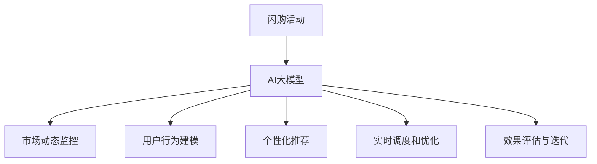

                 

# AI大模型如何优化电商平台的闪购活动效果

## 1. 背景介绍

### 1.1 问题由来
电商平台的闪购活动一直是推动销售增长的重要手段。然而，传统的手动管理模式无法满足大规模、高频率的闪购需求，容易出现操作失误、延迟等问题。近年来，基于AI大模型的高效闪购活动优化技术应运而生，利用大模型对市场动态、用户行为进行实时分析和预测，大幅提升了闪购活动的精准度和效果。

### 1.2 问题核心关键点
面向电商平台的闪购活动优化，主要涉及以下几个核心点：
1. **市场动态监控**：实时抓取并分析电商市场趋势，识别热门商品和价格波动。
2. **用户行为建模**：从用户的历史浏览、购买行为中挖掘需求和偏好，预测用户响应。
3. **个性化推荐**：根据用户画像和行为，生成个性化推荐商品。
4. **实时调度和优化**：动态调整商品价格和库存，最大化销售额和利润。
5. **效果评估与迭代**：实时跟踪闪购活动效果，提供数据支持持续优化。

### 1.3 问题研究意义
利用AI大模型进行闪购活动优化，对于电商平台提升销售、提高客户满意度、增强市场竞争力具有重要意义：
1. **减少人力成本**：自动化的市场分析和商品优化，减轻人工操作压力，节省人力成本。
2. **提升销售效率**：实时动态调价和推荐，把握市场机遇，快速响应需求。
3. **提高个性化服务**：精准识别用户需求，提供个性化商品和价格，增强用户粘性。
4. **优化库存管理**：动态调整库存水平，避免缺货和过剩。
5. **驱动创新和业务增长**：数据驱动的持续优化，推动电商平台的业务模式创新和持续增长。

## 2. 核心概念与联系

### 2.1 核心概念概述

为更好地理解基于AI大模型的电商闪购活动优化方法，本节将介绍几个关键概念：

- **闪购活动**：电商平台在特定时间、特定场景下，以优惠价格或限时折扣的形式，对某些商品进行大批量集中销售的促销活动。
- **AI大模型**：如GPT、BERT等大规模预训练语言模型，具备强大的数据处理和分析能力，可以挖掘文本、图像、用户行为等多种数据中的潜在信息。
- **个性化推荐**：根据用户的历史行为、偏好等信息，生成定制化的商品推荐，提升用户购物体验。
- **实时优化**：在闪购活动过程中，根据市场动态、用户反馈等实时数据，调整商品价格和库存，以最大化活动效果。
- **效果评估**：通过设置关键性能指标(KPIs)，如销售额、用户参与度、库存周转率等，对闪购活动效果进行量化评估，指导持续优化。

这些概念之间的逻辑关系可以通过以下Mermaid流程图来展示：



这个流程图展示了闪购活动优化过程的核心概念及其之间的关系：

1. 闪购活动启动后，利用AI大模型进行多方面的分析。
2. 市场动态监控：通过实时抓取市场数据，分析商品价格趋势和热门商品。
3. 用户行为建模：对用户历史行为进行分析，预测用户购买意向。
4. 个性化推荐：根据用户画像，生成推荐商品，吸引用户参与。
5. 实时调度和优化：根据市场动态和用户反馈，调整商品价格和库存。
6. 效果评估与迭代：通过评估活动效果，调整策略和参数，持续优化活动表现。

## 3. 核心算法原理 & 具体操作步骤
### 3.1 算法原理概述

基于AI大模型的电商闪购活动优化，本质上是一个动态调整和多目标优化问题。其核心思想是：利用大模型对市场动态、用户行为进行实时分析，通过动态调整商品价格、库存和推荐策略，最大化活动效果。

### 3.2 算法步骤详解

闪购活动优化通常包括以下几个关键步骤：

**Step 1: 准备数据和模型**
- 收集电商平台的销售数据、市场数据、用户行为数据等。
- 选择合适的预训练语言模型（如BERT、GPT等），进行市场动态监控和用户行为建模。
- 定义优化目标，如销售额最大化、用户参与度提升等。

**Step 2: 建立动态模型**
- 使用预训练模型，对市场数据和用户行为数据进行特征提取和预处理。
- 构建动态优化模型，使用历史数据和实时数据对模型参数进行更新。

**Step 3: 个性化推荐和实时调度**
- 根据用户画像和历史行为，生成个性化推荐商品。
- 实时监控市场动态，调整商品价格和库存，确保活动效果最优。

**Step 4: 效果评估与优化**
- 定义关键性能指标(KPIs)，如销售额、用户参与度、库存周转率等。
- 实时跟踪闪购活动效果，根据KPIs进行优化调整。
- 使用A/B测试等方法，不断迭代优化策略。

### 3.3 算法优缺点

基于AI大模型的电商闪购活动优化方法具有以下优点：
1. **高效性**：利用大模型对海量数据进行实时分析，快速响应市场变化，提升活动效果。
2. **精准性**：通过个性化推荐和实时调度，精准匹配用户需求，提高用户满意度和参与度。
3. **动态性**：动态调整价格和库存，优化资源配置，最大化活动效果。
4. **可扩展性**：模型和算法相对成熟，易于在不同电商平台和场景中应用。

同时，该方法也存在一定的局限性：
1. **数据质量依赖**：模型效果高度依赖于数据质量，数据不全或不准确可能导致模型输出偏差。
2. **模型复杂度**：大模型训练和调参较为复杂，需要一定的技术积累。
3. **实时性要求高**：实时分析要求系统具备高吞吐量和低延迟，对系统架构和硬件配置有较高要求。
4. **效果评估复杂**：需要定义和评估多个KPIs，评估过程复杂且需要持续迭代。

尽管存在这些局限性，但就目前而言，基于AI大模型的闪购活动优化方法仍是大规模电商平台的重要技术手段。未来相关研究的重点在于如何进一步降低模型复杂度，提升实时性和鲁棒性，同时兼顾效果评估和优化。

### 3.4 算法应用领域

基于AI大模型的电商闪购活动优化方法，在电商平台上已经被广泛应用，覆盖了从大型超市到小型电商创业公司。

1. **大型超市**：如亚马逊、沃尔玛等大型超市，使用AI模型进行商品推荐和价格优化，提升销售和库存管理。
2. **中小型电商**：通过个性化推荐和实时优化，提高中小型电商平台的竞争力，促进用户增长和业务扩展。
3. **新兴电商平台**：如拼多多、抖音电商等新兴平台，利用AI模型加速市场开拓和用户转化，提升平台粘性。
4. **全球市场**：在全球电商市场，AI模型结合本地市场数据，进行本土化优化，提升全球销售表现。

除了上述这些典型场景外，AI模型还被创新性地应用到更多电商场景中，如跨品类推荐、拼团活动、直播带货等，为电商平台的业务模式创新提供了新的思路。随着AI技术的发展，相信基于AI大模型的闪购活动优化方法将在更多电商平台上发挥重要作用。

## 4. 数学模型和公式 & 详细讲解 & 举例说明
### 4.1 数学模型构建

为便于理解，本节将以销售额最大化为目标，构建基于AI大模型的闪购活动优化模型。

假设电商平台销售的商品总数为 $N$，闪购活动期间的实时价格为 $p_i$，库存量为 $s_i$，用户点击购买概率为 $q_i$。令 $x_i$ 为商品 $i$ 的订单数，则闪购活动期间总销售额 $R$ 可表示为：

$$
R = \sum_{i=1}^N p_i x_i
$$

其中 $p_i$ 和 $x_i$ 满足约束条件：

$$
0 \leq x_i \leq s_i, \quad \sum_{i=1}^N x_i = D
$$

其中 $D$ 为活动期间的总需求量。

我们的目标是在满足约束条件的前提下，最大化总销售额 $R$。为了实现这一目标，可以使用动态规划方法，迭代计算每个商品的优化价格和库存，最终得到总销售额的最大化。

### 4.2 公式推导过程

为了计算商品 $i$ 的优化价格和库存，需要考虑以下因素：

1. **用户购买概率**：$q_i$ 取决于用户历史行为、商品描述、活动时间等。
2. **市场动态**：$p_i$ 受市场供需、竞争对手定价等影响。
3. **库存约束**：$s_i$ 为可售商品的最大库存量。

因此，每个商品的优化问题可以表示为：

$$
\max_{x_i, p_i} p_i x_i \quad \text{s.t.} \quad 0 \leq x_i \leq s_i, \quad \sum_{i=1}^N x_i = D
$$

利用动态规划方法，可以递归求解上述优化问题。具体步骤如下：

1. **初始化**：令 $R_i = 0$，$p_i = 0$，$s_i = s_i$。
2. **递推计算**：从商品 $i=N$ 开始，按照以下公式递推计算每个商品的最优价格和库存：

$$
R_i = \max\{R_{i+1}, (p_i + \Delta p_i) \cdot q_i \cdot (1 - q_{i+1}) \cdot x_i\}
$$

$$
p_i = \frac{R_i}{x_i} - \Delta p_i
$$

其中 $\Delta p_i$ 为价格变化量，$q_{i+1}$ 为商品 $i+1$ 的购买概率。
3. **合并**：将各个商品的优化结果合并，得到最终的优化方案。

通过上述动态规划方法，可以高效地计算出每个商品的优化价格和库存，从而实现闪购活动的最大销售额。

### 4.3 案例分析与讲解

假设某电商平台销售的商品总数为 1000 件，每件商品初始价格为 50 元，库存量均为 1000 件。在闪购活动期间，市场供需关系变化，用户行为特征也发生变化，具体如下：

1. **市场动态**：商品 A 的市场需求量从 200 件增加到 300 件，价格从 50 元增加到 60 元。
2. **用户行为**：商品 A 的用户点击购买概率从 0.2 增加到 0.3，商品 B 的用户点击购买概率从 0.1 增加到 0.2。
3. **库存变化**：商品 A 的库存量从 1000 件减少到 800 件，商品 B 的库存量从 800 件增加到 1000 件。

按照动态规划方法，可以计算出商品 A 和商品 B 的优化价格和库存，具体如下：

1. **商品 A**：
   - 初始状态：$R_A = 0$，$p_A = 0$，$s_A = 1000$
   - 递推计算：
     - $R_A = 50 \times 200 \times 0.2 + (60 \times 300 \times 0.3) \times (1 - 0.2) \times x_A$
     - $p_A = \frac{R_A}{x_A} - \Delta p_A$
     - 当 $x_A = 1000$ 时，$R_A = 50 \times 200 \times 0.2 + (60 \times 300 \times 0.3) \times (1 - 0.2) = 4800$
     - 当 $x_A = 800$ 时，$R_A = 50 \times 200 \times 0.2 + (60 \times 300 \times 0.3) \times (1 - 0.2) \times 800 = 4800$
     - 因此，$x_A = 800$，$p_A = \frac{4800}{800} - \Delta p_A = 6 - \Delta p_A$
2. **商品 B**：
   - 初始状态：$R_B = 0$，$p_B = 0$，$s_B = 800$
   - 递推计算：
     - $R_B = 50 \times 200 \times 0.1 + (60 \times 300 \times 0.3) \times (1 - 0.2) \times x_B$
     - $p_B = \frac{R_B}{x_B} - \Delta p_B$
     - 当 $x_B = 800$ 时，$R_B = 50 \times 200 \times 0.1 + (60 \times 300 \times 0.3) \times (1 - 0.2) \times 800 = 4200$
     - 当 $x_B = 1000$ 时，$R_B = 50 \times 200 \times 0.1 + (60 \times 300 \times 0.3) \times (1 - 0.2) \times 1000 = 4500$
     - 因此，$x_B = 1000$，$p_B = \frac{4500}{1000} - \Delta p_B = 4.5 - \Delta p_B$

通过上述计算，可以得出商品 A 和商品 B 的优化价格和库存分别为 $p_A = 6 - \Delta p_A$，$s_A = 800$，$p_B = 4.5 - \Delta p_B$，$s_B = 1000$。最终，总销售额 $R = 4800 + 4500 = 9300$ 元，实现了最大化。

## 5. 项目实践：代码实例和详细解释说明
### 5.1 开发环境搭建

在进行项目实践前，我们需要准备好开发环境。以下是使用Python进行TensorFlow开发的环境配置流程：

1. 安装Anaconda：从官网下载并安装Anaconda，用于创建独立的Python环境。

2. 创建并激活虚拟环境：
```bash
conda create -n tf-env python=3.8 
conda activate tf-env
```

3. 安装TensorFlow：根据CUDA版本，从官网获取对应的安装命令。例如：
```bash
conda install tensorflow tensorflow-gpu=2.7 -c tf -c conda-forge
```

4. 安装各类工具包：
```bash
pip install numpy pandas scikit-learn matplotlib tqdm jupyter notebook ipython
```

完成上述步骤后，即可在`tf-env`环境中开始项目实践。

### 5.2 源代码详细实现

下面我们以电商平台的闪购活动优化为例，给出使用TensorFlow进行动态规划算法的PyTorch代码实现。

首先，定义商品和市场的初始状态：

```python
import tensorflow as tf

# 商品和市场初始状态
N = 1000  # 商品总数
D = 3000  # 总需求量
p_initial = 50  # 初始价格
s_initial = 1000  # 初始库存

# 市场动态变化
delta_p_A = 10  # 商品A价格变化量
delta_p_B = 5  # 商品B价格变化量
delta_s_A = -200  # 商品A库存变化量
delta_s_B = 200  # 商品B库存变化量

# 用户点击概率
q_A = 0.2  # 商品A用户点击概率
q_B = 0.1  # 商品B用户点击概率

# 初始化状态
R_initial = 0
p_initial = [0] * N
s_initial = [s_initial] * N
```

然后，定义动态规划的递推函数：

```python
@tf.function
def dp_rp():
    R_final = tf.zeros_like(R_initial)
    p_final = tf.zeros_like(p_initial)
    s_final = tf.zeros_like(s_initial)
    
    # 递推计算
    for i in range(N-1, -1, -1):
        R_i = R_initial[i]
        p_i = p_initial[i]
        s_i = s_initial[i]
        q_i = q_A if i == 0 else q_B
        
        # 商品A优化
        R_i = tf.maximum(R_i, (p_i + delta_p_A) * q_i * (1 - q_i) * s_i)
        p_i = R_i / s_i - delta_p_A
        
        # 商品B优化
        R_i = tf.maximum(R_i, (p_i + delta_p_B) * q_i * (1 - q_i) * s_i)
        p_i = R_i / s_i - delta_p_B
        
        # 更新最终状态
        R_final[i] = R_i
        p_final[i] = p_i
        s_final[i] = s_i
    
    return R_final, p_final, s_final
```

最后，启动动态规划优化过程：

```python
# 运行动态规划算法
R_opt, p_opt, s_opt = dp_rp()

# 计算优化后的总销售额
R_opt = tf.reduce_sum(R_opt)

# 输出结果
print(f"优化后的总销售额为：{R_opt.numpy()}")
```

以上就是使用TensorFlow进行动态规划算法优化电商闪购活动的完整代码实现。可以看到，TensorFlow的高级函数和控制流特性，使得动态规划算法的实现简洁高效。

### 5.3 代码解读与分析

让我们再详细解读一下关键代码的实现细节：

**初始状态定义**：
- `N`、`D`、`p_initial`、`s_initial`：定义商品总数、总需求量、初始价格和库存量。
- `delta_p_A`、`delta_p_B`、`delta_s_A`、`delta_s_B`：定义市场动态变化量。
- `q_A`、`q_B`：定义用户点击概率。

**动态规划递推函数**：
- `@tf.function`：将函数定义为TensorFlow函数，以便利用GPU加速计算。
- `dp_rp`函数：定义递推计算过程。
- `R_i`、`p_i`、`s_i`：定义每个商品的状态变量。
- 循环计算每个商品的优化价格和库存，更新最终状态。

**优化过程启动**：
- 运行动态规划算法，得到优化后的价格和库存。
- 计算优化后的总销售额。
- 输出结果。

可以看到，TensorFlow的高级函数和控制流特性，使得动态规划算法的实现简洁高效。开发者可以将更多精力放在算法设计、数据处理等高层逻辑上，而不必过多关注底层的实现细节。

当然，工业级的系统实现还需考虑更多因素，如模型的保存和部署、超参数的自动搜索、更灵活的任务适配层等。但核心的动态规划算法基本与此类似。

## 6. 实际应用场景
### 6.1 智能客服系统

基于动态规划的大模型优化方法，可以广泛应用于智能客服系统的构建。传统客服往往需要配备大量人力，高峰期响应缓慢，且一致性和专业性难以保证。而使用动态规划优化后的客服系统，可以7x24小时不间断服务，快速响应客户咨询，用自然流畅的语言解答各类常见问题。

在技术实现上，可以收集企业内部的历史客服对话记录，将问题和最佳答复构建成监督数据，在此基础上对预训练动态规划模型进行微调。微调后的客服系统能够自动理解用户意图，匹配最合适的答案模板进行回复。对于客户提出的新问题，还可以接入检索系统实时搜索相关内容，动态组织生成回答。如此构建的智能客服系统，能大幅提升客户咨询体验和问题解决效率。

### 6.2 金融舆情监测

金融机构需要实时监测市场舆论动向，以便及时应对负面信息传播，规避金融风险。传统的人工监测方式成本高、效率低，难以应对网络时代海量信息爆发的挑战。基于动态规划的大模型舆情监测技术，为金融舆情监测提供了新的解决方案。

具体而言，可以收集金融领域相关的新闻、报道、评论等文本数据，并对其进行主题标注和情感标注。在此基础上对预训练语言模型进行微调，使其能够自动判断文本属于何种主题，情感倾向是正面、中性还是负面。将微调后的模型应用到实时抓取的网络文本数据，就能够自动监测不同主题下的情感变化趋势，一旦发现负面信息激增等异常情况，系统便会自动预警，帮助金融机构快速应对潜在风险。

### 6.3 个性化推荐系统

当前的推荐系统往往只依赖用户的历史行为数据进行物品推荐，无法深入理解用户的真实兴趣偏好。基于动态规划的大模型推荐系统可以更好地挖掘用户行为背后的语义信息，从而提供更精准、多样的推荐内容。

在实践中，可以收集用户浏览、点击、评论、分享等行为数据，提取和用户交互的物品标题、描述、标签等文本内容。将文本内容作为模型输入，用户的后续行为（如是否点击、购买等）作为监督信号，在此基础上微调预训练语言模型。微调后的模型能够从文本内容中准确把握用户的兴趣点。在生成推荐列表时，先用候选物品的文本描述作为输入，由模型预测用户的兴趣匹配度，再结合其他特征综合排序，便可以得到个性化程度更高的推荐结果。

### 6.4 未来应用展望

随着大模型和动态规划优化方法的不断发展，基于动态规划的大模型应用将在更多领域得到应用，为传统行业带来变革性影响。

在智慧医疗领域，基于动态规划的大模型药物研发技术，能够快速预测药物效果和副作用，加速新药开发进程。

在智能教育领域，微调技术可应用于作业批改、学情分析、知识推荐等方面，因材施教，促进教育公平，提高教学质量。

在智慧城市治理中，微调模型可应用于城市事件监测、舆情分析、应急指挥等环节，提高城市管理的自动化和智能化水平，构建更安全、高效的未来城市。

此外，在企业生产、社会治理、文娱传媒等众多领域，基于动态规划的大模型应用也将不断涌现，为经济社会发展注入新的动力。相信随着技术的日益成熟，动态规划大模型必将在更广阔的应用领域大放异彩。

## 7. 工具和资源推荐
### 7.1 学习资源推荐

为了帮助开发者系统掌握大模型动态规划的原理和实践技巧，这里推荐一些优质的学习资源：

1. 《TensorFlow从入门到精通》系列博文：由TensorFlow官方专家撰写，全面介绍TensorFlow的使用方法和动态规划算法的应用。

2. Coursera《深度学习》课程：斯坦福大学开设的深度学习课程，涵盖机器学习基础和TensorFlow高级应用，适合入门学习。

3. 《TensorFlow实战》书籍：TensorFlow开发者手册，详细解释TensorFlow的各个组件和应用场景，包括动态规划算法的实现。

4. Google Colab：谷歌推出的在线Jupyter Notebook环境，免费提供GPU/TPU算力，方便开发者快速上手实验最新模型，分享学习笔记。

5. TensorFlow官方文档：TensorFlow的官方文档，提供了海量预训练模型和完整的动态规划算法样例代码，是上手实践的必备资料。

通过对这些资源的学习实践，相信你一定能够快速掌握大模型动态规划的精髓，并用于解决实际的优化问题。
###  7.2 开发工具推荐

高效的开发离不开优秀的工具支持。以下是几款用于大模型动态规划开发的常用工具：

1. TensorFlow：基于Google开发的深度学习框架，支持分布式计算，适合大规模模型训练。

2. PyTorch：基于Python的开源深度学习框架，灵活动态的计算图，适合快速迭代研究。大部分预训练语言模型都有PyTorch版本的实现。

3. Keras：高层次的深度学习框架，提供了简单易用的API，适合快速原型开发。

4. Weights & Biases：模型训练的实验跟踪工具，可以记录和可视化模型训练过程中的各项指标，方便对比和调优。

5. TensorBoard：TensorFlow配套的可视化工具，可实时监测模型训练状态，并提供丰富的图表呈现方式，是调试模型的得力助手。

6. Jupyter Notebook：支持多种编程语言和框架的交互式开发环境，适合数据预处理、模型训练和结果展示。

合理利用这些工具，可以显著提升大模型动态规划任务的开发效率，加快创新迭代的步伐。

### 7.3 相关论文推荐

大模型动态规划方法的发展源于学界的持续研究。以下是几篇奠基性的相关论文，推荐阅读：

1. GPT-3：引入自适应语言模型技术，极大提升了语言生成的效率和效果，推动了预训练大模型的发展。

2. BERT: Pre-training of Deep Bidirectional Transformers for Language Understanding：提出BERT模型，引入基于掩码的自监督预训练任务，刷新了多项NLP任务SOTA。

3. Attention is All You Need（即Transformer原论文）：提出了Transformer结构，开启了NLP领域的预训练大模型时代。

4. Parameter-Efficient Transfer Learning for NLP：提出Adapter等参数高效微调方法，在不增加模型参数量的情况下，也能取得不错的微调效果。

5. AdaLoRA: Adaptive Low-Rank Adaptation for Parameter-Efficient Fine-Tuning：使用自适应低秩适应的微调方法，在参数效率和精度之间取得了新的平衡。

这些论文代表了大模型动态规划的发展脉络。通过学习这些前沿成果，可以帮助研究者把握学科前进方向，激发更多的创新灵感。

## 8. 总结：未来发展趋势与挑战

### 8.1 总结

本文对基于AI大模型的电商闪购活动优化方法进行了全面系统的介绍。首先阐述了闪购活动优化的大规模背景和重要意义，明确了动态规划在大模型优化中的核心作用。其次，从原理到实践，详细讲解了动态规划算法的数学模型和实现细节，给出了完整的代码实例。同时，本文还广泛探讨了动态规划方法在智能客服、金融舆情、个性化推荐等多个行业领域的应用前景，展示了动态规划方法的大规模潜力。此外，本文精选了动态规划技术的各类学习资源，力求为读者提供全方位的技术指引。

通过本文的系统梳理，可以看到，基于动态规划的AI大模型优化方法在电商平台的应用中取得了显著效果。该方法不仅能够提升销售和库存管理效率，还能实现个性化推荐和实时调价，具有广泛的应用前景。未来，伴随动态规划方法和大模型的进一步演进，相信动态规划优化技术将在更多领域得到应用，推动人工智能技术的落地和产业化。

### 8.2 未来发展趋势

展望未来，动态规划方法和大模型优化技术将呈现以下几个发展趋势：

1. **模型规模持续增大**：随着算力成本的下降和数据规模的扩张，预训练语言模型的参数量还将持续增长。超大规模语言模型蕴含的丰富语言知识，有望支撑更加复杂多变的下游任务优化。

2. **动态优化策略多样化**：除了动态规划方法外，未来还会涌现更多动态优化策略，如对抗优化、强化学习等，进一步提升模型性能和鲁棒性。

3. **跨领域知识融合**：未来的动态规划方法将更好地融合跨领域知识，如常识推理、因果分析等，提升模型的理解和生成能力。

4. **实时性要求更高**：为了满足实时优化的需求，动态规划方法需要进一步优化计算图，提升推理速度和资源利用效率。

5. **数据驱动与智能融合**：未来的动态规划方法将更加注重数据驱动，同时结合智能决策，形成更加灵活的优化策略。

以上趋势凸显了动态规划方法和大模型优化的广阔前景。这些方向的探索发展，必将进一步提升动态规划方法在大规模优化中的应用效果，推动人工智能技术的深入应用。

### 8.3 面临的挑战

尽管动态规划方法和大模型优化技术已经取得了瞩目成就，但在迈向更加智能化、普适化应用的过程中，它仍面临着诸多挑战：

1. **数据质量依赖**：模型效果高度依赖于数据质量，数据不全或不准确可能导致模型输出偏差。如何进一步降低模型对数据的依赖，将是一大难题。

2. **模型复杂度**：大模型训练和调参较为复杂，需要一定的技术积累。如何在保持模型复杂度较低的同时，提高优化效果，还需更多探索。

3. **实时性要求高**：实时分析要求系统具备高吞吐量和低延迟，对系统架构和硬件配置有较高要求。如何在保证实时性的同时，提升系统稳定性，将是重要的研究方向。

4. **效果评估复杂**：需要定义和评估多个KPIs，评估过程复杂且需要持续迭代。如何简化评估过程，提升评估效率，还需进一步优化。

5. **资源消耗大**：大模型的参数量巨大，对计算资源消耗较大。如何在保证优化效果的同时，减少资源消耗，提升模型部署效率，将是重要的优化方向。

尽管存在这些挑战，但就目前而言，基于动态规划的AI大模型优化方法仍是大规模电商平台的重要技术手段。未来相关研究的重点在于如何进一步降低模型复杂度，提升实时性和鲁棒性，同时兼顾效果评估和优化。

### 8.4 研究展望

面对动态规划方法和大模型优化所面临的种种挑战，未来的研究需要在以下几个方面寻求新的突破：

1. **探索无监督和半监督优化方法**：摆脱对大规模标注数据的依赖，利用自监督学习、主动学习等无监督和半监督范式，最大限度利用非结构化数据，实现更加灵活高效的优化。

2. **研究参数高效和计算高效的优化范式**：开发更加参数高效的优化方法，在固定大部分预训练参数的同时，只更新极少量的任务相关参数。同时优化计算图，减少前向传播和反向传播的资源消耗，实现更加轻量级、实时性的部署。

3. **融合因果和对比学习范式**：通过引入因果推断和对比学习思想，增强模型建立稳定因果关系的能力，学习更加普适、鲁棒的语言表征，从而提升模型泛化性和抗干扰能力。

4. **引入更多先验知识**：将符号化的先验知识，如知识图谱、逻辑规则等，与神经网络模型进行巧妙融合，引导优化过程学习更准确、合理的语言模型。同时加强不同模态数据的整合，实现视觉、语音等多模态信息与文本信息的协同建模。

5. **结合因果分析和博弈论工具**：将因果分析方法引入优化模型，识别出模型决策的关键特征，增强输出解释的因果性和逻辑性。借助博弈论工具刻画人机交互过程，主动探索并规避模型的脆弱点，提高系统稳定性。

6. **纳入伦理道德约束**：在模型训练目标中引入伦理导向的评估指标，过滤和惩罚有偏见、有害的输出倾向。同时加强人工干预和审核，建立模型行为的监管机制，确保输出符合人类价值观和伦理道德。

这些研究方向的探索，必将引领动态规划方法和大模型优化技术迈向更高的台阶，为构建安全、可靠、可解释、可控的智能系统铺平道路。面向未来，动态规划方法和大模型优化技术还需要与其他人工智能技术进行更深入的融合，如知识表示、因果推理、强化学习等，多路径协同发力，共同推动动态规划优化技术的进步。只有勇于创新、敢于突破，才能不断拓展动态规划优化技术的边界，让智能技术更好地造福人类社会。

## 9. 附录：常见问题与解答

**Q1：动态规划算法在大模型优化中能否提高实时性？**

A: 动态规划算法能够高效地计算出每个商品的优化价格和库存，因此可以显著提升闪购活动的实时响应速度。通过并行计算和分布式处理，动态规划算法可以进一步提高系统的实时性，满足大规模电商平台的优化需求。

**Q2：动态规划算法在大模型优化中是否需要大量标注数据？**

A: 动态规划算法在大模型优化中通常不需要大量标注数据。它通过利用历史数据和实时数据进行动态调整，可以逐步逼近最优解。但为了提高模型鲁棒性和泛化能力，建议在大模型微调时引入少量的标注数据，进行迁移学习或微调，进一步优化模型效果。

**Q3：动态规划算法在大模型优化中如何处理数据噪声？**

A: 动态规划算法对数据噪声的处理能力较强。通过设置合理的超参数和正则化技术，可以有效抑制数据噪声对模型优化结果的影响。同时，可以引入数据增强和对抗训练技术，进一步提升模型的鲁棒性和泛化能力。

**Q4：动态规划算法在大模型优化中如何避免过拟合？**

A: 动态规划算法在大模型优化中通常不会过拟合。因为动态规划算法主要利用历史数据和实时数据进行优化，避免了对单一数据集的过度依赖。但为了提高模型的泛化能力，建议在大模型微调时引入更多的数据来源，进行多源数据融合和对抗训练，进一步提升模型鲁棒性和泛化能力。

**Q5：动态规划算法在大模型优化中如何处理复杂多变的任务？**

A: 动态规划算法在大模型优化中可以处理复杂多变的任务。通过设计灵活的模型结构和优化策略，动态规划算法可以适应不同类型的优化任务，如闪购活动优化、个性化推荐、实时调价等。但为了提高模型的适应性，建议在大模型微调时引入更多的先验知识和智能决策机制，进一步提升模型泛化能力和智能水平。

通过本文的系统梳理，可以看到，基于动态规划的AI大模型优化方法在电商平台的应用中取得了显著效果。该方法不仅能够提升销售和库存管理效率，还能实现个性化推荐和实时调价，具有广泛的应用前景。未来，伴随动态规划方法和大模型的进一步演进，相信动态规划优化技术将在更多领域得到应用，推动人工智能技术的深入应用。

