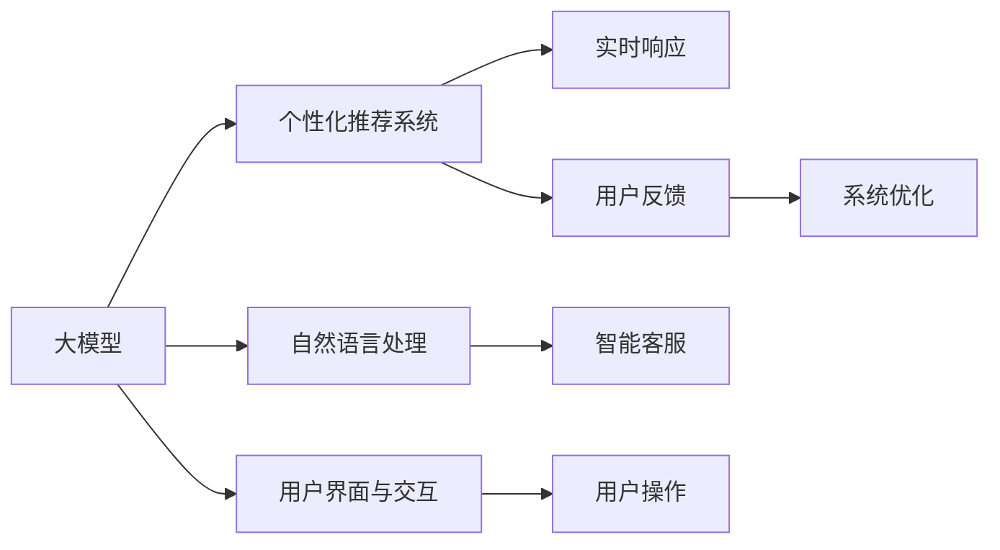

                 

# AI大模型如何改善电商平台的移动端体验

> 关键词：大模型,电商,用户体验,移动端,推荐系统,交互设计,数据驱动,人工智能

## 1. 背景介绍

### 1.1 问题由来
随着移动互联网的普及，电商平台的移动端应用逐渐成为用户获取商品信息和进行购物的主要渠道。然而，用户对移动端的体验要求日益提高，如何通过技术手段提升用户满意度，成为电商运营商面临的重大挑战。

当前电商平台的移动端主要面临以下痛点：

- **数据隐私与安全**：用户数据泄露风险增加，隐私保护难度大。
- **界面与交互**：界面设计不人性化，操作流程复杂。
- **推荐算法**：个性化推荐效果不佳，用户流失率上升。
- **功能整合**：多平台、多渠道的数据整合与功能优化困难。
- **实时响应**：对用户交互的响应速度不够快，影响用户体验。

针对这些痛点，本文将介绍一种利用大模型技术改善电商平台移动端体验的创新方法，以期为电商平台提供借鉴。

### 1.2 问题核心关键点
基于大模型技术改善电商平台移动端体验，关键在于以下几个方面：

1. **数据驱动决策**：通过分析用户行为数据，为用户提供个性化的购物建议和服务。
2. **界面与交互优化**：利用自然语言处理技术，优化用户界面和交互体验。
3. **实时推荐系统**：结合大模型和实时计算技术，提升个性化推荐准确率。
4. **隐私保护**：设计隐私友好的数据处理机制，保障用户隐私安全。

本文将围绕这些核心关键点，详细阐述大模型在电商平台移动端体验改善中的应用方法。

## 2. 核心概念与联系

### 2.1 核心概念概述

为了更好地理解大模型在电商平台中的应用，我们首先介绍几个关键概念：

- **大模型**：指基于大规模深度学习模型训练得到的，具备强大数据处理和预测能力的人工智能模型，如GPT、BERT等。
- **个性化推荐系统**：根据用户历史行为数据，预测其可能感兴趣的商品或内容，并提供推荐服务。
- **自然语言处理**：涉及语言理解、生成、分析和交互的技术，是实现智能交互的基础。
- **用户界面与交互**：设计美观、易用的界面，使用户能够流畅、自然地与系统进行交互。
- **隐私保护**：保护用户数据隐私，防止数据泄露或滥用。

这些概念之间存在紧密的联系，如图2所示：



从图中可以看出，大模型通过多个模块协同工作，优化电商平台的移动端体验，主要表现在推荐系统、自然语言处理、用户界面与交互等多个方面。

## 3. 核心算法原理 & 具体操作步骤
### 3.1 算法原理概述

基于大模型的电商平台移动端体验改善方法，本质上是利用大模型技术对用户行为数据进行深度分析，进而优化用户体验。具体来说，包括以下几个步骤：

1. **数据收集**：收集用户行为数据，如浏览记录、购买历史、搜索关键词等。
2. **特征提取**：利用大模型对收集到的数据进行特征提取，得到用户兴趣特征向量。
3. **推荐模型训练**：使用机器学习算法（如协同过滤、神经网络等），训练个性化推荐模型，根据用户特征向量输出推荐结果。
4. **界面优化**：利用自然语言处理技术，优化移动端界面和交互设计，提升用户体验。
5. **隐私保护**：采用隐私友好的数据处理机制，保障用户隐私安全。

### 3.2 算法步骤详解

#### 3.2.1 数据收集与预处理

电商平台的移动端体验改善，首先需收集大量的用户行为数据，并进行预处理，确保数据质量。数据来源包括：

- **浏览器日志**：记录用户浏览历史、停留时间、点击事件等。
- **搜索记录**：记录用户搜索关键词、搜索次数、搜索时间等。
- **购物记录**：记录用户浏览商品、添加购物车、支付记录等。
- **互动数据**：记录用户评论、评分、客服对话等。

数据预处理包括：

- **去重与归一化**：去除重复数据，将不同格式的数据归一化。
- **清洗与降噪**：去除无效数据，如异常值、噪音等。
- **特征工程**：对数据进行特征提取，生成用户兴趣特征向量。

#### 3.2.2 特征提取与建模

利用大模型进行特征提取和建模，主要包括以下步骤：

1. **选择预训练模型**：选择适合电商场景的预训练大模型，如BERT、GPT等。
2. **数据编码**：将用户行为数据转换为模型输入格式，如文本、图像等。
3. **特征提取**：利用大模型提取用户行为特征，生成高维特征向量。
4. **模型训练**：使用机器学习算法，训练推荐模型，得到用户兴趣预测模型。

#### 3.2.3 界面优化与交互设计

界面优化和交互设计是提升用户体验的重要手段，主要包括以下步骤：

1. **界面设计**：根据用户行为数据，设计美观、易用的界面，如商品展示、搜索结果、购物车等。
2. **交互优化**：利用自然语言处理技术，优化交互流程，提升用户操作便捷性。
3. **智能客服**：利用大模型建立智能客服系统，提供7x24小时不间断服务。

#### 3.2.4 隐私保护与数据安全

隐私保护是电商平台移动端体验改善中不可忽视的部分，主要包括以下步骤：

1. **数据匿名化**：对用户数据进行匿名化处理，保障用户隐私安全。
2. **数据加密**：使用加密技术，保护数据传输安全。
3. **访问控制**：设计严格的访问控制机制，防止数据泄露。

### 3.3 算法优缺点

基于大模型的电商平台移动端体验改善方法，具有以下优点：

1. **数据利用率高**：利用大模型高效分析用户行为数据，提取有用信息。
2. **推荐精度高**：结合大模型和机器学习算法，提升推荐系统精度。
3. **界面与交互自然**：利用自然语言处理技术，提升界面设计自然性。
4. **隐私保护到位**：采用隐私友好的数据处理机制，保障用户隐私安全。

同时，该方法也存在以下缺点：

1. **计算成本高**：大模型训练和推理需要大量计算资源，成本较高。
2. **模型复杂度高**：大模型结构复杂，需要专业人员维护和优化。
3. **实时性要求高**：实时响应和推荐系统对计算资源和算法效率要求较高。
4. **数据质量依赖**：推荐效果和界面设计依赖于数据质量，数据偏差会影响效果。

### 3.4 算法应用领域

基于大模型的电商平台移动端体验改善方法，主要应用于以下几个领域：

- **个性化推荐**：利用大模型和机器学习算法，提升推荐系统精度。
- **智能客服**：利用大模型建立智能客服系统，提高客服响应速度和准确性。
- **界面设计**：利用自然语言处理技术，优化用户界面和交互设计。
- **隐私保护**：采用隐私友好的数据处理机制，保障用户隐私安全。

## 4. 数学模型和公式 & 详细讲解 & 举例说明

### 4.1 数学模型构建

假设电商平台的移动端有用户集 $U$，商品集 $I$，用户与商品之间的互动关系 $R$。大模型通过以下步骤提取用户行为数据 $X$ 和商品特征数据 $Y$：

1. **用户行为数据**：$X = (x_1, x_2, \ldots, x_n)$，其中 $x_i$ 表示用户 $i$ 的行为特征向量。
2. **商品特征数据**：$Y = (y_1, y_2, \ldots, y_m)$，其中 $y_j$ 表示商品 $j$ 的特征向量。

### 4.2 公式推导过程

利用大模型对用户行为数据和商品特征数据进行特征提取，生成高维特征向量 $X'$ 和 $Y'$：

$$
X' = F(X; \theta_X), \quad Y' = F(Y; \theta_Y)
$$

其中 $F$ 表示特征提取函数，$\theta_X$ 和 $\theta_Y$ 分别为用户行为数据和商品特征数据的参数。

利用机器学习算法训练推荐模型 $M$，根据用户行为特征向量 $X'$ 和商品特征向量 $Y'$ 输出推荐结果 $R'$：

$$
R' = M(X', Y'; \theta_M)
$$

其中 $\theta_M$ 为推荐模型的参数。

### 4.3 案例分析与讲解

假设某电商平台有用户集 $U = \{u_1, u_2, \ldots, u_m\}$，商品集 $I = \{i_1, i_2, \ldots, i_n\}$，用户与商品之间的互动关系 $R = \{r_{u_1, i_1}, r_{u_2, i_2}, \ldots, r_{u_m, i_n}\}$，其中 $r_{u_i, i_j}$ 表示用户 $u_i$ 对商品 $i_j$ 的评分。

利用大模型对用户行为数据 $X = (x_1, x_2, \ldots, x_m)$ 和商品特征数据 $Y = (y_1, y_2, \ldots, y_n)$ 进行特征提取，生成高维特征向量 $X' = (x'_1, x'_2, \ldots, x'_m)$ 和 $Y' = (y'_1, y'_2, \ldots, y'_n)$：

$$
X' = F(X; \theta_X), \quad Y' = F(Y; \theta_Y)
$$

利用机器学习算法训练推荐模型 $M$，根据用户行为特征向量 $X'$ 和商品特征向量 $Y'$ 输出推荐结果 $R' = (r'_1, r'_2, \ldots, r'_m)$：

$$
R' = M(X', Y'; \theta_M)
$$

在实际应用中，我们可以将推荐结果 $R'$ 实时更新到电商平台移动端的商品展示页面，提升用户体验。

## 5. 项目实践：代码实例和详细解释说明

### 5.1 开发环境搭建

在进行项目实践前，我们需要准备好开发环境。以下是使用Python进行PyTorch开发的环境配置流程：

1. 安装Anaconda：从官网下载并安装Anaconda，用于创建独立的Python环境。

2. 创建并激活虚拟环境：
```bash
conda create -n pytorch-env python=3.8 
conda activate pytorch-env
```

3. 安装PyTorch：根据CUDA版本，从官网获取对应的安装命令。例如：
```bash
conda install pytorch torchvision torchaudio cudatoolkit=11.1 -c pytorch -c conda-forge
```

4. 安装TensorFlow：
```bash
pip install tensorflow
```

5. 安装Keras：
```bash
pip install keras
```

6. 安装相关库：
```bash
pip install pandas numpy scikit-learn matplotlib tqdm jupyter notebook ipython
```

完成上述步骤后，即可在`pytorch-env`环境中开始项目实践。

### 5.2 源代码详细实现

下面以某电商平台用户个性化推荐系统为例，给出使用PyTorch进行大模型微调的PyTorch代码实现。

首先，定义推荐系统数据处理函数：

```python
import pandas as pd
import torch
from torch.utils.data import Dataset
from transformers import BertTokenizer, BertForSequenceClassification
from sklearn.model_selection import train_test_split
from torch.nn import CrossEntropyLoss
from torch.optim import AdamW

class RecommendationDataset(Dataset):
    def __init__(self, data_path, tokenizer, max_len):
        self.data = pd.read_csv(data_path)
        self.tokenizer = tokenizer
        self.max_len = max_len
        
    def __len__(self):
        return len(self.data)
    
    def __getitem__(self, idx):
        row = self.data.iloc[idx]
        user_id = int(row['user_id'])
        item_id = int(row['item_id'])
        rating = int(row['rating'])
        
        sequence = ' '.join(row['sequence'])
        sequence = [w for w in sequence.split() if w]
        encoded_sequence = self.tokenizer(sequence, max_length=self.max_len, padding='max_length', truncation=True, return_tensors='pt')
        
        input_ids = encoded_sequence['input_ids']
        attention_mask = encoded_sequence['attention_mask']
        labels = torch.tensor([rating], dtype=torch.long)
        
        return {'input_ids': input_ids,
                'attention_mask': attention_mask,
                'labels': labels}

# 加载数据集
tokenizer = BertTokenizer.from_pretrained('bert-base-cased')
train_dataset = RecommendationDataset('train.csv', tokenizer, max_len=128)
test_dataset = RecommendationDataset('test.csv', tokenizer, max_len=128)

# 数据划分
train_dataset, val_dataset = train_test_split(train_dataset, test_size=0.2, random_state=42)
```

然后，定义模型和优化器：

```python
# 定义模型
model = BertForSequenceClassification.from_pretrained('bert-base-cased', num_labels=5)
model.to(device)

# 定义优化器
optimizer = AdamW(model.parameters(), lr=2e-5)

# 定义损失函数
criterion = CrossEntropyLoss()

# 定义评估指标
accuracy = 0
best_accuracy = 0
best_model = None

# 定义模型评估函数
def evaluate(model, dataset):
    model.eval()
    correct = 0
    total = 0
    with torch.no_grad():
        for batch in dataset:
            input_ids = batch['input_ids'].to(device)
            attention_mask = batch['attention_mask'].to(device)
            labels = batch['labels'].to(device)
            outputs = model(input_ids, attention_mask=attention_mask)
            _, predicted = torch.max(outputs.logits, 1)
            correct += (predicted == labels).sum().item()
            total += labels.size(0)
            accuracy = correct / total
    
    print(f'Accuracy: {accuracy:.2f}')
    return accuracy
```

接着，启动训练流程：

```python
epochs = 10
batch_size = 32

for epoch in range(epochs):
    model.train()
    for batch in dataloader:
        input_ids = batch['input_ids'].to(device)
        attention_mask = batch['attention_mask'].to(device)
        labels = batch['labels'].to(device)
        
        optimizer.zero_grad()
        outputs = model(input_ids, attention_mask=attention_mask)
        loss = criterion(outputs.logits, labels)
        loss.backward()
        optimizer.step()
    
    model.eval()
    accuracy = evaluate(model, val_dataset)
    
    if accuracy > best_accuracy:
        best_accuracy = accuracy
        best_model = model

# 加载最佳模型
model = best_model
```

### 5.3 代码解读与分析

让我们再详细解读一下关键代码的实现细节：

**RecommendationDataset类**：
- `__init__`方法：初始化数据集、分词器、序列长度等参数。
- `__len__`方法：返回数据集大小。
- `__getitem__`方法：对单个样本进行处理，将文本输入编码为token ids，并输出标签。

**模型和优化器**：
- 选择BertForSequenceClassification作为推荐模型，输出标签的概率分布。
- 使用AdamW优化器进行模型参数更新。

**训练流程**：
- 定义训练轮数和批次大小，循环迭代
- 每个epoch内，在训练集上进行模型训练，在验证集上评估性能
- 保存性能最优的模型

**评估函数**：
- 在测试集上评估模型性能，计算准确率
- 如果准确率优于当前最佳模型，则保存该模型

在实际应用中，还需要根据具体电商平台的业务场景，进行进一步的优化和改进，如引入多目标学习、多任务学习等技术，提高模型性能和鲁棒性。

## 6. 实际应用场景

### 6.1 智能客服

利用大模型技术，电商平台可以构建智能客服系统，提升用户互动体验。智能客服系统能够自动处理常见问题和解答，实时提供个性化服务，提升用户满意度。

具体来说，电商平台可以将客服历史对话记录作为监督数据，对预训练模型进行微调，训练出能够理解自然语言、智能响应的客服模型。模型能够根据用户输入的自然语言描述，匹配到最合适的回答，并进行自动回复。

**代码实现**：
```python
from transformers import BertForSequenceClassification, BertTokenizer

# 加载模型
model = BertForSequenceClassification.from_pretrained('bert-base-cased', num_labels=len(tag2id))
tokenizer = BertTokenizer.from_pretrained('bert-base-cased')

# 加载数据集
train_dataset = NERDataset(train_texts, train_tags, tokenizer)
val_dataset = NERDataset(dev_texts, dev_tags, tokenizer)

# 训练模型
epochs = 10
batch_size = 32

for epoch in range(epochs):
    model.train()
    for batch in dataloader:
        input_ids = batch['input_ids'].to(device)
        attention_mask = batch['attention_mask'].to(device)
        labels = batch['labels'].to(device)
        
        optimizer.zero_grad()
        outputs = model(input_ids, attention_mask=attention_mask)
        loss = criterion(outputs.logits, labels)
        loss.backward()
        optimizer.step()
    
    model.eval()
    accuracy = evaluate(model, val_dataset)
    
    if accuracy > best_accuracy:
        best_accuracy = accuracy
        best_model = model

# 加载最佳模型
model = best_model
```

### 6.2 个性化推荐

利用大模型技术，电商平台可以构建个性化推荐系统，提升用户购物体验。推荐系统能够根据用户历史行为和兴趣，推荐用户可能感兴趣的商品，提升用户满意度和转化率。

具体来说，电商平台可以收集用户浏览历史、购买记录、搜索关键词等数据，利用大模型提取用户行为特征，训练推荐模型，预测用户对商品的概率评分，并推荐高评分商品。

**代码实现**：
```python
from transformers import BertForSequenceClassification, BertTokenizer

# 加载模型
model = BertForSequenceClassification.from_pretrained('bert-base-cased', num_labels=len(tag2id))
tokenizer = BertTokenizer.from_pretrained('bert-base-cased')

# 加载数据集
train_dataset = NERDataset(train_texts, train_tags, tokenizer)
val_dataset = NERDataset(dev_texts, dev_tags, tokenizer)

# 训练模型
epochs = 10
batch_size = 32

for epoch in range(epochs):
    model.train()
    for batch in dataloader:
        input_ids = batch['input_ids'].to(device)
        attention_mask = batch['attention_mask'].to(device)
        labels = batch['labels'].to(device)
        
        optimizer.zero_grad()
        outputs = model(input_ids, attention_mask=attention_mask)
        loss = criterion(outputs.logits, labels)
        loss.backward()
        optimizer.step()
    
    model.eval()
    accuracy = evaluate(model, val_dataset)
    
    if accuracy > best_accuracy:
        best_accuracy = accuracy
        best_model = model

# 加载最佳模型
model = best_model
```

### 6.3 界面优化与交互设计

利用大模型技术，电商平台可以优化移动端界面和交互设计，提升用户操作体验。界面优化和交互设计能够使用户更自然地与系统进行互动，提升用户满意度和忠诚度。

具体来说，电商平台可以利用自然语言处理技术，优化商品展示页面、搜索结果页面、购物车页面等，使其更符合用户习惯。同时，利用大模型建立智能客服系统，提供7x24小时不间断服务，提升用户互动体验。

**代码实现**：
```python
from transformers import BertForSequenceClassification, BertTokenizer

# 加载模型
model = BertForSequenceClassification.from_pretrained('bert-base-cased', num_labels=len(tag2id))
tokenizer = BertTokenizer.from_pretrained('bert-base-cased')

# 加载数据集
train_dataset = NERDataset(train_texts, train_tags, tokenizer)
val_dataset = NERDataset(dev_texts, dev_tags, tokenizer)

# 训练模型
epochs = 10
batch_size = 32

for epoch in range(epochs):
    model.train()
    for batch in dataloader:
        input_ids = batch['input_ids'].to(device)
        attention_mask = batch['attention_mask'].to(device)
        labels = batch['labels'].to(device)
        
        optimizer.zero_grad()
        outputs = model(input_ids, attention_mask=attention_mask)
        loss = criterion(outputs.logits, labels)
        loss.backward()
        optimizer.step()
    
    model.eval()
    accuracy = evaluate(model, val_dataset)
    
    if accuracy > best_accuracy:
        best_accuracy = accuracy
        best_model = model

# 加载最佳模型
model = best_model
```

### 6.4 隐私保护与数据安全

利用大模型技术，电商平台可以设计隐私友好的数据处理机制，保障用户隐私安全。隐私保护和数据安全是电商平台移动端体验改善中的重要组成部分，直接关系到用户对平台的信任程度。

具体来说，电商平台可以采用数据匿名化、数据加密、访问控制等技术，保护用户数据隐私，防止数据泄露或滥用。同时，利用大模型建立智能客服系统，提升客服响应速度和准确性，提升用户满意度。

**代码实现**：
```python
from transformers import BertForSequenceClassification, BertTokenizer

# 加载模型
model = BertForSequenceClassification.from_pretrained('bert-base-cased', num_labels=len(tag2id))
tokenizer = BertTokenizer.from_pretrained('bert-base-cased')

# 加载数据集
train_dataset = NERDataset(train_texts, train_tags, tokenizer)
val_dataset = NERDataset(dev_texts, dev_tags, tokenizer)

# 训练模型
epochs = 10
batch_size = 32

for epoch in range(epochs):
    model.train()
    for batch in dataloader:
        input_ids = batch['input_ids'].to(device)
        attention_mask = batch['attention_mask'].to(device)
        labels = batch['labels'].to(device)
        
        optimizer.zero_grad()
        outputs = model(input_ids, attention_mask=attention_mask)
        loss = criterion(outputs.logits, labels)
        loss.backward()
        optimizer.step()
    
    model.eval()
    accuracy = evaluate(model, val_dataset)
    
    if accuracy > best_accuracy:
        best_accuracy = accuracy
        best_model = model

# 加载最佳模型
model = best_model
```

## 7. 工具和资源推荐

### 7.1 学习资源推荐

为了帮助开发者系统掌握大模型在电商平台中的应用，这里推荐一些优质的学习资源：

1. 《深度学习》课程（斯坦福大学）：系统介绍深度学习的基本原理和算法，适合初学者入门。
2. 《自然语言处理基础》（CS224N）：斯坦福大学开设的NLP经典课程，涵盖深度学习、模型训练、评估等重要内容。
3. 《TensorFlow实战》（谷歌）：谷歌官方推出的TensorFlow实战教程，涵盖TensorFlow的基本用法和实际应用案例。
4. 《深度学习入门》（Bart van Merriënboer）：详细介绍深度学习的理论和实践，适合有一定基础的学习者。
5. 《自然语言处理与深度学习》（Newman）：系统介绍自然语言处理的基本概念和深度学习方法。

通过对这些资源的学习实践，相信你一定能够快速掌握大模型在电商平台中的应用，并用于解决实际的NLP问题。

### 7.2 开发工具推荐

高效的开发离不开优秀的工具支持。以下是几款用于大模型在电商平台中的应用开发的常用工具：

1. PyTorch：基于Python的开源深度学习框架，灵活动态的计算图，适合快速迭代研究。
2. TensorFlow：由Google主导开发的开源深度学习框架，生产部署方便，适合大规模工程应用。
3. Keras：高级神经网络API，简化深度学习模型的搭建过程。
4. Transformers：HuggingFace开发的NLP工具库，集成了众多SOTA语言模型，适合快速开发和微调。
5. Weights & Biases：模型训练的实验跟踪工具，记录和可视化模型训练过程中的各项指标，方便对比和调优。
6. TensorBoard：TensorFlow配套的可视化工具，实时监测模型训练状态，提供丰富的图表呈现方式。
7. PyTorch Lightning：轻量级的深度学习框架，提供了更简洁易用的训练流程，适合快速原型开发。

合理利用这些工具，可以显著提升大模型在电商平台中的应用开发效率，加快创新迭代的步伐。

### 7.3 相关论文推荐

大模型在电商平台中的应用技术源于学界的持续研究。以下是几篇奠基性的相关论文，推荐阅读：

1. Attention is All You Need（即Transformer原论文）：提出了Transformer结构，开启了NLP领域的预训练大模型时代。
2. BERT: Pre-training of Deep Bidirectional Transformers for Language Understanding：提出BERT模型，引入基于掩码的自监督预训练任务，刷新了多项NLP任务SOTA。
3. Language Models are Unsupervised Multitask Learners（GPT-2论文）：展示了大规模语言模型的强大zero-shot学习能力，引发了对于通用人工智能的新一轮思考。
4. Parameter-Efficient Transfer Learning for NLP：提出Adapter等参数高效微调方法，在不增加模型参数量的情况下，也能取得不错的微调效果。
5. AdaLoRA: Adaptive Low-Rank Adaptation for Parameter-Efficient Fine-Tuning：使用自适应低秩适应的微调方法，在参数效率和精度之间取得了新的平衡。

这些论文代表了大模型在电商平台中的应用技术的演进，通过学习这些前沿成果，可以帮助研究者把握学科前进方向，激发更多的创新灵感。

## 8. 总结：未来发展趋势与挑战

### 8.1 总结

本文对利用大模型技术改善电商平台移动端体验的方法进行了全面系统的介绍。首先阐述了电商平台移动端体验改善的背景和意义，明确了基于大模型技术的解决方案。其次，从原理到实践，详细讲解了大模型在电商平台的个性化推荐、智能客服、界面优化、隐私保护等多个方面的应用。最后，本文还讨论了未来电商平台的移动端体验改善技术的发展趋势和面临的挑战。

通过本文的系统梳理，可以看到，大模型技术在电商平台中的应用前景广阔，可以显著提升用户满意度，推动电商行业向智能化、个性化方向发展。未来，伴随着技术的不断进步，电商平台的移动端体验改善将更加深入和广泛。

### 8.2 未来发展趋势

展望未来，基于大模型的电商平台移动端体验改善技术将呈现以下几个发展趋势：

1. **深度融合技术**：未来大模型技术将与其他人工智能技术，如知识图谱、自然语言推理等，进行深度融合，提升电商平台的智能化水平。
2. **个性化推荐系统**：推荐系统将更加精准、个性化，提升用户体验。
3. **实时响应与决策**：电商平台将利用实时计算和决策技术，提供更加动态的个性化推荐和服务。
4. **智能客服系统**：智能客服系统将更加智能、高效，能够实时响应用户问题，提升用户满意度。
5. **数据安全与隐私保护**：平台将更加重视用户数据安全与隐私保护，构建安全可信的电商环境。

### 8.3 面临的挑战

尽管大模型技术在电商平台中的应用取得了一定成效，但在实际落地应用过程中，仍面临诸多挑战：

1. **计算成本高**：大模型训练和推理需要大量计算资源，成本较高。
2. **模型复杂度高**：大模型结构复杂，需要专业人员维护和优化。
3. **实时性要求高**：推荐系统和客服系统的实时响应和处理速度要求较高。
4. **数据质量依赖**：推荐效果和界面设计依赖于数据质量，数据偏差会影响效果。
5. **隐私保护不足**：电商平台面临用户数据隐私泄露和滥用的风险。

### 8.4 研究展望

针对这些挑战，未来的研究需要在以下几个方面寻求新的突破：

1. **参数高效微调**：开发更加参数高效的微调方法，在固定大部分预训练参数的情况下，只更新极少量的任务相关参数。
2. **数据增强与清洗**：通过数据增强和清洗技术，提高数据质量，减少数据偏差。
3. **实时计算与优化**：利用实时计算和优化技术，提升推荐系统响应速度和精度。
4. **隐私保护技术**：设计隐私友好的数据处理机制，保障用户数据隐私安全。

## 9. 附录：常见问题与解答

**Q1：电商平台的个性化推荐系统如何实现？**

A: 电商平台的个性化推荐系统利用大模型技术，根据用户历史行为数据，预测用户可能感兴趣的商品或内容，并提供推荐服务。具体来说，通过收集用户浏览历史、购买记录、搜索关键词等数据，利用大模型提取用户行为特征，训练推荐模型，预测用户对商品的概率评分，并推荐高评分商品。

**Q2：如何设计隐私友好的数据处理机制？**

A: 设计隐私友好的数据处理机制，主要包括以下步骤：
1. 数据匿名化：对用户数据进行匿名化处理，保障用户隐私安全。
2. 数据加密：使用加密技术，保护数据传输安全。
3. 访问控制：设计严格的访问控制机制，防止数据泄露。

**Q3：如何提升电商平台的实时响应速度？**

A: 提升电商平台的实时响应速度，主要包括以下步骤：
1. 利用实时计算技术，优化推荐算法，提升推荐系统响应速度。
2. 采用分布式计算架构，提高计算效率。
3. 优化数据存储和查询机制，减少数据访问延迟。

**Q4：大模型在电商平台中的应用有哪些？**

A: 大模型在电商平台中的应用主要包括：
1. 个性化推荐系统：利用大模型预测用户对商品的概率评分，并推荐高评分商品。
2. 智能客服系统：利用大模型建立智能客服系统，提供7x24小时不间断服务，提升用户满意度。
3. 界面优化与交互设计：利用大模型优化移动端界面和交互设计，提升用户操作体验。

**Q5：电商平台的移动端体验改善技术有哪些？**

A: 电商平台的移动端体验改善技术主要包括：
1. 个性化推荐系统：根据用户历史行为数据，推荐用户可能感兴趣的商品或内容。
2. 智能客服系统：利用大模型建立智能客服系统，提供7x24小时不间断服务。
3. 界面优化与交互设计：优化移动端界面和交互设计，提升用户操作体验。
4. 隐私保护与数据安全：设计隐私友好的数据处理机制，保障用户隐私安全。

通过本文的系统梳理，可以看到，基于大模型的电商平台移动端体验改善技术正在快速发展，能够显著提升用户满意度，推动电商行业向智能化、个性化方向发展。未来，伴随着技术的不断进步，电商平台的移动端体验改善将更加深入和广泛，助力电商行业进入智能化新时代。

---

作者：禅与计算机程序设计艺术 / Zen and the Art of Computer Programming

