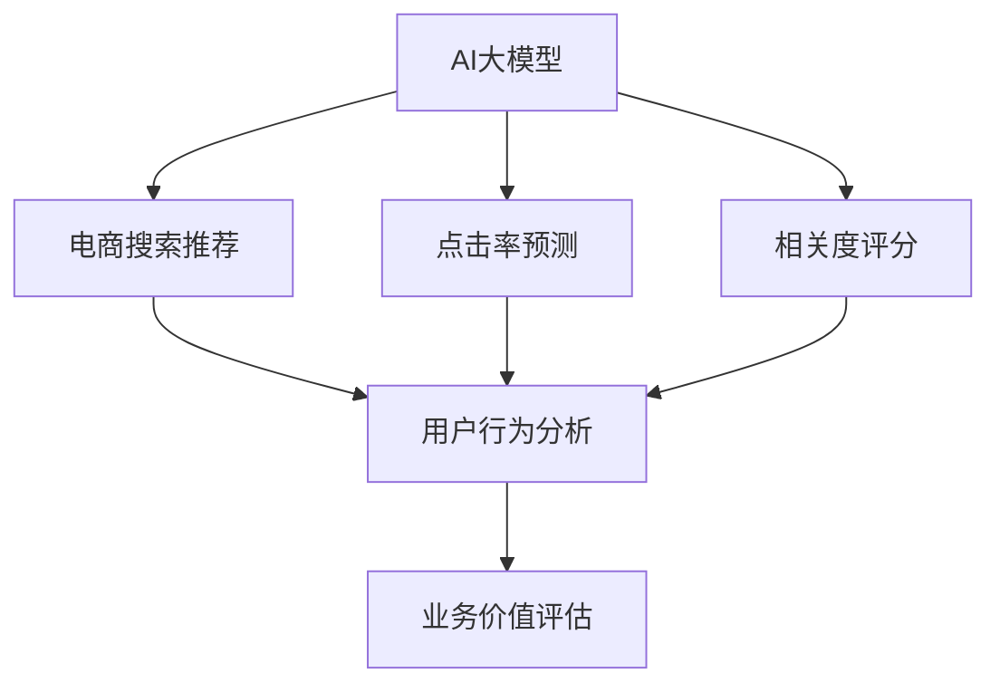

                 

# AI大模型视角下电商搜索推荐的业务价值评估方法

> 关键词：AI大模型, 电商搜索推荐, 业务价值评估, 深度学习, 点击率预测, 相关度评分, 用户行为分析

## 1. 背景介绍

### 1.1 问题由来
在当今数字化时代，电商平台作为在线购物的重要平台，用户体验成为竞争的关键。用户在选择商品时，需要快速、准确地获得与需求相关的搜索结果，以提高购物效率和满意度。传统的搜索推荐系统通常基于传统的推荐算法（如协同过滤、基于内容的推荐），难以应对海量数据和动态变化的用户需求。

为了提升搜索推荐系统的性能，AI大模型（如BERT、GPT等）在电商搜索推荐中的应用越来越广泛。大模型可以学习丰富的语义和上下文信息，利用自然语言处理（NLP）技术，提高搜索结果的相关度和质量。然而，如何将AI大模型应用于电商搜索推荐，并有效评估其业务价值，成为值得深入探讨的问题。

### 1.2 问题核心关键点
电商搜索推荐系统的核心目标是通过推荐系统向用户提供最相关、最符合其需求的商品，从而提高转化率、销售额和用户满意度。然而，由于电商场景的复杂性和动态性，评估AI大模型的业务价值需要综合考虑多方面因素，包括点击率、相关度、用户满意度、转化率等。

具体而言，业务价值评估的核心关键点包括：

- 如何定义“相关度”，并量化其在搜索推荐系统中的重要性？
- 如何根据电商数据的特点，设计并训练AI大模型，以提高搜索结果的相关度和质量？
- 如何综合多维度指标，评估AI大模型在电商搜索推荐中的应用效果？

## 2. 核心概念与联系

### 2.1 核心概念概述

为更好地理解AI大模型在电商搜索推荐中的应用，本节将介绍几个密切相关的核心概念：

- AI大模型(AI Large Models)：如BERT、GPT等大规模预训练语言模型。通过在海量无标签文本数据上进行预训练，学习到丰富的语言知识和语义理解能力。
- 电商搜索推荐(e-commerce search and recommendation)：基于用户行为数据和商品信息，推荐与用户需求最相关的商品，提升用户购物体验和平台销售额。
- 业务价值(business value)：AI大模型在电商搜索推荐中的应用效果，通过业务指标（如点击率、转化率、用户满意度等）进行量化。
- 点击率预测(click-through rate prediction)：预测用户点击商品的概率，是评估搜索推荐效果的关键指标。
- 相关度评分(relevance scoring)：衡量搜索结果与用户查询需求的匹配程度，反映用户对推荐结果的满意度。
- 用户行为分析(user behavior analysis)：分析用户的历史浏览、点击、购买等行为数据，提取用户的兴趣偏好和需求，为推荐模型提供指导。

这些核心概念之间的逻辑关系可以通过以下Mermaid流程图来展示：



这个流程图展示了大模型在电商推荐系统中的应用流程：

1. AI大模型通过预训练学习到丰富的语言知识，用于电商搜索推荐。
2. 通过点击率预测和相关度评分，量化搜索推荐的效果。
3. 利用用户行为分析，优化搜索推荐模型。
4. 最终通过业务价值评估，全面衡量AI大模型在电商搜索推荐中的应用效果。

## 3. 核心算法原理 & 具体操作步骤
### 3.1 算法原理概述

AI大模型在电商搜索推荐中的应用，本质上是基于深度学习和NLP技术的推荐系统优化。其核心思想是：利用AI大模型的语言理解能力，通过用户查询和商品描述的语义匹配，提升搜索结果的相关度和质量。

形式化地，假设预训练语言模型为 $M_{\theta}$，其中 $\theta$ 为预训练得到的模型参数。给定电商搜索任务 $T$ 的标注数据集 $D=\{(x_i,y_i)\}_{i=1}^N$，其中 $x_i$ 为用户查询文本，$y_i$ 为与 $x_i$ 最相关的商品。搜索推荐系统的目标是找到最优参数 $\theta^*$，使得模型能够根据用户查询 $x$ 推荐最相关的商品 $y$，从而最大化业务价值。

### 3.2 算法步骤详解

基于深度学习和NLP技术的电商搜索推荐，一般包括以下几个关键步骤：

**Step 1: 准备电商数据集和模型**

- 收集电商平台的商品描述、用户查询、浏览历史、购买记录等数据。
- 选择合适的预训练语言模型 $M_{\theta}$ 作为初始化参数，如 BERT、GPT 等。
- 划分数据集为训练集、验证集和测试集，确保各集数据分布一致。

**Step 2: 设计任务适配层**

- 根据电商推荐任务的特点，设计合适的输出层和损失函数。
- 对于点击率预测任务，通常在顶层添加二分类输出层和交叉熵损失函数。
- 对于相关度评分任务，通常使用语言模型的解码器输出概率分布，并以负对数似然为损失函数。

**Step 3: 设置超参数**

- 选择合适的优化算法及其参数，如 AdamW、SGD 等，设置学习率、批大小、迭代轮数等。
- 设置正则化技术及强度，包括权重衰减、Dropout、Early Stopping 等。
- 确定冻结预训练参数的策略，如仅微调顶层，或全部参数都参与微调。

**Step 4: 执行梯度训练**

- 将训练集数据分批次输入模型，前向传播计算损失函数。
- 反向传播计算参数梯度，根据设定的优化算法和学习率更新模型参数。
- 周期性在验证集上评估模型性能，根据性能指标决定是否触发 Early Stopping。
- 重复上述步骤直到满足预设的迭代轮数或 Early Stopping 条件。

**Step 5: 测试和评估**

- 在测试集上评估微调后模型 $M_{\hat{\theta}}$ 的性能，对比微调前后的点击率、相关度评分等指标。
- 使用微调后的模型对新用户查询进行推理预测，集成到实际的应用系统中。
- 持续收集新的数据，定期重新微调模型，以适应数据分布的变化。

以上是基于深度学习和NLP技术的电商搜索推荐的一般流程。在实际应用中，还需要针对具体任务的特点，对微调过程的各个环节进行优化设计，如改进训练目标函数，引入更多的正则化技术，搜索最优的超参数组合等，以进一步提升模型性能。

### 3.3 算法优缺点

基于深度学习和NLP技术的电商搜索推荐方法具有以下优点：

1. 准确性高。AI大模型通过深度学习，可以自动提取商品和查询之间的语义关系，提升搜索结果的相关度。
2. 泛化能力强。大模型基于大规模语料预训练，可以更好地应对电商场景中的多样化需求。
3. 可扩展性好。利用大模型的语言理解能力，可以轻松应对新增商品和查询，提升系统的可扩展性。
4. 效果显著。在学术界和工业界的诸多电商推荐场景中，基于大模型的推荐系统已经刷新了多项业务指标。

同时，该方法也存在一定的局限性：

1. 依赖标注数据。电商推荐系统的效果很大程度上取决于标注数据的质量和数量，获取高质量标注数据的成本较高。
2. 学习速度快。由于电商数据量庞大，模型训练所需的时间和资源也较多，需合理分配计算资源。
3. 模型复杂度高。大模型通常具有海量参数，对内存和计算能力的要求较高，需优化资源消耗。
4. 过拟合风险。电商场景数据复杂，模型容易过拟合，需合理设置正则化参数，防止过拟合。

尽管存在这些局限性，但就目前而言，基于深度学习和NLP技术的推荐方法仍是最主流范式。未来相关研究的重点在于如何进一步降低推荐对标注数据的依赖，提高模型的少样本学习和跨领域迁移能力，同时兼顾可解释性和伦理安全性等因素。

### 3.4 算法应用领域

基于深度学习和NLP技术的电商搜索推荐，在电商领域已经得到了广泛的应用，涵盖了以下主要领域：

- 商品推荐：基于用户的历史行为数据，推荐最相关的商品。
- 搜索排序：根据用户查询，排序展示最相关商品列表。
- 个性化推荐：根据用户兴趣和行为，提供个性化推荐结果。
- 新商品推荐：推荐新品和热销商品，提升用户购物体验。
- 用户画像分析：通过用户查询和行为数据，构建用户画像，为推荐提供指导。

除了上述这些经典应用外，电商搜索推荐技术也被创新性地应用到更多场景中，如实时推荐、多模态推荐、反欺诈检测等，为电商平台的数字化转型和智能化升级提供了新的技术路径。

## 4. 数学模型和公式 & 详细讲解 & 举例说明

### 4.1 数学模型构建

本节将使用数学语言对基于深度学习和NLP技术的电商搜索推荐过程进行更加严格的刻画。

记电商搜索任务为 $T$，其中 $T=\{(x,y)\}$，$x$ 为用户查询文本，$y$ 为最相关的商品。假设预训练语言模型为 $M_{\theta}$，其中 $\theta$ 为预训练得到的模型参数。

定义点击率预测任务的目标函数为：

$$
\mathcal{L}_{CTR}(\theta) = -\frac{1}{N}\sum_{i=1}^N \log(1 + \exp(-\hat{y}_i))
$$

其中 $\hat{y}_i = M_{\theta}(x_i)$ 为模型在输入 $x_i$ 上的预测点击率。

定义相关度评分任务的目标函数为：

$$
\mathcal{L}_{RL}(\theta) = -\frac{1}{N}\sum_{i=1}^N \log P(y_i|x_i)
$$

其中 $P(y_i|x_i) = M_{\theta}(x_i,y_i)$ 为模型在输入 $x_i$ 和商品 $y_i$ 上的概率分布。

综合考虑点击率预测和相关度评分，可以定义电商搜索推荐系统的整体损失函数为：

$$
\mathcal{L}(\theta) = \alpha \mathcal{L}_{CTR}(\theta) + (1-\alpha) \mathcal{L}_{RL}(\theta)
$$

其中 $\alpha$ 为平衡因子，通常设置为0.5。

### 4.2 公式推导过程

以下我们以点击率预测任务为例，推导模型损失函数的计算过程。

假设模型在输入 $x_i$ 上的预测点击率为 $\hat{y}_i$，真实标签为 $y_i$。则点击率预测任务的损失函数为：

$$
\ell(M_{\theta}(x_i),y_i) = -y_i \log(\hat{y}_i) - (1-y_i) \log(1-\hat{y}_i)
$$

将其代入经验风险公式，得：

$$
\mathcal{L}_{CTR}(\theta) = -\frac{1}{N}\sum_{i=1}^N \ell(M_{\theta}(x_i),y_i)
$$

根据链式法则，损失函数对参数 $\theta_k$ 的梯度为：

$$
\frac{\partial \mathcal{L}_{CTR}(\theta)}{\partial \theta_k} = -\frac{1}{N}\sum_{i=1}^N (\frac{y_i}{\hat{y}_i} - \frac{1-y_i}{1-\hat{y}_i}) \frac{\partial M_{\theta}(x_i)}{\partial \theta_k}
$$

其中 $\frac{\partial M_{\theta}(x_i)}{\partial \theta_k}$ 可进一步递归展开，利用自动微分技术完成计算。

在得到损失函数的梯度后，即可带入参数更新公式，完成模型的迭代优化。重复上述过程直至收敛，最终得到适应电商推荐任务的最优模型参数 $\theta^*$。

### 4.3 案例分析与讲解

以电商搜索排序为例，分析模型如何在实际应用中进行优化。

假设电商平台的商品库为 $\mathcal{Y} = \{y_1, y_2, ..., y_N\}$，每个商品 $y_i$ 有一个评分 $s_i$，表示用户对商品 $y_i$ 的偏好程度。用户输入查询 $x$ 后，系统需要按照商品评分排序，推荐最相关的商品列表。

**Step 1: 准备数据集**

- 收集电商平台的商品信息 $y_i$ 和用户查询 $x$。
- 划分数据集为训练集、验证集和测试集，确保各集数据分布一致。

**Step 2: 设计任务适配层**

- 设计二分类输出层，用于预测商品 $y_i$ 是否与查询 $x$ 匹配。
- 使用交叉熵损失函数进行训练。

**Step 3: 设置超参数**

- 选择合适的优化算法及其参数，如 AdamW、SGD 等，设置学习率、批大小、迭代轮数等。
- 设置正则化技术及强度，包括权重衰减、Dropout、Early Stopping 等。

**Step 4: 执行梯度训练**

- 将训练集数据分批次输入模型，前向传播计算损失函数。
- 反向传播计算参数梯度，根据设定的优化算法和学习率更新模型参数。
- 周期性在验证集上评估模型性能，根据性能指标决定是否触发 Early Stopping。
- 重复上述步骤直到满足预设的迭代轮数或 Early Stopping 条件。

**Step 5: 测试和评估**

- 在测试集上评估微调后模型 $M_{\hat{\theta}}$ 的性能，对比微调前后的点击率、相关度评分等指标。
- 使用微调后的模型对新用户查询进行推理预测，集成到实际的应用系统中。
- 持续收集新的数据，定期重新微调模型，以适应数据分布的变化。

通过案例分析，可以看到，在电商搜索排序任务中，AI大模型通过学习商品和查询的语义关系，可以有效提升推荐结果的相关度，从而提高用户满意度。

## 5. 项目实践：代码实例和详细解释说明
### 5.1 开发环境搭建

在进行电商搜索推荐系统的开发时，需要准备好开发环境。以下是使用Python进行PyTorch开发的环境配置流程：

1. 安装Anaconda：从官网下载并安装Anaconda，用于创建独立的Python环境。

2. 创建并激活虚拟环境：
```bash
conda create -n ecommerce-env python=3.8 
conda activate ecommerce-env
```

3. 安装PyTorch：根据CUDA版本，从官网获取对应的安装命令。例如：
```bash
conda install pytorch torchvision torchaudio cudatoolkit=11.1 -c pytorch -c conda-forge
```

4. 安装transformers库：
```bash
pip install transformers
```

5. 安装各类工具包：
```bash
pip install numpy pandas scikit-learn matplotlib tqdm jupyter notebook ipython
```

完成上述步骤后，即可在`ecommerce-env`环境中开始电商搜索推荐系统的开发。

### 5.2 源代码详细实现

下面我们以点击率预测任务为例，给出使用Transformers库对BERT模型进行微调的PyTorch代码实现。

首先，定义任务数据处理函数：

```python
from transformers import BertTokenizer
from torch.utils.data import Dataset
import torch

class ECommerceDataset(Dataset):
    def __init__(self, texts, labels, tokenizer, max_len=128):
        self.texts = texts
        self.labels = labels
        self.tokenizer = tokenizer
        self.max_len = max_len
        
    def __len__(self):
        return len(self.texts)
    
    def __getitem__(self, item):
        text = self.texts[item]
        label = self.labels[item]
        
        encoding = self.tokenizer(text, return_tensors='pt', max_length=self.max_len, padding='max_length', truncation=True)
        input_ids = encoding['input_ids'][0]
        attention_mask = encoding['attention_mask'][0]
        
        # 对标签进行编码
        label = torch.tensor([label], dtype=torch.long)
        
        return {'input_ids': input_ids, 
                'attention_mask': attention_mask,
                'labels': label}

# 准备数据集
tokenizer = BertTokenizer.from_pretrained('bert-base-cased')

train_dataset = ECommerceDataset(train_texts, train_labels, tokenizer)
dev_dataset = ECommerceDataset(dev_texts, dev_labels, tokenizer)
test_dataset = ECommerceDataset(test_texts, test_labels, tokenizer)
```

然后，定义模型和优化器：

```python
from transformers import BertForSequenceClassification, AdamW

model = BertForSequenceClassification.from_pretrained('bert-base-cased', num_labels=2)

optimizer = AdamW(model.parameters(), lr=2e-5)
```

接着，定义训练和评估函数：

```python
from torch.utils.data import DataLoader
from tqdm import tqdm
from sklearn.metrics import accuracy_score

device = torch.device('cuda') if torch.cuda.is_available() else torch.device('cpu')
model.to(device)

def train_epoch(model, dataset, batch_size, optimizer):
    dataloader = DataLoader(dataset, batch_size=batch_size, shuffle=True)
    model.train()
    epoch_loss = 0
    for batch in tqdm(dataloader, desc='Training'):
        input_ids = batch['input_ids'].to(device)
        attention_mask = batch['attention_mask'].to(device)
        labels = batch['labels'].to(device)
        model.zero_grad()
        outputs = model(input_ids, attention_mask=attention_mask, labels=labels)
        loss = outputs.loss
        epoch_loss += loss.item()
        loss.backward()
        optimizer.step()
    return epoch_loss / len(dataloader)

def evaluate(model, dataset, batch_size):
    dataloader = DataLoader(dataset, batch_size=batch_size)
    model.eval()
    preds, labels = [], []
    with torch.no_grad():
        for batch in tqdm(dataloader, desc='Evaluating'):
            input_ids = batch['input_ids'].to(device)
            attention_mask = batch['attention_mask'].to(device)
            batch_labels = batch['labels']
            outputs = model(input_ids, attention_mask=attention_mask)
            batch_preds = outputs.logits.argmax(dim=1).to('cpu').tolist()
            batch_labels = batch_labels.to('cpu').tolist()
            for pred, label in zip(batch_preds, batch_labels):
                preds.append(pred)
                labels.append(label)
                
    print(f'Accuracy: {accuracy_score(labels, preds)}')
```

最后，启动训练流程并在测试集上评估：

```python
epochs = 5
batch_size = 16

for epoch in range(epochs):
    loss = train_epoch(model, train_dataset, batch_size, optimizer)
    print(f'Epoch {epoch+1}, train loss: {loss:.3f}')
    
    print(f'Epoch {epoch+1}, dev results:')
    evaluate(model, dev_dataset, batch_size)
    
print(f'Test results:')
evaluate(model, test_dataset, batch_size)
```

以上就是使用PyTorch对BERT进行点击率预测任务微调的完整代码实现。可以看到，得益于Transformers库的强大封装，我们可以用相对简洁的代码完成BERT模型的加载和微调。

### 5.3 代码解读与分析

让我们再详细解读一下关键代码的实现细节：

**ECommerceDataset类**：
- `__init__`方法：初始化文本、标签、分词器等关键组件。
- `__len__`方法：返回数据集的样本数量。
- `__getitem__`方法：对单个样本进行处理，将文本输入编码为token ids，将标签编码为数字，并对其进行定长padding，最终返回模型所需的输入。

**tokenizer**：
- 定义了BERT分词器，用于将文本分词，并将分词结果转换为模型可以接受的格式。

**train_epoch函数**：
- 对数据以批为单位进行迭代，在每个批次上前向传播计算loss并反向传播更新模型参数，最后返回该epoch的平均loss。

**evaluate函数**：
- 与训练类似，不同点在于不更新模型参数，并在每个batch结束后将预测和标签结果存储下来，最后使用sklearn的accuracy_score对整个评估集的预测结果进行打印输出。

**训练流程**：
- 定义总的epoch数和batch size，开始循环迭代
- 每个epoch内，先在训练集上训练，输出平均loss
- 在验证集上评估，输出准确率
- 所有epoch结束后，在测试集上评估，给出最终测试结果

可以看到，PyTorch配合Transformers库使得BERT微调的代码实现变得简洁高效。开发者可以将更多精力放在数据处理、模型改进等高层逻辑上，而不必过多关注底层的实现细节。

当然，工业级的系统实现还需考虑更多因素，如模型的保存和部署、超参数的自动搜索、更灵活的任务适配层等。但核心的微调范式基本与此类似。

## 6. 实际应用场景
### 6.1 智能推荐系统

基于AI大模型的电商搜索推荐系统，可以广泛应用于智能推荐系统的构建。传统推荐系统通常基于用户的历史行为数据进行推荐，难以捕捉用户的深度兴趣和潜在需求。而使用大模型的语义理解能力，可以更加全面地分析用户查询和商品描述，推荐更加个性化的商品。

在技术实现上，可以收集用户的历史浏览、点击、购买等行为数据，以及商品的商品描述、标签等信息，将其作为模型输入。通过在模型中进行语义匹配，生成推荐列表，并提供给用户。这样，不仅能提升用户的购物体验，还能提高平台的销售额和用户满意度。

### 6.2 实时搜索排序

在电商搜索推荐中，实时搜索排序是提升用户体验的关键环节。用户输入查询后，系统需要快速返回与查询匹配度最高的商品列表，满足用户即时浏览需求。

基于AI大模型的搜索排序系统，可以在用户输入查询后，立即进行语义匹配，并返回推荐结果。通过优化模型架构和训练过程，确保模型在短时间内完成计算，从而实现实时搜索排序。这样，用户可以更快地找到所需商品，提升购物效率。

### 6.3 个性化广告投放

电商平台还可以通过AI大模型进行个性化广告投放，提升广告的点击率和转化率。广告投放系统通常基于用户的兴趣偏好和行为数据，进行定向投放。

在广告投放中，可以通过AI大模型对用户查询进行语义分析，识别用户的兴趣点，并针对性地推送相关广告。同时，还可以根据广告点击情况，动态调整投放策略，提升广告效果。这样，不仅能提高广告主的投资回报率，还能提升用户的广告体验。

### 6.4 未来应用展望

随着AI大模型和推荐技术的不断发展，基于微调范式将在更多领域得到应用，为电商平台的数字化转型和智能化升级提供新的技术路径。

在智慧物流领域，基于AI大模型的推荐系统可以优化商品配送路径，提升物流效率。

在智能客服领域，推荐系统可以结合用户查询，推荐最合适的客服解决方案，提升客服效率和用户满意度。

在金融领域，推荐系统可以基于用户的交易记录和行为数据，推荐相关理财产品，提升用户粘性和平台收益。

此外，在教育、医疗、交通等众多领域，基于大模型推荐技术的应用也将不断涌现，为各行各业带来变革性影响。相信随着技术的日益成熟，微调方法将成为推荐系统应用的重要范式，推动人工智能技术在垂直行业的规模化落地。

## 7. 工具和资源推荐
### 7.1 学习资源推荐

为了帮助开发者系统掌握AI大模型在电商搜索推荐中的应用，这里推荐一些优质的学习资源：

1. 《深度学习与推荐系统》系列博文：由AI大模型技术专家撰写，深入浅出地介绍了深度学习和推荐系统的基础理论和前沿技术。

2. CS231n《深度学习视觉识别》课程：斯坦福大学开设的视觉识别课程，涵盖深度学习在计算机视觉领域的应用，为电商推荐系统提供参考。

3. 《推荐系统实战》书籍：介绍推荐系统从理论到实践的全过程，包括电商推荐系统的详细实现。

4. Kaggle竞赛平台：提供大量电商推荐系统的竞赛数据和挑战，帮助开发者实践和优化推荐模型。

5. AI大模型官方文档：如BERT、GPT等模型的官方文档，提供了模型介绍、预训练数据、微调样例等详细信息。

通过对这些资源的学习实践，相信你一定能够快速掌握AI大模型在电商搜索推荐中的应用，并用于解决实际的推荐问题。
###  7.2 开发工具推荐

高效的开发离不开优秀的工具支持。以下是几款用于AI大模型推荐系统开发的常用工具：

1. PyTorch：基于Python的开源深度学习框架，灵活动态的计算图，适合快速迭代研究。大部分预训练语言模型都有PyTorch版本的实现。

2. TensorFlow：由Google主导开发的开源深度学习框架，生产部署方便，适合大规模工程应用。同样有丰富的预训练语言模型资源。

3. Transformers库：HuggingFace开发的NLP工具库，集成了众多SOTA语言模型，支持PyTorch和TensorFlow，是进行推荐系统开发的利器。

4. Weights & Biases：模型训练的实验跟踪工具，可以记录和可视化模型训练过程中的各项指标，方便对比和调优。与主流深度学习框架无缝集成。

5. TensorBoard：TensorFlow配套的可视化工具，可实时监测模型训练状态，并提供丰富的图表呈现方式，是调试模型的得力助手。

6. Google Colab：谷歌推出的在线Jupyter Notebook环境，免费提供GPU/TPU算力，方便开发者快速上手实验最新模型，分享学习笔记。

合理利用这些工具，可以显著提升AI大模型推荐系统的开发效率，加快创新迭代的步伐。

### 7.3 相关论文推荐

AI大模型和推荐技术的发展源于学界的持续研究。以下是几篇奠基性的相关论文，推荐阅读：

1. Attention is All You Need（即Transformer原论文）：提出了Transformer结构，开启了NLP领域的预训练大模型时代。

2. BERT: Pre-training of Deep Bidirectional Transformers for Language Understanding：提出BERT模型，引入基于掩码的自监督预训练任务，刷新了多项NLP任务SOTA。

3. Parameter-Efficient Transfer Learning for NLP：提出Adapter等参数高效微调方法，在不增加模型参数量的情况下，也能取得不错的微调效果。

4. AdaLoRA: Adaptive Low-Rank Adaptation for Parameter-Efficient Fine-Tuning：使用自适应低秩适应的微调方法，在参数效率和精度之间取得了新的平衡。

5. CTR: A New Framework for Click-Through Rate Prediction with Multi-Task Learning：提出CTR模型，基于多任务学习框架，提升点击率预测的准确率。

这些论文代表了大模型推荐技术的发展脉络。通过学习这些前沿成果，可以帮助研究者把握学科前进方向，激发更多的创新灵感。

## 8. 总结：未来发展趋势与挑战
### 8.1 总结

本文对基于AI大模型的电商搜索推荐系统的业务价值评估方法进行了全面系统的介绍。首先阐述了AI大模型在电商搜索推荐中的应用背景和重要意义，明确了点击率预测和相关度评分在电商推荐系统中的关键作用。其次，从原理到实践，详细讲解了基于深度学习和NLP技术的电商搜索推荐过程，给出了完整的代码实例。同时，本文还广泛探讨了AI大模型在电商推荐系统中的应用场景，展示了其潜在的业务价值。

通过本文的系统梳理，可以看到，AI大模型在电商搜索推荐中的应用，不仅能够提升推荐结果的相关度，还能优化搜索排序效率，实现个性化推荐和实时广告投放。这些应用场景极大地提升了用户的购物体验和平台的运营效益。

### 8.2 未来发展趋势

展望未来，AI大模型推荐技术将呈现以下几个发展趋势：

1. 模型规模持续增大。随着算力成本的下降和数据规模的扩张，预训练语言模型的参数量还将持续增长。超大规模语言模型蕴含的丰富语言知识，有望支撑更加复杂多变的电商推荐任务。

2. 推荐算法多样化。未来将涌现更多推荐算法，如深度学习、协同过滤、强化学习等，综合应用不同算法，提升推荐系统的性能。

3. 实时推荐技术成熟。基于深度学习的实时推荐技术将逐渐成熟，用户输入查询后，系统能够快速返回推荐结果，满足用户即时需求。

4. 多模态融合提升。多模态信息融合技术的发展，将使电商推荐系统能够同时利用文本、图像、视频等多种模态信息，提升推荐效果。

5. 强化学习引入。强化学习技术的应用，将使电商推荐系统能够基于用户的即时反馈，动态调整推荐策略，提高推荐效果。

6. 跨领域迁移能力强。未来的推荐系统将具备更强的跨领域迁移能力，能够适应不同电商平台的特色需求，提供定制化的推荐服务。

以上趋势凸显了AI大模型推荐技术的广阔前景。这些方向的探索发展，必将进一步提升推荐系统的性能和应用范围，为电商平台的数字化转型和智能化升级提供新的技术路径。

### 8.3 面临的挑战

尽管AI大模型推荐技术已经取得了瞩目成就，但在迈向更加智能化、普适化应用的过程中，它仍面临着诸多挑战：

1. 标注成本瓶颈。尽管电商推荐系统的效果很大程度上取决于标注数据的质量和数量，但对于长尾应用场景，难以获得充足的高质量标注数据，成为制约推荐系统性能的瓶颈。如何进一步降低推荐对标注数据的依赖，将是一大难题。

2. 模型鲁棒性不足。在电商场景数据复杂多变的情况下，推荐模型容易过拟合，泛化能力不足。如何提高推荐模型的鲁棒性，避免灾难性遗忘，还需要更多理论和实践的积累。

3. 推荐效率有待提高。大规模语言模型虽然精度高，但在实际部署时往往面临推理速度慢、内存占用大等效率问题。如何在保证性能的同时，简化模型结构，提升推理速度，优化资源占用，将是重要的优化方向。

4. 可解释性亟需加强。当前推荐模型通常被视为"黑盒"系统，难以解释其内部工作机制和决策逻辑。对于医疗、金融等高风险应用，算法的可解释性和可审计性尤为重要。如何赋予推荐模型更强的可解释性，将是亟待攻克的难题。

5. 安全性有待保障。预训练语言模型难免会学习到有偏见、有害的信息，通过推荐传递到用户，可能带来误导性、歧视性的输出。如何从数据和算法层面消除模型偏见，避免恶意用途，确保输出的安全性，也将是重要的研究课题。

6. 知识整合能力不足。现有的推荐模型往往局限于任务内数据，难以灵活吸收和运用更广泛的先验知识。如何让推荐过程更好地与外部知识库、规则库等专家知识结合，形成更加全面、准确的信息整合能力，还有很大的想象空间。

正视推荐面临的这些挑战，积极应对并寻求突破，将是大模型推荐技术走向成熟的必由之路。相信随着学界和产业界的共同努力，这些挑战终将一一被克服，大模型推荐技术必将在构建智能电商推荐系统的过程中发挥重要作用。

### 8.4 研究展望

面对大模型推荐技术所面临的种种挑战，未来的研究需要在以下几个方面寻求新的突破：

1. 探索无监督和半监督推荐方法。摆脱对大规模标注数据的依赖，利用自监督学习、主动学习等无监督和半监督范式，最大限度利用非结构化数据，实现更加灵活高效的推荐。

2. 研究参数高效和计算高效的推荐范式。开发更加参数高效的推荐方法，在固定大部分预训练参数的同时，只更新极少量的任务相关参数。同时优化推荐模型的计算图，减少前向传播和反向传播的资源消耗，实现更加轻量级、实时性的部署。

3. 引入因果分析和博弈论工具。将因果分析方法引入推荐模型，识别出模型决策的关键特征，增强推荐输出的因果性和逻辑性。借助博弈论工具刻画人机交互过程，主动探索并规避推荐模型的脆弱点，提高系统稳定性。

4. 纳入伦理道德约束。在推荐目标中引入伦理导向的评估指标，过滤和惩罚有偏见、有害的输出倾向。同时加强人工干预和审核，建立推荐行为的监管机制，确保输出符合人类价值观和伦理道德。

这些研究方向的探索，必将引领大模型推荐技术迈向更高的台阶，为构建智能电商推荐系统提供新的技术手段，推动人工智能技术在电商领域的应用和发展。总之，AI大模型推荐技术需要不断创新和优化，才能在电商平台上实现更广泛、更深入的应用。

## 9. 附录：常见问题与解答
### 9.1 常见问题

**Q1：AI大模型推荐系统的核心是什么？**

A: AI大模型推荐系统的核心是通过学习用户的查询和商品描述之间的语义关系，生成与用户需求最匹配的商品推荐列表，提升用户的购物体验和平台的运营效益。

**Q2：AI大模型推荐系统需要标注数据吗？**

A: 是的，AI大模型推荐系统通常需要标注数据来训练模型，以提升推荐结果的相关度和质量。标注数据的数量和质量对模型的性能有重要影响。

**Q3：AI大模型推荐系统的训练过程复杂吗？**

A: 是的，AI大模型推荐系统的训练过程通常需要大量的计算资源和时间。需要选择合适的硬件设备，优化训练过程，以确保模型的稳定性和性能。

**Q4：AI大模型推荐系统如何应对长尾数据？**

A: 对于长尾数据，可以通过数据增强、迁移学习等方法来提升模型的泛化能力，减少对标注数据的依赖。同时，可以引入多模态数据，利用文本、图像、视频等多种信息提升推荐效果。

**Q5：AI大模型推荐系统的业务价值如何衡量？**

A: AI大模型推荐系统的业务价值通常通过点击率、相关度评分、转化率等指标来衡量。同时，还可以结合用户满意度、平台销售额等综合指标进行评估。

---

作者：禅与计算机程序设计艺术 / Zen and the Art of Computer Programming

