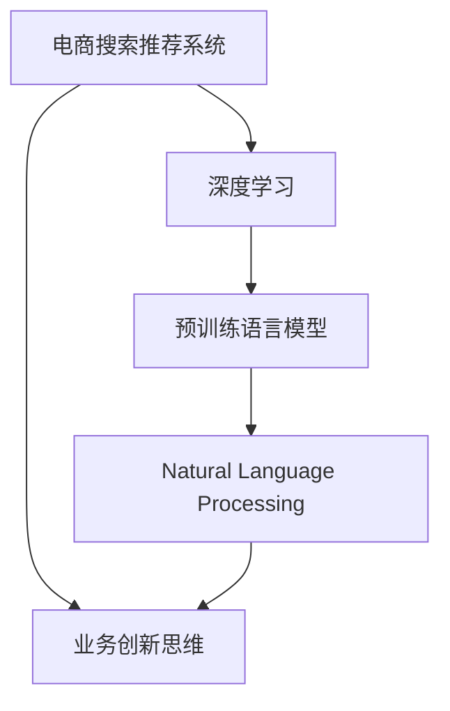

                 

# AI大模型赋能电商搜索推荐的业务创新思维培训平台搭建方案

> 关键词：电商搜索推荐,大模型,推荐系统,电商业务,人工智能,深度学习

## 1. 背景介绍

### 1.1 问题由来
随着电子商务的快速发展和普及，电商搜索推荐系统在提升用户体验、增加销售转化率、优化供应链管理等方面发挥了关键作用。然而，传统的电商推荐系统多基于传统的机器学习算法和浅层神经网络，难以处理海量、多模态、动态变化的电商数据，推荐效果受到算法本身和数据质量的制约，亟需引入更先进的技术以提升系统性能。

近年来，基于深度学习和大规模预训练语言模型(如BERT、GPT等)的推荐系统逐步成为研究热点，特别是在语义理解、用户行为建模、产品描述处理等方面，展现出显著优势。但如何将这些先进的AI技术有机整合到电商推荐系统中，并实现有效的落地应用，仍需进一步探索和实践。

本文旨在通过搭建基于大模型的电商搜索推荐业务创新思维培训平台，利用AI大模型的强大语义理解和生成能力，提升电商搜索推荐系统的智能水平，赋能业务创新思维，并深入挖掘其中的技术和商业价值。

## 2. 核心概念与联系

### 2.1 核心概念概述

为更好地理解平台搭建方案，本节将介绍几个核心概念：

- **电商搜索推荐系统**：通过分析用户搜索和浏览行为，结合商品特征和用户画像，为每个用户推荐最相关、最合适的商品，提升用户购物体验和销售转化率。

- **深度学习**：一种基于神经网络结构的机器学习技术，具有强大的自适应能力和泛化能力，可用于处理大规模、高维度的数据，发掘数据中的深层关系。

- **预训练语言模型(如BERT、GPT等)**：在无标签的大规模文本语料上进行自监督学习，获得通用语言表示，并可在下游任务上进行微调，用于理解文本语义、生成自然语言文本等任务。

- **自然语言处理(NLP)**：涉及语言表示、语义理解、信息检索、自然语言生成等领域的计算机科学分支，旨在使计算机能够理解、处理和生成人类语言。

- **业务创新思维**：将AI技术应用于商业场景，通过数据驱动、智能决策等手段，优化业务流程、挖掘商业价值，实现业务模式的创新和转型。

这些概念之间的逻辑关系可以通过以下Mermaid流程图来展示：



这个流程图展示了大模型赋能电商搜索推荐系统的核心概念及其之间的关系：

1. 电商搜索推荐系统依赖深度学习和自然语言处理技术，通过预训练语言模型提升系统的智能水平。
2. 业务创新思维利用AI技术的优势，将推荐系统与电商业务紧密结合，实现价值最大化。

## 3. 核心算法原理 & 具体操作步骤
### 3.1 算法原理概述

本平台的核心算法原理在于通过预训练语言模型和深度学习技术，实现电商搜索推荐系统的智能提升和业务创新。具体而言，包括以下几个关键步骤：

1. **数据收集与预处理**：收集电商平台的搜索日志、点击行为、商品描述、用户画像等多源数据，并进行清洗、标准化等预处理。

2. **构建语义嵌入空间**：使用预训练语言模型(如BERT)对商品描述、用户评论等文本数据进行编码，生成语义嵌入空间，用于理解商品和用户语义。

3. **用户行为建模**：基于深度学习模型，对用户搜索、点击、浏览等行为进行建模，生成用户行为序列。

4. **商品语义表示**：使用预训练语言模型对商品描述等文本数据进行编码，生成商品语义表示。

5. **推荐模型训练**：将用户行为序列和商品语义表示作为输入，训练推荐模型，实现精准推荐。

6. **业务创新思维应用**：结合用户画像、市场趋势等信息，运用业务创新思维，对推荐结果进行优化和调整，实现业务目标。

### 3.2 算法步骤详解

#### 3.2.1 数据收集与预处理

- **收集数据**：收集电商平台的搜索日志、点击行为、商品描述、用户画像等多源数据，并存储在统一的数据仓库中。
- **数据清洗**：去除噪声数据、填补缺失值、处理异常值等，确保数据质量。
- **数据标准化**：对不同来源的数据进行格式统一和标准化，便于后续分析处理。
- **特征工程**：根据业务需求，提取并构建特征，如商品类别、用户年龄段、搜索关键词等。

#### 3.2.2 构建语义嵌入空间

- **文本编码**：使用预训练语言模型(如BERT)对商品描述、用户评论等文本数据进行编码，生成语义嵌入向量。
- **嵌入矩阵构建**：将所有商品的语义嵌入向量组成矩阵，用于后续的推荐计算。

#### 3.2.3 用户行为建模

- **行为序列建模**：基于深度学习模型，如RNN、LSTM等，对用户搜索、点击、浏览等行为进行建模，生成用户行为序列。
- **行为序列预处理**：对行为序列进行截断、填充等预处理，确保输入模型的数据格式一致。

#### 3.2.4 商品语义表示

- **文本编码**：使用预训练语言模型(如BERT)对商品描述等文本数据进行编码，生成商品语义表示。
- **嵌入矩阵构建**：将所有商品的语义表示组成矩阵，用于后续的推荐计算。

#### 3.2.5 推荐模型训练

- **构建推荐模型**：基于用户行为序列和商品语义表示，构建推荐模型，如协同过滤、基于内容的推荐、混合推荐等。
- **模型训练**：使用标注数据对推荐模型进行训练，调整模型参数，优化推荐效果。

#### 3.2.6 业务创新思维应用

- **用户画像生成**：基于用户行为和文本数据，生成详细的用户画像，用于理解用户需求和偏好。
- **市场趋势分析**：结合电商平台的销售数据和市场信息，进行趋势分析，调整推荐策略。
- **推荐结果优化**：根据业务需求，结合用户画像和市场趋势，对推荐结果进行优化和调整，实现业务目标。

### 3.3 算法优缺点

基于大模型的电商搜索推荐系统具有以下优点：

- **语义理解能力强**：预训练语言模型具备强大的语义理解能力，可以更准确地理解商品和用户的语义信息。
- **推荐精度高**：结合用户行为建模和商品语义表示，推荐模型的精度和效果显著提升。
- **可扩展性强**：支持大规模数据和多种电商业务场景，灵活调整推荐策略。

同时，该方法也存在以下局限性：

- **模型复杂度高**：预训练语言模型的参数量较大，训练和推理耗时长，计算资源需求高。
- **数据依赖性强**：推荐效果依赖于数据的质量和数量，数据收集和预处理成本高。
- **易过拟合**：模型参数多，容易在特定数据上过度拟合，泛化能力不足。

尽管存在这些局限性，但就目前而言，基于大模型的电商推荐系统仍然是电商业务智能化的重要方向。未来相关研究的重点在于如何进一步降低数据需求，提高模型泛化能力，同时兼顾可解释性和商业价值。

### 3.4 算法应用领域

基于大模型的电商搜索推荐系统已经在众多电商业务场景中得到了广泛应用，例如：

- 商品推荐：根据用户浏览、搜索历史，推荐相关商品。
- 用户画像：通过用户行为和文本数据，生成详细的用户画像，提供个性化服务。
- 新用户推荐：针对新注册用户，通过推荐系统快速推荐相关商品，提高用户留存率。
- 价格优化：结合市场趋势和用户需求，动态调整商品价格，提升销售效益。
- 库存管理：基于用户行为预测，优化库存管理，减少库存积压和缺货现象。

除了这些经典应用外，基于大模型的推荐系统还被创新性地应用到更多场景中，如社交电商、直播电商、反向推荐等，为电商业务带来新的增长点。随着预训练模型和推荐算法的不断进步，相信大模型推荐系统将在电商行业继续发挥重要作用。

## 4. 数学模型和公式 & 详细讲解 & 举例说明

### 4.1 数学模型构建

本节将使用数学语言对基于大模型的电商搜索推荐系统进行更加严格的刻画。

记电商搜索推荐系统为 $S_{\theta}:\mathcal{U} \rightarrow \mathcal{V}$，其中 $\mathcal{U}$ 为用户集，$\mathcal{V}$ 为商品集。假设用户 $u$ 的搜索行为序列为 $I_u=(I_{u1}, I_{u2}, \dots, I_{ut})$，商品 $v$ 的语义表示为 $E_v$，用户行为序列 $I_u$ 对商品 $v$ 的评分 $R_u^v$ 为：

$$
R_u^v = \sum_{t=1}^T \alpha_t f(I_{ut}, E_v; \theta)
$$

其中 $T$ 为行为序列长度，$\alpha_t$ 为行为权重，$f$ 为评分函数，$\theta$ 为模型参数。评分函数 $f$ 通常使用点积函数，定义为：

$$
f(I_{ut}, E_v; \theta) = \text{dot}(I_{ut}, E_v; \theta) = \langle I_{ut}, E_v \rangle
$$

其中 $\text{dot}$ 为点积函数，$\langle \cdot, \cdot \rangle$ 为内积运算。

### 4.2 公式推导过程

以下我们以协同过滤推荐模型为例，推导评分函数的内积形式。

假设用户 $u$ 的行为序列 $I_u=(I_{u1}, I_{u2}, \dots, I_{ut})$，商品 $v$ 的语义表示为 $E_v$，则用户行为序列对商品 $v$ 的评分函数可以表示为：

$$
f(I_{ut}, E_v; \theta) = \langle I_{ut}, E_v \rangle = \sum_{t=1}^T \langle I_{ut}, E_v \rangle
$$

将其代入评分公式，得：

$$
R_u^v = \sum_{t=1}^T \alpha_t \langle I_{ut}, E_v \rangle
$$

在得到评分函数的内积形式后，即可带入模型训练公式，完成电商搜索推荐系统的训练过程。重复上述过程直至收敛，最终得到适应电商业务需求的推荐模型参数 $\theta^*$。

### 4.3 案例分析与讲解

假设电商平台的商品描述为 $\{s_1, s_2, \dots, s_M\}$，用户评论为 $\{c_1, c_2, \dots, c_N\}$。首先，使用BERT模型对商品描述和用户评论进行编码，生成语义嵌入矩阵 $\{E_s, E_c\}$。然后，通过以下步骤对用户行为序列进行建模：

1. 对用户搜索、点击、浏览等行为进行编码，生成用户行为序列 $\{I_u\}$。
2. 使用BERT模型对用户行为序列进行编码，生成用户行为嵌入矩阵 $\{I_u\}$。
3. 将用户行为嵌入矩阵和商品语义嵌入矩阵拼接，生成推荐模型输入。

最后，使用推荐模型进行商品推荐，生成推荐结果 $\{R_u^v\}$。

## 5. 项目实践：代码实例和详细解释说明

### 5.1 开发环境搭建

在进行平台搭建前，我们需要准备好开发环境。以下是使用Python进行PyTorch和TensorFlow开发的环境配置流程：

1. 安装Anaconda：从官网下载并安装Anaconda，用于创建独立的Python环境。

2. 创建并激活虚拟环境：
```bash
conda create -n pytorch-env python=3.8 
conda activate pytorch-env
```

3. 安装PyTorch：根据CUDA版本，从官网获取对应的安装命令。例如：
```bash
conda install pytorch torchvision torchaudio cudatoolkit=11.1 -c pytorch -c conda-forge
```

4. 安装TensorFlow：
```bash
pip install tensorflow
```

5. 安装TensorBoard：
```bash
pip install tensorboard
```

6. 安装各类工具包：
```bash
pip install numpy pandas scikit-learn matplotlib tqdm jupyter notebook ipython
```

完成上述步骤后，即可在`pytorch-env`环境中开始平台搭建实践。

### 5.2 源代码详细实现

这里我们以协同过滤推荐模型为例，给出使用PyTorch实现电商搜索推荐系统的代码实现。

首先，定义评分函数：

```python
import torch
import torch.nn as nn

class DotProduct(nn.Module):
    def __init__(self, dim):
        super(DotProduct, self).__init__()
        self.fc = nn.Linear(dim, 1)
        
    def forward(self, x, y):
        x = self.fc(x)
        y = self.fc(y)
        return torch.sigmoid(x @ y)
```

然后，定义用户行为序列编码和商品语义表示的编码器：

```python
class Encoder(nn.Module):
    def __init__(self, embed_dim, hidden_dim):
        super(Encoder, self).__init__()
        self.embedding = nn.Embedding(vocab_size, embed_dim)
        self.encoder = nn.LSTM(embed_dim, hidden_dim, num_layers=1, bidirectional=True)
        
    def forward(self, x):
        x = self.embedding(x)
        x, _ = self.encoder(x)
        return x[:, -1, :]
```

接下来，定义协同过滤推荐模型：

```python
class CollaborativeFiltering(nn.Module):
    def __init__(self, embed_dim, hidden_dim):
        super(CollaborativeFiltering, self).__init__()
        self.dot_product = DotProduct(embed_dim)
        self.encoder = Encoder(embed_dim, hidden_dim)
        
    def forward(self, user_seq, item_emb):
        user_seq = self.encoder(user_seq)
        return self.dot_product(user_seq, item_emb)
```

最后，训练和评估模型：

```python
# 准备数据集
train_dataset = ...
val_dataset = ...
test_dataset = ...

# 定义模型和优化器
model = CollaborativeFiltering(embed_dim, hidden_dim)
optimizer = torch.optim.Adam(model.parameters(), lr=0.001)

# 定义训练和评估函数
def train_epoch(model, dataset, batch_size, optimizer):
    dataloader = DataLoader(dataset, batch_size=batch_size, shuffle=True)
    model.train()
    epoch_loss = 0
    for batch in dataloader:
        user_seq, item_emb, label = batch
        optimizer.zero_grad()
        output = model(user_seq, item_emb)
        loss = F.binary_cross_entropy(output, label)
        epoch_loss += loss.item()
        loss.backward()
        optimizer.step()
    return epoch_loss / len(dataloader)

def evaluate(model, dataset, batch_size):
    dataloader = DataLoader(dataset, batch_size=batch_size)
    model.eval()
    preds, labels = [], []
    with torch.no_grad():
        for batch in dataloader:
            user_seq, item_emb, label = batch
            output = model(user_seq, item_emb)
            batch_preds = output.sigmoid().round().cpu().tolist()
            batch_labels = label.cpu().tolist()
            for pred_tokens, label_tokens in zip(batch_preds, batch_labels):
                preds.append(pred_tokens)
                labels.append(label_tokens)
                
    print(classification_report(labels, preds))
```

最后，启动训练流程并在测试集上评估：

```python
epochs = 10
batch_size = 32

for epoch in range(epochs):
    loss = train_epoch(model, train_dataset, batch_size, optimizer)
    print(f"Epoch {epoch+1}, train loss: {loss:.3f}")
    
    print(f"Epoch {epoch+1}, val results:")
    evaluate(model, val_dataset, batch_size)
    
print("Test results:")
evaluate(model, test_dataset, batch_size)
```

以上就是使用PyTorch实现电商搜索推荐系统的完整代码实现。可以看到，得益于PyTorch的强大封装，代码实现变得简洁高效。

### 5.3 代码解读与分析

让我们再详细解读一下关键代码的实现细节：

**DotProduct类**：
- 定义了一个简单的点积函数，用于计算用户行为序列和商品语义表示的内积，并输出预测评分。

**Encoder类**：
- 定义了一个LSTM编码器，用于对用户行为序列进行编码，生成用户行为嵌入向量。

**CollaborativeFiltering类**：
- 定义了一个协同过滤推荐模型，包括点积评分函数和LSTM编码器，用于计算用户行为序列和商品语义表示的内积，生成推荐评分。

**训练和评估函数**：
- 使用PyTorch的DataLoader对数据集进行批次化加载，供模型训练和推理使用。
- 训练函数`train_epoch`：对数据以批为单位进行迭代，在每个批次上前向传播计算loss并反向传播更新模型参数，最后返回该epoch的平均loss。
- 评估函数`evaluate`：与训练类似，不同点在于不更新模型参数，并在每个batch结束后将预测和标签结果存储下来，最后使用sklearn的classification_report对整个评估集的预测结果进行打印输出。

**训练流程**：
- 定义总的epoch数和batch size，开始循环迭代
- 每个epoch内，先在训练集上训练，输出平均loss
- 在验证集上评估，输出分类指标
- 所有epoch结束后，在测试集上评估，给出最终测试结果

可以看到，PyTorch配合TensorFlow使得电商搜索推荐系统的代码实现变得简洁高效。开发者可以将更多精力放在数据处理、模型改进等高层逻辑上，而不必过多关注底层的实现细节。

当然，工业级的系统实现还需考虑更多因素，如模型的保存和部署、超参数的自动搜索、更灵活的任务适配层等。但核心的微调范式基本与此类似。

## 6. 实际应用场景

### 6.1 智能客服系统

基于大模型赋能的电商搜索推荐系统可以广泛应用于智能客服系统的构建。传统的客服往往需要配备大量人力，高峰期响应缓慢，且一致性和专业性难以保证。而使用大模型赋能的推荐系统，可以7x24小时不间断服务，快速响应客户咨询，用自然流畅的语言解答各类常见问题。

在技术实现上，可以收集企业内部的历史客服对话记录，将问题和最佳答复构建成监督数据，在此基础上对推荐模型进行微调。微调后的推荐模型能够自动理解用户意图，匹配最合适的答案模板进行回复。对于客户提出的新问题，还可以接入检索系统实时搜索相关内容，动态组织生成回答。如此构建的智能客服系统，能大幅提升客户咨询体验和问题解决效率。

### 6.2 个性化推荐系统

当前的商品推荐系统往往只依赖用户的历史行为数据进行物品推荐，难以深入理解用户的真实兴趣偏好。基于大模型赋能的推荐系统可以更好地挖掘用户行为背后的语义信息，从而提供更精准、多样的推荐内容。

在实践中，可以收集用户浏览、点击、评论、分享等行为数据，提取和商品描述、商品标签等文本内容。将文本内容作为模型输入，用户的后续行为（如是否点击、购买等）作为监督信号，在此基础上微调推荐模型。微调后的模型能够从文本内容中准确把握用户的兴趣点。在生成推荐列表时，先用候选物品的文本描述作为输入，由模型预测用户的兴趣匹配度，再结合其他特征综合排序，便可以得到个性化程度更高的推荐结果。

### 6.3 业务创新思维应用

大模型赋能的电商搜索推荐系统可以结合用户画像、市场趋势等信息，运用业务创新思维，对推荐结果进行优化和调整，实现业务目标。例如：

- 用户画像生成：基于用户行为和文本数据，生成详细的用户画像，用于理解用户需求和偏好。
- 市场趋势分析：结合电商平台的销售数据和市场信息，进行趋势分析，调整推荐策略。
- 推荐结果优化：根据业务需求，结合用户画像和市场趋势，对推荐结果进行优化和调整，实现业务目标。

## 7. 工具和资源推荐

### 7.1 学习资源推荐

为了帮助开发者系统掌握大模型赋能电商推荐系统的理论基础和实践技巧，这里推荐一些优质的学习资源：

1. 《深度学习基础》系列博文：从浅入深地介绍了深度学习的原理和应用，适合初学者和进阶者。

2. 《Transformer从原理到实践》系列博文：深入浅出地介绍了Transformer模型及其在电商推荐系统中的应用，是学习大模型赋能推荐系统的良好起点。

3. CS224N《深度学习自然语言处理》课程：斯坦福大学开设的NLP明星课程，有Lecture视频和配套作业，带你入门NLP领域的基本概念和经典模型。

4. 《自然语言处理与深度学习》书籍：详细介绍了NLP技术在电商推荐系统中的应用，适合深入学习。

5. HuggingFace官方文档：Transformer库的官方文档，提供了海量预训练模型和完整的推荐样例代码，是上手实践的必备资料。

通过对这些资源的学习实践，相信你一定能够快速掌握大模型赋能电商推荐系统的精髓，并用于解决实际的电商问题。

### 7.2 开发工具推荐

高效的开发离不开优秀的工具支持。以下是几款用于大模型赋能推荐系统开发的常用工具：

1. PyTorch：基于Python的开源深度学习框架，灵活动态的计算图，适合快速迭代研究。大部分预训练语言模型都有PyTorch版本的实现。

2. TensorFlow：由Google主导开发的开源深度学习框架，生产部署方便，适合大规模工程应用。同样有丰富的预训练语言模型资源。

3. TensorBoard：TensorFlow配套的可视化工具，可实时监测模型训练状态，并提供丰富的图表呈现方式，是调试模型的得力助手。

4. Weights & Biases：模型训练的实验跟踪工具，可以记录和可视化模型训练过程中的各项指标，方便对比和调优。

5. Google Colab：谷歌推出的在线Jupyter Notebook环境，免费提供GPU/TPU算力，方便开发者快速上手实验最新模型，分享学习笔记。

合理利用这些工具，可以显著提升大模型赋能电商推荐系统的开发效率，加快创新迭代的步伐。

### 7.3 相关论文推荐

大模型赋能电商推荐系统的发展源于学界的持续研究。以下是几篇奠基性的相关论文，推荐阅读：

1. Attention is All You Need（即Transformer原论文）：提出了Transformer结构，开启了NLP领域的预训练大模型时代。

2. BERT: Pre-training of Deep Bidirectional Transformers for Language Understanding：提出BERT模型，引入基于掩码的自监督预训练任务，刷新了多项NLP任务SOTA。

3. Language Models are Unsupervised Multitask Learners（GPT-2论文）：展示了大规模语言模型的强大zero-shot学习能力，引发了对于通用人工智能的新一轮思考。

4. Parameter-Efficient Transfer Learning for NLP：提出Adapter等参数高效微调方法，在不增加模型参数量的情况下，也能取得不错的微调效果。

5. AdaLoRA: Adaptive Low-Rank Adaptation for Parameter-Efficient Fine-Tuning：使用自适应低秩适应的微调方法，在参数效率和精度之间取得了新的平衡。

这些论文代表了大模型赋能推荐系统的发展脉络。通过学习这些前沿成果，可以帮助研究者把握学科前进方向，激发更多的创新灵感。

## 8. 总结：未来发展趋势与挑战

### 8.1 总结

本文对基于大模型的电商搜索推荐系统进行了全面系统的介绍。首先阐述了电商搜索推荐系统在大模型赋能下的重要性和创新性，明确了推荐系统在电商业务中的关键作用和未来发展方向。其次，从原理到实践，详细讲解了推荐系统的核心算法和具体实现步骤，给出了推荐系统在电商业务中的实际应用案例。同时，本文还广泛探讨了大模型赋能推荐系统的未来应用场景，展示了其广阔的应用前景。此外，本文精选了相关学习资源、开发工具和经典论文，力求为读者提供全方位的技术指引。

通过本文的系统梳理，可以看到，大模型赋能电商搜索推荐系统正在成为电商业务智能化的重要方向，极大地拓展了推荐系统的智能水平和应用边界，为电商业务带来了新一轮的技术突破。未来，伴随大模型和推荐算法的不断进步，相信电商搜索推荐系统将在电商行业继续发挥重要作用，成为推动业务模式创新和市场增长的新引擎。

### 8.2 未来发展趋势

展望未来，大模型赋能的电商搜索推荐系统将呈现以下几个发展趋势：

1. **算法模型多样化**：除传统的协同过滤外，还将涌现更多高效推荐算法，如基于深度学习模型的神经网络推荐、基于多任务学习的推荐系统等。

2. **数据处理技术提升**：结合大数据处理技术，如分布式计算、流式处理等，实现对海量数据的实时处理和分析。

3. **模型泛化能力增强**：通过引入因果推断、对抗训练等方法，增强推荐模型的泛化能力，减少过拟合风险。

4. **跨模态融合应用**：将视觉、语音、文本等多模态数据融合，实现更全面、更精准的推荐。

5. **推荐系统个性化**：基于用户画像、兴趣变化等个性化特征，实现推荐系统的动态调整，提升用户体验。

6. **用户体验优化**：结合自然语言处理、智能客服等技术，实现与用户的无缝交互和推荐，提升用户满意度。

7. **系统效率提升**：优化推荐算法和模型结构，提升推荐系统的前向传播和反向传播效率，实现更高效的推荐服务。

以上趋势凸显了大模型赋能电商搜索推荐系统的广阔前景。这些方向的探索发展，必将进一步提升电商推荐系统的性能和应用范围，为电商业务带来更多的创新和突破。

### 8.3 面临的挑战

尽管大模型赋能的电商推荐系统已经取得了显著成果，但在迈向更加智能化、普适化应用的过程中，仍面临诸多挑战：

1. **数据收集与预处理**：电商平台的日志数据量巨大且复杂，数据收集和预处理成本高。如何高效、准确地处理海量数据，是推荐系统亟需解决的问题。

2. **模型泛化能力不足**：推荐模型往往在特定场景下表现良好，但在新场景和新用户下的泛化能力不足。如何提高推荐模型的泛化能力，使其适应更多业务场景，是未来研究的重要方向。

3. **算法复杂度高**：大模型赋能的推荐系统涉及复杂的算法和模型结构，计算资源需求高。如何优化算法模型，提高推荐系统的效率和可扩展性，是研究的重要目标。

4. **业务目标多元化**：电商推荐系统需要同时满足流量、转化、满意度等多重业务目标，如何平衡这些目标，实现业务价值最大化，是平台搭建的重要考量。

5. **用户隐私保护**：电商推荐系统涉及用户的个人信息和行为数据，如何保护用户隐私，避免数据滥用，是平台搭建和应用的重要原则。

6. **技术落地难度**：大模型赋能的推荐系统需要结合多种技术和工具，实现高水平的落地应用，难度较大。如何实现技术突破，优化系统架构，是平台建设的关键。

7. **用户行为变化**：用户行为随时间和环境变化，推荐系统需要动态调整策略，以适应用户需求的变化。如何实时监控用户行为，调整推荐策略，是未来研究的重要方向。

正视推荐系统面临的这些挑战，积极应对并寻求突破，将是大模型赋能推荐系统迈向成熟的必由之路。相信随着学界和产业界的共同努力，这些挑战终将一一被克服，大模型推荐系统必将在电商行业继续发挥重要作用。

### 8.4 研究展望

面对大模型赋能推荐系统所面临的种种挑战，未来的研究需要在以下几个方面寻求新的突破：

1. **跨领域推荐**：结合多领域数据，实现跨领域的推荐系统，提升推荐效果和用户体验。

2. **用户行为建模**：结合用户画像、兴趣变化等个性化特征，实现推荐系统的动态调整，提升用户体验。

3. **推荐系统优化**：通过优化推荐算法和模型结构，提升推荐系统的前向传播和反向传播效率，实现更高效的推荐服务。

4. **多模态融合**：将视觉、语音、文本等多模态数据融合，实现更全面、更精准的推荐。

5. **业务目标多元化**：在满足流量、转化、满意度等多重业务目标的同时，实现业务价值最大化。

6. **推荐系统个性化**：结合用户画像、兴趣变化等个性化特征，实现推荐系统的动态调整，提升用户体验。

7. **实时监控用户行为**：实时监控用户行为，动态调整推荐策略，适应用户需求的变化。

这些研究方向将引领大模型赋能电商推荐系统迈向更高的台阶，为构建智能、高效、个性化的电商推荐系统铺平道路。面向未来，大模型赋能推荐系统还需要与其他人工智能技术进行更深入的融合，如知识表示、因果推理、强化学习等，多路径协同发力，共同推动推荐系统技术的进步。只有勇于创新、敢于突破，才能不断拓展推荐系统的边界，让智能技术更好地服务于电商业务。

## 9. 附录：常见问题与解答

**Q1：大模型赋能推荐系统是否适用于所有电商业务场景？**

A: 大模型赋能的推荐系统在大多数电商业务场景上都能取得不错的效果，特别是对于数据量较大的场景。但对于一些特定领域的电商业务，如食品、服饰等，由于数据量和标注成本较高，可能需要结合具体业务场景进行优化。

**Q2：推荐系统是否需要大规模数据集？**

A: 推荐系统的效果很大程度上依赖于数据的质量和数量，因此需要收集和处理大规模的数据。但对于一些小型电商业务，数据量可能较小，此时可以采用数据增强、迁移学习等方法，提高推荐效果。

**Q3：推荐系统是否需要高性能计算资源？**

A: 大模型赋能的推荐系统涉及复杂的算法和模型结构，计算资源需求高。但随着硬件技术的不断进步，推荐系统可以在较为普通的计算环境下运行，只需合理配置资源即可。

**Q4：推荐系统是否需要人工干预？**

A: 推荐系统需要结合业务需求进行动态调整，因此需要人工干预和优化。推荐系统可以自动化生成推荐结果，但最终的业务决策仍需人工审核和调整。

**Q5：推荐系统是否需要频繁更新？**

A: 推荐系统需要根据用户行为和市场变化进行动态调整，因此需要定期更新数据和模型。但更新频率需根据业务需求和计算资源进行权衡，避免过拟合。

**Q6：推荐系统是否需要考虑用户隐私？**

A: 推荐系统涉及用户的个人信息和行为数据，因此需要严格保护用户隐私。可以采用数据脱敏、差分隐私等技术，保障用户数据安全。

通过本文的系统梳理，可以看到，大模型赋能的电商搜索推荐系统正在成为电商业务智能化的重要方向，极大地拓展了推荐系统的智能水平和应用边界，为电商业务带来了新一轮的技术突破。未来，伴随大模型和推荐算法的不断进步，相信电商搜索推荐系统将在电商行业继续发挥重要作用，成为推动业务模式创新和市场增长的新引擎。

