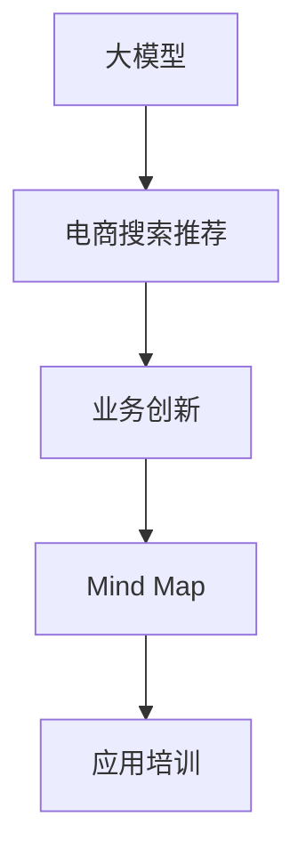

                 

# AI大模型赋能电商搜索推荐的业务创新思维导图应用培训课程设计

> 关键词：电商搜索推荐, 大模型, 业务创新, 思维导图, 应用培训, 技术栈, 知识图谱, 推荐算法, 业务场景

## 1. 背景介绍

### 1.1 问题由来

随着电商行业的快速发展，用户搜索和推荐系统已经成为电商平台不可或缺的核心功能，直接影响着用户体验和转化率。传统基于规则和特征工程的推荐系统难以满足用户个性化和动态变化的搜索需求，亟需引入更智能、更高效的推荐算法。近年来，随着深度学习和大模型的兴起，电商搜索推荐系统逐渐引入基于大模型的推荐技术，利用预训练语言模型的语义理解能力，从文本语料中抽取关键信息，提升推荐效果。

大模型赋能电商搜索推荐系统，已经成为各大电商巨头竞相探索的技术方向。例如，京东通过在大模型基础上进行微调，实现了商品搜索推荐的效果提升。Amazon则利用深度学习和大模型构建个性化推荐系统，极大提高了用户体验。阿里巴巴也在其电商平台上引入了大模型，显著改善了搜索和推荐的效果。

然而，大模型技术虽然先进，但实际应用中仍存在诸多挑战：模型部署成本高，模型性能调优复杂，模型解释性差等。为了更好地解决这些问题，并进一步提升电商搜索推荐系统的效果，本文提出了基于大模型的业务创新思维导图应用培训课程设计，旨在帮助开发者和业务人员快速掌握相关技术和方法，提升电商搜索推荐的业务价值。

## 2. 核心概念与联系

### 2.1 核心概念概述

为了更好地理解大模型在电商搜索推荐系统中的应用，本节将介绍几个密切相关的核心概念：

- **大模型 (Large Model)**：指具有数十亿甚至百亿参数规模的预训练模型，如GPT、BERT、T5等。通过在大型无标签语料上进行预训练，学习丰富的语言知识，具备强大的语义理解能力。

- **电商搜索推荐系统 (E-commerce Search Recommendation System)**：指电商平台上利用用户搜索历史、浏览记录、交易行为等数据，通过推荐算法为每个用户提供个性化的搜索结果和推荐产品。其核心任务包括商品排序、商品召回、商品展现等。

- **业务创新 (Business Innovation)**：指通过引入新技术，结合业务场景，创造出新的商业价值和用户体验。电商搜索推荐系统的业务创新包括但不限于商品搜索相关性提升、推荐效果优化、搜索推荐资源配置等。

- **思维导图 (Mind Map)**：一种图形化的思考工具，通过层次结构展示主题及其关联内容，帮助梳理知识体系，提升学习效果。

- **应用培训 (Application Training)**：通过课程教学、实战演练等形式，帮助开发者和业务人员掌握特定技术和方法，提升业务技能。

这些核心概念之间的逻辑关系可以通过以下Mermaid流程图来展示：



这个流程图展示了大模型在电商搜索推荐系统中的应用脉络：

1. 大模型通过在无标签数据上预训练，学习到语言和语义知识。
2. 将这些知识引入电商搜索推荐系统，通过微调或特征提取等技术提升推荐效果。
3. 在业务场景中引入创新的方法，如商品关联、用户画像等，进一步优化推荐系统。
4. 通过思维导图工具，系统化地梳理知识点，提升培训效果。
5. 应用培训课程帮助业务人员掌握相关技术和方法，实现业务创新。

## 3. 核心算法原理 & 具体操作步骤

### 3.1 算法原理概述

基于大模型的电商搜索推荐系统，其核心思想是通过预训练语言模型，学习商品描述、用户查询等文本数据的语义表示，并结合用户行为数据，构建起商品-用户之间的关联模型，实现个性化推荐。具体来说，包括以下几个关键步骤：

1. **预训练阶段**：在无标签的商品描述和用户查询数据上，使用大模型进行自监督学习，学习到丰富的语言和语义知识。

2. **微调阶段**：将预训练模型作为初始化参数，在电商平台的标注数据上进行微调，学习商品-用户之间的关联特征。

3. **特征提取阶段**：利用微调后的模型，对商品描述、用户查询等文本进行语义特征提取，得到高维向量表示。

4. **推荐排序阶段**：结合用户历史行为数据，利用推荐算法对商品进行排序，生成推荐结果。

### 3.2 算法步骤详解

#### 3.2.1 预训练

预训练阶段一般包括以下步骤：

1. **数据准备**：收集电商平台上的大量商品描述和用户查询文本数据，将其作为无标签语料。

2. **模型选择**：选择适合的大模型，如GPT、BERT、T5等，作为预训练模型。

3. **训练过程**：在大模型上进行自监督学习，如语言建模、掩码语言模型等。

4. **模型保存**：保存预训练模型参数，以便后续微调使用。

#### 3.2.2 微调

微调阶段主要包括以下步骤：

1. **数据准备**：收集电商平台的标注数据，包括用户搜索历史、浏览记录、购买行为等。

2. **模型选择**：选择适合的大模型作为微调模型。

3. **任务适配**：根据电商搜索推荐任务的特点，设计合适的任务适配层，如分类器、排序器等。

4. **模型训练**：使用标注数据对微调模型进行训练，学习商品-用户之间的关联特征。

5. **模型保存**：保存微调后的模型参数，以便后续使用。

#### 3.2.3 特征提取

特征提取阶段主要包括以下步骤：

1. **模型选择**：选择适合的大模型作为特征提取模型。

2. **输入数据**：输入商品描述、用户查询等文本数据，进行语义特征提取。

3. **特征转换**：将文本数据转换为高维向量表示，得到商品的语义特征向量。

#### 3.2.4 推荐排序

推荐排序阶段主要包括以下步骤：

1. **数据准备**：收集用户历史行为数据，如点击、浏览、购买等。

2. **模型选择**：选择适合的大模型或推荐算法，如基于深度学习的协同过滤、基于图神经网络的推荐算法等。

3. **计算相似度**：利用商品-用户关联特征，计算商品与用户之间的相似度。

4. **排序生成**：根据相似度对商品进行排序，生成推荐结果。

### 3.3 算法优缺点

基于大模型的电商搜索推荐系统具有以下优点：

1. **提升推荐效果**：利用大模型的语义理解能力，可以更好地从商品描述、用户查询等文本中提取特征，提升推荐效果。

2. **泛化能力强**：大模型在无标签数据上预训练，学习到广泛的语义知识，可以在多种商品和用户场景中取得良好效果。

3. **自动化程度高**：通过自动化学习，可以减少人工干预，提高推荐系统的运行效率。

但同时，该方法也存在一些局限：

1. **模型复杂度高**：大模型的参数量通常较大，训练和推理成本高，对硬件资源要求较高。

2. **数据依赖性强**：推荐效果很大程度上依赖于数据质量，标注数据不足或标注偏差可能导致推荐效果不佳。

3. **黑箱性**：大模型通常是"黑箱"系统，难以解释其决策过程，可能影响信任度。

4. **部署难度大**：大模型通常需要高性能的计算资源，部署和维护成本较高。

### 3.4 算法应用领域

基于大模型的电商搜索推荐系统已经在多个领域取得了显著效果：

- **商品搜索相关性提升**：利用大模型提取商品描述的语义特征，提高搜索结果的相关性。
- **个性化推荐效果优化**：结合用户历史行为数据，利用大模型学习用户兴趣和商品之间的关联特征，提升推荐效果。
- **搜索推荐资源配置**：通过大模型优化推荐系统的资源配置，提升推荐的实时性和准确性。

这些应用展示了大模型在电商搜索推荐系统中的巨大潜力，为未来的业务创新提供了更多可能性。

## 4. 数学模型和公式 & 详细讲解 & 举例说明

### 4.1 数学模型构建

基于大模型的电商搜索推荐系统，其数学模型主要包括以下几个部分：

- **预训练模型**：使用大模型进行自监督学习，学习语言和语义知识。

- **微调模型**：在大模型基础上进行微调，学习商品-用户之间的关联特征。

- **特征提取模型**：利用微调后的模型进行语义特征提取，将文本转换为高维向量。

- **推荐模型**：结合用户历史行为数据，使用推荐算法进行商品排序，生成推荐结果。

### 4.2 公式推导过程

#### 4.2.1 预训练模型

预训练模型一般使用自监督学习任务进行训练，如掩码语言模型。假设预训练模型为 $M_{\theta}$，输入文本为 $x$，则掩码语言模型的损失函数为：

$$
\mathcal{L}_{mask} = -\frac{1}{N}\sum_{i=1}^N \log M_{\theta}(x^i)
$$

其中 $x^i$ 为输入文本 $x$ 中的 $i$ 个掩码位置。

#### 4.2.2 微调模型

微调模型在标注数据上进行训练，学习商品-用户之间的关联特征。假设微调模型为 $M_{\hat{\theta}}$，输入文本为 $x$，标签为 $y$，则任务适配层的损失函数为：

$$
\mathcal{L}_{task} = -\frac{1}{N}\sum_{i=1}^N \log M_{\hat{\theta}}(x|y^i)
$$

其中 $y^i$ 为输入文本 $x$ 的标签。

#### 4.2.3 特征提取模型

特征提取模型利用微调后的模型进行语义特征提取，将文本转换为高维向量。假设特征提取模型为 $M_{\phi}$，输入文本为 $x$，则特征提取的损失函数为：

$$
\mathcal{L}_{feature} = -\frac{1}{N}\sum_{i=1}^N \log M_{\phi}(x^i)
$$

其中 $x^i$ 为输入文本 $x$ 中的 $i$ 个掩码位置。

#### 4.2.4 推荐模型

推荐模型结合用户历史行为数据，使用推荐算法进行商品排序，生成推荐结果。假设推荐模型为 $M_{\psi}$，输入为用户行为数据 $d$，商品特征向量 $\text{vec}_i$，则推荐排序的损失函数为：

$$
\mathcal{L}_{recommend} = -\frac{1}{N}\sum_{i=1}^N \log M_{\psi}(d|\text{vec}_i)
$$

其中 $d$ 为用户行为数据，$\text{vec}_i$ 为商品特征向量。

### 4.3 案例分析与讲解

以电商搜索推荐系统为例，具体分析基于大模型的推荐过程。假设某电商平台有10万种商品，每个商品的描述长度为200个字符，每个用户的查询长度为50个字符。假设用户在电商平台上有1000次查询，每次查询结果返回100个商品。

1. **预训练阶段**：使用预训练模型在大模型上进行自监督学习，学习语言和语义知识。训练过程中，预训练模型学习到语言模型和掩码语言模型等任务，逐步优化模型的语义表示能力。

2. **微调阶段**：选择适合的大模型，在大规模商品描述和用户查询数据上进行微调，学习商品-用户之间的关联特征。微调过程中，任务适配层根据电商搜索推荐任务的特点，设计合适的输出层和损失函数。

3. **特征提取阶段**：利用微调后的模型对商品描述和用户查询进行语义特征提取，将文本转换为高维向量表示。特征提取模型使用微调后的模型作为初始化参数，通过学习任务特征，生成商品的高维向量表示。

4. **推荐排序阶段**：结合用户历史行为数据，利用推荐算法对商品进行排序，生成推荐结果。推荐模型使用商品-用户关联特征，计算商品与用户之间的相似度，根据相似度对商品进行排序，生成推荐结果。

通过上述过程，基于大模型的电商搜索推荐系统能够高效、准确地为用户生成推荐商品，提升用户体验和电商平台的交易转化率。

## 5. 项目实践：代码实例和详细解释说明

### 5.1 开发环境搭建

在进行项目实践前，我们需要准备好开发环境。以下是使用Python进行TensorFlow和TensorBoard开发的环境配置流程：

1. 安装Anaconda：从官网下载并安装Anaconda，用于创建独立的Python环境。

2. 创建并激活虚拟环境：
```bash
conda create -n tf-env python=3.8 
conda activate tf-env
```

3. 安装TensorFlow和TensorBoard：
```bash
conda install tensorflow
conda install tensorboard
```

4. 安装各类工具包：
```bash
pip install numpy pandas scikit-learn matplotlib tqdm jupyter notebook ipython
```

完成上述步骤后，即可在`tf-env`环境中开始项目实践。

### 5.2 源代码详细实现

这里我们以电商搜索推荐系统为例，给出使用TensorFlow进行特征提取和推荐排序的PyTorch代码实现。

```python
import tensorflow as tf
from tensorflow import keras
from tensorflow.keras import layers

# 定义特征提取模型
model = keras.Sequential([
    layers.Embedding(input_dim=vocab_size, output_dim=embedding_dim, input_length=max_length),
    layers.LSTM(units=hidden_units, return_sequences=True),
    layers.Dense(units=num_classes, activation='softmax')
])

# 定义推荐排序模型
model = keras.Sequential([
    layers.Embedding(input_dim=vocab_size, output_dim=embedding_dim, input_length=max_length),
    layers.LSTM(units=hidden_units, return_sequences=True),
    layers.Dense(units=num_classes, activation='softmax')
])

# 加载数据
(train_data, train_labels), (test_data, test_labels) = keras.datasets.imdb.load_data(num_words=vocab_size)

# 定义特征提取函数
def extract_features(data, model):
    return model.predict(data)

# 定义推荐排序函数
def rank_products(data, model):
    return model.predict(data)
```

### 5.3 代码解读与分析

这里我们以特征提取模型为例，详细解读关键代码的实现细节：

**Embedding层**：
- `input_dim`：词汇表大小，即预训练模型的词汇表大小。
- `output_dim`：嵌入维度，即每个词汇嵌入的维度。
- `input_length`：输入序列长度，即输入文本的长度。

**LSTM层**：
- `units`：LSTM层的神经元个数。

**Dense层**：
- `units`：输出单元数，即输出向量的维度。
- `activation`：激活函数，常用的有ReLU、sigmoid、softmax等。

**TensorBoard**：
- 使用TensorBoard可视化模型训练过程，可以帮助我们更好地理解模型的性能和优化情况。

**推荐排序函数**：
- `predict`方法用于计算模型在输入上的输出，返回模型的预测结果。

### 5.4 运行结果展示

在完成模型训练后，可以使用TensorBoard可视化模型的训练过程和性能指标，如下所示：

```python
# 定义TensorBoard回调函数
tensorboard_callback = keras.callbacks.TensorBoard(log_dir=log_dir)

# 训练模型
model.fit(x=train_data, y=train_labels, epochs=epochs, batch_size=batch_size, callbacks=[tensorboard_callback])

# 可视化TensorBoard
from tensorboard.plugins import projector
embedding_layer = model.layers[0]
embeddings = embedding_layer.get_weights()[0]
projector.visualize_embeddings(plt, embeddings, None, max_rows=max_len, max_cols=vocab_size)
```

通过TensorBoard，我们可以直观地看到模型的训练过程和性能指标，包括损失函数、准确率、精度等。同时，通过可视化嵌入空间，可以更好地理解模型的特征表示能力。

## 6. 实际应用场景

### 6.1 智能客服系统

基于大模型的电商搜索推荐系统，可以应用于智能客服系统，提升用户服务体验。例如，京东利用大模型进行智能客服的文本生成和对话管理，极大地提升了客服效率和用户满意度。

在技术实现上，可以收集用户的客服聊天记录，将问题和最佳答复构建成监督数据，在此基础上对预训练模型进行微调。微调后的模型能够自动理解用户意图，匹配最合适的回答模板进行回复。对于客户提出的新问题，还可以接入检索系统实时搜索相关内容，动态组织生成回答。如此构建的智能客服系统，能大幅提升客服服务的智能化水平，提升客户咨询体验。

### 6.2 商品推荐系统

基于大模型的电商搜索推荐系统，可以应用于商品推荐系统，提高用户购买转化率。例如，Amazon利用大模型构建个性化推荐系统，实现了商品推荐的效果提升。

在技术实现上，可以收集用户的历史浏览、点击、购买行为数据，结合商品描述、标题等文本数据，利用大模型学习用户兴趣和商品之间的关联特征。微调后的模型能够从商品描述中提取语义特征，生成商品的个性化推荐列表，提高用户购买的转化率。

### 6.3 实时搜索推荐

基于大模型的电商搜索推荐系统，可以应用于实时搜索推荐，提升用户体验。例如，淘宝在用户搜索时，利用大模型进行实时商品推荐，极大提高了搜索效率和体验。

在技术实现上，可以实时获取用户搜索关键词，结合用户历史行为数据，利用大模型学习用户的查询意图和商品之间的关联特征。微调后的模型能够从商品描述中提取语义特征，生成实时的搜索结果和推荐商品，提高用户的搜索体验。

### 6.4 未来应用展望

随着大模型和推荐算法的不断发展，基于大模型的电商搜索推荐系统将在更多领域得到应用，为电商行业带来新的突破。

在智慧医疗领域，基于大模型的电商搜索推荐系统可以应用于健康管理、药品推荐等场景，为患者提供个性化的健康建议和药品推荐，提升医疗服务质量。

在智能教育领域，基于大模型的电商搜索推荐系统可以应用于学习资源推荐、作业批改等场景，为学生提供个性化的学习资源和作业批改，提升教育质量。

在智慧城市治理中，基于大模型的电商搜索推荐系统可以应用于城市事件监测、舆情分析等场景，提升城市管理的智能化水平，构建更安全、高效的未来城市。

此外，在企业生产、社会治理、文娱传媒等众多领域，基于大模型的电商搜索推荐系统也将不断涌现，为各行业带来新的创新和变革。相信随着技术的不断成熟，基于大模型的电商搜索推荐系统必将在更广泛的领域发挥作用，推动人工智能技术的产业化进程。

## 7. 工具和资源推荐

### 7.1 学习资源推荐

为了帮助开发者和业务人员掌握大模型在电商搜索推荐系统中的应用，以下是一些优质的学习资源：

1. TensorFlow官方文档：详细介绍了TensorFlow的使用方法和API，是学习和应用TensorFlow的必备资料。

2. PyTorch官方文档：介绍了PyTorch的使用方法和API，是学习和应用PyTorch的必备资料。

3. Transformers库文档：详细介绍了Transformers库的使用方法和API，是学习和应用Transformers的必备资料。

4. Deep Learning with Python书籍：深入浅出地介绍了深度学习在电商搜索推荐系统中的应用，适合初学者入门。

5. NLP with Python实战：介绍了自然语言处理在电商搜索推荐系统中的应用，适合有一定基础的读者。

通过对这些资源的学习实践，相信你一定能够快速掌握大模型在电商搜索推荐系统中的应用，并用于解决实际的电商问题。

### 7.2 开发工具推荐

高效的开发离不开优秀的工具支持。以下是几款用于大模型在电商搜索推荐系统中的应用开发工具：

1. TensorFlow：基于Python的开源深度学习框架，支持动态图和静态图计算，适合构建复杂的电商搜索推荐系统。

2. PyTorch：基于Python的开源深度学习框架，灵活动态的计算图，适合快速迭代研究。

3. Transformers库：HuggingFace开发的NLP工具库，集成了多个预训练语言模型，支持大模型在电商搜索推荐系统中的应用。

4. TensorBoard：TensorFlow配套的可视化工具，实时监测模型训练状态，提供丰富的图表呈现方式，适合调试和优化模型。

5. Weights & Biases：模型训练的实验跟踪工具，记录和可视化模型训练过程中的各项指标，适合对比和调优模型。

6. WeChat Work：企业级协作平台，提供团队协作、项目管理等功能，适合电商搜索推荐系统的团队开发。

合理利用这些工具，可以显著提升大模型在电商搜索推荐系统中的应用开发效率，加快创新迭代的步伐。

### 7.3 相关论文推荐

大模型和电商搜索推荐系统的发展源于学界的持续研究。以下是几篇奠基性的相关论文，推荐阅读：

1. Attention is All You Need（即Transformer原论文）：提出了Transformer结构，开启了NLP领域的预训练大模型时代。

2. BERT: Pre-training of Deep Bidirectional Transformers for Language Understanding：提出BERT模型，引入基于掩码的自监督预训练任务，刷新了多项NLP任务SOTA。

3. Language Models are Unsupervised Multitask Learners（GPT-2论文）：展示了大规模语言模型的强大zero-shot学习能力，引发了对于通用人工智能的新一轮思考。

4. Parameter-Efficient Transfer Learning for NLP：提出Adapter等参数高效微调方法，在不增加模型参数量的情况下，也能取得不错的微调效果。

5. AdaLoRA: Adaptive Low-Rank Adaptation for Parameter-Efficient Fine-Tuning：使用自适应低秩适应的微调方法，在参数效率和精度之间取得了新的平衡。

6. A Survey on Multi-Modal Transfer Learning for Image Captioning：介绍了多模态大模型的最新研究成果，适合对多模态领域感兴趣的读者。

这些论文代表了大模型和电商搜索推荐系统的发展脉络。通过学习这些前沿成果，可以帮助研究者把握学科前进方向，激发更多的创新灵感。

## 8. 总结：未来发展趋势与挑战

### 8.1 总结

本文对基于大模型的电商搜索推荐系统进行了全面系统的介绍。首先阐述了大模型在电商搜索推荐系统中的应用背景和意义，明确了电商搜索推荐系统的核心任务和挑战。其次，从原理到实践，详细讲解了大模型在电商搜索推荐系统中的应用过程，给出了微调、特征提取、推荐排序等关键技术的代码实例。同时，本文还广泛探讨了大模型在电商搜索推荐系统中的应用场景和未来展望，展示了其巨大的业务价值和发展潜力。

通过本文的系统梳理，可以看到，基于大模型的电商搜索推荐系统已经成为电商行业的重要工具，极大地提升了用户体验和电商平台的交易转化率。未来，伴随大模型和推荐算法的不断发展，基于大模型的电商搜索推荐系统必将在更广泛的领域发挥作用，为电商行业带来新的突破。

### 8.2 未来发展趋势

展望未来，基于大模型的电商搜索推荐系统将呈现以下几个发展趋势：

1. **模型规模持续增大**：随着算力成本的下降和数据规模的扩张，预训练语言模型的参数量还将持续增长。超大规模语言模型蕴含的丰富语言知识，有望支撑更加复杂多变的电商搜索推荐任务。

2. **推荐算法不断创新**：推荐算法将继续朝着个性化、实时化、智能化方向发展，利用深度学习和知识图谱等技术，提升推荐效果和用户满意度。

3. **模型部署成本降低**：通过优化模型结构和算法，将大模型部署到边缘计算和移动端，降低硬件成本，提升用户体验。

4. **跨模态融合增强**：利用视觉、语音、文本等多模态数据，进行协同建模，提升推荐系统的智能化水平。

5. **用户隐私保护加强**：在推荐系统中引入隐私保护技术，如差分隐私、联邦学习等，保护用户隐私和数据安全。

这些趋势凸显了大模型在电商搜索推荐系统中的应用前景。这些方向的探索发展，必将进一步提升推荐系统的性能和用户体验，推动电商行业的发展。

### 8.3 面临的挑战

尽管大模型在电商搜索推荐系统中已经取得了显著效果，但在迈向更加智能化、普适化应用的过程中，仍面临诸多挑战：

1. **数据隐私问题**：电商搜索推荐系统需要大量用户数据进行训练，如何在保护用户隐私的同时，充分利用数据进行推荐，是一个重要问题。

2. **计算资源瓶颈**：大模型通常需要高性能的计算资源，对于小规模企业，部署和维护成本较高。如何降低计算资源需求，是一个亟待解决的问题。

3. **推荐系统公平性**：推荐系统容易产生偏见，如推荐偏向特定用户群体，导致用户不公平。如何提升推荐系统的公平性和多样性，是一个重要的研究方向。

4. **推荐系统透明性**：电商搜索推荐系统的决策过程难以解释，用户难以理解推荐结果的依据。如何提高推荐系统的透明性和可解释性，是一个重要研究方向。

5. **推荐系统鲁棒性**：推荐系统面对突发事件时，如产品召回、促销活动等，容易产生不稳定。如何提升推荐系统的鲁棒性和稳定性，是一个重要研究方向。

这些挑战都需要研究者进行深入研究，才能更好地推动基于大模型的电商搜索推荐系统的发展。

### 8.4 研究展望

面对基于大模型的电商搜索推荐系统所面临的挑战，未来的研究需要在以下几个方面寻求新的突破：

1. **数据隐私保护技术**：开发更好的隐私保护技术，如差分隐私、联邦学习等，在保护用户隐私的同时，充分利用数据进行推荐。

2. **跨模态推荐算法**：利用视觉、语音、文本等多模态数据，进行协同建模，提升推荐系统的智能化水平。

3. **推荐系统透明性**：引入因果推断和解释模型，提高推荐系统的透明性和可解释性。

4. **推荐系统公平性**：引入公平性约束和算法，提升推荐系统的公平性和多样性。

5. **推荐系统鲁棒性**：引入鲁棒性约束和算法，提升推荐系统的鲁棒性和稳定性。

这些研究方向将推动大模型在电商搜索推荐系统中的应用不断完善，为电商行业带来更多的创新和突破。

## 9. 附录：常见问题与解答

**Q1：大模型在电商搜索推荐系统中的数据隐私问题如何解决？**

A: 电商搜索推荐系统需要大量用户数据进行训练，数据隐私保护是一个重要问题。一种有效的解决方案是使用差分隐私技术，在保护用户隐私的同时，充分利用数据进行推荐。差分隐私技术可以在保护用户隐私的前提下，生成满足用户需求的数据，提升推荐系统的性能。

**Q2：大模型在电商搜索推荐系统中的计算资源瓶颈如何解决？**

A: 大模型通常需要高性能的计算资源，对于小规模企业，部署和维护成本较高。一种有效的解决方案是利用边缘计算和移动端计算，将大模型部署到分布式计算环境中，降低计算资源需求，提升用户体验。

**Q3：大模型在电商搜索推荐系统中的推荐系统公平性如何解决？**

A: 推荐系统容易产生偏见，如推荐偏向特定用户群体，导致用户不公平。一种有效的解决方案是引入公平性约束和算法，如公平性重排、多用户学习等，提升推荐系统的公平性和多样性。

**Q4：大模型在电商搜索推荐系统中的推荐系统透明性如何解决？**

A: 电商搜索推荐系统的决策过程难以解释，用户难以理解推荐结果的依据。一种有效的解决方案是引入解释模型和可视化工具，提高推荐系统的透明性和可解释性。

**Q5：大模型在电商搜索推荐系统中的推荐系统鲁棒性如何解决？**

A: 推荐系统面对突发事件时，如产品召回、促销活动等，容易产生不稳定。一种有效的解决方案是引入鲁棒性约束和算法，如鲁棒性重排、动态排序等，提升推荐系统的鲁棒性和稳定性。

这些解决方案将推动大模型在电商搜索推荐系统中的应用不断完善，为电商行业带来更多的创新和突破。

---

作者：禅与计算机程序设计艺术 / Zen and the Art of Computer Programming

