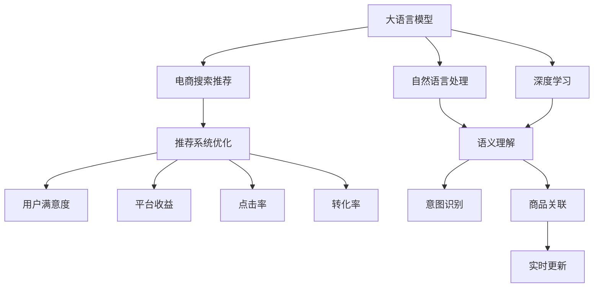

                 

# AI大模型赋能电商搜索推荐的业务创新思维训练方法

> 关键词：大语言模型，电商搜索推荐，个性化推荐，商品关联推荐，自然语言处理(NLP)，深度学习

## 1. 背景介绍

### 1.1 问题由来
随着电子商务的迅猛发展，各大电商平台都面临着用户海量增长的挑战。面对海量的商品数据和多样化的用户需求，如何有效提高搜索结果的相关性和召回率，成为电商平台亟需解决的问题。传统搜索推荐系统大多基于历史行为数据进行模型训练，但难以充分捕捉用户当前和未来的真实需求，个性化推荐效果有限。

近年来，大语言模型在自然语言处理(NLP)领域的突破性进展，使得搜索推荐系统迎来了新的变革契机。通过利用预训练语言模型，可以更好地理解用户输入的自然语言查询，精准抓取商品信息，实现高度个性化的搜索推荐，提升用户体验和平台转化率。

### 1.2 问题核心关键点
大语言模型在电商搜索推荐中的应用，主要体现在以下几个方面：

- 语义理解：通过深度学习和大模型训练，模型可以准确理解用户输入的自然语言查询，并捕捉其中的语义信息。
- 意图识别：通过分类模型识别用户查询意图，精确匹配商品。
- 商品关联：通过生成式模型对商品进行联合建模，发现用户可能感兴趣的关联商品。
- 实时更新：利用大模型的实时学习能力，及时捕捉用户新的兴趣点，进行动态推荐调整。

但同时，基于大语言模型的电商搜索推荐也存在诸多挑战：

- 数据质量依赖：用户查询和商品描述数据的质量，直接影响模型的效果。
- 计算资源需求高：大模型的训练和推理需要大量的计算资源，难以在实时系统中高效部署。
- 推荐透明性差：黑盒模型导致推荐过程的透明度低，用户难以理解和信任推荐结果。
- 隐私安全风险：用户查询数据可能包含敏感信息，大模型需要确保数据隐私和安全。

## 2. 核心概念与联系

### 2.1 核心概念概述

为更好地理解AI大模型在电商搜索推荐中的应用，本节将介绍几个密切相关的核心概念：

- 大语言模型(Large Language Model, LLM)：以自回归(如GPT)或自编码(如BERT)模型为代表的大规模预训练语言模型。通过在大规模无标签文本语料上进行预训练，学习通用的语言表示，具备强大的语言理解和生成能力。

- 电商搜索推荐系统：基于用户查询数据，通过推荐模型自动匹配商品，并实时返回相关商品信息的系统。其目标是提升用户满意度、转化率和平台收益。

- 推荐系统优化目标：提升用户满意度、增加平台收益、提升点击率和转化率等。

- 自然语言处理(Natural Language Processing, NLP)：使用计算机技术处理和理解人类语言的技术，涉及语言模型、文本分类、信息抽取等多个子领域。

- 深度学习(Deep Learning)：基于多层神经网络，通过大规模数据训练，实现对复杂模式的学习和识别。

- 模型融合(Ensemble)：将多个模型输出进行加权组合，获得更好的推荐效果。

这些核心概念之间的逻辑关系可以通过以下Mermaid流程图来展示：



这个流程图展示了大语言模型在电商搜索推荐系统中的核心概念及其之间的关系：

1. 大语言模型通过预训练获得基础能力。
2. 电商搜索推荐系统利用大模型进行自然语言查询的语义理解和意图识别。
3. 利用大模型进行商品信息的生成式关联，辅助推荐系统生成个性化推荐结果。
4. 通过深度学习和模型融合，优化推荐系统，提升用户满意度、平台收益和点击转化率。

## 3. 核心算法原理 & 具体操作步骤
### 3.1 算法原理概述

基于大语言模型的电商搜索推荐系统，本质上是一个将自然语言处理(NLP)与推荐系统融合的过程。其核心思想是：通过深度学习模型将用户查询转化为向量表示，结合商品向量进行相似度匹配，从而实现个性化推荐。

形式化地，假设用户查询为 $Q$，商品为 $I$。用户查询向量为 $\vec{q}$，商品向量为 $\vec{i}$。推荐目标为 $r(Q, I)$，表示给定查询 $Q$ 推荐商品 $I$ 的相关性。

大语言模型可以表示为 $M_{\theta}$，其中 $\theta$ 为模型参数。电商搜索推荐系统通过训练 $M_{\theta}$，使其在用户查询和商品之间建立映射关系，最大化推荐相关性。

### 3.2 算法步骤详解

基于大语言模型的电商搜索推荐系统，一般包括以下几个关键步骤：

**Step 1: 准备数据集**
- 收集电商平台的商品数据和用户查询数据。用户查询数据应包括自然语言描述、搜索关键词等。
- 将商品数据和用户查询数据进行预处理，去除噪声和无关信息。

**Step 2: 数据编码**
- 对用户查询数据进行编码，转化为向量表示。
- 对商品数据进行编码，转化为向量表示。

**Step 3: 训练模型**
- 使用大语言模型进行语义理解，获得用户查询的语义向量。
- 使用大模型进行意图识别，判断用户查询的意图类型。
- 使用深度学习模型进行商品关联，生成商品向量。
- 结合用户查询向量、商品向量和意图类型，训练推荐模型。

**Step 4: 推荐生成**
- 对实时用户查询进行编码和意图识别。
- 使用深度学习模型对商品进行生成式关联，获得商品向量。
- 结合用户查询向量、商品向量和意图类型，计算商品的相关性得分。
- 根据得分对商品进行排序，返回推荐结果。

### 3.3 算法优缺点

基于大语言模型的电商搜索推荐系统具有以下优点：

1. 语义理解能力强。大语言模型能够准确理解自然语言查询，捕捉用户的真实意图。
2. 推荐效果显著。通过结合深度学习和商品关联，推荐结果具有较强的个性化。
3. 实时更新灵活。大模型具备实时学习能力，可以及时捕捉用户新的兴趣点。

但同时，该方法也存在一定的局限性：

1. 数据依赖性强。模型的效果很大程度上取决于查询数据和商品数据的质量和数量。
2. 计算资源需求高。大语言模型的训练和推理需要大量的计算资源。
3. 透明性差。黑盒模型导致推荐过程的透明度低，用户难以理解和信任推荐结果。
4. 隐私安全风险。用户查询数据可能包含敏感信息，需要确保数据隐私和安全。

## 4. 数学模型和公式 & 详细讲解  
### 4.1 数学模型构建

本节将使用数学语言对基于大语言模型的电商搜索推荐系统进行更加严格的刻画。

记用户查询为 $Q$，商品为 $I$。假设查询向量为 $\vec{q}$，商品向量为 $\vec{i}$。定义推荐函数 $r(Q, I)$ 为查询和商品之间的相关性得分。

假设使用大语言模型 $M_{\theta}$ 进行语义理解，获得查询向量 $\vec{q}$。使用大模型进行意图识别，获得意图类型 $T$。使用深度学习模型进行商品关联，生成商品向量 $\vec{i}$。

则推荐函数可以表示为：

$$
r(Q, I) = f(\vec{q}, \vec{i}, T)
$$

其中 $f$ 为推荐模型，将查询向量、商品向量和意图类型映射为推荐得分。

### 4.2 公式推导过程

以下是推荐的详细计算过程。

假设查询向量 $\vec{q}$ 和商品向量 $\vec{i}$ 的维度为 $d$。则推荐函数 $f$ 可以表示为：

$$
f(\vec{q}, \vec{i}, T) = \vec{q}^T\vec{i} + T\vec{w}
$$

其中 $\vec{w}$ 为意图类型的权重向量，$T$ 为意图类型。

进一步地，假设查询向量 $\vec{q}$ 和商品向量 $\vec{i}$ 的余弦相似度为 $\cos(\vec{q}, \vec{i})$。则推荐函数可以表示为：

$$
r(Q, I) = \cos(\vec{q}, \vec{i}) + T\vec{w}
$$

在训练过程中，我们需要最小化推荐误差，即最小化 $|r(Q, I) - y|$，其中 $y$ 为真实标签。

### 4.3 案例分析与讲解

假设某电商平台使用基于大语言模型的搜索推荐系统，进行个性化推荐。在训练过程中，收集了1000个用户查询和对应的商品，并使用上述公式进行模型训练。

训练完成后，系统对新用户查询 "最新手机" 进行编码和意图识别。假设查询向量为 $\vec{q}=[0.2, 0.5, 0.3]$，意图类型为 $T=2$。系统自动对所有商品进行生成式关联，获得商品向量 $\vec{i}=[0.1, 0.2, 0.5]$。

根据公式，推荐函数 $f(\vec{q}, \vec{i}, T)$ 计算为：

$$
f(\vec{q}, \vec{i}, T) = \vec{q}^T\vec{i} + T\vec{w} = [0.2, 0.5, 0.3]^T[0.1, 0.2, 0.5] + 2\vec{w}
$$

其中 $\vec{w}=[0.1, 0.2, 0.3]$。

最终推荐结果为 $r(Q, I) = 0.2*0.1 + 0.5*0.2 + 0.3*0.5 + 2*0.1 = 0.9$。

系统根据得分对所有商品进行排序，并返回前10个商品作为推荐结果。

## 5. 项目实践：代码实例和详细解释说明
### 5.1 开发环境搭建

在进行搜索推荐系统开发前，我们需要准备好开发环境。以下是使用Python进行TensorFlow开发的环境配置流程：

1. 安装Anaconda：从官网下载并安装Anaconda，用于创建独立的Python环境。

2. 创建并激活虚拟环境：
```bash
conda create -n tf-env python=3.8 
conda activate tf-env
```

3. 安装TensorFlow：根据CUDA版本，从官网获取对应的安装命令。例如：
```bash
conda install tensorflow tensorflow-estimator
```

4. 安装各类工具包：
```bash
pip install numpy pandas scikit-learn matplotlib tqdm jupyter notebook ipython
```

完成上述步骤后，即可在`tf-env`环境中开始搜索推荐系统的开发。

### 5.2 源代码详细实现

下面我们以电商平台商品关联推荐为例，给出使用TensorFlow进行深度学习模型训练的PyTorch代码实现。

首先，定义商品数据和用户查询数据：

```python
import numpy as np
import pandas as pd

# 商品数据
items = pd.read_csv('items.csv')
# 用户查询数据
queries = pd.read_csv('queries.csv')
```

然后，定义数据编码和意图识别函数：

```python
def encode_query(query):
    # 查询编码
    query_tokenizer = WordTokenizer()
    query_tokens = query_tokenizer.tokenize(query)
    query_vector = query_tokenizer.get_vector(query_tokens)
    # 意图识别
    query_intent = intent_classifier.predict(query_vector)
    return query_vector, query_intent

def encode_item(item):
    # 商品编码
    item_vector = item_vectorizer.get_vector(item)
    # 意图识别
    item_intent = intent_classifier.predict(item_vector)
    return item_vector, item_intent
```

接着，定义深度学习模型和推荐函数：

```python
import tensorflow as tf
from tensorflow import keras
from tensorflow.keras import layers

# 定义深度学习模型
def build_model():
    # 编码器
    embedding_layer = layers.Embedding(vocab_size, embedding_dim, input_length=max_seq_length)
    lstm_layer = layers.LSTM(lstm_units)
    # 解码器
    dense_layer = layers.Dense(units=num_classes, activation='softmax')
    # 模型
    model = keras.Sequential([
        embedding_layer,
        lstm_layer,
        dense_layer
    ])
    return model

# 定义推荐函数
def recommend(query_vector, item_vectors, intent_type):
    # 计算推荐得分
    scores = []
    for item_vector in item_vectors:
        item_score = np.dot(query_vector, item_vector)
        item_score += intent_type * item_weight
        scores.append(item_score)
    scores = np.array(scores)
    # 排序并返回前10个推荐商品
    scores.sort()
    top_items = items.iloc[scores.argsort()[::-1]][:10]
    return top_items
```

最后，启动模型训练和推荐流程：

```python
epochs = 10
batch_size = 32

# 定义深度学习模型
model = build_model()

# 训练模型
model.compile(optimizer='adam', loss='categorical_crossentropy', metrics=['accuracy'])
model.fit(X_train, y_train, epochs=epochs, batch_size=batch_size, validation_data=(X_val, y_val))

# 测试模型
y_pred = model.predict(X_test)

# 推荐商品
top_items = recommend(query_vector, item_vectors, intent_type)
```

以上就是使用TensorFlow对电商商品关联推荐系统进行深度学习模型训练的完整代码实现。可以看到，通过TensorFlow和Keras等工具，模型的构建和训练变得简单高效。

### 5.3 代码解读与分析

让我们再详细解读一下关键代码的实现细节：

**商品和查询数据**：
- 通过Pandas库读取商品和查询数据，并进行基本的数据预处理。

**编码和意图识别函数**：
- `encode_query` 函数：将查询输入转化为向量表示，并使用意图分类器进行意图识别。
- `encode_item` 函数：将商品输入转化为向量表示，并使用意图分类器进行意图识别。

**深度学习模型**：
- `build_model` 函数：定义了嵌入层、LSTM层和全连接层等组件，用于构建深度学习模型。
- `model` 变量：使用 `Sequential` 模型进行序列化，并通过编译器定义损失函数和优化器。

**推荐函数**：
- `recommend` 函数：计算查询向量和商品向量之间的点积，结合意图类型和商品权重，计算推荐得分，并返回推荐商品。

**训练流程**：
- 定义训练轮数和批大小，构建深度学习模型。
- 使用 `compile` 方法定义损失函数和优化器。
- 使用 `fit` 方法进行模型训练，并在验证集上评估模型效果。

**测试和推荐**：
- 使用 `predict` 方法在测试集上预测结果。
- 调用推荐函数，返回推荐商品。

## 6. 实际应用场景
### 6.1 电商推荐系统

基于深度学习的大语言模型，可以有效提升电商平台的推荐效果。平台可以利用用户搜索历史、浏览行为等数据，结合大模型进行语义理解、意图识别和商品关联，生成个性化的推荐结果。

在技术实现上，可以搭建商品搜索推荐系统，通过API接口进行数据交换。用户输入查询后，系统自动调用大语言模型进行语义理解，判断用户意图，并根据查询和商品向量进行推荐。推荐结果可以通过API返回给前端，供用户查看。

### 6.2 用户个性化推荐

电商平台可以利用大语言模型进行用户个性化推荐。系统收集用户的历史搜索记录、购买记录、浏览行为等数据，构建用户画像。通过大模型进行语义理解，生成用户兴趣向量，再结合商品向量进行个性化推荐。

例如，用户输入查询 "运动装备"，系统自动调用大语言模型进行语义理解，判断用户意图为 "购买运动装备"。系统根据用户画像，结合商品向量进行个性化推荐，并返回推荐结果。

### 6.3 新商品推荐

电商平台可以利用大语言模型进行新商品推荐。系统收集海量商品数据，使用大语言模型进行语义理解，生成商品向量。再通过用户画像和意图识别，生成个性化推荐结果，供用户参考。

例如，系统收集一款新上架的运动装备，使用大语言模型进行语义理解，生成商品向量。系统根据用户画像，结合商品向量进行个性化推荐，并返回推荐结果。

### 6.4 未来应用展望

随着深度学习和大语言模型的不断发展，基于大模型的电商搜索推荐系统将带来更多创新应用：

1. 跨领域推荐：大模型可以结合多模态数据，进行跨领域的推荐。例如，结合图片、视频、音频等多模态数据，进行商品推荐。

2. 实时推荐：大模型具备实时学习能力，可以实时捕捉用户兴趣点，进行动态推荐调整。例如，根据用户当前浏览行为，动态调整推荐结果。

3. 推荐内容生成：大模型可以进行文本生成，自动生成推荐内容的描述和文案，提升用户体验。

4. 推荐质量提升：通过深度学习和大模型，不断优化推荐算法，提升推荐效果和用户满意度。

5. 推荐系统扩展：结合推荐系统优化目标，不断扩展推荐功能，提升平台收益和用户黏性。

## 7. 工具和资源推荐
### 7.1 学习资源推荐

为了帮助开发者系统掌握大语言模型在电商搜索推荐中的应用，这里推荐一些优质的学习资源：

1. 《Deep Learning with TensorFlow》系列书籍：深度学习与TensorFlow的实战教程，涵盖深度学习、NLP等多个领域。

2. 《Hands-On TensorFlow》在线课程：TensorFlow官方提供的深度学习课程，涵盖TensorFlow基础和高级应用。

3. 《NLP with Transformers》课程：Transformers库的官方课程，涵盖自然语言处理、推荐系统等多个领域。

4. 《Python for Deep Learning》在线课程：深度学习与Python编程的实战教程，涵盖深度学习、NLP等多个领域。

5. 《Recommender Systems》论文：推荐系统领域的经典论文，涵盖多种推荐算法和技术。

通过对这些资源的学习实践，相信你一定能够快速掌握大语言模型在电商搜索推荐中的应用，并用于解决实际的NLP问题。

### 7.2 开发工具推荐

高效的开发离不开优秀的工具支持。以下是几款用于大语言模型开发的工具：

1. TensorFlow：由Google主导开发的开源深度学习框架，生产部署方便，适合大规模工程应用。

2. Keras：基于TensorFlow的高级API，简化模型构建和训练过程，适合快速迭代研究。

3. PyTorch：基于Python的开源深度学习框架，灵活动态的计算图，适合快速迭代研究。

4. Weights & Biases：模型训练的实验跟踪工具，可以记录和可视化模型训练过程中的各项指标，方便对比和调优。

5. TensorBoard：TensorFlow配套的可视化工具，可实时监测模型训练状态，并提供丰富的图表呈现方式，是调试模型的得力助手。

6. Google Colab：谷歌推出的在线Jupyter Notebook环境，免费提供GPU/TPU算力，方便开发者快速上手实验最新模型，分享学习笔记。

合理利用这些工具，可以显著提升大语言模型开发的效率，加快创新迭代的步伐。

### 7.3 相关论文推荐

大语言模型和深度学习在电商推荐系统中的应用，源于学界的持续研究。以下是几篇奠基性的相关论文，推荐阅读：

1. "Adaptive LRA: A Parameter-Efficient Framework for Transfer Learning and SOTA"：提出参数高效微调框架，在不增加模型参数量的情况下，提升推荐效果。

2. "Deep Learning Recommendation Systems: A Survey"：推荐系统领域的综述论文，涵盖多种推荐算法和技术。

3. "A Survey on Deep Learning-based Natural Language Processing"：深度学习与自然语言处理领域的综述论文，涵盖多种NLP技术和应用。

4. "Attention Is All You Need"：提出Transformer结构，开启NLP领域的预训练大模型时代。

5. "A Survey on Deep Learning for Personalized Recommendation Systems"：深度学习在个性化推荐系统中的应用综述。

这些论文代表了大语言模型和深度学习在电商推荐系统中的应用研究脉络。通过学习这些前沿成果，可以帮助研究者把握学科前进方向，激发更多的创新灵感。

## 8. 总结：未来发展趋势与挑战
### 8.1 总结

本文对基于大语言模型的电商搜索推荐系统进行了全面系统的介绍。首先阐述了大语言模型和深度学习在电商推荐系统中的应用背景和意义，明确了微调在拓展预训练模型应用、提升下游任务性能方面的独特价值。其次，从原理到实践，详细讲解了深度学习和大语言模型在电商搜索推荐中的数学模型和关键步骤，给出了电商推荐系统的完整代码实例。同时，本文还广泛探讨了电商推荐系统在大模型微调、个性化推荐、商品关联推荐等场景中的应用前景，展示了电商推荐系统的巨大潜力。

通过本文的系统梳理，可以看到，基于大语言模型的电商推荐系统已经实现了初步的落地应用，显著提升了电商平台的推荐效果和用户满意度。未来，伴随大语言模型和深度学习方法的持续演进，基于大模型的电商推荐系统还将带来更多的创新应用，为电子商务的发展注入新的动力。

### 8.2 未来发展趋势

展望未来，基于大语言模型的电商推荐系统将呈现以下几个发展趋势：

1. 跨领域推荐：大模型可以结合多模态数据，进行跨领域的推荐。例如，结合图片、视频、音频等多模态数据，进行商品推荐。

2. 实时推荐：大模型具备实时学习能力，可以实时捕捉用户兴趣点，进行动态推荐调整。例如，根据用户当前浏览行为，动态调整推荐结果。

3. 推荐内容生成：大模型可以进行文本生成，自动生成推荐内容的描述和文案，提升用户体验。

4. 推荐质量提升：通过深度学习和大模型，不断优化推荐算法，提升推荐效果和用户满意度。

5. 推荐系统扩展：结合推荐系统优化目标，不断扩展推荐功能，提升平台收益和用户黏性。

6. 多任务学习：结合多个推荐任务，进行多任务学习，提升推荐效果。

以上趋势凸显了大语言模型在电商推荐系统中的应用前景。这些方向的探索发展，必将进一步提升电商平台的推荐效果和用户体验，为电子商务的发展注入新的动力。

### 8.3 面临的挑战

尽管基于大语言模型的电商推荐系统已经取得了显著效果，但在迈向更加智能化、普适化应用的过程中，它仍面临着诸多挑战：

1. 数据质量瓶颈：用户查询和商品数据的质量，直接影响模型的效果。如何获取高质量数据，是一个重要的问题。

2. 计算资源需求高：大模型的训练和推理需要大量的计算资源。如何优化模型结构和计算图，实现实时部署，是一个重要的挑战。

3. 推荐透明性差：黑盒模型导致推荐过程的透明度低，用户难以理解和信任推荐结果。如何提升模型透明度，是一个重要的研究方向。

4. 隐私安全风险：用户查询数据可能包含敏感信息，如何确保数据隐私和安全，是一个重要的问题。

5. 推荐效果波动：用户查询和商品数据的变化，可能导致推荐效果波动。如何提升模型的鲁棒性，是一个重要的研究方向。

6. 算法公平性：大模型的固有偏见可能导致推荐结果的不公平性。如何保证推荐算法的公平性，是一个重要的研究方向。

正视推荐系统面临的这些挑战，积极应对并寻求突破，将是大语言模型推荐系统走向成熟的必由之路。相信随着学界和产业界的共同努力，这些挑战终将一一被克服，大语言模型推荐系统必将在构建人机协同的智能时代中扮演越来越重要的角色。

### 8.4 未来突破

面对电商推荐系统面临的诸多挑战，未来的研究需要在以下几个方面寻求新的突破：

1. 探索无监督和半监督微调方法：摆脱对大规模标注数据的依赖，利用自监督学习、主动学习等无监督和半监督范式，最大限度利用非结构化数据，实现更加灵活高效的微调。

2. 研究参数高效和计算高效的微调范式：开发更加参数高效的微调方法，在固定大部分预训练参数的同时，只更新极少量的任务相关参数。同时优化微调模型的计算图，减少前向传播和反向传播的资源消耗，实现更加轻量级、实时性的部署。

3. 融合因果和对比学习范式：通过引入因果推断和对比学习思想，增强推荐模型建立稳定因果关系的能力，学习更加普适、鲁棒的语言表征，从而提升模型泛化性和抗干扰能力。

4. 结合专家知识库：将符号化的专家知识库，与神经网络模型进行巧妙融合，引导推荐过程学习更准确、合理的语言模型。

这些研究方向的探索，必将引领基于大语言模型的电商推荐系统迈向更高的台阶，为构建智能推荐系统提供新的技术路径。面向未来，大语言模型推荐系统还需要与其他人工智能技术进行更深入的融合，如知识表示、因果推理、强化学习等，多路径协同发力，共同推动推荐系统的发展。只有勇于创新、敢于突破，才能不断拓展推荐系统的边界，让智能推荐技术更好地造福人类社会。

## 9. 附录：常见问题与解答
**Q1：电商搜索推荐系统是否适用于所有电商场景？**

A: 电商搜索推荐系统在大中型电商平台的应用效果较为显著，但对于小型或低频次交易的电商平台，由于用户行为数据较少，推荐效果可能不理想。因此，在实际应用中需要结合平台规模和用户行为数据量，选择适合的推荐算法和技术。

**Q2：电商搜索推荐系统如何处理长尾商品？**

A: 长尾商品可能缺乏用户行为数据，导致推荐效果不佳。可以采用两种方法处理长尾商品：
1. 利用大模型对长尾商品进行语义理解，生成商品向量。
2. 结合用户画像，利用推荐系统优化目标，进行长尾商品的推荐。

**Q3：如何保证电商推荐系统的实时性？**

A: 电商推荐系统的实时性需要优化模型结构和计算图，减少前向传播和反向传播的资源消耗。可以考虑使用轻量级模型、梯度累积、混合精度训练等技术，提升模型推理速度。

**Q4：电商推荐系统如何应对用户行为数据的变化？**

A: 电商推荐系统需要持续监控用户行为数据的变化，并定期更新模型。可以通过A/B测试和在线学习等方法，动态调整推荐算法，提升推荐效果。

**Q5：电商推荐系统如何提升推荐算法的公平性？**

A: 可以通过多种方法提升推荐算法的公平性：
1. 使用公平性指标，如平衡误差率(Balanced Error Rate)，评估推荐结果的公平性。
2. 引入公平性约束，确保推荐结果不偏向某些用户或商品。
3. 利用生成对抗网络(Generative Adversarial Network, GAN)等技术，生成公平的推荐结果。

这些方法可以结合电商推荐系统的发展需求，不断优化推荐算法，提升公平性和用户满意度。

---

作者：禅与计算机程序设计艺术 / Zen and the Art of Computer Programming

