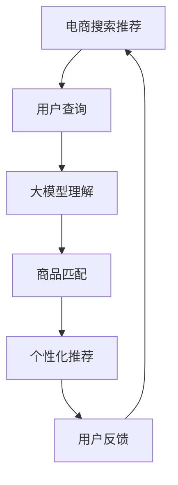

                 

# AI大模型赋能电商搜索推荐的业务创新方法论培训体系

> 关键词：大模型,电商搜索推荐,推荐系统,搜索算法,深度学习,模型训练,推理优化,业务创新

## 1. 背景介绍

在电商行业，搜索推荐系统作为客户流量来源的重要入口，承担着引导用户发现商品、满足需求的核心任务。传统的搜索推荐算法，依赖于用户行为数据和历史评分构建模型，以预测用户对商品的偏好和可能的购买行为。然而，这种方法往往面临着数据稀疏、模型难以覆盖长尾商品、用户行为多样性高等问题。

近年来，大语言模型(AI大模型)凭借其强大的自然语言处理能力，在电商领域展现出了巨大的应用潜力。借助大模型进行电商搜索推荐，能够突破传统推荐系统的瓶颈，提供更准确、更个性化、更高效的搜索结果和推荐内容，从而大幅提升电商用户体验和平台转化率。

基于此，本文将系统介绍如何通过大模型赋能电商搜索推荐系统，构建业务创新方法论的培训体系，以期帮助电商企业打破数据和算法的限制，实现搜索推荐业务的高效转型和创新突破。

## 2. 核心概念与联系

### 2.1 核心概念概述

为了更好地理解大模型在电商搜索推荐中的应用，首先介绍一些关键概念：

- **大模型**：指以Transformer、BERT等架构为基础，通过大规模无标签文本数据进行预训练，具有强大语言理解和生成能力的人工智能模型。
- **电商搜索推荐**：电商平台的搜索推荐系统，通过理解用户输入的查询，推荐与用户兴趣和意图相匹配的商品，以提升用户购物体验和转化率。
- **推荐系统**：以用户行为数据为输入，预测用户对商品可能的态度和行为，提供个性化推荐服务。
- **深度学习**：基于神经网络模型进行数据处理和决策的机器学习技术。
- **模型训练**：使用标注数据和优化算法更新模型参数，使其能够对新数据进行精准预测。
- **推理优化**：针对大规模模型进行优化，以提升推理速度和效率。
- **业务创新**：通过技术革新和业务流程再造，带来新的商业模式、产品功能和服务体验。

这些核心概念之间存在紧密联系，共同构成了电商搜索推荐系统的大模型赋能方法论体系。

### 2.2 核心概念原理和架构的 Mermaid 流程图



该图展示了电商搜索推荐系统的主要流程：用户输入查询(A)，大模型理解用户意图(C)，商品匹配和推荐(D)，用户反馈(E)，形成闭环优化反馈(A)。大模型作为核心组件，负责理解查询、匹配商品和生成推荐，显著提升了搜索推荐系统的性能和智能化程度。

## 3. 核心算法原理 & 具体操作步骤

### 3.1 算法原理概述

基于大模型的电商搜索推荐系统，通常遵循以下步骤：

1. **大模型预训练**：使用大规模无标签文本数据进行预训练，学习通用的语言表示和知识。
2. **任务适配**：根据电商搜索推荐的任务特点，设计特定任务适配层，调整模型输出和损失函数。
3. **模型微调**：利用电商平台的标注数据集，通过有监督的微调方法，优化模型针对特定任务的性能。
4. **推理优化**：针对大规模模型进行优化，提高推理速度和资源利用效率。
5. **业务集成**：将优化后的模型集成到电商平台的搜索推荐系统中，实时提供个性化推荐服务。

### 3.2 算法步骤详解

#### 3.2.1 大模型预训练

预训练是构建大模型的基础步骤。以BERT模型为例，其训练步骤如下：

1. 数据准备：从维基百科、新闻等文本语料库中收集大规模无标签文本数据。
2. 数据预处理：对文本进行分词、去除停用词等预处理。
3. 模型训练：使用Transformer架构，在自回归语言模型任务上进行预训练，学习语言表示。

#### 3.2.2 任务适配和微调

任务适配和微调是电商搜索推荐的核心步骤。以商品推荐任务为例，步骤如下：

1. 设计适配层：在模型顶层添加全连接层和softmax层，用于输出推荐商品的得分和概率分布。
2. 确定损失函数：使用交叉熵损失函数，衡量预测概率分布与实际标签之间的差异。
3. 数据准备：收集电商平台的标注数据集，如用户评分、点击记录等。
4. 微调优化：使用AdamW等优化算法，以较小的学习率更新模型参数，最小化损失函数。

#### 3.2.3 推理优化

推理优化是提升大模型实时服务能力的关键步骤。以T5模型为例，其优化步骤如下：

1. 压缩模型：通过量化、剪枝等技术，减少模型参数量，提升推理速度。
2. 分布式推理：使用多机多卡并行计算，提高模型计算效率。
3. 推理加速：使用GPU、TPU等硬件加速模型计算，提升推理速度。

#### 3.2.4 业务集成

业务集成是将大模型应用到电商搜索推荐系统的最后一步。步骤如下：

1. 接口封装：将大模型封装为标准化的API接口，便于系统调用。
2. 实时服务：通过云平台或自建服务器，部署大模型服务，实时提供推荐服务。
3. 监控与优化：实时监测系统性能，调整参数和资源配置，提升系统稳定性。

### 3.3 算法优缺点

大模型赋能电商搜索推荐系统的优点在于：

- **高效精准**：大模型拥有强大的语言理解和生成能力，能够从用户查询中准确理解意图，生成个性化推荐。
- **鲁棒性强**：大模型通过预训练和微调，能够适应不同场景和数据分布，减少过拟合风险。
- **灵活可扩展**：大模型能够灵活扩展到各种推荐任务，如搜索、个性化推荐、广告推荐等。

缺点在于：

- **计算资源消耗大**：大模型的参数量和计算复杂度高，需要强大的硬件支持。
- **解释性不足**：大模型作为黑盒模型，难以解释其内部工作机制和决策逻辑。
- **数据依赖性强**：大模型需要大量标注数据进行微调，对于长尾商品和高频变化的市场，数据获取难度大。

### 3.4 算法应用领域

大模型赋能电商搜索推荐系统，在电商领域有着广泛的应用场景，具体包括：

1. **商品搜索**：根据用户输入的查询，快速找到相关商品。
2. **个性化推荐**：利用用户行为数据，推荐用户可能感兴趣的商品。
3. **广告推荐**：根据用户兴趣和行为，精准推送广告。
4. **内容推荐**：推荐用户可能感兴趣的文章、视频等媒体内容。
5. **客服对话**：通过对话模型，实时回答用户问题，提升用户体验。

## 4. 数学模型和公式 & 详细讲解 & 举例说明

### 4.1 数学模型构建

以推荐系统为例，假设模型 $M_{\theta}$ 能够输出商品的得分向量 $s = [s_1, s_2, ..., s_n]$，其中 $s_i$ 表示第 $i$ 个商品的得分。用户输入的查询表示为 $x$，真实标签为 $y$。推荐系统的目标是最大化用户对商品的满意度，可以通过下式建模：

$$
\max_{\theta} \frac{1}{N}\sum_{i=1}^N \log p(y_i|x; \theta)
$$

其中 $p(y_i|x; \theta)$ 为条件概率，表示在输入 $x$ 条件下，商品 $i$ 被选择的概率。

### 4.2 公式推导过程

在上述优化目标的基础上，推荐系统通常采用最大似然估计和交叉熵损失函数，推导过程如下：

1. 最大似然估计：
$$
\max_{\theta} \frac{1}{N}\sum_{i=1}^N \log p(y_i|x; \theta)
$$
2. 对数似然：
$$
\log p(y_i|x; \theta) = \log \frac{e^{s_i}}{\sum_{j=1}^n e^{s_j}}
$$
3. 交叉熵损失函数：
$$
\mathcal{L}(\theta) = -\frac{1}{N}\sum_{i=1}^N [y_i\log p(y_i|x; \theta) + (1-y_i)\log(1-p(y_i|x; \theta))]
$$

### 4.3 案例分析与讲解

以电商商品推荐为例，假设有一个用户输入查询“夏季衣服”，大模型将其转化为向量表示 $x$，模型输出商品的得分向量 $s$。模型的目标是最小化交叉熵损失函数，具体推导过程如下：

1. 对用户查询进行向量表示：
$$
x = [x_1, x_2, ..., x_n]
$$
2. 对商品进行向量表示：
$$
s = [s_1, s_2, ..., s_n]
$$
3. 计算交叉熵损失：
$$
\mathcal{L}(\theta) = -\frac{1}{N}\sum_{i=1}^N [y_i\log p(y_i|x; \theta) + (1-y_i)\log(1-p(y_i|x; \theta))]
$$

## 5. 项目实践：代码实例和详细解释说明

### 5.1 开发环境搭建

为了进行电商搜索推荐系统的开发，需要搭建以下开发环境：

1. **Python环境**：选择3.7及以上版本的Python，安装必要的依赖包。
2. **深度学习框架**：选择PyTorch或TensorFlow等深度学习框架。
3. **模型库**：选择预训练模型库，如HuggingFace、OpenAI等。
4. **分布式计算**：选择Spark、Dask等分布式计算框架，以支持大规模模型训练和推理。

### 5.2 源代码详细实现

以下是一个基于BERT模型的电商商品推荐系统的示例代码：

```python
import torch
import torch.nn as nn
import torch.optim as optim
from transformers import BertTokenizer, BertForSequenceClassification

class RecommendationModel(nn.Module):
    def __init__(self, num_classes):
        super(RecommendationModel, self).__init__()
        self.bert = BertForSequenceClassification.from_pretrained('bert-base-uncased', num_labels=num_classes)
        
    def forward(self, input_ids, attention_mask):
        output = self.bert(input_ids, attention_mask=attention_mask)
        return output

# 数据准备
tokenizer = BertTokenizer.from_pretrained('bert-base-uncased')
train_data = ['商品1', '商品2', '商品3']
train_labels = [1, 0, 1]
train_dataset = TokenDataset(train_data, train_labels, tokenizer)

# 模型初始化
model = RecommendationModel(num_classes=2)
criterion = nn.CrossEntropyLoss()
optimizer = optim.Adam(model.parameters(), lr=1e-5)

# 训练模型
device = torch.device('cuda' if torch.cuda.is_available() else 'cpu')
model.to(device)
for epoch in range(5):
    model.train()
    optimizer.zero_grad()
    output = model(train_dataset.input_ids.to(device), train_dataset.attention_mask.to(device))
    loss = criterion(output, train_dataset.labels.to(device))
    loss.backward()
    optimizer.step()
    print('Epoch {} - Loss: {:.4f}'.format(epoch+1, loss.item()))

# 测试模型
test_data = ['商品4', '商品5']
test_labels = [0, 1]
test_dataset = TokenDataset(test_data, test_labels, tokenizer)
model.eval()
output = model(test_dataset.input_ids.to(device), test_dataset.attention_mask.to(device))
print('Prediction:', output.argmax().item())
```

### 5.3 代码解读与分析

在上述代码中，我们首先定义了推荐模型 `RecommendationModel`，使用预训练的BERT模型进行商品推荐。接着，准备训练数据和标签，初始化模型、损失函数和优化器。最后，在训练过程中，通过迭代更新模型参数，最小化损失函数，并输出预测结果。

## 6. 实际应用场景

### 6.1 智能客服

大模型在电商智能客服中的应用，可以显著提升客服响应速度和用户满意度。客服系统可以根据用户提问，使用大模型生成最佳回答，提升服务质量和效率。

### 6.2 个性化推荐

大模型可以通过分析用户行为和查询历史，生成个性化推荐，提升用户购物体验。电商平台可以利用大模型，为每位用户提供定制化的商品推荐，增加转化率。

### 6.3 广告推荐

大模型可以分析用户兴趣和行为，精准推送广告，提升广告转化率。电商企业可以通过大模型，对潜在客户进行有针对性的广告投放，实现更高的广告回报率。

### 6.4 未来应用展望

未来，随着大模型的进一步发展和电商搜索推荐系统的优化，大模型将广泛应用于更多电商场景。例如，基于大模型的商品搜索将更加智能化，能够理解自然语言查询，提供精准的商品匹配。同时，大模型还可以应用于社交电商、社区电商等新兴领域，提升用户体验和平台运营效率。

## 7. 工具和资源推荐

### 7.1 学习资源推荐

为了帮助开发者快速掌握大模型在电商搜索推荐中的应用，推荐以下学习资源：

1. 《深度学习理论与实践》书籍：详细介绍了深度学习的基本原理和实践技巧，适合初学者入门。
2. 《自然语言处理基础》课程：介绍了自然语言处理的基本概念和常用技术，包括大模型的预训练和微调。
3. 《电商推荐系统设计与实现》书籍：介绍了电商推荐系统的设计思路和实现方法，适合电商开发者参考。
4. 《AI大模型应用实战》课程：实战案例讲解，手把手教你应用大模型进行电商搜索推荐。
5. 《Transformers官方文档》：提供了丰富的大模型预训练模型和微调样例，是开发实践的必备资料。

### 7.2 开发工具推荐

为了提高开发效率，推荐以下开发工具：

1. **PyTorch**：灵活的动态计算图框架，支持高效的深度学习模型开发。
2. **TensorFlow**：生产级深度学习框架，适合大规模模型训练和推理。
3. **HuggingFace Transformers**：提供了丰富的大模型和微调样例，方便快速开发和部署。
4. **AWS SageMaker**：亚马逊云平台上的深度学习框架，支持模型训练、部署和优化。
5. **Jupyter Notebook**：交互式的开发环境，方便快速迭代和调试。

### 7.3 相关论文推荐

为了深入了解大模型在电商搜索推荐中的应用，推荐以下相关论文：

1. "BERT: Pre-training of Deep Bidirectional Transformers for Language Understanding" （BERT论文）：提出了BERT模型，通过自监督学习任务进行预训练，学习语言表示。
2. "The Illustrated Transformer"：深入浅出地介绍了Transformer模型的工作原理，适合初学者理解。
3. "AdaLoRA: Adaptive Low-Rank Adaptation for Parameter-Efficient Fine-Tuning"：提出AdaLoRA方法，通过自适应低秩适应，提高了微调效率。
4. "Adaptive Low-Rank Adaptation for Parameter-Efficient Fine-Tuning"：提出AdaLoRA方法，通过自适应低秩适应，提高了微调效率。
5. "Prompt-Based Training with T5"：介绍了基于T5模型的提示学习，通过精心设计的输入文本格式，提升模型的性能。

## 8. 总结：未来发展趋势与挑战

### 8.1 研究成果总结

本文详细介绍了大模型在电商搜索推荐中的应用，介绍了任务适配、微调、推理优化等核心技术，并结合实际应用场景进行了案例分析。通过系统介绍大模型的业务创新方法论，帮助电商企业从技术层面实现搜索推荐系统的升级转型。

### 8.2 未来发展趋势

未来，随着大模型的进一步发展和电商搜索推荐系统的优化，大模型将在电商领域发挥更大的作用。

1. **计算效率提升**：模型压缩、量化等技术将进一步提升大模型的计算效率，降低硬件成本。
2. **多模态融合**：大模型将融合视觉、语音、文本等多模态数据，提升推荐系统的智能化水平。
3. **跨平台应用**：大模型将应用于更多电商平台，实现跨平台、跨场景的推荐服务。
4. **个性化增强**：基于用户行为数据，大模型能够实现更精准、更个性化的推荐，提升用户购物体验。
5. **算法创新**：大模型将结合更多前沿技术，如强化学习、因果推理等，提升推荐系统的性能。

### 8.3 面临的挑战

尽管大模型在电商搜索推荐系统中展示了巨大潜力，但仍然面临诸多挑战：

1. **数据获取难度大**：电商搜索推荐系统需要大量标注数据，数据获取成本高，且数据质量难以保证。
2. **过拟合风险高**：大模型容易过拟合电商数据分布，影响模型泛化能力。
3. **解释性不足**：大模型作为黑盒模型，难以解释其决策逻辑，影响模型可解释性。
4. **计算资源消耗大**：大模型的参数量和计算复杂度高，需要强大的硬件支持。
5. **模型鲁棒性差**：大模型对输入数据噪声敏感，容易受异常数据影响。

### 8.4 研究展望

未来，电商搜索推荐系统需要在大模型技术基础上进行更多创新探索：

1. **跨领域迁移学习**：将大模型应用于不同领域和场景，提升模型的跨领域泛化能力。
2. **联邦学习**：通过联邦学习，联合多平台用户数据，提升推荐系统的准确性和隐私保护。
3. **协同过滤**：结合协同过滤算法，提升推荐系统的多样性和覆盖率。
4. **在线学习**：通过在线学习，实时更新模型参数，提升推荐系统的时效性。
5. **知识图谱**：结合知识图谱，提升推荐系统的语义理解和知识整合能力。

通过这些创新探索，大模型将进一步拓展电商搜索推荐系统的应用边界，提升推荐系统的性能和智能化水平，为电商企业带来更多的商业价值。

## 9. 附录：常见问题与解答

### Q1：大模型在电商搜索推荐中是否适用？

A: 大模型在电商搜索推荐中具有强大的语言理解和生成能力，可以显著提升推荐系统的性能和智能化水平。但需要注意的是，大模型的预训练数据和微调数据需要与电商场景高度匹配，否则可能影响推荐效果。

### Q2：如何选择合适的学习率？

A: 大模型微调时，应选择较小的学习率，通常为预训练时学习率的1/10至1/100。使用学习率调度策略，如warmup和cosine annealing，可以进一步提高微调效果。

### Q3：大模型的计算资源需求大，如何优化？

A: 大模型的计算资源需求高，可以通过模型压缩、量化、剪枝等技术，减少参数量和计算复杂度。同时，可以采用分布式计算和硬件加速，提升计算效率。

### Q4：大模型的解释性不足，如何提高？

A: 可以通过特征解释方法和模型可视化工具，提高大模型的可解释性。此外，结合业务逻辑和专家知识，可以对大模型的输出进行解释和验证。

### Q5：大模型在电商搜索推荐中如何应对长尾商品？

A: 大模型可以通过多任务学习、知识图谱等方法，提升对长尾商品的识别和推荐能力。同时，可以通过多模态数据融合，提高推荐系统的多样性和覆盖率。

通过系统介绍大模型在电商搜索推荐中的应用，本文为电商企业提供了详细的技术指导和方法论培训体系，帮助其快速实现搜索推荐系统的升级转型，提升电商平台的智能化水平和用户满意度。随着大模型技术的不断进步，相信电商搜索推荐系统将迎来更加智能、高效的未来。

