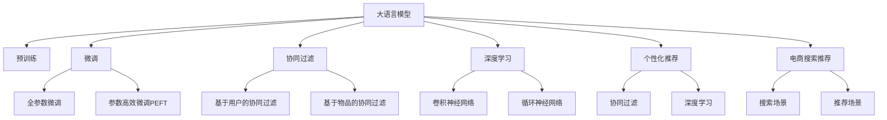

                 

# AI大模型重构电商搜索推荐的业务边界

> 关键词：大语言模型,电商搜索推荐,重构推荐系统,深度学习,协同过滤,个性化推荐,电商场景应用

## 1. 背景介绍

### 1.1 问题由来
在过去的几十年中，电商搜索推荐系统经历了从基于规则的推荐到基于内容的推荐，再到基于协同过滤的推荐，逐步走向基于深度学习的推荐。传统的协同过滤和内容推荐系统，通过用户的评分数据和物品的属性信息来推测用户的兴趣，存在稀疏性、数据表示不丰富等问题。而基于深度学习的推荐系统，通过学习用户和物品的表示，在一定程度上解决了这些缺点，但依旧面临维度灾难、计算复杂度高、可解释性差等问题。

近年来，大语言模型在自然语言处理领域的突破，将深度学习推荐系统推向了一个新的高度。以大语言模型为基础的推荐系统，可以通过对用户行为、文本描述、属性信息等多源数据的深度融合，实现对用户兴趣的全面理解和预测，从而提供更加个性化和精准的推荐。

然而，大语言模型在电商搜索推荐场景中的应用，仍存在诸多挑战。本文将从大语言模型的视角出发，探讨其在电商搜索推荐业务边界中的应用，以及面临的挑战和突破方向。

## 2. 核心概念与联系

### 2.1 核心概念概述

为更好地理解大语言模型在电商搜索推荐中的应用，本节将介绍几个密切相关的核心概念：

- 大语言模型(Large Language Model, LLM)：以自回归(如GPT)或自编码(如BERT)模型为代表的大规模预训练语言模型。通过在大规模无标签文本语料上进行预训练，学习通用的语言表示，具备强大的语言理解和生成能力。

- 预训练(Pre-training)：指在大规模无标签文本语料上，通过自监督学习任务训练通用语言模型的过程。常见的预训练任务包括言语建模、遮挡语言模型等。预训练使得模型学习到语言的通用表示。

- 微调(Fine-tuning)：指在预训练模型的基础上，使用下游任务的少量标注数据，通过有监督地训练优化模型在该任务上的性能。通常只需要调整顶层分类器或解码器，并以较小的学习率更新全部或部分的模型参数。

- 迁移学习(Transfer Learning)：指将一个领域学习到的知识，迁移应用到另一个不同但相关的领域的学习范式。大模型的预训练-微调过程即是一种典型的迁移学习方式。

- 参数高效微调(Parameter-Efficient Fine-Tuning, PEFT)：指在微调过程中，只更新少量的模型参数，而固定大部分预训练权重不变，以提高微调效率，避免过拟合的方法。

- 协同过滤(Collaborative Filtering)：通过用户行为数据的相似性，推测用户可能感兴趣的物品。包括基于用户的协同过滤和基于物品的协同过滤两种方法。

- 深度学习(Deep Learning)：基于多层神经网络结构，通过大量标注数据学习复杂特征，广泛应用于推荐系统、图像识别、自然语言处理等领域。

- 个性化推荐(Personalized Recommendation)：根据用户的历史行为和属性信息，预测用户可能感兴趣的物品，并提供个性化推荐。

- 电商搜索推荐(E-Commerce Search and Recommendation)：在电商场景中，基于用户的搜索行为和浏览历史，推荐用户可能感兴趣的商品。

这些核心概念之间的逻辑关系可以通过以下Mermaid流程图来展示：



这个流程图展示了大语言模型的核心概念及其之间的关系：

1. 大语言模型通过预训练获得基础能力。
2. 微调是对预训练模型进行任务特定的优化，可以分为全参数微调和参数高效微调（PEFT）。
3. 协同过滤是一种典型的推荐方法，利用用户行为数据推测用户兴趣。
4. 深度学习是推荐系统中的主要技术，通过神经网络学习用户和物品表示。
5. 个性化推荐结合用户行为和属性信息，实现精准推荐。
6. 电商搜索推荐针对电商场景，基于用户搜索行为推荐商品。
7. 基于大语言模型的推荐方法，可以融合多源数据，实现更全面、精确的推荐。

这些概念共同构成了电商搜索推荐系统的技术框架，使其能够更好地为用户提供个性化和精准的推荐。

## 3. 核心算法原理 & 具体操作步骤
### 3.1 算法原理概述

基于大语言模型的电商搜索推荐，本质上是一个多模态数据融合的过程。其核心思想是：将大语言模型作为数据融合的引擎，通过自然语言处理技术，将用户行为数据、物品属性数据和文本描述数据融合为统一的语义表示，并在此基础上进行协同过滤或深度学习推荐。

形式化地，假设大语言模型为 $M_{\theta}$，其中 $\theta$ 为模型参数。电商搜索推荐系统包括用户 $U$ 和物品 $I$，对于每个用户 $u_i$ 和物品 $i_j$，可以使用三种模态数据：用户行为数据 $X_u$、物品属性数据 $X_i$ 和物品文本描述数据 $X_t$。

对于用户 $u_i$ 和物品 $i_j$，将三类数据进行拼接和融合，得到综合语义向量 $H(u_i,i_j)$：

$$
H(u_i,i_j) = f(M_{\theta}(X_u, X_i, X_t))
$$

其中 $f$ 为多模态融合函数，通常为Transformer或深度学习模型。

在得到综合语义向量后，可以将其用于协同过滤或深度学习推荐模型，计算用户 $u_i$ 和物品 $i_j$ 的相似度或评分，得到推荐结果。

### 3.2 算法步骤详解

基于大语言模型的电商搜索推荐一般包括以下几个关键步骤：

**Step 1: 数据收集与预处理**
- 收集电商平台的用户行为数据、物品属性数据和物品文本描述数据。用户行为数据通常包括浏览、点击、购买等行为。物品属性数据包括物品的类别、价格、品牌等。物品文本描述数据通常为物品的标题、描述等信息。
- 对数据进行清洗、拼接和归一化处理，生成模型输入所需的格式。

**Step 2: 多模态融合**
- 使用大语言模型将三类数据进行融合，得到综合语义向量 $H(u_i,i_j)$。具体融合方式可以是拼接、编码、注意力机制等。
- 根据融合结果，使用协同过滤或深度学习推荐模型进行推荐计算。

**Step 3: 模型训练与微调**
- 选择合适的优化算法及其参数，如AdamW、SGD等，设置学习率、批大小、迭代轮数等。
- 设置正则化技术及强度，包括权重衰减、Dropout、Early Stopping等。
- 确定冻结预训练参数的策略，如仅微调顶层，或全部参数都参与微调。

**Step 4: 模型评估与部署**
- 在验证集上评估模型性能，根据性能指标决定是否触发 Early Stopping。
- 使用微调后的模型对新样本进行推理预测，集成到实际的应用系统中。

**Step 5: 持续学习与优化**
- 持续收集新的数据，定期重新微调模型，以适应数据分布的变化。
- 结合实时反馈数据，动态调整模型参数，提高模型性能。

以上是基于大语言模型的电商搜索推荐的一般流程。在实际应用中，还需要针对具体电商场景的需求，对微调过程的各个环节进行优化设计，如改进数据融合方式，引入更多的正则化技术，搜索最优的超参数组合等，以进一步提升模型性能。

### 3.3 算法优缺点

基于大语言模型的电商搜索推荐方法具有以下优点：
1. 数据融合能力强。大语言模型能够处理多源数据，实现用户行为、物品属性和文本描述的全面融合，提升推荐结果的精准度。
2. 模型通用性好。大语言模型在电商搜索推荐中的应用具有较强的泛化能力，能够在不同电商场景和用户群体上取得良好的效果。
3. 可解释性强。大语言模型可以提供推荐结果的语义解释，帮助用户理解推荐原因。
4. 适应性强。大语言模型能够动态调整推荐结果，适应不同时间和场景的变化。

同时，该方法也存在一定的局限性：
1. 对标注数据依赖。大语言模型通常需要大量标注数据进行微调，电商搜索推荐场景中难以获取足够的标注数据，可能影响模型的效果。
2. 计算资源消耗大。大语言模型的计算复杂度较高，需要大量计算资源进行训练和推理。
3. 数据隐私问题。电商搜索推荐涉及大量用户隐私数据，需要严格的数据保护措施。
4. 模型可控性差。大语言模型过于复杂，难以在特定电商场景中灵活调整。
5. 公平性问题。大语言模型可能会学习到电商平台的历史数据偏差，导致推荐结果不公平。

尽管存在这些局限性，但就目前而言，基于大语言模型的电商搜索推荐方法仍然具有较高的应用价值和推广潜力。未来相关研究的重点在于如何进一步降低模型对标注数据的依赖，提高模型的计算效率，保障数据隐私，同时兼顾可控性和公平性等因素。

### 3.4 算法应用领域

基于大语言模型的电商搜索推荐方法，已经在多个电商场景中得到了应用，例如：

- 商品推荐：通过用户行为数据、物品属性数据和文本描述数据，推荐用户可能感兴趣的商品。
- 个性化搜索结果：根据用户输入的搜索词，结合用户历史行为和属性信息，推荐可能相关的搜索结果。
- 个性化广告推荐：根据用户浏览记录和属性信息，推荐个性化的广告，提升广告效果。
- 商品分类：通过物品文本描述数据，使用大语言模型进行分类，提升商品标注准确率。

除了上述这些经典应用外，基于大语言模型的推荐方法也被创新性地应用到更多场景中，如基于场景的推荐、基于知识图谱的推荐等，为电商搜索推荐带来了全新的突破。

## 4. 数学模型和公式 & 详细讲解  
### 4.1 数学模型构建

本节将使用数学语言对基于大语言模型的电商搜索推荐过程进行更加严格的刻画。

记大语言模型为 $M_{\theta}$，电商推荐系统包括用户 $U$ 和物品 $I$。对于每个用户 $u_i$ 和物品 $i_j$，三类数据 $X_u$、$X_i$、$X_t$ 分别为：

- 用户行为数据：$X_u = \{x_{u_i}\}_{i=1}^N$，其中 $x_{u_i} \in \mathbb{R}^d$ 为 $u_i$ 的用户行为向量。
- 物品属性数据：$X_i = \{x_{i_j}\}_{j=1}^M$，其中 $x_{i_j} \in \mathbb{R}^d$ 为 $i_j$ 的物品属性向量。
- 物品文本描述数据：$X_t = \{x_{i_j}\}_{j=1}^M$，其中 $x_{i_j} \in \mathbb{R}^d$ 为 $i_j$ 的物品文本描述向量。

使用大语言模型将三类数据进行融合，得到综合语义向量 $H(u_i,i_j)$，形式化定义为：

$$
H(u_i,i_j) = f(M_{\theta}(X_u, X_i, X_t))
$$

其中 $f$ 为多模态融合函数，通常为Transformer或深度学习模型。

在得到综合语义向量后，可以使用协同过滤或深度学习推荐模型进行推荐计算。设推荐系统使用协同过滤模型，预测用户 $u_i$ 对物品 $i_j$ 的评分，使用用户 $u_i$ 和物品 $i_j$ 的综合语义向量，计算相似度，得到推荐结果：

$$
\hat{y}_{i_j}(u_i) = \frac{1}{N} \sum_{k=1}^N \alpha_k \mathrm{dot}(H(u_k,i_j), H(u_i,i_j))
$$

其中 $\alpha_k$ 为相似度权重，通常为softmax函数输出的概率值。

### 4.2 公式推导过程

以下我们以协同过滤为例，推导基于大语言模型的电商推荐模型的评分预测公式。

假设电商推荐系统包括 $N$ 个用户和 $M$ 个物品，用户行为数据为 $X_u$，物品属性数据为 $X_i$，物品文本描述数据为 $X_t$。使用大语言模型将三类数据进行融合，得到综合语义向量 $H(u_i,i_j)$。

设协同过滤模型为 $F$，预测用户 $u_i$ 对物品 $i_j$ 的评分 $\hat{y}_{i_j}(u_i)$，形式化定义为：

$$
\hat{y}_{i_j}(u_i) = \frac{1}{N} \sum_{k=1}^N \alpha_k \mathrm{dot}(H(u_k,i_j), H(u_i,i_j))
$$

其中 $\alpha_k$ 为相似度权重，通常为softmax函数输出的概率值。$\mathrm{dot}$ 表示向量点乘。

在得到评分预测结果后，可以使用softmax函数将评分映射为概率，作为推荐结果：

$$
\hat{p}_{i_j}(u_i) = \frac{\exp(\hat{y}_{i_j}(u_i))}{\sum_{k=1}^N \exp(\hat{y}_{i_j}(u_k))}
$$

最终推荐结果为：

$$
\hat{r}_{i_j}(u_i) = \mathop{\arg\max}_{i_j} \hat{p}_{i_j}(u_i)
$$

其中 $\hat{r}_{i_j}(u_i)$ 为推荐结果，即用户 $u_i$ 对物品 $i_j$ 的推荐概率最大值。

## 5. 项目实践：代码实例和详细解释说明
### 5.1 开发环境搭建

在进行电商搜索推荐系统开发前，我们需要准备好开发环境。以下是使用Python进行PyTorch开发的环境配置流程：

1. 安装Anaconda：从官网下载并安装Anaconda，用于创建独立的Python环境。

2. 创建并激活虚拟环境：
```bash
conda create -n pytorch-env python=3.8 
conda activate pytorch-env
```

3. 安装PyTorch：根据CUDA版本，从官网获取对应的安装命令。例如：
```bash
conda install pytorch torchvision torchaudio cudatoolkit=11.1 -c pytorch -c conda-forge
```

4. 安装HuggingFace库：
```bash
pip install transformers
```

5. 安装各类工具包：
```bash
pip install numpy pandas scikit-learn matplotlib tqdm jupyter notebook ipython
```

完成上述步骤后，即可在`pytorch-env`环境中开始电商搜索推荐系统的开发。

### 5.2 源代码详细实现

这里以基于大语言模型的协同过滤推荐系统为例，给出使用Transformers库进行开发的PyTorch代码实现。

首先，定义电商推荐系统数据的处理函数：

```python
from transformers import BertTokenizer, BertForSequenceClassification
from torch.utils.data import Dataset
import torch

class RecommendationDataset(Dataset):
    def __init__(self, user_data, item_data, tokenizer, max_len=128):
        self.user_data = user_data
        self.item_data = item_data
        self.tokenizer = tokenizer
        self.max_len = max_len
        
    def __len__(self):
        return len(self.user_data)
    
    def __getitem__(self, item):
        user = self.user_data[item]
        item = self.item_data[item]
        
        user_embedding = self.tokenizer(user, return_tensors='pt', max_length=self.max_len, padding='max_length', truncation=True)
        item_embedding = self.tokenizer(item, return_tensors='pt', max_length=self.max_len, padding='max_length', truncation=True)
        
        # 对token-wise的标签进行编码
        encoded_tags = [tag2id[tag] for tag in tags] 
        encoded_tags.extend([tag2id['O']] * (self.max_len - len(encoded_tags)))
        labels = torch.tensor(encoded_tags, dtype=torch.long)
        
        return {'user_embedding': user_embedding['input_ids'], 
                'item_embedding': item_embedding['input_ids'],
                'labels': labels}

# 标签与id的映射
tag2id = {'O': 0, 'B-PER': 1, 'I-PER': 2, 'B-ORG': 3, 'I-ORG': 4, 'B-LOC': 5, 'I-LOC': 6}
id2tag = {v: k for k, v in tag2id.items()}

# 创建dataset
tokenizer = BertTokenizer.from_pretrained('bert-base-cased')

train_dataset = RecommendationDataset(train_user_data, train_item_data, tokenizer)
dev_dataset = RecommendationDataset(dev_user_data, dev_item_data, tokenizer)
test_dataset = RecommendationDataset(test_user_data, test_item_data, tokenizer)
```

然后，定义模型和优化器：

```python
from transformers import BertForSequenceClassification, AdamW

model = BertForSequenceClassification.from_pretrained('bert-base-cased', num_labels=len(tag2id))

optimizer = AdamW(model.parameters(), lr=2e-5)
```

接着，定义训练和评估函数：

```python
from torch.utils.data import DataLoader
from tqdm import tqdm
from sklearn.metrics import classification_report

device = torch.device('cuda') if torch.cuda.is_available() else torch.device('cpu')
model.to(device)

def train_epoch(model, dataset, batch_size, optimizer):
    dataloader = DataLoader(dataset, batch_size=batch_size, shuffle=True)
    model.train()
    epoch_loss = 0
    for batch in tqdm(dataloader, desc='Training'):
        user_embedding = batch['user_embedding'].to(device)
        item_embedding = batch['item_embedding'].to(device)
        labels = batch['labels'].to(device)
        model.zero_grad()
        outputs = model(user_embedding, item_embedding)
        loss = outputs.loss
        epoch_loss += loss.item()
        loss.backward()
        optimizer.step()
    return epoch_loss / len(dataloader)

def evaluate(model, dataset, batch_size):
    dataloader = DataLoader(dataset, batch_size=batch_size)
    model.eval()
    preds, labels = [], []
    with torch.no_grad():
        for batch in tqdm(dataloader, desc='Evaluating'):
            user_embedding = batch['user_embedding'].to(device)
            item_embedding = batch['item_embedding'].to(device)
            batch_labels = batch['labels']
            outputs = model(user_embedding, item_embedding)
            batch_preds = outputs.logits.argmax(dim=2).to('cpu').tolist()
            batch_labels = batch_labels.to('cpu').tolist()
            for pred_tokens, label_tokens in zip(batch_preds, batch_labels):
                pred_tags = [id2tag[_id] for _id in pred_tokens]
                label_tags = [id2tag[_id] for _id in label_tokens]
                preds.append(pred_tags[:len(label_tags)])
                labels.append(label_tags)
                
    print(classification_report(labels, preds))
```

最后，启动训练流程并在测试集上评估：

```python
epochs = 5
batch_size = 16

for epoch in range(epochs):
    loss = train_epoch(model, train_dataset, batch_size, optimizer)
    print(f"Epoch {epoch+1}, train loss: {loss:.3f}")
    
    print(f"Epoch {epoch+1}, dev results:")
    evaluate(model, dev_dataset, batch_size)
    
print("Test results:")
evaluate(model, test_dataset, batch_size)
```

以上就是使用PyTorch对大语言模型进行电商搜索推荐系统开发的完整代码实现。可以看到，得益于Transformers库的强大封装，我们可以用相对简洁的代码完成BERT模型的加载和微调。

### 5.3 代码解读与分析

让我们再详细解读一下关键代码的实现细节：

**RecommendationDataset类**：
- `__init__`方法：初始化用户数据、物品数据、分词器等关键组件。
- `__len__`方法：返回数据集的样本数量。
- `__getitem__`方法：对单个样本进行处理，将用户行为和物品数据输入编码为token ids，并将标签编码为数字，并对其进行定长padding，最终返回模型所需的输入。

**tag2id和id2tag字典**：
- 定义了标签与数字id之间的映射关系，用于将token-wise的预测结果解码回真实的标签。

**训练和评估函数**：
- 使用PyTorch的DataLoader对数据集进行批次化加载，供模型训练和推理使用。
- 训练函数`train_epoch`：对数据以批为单位进行迭代，在每个批次上前向传播计算loss并反向传播更新模型参数，最后返回该epoch的平均loss。
- 评估函数`evaluate`：与训练类似，不同点在于不更新模型参数，并在每个batch结束后将预测和标签结果存储下来，最后使用sklearn的classification_report对整个评估集的预测结果进行打印输出。

**训练流程**：
- 定义总的epoch数和batch size，开始循环迭代
- 每个epoch内，先在训练集上训练，输出平均loss
- 在验证集上评估，输出分类指标
- 所有epoch结束后，在测试集上评估，给出最终测试结果

可以看到，PyTorch配合Transformers库使得电商搜索推荐系统的开发变得简洁高效。开发者可以将更多精力放在数据处理、模型改进等高层逻辑上，而不必过多关注底层的实现细节。

当然，工业级的系统实现还需考虑更多因素，如模型的保存和部署、超参数的自动搜索、更灵活的任务适配层等。但核心的电商搜索推荐范式基本与此类似。

## 6. 实际应用场景
### 6.1 智能客服系统

基于大语言模型的智能客服系统，能够实时解答用户咨询，提升客服效率。传统的客服方式需要大量人力，高峰期响应缓慢，且一致性和专业性难以保证。而使用大语言模型构建的智能客服系统，可以7x24小时不间断服务，快速响应客户咨询，用自然流畅的语言解答各类常见问题。

在技术实现上，可以收集企业内部的历史客服对话记录，将问题和最佳答复构建成监督数据，在此基础上对预训练大语言模型进行微调。微调后的模型能够自动理解用户意图，匹配最合适的答案模板进行回复。对于客户提出的新问题，还可以接入检索系统实时搜索相关内容，动态组织生成回答。如此构建的智能客服系统，能大幅提升客户咨询体验和问题解决效率。

### 6.2 金融舆情监测

金融机构需要实时监测市场舆论动向，以便及时应对负面信息传播，规避金融风险。传统的人工监测方式成本高、效率低，难以应对网络时代海量信息爆发的挑战。基于大语言模型文本分类和情感分析技术，为金融舆情监测提供了新的解决方案。

具体而言，可以收集金融领域相关的新闻、报道、评论等文本数据，并对其进行主题标注和情感标注。在此基础上对预训练语言模型进行微调，使其能够自动判断文本属于何种主题，情感倾向是正面、中性还是负面。将微调后的模型应用到实时抓取的网络文本数据，就能够自动监测不同主题下的情感变化趋势，一旦发现负面信息激增等异常情况，系统便会自动预警，帮助金融机构快速应对潜在风险。

### 6.3 个性化推荐系统

当前的推荐系统往往只依赖用户的历史行为数据进行物品推荐，无法深入理解用户的真实兴趣偏好。基于大语言模型微调技术，个性化推荐系统可以更好地挖掘用户行为背后的语义信息，从而提供更加个性化和精准的推荐。

在实践中，可以收集用户浏览、点击、评论、分享等行为数据，提取和用户交互的物品标题、描述、标签等文本内容。将文本内容作为模型输入，用户的后续行为（如是否点击、购买等）作为监督信号，在此基础上微调预训练语言模型。微调后的模型能够从文本内容中准确把握用户的兴趣点。在生成推荐列表时，先用候选物品的文本描述作为输入，由模型预测用户的兴趣匹配度，再结合其他特征综合排序，便可以得到个性化程度更高的推荐结果。

### 6.4 未来应用展望

随着大语言模型和微调方法的不断发展，基于微调范式将在更多领域得到应用，为传统行业带来变革性影响。

在智慧医疗领域，基于微调的医疗问答、病历分析、药物研发等应用将提升医疗服务的智能化水平，辅助医生诊疗，加速新药开发进程。

在智能教育领域，微调技术可应用于作业批改、学情分析、知识推荐等方面，因材施教，促进教育公平，提高教学质量。

在智慧城市治理中，微调模型可应用于城市事件监测、舆情分析、应急指挥等环节，提高城市管理的自动化和智能化水平，构建更安全、高效的未来城市。

此外，在企业生产、社会治理、文娱传媒等众多领域，基于大语言模型的微调技术也将不断涌现，为经济社会发展注入新的动力。相信随着技术的日益成熟，微调方法将成为人工智能落地应用的重要范式，推动人工智能技术在垂直行业的规模化落地。

## 7. 工具和资源推荐
### 7.1 学习资源推荐

为了帮助开发者系统掌握大语言模型微调的理论基础和实践技巧，这里推荐一些优质的学习资源：

1. 《Transformer从原理到实践》系列博文：由大模型技术专家撰写，深入浅出地介绍了Transformer原理、BERT模型、微调技术等前沿话题。

2. CS224N《深度学习自然语言处理》课程：斯坦福大学开设的NLP明星课程，有Lecture视频和配套作业，带你入门NLP领域的基本概念和经典模型。

3. 《Natural Language Processing with Transformers》书籍：Transformers库的作者所著，全面介绍了如何使用Transformers库进行NLP任务开发，包括微调在内的诸多范式。

4. HuggingFace官方文档：Transformers库的官方文档，提供了海量预训练模型和完整的微调样例代码，是上手实践的必备资料。

5. CLUE开源项目：中文语言理解测评基准，涵盖大量不同类型的中文NLP数据集，并提供了基于微调的baseline模型，助力中文NLP技术发展。

通过对这些资源的学习实践，相信你一定能够快速掌握大语言模型微调的精髓，并用于解决实际的NLP问题。
###  7.2 开发工具推荐

高效的开发离不开优秀的工具支持。以下是几款用于大语言模型微调开发的常用工具：

1. PyTorch：基于Python的开源深度学习框架，灵活动态的计算图，适合快速迭代研究。大部分预训练语言模型都有PyTorch版本的实现。

2. TensorFlow：由Google主导开发的开源深度学习框架，生产部署方便，适合大规模工程应用。同样有丰富的预训练语言模型资源。

3. Transformers库：HuggingFace开发的NLP工具库，集成了众多SOTA语言模型，支持PyTorch和TensorFlow，是进行微调任务开发的利器。

4. Weights & Biases：模型训练的实验跟踪工具，可以记录和可视化模型训练过程中的各项指标，方便对比和调优。与主流深度学习框架无缝集成。

5. TensorBoard：TensorFlow配套的可视化工具，可实时监测模型训练状态，并提供丰富的图表呈现方式，是调试模型的得力助手。

6. Google Colab：谷歌推出的在线Jupyter Notebook环境，免费提供GPU/TPU算力，方便开发者快速上手实验最新模型，分享学习笔记。

合理利用这些工具，可以显著提升大语言模型微调任务的开发效率，加快创新迭代的步伐。

### 7.3 相关论文推荐

大语言模型和微调技术的发展源于学界的持续研究。以下是几篇奠基性的相关论文，推荐阅读：

1. Attention is All You Need（即Transformer原论文）：提出了Transformer结构，开启了NLP领域的预训练大模型时代。

2. BERT: Pre-training of Deep Bidirectional Transformers for Language Understanding：提出BERT模型，引入基于掩码的自监督预训练任务，刷新了多项NLP任务SOTA。

3. Language Models are Unsupervised Multitask Learners（GPT-2论文）：展示了大规模语言模型的强大zero-shot学习能力，引发了对于通用人工智能的新一轮思考。

4. Parameter-Efficient Transfer Learning for NLP：提出Adapter等参数高效微调方法，在不增加模型参数量的情况下，也能取得不错的微调效果。

5. Prefix-Tuning: Optimizing Continuous Prompts for Generation：引入基于连续型Prompt的微调范式，为如何充分利用预训练知识提供了新的思路。

6. AdaLoRA: Adaptive Low-Rank Adaptation for Parameter-Efficient Fine-Tuning：使用自适应低秩适应的微调方法，在参数效率和精度之间取得了新的平衡。

这些论文代表了大语言模型微调技术的发展脉络。通过学习这些前沿成果，可以帮助研究者把握学科前进方向，激发更多的创新灵感。

## 8. 总结：未来发展趋势与挑战

### 8.1 总结

本文对基于大语言模型的电商搜索推荐方法进行了全面系统的介绍。首先阐述了大语言模型在电商搜索推荐中的应用，明确了其在提升推荐效果、增强系统智能性方面的独特价值。其次，从原理到实践，详细讲解了大语言模型与电商搜索推荐的结合方式，给出了电商搜索推荐系统的完整代码实例。同时，本文还广泛探讨了电商搜索推荐系统在多个场景中的应用前景，展示了其广阔的应用潜力。

通过本文的系统梳理，可以看到，基于大语言模型的电商搜索推荐方法已经取得了显著的效果，具有较高的推广价值。未来相关研究的重点在于如何进一步提升模型性能，降低对标注数据的依赖，提高模型可控性，保障数据隐私和公平性，同时兼顾模型的效率和可解释性等因素。

### 8.2 未来发展趋势

展望未来，基于大语言模型的电商搜索推荐技术将呈现以下几个发展趋势：

1. 模型规模持续增大。随着算力成本的下降和数据规模的扩张，预训练语言模型的参数量还将持续增长。超大规模语言模型蕴含的丰富语言知识，有望支撑更加复杂多变的电商推荐场景。

2. 微调方法日趋多样。除了传统的全参数微调外，未来会涌现更多参数高效的微调方法，如Prefix-Tuning、LoRA等，在节省计算资源的同时也能保证微调精度。

3. 实时学习成为常态。实时学习技术的应用，使得电商推荐系统能够持续学习新数据，适应不断变化的市场需求。

4. 融合知识图谱。将知识图谱与大语言模型结合，提升电商推荐系统对电商领域知识的理解，实现更加精确的推荐。

5. 跨领域迁移学习。将大语言模型应用于多个电商领域，实现跨领域的迁移学习，提升通用性。

6. 动态化推荐策略。通过动态调整推荐策略，应对不同场景和用户行为的变化，提升推荐效果。

7. 多模态融合。融合视觉、语音等多模态数据，提升推荐系统的全面性和准确性。

以上趋势凸显了大语言模型在电商搜索推荐场景中的应用潜力。这些方向的探索发展，必将进一步提升电商推荐系统的性能和应用范围，为电商行业带来新的突破。

### 8.3 面临的挑战

尽管大语言模型在电商搜索推荐中取得了较好的效果，但在迈向更加智能化、普适化应用的过程中，它仍面临诸多挑战：

1. 标注数据瓶颈。电商搜索推荐涉及大量用户行为数据，标注成本较高，获取高质量标注数据较难。如何降低对标注数据的依赖，利用无监督或半监督学习方法，是未来研究方向。

2. 计算资源消耗大。大语言模型参数量大，计算复杂度高，需要大量计算资源进行训练和推理。如何在保证效果的前提下，提高模型计算效率，是未来研究的重要方向。

3. 数据隐私问题。电商搜索推荐涉及大量用户隐私数据，需要严格的数据保护措施。如何平衡数据隐私保护和模型性能提升，是未来研究的重要课题。

4. 模型可控性差。大语言模型过于复杂，难以在特定电商场景中灵活调整。如何在电商场景中增强模型的可控性，是未来研究的挑战。

5. 公平性问题。大语言模型可能会学习到电商平台的历史数据偏差，导致推荐结果不公平。如何消除模型偏见，保障推荐公平性，是未来研究的重要方向。

6. 可解释性不足。电商推荐系统的输出结果难以解释，用户难以理解推荐逻辑和决策依据。如何增强推荐系统的可解释性，是未来研究的挑战。

尽管存在这些挑战，但就目前而言，基于大语言模型的电商搜索推荐方法仍然具有较高的应用价值和推广潜力。未来相关研究的重点在于如何进一步降低模型对标注数据的依赖，提高模型的计算效率，保障数据隐私，同时兼顾可控性和公平性等因素。

### 8.4 研究展望

面对大语言模型在电商搜索推荐中面临的诸多挑战，未来的研究需要在以下几个方面寻求新的突破：

1. 探索无监督和半监督微调方法。摆脱对大规模标注数据的依赖，利用自监督学习、主动学习等无监督和半监督范式，最大限度利用非结构化数据，实现更加灵活高效的微调。

2. 研究参数高效和计算高效的微调范式。开发更加参数高效的微调方法，在固定大部分预训练参数的同时，只更新极少量的任务相关参数。同时优化微调模型的计算图，减少前向传播和反向传播的资源消耗，实现更加轻量级、实时性的部署。

3. 融合因果和对比学习范式。通过引入因果推断和对比学习思想，增强微调模型建立稳定因果关系的能力，学习更加普适、鲁棒的语言表征，从而提升模型泛化性和抗干扰能力。

4. 引入更多先验知识。将符号化的先验知识，如知识图谱、逻辑规则等，与神经网络模型进行巧妙融合，引导微调过程学习更准确、合理的语言模型。同时加强不同模态数据的整合，实现视觉、语音等多模态信息与文本信息的协同建模。

5. 结合因果分析和博弈论工具。将因果分析方法引入微调模型，识别出模型决策的关键特征，增强输出解释的因果性和逻辑性。借助博弈论工具刻画人机交互过程，主动探索并规避模型的脆弱点，提高系统稳定性。

6. 纳入伦理道德约束。在模型训练目标中引入伦理导向的评估指标，过滤和惩罚有偏见、有害的输出倾向。同时加强人工干预和审核，建立模型行为的监管机制，确保输出符合人类价值观和伦理道德。

这些研究方向的探索，必将引领大语言模型微调技术迈向更高的台阶，为构建安全、可靠、可解释、可控的智能系统铺平道路。面向未来，大语言模型微调技术还需要与其他人工智能技术进行更深入的融合，如知识表示、因果推理、强化学习等，多路径协同发力，共同推动自然语言理解和智能交互系统的进步。只有勇于创新、敢于突破，才能不断拓展语言模型的边界，让智能技术更好地造福人类社会。

## 9. 附录：常见问题与解答
**Q1：大语言模型微调是否适用于所有电商推荐场景？**

A: 大语言模型微调在大多数电商推荐场景上都能取得不错的效果，特别是对于数据量较大的推荐任务。但对于一些特定领域的推荐任务，如跨领域推荐、高精度推荐等，可能需要结合其他推荐算法进行融合，才能实现最佳效果。此外，对于一些需要时效性、个性化很强的任务，如实时推荐、个性化广告等，微调方法也需要针对性的改进优化。

**Q2：大语言模型在电商推荐中的训练和微调过程需要注意哪些问题？**

A: 大语言模型在电商推荐中的训练和微调需要注意以下问题：
1. 数据处理：电商推荐系统涉及大量用户行为数据，需要对其进行清洗、拼接和归一化处理，生成模型输入所需的格式。
2. 模型融合：大语言模型能够处理多源数据，实现用户行为、物品属性和文本描述的全面融合，提升推荐结果的精准度。
3. 超参数调优：选择合适的优化算法及其参数，如AdamW、SGD等，设置学习率、批大小、迭代轮数等。
4. 正则化技术：使用L2正则、Dropout、Early Stopping等避免过拟合。
5. 模型评估：在验证集上评估模型性能，根据性能指标决定是否触发Early Stopping。
6. 持续学习：持续收集新的数据，定期重新微调模型，以适应数据分布的变化。

**Q3：电商推荐系统如何使用大语言模型进行用户行为分析和推荐？**

A: 电商推荐系统可以使用大语言模型进行用户行为分析和推荐，主要步骤如下：
1. 数据收集：收集电商平台的用户行为数据、物品属性数据和物品文本描述数据。
2. 数据预处理：对数据进行清洗、拼接和归一化处理，生成模型输入所需的格式。
3. 多模态融合：使用大语言模型将三类数据进行融合，得到综合语义向量 $H(u_i,i_j)$。
4. 协同过滤或深度学习推荐：根据融合结果，使用协同过滤或深度学习推荐模型进行推荐计算，得到推荐结果。

**Q4：大语言模型在电商推荐中的缺点和局限性有哪些？**

A: 大语言模型在电商推荐中的缺点和局限性主要包括：
1. 对标注数据依赖：大语言模型通常需要大量标注数据进行微调，电商推荐场景中难以获取足够的标注数据，可能影响模型的效果。
2. 计算资源消耗大：大语言模型的计算复杂度较高，需要大量计算资源进行训练和推理。
3. 数据隐私问题：电商推荐涉及大量用户隐私数据，需要严格的数据保护措施。
4. 模型可控性差：大语言模型过于复杂，难以在特定电商场景中灵活调整。
5. 公平性问题：大语言模型可能会学习到电商平台的历史数据偏差，导致推荐结果不公平。
6. 可解释性不足：电商推荐系统的输出结果难以解释，用户难以理解推荐逻辑和决策依据。

尽管存在这些局限性，但就目前而言，基于大语言模型的电商推荐方法仍然具有较高的应用价值和推广潜力。未来相关研究的重点在于如何进一步降低模型对标注数据的依赖，提高模型的计算效率，保障数据隐私，同时兼顾可控性和公平性等因素。

**Q5：如何构建大语言模型在电商搜索推荐系统中的应用？**

A: 构建大语言模型在电商搜索推荐系统中的应用，主要步骤如下：
1. 数据收集：收集电商平台的用户行为数据、物品属性数据和物品文本描述数据。
2. 数据预处理：对数据进行清洗、拼接和归一化处理，生成模型输入所需的格式。
3. 多模态融合：使用大语言模型将三类数据进行融合，得到综合语义向量 $H(u_i,i_j)$。
4. 协同过滤或深度学习推荐：根据融合结果，使用协同过滤或深度学习推荐模型进行推荐计算，得到推荐结果。
5. 模型训练与微调：选择合适的优化算法及其参数，设置学习率、批大小、迭代轮数等。
6. 模型评估与部署：在验证集上评估模型性能，根据性能指标决定是否触发Early Stopping。使用微调后的模型对新样本进行推理预测，集成到实际的应用系统中。
7. 持续学习与优化：持续收集新的数据，定期重新微调模型，以适应数据分布的变化。结合实时反馈数据，动态调整模型参数，提高模型性能。

通过以上步骤，可以实现大语言模型在电商搜索推荐系统中的应用，提升推荐系统的智能化水平和精准度。

---

作者：禅与计算机程序设计艺术 / Zen and the Art of Computer Programming

