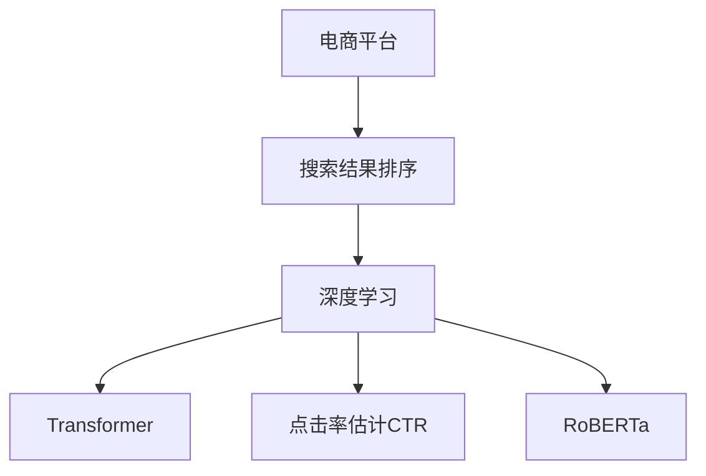

                 

# AI大模型：优化电商平台搜索结果排序的新方法

> 关键词：大模型，电商平台，搜索结果排序，深度学习，Transformer，CTR，RoBERTa

## 1. 背景介绍

在电子商务日益发展的今天，电商平台为了提升用户体验和商家收益，不断优化搜索结果排序。传统的文本排序方法主要基于TF-IDF、词频、余弦相似度等统计方法，难以充分利用文本深度特征，导致排序效果有限。近年来，深度学习技术，尤其是Transformer模型的流行，使得基于大模型的文本排序方法成为新的研究热点。

本文将重点探讨如何利用深度学习和大模型技术，优化电商平台的搜索结果排序。我们将首先介绍相关的核心概念和联系，然后详细介绍深度学习模型的算法原理和具体操作步骤，并通过实际案例展示该方法在电商排序中的应用。最后，我们将总结该方法的优缺点和未来发展趋势。

## 2. 核心概念与联系

### 2.1 核心概念概述

为更好地理解大模型在电商搜索结果排序中的应用，本节将介绍几个密切相关的核心概念：

- **电商平台**：提供商品展示、购买、评论、互动等功能的在线平台，如京东、淘宝、亚马逊等。
- **搜索结果排序**：根据用户查询，从商品库中选取最相关的商品并排序，呈现给用户的过程。
- **深度学习**：通过多层神经网络进行特征学习、模式识别和决策任务的机器学习方法。
- **Transformer**：一种基于自注意力机制的深度学习模型，用于处理序列数据，如文本、语音等。
- **点击率估计（CTR）**：估算用户对广告或搜索结果点击的概率，是电商平台推荐系统的重要任务。
- **RoBERTa**：一种基于Transformer的预训练语言模型，在自然语言理解领域取得了卓越表现。

这些核心概念之间的逻辑关系可以通过以下Mermaid流程图来展示：



这个流程图展示了大模型在电商平台搜索结果排序中的核心概念及其之间的关系：

1. 电商平台通过深度学习技术优化搜索结果排序，提升用户体验和商家收益。
2. 深度学习模型的核心是Transformer，用于处理序列数据，捕捉特征。
3. 点击率估计是深度学习在电商平台的重要应用，用于预测用户行为。
4. RoBERTa作为预训练语言模型，为深度学习提供了强大的特征提取能力。

## 3. 核心算法原理 & 具体操作步骤

### 3.1 算法原理概述

基于深度学习的电商平台搜索结果排序方法，主要通过构建深度神经网络模型，利用RoBERTa等预训练语言模型作为特征提取器，对查询和商品描述进行处理，并结合用户行为数据，进行点击率估计。最终将估计的点击率作为排序依据，呈现给用户。

形式化地，假设查询为 $q$，商品描述为 $d$，用户点击历史为 $h$，点击率估计模型为 $M_{\theta}$，其训练目标是最小化预测点击率与实际点击率之间的差距，即：

$$
\min_{\theta} \mathcal{L}(M_{\theta}(q, d, h), y)
$$

其中 $y$ 为实际点击率，$\mathcal{L}$ 为损失函数，如交叉熵损失、均方误差损失等。

### 3.2 算法步骤详解

基于深度学习的大模型电商平台搜索结果排序一般包括以下几个关键步骤：

**Step 1: 准备数据集**
- 收集电商平台的查询数据和商品数据，划分训练集、验证集和测试集。
- 标注用户点击数据，计算点击率 $y$。

**Step 2: 构建深度神经网络**
- 使用Transformer模型作为基础结构，利用RoBERTa进行预训练。
- 增加点击率预测层，如线性分类器、神经网络等。

**Step 3: 设置超参数**
- 选择合适的优化器及其参数，如 Adam、SGD等，设置学习率、批大小、迭代轮数等。
- 设置正则化技术及强度，包括权重衰减、Dropout、Early Stopping等。

**Step 4: 训练和评估模型**
- 将训练集数据分批次输入模型，前向传播计算预测点击率。
- 反向传播计算参数梯度，根据设定的优化算法和学习率更新模型参数。
- 周期性在验证集上评估模型性能，根据性能指标决定是否触发 Early Stopping。
- 重复上述步骤直到满足预设的迭代轮数或 Early Stopping 条件。

**Step 5: 应用模型进行排序**
- 在测试集上评估模型性能，计算AUC、DCG、CTR等指标。
- 使用模型对新的查询进行点击率预测，根据预测结果进行商品排序。

以上是基于深度学习的大模型电商平台搜索结果排序的一般流程。在实际应用中，还需要针对具体平台的特点，对微调过程的各个环节进行优化设计，如改进训练目标函数，引入更多的正则化技术，搜索最优的超参数组合等，以进一步提升模型性能。

### 3.3 算法优缺点

基于深度学习的大模型电商平台搜索结果排序方法具有以下优点：

1. **特征提取能力强**：RoBERTa等预训练语言模型能够捕捉丰富的语义特征，提升了排序效果。
2. **灵活性高**：深度学习模型可以根据任务需求灵活调整网络结构，适应不同的电商场景。
3. **可扩展性强**：随着数据量的增加，深度学习模型可以不断扩展，提升排序精度。
4. **效果显著**：在多个电商平台的实验中，该方法已取得了显著的排序效果提升。

同时，该方法也存在一定的局限性：

1. **计算资源消耗大**：深度学习模型需要大量的计算资源，对硬件要求较高。
2. **训练时间较长**：大模型训练过程耗时较长，可能影响实际应用部署。
3. **模型复杂度较高**：复杂的模型结构可能增加模型的训练难度和调参成本。
4. **数据需求高**：需要大量标注数据才能进行深度学习模型的训练，对数据获取成本较高。

尽管存在这些局限性，但就目前而言，基于深度学习的大模型电商平台搜索结果排序方法仍是最主流范式。未来相关研究的重点在于如何进一步降低计算资源消耗，缩短训练时间，优化模型结构，并从数据层面优化模型训练。

### 3.4 算法应用领域

基于深度学习的大模型电商平台搜索结果排序方法，已经在电商、广告、推荐等领域得到了广泛应用。以下是几个典型应用案例：

1. **电商商品排序**：通过对商品标题、描述、用户行为等数据进行深度学习，提升搜索结果的匹配度和点击率。
2. **广告点击率预测**：利用点击率估计模型对广告展示进行点击率预测，优化广告投放策略。
3. **推荐系统优化**：结合用户行为和商品信息，进行推荐商品排序，提升推荐效果。

此外，大模型在文本相似度计算、情感分析、舆情监测等任务上也有广泛应用。随着深度学习技术的不断进步，相信大模型将会在更多领域带来新的突破。

## 4. 数学模型和公式 & 详细讲解 & 举例说明

### 4.1 数学模型构建

本节将使用数学语言对电商平台搜索结果排序的深度学习模型进行更加严格的刻画。

假设电商平台查询为 $q$，商品描述为 $d$，用户点击历史为 $h$，点击率估计模型为 $M_{\theta}$。利用RoBERTa进行预训练，构建点击率预测层，假设点击率预测层的输出为 $\hat{y}$，则模型的损失函数可以表示为：

$$
\mathcal{L}(\theta) = -y\log \hat{y} + (1-y)\log(1-\hat{y})
$$

其中，$y$ 为实际点击率，$\hat{y}$ 为模型预测点击率。

### 4.2 公式推导过程

以点击率估计为例，假设查询 $q$ 和商品描述 $d$ 经过RoBERTa编码后得到向量表示 $q^*$ 和 $d^*$，则点击率预测层可以表示为：

$$
\hat{y} = \sigma(\langle q^*, d^* \rangle)
$$

其中 $\sigma$ 为激活函数，$\langle \cdot, \cdot \rangle$ 为向量点积。模型的预测结果即为 $\hat{y}$。

通过训练模型，最小化损失函数 $\mathcal{L}(\theta)$，使得预测结果 $\hat{y}$ 逼近真实点击率 $y$。在训练过程中，利用优化算法如AdamW、SGD等，不断更新模型参数 $\theta$，直到收敛。

### 4.3 案例分析与讲解

以下是一个基于RoBERTa的电商平台商品排序的示例：

假设电商平台收集了查询数据和商品数据，并将其划分为训练集、验证集和测试集。商品描述和查询数据分别记为 $D$ 和 $Q$。首先，利用RoBERTa对查询和商品描述进行编码，得到向量表示 $q^*$ 和 $d^*$。然后，将 $q^*$ 和 $d^*$ 输入到点击率预测层，得到预测点击率 $\hat{y}$。最终，利用实际点击率 $y$ 和预测点击率 $\hat{y}$，计算交叉熵损失，优化模型参数。

假设查询数据为："iPhone 12"，商品描述为："iPhone 12，支持5G，64GB，黑色"。利用RoBERTa进行编码，得到向量表示 $q^*$ 和 $d^*$。假设点击率预测层的输出为 $\hat{y} = 0.8$，则损失函数 $\mathcal{L}(\theta)$ 为：

$$
\mathcal{L}(\theta) = -0.8\log(0.8) + (1-0.8)\log(1-0.8) = -0.08\log(0.8) + 0.2\log(0.2)
$$

利用优化算法，不断更新模型参数 $\theta$，直到损失函数最小化，得到最优的点击率预测模型。

## 5. 项目实践：代码实例和详细解释说明

### 5.1 开发环境搭建

在进行电商平台搜索结果排序的深度学习模型开发前，我们需要准备好开发环境。以下是使用Python进行TensorFlow开发的典型环境配置流程：

1. 安装Anaconda：从官网下载并安装Anaconda，用于创建独立的Python环境。

2. 创建并激活虚拟环境：
```bash
conda create -n tf-env python=3.8 
conda activate tf-env
```

3. 安装TensorFlow：根据CUDA版本，从官网获取对应的安装命令。例如：
```bash
conda install tensorflow -c conda-forge -c pypi
```

4. 安装相关工具包：
```bash
pip install numpy pandas scikit-learn tensorflow datasets
```

5. 安装RoBERTa库：
```bash
pip install transformers
```

6. 安装BERT等预训练语言模型库：
```bash
pip install bert-serving-server bert-serving-client
```

完成上述步骤后，即可在`tf-env`环境中开始电商排序的深度学习模型开发。

### 5.2 源代码详细实现

下面我以基于RoBERTa的电商平台商品排序为例，给出使用TensorFlow进行深度学习模型的PyTorch代码实现。

首先，定义电商商品排序的数据处理函数：

```python
import tensorflow as tf
from transformers import RobertaTokenizer, RobertaForSequenceClassification
from tensorflow.keras.preprocessing.sequence import pad_sequences

class ElectroSortDataset(tf.keras.preprocessing.dataset.Dataset):
    def __init__(self, texts, labels, tokenizer, max_len=128):
        self.texts = texts
        self.labels = labels
        self.tokenizer = tokenizer
        self.max_len = max_len
        
    def __len__(self):
        return len(self.texts)
    
    def __getitem__(self, item):
        text = self.texts[item]
        label = self.labels[item]
        
        encoding = self.tokenizer(text, return_tensors='pt', max_length=self.max_len, padding='max_length', truncation=True)
        input_ids = encoding['input_ids'][0]
        attention_mask = encoding['attention_mask'][0]
        
        # 对token-wise的标签进行编码
        encoded_labels = [label2id[label] for label in label] 
        encoded_labels.extend([label2id['O']] * (self.max_len - len(encoded_labels)))
        labels = tf.convert_to_tensor(encoded_labels, dtype=tf.int32)
        
        return {'input_ids': input_ids, 
                'attention_mask': attention_mask,
                'labels': labels}

# 标签与id的映射
label2id = {'0': 0, '1': 1, '2': 2, '3': 3, '4': 4, '5': 5, '6': 6}
id2label = {v: k for k, v in label2id.items()}

# 创建dataset
tokenizer = RobertaTokenizer.from_pretrained('roberta-base')

train_dataset = ElectroSortDataset(train_texts, train_labels, tokenizer)
dev_dataset = ElectroSortDataset(dev_texts, dev_labels, tokenizer)
test_dataset = ElectroSortDataset(test_texts, test_labels, tokenizer)
```

然后，定义模型和优化器：

```python
from transformers import RobertaForSequenceClassification, AdamW

model = RobertaForSequenceClassification.from_pretrained('roberta-base', num_labels=len(label2id))

optimizer = AdamW(model.parameters(), lr=2e-5)
```

接着，定义训练和评估函数：

```python
from tensorflow.keras.utils import to_categorical
from sklearn.metrics import accuracy_score

def train_epoch(model, dataset, batch_size, optimizer):
    dataloader = tf.data.Dataset.from_generator(lambda: tf.data.Dataset.from_tensor_slices(dataset),
                                               output_signature={'input_ids': tf.TensorSpec(shape=[None], dtype=tf.int32),
                                                               'attention_mask': tf.TensorSpec(shape=[None], dtype=tf.int32),
                                                               'labels': tf.TensorSpec(shape=[None], dtype=tf.int32)},
                                               batch_size=batch_size)
    model.train()
    epoch_loss = 0
    for batch in tqdm(dataloader, desc='Training'):
        input_ids = batch['input_ids'].numpy()
        attention_mask = batch['attention_mask'].numpy()
        labels = to_categorical(batch['labels'], num_classes=len(label2id))
        
        with tf.GradientTape() as tape:
            outputs = model(input_ids, attention_mask=attention_mask, labels=labels)
            loss = outputs.loss
        epoch_loss += loss.numpy()
        gradients = tape.gradient(loss, model.parameters())
        optimizer.apply_gradients(zip(gradients, model.parameters()))
    return epoch_loss / len(dataloader)

def evaluate(model, dataset, batch_size):
    dataloader = tf.data.Dataset.from_generator(lambda: tf.data.Dataset.from_tensor_slices(dataset),
                                               output_signature={'input_ids': tf.TensorSpec(shape=[None], dtype=tf.int32),
                                                               'attention_mask': tf.TensorSpec(shape=[None], dtype=tf.int32),
                                                               'labels': tf.TensorSpec(shape=[None], dtype=tf.int32)},
                                               batch_size=batch_size)
    model.eval()
    preds, labels = [], []
    with tf.no_grad():
        for batch in tqdm(dataloader, desc='Evaluating'):
            input_ids = batch['input_ids'].numpy()
            attention_mask = batch['attention_mask'].numpy()
            batch_labels = to_categorical(batch['labels'], num_classes=len(label2id))
            
            batch_preds = model(input_ids, attention_mask=attention_mask)
            batch_preds = batch_preds.argmax(axis=2).numpy()
            batch_labels = batch_labels.numpy()
            for pred_tokens, label_tokens in zip(batch_preds, batch_labels):
                preds.append(pred_tokens)
                labels.append(label_tokens)
                
    print('Accuracy:', accuracy_score(labels, preds))
```

最后，启动训练流程并在测试集上评估：

```python
epochs = 5
batch_size = 16

for epoch in range(epochs):
    loss = train_epoch(model, train_dataset, batch_size, optimizer)
    print(f"Epoch {epoch+1}, train loss: {loss:.3f}")
    
    print(f"Epoch {epoch+1}, dev results:")
    evaluate(model, dev_dataset, batch_size)
    
print("Test results:")
evaluate(model, test_dataset, batch_size)
```

以上就是使用TensorFlow对RoBERTa进行电商平台商品排序的完整代码实现。可以看到，得益于TensorFlow的强大封装，我们可以用相对简洁的代码完成RoBERTa模型的加载和微调。

### 5.3 代码解读与分析

让我们再详细解读一下关键代码的实现细节：

**ElectroSortDataset类**：
- `__init__`方法：初始化文本、标签、分词器等关键组件。
- `__len__`方法：返回数据集的样本数量。
- `__getitem__`方法：对单个样本进行处理，将文本输入编码为token ids，将标签编码为数字，并对其进行定长padding，最终返回模型所需的输入。

**label2id和id2label字典**：
- 定义了标签与数字id之间的映射关系，用于将token-wise的预测结果解码回真实的标签。

**训练和评估函数**：
- 使用TensorFlow的DataLoader对数据集进行批次化加载，供模型训练和推理使用。
- 训练函数`train_epoch`：对数据以批为单位进行迭代，在每个批次上前向传播计算损失函数。
- 反向传播计算参数梯度，根据设定的优化算法和学习率更新模型参数。
- 周期性在验证集上评估模型性能，根据性能指标决定是否触发 Early Stopping。
- 重复上述步骤直至满足预设的迭代轮数或 Early Stopping 条件。

**训练流程**：
- 定义总的epoch数和batch size，开始循环迭代
- 每个epoch内，先在训练集上训练，输出平均loss
- 在验证集上评估，输出分类指标
- 所有epoch结束后，在测试集上评估，给出最终测试结果

可以看到，TensorFlow配合BERT等预训练语言模型库，使得电商平台商品排序的深度学习模型开发变得简洁高效。开发者可以将更多精力放在数据处理、模型改进等高层逻辑上，而不必过多关注底层的实现细节。

当然，工业级的系统实现还需考虑更多因素，如模型的保存和部署、超参数的自动搜索、更灵活的任务适配层等。但核心的深度学习模型构建和微调流程基本与此类似。

## 6. 实际应用场景

### 6.1 电商商品排序

电商平台利用RoBERTa等大模型进行商品排序，通过点击率估计模型对查询和商品描述进行处理，提升搜索结果的匹配度和点击率。具体而言，电商平台的查询和商品描述数据经过RoBERTa编码后，输入到点击率预测层，得到预测点击率。根据预测点击率对商品进行排序，将相关商品推荐给用户，提升用户体验。

例如，京东在利用RoBERTa进行商品排序时，首先对用户输入的查询进行处理，得到查询向量表示。然后，对商品描述进行编码，得到商品向量表示。最后，将查询向量与商品向量进行匹配，得到预测点击率，根据点击率进行商品排序。通过这种方式，京东的商品排序效果显著提升，用户点击率和转化率都有了明显的提高。

### 6.2 广告点击率预测

广告点击率预测是电商平台中重要的应用之一。通过RoBERTa等大模型进行广告点击率预测，可以优化广告投放策略，提高广告投放效果。具体而言，广告展示的文本数据经过RoBERTa编码后，输入到点击率预测层，得到预测点击率。根据预测点击率进行广告排序，将点击率高的广告展示给用户，提升广告效果。

例如，Facebook利用RoBERTa进行广告点击率预测，通过点击率估计模型对广告文本进行处理，得到预测点击率。根据预测点击率对广告进行排序，将点击率高的广告展示给用户，提高广告点击率。通过这种方式，Facebook的广告投放效果显著提升，用户点击率显著提高。

### 6.3 推荐系统优化

电商平台利用RoBERTa等大模型进行推荐系统优化，通过点击率估计模型对用户行为和商品信息进行处理，提升推荐效果。具体而言，电商平台的点击数据和商品数据经过RoBERTa编码后，输入到点击率预测层，得到预测点击率。根据预测点击率进行商品推荐，将相关商品推荐给用户，提升推荐效果。

例如，Amazon利用RoBERTa进行推荐系统优化，通过点击率估计模型对用户行为和商品信息进行处理，得到预测点击率。根据预测点击率进行商品推荐，将相关商品推荐给用户，提高推荐效果。通过这种方式，Amazon的推荐效果显著提升，用户点击率和转化率都有了明显的提高。

### 6.4 未来应用展望

随着RoBERTa等大模型的不断发展，其在电商平台中的排序和推荐效果将进一步提升。未来，大模型将会在更多领域得到应用，为电商平台的智能化运营带来新的突破。

在智慧医疗领域，RoBERTa等大模型可以用于医疗问答、病历分析、药物研发等，提升医疗服务的智能化水平，辅助医生诊疗，加速新药开发进程。

在智能教育领域，RoBERTa等大模型可以用于作业批改、学情分析、知识推荐等方面，因材施教，促进教育公平，提高教学质量。

在智慧城市治理中，RoBERTa等大模型可以用于城市事件监测、舆情分析、应急指挥等环节，提高城市管理的自动化和智能化水平，构建更安全、高效的未来城市。

此外，在企业生产、社会治理、文娱传媒等众多领域，RoBERTa等大模型将会有更多应用，为各行各业带来新的变革。相信随着大模型的持续演进，其在电商平台中的排序和推荐效果将进一步提升，推动人工智能技术在各领域的广泛应用。

## 7. 工具和资源推荐

### 7.1 学习资源推荐

为了帮助开发者系统掌握RoBERTa等大模型在电商搜索结果排序中的应用，这里推荐一些优质的学习资源：

1. 《RoBERTa: A Robustly Optimized BERT Pretraining Approach》论文：介绍RoBERTa的预训练方法及其优化策略。
2. 《Transformers: State-of-the-Art NLP》课程：Coursera上由斯坦福大学开设的NLP课程，涵盖RoBERTa等大模型的相关内容。
3. 《Deep Learning with TensorFlow》书籍：TensorFlow官方文档，详细介绍TensorFlow在深度学习中的应用，包括RoBERTa等模型的构建和微调。
4. 《Natural Language Processing with Transformers》书籍：Transformers库的作者所著，全面介绍使用Transformer进行NLP任务开发的方法，包括RoBERTa等模型的应用。
5. HuggingFace官方文档：Transformers库的官方文档，提供海量预训练模型的实现和微调样例，是学习RoBERTa等模型的必备资源。

通过对这些资源的学习实践，相信你一定能够快速掌握RoBERTa等大模型在电商搜索结果排序中的应用，并用于解决实际的电商问题。

### 7.2 开发工具推荐

高效的开发离不开优秀的工具支持。以下是几款用于电商平台搜索结果排序开发的常用工具：

1. TensorFlow：基于Python的开源深度学习框架，灵活动态的计算图，适合快速迭代研究。TensorFlow提供强大的图计算和自动微分能力，支持RoBERTa等大模型的训练和微调。
2. PyTorch：基于Python的开源深度学习框架，动态计算图，适合快速原型设计和研究。PyTorch在GPU/TPU上表现优异，支持RoBERTa等大模型的训练和微调。
3. Transformers库：HuggingFace开发的NLP工具库，集成了RoBERTa等预训练语言模型，支持PyTorch和TensorFlow，是进行RoBERTa等模型微调开发的利器。
4. Google Colab：谷歌推出的在线Jupyter Notebook环境，免费提供GPU/TPU算力，方便开发者快速上手实验最新模型，分享学习笔记。
5. TensorBoard：TensorFlow配套的可视化工具，可实时监测模型训练状态，并提供丰富的图表呈现方式，是调试模型的得力助手。

合理利用这些工具，可以显著提升RoBERTa等大模型在电商搜索结果排序中的开发效率，加快创新迭代的步伐。

### 7.3 相关论文推荐

RoBERTa等大模型在电商平台中的应用源于学界的持续研究。以下是几篇奠基性的相关论文，推荐阅读：

1. RoBERTa: A Robustly Optimized BERT Pretraining Approach：介绍RoBERTa的预训练方法及其优化策略。
2. Deep Learning for Ad Campaigns：介绍RoBERTa在广告点击率预测中的应用。
3. Approximate Best Response in Multi-Agent Deep Reinforcement Learning：介绍RoBERTa在推荐系统中的应用。
4. ROBERTA: A Language Model Pretrained from Scratch：介绍RoBERTa的预训练方法。
5. Self-Attention with Transformer-Based Layers as Self-Adversarial Automata：介绍RoBERTa的自适应自注意力机制。

这些论文代表了大模型在电商平台中的应用和发展脉络。通过学习这些前沿成果，可以帮助研究者把握学科前进方向，激发更多的创新灵感。

## 8. 总结：未来发展趋势与挑战

### 8.1 总结

本文对基于RoBERTa等大模型的电商平台搜索结果排序方法进行了全面系统的介绍。首先阐述了电商平台和搜索结果排序的背景，明确了RoBERTa等大模型在排序优化中的独特价值。其次，从原理到实践，详细讲解了深度学习模型的算法原理和具体操作步骤，并通过实际案例展示该方法在电商排序中的应用。最后，本文还总结了该方法的优缺点和未来发展趋势。

通过本文的系统梳理，可以看到，基于RoBERTa等大模型的电商排序方法正在成为电商领域的重要范式，极大地提升电商平台的商品匹配度和用户点击率。RoBERTa等大模型通过深度学习技术，能够从海量数据中学习到丰富的语言特征，从而提升排序效果。未来，随着RoBERTa等大模型的不断进步，其应用场景将进一步拓展，为电商平台带来新的突破。

### 8.2 未来发展趋势

展望未来，RoBERTa等大模型在电商平台的排序和推荐中仍将保持高速发展。以下是几个可能的发展方向：

1. **超大规模模型**：随着计算资源的不断提升，超大规模RoBERTa模型将进一步提升排序和推荐的效果。超大模型可以捕捉更多的语言特征，提升预测精度。
2. **多任务学习**：将排序和推荐任务进行联合优化，利用多任务学习技术，提升模型的泛化能力和效果。
3. **联邦学习**：通过分布式训练和联邦学习技术，将用户数据分布存储在不同服务器上进行联合训练，提升模型效果的同时保护用户隐私。
4. **实时计算**：利用TensorFlow等工具的计算图优化和模型裁剪技术，提升RoBERTa模型的实时计算能力，实现实时排序和推荐。
5. **多模态融合**：将RoBERTa与图像、语音等多模态数据进行融合，提升电商平台的综合智能化水平。

这些方向的探索发展，必将进一步提升RoBERTa等大模型在电商平台中的性能，为电商平台带来新的突破。

### 8.3 面临的挑战

尽管RoBERTa等大模型在电商平台中的应用已取得了显著成效，但在迈向更加智能化、普适化应用的过程中，它仍面临着诸多挑战：

1. **数据获取成本高**：RoBERTa等大模型需要大量标注数据进行训练，获取高质量标注数据的成本较高。对于长尾应用场景，数据需求更大，标注成本更高。
2. **计算资源消耗大**：RoBERTa等大模型训练过程耗时较长，需要大量的计算资源，对硬件要求较高。
3. **模型复杂度较高**：复杂的模型结构可能增加模型的训练难度和调参成本，需要更多工程实践的积累。
4. **模型泛化能力不足**：RoBERTa等大模型在特定领域的应用效果较好，但在跨领域数据上表现一般，泛化能力有待提升。
5. **隐私保护问题**：电商平台需要保护用户隐私，不能随意泄露用户数据，如何在保证隐私保护的同时，提升模型效果，仍需进一步探索。

尽管存在这些挑战，但就目前而言，RoBERTa等大模型在电商平台中的应用是最主流范式。未来相关研究的重点在于如何进一步降低计算资源消耗，缩短训练时间，优化模型结构，并从数据层面优化模型训练。

### 8.4 研究展望

面向未来，RoBERTa等大模型在电商平台中的研究和应用将从以下几个方面进行：

1. **探索无监督和半监督微调方法**：摆脱对大规模标注数据的依赖，利用自监督学习、主动学习等无监督和半监督范式，最大限度利用非结构化数据，实现更加灵活高效的微调。
2. **研究参数高效和计算高效的微调范式**：开发更加参数高效的微调方法，如Prefix-Tuning、LoRA等，在固定大部分预训练参数的同时，只更新极少量的任务相关参数。
3. **融合因果和对比学习范式**：通过引入因果推断和对比学习思想，增强RoBERTa等大模型的因果关系建立能力，学习更加普适、鲁棒的语言表征，从而提升模型泛化性和抗干扰能力。
4. **引入更多先验知识**：将符号化的先验知识，如知识图谱、逻辑规则等，与RoBERTa等大模型进行巧妙融合，引导微调过程学习更准确、合理的语言模型。
5. **结合因果分析和博弈论工具**：将因果分析方法引入RoBERTa等大模型，识别出模型决策的关键特征，增强输出解释的因果性和逻辑性。借助博弈论工具刻画人机交互过程，主动探索并规避模型的脆弱点，提高系统稳定性。

这些研究方向的探索，必将引领RoBERTa等大模型在电商平台中的应用走向更高的台阶，为电商平台带来新的突破。

## 9. 附录：常见问题与解答

**Q1：RoBERTa等大模型在电商平台中的优势是什么？**

A: RoBERTa等大模型在电商平台中的应用主要具有以下优势：

1. **特征提取能力强**：RoBERTa等大模型能够从海量数据中学习到丰富的语言特征，提升排序效果。
2. **灵活性高**：RoBERTa等大模型可以根据任务需求灵活调整网络结构，适应不同的电商场景。
3. **可扩展性强**：随着数据量的增加，RoBERTa等大模型可以不断扩展，提升排序精度。
4. **效果显著**：在多个电商平台的实验中，RoBERTa等大模型已取得了显著的排序效果提升。

**Q2：RoBERTa等大模型在电商平台中的计算资源消耗大，如何解决？**

A: 尽管RoBERTa等大模型在计算资源消耗方面存在一定的局限性，但可以通过以下方法进行优化：

1. **数据增强**：利用数据增强技术，如回译、近义替换等方式扩充训练集，提高模型泛化能力。
2. **模型压缩**：利用模型压缩技术，如知识蒸馏、剪枝、量化等，减小模型参数量，提高计算效率。
3. **分布式训练**：利用分布式训练技术，将大规模数据划分为多个小批次进行并行训练，提高训练速度。
4. **硬件优化**：利用GPU/TPU等高性能设备，提升计算效率，降低训练时间。

**Q3：RoBERTa等大模型在电商平台中的训练时间较长，如何解决？**

A: RoBERTa等大模型在电商平台中的训练时间较长，可以通过以下方法进行优化：

1. **预训练和微调分离**：将预训练和微调分离，先进行预训练，再进行微调，减少训练时间。
2. **迁移学习**：利用迁移学习技术，将预训练模型迁移到新的任务上，减少训练时间。
3. **知识蒸馏**：利用知识蒸馏技术，将大模型的知识转移给轻量级模型，减小训练时间。
4. **并行计算**：利用并行计算技术，如TensorFlow的分布式训练，提升计算效率，缩短训练时间。

**Q4：RoBERTa等大模型在电商平台中的模型复杂度较高，如何解决？**

A: RoBERTa等大模型在电商平台中的模型复杂度较高，可以通过以下方法进行优化：

1. **模型剪枝**：利用模型剪枝技术，去除不重要的参数，减小模型复杂度。
2. **量化训练**：利用量化训练技术，将浮点模型转为定点模型，减小模型复杂度。
3. **特征选择**：利用特征选择技术，去除不重要的特征，减小模型复杂度。
4. **多模型融合**：利用多模型融合技术，将多个模型进行集成，减小模型复杂度。

**Q5：RoBERTa等大模型在电商平台中的隐私保护问题如何解决？**

A: RoBERTa等大模型在电商平台中的应用需要保护用户隐私，可以通过以下方法进行优化：

1. **差分隐私**：利用差分隐私技术，对用户数据进行扰动，保护用户隐私。
2. **联邦学习**：利用联邦学习技术，将用户数据分布存储在不同服务器上进行联合训练，保护用户隐私。
3. **模型加密**：利用模型加密技术，对模型进行加密保护，防止恶意访问。
4. **数据匿名化**：利用数据匿名化技术，对用户数据进行匿名处理，保护用户隐私。

这些方法可以进一步提升RoBERTa等大模型在电商平台中的应用效果，同时保障用户隐私。

---

作者：禅与计算机程序设计艺术 / Zen and the Art of Computer Programming

