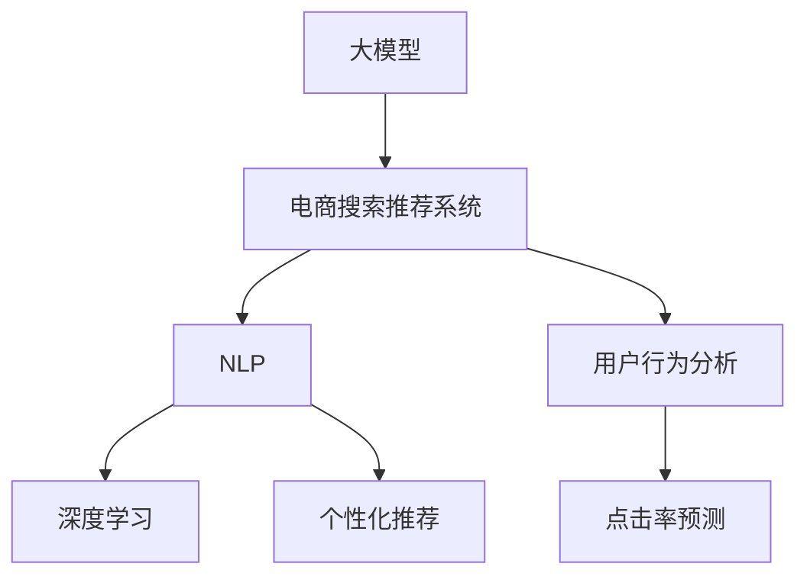

                 

# AI大模型：重塑电商搜索推荐系统的未来

> 关键词：AI大模型,电商搜索推荐系统,自然语言处理(NLP),深度学习,个性化推荐,用户行为分析,点击率预测

## 1. 背景介绍

### 1.1 问题由来
随着互联网和电子商务的迅速发展，电商平台已成为消费者购物的重要渠道。电商平台的核心竞争力之一是其强大的搜索推荐系统。通过智能化的搜索推荐，不仅能够提升用户购物体验，还能提高平台的转化率和盈利能力。传统的搜索推荐系统依赖于基于规则的算法和统计模型，但随着数据规模的增长和用户需求的个性化，传统的推荐方式难以满足需求。

AI大模型的兴起，为电商搜索推荐系统带来了革命性的变革。利用大模型的强大语义理解能力，电商搜索推荐系统能够更好地理解和响应用户需求，实现个性化推荐，显著提高用户满意度和平台效益。

### 1.2 问题核心关键点
大模型在电商搜索推荐系统中的应用，主要体现在以下几个方面：

- **语义理解**：通过理解用户的查询和行为，生成更精准的搜索结果和推荐内容。
- **多模态融合**：结合图像、视频等多模态数据，提升推荐内容的质量和多样性。
- **个性化推荐**：通过大模型对用户行为和偏好的建模，实现个性化的推荐。
- **实时推荐**：利用大模型的实时处理能力，快速响应用户需求，提高推荐的时效性。
- **跨领域迁移**：通过预训练-微调的方式，使大模型能够适应不同领域的应用，提高通用性和适应性。

## 2. 核心概念与联系

### 2.1 核心概念概述

为更好地理解大模型在电商搜索推荐系统中的应用，本节将介绍几个密切相关的核心概念：

- **大模型(Large Model)**：以Transformer为基础的深度学习模型，如BERT、GPT等，具有强大的语言理解能力和泛化能力。
- **电商搜索推荐系统(E-commerce Search & Recommendation System)**：通过分析和理解用户搜索行为和商品特征，智能推荐商品，提升用户购物体验的系统。
- **自然语言处理(Natural Language Processing, NLP)**：研究如何让计算机理解和处理人类语言的技术，包括语言模型、语义分析等。
- **深度学习(Deep Learning)**：一种通过多层神经网络进行复杂模式识别的机器学习技术。
- **个性化推荐(Personalized Recommendation)**：根据用户的历史行为和偏好，推荐最符合用户需求的商品或内容。
- **用户行为分析(User Behavior Analysis)**：通过分析用户的点击、浏览、购买等行为，预测用户的潜在需求。
- **点击率预测(Click-Through Rate Prediction)**：预测用户点击商品的概率，用于评估推荐效果和优化推荐策略。

这些核心概念之间的逻辑关系可以通过以下Mermaid流程图来展示：



这个流程图展示了大模型在电商搜索推荐系统中的核心概念及其之间的关系：

1. 大模型通过自然语言处理技术，理解用户的查询和行为。
2. 深度学习模型在电商搜索推荐系统中被广泛应用，用于用户行为分析、个性化推荐、点击率预测等。
3. 用户行为分析和个性化推荐相辅相成，共同提升推荐效果。
4. 点击率预测通过模型评估推荐质量，指导后续优化。

这些概念共同构成了电商搜索推荐系统的技术框架，使得电商搜索推荐系统能够实现智能化的搜索推荐，提升用户体验和平台效益。

## 3. 核心算法原理 & 具体操作步骤
### 3.1 算法原理概述

基于大模型的电商搜索推荐系统，本质上是一个联合模型学习的过程。其核心思想是：将搜索和推荐过程视为联合优化问题，通过大模型对用户查询、行为、商品特征等进行语义理解和建模，生成个性化的推荐结果。

形式化地，假设电商平台的数据集为 $D=\{(x_i,y_i)\}_{i=1}^N$，其中 $x_i$ 为用户的查询或行为数据，$y_i$ 为推荐结果。通过深度学习模型 $M_{\theta}$ 对数据集进行拟合，最小化损失函数：

$$
\theta^* = \mathop{\arg\min}_{\theta} \frac{1}{N}\sum_{i=1}^N \ell(M_{\theta}(x_i),y_i)
$$

其中 $\ell$ 为损失函数，通常包括交叉熵损失、均方误差损失等。

### 3.2 算法步骤详解

基于大模型的电商搜索推荐系统一般包括以下几个关键步骤：

**Step 1: 准备数据集和模型**
- 收集电商平台的搜索和推荐数据，清洗并划分训练集、验证集和测试集。
- 选择合适的大模型作为初始化参数，如BERT、GPT等。

**Step 2: 定义模型架构**
- 设计合适的模型架构，将大模型的输出作为搜索和推荐的输入。
- 针对电商任务，通常需要设计用户行为表示、商品特征表示等模块。
- 将大模型的输出与商品特征向量相加，通过线性层得到最终推荐结果。

**Step 3: 训练模型**
- 使用Adam、SGD等优化算法，设置合适的学习率、批大小等超参数。
- 对训练集进行迭代训练，每轮更新模型参数。
- 周期性在验证集上评估模型性能，根据性能指标决定是否触发Early Stopping。

**Step 4: 测试和优化**
- 在测试集上评估微调后模型的性能，对比微调前后的精度提升。
- 使用模型进行实时推荐，收集用户反馈，动态调整推荐策略。

**Step 5: 部署和维护**
- 将微调后的模型集成到电商搜索推荐系统中，进行部署。
- 持续收集用户行为数据，定期重新微调模型，以适应数据分布的变化。

以上是基于大模型的电商搜索推荐系统的核心流程。在实际应用中，还需要针对具体任务进行优化设计，如改进损失函数、引入更多的正则化技术、搜索最优的超参数组合等，以进一步提升模型性能。

### 3.3 算法优缺点

基于大模型的电商搜索推荐系统具有以下优点：
1. 强大的语义理解能力。大模型能够准确理解用户的查询和行为，生成更精准的推荐结果。
2. 高泛化能力。大模型在大量数据上预训练得到的语言表示，能够适应不同领域和场景。
3. 自动化程度高。通过自动化的模型训练和部署，大幅降低了人工干预的需求。
4. 实时推荐。大模型能够实时处理用户输入，快速响应用户需求，提高推荐的时效性。

同时，该方法也存在一定的局限性：
1. 对数据质量敏感。大模型对输入数据的质量要求较高，若数据噪声较多，模型效果可能受影响。
2. 计算资源消耗大。大模型通常需要较大的计算资源进行训练和推理，硬件成本较高。
3. 可解释性不足。大模型的决策过程缺乏可解释性，难以对其推理逻辑进行分析和调试。

尽管存在这些局限性，但就目前而言，基于大模型的电商搜索推荐系统已成为电商领域的主流推荐方式。未来相关研究的重点在于如何进一步降低计算资源消耗，提高模型的可解释性和鲁棒性，同时兼顾用户的隐私保护。

### 3.4 算法应用领域

基于大模型的电商搜索推荐系统，已经在电商领域得到了广泛的应用，覆盖了从商品推荐到个性化搜索等众多任务。具体应用领域包括：

- **个性化推荐**：根据用户的历史行为和偏好，推荐最符合用户需求的商品。
- **实时搜索**：通过理解用户输入的查询，实时生成搜索结果，提升用户体验。
- **广告推荐**：将用户可能感兴趣的商品或广告推荐给用户，提高广告点击率。
- **跨领域推荐**：利用大模型的跨领域迁移能力，推荐其他领域商品，提高平台多样性。
- **商品聚类**：将商品按照相似度进行聚类，帮助用户快速找到相关商品。
- **个性化促销**：根据用户偏好，推荐最合适的促销活动，提高用户购买意愿。

除了上述这些经典任务外，大模型在电商领域还探索了如虚拟试衣、AR试妆、语音助手等创新应用，为电商搜索推荐系统带来了新的突破。

## 4. 数学模型和公式 & 详细讲解  
### 4.1 数学模型构建

本节将使用数学语言对基于大模型的电商搜索推荐系统进行更加严格的刻画。

假设电商平台的数据集为 $D=\{(x_i,y_i)\}_{i=1}^N$，其中 $x_i$ 为用户的查询或行为数据，$y_i$ 为推荐结果。定义模型 $M_{\theta}$ 在数据样本 $(x_i,y_i)$ 上的损失函数为 $\ell(M_{\theta}(x_i),y_i)$。

假设模型 $M_{\theta}$ 在输入 $x_i$ 上的输出为 $\hat{y}=M_{\theta}(x_i)$，表示预测推荐结果。则交叉熵损失函数定义为：

$$
\ell(M_{\theta}(x_i),y_i) = -y_i\log \hat{y} - (1-y_i)\log (1-\hat{y})
$$

在此基础上，定义模型 $M_{\theta}$ 在数据集 $D$ 上的经验风险为：

$$
\mathcal{L}(\theta) = \frac{1}{N}\sum_{i=1}^N \ell(M_{\theta}(x_i),y_i)
$$

其中 $\theta$ 为模型参数。

### 4.2 公式推导过程

以下我们以推荐系统的点击率预测任务为例，推导交叉熵损失函数及其梯度的计算公式。

假设模型 $M_{\theta}$ 在输入 $x_i$ 上的输出为 $\hat{y}=M_{\theta}(x_i) \in [0,1]$，表示预测用户点击的概率。真实标签 $y_i \in \{0,1\}$。则交叉熵损失函数定义为：

$$
\ell(M_{\theta}(x_i),y_i) = -[y_i\log \hat{y} + (1-y_i)\log (1-\hat{y})]
$$

将其代入经验风险公式，得：

$$
\mathcal{L}(\theta) = -\frac{1}{N}\sum_{i=1}^N [y_i\log M_{\theta}(x_i)+(1-y_i)\log(1-M_{\theta}(x_i))]
$$

根据链式法则，损失函数对参数 $\theta_k$ 的梯度为：

$$
\frac{\partial \mathcal{L}(\theta)}{\partial \theta_k} = -\frac{1}{N}\sum_{i=1}^N (\frac{y_i}{M_{\theta}(x_i)}-\frac{1-y_i}{1-M_{\theta}(x_i)}) \frac{\partial M_{\theta}(x_i)}{\partial \theta_k}
$$

其中 $\frac{\partial M_{\theta}(x_i)}{\partial \theta_k}$ 可进一步递归展开，利用自动微分技术完成计算。

在得到损失函数的梯度后，即可带入参数更新公式，完成模型的迭代优化。重复上述过程直至收敛，最终得到适应电商推荐任务的最优模型参数 $\theta^*$。

## 5. 项目实践：代码实例和详细解释说明
### 5.1 开发环境搭建

在进行电商搜索推荐系统开发前，我们需要准备好开发环境。以下是使用Python进行TensorFlow开发的环境配置流程：

1. 安装Anaconda：从官网下载并安装Anaconda，用于创建独立的Python环境。

2. 创建并激活虚拟环境：
```bash
conda create -n tf-env python=3.8 
conda activate tf-env
```

3. 安装TensorFlow：从官网获取对应的安装命令。例如：
```bash
pip install tensorflow==2.7
```

4. 安装TensorFlow Addons：包含更多的TensorFlow扩展功能，如Keras等。
```bash
pip install tensorflow-addons
```

5. 安装各类工具包：
```bash
pip install numpy pandas scikit-learn matplotlib tqdm jupyter notebook ipython
```

完成上述步骤后，即可在`tf-env`环境中开始电商搜索推荐系统的开发。

### 5.2 源代码详细实现

下面我们以推荐系统的点击率预测任务为例，给出使用TensorFlow对预训练模型进行电商搜索推荐系统微调的代码实现。

首先，定义推荐系统的训练函数：

```python
import tensorflow as tf
from tensorflow.keras.models import Model
from tensorflow.keras.layers import Input, Dense, Embedding, Concatenate

# 定义输入层
user_input = Input(shape=(max_seq_len,))
item_input = Input(shape=(max_seq_len,))

# 用户行为表示层
user_emb = Embedding(user_vocab_size, embedding_dim, input_length=max_seq_len)(user_input)
user_seq = tf.keras.layers.Conv1D(32, 3, activation='relu')(user_emb)
user_seq = tf.keras.layers.MaxPooling1D(pool_size=3, strides=1)(user_seq)

# 商品特征表示层
item_emb = Embedding(item_vocab_size, embedding_dim, input_length=max_seq_len)(item_input)
item_seq = tf.keras.layers.Conv1D(32, 3, activation='relu')(item_emb)
item_seq = tf.keras.layers.MaxPooling1D(pool_size=3, strides=1)(item_seq)

# 将用户和商品表示拼接
merged = Concatenate()([user_seq, item_seq])

# 添加全连接层
dense1 = Dense(128, activation='relu')(merged)
dense2 = Dense(64, activation='relu')(dense1)

# 输出层，预测点击率
output = Dense(1, activation='sigmoid')(dense2)

# 定义模型
model = Model(inputs=[user_input, item_input], outputs=output)

# 编译模型
model.compile(loss='binary_crossentropy', optimizer=tf.keras.optimizers.Adam(learning_rate=0.001), metrics=['accuracy'])

# 训练函数
def train_epoch(model, dataset, batch_size, optimizer):
    dataloader = tf.data.Dataset.from_tensor_slices(dataset).shuffle(buffer_size=10000).batch(batch_size)
    model.train_on_batch(x=dataset, y=labels)
```

然后，定义电商数据集：

```python
# 假定用户行为数据和商品特征数据已收集并预处理，分别存储在user_data和item_data中
user_data = np.random.randint(0, user_vocab_size, size=(batch_size, max_seq_len))
item_data = np.random.randint(0, item_vocab_size, size=(batch_size, max_seq_len))
labels = np.random.randint(0, 2, size=(batch_size,))

# 数据增强
data_augmentation = tf.keras.layers.experimental.preprocessing.TextVectorization(max_tokens=max_seq_len, output_mode='int')
data_augmentation.adapt(user_data, item_data)

# 构建数据集
train_dataset = tf.data.Dataset.from_tensor_slices((user_data, item_data, labels)).shuffle(buffer_size=10000).batch(batch_size)
test_dataset = tf.data.Dataset.from_tensor_slices((user_data, item_data, labels)).batch(batch_size)
```

最后，启动训练流程并在测试集上评估：

```python
epochs = 10
batch_size = 128

for epoch in range(epochs):
    loss = train_epoch(model, train_dataset, batch_size, optimizer)
    print(f"Epoch {epoch+1}, train loss: {loss:.3f}")
    
    print(f"Epoch {epoch+1}, test accuracy: {model.evaluate(test_dataset)[1]:.3f}")
```

以上就是使用TensorFlow对预训练模型进行电商搜索推荐系统微调的完整代码实现。可以看到，得益于TensorFlow的强大封装，我们可以用相对简洁的代码完成模型的搭建和微调。

### 5.3 代码解读与分析

让我们再详细解读一下关键代码的实现细节：

**模型定义**：
- `Input`层定义输入数据的形状。
- `Embedding`层将离散的词汇或特征向量嵌入到连续的向量空间中。
- `Conv1D`和`MaxPooling1D`层分别进行卷积和池化操作，提取局部特征。
- `Concatenate`层将用户和商品的特征表示拼接。
- `Dense`层用于全连接处理。
- `Model`层定义模型的输入输出，编译模型。

**训练函数**：
- `tf.data.Dataset.from_tensor_slices`用于构建数据集。
- `shuffle`和`batch`用于数据增强和批处理。
- `train_on_batch`用于模型训练。

**数据集定义**：
- `np.random.randint`用于生成随机数据。
- `TextVectorization`用于文本数据的处理和增强。
- `Dataset.from_tensor_slices`用于构建数据集。

**训练流程**：
- `epochs`和`batch_size`用于设置训练参数。
- 循环迭代`epochs`次，每次在训练集上进行`train_epoch`函数训练。
- 在测试集上评估模型性能，输出测试集准确率。

可以看到，TensorFlow配合Keras等高级API，使得电商搜索推荐系统的开发变得简洁高效。开发者可以将更多精力放在数据处理、模型改进等高层逻辑上，而不必过多关注底层的实现细节。

当然，工业级的系统实现还需考虑更多因素，如模型的保存和部署、超参数的自动搜索、更灵活的任务适配层等。但核心的微调范式基本与此类似。

## 6. 实际应用场景
### 6.1 智能客服系统

电商搜索推荐系统的智能客服应用，可以进一步提升用户的购物体验。通过微调预训练语言模型，智能客服系统能够理解用户输入，并提供精准的查询建议，快速解决用户问题。

在技术实现上，可以收集客户服务对话历史，将其标注为不同类型的问题和解决方案。在微调预训练语言模型的基础上，训练生成模型生成类似的解决方案，并集成到智能客服系统中。这样，用户输入问题后，系统能够即时提供最相关的回答，提升问题解决的效率和准确性。

### 6.2 个性化推荐系统

基于大模型的电商搜索推荐系统，能够实现更加精准和个性化的推荐。通过微调预训练语言模型，推荐系统能够理解用户的查询意图，生成符合用户偏好的商品推荐。

在实际应用中，可以收集用户的历史行为数据，构建用户行为表示向量。将用户的查询输入和行为向量输入模型，得到推荐结果。随着用户行为的不断积累，推荐系统能够不断优化模型，提升推荐的准确性和多样性。

### 6.3 实时搜索

电商搜索推荐系统的实时搜索功能，可以通过微调预训练语言模型实现。通过分析用户的查询，生成候选商品列表，并结合实时数据动态更新。用户输入查询后，系统能够即时返回最相关的商品，提升用户体验。

在技术实现上，可以设计一个微调后的模型，用于分析和理解用户的查询。模型将查询输入转换为向量表示，与商品向量进行相似度匹配，生成候选商品列表。系统根据用户的行为反馈，动态调整模型的权重，提升搜索效果。

### 6.4 未来应用展望

随着大模型和微调技术的不断进步，电商搜索推荐系统将在更多领域得到应用，为电子商务带来新的突破。

在智慧医疗领域，基于大模型的电商搜索推荐系统可以帮助医生推荐合适的药品和治疗方案，提升医疗服务水平。

在智能交通领域，推荐系统可以为用户提供最佳的出行路线和交通方式，提升出行效率和舒适度。

在教育领域，推荐系统可以推荐适合用户的学习资源和课程，提升学习效果。

此外，在金融、旅游、娱乐等众多领域，基于大模型的电商搜索推荐系统都将发挥重要作用，为各行各业带来新的机遇和挑战。

## 7. 工具和资源推荐
### 7.1 学习资源推荐

为了帮助开发者系统掌握大模型在电商搜索推荐系统中的应用，这里推荐一些优质的学习资源：

1. TensorFlow官方文档：提供详细的API文档和教程，帮助开发者快速上手TensorFlow。
2. Keras官方文档：提供丰富的示例和教程，帮助开发者构建和优化神经网络模型。
3. PyTorch官方文档：提供先进的深度学习框架和模型实现，适用于各类科研和工程应用。
4. TensorFlow Addons官方文档：提供更多的高级功能，如Keras、Estimator等。
5. 《深度学习框架TensorFlow 2.0》书籍：介绍TensorFlow的高级特性和实战技巧，适合进阶学习。

通过对这些资源的学习实践，相信你一定能够快速掌握大模型在电商搜索推荐系统中的应用，并用于解决实际的NLP问题。

### 7.2 开发工具推荐

高效的开发离不开优秀的工具支持。以下是几款用于电商搜索推荐系统开发的常用工具：

1. TensorFlow：基于Python的开源深度学习框架，灵活高效的计算图，适合深度学习模型的构建和优化。
2. PyTorch：基于Python的开源深度学习框架，动态计算图，适合研究和原型开发。
3. Keras：基于TensorFlow和Theano的高级API，易于使用的神经网络模型构建工具。
4. TensorBoard：TensorFlow的可视化工具，用于监控模型训练和推理过程中的各项指标。
5. TensorFlow Data Validation：用于数据集构建和验证的工具，确保数据的质量和一致性。
6. Scikit-learn：机器学习库，提供各类经典的机器学习算法和模型评估工具。
7. NumPy：高性能的数值计算库，用于矩阵运算和数组操作。

合理利用这些工具，可以显著提升电商搜索推荐系统的开发效率，加快创新迭代的步伐。

### 7.3 相关论文推荐

大模型和微调技术的发展源于学界的持续研究。以下是几篇奠基性的相关论文，推荐阅读：

1. Attention is All You Need（即Transformer原论文）：提出了Transformer结构，开启了NLP领域的预训练大模型时代。
2. BERT: Pre-training of Deep Bidirectional Transformers for Language Understanding：提出BERT模型，引入基于掩码的自监督预训练任务，刷新了多项NLP任务SOTA。
3. Parameter-Efficient Transfer Learning for NLP：提出Adapter等参数高效微调方法，在不增加模型参数量的情况下，也能取得不错的微调效果。
4. Scaling Language Models to Human-Scale by Transfer Learning from Millions of Web Posts（GPT-2论文）：展示了大规模语言模型的强大zero-shot学习能力，引发了对于通用人工智能的新一轮思考。
5. Large-Scale Pre-training for Self-supervised Language Learning：提出大规模预训练方法，通过亿级别的语料数据，进一步提升了语言模型的性能。

这些论文代表了大模型微调技术的发展脉络。通过学习这些前沿成果，可以帮助研究者把握学科前进方向，激发更多的创新灵感。

## 8. 总结：未来发展趋势与挑战
### 8.1 总结

本文对基于大模型的电商搜索推荐系统进行了全面系统的介绍。首先阐述了大模型和电商搜索推荐系统的研究背景和意义，明确了微调在拓展预训练模型应用、提升推荐系统性能方面的独特价值。其次，从原理到实践，详细讲解了基于大模型的电商搜索推荐系统的数学原理和关键步骤，给出了电商搜索推荐系统的完整代码实现。同时，本文还广泛探讨了电商搜索推荐系统在大模型微调下的应用前景，展示了微调范式的巨大潜力。

通过本文的系统梳理，可以看到，基于大模型的电商搜索推荐系统已经在电商领域得到了广泛的应用，显著提升了用户购物体验和平台效益。未来，伴随大模型和微调方法的持续演进，电商搜索推荐系统将在更多领域得到应用，为电子商务带来新的突破。

### 8.2 未来发展趋势

展望未来，电商搜索推荐系统将呈现以下几个发展趋势：

1. **跨领域融合**：电商搜索推荐系统将与其他AI技术进行深度融合，如自然语言处理、计算机视觉、语音识别等，实现跨领域的信息整合和协同优化。
2. **个性化推荐**：通过微调预训练语言模型，电商搜索推荐系统将能够更加精准地理解用户需求，实现个性化推荐。
3. **实时推荐**：基于实时数据的微调，电商搜索推荐系统将能够动态更新推荐结果，提升推荐的时效性和准确性。
4. **多模态融合**：结合图像、视频等多模态数据，提升推荐内容的丰富性和多样性。
5. **跨领域迁移**：利用大模型的跨领域迁移能力，推荐其他领域商品，提高平台多样性。
6. **模型压缩与优化**：通过模型压缩和优化，提升模型的推理速度和资源利用率，实现轻量级部署。
7. **用户隐私保护**：引入差分隐私等技术，保护用户隐私，提升系统安全性。

以上趋势凸显了电商搜索推荐系统的广阔前景。这些方向的探索发展，必将进一步提升推荐系统的性能和用户体验，为电子商务带来新的变革。

### 8.3 面临的挑战

尽管电商搜索推荐系统在大模型微调下取得了显著进展，但在迈向更加智能化、普适化应用的过程中，它仍面临着诸多挑战：

1. **数据质量和多样性**：电商搜索推荐系统对数据质量和多样性的要求较高，需要收集大量高质量、多场景的标注数据，以训练出泛化能力强的模型。
2. **模型计算资源消耗**：大模型通常需要较大的计算资源进行训练和推理，硬件成本较高。如何在保证模型效果的同时，降低计算资源消耗，是一个重要的研究方向。
3. **模型可解释性不足**：大模型的决策过程缺乏可解释性，难以对其推理逻辑进行分析和调试。如何提升模型的可解释性，增强用户信任，是一个亟待解决的问题。
4. **模型鲁棒性不足**：大模型面对域外数据时，泛化性能往往大打折扣。如何提高模型的鲁棒性，避免灾难性遗忘，还需要更多理论和实践的积累。
5. **跨领域迁移能力有限**：电商搜索推荐系统在不同领域和场景下的迁移能力有限，如何通过微调增强模型的跨领域适应性，是一个重要的研究课题。
6. **用户隐私保护**：电商搜索推荐系统需要收集大量用户数据，如何保护用户隐私，防止数据泄露，是一个重要的研究方向。

正视电商搜索推荐系统面临的这些挑战，积极应对并寻求突破，将是大模型微调技术走向成熟的必由之路。相信随着学界和产业界的共同努力，这些挑战终将一一被克服，电商搜索推荐系统必将在构建人机协同的智能电商生态中扮演越来越重要的角色。

### 8.4 研究展望

面对电商搜索推荐系统面临的种种挑战，未来的研究需要在以下几个方面寻求新的突破：

1. **多模态融合**：结合图像、视频等多模态数据，提升推荐内容的质量和多样性。
2. **知识图谱融合**：将符号化的知识图谱与神经网络模型进行融合，增强推荐系统的泛化能力和理解能力。
3. **跨领域迁移**：通过微调预训练语言模型，增强模型的跨领域适应性，提升推荐系统的泛化能力。
4. **多任务学习**：同时训练多个相关任务，提高模型的综合能力，提升推荐系统的效果。
5. **差分隐私**：引入差分隐私等技术，保护用户隐私，提升系统安全性。
6. **可解释性增强**：通过可解释性增强方法，提升模型的可解释性，增强用户信任。
7. **模型压缩与优化**：通过模型压缩和优化，提升模型的推理速度和资源利用率，实现轻量级部署。

这些研究方向的探索，必将引领电商搜索推荐系统迈向更高的台阶，为构建智能化的电商搜索推荐系统铺平道路。面向未来，电商搜索推荐系统还需要与其他AI技术进行更深入的融合，如自然语言处理、计算机视觉、语音识别等，多路径协同发力，共同推动智能电商生态的进步。只有勇于创新、敢于突破，才能不断拓展电商搜索推荐系统的边界，让智能技术更好地造福电子商务。

## 9. 附录：常见问题与解答

**Q1：电商搜索推荐系统与传统的推荐算法有哪些不同？**

A: 电商搜索推荐系统与传统的推荐算法有以下不同：

1. **基于深度学习**：电商搜索推荐系统主要基于深度学习模型进行推荐，能够更好地理解用户的查询和行为，生成更精准的推荐结果。
2. **数据驱动**：电商搜索推荐系统需要收集大量的用户数据，通过深度学习模型进行分析和建模，实现个性化推荐。
3. **实时推荐**：电商搜索推荐系统能够实时响应用户的查询和行为，动态更新推荐结果，提升推荐的时效性。
4. **跨领域融合**：电商搜索推荐系统可以与其他AI技术进行深度融合，如自然语言处理、计算机视觉等，实现跨领域的信息整合和协同优化。

这些不同点使得电商搜索推荐系统具备更强的泛化能力和适应性，能够更好地满足用户的个性化需求，提升电商平台的转化率和用户满意度。

**Q2：电商搜索推荐系统如何进行用户行为分析？**

A: 电商搜索推荐系统进行用户行为分析的方法通常包括以下几个步骤：

1. **数据收集**：收集用户的点击、浏览、购买等行为数据，存储在数据库中。
2. **特征提取**：将用户行为数据转换为模型能够处理的特征向量，通常使用词袋模型、TF-IDF等方法。
3. **模型训练**：使用深度学习模型对特征向量进行训练，得到用户行为表示向量。
4. **相似度匹配**：将用户行为表示向量与商品特征向量进行相似度匹配，得到推荐结果。
5. **动态更新**：根据用户的反馈行为，动态调整模型参数，提高推荐的准确性和时效性。

电商搜索推荐系统通过对用户行为进行分析，能够更好地理解用户的兴趣和需求，实现个性化的推荐。

**Q3：电商搜索推荐系统如何提升用户的购物体验？**

A: 电商搜索推荐系统通过以下几种方式提升用户的购物体验：

1. **精准推荐**：通过深度学习模型对用户行为进行分析，生成符合用户偏好的推荐商品，提升购物体验。
2. **实时响应**：电商搜索推荐系统能够实时响应用户的查询和行为，动态更新推荐结果，提升用户的购物体验。
3. **个性化搜索**：通过分析用户的查询意图，生成个性化的搜索结果，提升用户的搜索效率和满意度。
4. **多样性推荐**：通过引入多模态数据，提升推荐内容的丰富性和多样性，满足用户的不同需求。
5. **实时评估与优化**：根据用户的反馈行为，动态调整推荐策略，不断优化推荐效果，提升用户的购物体验。

通过这些方式，电商搜索推荐系统能够更好地满足用户的个性化需求，提升用户的购物体验和平台效益。

**Q4：电商搜索推荐系统如何进行跨领域迁移？**

A: 电商搜索推荐系统进行跨领域迁移的方法通常包括以下几个步骤：

1. **预训练模型选择**：选择适合跨领域迁移的预训练模型，如BERT、GPT等。
2. **微调模型**：在目标领域的数据上微调预训练模型，得到适应目标领域的模型。
3. **特征提取**：将目标领域的数据转换为模型能够处理的特征向量，通常使用词袋模型、TF-IDF等方法。
4. **相似度匹配**：将微调后的模型输出与目标领域的商品特征向量进行相似度匹配，得到推荐结果。
5. **动态更新**：根据用户的反馈行为，动态调整模型参数，提高推荐的准确性和时效性。

电商搜索推荐系统通过跨领域迁移，能够适应不同领域的应用场景，提高模型的泛化能力和适应性，提升推荐系统的性能和用户体验。

**Q5：电商搜索推荐系统如何进行用户隐私保护？**

A: 电商搜索推荐系统进行用户隐私保护的方法通常包括以下几个步骤：

1. **数据匿名化**：对用户数据进行匿名化处理，防止数据泄露和滥用。
2. **差分隐私**：引入差分隐私技术，保护用户的隐私，防止数据泄露和滥用。
3. **模型压缩**：通过模型压缩和优化，减小模型的体积和计算资源消耗，保护用户的隐私。
4. **加密技术**：使用加密技术保护用户数据的安全性，防止数据泄露和滥用。
5. **隐私协议**：制定隐私保护协议，明确数据的收集、使用和保护方式，保护用户的隐私。

电商搜索推荐系统通过这些方法，能够保护用户的隐私，增强系统的安全性，防止数据泄露和滥用。

---

作者：禅与计算机程序设计艺术 / Zen and the Art of Computer Programming

