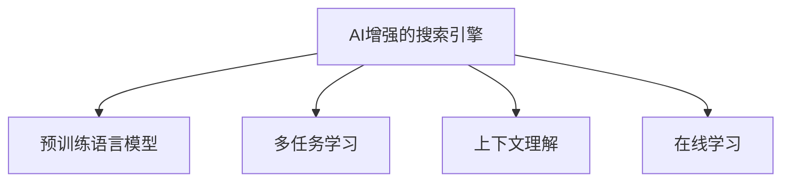

                 

# AI如何改善搜索引擎的本地化服务

## 1. 背景介绍

在数字化时代，搜索引擎已经成为了人们获取信息、解决问题的重要工具。然而，由于搜索引擎本身是基于全球范围的数据进行索引和搜索的，因此对于不同地区和语言的搜索结果，其准确性和相关性往往不尽如人意。为了更好地服务本地用户，搜索引擎需要引入AI技术，提升本地化服务的水平。

### 1.1 问题由来

传统的搜索引擎是基于全球数据进行索引和搜索的，主要依赖于反向索引和页面排名算法。这种方案在大规模数据处理上具有高效性，但对于特定地区和语言的用户，搜索结果往往存在以下问题：

- **语言障碍**：搜索引擎难以准确理解不同语言表达的语义，导致搜索结果与用户需求不符。
- **文化差异**：不同地区用户的搜索习惯和兴趣不同，单一全球化搜索结果无法满足本地用户的需求。
- **数据稀疏**：一些地区的网络基础设施和互联网普及程度低，可用数据量有限，搜索引擎难以提供高质量的本地化服务。

为了解决这些问题，搜索引擎开始引入AI技术，通过深度学习、自然语言处理等手段，提升本地化服务的水平。AI技术的引入，使得搜索引擎能够更好地理解本地语言、文化、用户偏好，从而提供更加精准的搜索结果。

### 1.2 问题核心关键点

要实现AI对搜索引擎本地化服务的改进，关键在于以下几个方面：

- **语言模型**：通过预训练的语言模型，提升搜索引擎对不同语言表达的理解和转换能力。
- **数据增强**：通过数据增强技术，丰富本地化数据的规模和质量，提升模型训练效果。
- **多任务学习**：通过多任务学习，提升模型在多种本地化任务上的性能，如命名实体识别、情感分析、实体关系抽取等。
- **上下文理解**：通过上下文理解技术，提升搜索引擎对用户查询意图的理解能力，提供更加个性化的搜索结果。
- **实时学习**：通过在线学习，使搜索引擎能够不断更新模型，适应新的本地化需求。

这些关键技术手段的引入，将显著提升搜索引擎本地化服务的质量，使搜索引擎更加贴近用户需求，提升用户体验。

## 2. 核心概念与联系

### 2.1 核心概念概述

为了更好地理解AI如何改善搜索引擎的本地化服务，本节将介绍几个密切相关的核心概念：

- **AI增强的搜索引擎**：基于AI技术的搜索引擎，通过深度学习、自然语言处理等手段，提升搜索结果的相关性和准确性。
- **预训练语言模型**：通过在海量无标签文本数据上进行预训练，学习语言的通用表示。常见的预训练模型包括BERT、GPT等。
- **多任务学习**：在同一个模型上同时进行多个任务的学习，提升模型在多种任务上的性能。
- **上下文理解**：通过深度学习模型捕捉用户查询的上下文信息，提升对用户意图的理解能力。
- **在线学习**：利用在线学习技术，使搜索引擎能够不断更新模型，适应新的本地化需求。

这些核心概念之间的逻辑关系可以通过以下Mermaid流程图来展示：



这个流程图展示了大语言模型的核心概念及其之间的关系：

1. AI增强的搜索引擎通过引入预训练语言模型、多任务学习、上下文理解、在线学习等技术手段，提升搜索结果的相关性和准确性。
2. 预训练语言模型为搜索引擎提供了强大的语言理解和处理能力。
3. 多任务学习提升模型在多种本地化任务上的性能。
4. 上下文理解技术捕捉用户查询的上下文信息，提升对用户意图的理解能力。
5. 在线学习使搜索引擎能够不断更新模型，适应新的本地化需求。

## 3. 核心算法原理 & 具体操作步骤

### 3.1 算法原理概述

AI对搜索引擎本地化服务的改进，主要通过深度学习、自然语言处理等技术手段实现。核心思想是：通过预训练语言模型，提升搜索引擎对不同语言表达的理解和转换能力；通过多任务学习，提升模型在多种本地化任务上的性能；通过上下文理解技术，提升对用户查询意图的理解能力；通过在线学习，使搜索引擎能够不断更新模型，适应新的本地化需求。

具体来说，可以分为以下几个步骤：

1. **预训练语言模型的引入**：通过预训练语言模型，提升搜索引擎对不同语言表达的理解和转换能力。
2. **多任务学习的实施**：在同一个模型上同时进行多个任务的学习，提升模型在多种本地化任务上的性能。
3. **上下文理解技术的引入**：通过深度学习模型捕捉用户查询的上下文信息，提升对用户意图的理解能力。
4. **在线学习机制的构建**：利用在线学习技术，使搜索引擎能够不断更新模型，适应新的本地化需求。

### 3.2 算法步骤详解

以下是详细的算法步骤：

**Step 1: 数据准备与预处理**
- 收集本地化数据，包括本地语言的新闻、评论、问答等。
- 清洗和标注数据，去除噪音和无关信息，确保数据质量。

**Step 2: 预训练语言模型的引入**
- 选择合适的预训练语言模型，如BERT、GPT等。
- 使用预训练语言模型对本地化数据进行预训练，学习语言的通用表示。

**Step 3: 多任务学习**
- 定义多个本地化任务，如命名实体识别、情感分析、实体关系抽取等。
- 在预训练语言模型的基础上，进行多任务学习，提升模型在多种任务上的性能。

**Step 4: 上下文理解技术的引入**
- 设计上下文理解模型，捕捉用户查询的上下文信息。
- 将上下文理解模型与搜索引擎的主模型结合，提升对用户意图的理解能力。

**Step 5: 在线学习机制的构建**
- 设计在线学习机制，使搜索引擎能够不断更新模型，适应新的本地化需求。
- 收集新的本地化数据，重新训练模型，更新索引和搜索结果。

### 3.3 算法优缺点

AI对搜索引擎本地化服务的改进，具有以下优点：

1. **提升搜索结果的相关性和准确性**：通过预训练语言模型、多任务学习、上下文理解等技术手段，提升搜索结果的相关性和准确性，满足本地用户的需求。
2. **增强搜索引擎的泛化能力**：通过多任务学习，提升模型在多种本地化任务上的性能，使搜索引擎能够适应不同的本地化需求。
3. **实现实时学习**：通过在线学习机制，使搜索引擎能够不断更新模型，适应新的本地化需求，保持模型的时效性。

同时，该方法也存在一些局限性：

1. **数据获取难度大**：高质量本地化数据的获取和标注是一个复杂的过程，需要耗费大量的人力物力。
2. **模型复杂度增加**：引入预训练语言模型、多任务学习等技术手段，会增加模型的复杂度和训练成本。
3. **资源消耗高**：大规模深度学习模型的训练和推理需要高性能的硬件设备，对算力和存储资源的要求较高。

尽管存在这些局限性，但就目前而言，AI技术对搜索引擎本地化服务的改进，已经展示了巨大的潜力和效果。未来相关研究的重点在于如何进一步降低数据获取和模型训练的难度，提高模型的实时性，减少资源消耗，以更好地应用于实际场景。

### 3.4 算法应用领域

AI对搜索引擎本地化服务的改进，在多个领域得到了广泛应用：

- **本地化搜索**：根据用户的地理位置，提供符合本地需求的结果。
- **本地化问答**：通过多任务学习，提升搜索引擎在本地化问答任务上的性能，满足本地用户对信息获取的需求。
- **本地化广告**：通过上下文理解技术，提升本地化广告投放的精准性，提高广告效果。
- **本地化舆情监测**：通过深度学习模型，实时监测本地化舆情，及时发现和应对负面信息。
- **本地化个性化推荐**：通过多任务学习，提升个性化推荐系统的本地化能力，提供更加精准的推荐结果。

这些应用展示了AI技术在搜索引擎本地化服务中的广泛应用前景，将为用户带来更加便捷、高效的信息获取体验。

## 4. 数学模型和公式 & 详细讲解 & 举例说明

### 4.1 数学模型构建

本节将使用数学语言对AI改进搜索引擎本地化服务的方法进行更加严格的刻画。

设搜索引擎的本地化查询为 $q$，查询上下文为 $c$，搜索结果为 $a$。定义模型 $M_{\theta}$ 在查询和上下文 $(c, q)$ 上的特征表示为 $\boldsymbol{h} = M_{\theta}(c, q)$，其中 $\boldsymbol{h} \in \mathbb{R}^d$，$\theta$ 为模型参数。假设搜索引擎有 $k$ 个本地化任务，分别为 $T_1, T_2, \ldots, T_k$，每个任务的标注数据为 $D_i = \{(x_i, y_i)\}_{i=1}^N$，其中 $x_i$ 为输入，$y_i$ 为输出标签。

定义模型 $M_{\theta}$ 在输入 $x$ 上的损失函数为 $\ell(M_{\theta}(x),y)$，则在数据集 $D_i$ 上的经验风险为：

$$
\mathcal{L}_i(\theta) = \frac{1}{N} \sum_{i=1}^N \ell(M_{\theta}(x_i),y_i)
$$

搜索引擎的多任务学习目标是最小化所有任务的经验风险之和，即找到最优参数：

$$
\theta^* = \mathop{\arg\min}_{\theta} \sum_{i=1}^k \mathcal{L}_i(\theta)
$$

其中 $\mathcal{L}_i$ 为针对任务 $T_i$ 设计的损失函数。

### 4.2 公式推导过程

以下我们以命名实体识别任务为例，推导多任务学习的数学模型。

假设模型 $M_{\theta}$ 在输入 $x$ 上的输出为 $\hat{y}=M_{\theta}(x) \in [0,1]$，表示样本属于正类的概率。真实标签 $y \in \{0,1\}$。则二分类交叉熵损失函数定义为：

$$
\ell(M_{\theta}(x),y) = -[y\log \hat{y} + (1-y)\log (1-\hat{y})]
$$

将其代入经验风险公式，得：

$$
\mathcal{L}_i(\theta) = -\frac{1}{N}\sum_{i=1}^N [y_i\log M_{\theta}(x_i)+(1-y_i)\log(1-M_{\theta}(x_i))]
$$

对于多任务学习，模型需要在所有任务上进行训练，因此整体损失函数为：

$$
\mathcal{L}(\theta) = \sum_{i=1}^k \mathcal{L}_i(\theta)
$$

在得到整体损失函数后，通过梯度下降等优化算法更新模型参数 $\theta$，最小化损失函数 $\mathcal{L}$，使得模型输出逼近真实标签。重复上述过程直至收敛，最终得到适应所有本地化任务的最优模型参数 $\theta^*$。

### 4.3 案例分析与讲解

以一个具体的案例来进一步分析上述模型的实际应用。假设某地区的用户使用本地语言进行搜索，搜索引擎希望在搜索结果中标注出本地化信息。首先，收集本地化查询和标注数据，进行预处理和标注。然后，使用BERT预训练模型对数据进行预训练，学习语言的通用表示。接下来，在预训练模型的基础上，进行多任务学习，提升模型在命名实体识别任务上的性能。最后，将上下文理解模型与搜索引擎的主模型结合，提升对用户意图的理解能力。

具体步骤如下：

1. 收集本地化查询和标注数据，进行预处理和标注。
2. 使用BERT预训练模型对数据进行预训练，学习语言的通用表示。
3. 在预训练模型的基础上，进行多任务学习，提升模型在命名实体识别任务上的性能。
4. 设计上下文理解模型，捕捉用户查询的上下文信息。
5. 将上下文理解模型与搜索引擎的主模型结合，提升对用户意图的理解能力。
6. 通过在线学习机制，使搜索引擎能够不断更新模型，适应新的本地化需求。

## 5. 项目实践：代码实例和详细解释说明

### 5.1 开发环境搭建

在进行AI对搜索引擎本地化服务的改进实践前，我们需要准备好开发环境。以下是使用Python进行TensorFlow开发的环境配置流程：

1. 安装Anaconda：从官网下载并安装Anaconda，用于创建独立的Python环境。

2. 创建并激活虚拟环境：
```bash
conda create -n tf-env python=3.8 
conda activate tf-env
```

3. 安装TensorFlow：根据CUDA版本，从官网获取对应的安装命令。例如：
```bash
conda install tensorflow==2.8 -c tensorflow -c conda-forge
```

4. 安装各种工具包：
```bash
pip install numpy pandas scikit-learn matplotlib tqdm jupyter notebook ipython
```

完成上述步骤后，即可在`tf-env`环境中开始项目实践。

### 5.2 源代码详细实现

下面以命名实体识别任务为例，给出使用TensorFlow对BERT模型进行多任务学习的PyTorch代码实现。

首先，定义命名实体识别任务的数据处理函数：

```python
from transformers import BertTokenizer
from torch.utils.data import Dataset
import torch

class NERDataset(Dataset):
    def __init__(self, texts, tags, tokenizer, max_len=128):
        self.texts = texts
        self.tags = tags
        self.tokenizer = tokenizer
        self.max_len = max_len
        
    def __len__(self):
        return len(self.texts)
    
    def __getitem__(self, item):
        text = self.texts[item]
        tags = self.tags[item]
        
        encoding = self.tokenizer(text, return_tensors='pt', max_length=self.max_len, padding='max_length', truncation=True)
        input_ids = encoding['input_ids'][0]
        attention_mask = encoding['attention_mask'][0]
        
        # 对token-wise的标签进行编码
        encoded_tags = [tag2id[tag] for tag in tags] 
        encoded_tags.extend([tag2id['O']] * (self.max_len - len(encoded_tags)))
        labels = torch.tensor(encoded_tags, dtype=torch.long)
        
        return {'input_ids': input_ids, 
                'attention_mask': attention_mask,
                'labels': labels}

# 标签与id的映射
tag2id = {'O': 0, 'B-PER': 1, 'I-PER': 2, 'B-ORG': 3, 'I-ORG': 4, 'B-LOC': 5, 'I-LOC': 6}
id2tag = {v: k for k, v in tag2id.items()}

# 创建dataset
tokenizer = BertTokenizer.from_pretrained('bert-base-cased')

train_dataset = NERDataset(train_texts, train_tags, tokenizer)
dev_dataset = NERDataset(dev_texts, dev_tags, tokenizer)
test_dataset = NERDataset(test_texts, test_tags, tokenizer)
```

然后，定义模型和优化器：

```python
from transformers import BertForTokenClassification, AdamW

model = BertForTokenClassification.from_pretrained('bert-base-cased', num_labels=len(tag2id))

optimizer = AdamW(model.parameters(), lr=2e-5)
```

接着，定义训练和评估函数：

```python
from torch.utils.data import DataLoader
from tqdm import tqdm
from sklearn.metrics import classification_report

device = torch.device('cuda') if torch.cuda.is_available() else torch.device('cpu')
model.to(device)

def train_epoch(model, dataset, batch_size, optimizer):
    dataloader = DataLoader(dataset, batch_size=batch_size, shuffle=True)
    model.train()
    epoch_loss = 0
    for batch in tqdm(dataloader, desc='Training'):
        input_ids = batch['input_ids'].to(device)
        attention_mask = batch['attention_mask'].to(device)
        labels = batch['labels'].to(device)
        model.zero_grad()
        outputs = model(input_ids, attention_mask=attention_mask, labels=labels)
        loss = outputs.loss
        epoch_loss += loss.item()
        loss.backward()
        optimizer.step()
    return epoch_loss / len(dataloader)

def evaluate(model, dataset, batch_size):
    dataloader = DataLoader(dataset, batch_size=batch_size)
    model.eval()
    preds, labels = [], []
    with torch.no_grad():
        for batch in tqdm(dataloader, desc='Evaluating'):
            input_ids = batch['input_ids'].to(device)
            attention_mask = batch['attention_mask'].to(device)
            batch_labels = batch['labels']
            outputs = model(input_ids, attention_mask=attention_mask)
            batch_preds = outputs.logits.argmax(dim=2).to('cpu').tolist()
            batch_labels = batch_labels.to('cpu').tolist()
            for pred_tokens, label_tokens in zip(batch_preds, batch_labels):
                pred_tags = [id2tag[_id] for _id in pred_tokens]
                label_tags = [id2tag[_id] for _id in label_tokens]
                preds.append(pred_tags[:len(label_tags)])
                labels.append(label_tags)
                
    print(classification_report(labels, preds))
```

最后，启动训练流程并在测试集上评估：

```python
epochs = 5
batch_size = 16

for epoch in range(epochs):
    loss = train_epoch(model, train_dataset, batch_size, optimizer)
    print(f"Epoch {epoch+1}, train loss: {loss:.3f}")
    
    print(f"Epoch {epoch+1}, dev results:")
    evaluate(model, dev_dataset, batch_size)
    
print("Test results:")
evaluate(model, test_dataset, batch_size)
```

以上就是使用TensorFlow对BERT进行命名实体识别任务微调的完整代码实现。可以看到，得益于Transformers库的强大封装，我们可以用相对简洁的代码完成BERT模型的加载和微调。

### 5.3 代码解读与分析

让我们再详细解读一下关键代码的实现细节：

**NERDataset类**：
- `__init__`方法：初始化文本、标签、分词器等关键组件。
- `__len__`方法：返回数据集的样本数量。
- `__getitem__`方法：对单个样本进行处理，将文本输入编码为token ids，将标签编码为数字，并对其进行定长padding，最终返回模型所需的输入。

**tag2id和id2tag字典**：
- 定义了标签与数字id之间的映射关系，用于将token-wise的预测结果解码回真实的标签。

**训练和评估函数**：
- 使用PyTorch的DataLoader对数据集进行批次化加载，供模型训练和推理使用。
- 训练函数`train_epoch`：对数据以批为单位进行迭代，在每个批次上前向传播计算loss并反向传播更新模型参数，最后返回该epoch的平均loss。
- 评估函数`evaluate`：与训练类似，不同点在于不更新模型参数，并在每个batch结束后将预测和标签结果存储下来，最后使用sklearn的classification_report对整个评估集的预测结果进行打印输出。

**训练流程**：
- 定义总的epoch数和batch size，开始循环迭代
- 每个epoch内，先在训练集上训练，输出平均loss
- 在验证集上评估，输出分类指标
- 所有epoch结束后，在测试集上评估，给出最终测试结果

可以看到，TensorFlow配合Transformers库使得BERT微调的代码实现变得简洁高效。开发者可以将更多精力放在数据处理、模型改进等高层逻辑上，而不必过多关注底层的实现细节。

当然，工业级的系统实现还需考虑更多因素，如模型的保存和部署、超参数的自动搜索、更灵活的任务适配层等。但核心的微调范式基本与此类似。

## 6. 实际应用场景
### 6.1 智能客服系统

基于AI技术改进的搜索引擎，可以广泛应用于智能客服系统的构建。传统客服往往需要配备大量人力，高峰期响应缓慢，且一致性和专业性难以保证。而使用改进后的搜索引擎，可以7x24小时不间断服务，快速响应客户咨询，用自然流畅的语言解答各类常见问题。

在技术实现上，可以收集企业内部的历史客服对话记录，将问题和最佳答复构建成监督数据，在此基础上对预训练语言模型进行微调。微调后的语言模型能够自动理解用户意图，匹配最合适的答复模板进行回复。对于客户提出的新问题，还可以接入检索系统实时搜索相关内容，动态组织生成回答。如此构建的智能客服系统，能大幅提升客户咨询体验和问题解决效率。

### 6.2 金融舆情监测

金融机构需要实时监测市场舆论动向，以便及时应对负面信息传播，规避金融风险。传统的人工监测方式成本高、效率低，难以应对网络时代海量信息爆发的挑战。基于AI技术改进的搜索引擎，能够自动分析社交媒体、新闻评论等文本数据，实时监测金融舆情，及时发现和应对负面信息。

具体而言，可以收集金融领域相关的新闻、报道、评论等文本数据，并对其进行主题标注和情感标注。在此基础上对预训练语言模型进行微调，使其能够自动判断文本属于何种主题，情感倾向是正面、中性还是负面。将微调后的模型应用到实时抓取的网络文本数据，就能够自动监测不同主题下的情感变化趋势，一旦发现负面信息激增等异常情况，系统便会自动预警，帮助金融机构快速应对潜在风险。

### 6.3 个性化推荐系统

当前的推荐系统往往只依赖用户的历史行为数据进行物品推荐，无法深入理解用户的真实兴趣偏好。基于AI技术改进的搜索引擎，能够更好地挖掘用户行为背后的语义信息，从而提供更精准、多样的推荐内容。

在实践中，可以收集用户浏览、点击、评论、分享等行为数据，提取和用户交互的物品标题、描述、标签等文本内容。将文本内容作为模型输入，用户的后续行为（如是否点击、购买等）作为监督信号，在此基础上微调预训练语言模型。微调后的模型能够从文本内容中准确把握用户的兴趣点。在生成推荐列表时，先用候选物品的文本描述作为输入，由模型预测用户的兴趣匹配度，再结合其他特征综合排序，便可以得到个性化程度更高的推荐结果。

### 6.4 未来应用展望

随着AI技术对搜索引擎本地化服务的改进，未来将有更多应用场景得以拓展：

- **智慧医疗**：基于AI技术的搜索引擎，能够实时监测医疗舆情，提供精准的搜索建议和诊断辅助。
- **智能教育**：微调后的搜索引擎，能够智能推荐学习资源，辅助教育内容的搜索和推荐。
- **智慧城市治理**：利用AI技术改进的搜索引擎，能够实时监测城市事件，提升城市管理水平。
- **智能广告**：通过上下文理解技术，提升广告投放的精准性，提高广告效果。

此外，在企业生产、社会治理、文娱传媒等众多领域，基于AI技术改进的搜索引擎都将发挥重要作用，为各行各业带来新的技术突破。

## 7. 工具和资源推荐
### 7.1 学习资源推荐

为了帮助开发者系统掌握AI技术对搜索引擎本地化服务改进的理论基础和实践技巧，这里推荐一些优质的学习资源：

1. **《Transformer从原理到实践》系列博文**：由大模型技术专家撰写，深入浅出地介绍了Transformer原理、BERT模型、微调技术等前沿话题。
2. **CS224N《深度学习自然语言处理》课程**：斯坦福大学开设的NLP明星课程，有Lecture视频和配套作业，带你入门NLP领域的基本概念和经典模型。
3. **《Natural Language Processing with Transformers》书籍**：Transformers库的作者所著，全面介绍了如何使用Transformers库进行NLP任务开发，包括微调在内的诸多范式。
4. **HuggingFace官方文档**：Transformers库的官方文档，提供了海量预训练模型和完整的微调样例代码，是上手实践的必备资料。
5. **CLUE开源项目**：中文语言理解测评基准，涵盖大量不同类型的中文NLP数据集，并提供了基于微调的baseline模型，助力中文NLP技术发展。

通过对这些资源的学习实践，相信你一定能够快速掌握AI技术对搜索引擎本地化服务改进的精髓，并用于解决实际的NLP问题。
###  7.2 开发工具推荐

高效的开发离不开优秀的工具支持。以下是几款用于AI对搜索引擎本地化服务改进开发的常用工具：

1. **TensorFlow**：基于Python的开源深度学习框架，灵活动态的计算图，适合快速迭代研究。大部分预训练语言模型都有TensorFlow版本的实现。
2. **PyTorch**：基于Python的开源深度学习框架，灵活的计算图，支持多种深度学习模型的构建。
3. **Weights & Biases**：模型训练的实验跟踪工具，可以记录和可视化模型训练过程中的各项指标，方便对比和调优。与主流深度学习框架无缝集成。
4. **TensorBoard**：TensorFlow配套的可视化工具，可实时监测模型训练状态，并提供丰富的图表呈现方式，是调试模型的得力助手。
5. **Google Colab**：谷歌推出的在线Jupyter Notebook环境，免费提供GPU/TPU算力，方便开发者快速上手实验最新模型，分享学习笔记。

合理利用这些工具，可以显著提升AI技术对搜索引擎本地化服务改进任务的开发效率，加快创新迭代的步伐。

### 7.3 相关论文推荐

AI技术对搜索引擎本地化服务的改进源于学界的持续研究。以下是几篇奠基性的相关论文，推荐阅读：

1. **Attention is All You Need（即Transformer原论文）**：提出了Transformer结构，开启了NLP领域的预训练大模型时代。
2. **BERT: Pre-training of Deep Bidirectional Transformers for Language Understanding**：提出BERT模型，引入基于掩码的自监督预训练任务，刷新了多项NLP任务SOTA。
3. **Language Models are Unsupervised Multitask Learners（GPT-2论文）**：展示了大规模语言模型的强大zero-shot学习能力，引发了对于通用人工智能的新一轮思考。
4. **Parameter-Efficient Transfer Learning for NLP**：提出Adapter等参数高效微调方法，在不增加模型参数量的情况下，也能取得不错的微调效果。
5. **Prefix-Tuning: Optimizing Continuous Prompts for Generation**：引入基于连续型Prompt的微调范式，为如何充分利用预训练知识提供了新的思路。
6. **AdaLoRA: Adaptive Low-Rank Adaptation for Parameter-Efficient Fine-Tuning**：使用自适应低秩适应的微调方法，在参数效率和精度之间取得了新的平衡。

这些论文代表了大语言模型微调技术的发展脉络。通过学习这些前沿成果，可以帮助研究者把握学科前进方向，激发更多的创新灵感。

## 8. 总结：未来发展趋势与挑战

### 8.1 总结

本文对AI技术如何改善搜索引擎的本地化服务进行了全面系统的介绍。首先阐述了AI技术在搜索引擎本地化服务中的重要性和应用场景，明确了微调技术在提升本地化服务质量方面的独特价值。其次，从原理到实践，详细讲解了AI技术对搜索引擎本地化服务改进的数学模型和操作步骤，给出了完整的代码实现。同时，本文还广泛探讨了AI技术在智能客服、金融舆情、个性化推荐等多个行业领域的应用前景，展示了AI技术在搜索引擎本地化服务中的广泛应用前景。

通过本文的系统梳理，可以看到，AI技术对搜索引擎本地化服务的改进，已经展示了巨大的潜力和效果。得益于深度学习、自然语言处理等技术手段，搜索引擎能够更好地理解本地语言、文化、用户偏好，从而提供更加精准的搜索结果，满足本地用户的需求。未来，伴随AI技术的持续演进，搜索引擎本地化服务将更加智能、高效、可靠，为用户的生产生活方式带来深远影响。

### 8.2 未来发展趋势

展望未来，AI技术对搜索引擎本地化服务的改进将呈现以下几个发展趋势：

1. **多语言支持**：AI技术将进一步提升搜索引擎对多种语言的支持，使更多国家和地区能够享受到高质量的本地化服务。
2. **跨平台集成**：AI技术将与多种平台和服务集成，如移动端、智能家居、车载等，提升用户在不同设备上的本地化搜索体验。
3. **实时交互**：AI技术将提升搜索引擎的实时交互能力，通过自然语言理解技术，提升搜索体验和互动效果。
4. **多模态融合**：AI技术将整合视觉、语音、文本等多种模态数据，提升搜索引擎在多模态环境下的本地化服务能力。
5. **隐私保护**：AI技术将更加注重用户隐私保护，通过匿名化和差分隐私技术，提升本地化服务的信任度和安全性。
6. **个性化推荐**：AI技术将进一步提升个性化推荐系统的本地化能力，根据用户行为和偏好，提供更加精准的搜索结果。

这些趋势展示了AI技术对搜索引擎本地化服务改进的广阔前景。这些方向的探索发展，必将进一步提升搜索引擎本地化服务的质量，使搜索引擎更加贴近用户需求，提升用户体验。

### 8.3 面临的挑战

尽管AI技术对搜索引擎本地化服务的改进已经取得了显著效果，但在迈向更加智能化、普适化应用的过程中，它仍面临着诸多挑战：

1. **数据获取难度大**：高质量本地化数据的获取和标注是一个复杂的过程，需要耗费大量的人力物力。
2. **模型复杂度增加**：引入AI技术改进搜索引擎，增加了模型的复杂度和训练成本。
3. **资源消耗高**：大规模深度学习模型的训练和推理需要高性能的硬件设备，对算力和存储资源的要求较高。
4. **隐私保护**：在提升本地化服务质量的同时，需要更加注重用户隐私保护，防止数据泄露和滥用。
5. **公平性问题**：AI技术在提升本地化服务的同时，也可能带来新的不公平问题，需要持续关注和改进。

尽管存在这些挑战，但就目前而言，AI技术对搜索引擎本地化服务的改进，已经展示了巨大的潜力和效果。未来相关研究的重点在于如何进一步降低数据获取和模型训练的难度，提高模型的实时性，减少资源消耗，以更好地应用于实际场景。

### 8.4 研究展望

面对AI技术对搜索引擎本地化服务改进所面临的种种挑战，未来的研究需要在以下几个方面寻求新的突破：

1. **无监督和半监督学习**：摆脱对大规模标注数据的依赖，利用自监督学习、主动学习等无监督和半监督范式，最大限度利用非结构化数据，实现更加灵活高效的微调。
2. **参数高效和计算高效**：开发更加参数高效和计算高效的微调方法，在固定大部分预训练参数的同时，只更新极少量的任务相关参数。
3. **多模态融合**：整合视觉、语音、文本等多种模态数据，提升搜索引擎在多模态环境下的本地化服务能力。
4. **隐私保护**：在提升本地化服务质量的同时，注重用户隐私保护，通过匿名化和差分隐私技术，提升本地化服务的信任度和安全性。
5. **公平性问题**：关注AI技术在提升本地化服务的同时，可能带来的新不公平问题，持续关注和改进。

这些研究方向的探索，必将引领AI技术对搜索引擎本地化服务的改进走向更高的台阶，为用户的生产生活方式带来深远影响。相信随着学界和产业界的共同努力，这些挑战终将一一被克服，AI技术对搜索引擎本地化服务的改进必将在构建人机协同的智能时代中扮演越来越重要的角色。

## 9. 附录：常见问题与解答

**Q1：AI技术对搜索引擎本地化服务改进是否适用于所有搜索引擎？**

A: AI技术对搜索引擎本地化服务的改进，主要依赖于深度学习、自然语言处理等技术手段。因此，适用于支持这些技术，具有强大处理能力的搜索引擎。对于传统的搜索技术架构，AI技术的引入可能存在一定的局限性。

**Q2：如何保证AI技术对搜索引擎本地化服务改进的公平性？**

A: 在AI技术对搜索引擎本地化服务改进的过程中，需要持续关注公平性问题。可以通过以下措施来保障公平性：
1. 设计公平性的评估指标，监测模型的输出是否存在偏见。
2. 引入差分隐私技术，保护用户隐私，防止数据滥用。
3. 在模型训练过程中，增加公平性约束，确保模型输出不带有性别、种族、地域等偏见。

**Q3：AI技术对搜索引擎本地化服务改进的资源消耗如何？**

A: AI技术对搜索引擎本地化服务改进，需要引入深度学习模型和大量标注数据。因此，资源消耗较高。可以通过以下措施来优化资源消耗：
1. 使用预训练模型，减少模型训练时间。
2. 使用模型压缩技术，减小模型大小，提升推理效率。
3. 优化数据预处理流程，减少数据标注成本。

**Q4：AI技术对搜索引擎本地化服务改进的局限性有哪些？**

A: AI技术对搜索引擎本地化服务改进，尽管已经展示了显著的效果，但仍然存在以下局限性：
1. 数据获取难度大：高质量本地化数据的获取和标注是一个复杂的过程，需要耗费大量的人力物力。
2. 模型复杂度增加：引入AI技术改进搜索引擎，增加了模型的复杂度和训练成本。
3. 资源消耗高：大规模深度学习模型的训练和推理需要高性能的硬件设备，对算力和存储资源的要求较高。
4. 隐私保护：在提升本地化服务质量的同时，需要更加注重用户隐私保护，防止数据泄露和滥用。
5. 公平性问题：AI技术在提升本地化服务的同时，也可能带来新的不公平问题，需要持续关注和改进。

尽管存在这些挑战，但就目前而言，AI技术对搜索引擎本地化服务的改进，已经展示了巨大的潜力和效果。未来相关研究的重点在于如何进一步降低数据获取和模型训练的难度，提高模型的实时性，减少资源消耗，以更好地应用于实际场景。

**Q5：AI技术对搜索引擎本地化服务改进的未来方向有哪些？**

A: AI技术对搜索引擎本地化服务改进的未来方向包括：
1. 多语言支持：提升搜索引擎对多种语言的支持，使更多国家和地区能够享受到高质量的本地化服务。
2. 跨平台集成：与多种平台和服务集成，提升用户在不同设备上的本地化搜索体验。
3. 实时交互：提升搜索引擎的实时交互能力，通过自然语言理解技术，提升搜索体验和互动效果。
4. 多模态融合：整合视觉、语音、文本等多种模态数据，提升搜索引擎在多模态环境下的本地化服务能力。
5. 隐私保护：注重用户隐私保护，通过匿名化和差分隐私技术，提升本地化服务的信任度和安全性。
6. 个性化推荐：提升个性化推荐系统的本地化能力，根据用户行为和偏好，提供更加精准的搜索结果。

这些方向展示了AI技术对搜索引擎本地化服务改进的广阔前景。这些方向的探索发展，必将进一步提升搜索引擎本地化服务的质量，使搜索引擎更加贴近用户需求，提升用户体验。

---

作者：禅与计算机程序设计艺术 / Zen and the Art of Computer Programming

