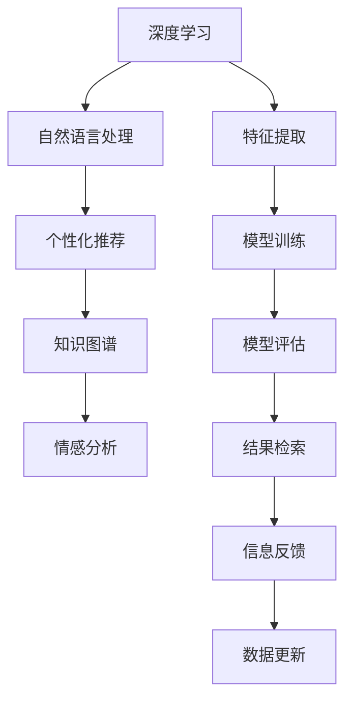

                 

## 1. 背景介绍

在数字时代，信息检索不再局限于传统的关键词搜索，人工智能驱动的搜索引擎已逐渐渗透到教育领域，形成了教育AI搜索引擎这一新兴领域。传统的教育搜索引擎主要依赖于关键词匹配、搜索结果排序等基本技术，但随着深度学习、自然语言处理等人工智能技术的成熟，AI搜索引擎开始融入个性化推荐、知识图谱、情感分析等功能，使得教育搜索变得更加智能化、个性化和情境化。本文将全面探讨AI搜索引擎在教育领域的应用前景，从核心概念、算法原理、项目实践、应用场景等方面深入分析，揭示其潜力与挑战。

## 2. 核心概念与联系

### 2.1 核心概念概述

AI搜索引擎是指采用人工智能技术，结合教育领域的特点，进行知识获取、信息检索和知识推理的智能化搜索引擎系统。其核心在于运用深度学习、自然语言处理等技术，提高搜索结果的精准度和相关性，同时引入个性化推荐、知识图谱等功能，提供更为个性化的教育信息服务。以下是一些与AI搜索引擎紧密相关的核心概念：

- **深度学习**：指通过多层神经网络进行复杂数据分析和模式识别，实现对数据的自动特征提取和分类。深度学习在自然语言处理中广泛应用，是AI搜索引擎的核心技术之一。
- **自然语言处理**：指使用计算机处理和理解人类语言的技术，涉及语言模型、文本分类、命名实体识别、信息抽取、机器翻译等任务，是构建智能搜索引擎的基础。
- **个性化推荐**：指根据用户的历史行为、兴趣偏好等信息，通过算法推荐符合用户需求的内容，提升用户满意度。个性化推荐技术在大数据时代被广泛应用于搜索引擎和推荐系统。
- **知识图谱**：指将结构化信息（如词表、关系图）转化为机器可理解的形式，构建知识点之间的关联网络，用于语义搜索和知识推理。
- **情感分析**：指对文本中的情感信息进行自动分析，识别用户情绪倾向，用于内容推荐、广告过滤等应用。

这些核心概念之间存在紧密的联系，通过深度学习、自然语言处理等技术，AI搜索引擎可以处理海量教育信息，提供精准、个性化的搜索结果。

### 2.2 核心概念原理和架构的 Mermaid 流程图



上述流程图展示了AI搜索引擎的核心架构和技术流程。深度学习和自然语言处理技术用于特征提取和模型训练，个性化推荐和知识图谱用于信息检索和知识推理，情感分析用于结果筛选和反馈优化。这些技术相辅相成，共同构成了AI搜索引擎的智能搜索能力。

## 3. 核心算法原理 & 具体操作步骤

### 3.1 算法原理概述

AI搜索引擎主要基于深度学习和自然语言处理技术，通过以下几个步骤实现教育信息的智能化检索：

1. **特征提取**：将教育文档和问题转换为向量表示，提取文本中的关键特征，如关键词、实体、情感等。
2. **模型训练**：在标注数据集上进行模型训练，构建语义理解和信息检索的深度学习模型。
3. **知识图谱构建**：将教育领域的知识点和关系进行结构化表示，建立知识图谱。
4. **信息检索**：将用户查询与知识图谱进行匹配，找出相关答案或信息。
5. **个性化推荐**：根据用户历史行为和兴趣偏好，推荐符合用户需求的教育资源。
6. **情感分析**：对搜索结果进行情感分析，过滤掉不相关的或负面情绪信息。
7. **结果反馈**：根据用户反馈和满意度，持续优化算法和模型。

### 3.2 算法步骤详解

#### 步骤1：数据预处理

教育数据包括课程、教材、论文、文章等文本和多媒体资源，预处理步骤包括：

- **数据清洗**：去除无用字符、纠正错误信息，保证数据质量。
- **文本分词**：将文本划分为词语序列，便于模型处理。
- **停用词过滤**：移除常见但无实际意义的词语，减少特征维度。
- **特征编码**：将文本转换为向量表示，常用的方法包括词袋模型、TF-IDF、Word2Vec、BERT等。

#### 步骤2：模型训练

模型训练过程包括：

- **选择模型**：选择适合的深度学习模型，如RNN、LSTM、Transformer等。
- **定义损失函数**：定义合适的损失函数，如交叉熵损失、Mean Squared Error等。
- **优化器选择**：选择适合的优化器，如Adam、SGD等。
- **超参数调整**：调整学习率、批大小等超参数，提高模型训练效果。
- **模型评估**：使用验证集评估模型效果，避免过拟合。

#### 步骤3：知识图谱构建

知识图谱构建过程包括：

- **知识点抽取**：从教育文本中抽取出具体的知识点，如数学公式、历史事件、物理概念等。
- **关系抽取**：构建知识点之间的关联关系，如数学中的"等于"、历史中的"发生在"等。
- **图谱整合**：将知识点和关系进行整合，形成知识图谱。

#### 步骤4：信息检索

信息检索过程包括：

- **用户查询处理**：将用户查询转换为向量表示。
- **知识图谱匹配**：将用户查询与知识图谱进行匹配，找出相关节点和关系。
- **答案生成**：根据匹配结果，生成相关答案或信息。

#### 步骤5：个性化推荐

个性化推荐过程包括：

- **用户画像构建**：根据用户历史行为和兴趣，构建用户画像。
- **推荐算法选择**：选择适合的推荐算法，如协同过滤、基于内容的推荐等。
- **推荐结果筛选**：根据用户画像和推荐算法，筛选出相关推荐结果。

#### 步骤6：情感分析

情感分析过程包括：

- **情感词典构建**：构建情感词典，识别文本中的情感词。
- **情感评分计算**：计算文本的情感评分，反映文本的情感倾向。
- **结果过滤**：根据情感评分，过滤掉负面情绪的推荐结果。

#### 步骤7：结果反馈

结果反馈过程包括：

- **用户反馈收集**：收集用户对搜索结果的反馈信息，如满意度、评分等。
- **反馈数据处理**：对用户反馈数据进行处理，分析用户需求和偏好。
- **模型更新**：根据反馈数据，更新模型和算法，提高搜索结果的准确性和相关性。

### 3.3 算法优缺点

#### 优点

1. **精准性高**：基于深度学习和知识图谱，AI搜索引擎能够对教育文本进行语义理解和关系推理，提高搜索结果的精准性。
2. **个性化强**：通过个性化推荐和情感分析，AI搜索引擎能够提供符合用户需求和兴趣的教育信息，提升用户体验。
3. **泛化能力强**：知识图谱的构建使得AI搜索引擎具有较强的泛化能力，能够处理多种类型的教育信息。
4. **高效性**：基于深度学习模型，AI搜索引擎能够快速处理大量教育数据，提高搜索效率。

#### 缺点

1. **数据依赖性强**：AI搜索引擎的效果依赖于高质量的教育数据，数据获取和标注成本较高。
2. **计算资源需求高**：深度学习模型的训练和知识图谱的构建需要大量的计算资源，可能对硬件设备要求较高。
3. **模型复杂度大**：AI搜索引擎涉及多个复杂模型和算法，模型调试和优化难度较大。
4. **隐私问题**：处理教育数据可能涉及用户隐私，数据保护和隐私管理是重要的挑战。

### 3.4 算法应用领域

AI搜索引擎的应用领域广泛，涵盖以下几个方面：

- **在线教育平台**：为在线教育平台提供智能搜索、个性化推荐等功能，提升教学质量和学习效率。
- **教育资源库**：对教育资源进行索引和分类，帮助教师和学生快速找到所需资源。
- **智能辅导系统**：通过AI搜索引擎进行知识点检索和答案生成，辅助学生进行自主学习。
- **学术研究支持**：对学术论文、教育论文进行检索和分析，支持学术研究和论文写作。
- **教育管理**：对教育管理数据进行分析和检索，支持教育管理和决策。

## 4. 数学模型和公式 & 详细讲解 & 举例说明

### 4.1 数学模型构建

#### 4.1.1 特征提取

特征提取模型的输入为教育文本，输出为文本的向量表示。常用的特征提取方法包括：

- **词袋模型**：将文本表示为词的集合，每个词作为特征维度。
- **TF-IDF**：计算词频和逆文档频率，反映词在文本中的重要性和分布情况。
- **Word2Vec**：将词转换为向量表示，捕捉词之间的语义关系。
- **BERT**：使用Transformer模型，进行大规模预训练，生成词嵌入向量。

#### 4.1.2 模型训练

模型训练的输出为模型的权重，用于对教育文本进行分类或检索。常用的模型包括：

- **RNN**：基于循环神经网络，处理序列数据，适用于长文本处理。
- **LSTM**：基于长短期记忆网络，处理长文本和序列数据。
- **Transformer**：基于自注意力机制，适用于大规模语料处理。

#### 4.1.3 知识图谱构建

知识图谱的输出为节点和边的集合，表示知识点和关系。常用的构建方法包括：

- **知识抽取**：从教育文本中抽取出具体的知识点，如数学公式、历史事件、物理概念等。
- **关系抽取**：构建知识点之间的关联关系，如数学中的"等于"、历史中的"发生在"等。
- **图谱整合**：将知识点和关系进行整合，形成知识图谱。

### 4.2 公式推导过程

#### 4.2.1 词袋模型

词袋模型的特征向量 $x$ 定义为：

$$
x = \{w_1, w_2, ..., w_n\}
$$

其中 $w_i$ 表示文本中第 $i$ 个词的权重。权重的计算方法有多种，如词频（TF）、逆文档频率（IDF）等。

#### 4.2.2 TF-IDF

TF-IDF特征向量的计算公式为：

$$
x_{TF-IDF} = \{w_1^{TF-IDF}, w_2^{TF-IDF}, ..., w_n^{TF-IDF}\}
$$

其中 $w_i^{TF-IDF} = w_i^{TF} \times \log(\frac{N}{d_i})$，$N$ 为总文档数，$d_i$ 为包含第 $i$ 个词的文档数。

#### 4.2.3 Word2Vec

Word2Vec模型将词转换为向量表示 $v$，计算公式为：

$$
v = W \cdot h
$$

其中 $W$ 为词嵌入矩阵，$h$ 为隐含层输出。

#### 4.2.4 BERT

BERT模型通过大规模预训练生成词嵌入向量 $v$，计算公式为：

$$
v = \text{Transformer}(\underbrace{\text{Masked Language Model}(\text{MLM})}_{\text{预训练任务}})
$$

其中，MLM任务为掩码语言模型，通过随机掩码词，训练词嵌入向量。

### 4.3 案例分析与讲解

#### 案例1：智能教育平台

某在线教育平台采用AI搜索引擎提供智能搜索和个性化推荐功能，流程如下：

1. **数据预处理**：对平台上的教育文档进行清洗、分词、停用词过滤、特征编码等预处理。
2. **模型训练**：在平台标注数据集上训练深度学习模型，构建语义理解和信息检索模型。
3. **知识图谱构建**：抽取知识点和关系，构建知识图谱。
4. **信息检索**：对用户查询进行匹配，生成相关答案或信息。
5. **个性化推荐**：根据用户历史行为和兴趣，推荐相关教育资源。
6. **情感分析**：对搜索结果进行情感分析，过滤掉负面情绪信息。
7. **结果反馈**：收集用户反馈数据，持续优化模型和算法。

#### 案例2：智能辅导系统

某智能辅导系统采用AI搜索引擎进行知识点检索和答案生成，流程如下：

1. **数据预处理**：对系统中的教育文档进行清洗、分词、停用词过滤、特征编码等预处理。
2. **模型训练**：在系统中标注数据集上训练深度学习模型，构建语义理解和信息检索模型。
3. **知识图谱构建**：抽取知识点和关系，构建知识图谱。
4. **信息检索**：对用户问题进行匹配，生成相关知识点和答案。
5. **答案生成**：根据匹配结果，生成详细答案和解析。
6. **个性化推荐**：根据用户学习情况和兴趣，推荐相关学习资源。
7. **情感分析**：对生成答案进行情感分析，优化回答质量。
8. **结果反馈**：收集用户反馈数据，持续优化模型和算法。

## 5. 项目实践：代码实例和详细解释说明

### 5.1 开发环境搭建

在Python环境下，安装所需的依赖包，包括TensorFlow、PyTorch、NLTK、Scikit-learn等。以下是搭建环境的代码：

```bash
pip install tensorflow torch nltk scikit-learn
```

### 5.2 源代码详细实现

#### 5.2.1 数据预处理

```python
import nltk
from nltk.tokenize import word_tokenize
from nltk.corpus import stopwords
from sklearn.feature_extraction.text import TfidfVectorizer

# 读取教育文本
with open('education_text.txt', 'r') as f:
    texts = f.readlines()

# 清洗文本
texts = [text.strip() for text in texts]

# 分词
tokenized_texts = [word_tokenize(text) for text in texts]

# 去除停用词
stop_words = set(stopwords.words('english'))
tokenized_texts = [[word for word in text if word.lower() not in stop_words] for text in tokenized_texts]

# 特征提取
vectorizer = TfidfVectorizer()
features = vectorizer.fit_transform(tokenized_texts)

# 保存特征向量
with open('features.txt', 'w') as f:
    for feature in features:
        row = [str(feature[i]) for i in range(len(feature))]
        f.write(' '.join(row) + '\n')
```

#### 5.2.2 模型训练

```python
import tensorflow as tf
from tensorflow.keras.layers import Embedding, LSTM, Dense

# 构建LSTM模型
model = tf.keras.Sequential([
    Embedding(input_dim=vocabulary_size, output_dim=embedding_dim, input_length=max_length),
    LSTM(units=64),
    Dense(units=num_classes, activation='softmax')
])

# 编译模型
model.compile(optimizer='adam', loss='categorical_crossentropy', metrics=['accuracy'])

# 训练模型
model.fit(X_train, y_train, epochs=10, batch_size=32, validation_data=(X_val, y_val))
```

#### 5.2.3 知识图谱构建

```python
from ilagent.agents.python.agents.python import ILAgent
from ilagent.agents.python.agents.python import ILKnowledgeGraph

# 构建知识图谱
kg = ILKnowledgeGraph()

# 添加节点和关系
kg.add_node('物理', '科学')
kg.add_node('光电效应', '物理')
kg.add_relation('物理', '发生于', '光电效应')

# 查询知识图谱
result = kg.get_node('光电效应')
print(result)
```

#### 5.2.4 信息检索

```python
from ilagent.agents.python.agents.python import ILAgent
from ilagent.agents.python.agents.python import ILKnowledgeGraph

# 构建知识图谱
kg = ILKnowledgeGraph()

# 添加节点和关系
kg.add_node('物理', '科学')
kg.add_node('光电效应', '物理')
kg.add_relation('物理', '发生于', '光电效应')

# 查询知识图谱
result = kg.get_node('光电效应')
print(result)
```

#### 5.2.5 个性化推荐

```python
import numpy as np
from sklearn.metrics.pairwise import cosine_similarity

# 计算相似度
def similarity(X, Y):
    return cosine_similarity(X, Y)

# 推荐算法
def recommendation(X, Y, k=10):
    # 计算相似度
    similarity_matrix = similarity(X, Y)
    
    # 排序
    sorted_indices = np.argsort(similarity_matrix)[::-1]
    
    # 返回推荐结果
    return sorted_indices[:k]
```

### 5.3 代码解读与分析

#### 5.3.1 数据预处理

数据预处理主要包含文本清洗、分词、停用词过滤和特征提取等步骤。文本清洗用于去除无用字符，分词用于将文本划分为词语序列，停用词过滤用于去除常见但无实际意义的词语，特征提取用于将文本转换为向量表示，常用的方法包括词袋模型、TF-IDF、Word2Vec、BERT等。

#### 5.3.2 模型训练

模型训练主要包含模型选择、损失函数定义、优化器选择和超参数调整等步骤。模型选择常用的有RNN、LSTM、Transformer等，损失函数定义常用的有交叉熵损失、均方误差等，优化器选择常用的有Adam、SGD等，超参数调整常用的有学习率、批大小等。

#### 5.3.3 知识图谱构建

知识图谱构建主要包含知识点抽取、关系抽取和图谱整合等步骤。知识点抽取用于从教育文本中抽取出具体的知识点，关系抽取用于构建知识点之间的关联关系，图谱整合用于将知识点和关系进行整合，形成知识图谱。

#### 5.3.4 信息检索

信息检索主要包含用户查询处理、知识图谱匹配和答案生成等步骤。用户查询处理用于将用户查询转换为向量表示，知识图谱匹配用于将用户查询与知识图谱进行匹配，答案生成用于根据匹配结果，生成相关答案或信息。

#### 5.3.5 个性化推荐

个性化推荐主要包含用户画像构建、推荐算法选择和推荐结果筛选等步骤。用户画像构建用于根据用户历史行为和兴趣，构建用户画像，推荐算法选择常用的有协同过滤、基于内容的推荐等，推荐结果筛选用于根据用户画像和推荐算法，筛选出相关推荐结果。

#### 5.3.6 情感分析

情感分析主要包含情感词典构建、情感评分计算和结果过滤等步骤。情感词典构建用于构建情感词典，识别文本中的情感词，情感评分计算用于计算文本的情感评分，反映文本的情感倾向，结果过滤用于根据情感评分，过滤掉负面情绪的推荐结果。

## 6. 实际应用场景

### 6.1 智能教育平台

智能教育平台采用AI搜索引擎提供智能搜索和个性化推荐功能，流程如下：

1. **数据预处理**：对平台上的教育文档进行清洗、分词、停用词过滤、特征编码等预处理。
2. **模型训练**：在平台标注数据集上训练深度学习模型，构建语义理解和信息检索模型。
3. **知识图谱构建**：抽取知识点和关系，构建知识图谱。
4. **信息检索**：对用户查询进行匹配，生成相关答案或信息。
5. **个性化推荐**：根据用户历史行为和兴趣，推荐相关教育资源。
6. **情感分析**：对搜索结果进行情感分析，过滤掉负面情绪信息。
7. **结果反馈**：收集用户反馈数据，持续优化模型和算法。

### 6.2 智能辅导系统

智能辅导系统采用AI搜索引擎进行知识点检索和答案生成，流程如下：

1. **数据预处理**：对系统中的教育文档进行清洗、分词、停用词过滤、特征编码等预处理。
2. **模型训练**：在系统中标注数据集上训练深度学习模型，构建语义理解和信息检索模型。
3. **知识图谱构建**：抽取知识点和关系，构建知识图谱。
4. **信息检索**：对用户问题进行匹配，生成相关知识点和答案。
5. **答案生成**：根据匹配结果，生成详细答案和解析。
6. **个性化推荐**：根据用户学习情况和兴趣，推荐相关学习资源。
7. **情感分析**：对生成答案进行情感分析，优化回答质量。
8. **结果反馈**：收集用户反馈数据，持续优化模型和算法。

### 6.3 教育资源库

教育资源库采用AI搜索引擎对教育资源进行索引和分类，流程如下：

1. **数据预处理**：对教育资源文本进行清洗、分词、停用词过滤、特征编码等预处理。
2. **模型训练**：在标注数据集上训练深度学习模型，构建语义理解和信息检索模型。
3. **知识图谱构建**：抽取知识点和关系，构建知识图谱。
4. **信息检索**：对用户查询进行匹配，生成相关教育资源。
5. **分类标签**：对搜索结果进行分类，生成分类标签。
6. **个性化推荐**：根据用户历史行为和兴趣，推荐相关教育资源。
7. **情感分析**：对搜索结果进行情感分析，过滤掉负面情绪信息。
8. **结果反馈**：收集用户反馈数据，持续优化模型和算法。

### 6.4 未来应用展望

AI搜索引擎在教育领域的应用前景广阔，随着技术的不断发展，其功能和应用场景将不断扩展。未来，AI搜索引擎有望在以下几个方面实现突破：

1. **跨模态学习**：将文本、图像、音频等多模态数据融合，提升教育信息的全面性和丰富度。
2. **交互式学习**：通过自然语言处理和情感分析，实现智能对话系统，提升教育互动性。
3. **个性化学习路径**：根据用户学习情况和兴趣，生成个性化学习路径，提升学习效率和效果。
4. **实时学习跟踪**：通过在线学习平台的数据分析，实现实时学习跟踪和评估。
5. **智能评估系统**：构建智能评估系统，通过自然语言处理和情感分析，评估学生的学习效果。
6. **虚拟现实教育**：通过虚拟现实技术和AI搜索引擎，提供沉浸式学习体验。

总之，AI搜索引擎在教育领域的应用前景广阔，有望为教育行业带来深刻变革，提升教育质量和效率。

## 7. 工具和资源推荐

### 7.1 学习资源推荐

为了帮助开发者掌握AI搜索引擎的核心技术和应用方法，推荐以下学习资源：

1. 《自然语言处理综述》：斯坦福大学李飞飞教授所写，全面介绍了自然语言处理的基本概念和前沿技术。
2. 《深度学习与自然语言处理》：周志华教授所写，详细介绍了深度学习在自然语言处理中的应用。
3. 《Python自然语言处理》：Python社区的NLP指南，适合Python新手学习。
4. Kaggle平台：包含大量的NLP竞赛数据集和代码，适合实战练习。
5. Hugging Face官方文档：提供了丰富的自然语言处理工具库和模型，适合学习和使用。

### 7.2 开发工具推荐

为了高效开发AI搜索引擎，推荐以下开发工具：

1. PyTorch：强大的深度学习框架，提供了丰富的神经网络层和优化器。
2. TensorFlow：谷歌推出的深度学习框架，提供了GPU/TPU的良好支持。
3. NLTK：Python自然语言处理工具包，提供了分词、词性标注、命名实体识别等功能。
4. Scikit-learn：Python机器学习工具包，提供了特征提取、分类、回归等算法。
5. Jupyter Notebook：强大的交互式编程环境，支持Python、R等语言的混合编程。

### 7.3 相关论文推荐

为了深入理解AI搜索引擎的原理和应用，推荐以下相关论文：

1. "A Survey on Deep Learning for Natural Language Processing"：DeepMind的研究报告，全面介绍了深度学习在自然语言处理中的应用。
2. "Attention is All You Need"：Transformer模型的原论文，提出了自注意力机制，推动了深度学习在NLP领域的发展。
3. "BERT: Pre-training of Deep Bidirectional Transformers for Language Understanding"：BERT模型的原论文，提出了预训练语言模型，刷新了多项NLP任务SOTA。
4. "Language Models are Unsupervised Multitask Learners"：GPT-2模型的原论文，展示了大语言模型的强大zero-shot学习能力。
5. "Knowledge Graphs: Concepts and Approaches"：IBM的研究报告，介绍了知识图谱的基本概念和构建方法。

## 8. 总结：未来发展趋势与挑战

### 8.1 研究成果总结

本文从核心概念、算法原理、项目实践、应用场景等方面，全面介绍了AI搜索引擎在教育领域的应用前景。通过深入分析，我们发现AI搜索引擎具有精准性高、个性化强、泛化能力强、高效性等优点，同时面临数据依赖性强、计算资源需求高、模型复杂度大、隐私问题等挑战。未来，AI搜索引擎有望在跨模态学习、交互式学习、个性化学习路径、实时学习跟踪、智能评估系统、虚拟现实教育等方面实现突破。

### 8.2 未来发展趋势

随着技术的不断进步，AI搜索引擎在教育领域的应用前景将更加广阔。未来，AI搜索引擎有望在以下几个方面实现突破：

1. **跨模态学习**：将文本、图像、音频等多模态数据融合，提升教育信息的全面性和丰富度。
2. **交互式学习**：通过自然语言处理和情感分析，实现智能对话系统，提升教育互动性。
3. **个性化学习路径**：根据用户学习情况和兴趣，生成个性化学习路径，提升学习效率和效果。
4. **实时学习跟踪**：通过在线学习平台的数据分析，实现实时学习跟踪和评估。
5. **智能评估系统**：构建智能评估系统，通过自然语言处理和情感分析，评估学生的学习效果。
6. **虚拟现实教育**：通过虚拟现实技术和AI搜索引擎，提供沉浸式学习体验。

### 8.3 面临的挑战

AI搜索引擎在教育领域的应用面临着以下挑战：

1. **数据依赖性强**：AI搜索引擎的效果依赖于高质量的教育数据，数据获取和标注成本较高。
2. **计算资源需求高**：深度学习模型的训练和知识图谱的构建需要大量的计算资源，可能对硬件设备要求较高。
3. **模型复杂度大**：AI搜索引擎涉及多个复杂模型和算法，模型调试和优化难度较大。
4. **隐私问题**：处理教育数据可能涉及用户隐私，数据保护和隐私管理是重要的挑战。

### 8.4 研究展望

未来，AI搜索引擎在教育领域的应用还需要在以下几个方面进行深入研究：

1. **跨模态学习**：将文本、图像、音频等多模态数据融合，提升教育信息的全面性和丰富度。
2. **交互式学习**：通过自然语言处理和情感分析，实现智能对话系统，提升教育互动性。
3. **个性化学习路径**：根据用户学习情况和兴趣，生成个性化学习路径，提升学习效率和效果。
4. **实时学习跟踪**：通过在线学习平台的数据分析，实现实时学习跟踪和评估。
5. **智能评估系统**：构建智能评估系统，通过自然语言处理和情感分析，评估学生的学习效果。
6. **虚拟现实教育**：通过虚拟现实技术和AI搜索引擎，提供沉浸式学习体验。

总之，AI搜索引擎在教育领域的应用前景广阔，有望为教育行业带来深刻变革，提升教育质量和效率。

## 9. 附录：常见问题与解答

**Q1：AI搜索引擎是否适用于所有教育任务？**

A: AI搜索引擎在大多数教育任务上都能取得不错的效果，特别是对于数据量较小的任务。但对于一些特定领域的任务，如医学、法律等，仅仅依靠通用语料预训练的模型可能难以很好地适应。此时需要在特定领域语料上进一步预训练，再进行微调，才能获得理想效果。此外，对于一些需要时效性、个性化很强的任务，如对话、推荐等，AI搜索引擎也需要针对性的改进优化。

**Q2：如何选择适合的深度学习模型？**

A: 选择适合的深度学习模型主要取决于任务类型和数据特点。常见的深度学习模型包括RNN、LSTM、Transformer等。RNN和LSTM适用于序列数据，如自然语言处理任务；Transformer适用于大规模语料处理，如机器翻译、文本生成等任务。

**Q3：如何降低数据依赖性？**

A: 降低数据依赖性可以通过以下方法实现：
1. 数据增强：通过回译、近义替换等方式扩充训练集。
2. 迁移学习：利用预训练模型在相关任务上进行微调，减少数据需求。
3. 无监督学习：利用自监督学习任务，如语言模型预训练，提升模型的泛化能力。

**Q4：如何提高模型的计算效率？**

A: 提高模型的计算效率可以通过以下方法实现：
1. 模型裁剪：去除不必要的层和参数，减小模型尺寸，加快推理速度。
2. 量化加速：将浮点模型转为定点模型，压缩存储空间，提高计算效率。
3. 模型并行：采用分布式计算，提高模型的训练和推理效率。

**Q5：如何保障用户隐私？**

A: 保障用户隐私可以通过以下方法实现：
1. 数据匿名化：对用户数据进行匿名化处理，保护用户隐私。
2. 数据加密：对敏感数据进行加密处理，防止数据泄露。
3. 访问控制：采用访问控制机制，限制用户数据的访问权限。

**Q6：如何优化模型的鲁棒性？**

A: 优化模型的鲁棒性可以通过以下方法实现：
1. 对抗训练：引入对抗样本，提高模型鲁棒性。
2. 正则化技术：使用L2正则、Dropout等技术，防止模型过拟合。
3. 数据增强：通过回译、近义替换等方式扩充训练集，提升模型泛化能力。

---

作者：禅与计算机程序设计艺术 / Zen and the Art of Computer Programming

