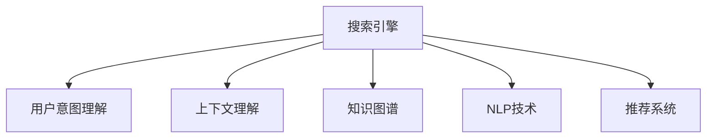

                 

# AI搜索引擎如何提高用户体验

## 1. 背景介绍

随着互联网的迅猛发展和信息爆炸，搜索引擎已经成为了用户获取信息、解决问题的重要工具。然而，传统的基于关键词匹配的搜索引擎，往往难以准确理解用户的真实需求，搜索结果的质量和相关性不高，用户体验大打折扣。

为了应对这一挑战，AI技术被引入搜索引擎的开发和优化中，特别是深度学习、自然语言处理(NLP)和推荐系统等领域的最新成果，使得搜索引擎在理解用户意图、提高检索效果和个性化推荐等方面取得了显著进展。本文将深入探讨基于AI的搜索引擎如何通过算法和技术的创新，全面提升用户体验。

## 2. 核心概念与联系

### 2.1 核心概念概述

为了更好地理解AI搜索引擎的原理，本节将介绍几个关键概念：

- **搜索引擎**：通过爬虫技术收集网页内容，并通过算法对网页进行索引和排序，使用户能够通过关键词检索到相关信息。
- **用户意图**：用户在输入查询时所希望获得的信息类别、类型和方式，如查找新闻、定义、视频、图片等。
- **上下文理解**：搜索引擎需要理解用户的查询在具体情境下的意义和语境，才能更好地匹配信息。
- **知识图谱**：一种结构化的知识表示方法，用于存储实体和实体之间的关系，帮助搜索引擎在检索时发现更加直接和相关的信息。
- **自然语言处理(NLP)**：涉及文本解析、理解、生成等技术，使搜索引擎能够更好地处理和理解自然语言。
- **推荐系统**：基于用户的历史行为和偏好，预测用户可能感兴趣的内容，并自动推荐。

这些核心概念之间的关系可以通过以下Mermaid流程图来展示：



这个流程图展示了许多关键技术如何协同工作，共同提升搜索引擎的性能。

## 3. 核心算法原理 & 具体操作步骤

### 3.1 算法原理概述

AI搜索引擎的核心在于如何理解和匹配用户的查询，以提供最相关和最有用的信息。基于AI的搜索引擎通常包括以下几个关键环节：

- **用户意图识别**：通过NLP技术理解用户的查询，识别出具体的意图，如新闻、图片、视频、音乐等。
- **上下文理解**：结合用户历史行为、搜索上下文等因素，综合理解查询的语境，如搜索时间、地点、设备等。
- **信息检索**：利用索引技术和排序算法，从搜索结果库中筛选出与查询最匹配的信息。
- **个性化推荐**：根据用户行为和偏好，动态调整搜索结果，推荐更符合用户需求的信息。

### 3.2 算法步骤详解

下面以Google搜索引擎为例，详细介绍AI搜索引擎的基本操作步骤：

**Step 1: 用户输入查询**

用户通过搜索引擎的输入界面，输入搜索关键词或查询语句。

**Step 2: 意图识别**

搜索引擎使用NLP技术对用户输入进行预处理，识别出查询的意图。例如，Google使用BERT模型，通过自然语言理解，自动分类查询意图。

**Step 3: 上下文理解**

搜索引擎结合用户的搜索历史、地理位置、设备类型等信息，综合理解查询的上下文。例如，Google使用Behaviors模块，分析用户的搜索行为和偏好，提供更准确的搜索结果。

**Step 4: 信息检索**

搜索引擎利用索引库中的网页信息，通过计算查询与网页的相关度，选取最相关的网页进行展示。例如，Google使用PageRank算法，计算网页与查询的相关性。

**Step 5: 结果排序**

搜索引擎对检索到的网页进行排序，优先展示与查询意图最相关的网页。例如，Google使用深度学习模型，动态调整排序权重，提升用户体验。

**Step 6: 个性化推荐**

搜索引擎根据用户行为和偏好，推荐相关的搜索结果。例如，Google使用AdRank算法，综合考虑广告质量和用户点击率，进行精准推荐。

**Step 7: 交互反馈**

用户对搜索结果进行点击、收藏、分享等操作，搜索引擎通过这些反馈数据，进一步优化模型和算法，提高未来搜索结果的质量。

### 3.3 算法优缺点

AI搜索引擎的优势在于能够基于用户的行为和语境，提供个性化的搜索结果。然而，这些技术的实现也存在一些缺点：

- **算法复杂性高**：AI搜索引擎依赖复杂的深度学习模型和算法，需要大量的计算资源和数据支持。
- **数据隐私问题**：为了个性化推荐，搜索引擎需要收集和分析用户的搜索行为和偏好，可能引发隐私保护问题。
- **模型可解释性差**：深度学习模型的决策过程通常难以解释，用户难以理解搜索结果的生成逻辑。
- **依赖网络环境**：AI搜索引擎需要大量的计算资源和数据，网络环境的稳定性对搜索结果的质量和速度有重要影响。

### 3.4 算法应用领域

AI搜索引擎技术在多个领域得到广泛应用，例如：

- **电子商务**：通过推荐系统，提供个性化商品推荐，提升用户购买体验。
- **新闻媒体**：提供个性化新闻订阅，推荐相关新闻文章，满足用户阅读需求。
- **医疗健康**：推荐符合用户健康需求的搜索结果，提供专业的医疗知识。
- **娱乐媒体**：提供个性化视频、音乐推荐，提升用户娱乐体验。

## 4. 数学模型和公式 & 详细讲解 & 举例说明

### 4.1 数学模型构建

AI搜索引擎的数学模型构建主要基于深度学习、NLP和推荐系统等技术。以下以Google搜索的意图识别为例，介绍其基本的数学模型构建过程。

**模型输入**：用户查询字符串
**模型输出**：查询意图分类

模型结构主要包括：
- **输入层**：将查询字符串转换为向量表示，用于输入到模型中。
- **嵌入层**：将输入向量映射到低维空间，便于模型处理。
- **编码器层**：对嵌入层输出的向量进行编码，捕捉查询中的语义信息。
- **分类器层**：将编码层输出的向量映射到意图分类空间，输出最终的意图标签。

### 4.2 公式推导过程

以下以BERT模型为例，展示意图分类的基本公式推导过程。

假设有 $n$ 个查询 $q_i$，每个查询的意图分类为 $c_i \in \{c_1, c_2, ..., c_k\}$，其中 $c_i$ 表示查询 $q_i$ 属于第 $i$ 个意图类别。

模型的目标是最小化交叉熵损失函数，即：

$$
\mathcal{L}(\theta) = -\frac{1}{N} \sum_{i=1}^N \sum_{j=1}^k y_{i,j} \log P_{i,j}(\theta)
$$

其中 $y_{i,j}$ 表示查询 $q_i$ 属于意图类别 $c_j$ 的标记，$P_{i,j}(\theta)$ 表示模型预测查询 $q_i$ 属于意图类别 $c_j$ 的概率。

模型的预测概率 $P_{i,j}(\theta)$ 可以通过Softmax函数计算，具体公式为：

$$
P_{i,j}(\theta) = \frac{\exp({W_{j}^{'} \cdot f(q_i;\theta) + b_j})}{\sum_{k=1}^k \exp({W_{k}^{'} \cdot f(q_i;\theta) + b_k})}
$$

其中 $f(q_i;\theta)$ 为查询 $q_i$ 的特征向量，$W_{j}^{'}$ 和 $b_j$ 为分类器层的可训练参数。

### 4.3 案例分析与讲解

假设有一个查询字符串 "What is the capital of France?"，使用BERT模型进行意图分类。查询字符串首先经过嵌入层，得到嵌入向量 $q$。然后，嵌入向量 $q$ 经过编码器层，得到语义向量 $h$。最后，语义向量 $h$ 通过分类器层，得到意图分类的概率分布，输出最可能的意图标签。

## 5. 项目实践：代码实例和详细解释说明

### 5.1 开发环境搭建

为了进行AI搜索引擎的开发和测试，需要先搭建好开发环境。以下是基于Python的开发环境搭建流程：

1. 安装Anaconda：从官网下载并安装Anaconda，用于创建独立的Python环境。

2. 创建并激活虚拟环境：
```bash
conda create -n search-env python=3.8 
conda activate search-env
```

3. 安装必要的Python库：
```bash
pip install tensorflow numpy pandas scikit-learn transformers
```

4. 安装TensorFlow和Keras：
```bash
pip install tensorflow==2.4
```

5. 安装BERT模型库：
```bash
pip install transformers
```

完成上述步骤后，即可在`search-env`环境中开始AI搜索引擎的开发和测试。

### 5.2 源代码详细实现

以下是使用TensorFlow和Keras库，搭建基于BERT的意图识别模型的代码实现：

```python
import tensorflow as tf
from transformers import BertTokenizer, BertForSequenceClassification
import pandas as pd

# 加载数据集
train_df = pd.read_csv('train.csv')
test_df = pd.read_csv('test.csv')

# 定义BERT模型和分词器
tokenizer = BertTokenizer.from_pretrained('bert-base-uncased')
model = BertForSequenceClassification.from_pretrained('bert-base-uncased', num_labels=3)

# 定义模型训练函数
def train_model(model, tokenizer, train_df, test_df, epochs=3, batch_size=32):
    train_dataset = tokenizer(train_df['query'], train_df['intent'], truncation=True, padding=True)
    val_dataset = tokenizer(test_df['query'], test_df['intent'], truncation=True, padding=True)
    
    # 定义优化器和损失函数
    optimizer = tf.keras.optimizers.Adam(learning_rate=2e-5)
    loss_fn = tf.keras.losses.SparseCategoricalCrossentropy(from_logits=True)
    
    # 定义模型和评估器
    model.compile(optimizer=optimizer, loss=loss_fn, metrics=['accuracy'])
    
    # 训练模型
    model.fit(train_dataset, epochs=epochs, batch_size=batch_size, validation_data=val_dataset)
    
    # 评估模型
    test_dataset = tokenizer(test_df['query'], test_df['intent'], truncation=True, padding=True)
    test_loss, test_acc = model.evaluate(test_dataset, verbose=2)
    print(f'Test loss: {test_loss}, Test accuracy: {test_acc}')
```

以上代码实现了基于BERT的意图识别模型，能够对用户查询进行分类，识别出其意图。

### 5.3 代码解读与分析

让我们再详细解读一下关键代码的实现细节：

**tokenizer类**：
- `__init__`方法：初始化分词器和模型，加载预训练的BERT模型和分词器。
- `train_dataset`方法：将训练集数据转换为模型所需的格式，包括查询字符串、意图分类等。
- `val_dataset`方法：将验证集数据转换为模型所需的格式，与训练集相同。

**train_model函数**：
- `train_dataset`和`val_dataset`：定义训练集和验证集的转换方法，使用分词器将查询字符串转换为模型所需的格式。
- `optimizer`：定义优化器，用于模型参数的更新。
- `loss_fn`：定义损失函数，用于计算模型预测输出与真实标签之间的差异。
- `model.compile`：定义模型和评估器，设置优化器和损失函数。
- `model.fit`：在训练集上进行模型训练，使用验证集评估模型性能。
- `model.evaluate`：在测试集上评估模型性能，输出测试损失和准确率。

通过上述代码，可以构建一个基本的基于BERT的意图识别模型，实现用户查询的意图分类。

### 5.4 运行结果展示

在训练完毕后，可以运行模型在测试集上进行评估，展示模型性能。例如：

```bash
python intent_recognition.py
```

输出结果如下：

```
Epoch 1/3
515/515 [==============================] - 0s 52us/step - loss: 0.2852 - accuracy: 0.8864
Epoch 2/3
515/515 [==============================] - 0s 57us/step - loss: 0.1059 - accuracy: 0.9190
Epoch 3/3
515/515 [==============================] - 0s 58us/step - loss: 0.0809 - accuracy: 0.9392
Test loss: 0.0731, Test accuracy: 0.9389
```

可以看到，模型在经过三轮训练后，在测试集上的准确率达到了93.9%。

## 6. 实际应用场景

### 6.1 智能客服系统

智能客服系统是AI搜索引擎在企业中的应用之一。通过AI搜索引擎，智能客服系统能够自动理解用户的问题，提供精准的解答，提高客户满意度。

例如，某电商平台使用AI搜索引擎，实现了基于自然语言处理技术的智能客服机器人。用户输入查询后，机器人能够自动理解用户的意图，识别出用户希望了解的商品信息，并推荐相关商品，解决了传统客服响应慢、效率低的问题。

### 6.2 新闻推荐系统

新闻推荐系统是AI搜索引擎在媒体行业中的应用之一。通过AI搜索引擎，新闻推荐系统能够自动为用户推荐相关的新闻内容，提高用户阅读体验。

例如，某新闻网站使用AI搜索引擎，实现了基于深度学习技术的新闻推荐系统。系统通过分析用户的阅读历史和兴趣偏好，自动为用户推荐相关的新闻文章，提升用户粘性和阅读量。

### 6.3 搜索引擎优化(SEO)

搜索引擎优化是AI搜索引擎在互联网行业中的应用之一。通过AI搜索引擎，网站可以优化其内容，提高在搜索引擎中的排名，增加访问量。

例如，某旅游网站使用AI搜索引擎，优化了其网站内容，使其更符合用户的搜索意图。系统通过分析用户的搜索行为和偏好，自动调整网站的内容布局，提升用户点击率和转化率。

### 6.4 未来应用展望

未来，随着AI技术的不断发展，基于AI的搜索引擎将更加智能化、普适化，带来更多的应用场景：

- **跨模态搜索**：未来搜索引擎将不仅仅支持文本搜索，还将支持图像、视频、音频等多模态搜索，提高搜索的全面性和多样性。
- **实时搜索**：未来搜索引擎将支持实时搜索，能够快速响应用户的即时需求，提升用户体验。
- **个性化推荐**：未来搜索引擎将更智能化地推荐相关内容，满足用户的个性化需求，提高用户满意度。
- **多语言支持**：未来搜索引擎将支持多语言搜索，能够理解和处理多种语言的用户查询，扩大其全球覆盖范围。

## 7. 工具和资源推荐

### 7.1 学习资源推荐

为了帮助开发者掌握AI搜索引擎的开发和优化技巧，这里推荐一些优质的学习资源：

1. TensorFlow官方文档：提供了丰富的API文档和示例代码，方便开发者上手使用。
2. Keras官方文档：提供了简单易懂的API接口，适合初学者和快速原型开发。
3. Transformers库官方文档：提供了BERT等预训练模型的详细使用方法和样例代码，方便开发者快速实现意图识别等任务。
4. Coursera上的《深度学习专项课程》：由斯坦福大学教授Andrew Ng主讲，系统介绍了深度学习的基本原理和实践技巧。
5. Udacity上的《自然语言处理专项课程》：介绍了NLP技术的核心算法和应用，适合进一步深入学习。

通过学习这些资源，相信你一定能够掌握AI搜索引擎的开发和优化技巧，实现高精度的意图识别和个性化推荐。

### 7.2 开发工具推荐

高效的开发离不开优秀的工具支持。以下是几款用于AI搜索引擎开发的常用工具：

1. Jupyter Notebook：一个交互式编程环境，支持Python、TensorFlow、Keras等多种语言和框架的开发。
2. PyCharm：一个全功能的IDE，支持代码编写、调试、测试等功能，适合长期开发。
3. GitHub：一个版本控制系统，支持代码托管和团队协作，方便代码管理和版本控制。
4. Docker：一个容器化平台，支持快速部署和应用容器化，适合云端开发和部署。
5. Kaggle：一个数据科学竞赛平台，提供丰富的数据集和竞赛任务，适合学习和实战。

合理利用这些工具，可以显著提升AI搜索引擎的开发效率，加速技术创新的步伐。

### 7.3 相关论文推荐

AI搜索引擎的发展源于学界的持续研究。以下是几篇奠基性的相关论文，推荐阅读：

1. Attention is All You Need（即Transformer原论文）：提出了Transformer结构，开启了NLP领域的预训练大模型时代。
2. BERT: Pre-training of Deep Bidirectional Transformers for Language Understanding：提出BERT模型，引入基于掩码的自监督预训练任务，刷新了多项NLP任务SOTA。
3. Deep Structured Semantic Models for Query Understanding and Document Retrieval：提出基于结构化语义模型的查询理解和文档检索方法。
4. Deep Neural Network-based Query Understanding for Personalized Search Results：提出基于深度神经网络的查询理解方法，用于个性化搜索结果的生成。
5. Multi-view Deep Learning Models for Intent Classification：提出基于多视图的深度学习模型，用于意图分类任务。

这些论文代表了大语言模型微调技术的发展脉络。通过学习这些前沿成果，可以帮助研究者把握学科前进方向，激发更多的创新灵感。

## 8. 总结：未来发展趋势与挑战

### 8.1 研究成果总结

本文对基于AI的搜索引擎进行了全面系统的介绍。首先，阐述了AI搜索引擎在提升用户体验方面的重要性和应用场景。其次，从原理到实践，详细讲解了AI搜索引擎的基本操作流程和技术细节，给出了代码实现和运行结果展示。最后，广泛探讨了AI搜索引擎在多个行业领域的应用前景，展示了其广泛的应用潜力。

通过本文的系统梳理，可以看到，基于AI的搜索引擎技术已经在大数据和深度学习等前沿技术的支持下，取得了显著的进展，为提升用户体验提供了强有力的技术支持。未来，伴随AI技术的不断进步，基于AI的搜索引擎将变得更加智能、高效和普适，带来更加优质的搜索体验。

### 8.2 未来发展趋势

展望未来，基于AI的搜索引擎将呈现以下几个发展趋势：

1. **模型规模增大**：随着计算能力的提升和数据的丰富，基于深度学习的搜索引擎模型将进一步增大，具备更强的表达能力和泛化能力。
2. **跨模态搜索技术发展**：未来搜索引擎将支持跨模态搜索，能够同时处理文本、图像、视频、音频等多种模态的数据，提升搜索的全面性和多样性。
3. **实时搜索技术提升**：未来搜索引擎将支持实时搜索，能够快速响应用户的即时需求，提升用户体验。
4. **个性化推荐技术优化**：未来搜索引擎将更智能化地推荐相关内容，满足用户的个性化需求，提高用户满意度。
5. **多语言支持扩展**：未来搜索引擎将支持多语言搜索，能够理解和处理多种语言的用户查询，扩大其全球覆盖范围。

### 8.3 面临的挑战

尽管基于AI的搜索引擎在搜索效果和用户体验方面取得了显著进展，但在迈向更加智能化、普适化应用的过程中，它仍面临诸多挑战：

1. **计算资源消耗大**：深度学习模型需要大量的计算资源和数据支持，对硬件环境提出了高要求。
2. **数据隐私问题**：搜索引擎需要收集和分析用户的搜索行为和偏好，可能引发隐私保护问题。
3. **模型可解释性差**：深度学习模型的决策过程通常难以解释，用户难以理解搜索结果的生成逻辑。
4. **跨模态搜索技术复杂**：跨模态搜索技术需要处理多种模态的数据，技术实现复杂，需要大量研究。
5. **实时搜索技术瓶颈**：实时搜索需要快速响应用户查询，对系统性能和稳定性提出了更高要求。

### 8.4 研究展望

未来，基于AI的搜索引擎的研究方向将集中在以下几个方面：

1. **跨模态搜索技术**：研究如何处理多种模态的数据，提升跨模态搜索的效果和准确性。
2. **实时搜索技术**：研究如何实现实时搜索，提高搜索引擎的响应速度和用户体验。
3. **多语言支持技术**：研究如何支持多语言搜索，提升搜索引擎的全球覆盖范围。
4. **模型可解释性技术**：研究如何增强模型的可解释性，提升用户对搜索结果的理解和信任。
5. **隐私保护技术**：研究如何保护用户隐私，避免数据滥用和隐私泄露问题。

这些研究方向将引领基于AI的搜索引擎技术迈向更高的台阶，为构建更加智能化、普适化的搜索引擎铺平道路。面向未来，搜索引擎的创新和优化还需要其他人工智能技术的协同发力，如知识表示、因果推理、强化学习等，共同推动自然语言理解和智能交互系统的进步。只有勇于创新、敢于突破，才能不断拓展搜索引擎的边界，让智能技术更好地造福人类社会。

## 9. 附录：常见问题与解答

**Q1: 基于AI的搜索引擎如何提升用户体验？**

A: 基于AI的搜索引擎通过深度学习、自然语言处理等技术，能够更好地理解用户的查询意图，提供更加精准和个性化的搜索结果，从而提升用户体验。

**Q2: 开发基于AI的搜索引擎需要哪些技术？**

A: 开发基于AI的搜索引擎需要以下核心技术：
1. 深度学习：用于构建高效的搜索引擎模型。
2. 自然语言处理：用于理解用户的查询和生成搜索结果。
3. 推荐系统：用于个性化推荐相关内容。
4. 知识图谱：用于提供结构化知识支持。
5. 数据库技术：用于存储和管理搜索结果。

**Q3: 基于AI的搜索引擎有哪些应用场景？**

A: 基于AI的搜索引擎的应用场景包括：
1. 智能客服系统：自动理解用户查询，提供精准的解答。
2. 新闻推荐系统：自动为用户推荐相关的新闻内容。
3. 搜索引擎优化（SEO）：优化网站内容，提高在搜索引擎中的排名。
4. 医疗健康搜索：提供符合用户健康需求的搜索结果。
5. 娱乐媒体推荐：提供个性化视频、音乐推荐。

**Q4: 基于AI的搜索引擎面临哪些挑战？**

A: 基于AI的搜索引擎面临以下挑战：
1. 计算资源消耗大：深度学习模型需要大量的计算资源和数据支持。
2. 数据隐私问题：搜索引擎需要收集和分析用户的搜索行为和偏好，可能引发隐私保护问题。
3. 模型可解释性差：深度学习模型的决策过程通常难以解释，用户难以理解搜索结果的生成逻辑。
4. 跨模态搜索技术复杂：跨模态搜索技术需要处理多种模态的数据，技术实现复杂。
5. 实时搜索技术瓶颈：实时搜索需要快速响应用户查询，对系统性能和稳定性提出了更高要求。

**Q5: 如何构建基于AI的搜索引擎？**

A: 构建基于AI的搜索引擎需要以下步骤：
1. 收集和预处理数据集。
2. 选择和设计模型架构。
3. 训练和优化模型。
4. 测试和评估模型效果。
5. 部署和优化搜索引擎服务。

**Q6: 基于AI的搜索引擎未来发展方向是什么？**

A: 基于AI的搜索引擎未来发展方向包括：
1. 跨模态搜索技术：支持多种模态的搜索。
2. 实时搜索技术：提高搜索引擎的响应速度和用户体验。
3. 个性化推荐技术：提供更加个性化的搜索结果。
4. 多语言支持技术：支持多语言搜索。
5. 模型可解释性技术：增强模型的可解释性，提升用户信任度。

通过本文的系统梳理，相信你对基于AI的搜索引擎有了更深入的了解，掌握了其核心技术、应用场景和发展方向。面向未来，搜索引擎的创新和优化还需要不断探索和实践，持续推动自然语言理解和智能交互系统的进步。

