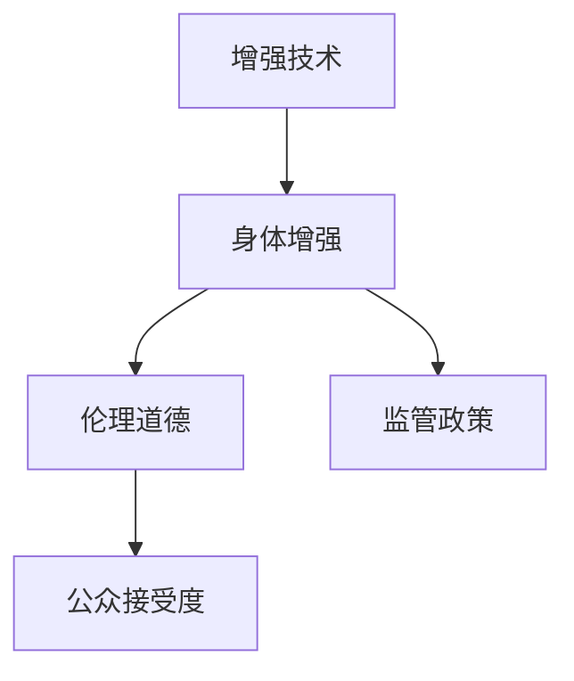
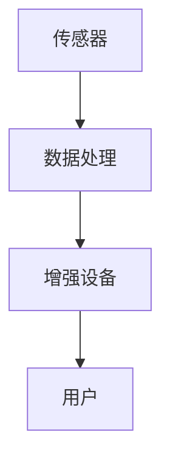

                 

# AI时代的人类增强：身体增强与道德考虑因素

## 1. 背景介绍

随着人工智能(AI)技术的发展，人类社会的生产生活方式正经历着前所未有的变革。AI不仅在自动化、智能化方面展现出强大的能力，还拓展了人类感知、认知和身体增强的新空间。身体增强(Body Enhancement)作为AI时代的重要应用领域，其背后的技术手段和伦理道德问题引起了广泛关注。

身体增强包括但不限于：增强物理能力(如机械外骨骼、假肢等)、增强感知能力(如视网膜植入、脑机接口等)、增强认知能力(如脑机接口、智能助听器等)。这些技术手段使得人类能够突破自然极限，实现超越自身物理和认知的提升。然而，伴随着这些技术的兴起，也产生了许多道德、伦理和安全问题。如何平衡技术发展与社会责任，成为当前亟需探讨的重要议题。

本文将系统阐述AI时代身体增强的概念、技术原理和当前面临的伦理道德挑战，探索其未来发展趋势和应对策略，以期为相关研究和应用提供借鉴。

## 2. 核心概念与联系

### 2.1 核心概念概述

为更好地理解AI时代身体增强的相关问题，本节将介绍几个核心概念：

- **身体增强(Body Enhancement)**：通过人工智能技术，增强人类身体和认知能力的实践。包括机械外骨骼、智能助听器、视网膜植入等，旨在提升人类的物理能力和感知能力。

- **增强技术(Enhancement Technologies)**：实现身体增强的各类技术手段，如机械外骨骼、脑机接口、基因编辑等。

- **伦理道德(Ethics and Morals)**：在身体增强应用中，涉及到的道德、伦理问题，如隐私保护、公平性、安全性等。

- **监管政策(Regulatory Policies)**：各国政府对身体增强技术的法律法规，如数据隐私、产品安全、医疗伦理等。

- **公众接受度(Public Perception)**：社会大众对身体增强技术的接受度和态度，影响技术推广和普及。

这些核心概念之间的关系，可以通过以下Mermaid流程图来展示：



这个流程图展示了增强技术作为实现身体增强的手段，而身体增强则涉及到伦理道德和监管政策等多个方面，同时公众接受度也会影响技术的推广和应用。

### 2.2 核心概念原理和架构的 Mermaid 流程图

以下为一个简化的身体增强技术架构图，展示身体增强系统的组成部分：



这个流程图展示了身体增强系统的主要架构，其中传感器收集用户数据，数据处理模块对数据进行处理，增强设备根据数据输出增强效果，最终用户获得增强后的感知和能力提升。

## 3. 核心算法原理 & 具体操作步骤

### 3.1 算法原理概述

身体增强的算法原理涉及多个学科，包括生物医学、机械工程、计算机科学等。本节将简要介绍其中几种主要的算法原理：

- **机械外骨骼**：通过机械装置辅助人类移动，通常包括传感器、机械臂、动力源等。
- **脑机接口(BMI)**：通过脑电信号或神经信号，与外部设备进行信息交互。
- **基因编辑**：通过CRISPR等技术，修改DNA序列，实现特定基因的增强。
- **智能助听器**：通过人工智能算法，实时处理和增强音频信号，提供更好的听力体验。

这些算法原理各有侧重，但均基于对人类感知、认知和物理能力的理解，通过技术手段实现相应的增强效果。

### 3.2 算法步骤详解

以下以脑机接口(BMI)为例，详细讲解其算法步骤：

1. **数据采集**：使用脑电信号采集设备(如EEG)，收集用户的大脑活动信号。
2. **信号预处理**：对采集到的脑电信号进行滤波、降噪等预处理，以减少噪声干扰。
3. **特征提取**：使用算法(如时间序列分析、频谱分析等)，从预处理后的信号中提取有用的特征。
4. **信号解码**：通过机器学习算法(如深度神经网络、支持向量机等)，将提取的特征解码为用户意图或控制命令。
5. **设备控制**：根据解码结果，控制外部设备(如机械臂、虚拟现实设备等)，实现增强效果。

这一过程需要大量的数据和复杂的算法，以实现高效的信号解码和设备控制。

### 3.3 算法优缺点

脑机接口(BMI)等身体增强算法具有以下优点：

- **提高生活质量**：帮助残障人士恢复运动能力，提升生活质量。
- **提升认知能力**：通过增强设备，提升用户的认知能力，如记忆、注意力等。
- **创新应用**：拓展了人机交互的新领域，为虚拟现实、游戏、娱乐等行业带来新的可能性。

同时，这些算法也存在一些缺点：

- **技术复杂度高**：算法实现复杂，需要多学科协同攻关。
- **成本高昂**：设备和算法研发成本高，难以大规模普及。
- **伦理风险**：涉及个人隐私和数据安全，可能引发伦理争议。

### 3.4 算法应用领域

身体增强技术在多个领域都有广泛的应用：

- **医疗健康**：如机械外骨骼辅助康复、假肢、基因治疗等。
- **娱乐游戏**：如虚拟现实头显、增强现实设备、智能助听器等。
- **军事应用**：如增强士兵的物理和感知能力，提升战场生存率。
- **商业应用**：如增强办公设备、智能助手等，提升工作效率。

这些应用展示了身体增强技术的广阔前景，但也伴随着复杂的伦理道德和监管挑战。

## 4. 数学模型和公式 & 详细讲解 & 举例说明

### 4.1 数学模型构建

脑机接口(BMI)的信号解码过程可以通过以下数学模型来描述：

- **输入**：脑电信号 $X = \{x_1, x_2, ..., x_n\}$。
- **特征提取**：将脑电信号 $X$ 转化为特征 $Y = \{y_1, y_2, ..., y_m\}$。
- **解码**：使用解码器 $D$ 将特征 $Y$ 转化为控制信号 $U = \{u_1, u_2, ..., u_p\}$。
- **输出**：控制信号 $U$ 控制外部设备，实现增强效果。

脑电信号和控制信号的解码过程可以表示为：

$$
U = D(Y) = \arg\min_{U} \|U - D(Y)\|^2
$$

其中，$\|U - D(Y)\|^2$ 表示解码误差，通常采用均方误差(MSE)作为优化目标。

### 4.2 公式推导过程

以深度神经网络为例，脑电信号的解码过程可以表示为：

$$
U = D(Y) = \hat{U} = f(WY + b)
$$

其中，$f$ 为激活函数，$W$ 为权重矩阵，$b$ 为偏置向量。解码误差可以表示为：

$$
\|U - \hat{U}\|^2 = \|U - f(WY + b)\|^2
$$

为了最小化解码误差，可以通过反向传播算法计算权重和偏置的梯度，使用优化算法(如Adam、SGD等)更新模型参数，迭代求解最优解。

### 4.3 案例分析与讲解

以增强助听器为例，其算法可以描述为：

1. **输入**：语音信号 $V = \{v_1, v_2, ..., v_n\}$。
2. **特征提取**：将语音信号 $V$ 转化为特征 $Z = \{z_1, z_2, ..., z_m\}$。
3. **增强**：使用增强算法 $E$ 对特征 $Z$ 进行处理，生成增强后的语音信号 $W = \{w_1, w_2, ..., w_p\}$。
4. **输出**：增强后的语音信号 $W$ 作为助听器输出的音频。

语音信号增强的数学模型可以表示为：

$$
W = E(Z) = \arg\min_{W} \|W - E(Z)\|^2
$$

其中，$\|W - E(Z)\|^2$ 表示增强误差，通常采用均方误差(MSE)作为优化目标。

## 5. 项目实践：代码实例和详细解释说明

### 5.1 开发环境搭建

在进行身体增强算法开发前，需要先准备好开发环境。以下是使用Python进行深度学习开发的常见环境配置流程：

1. 安装Anaconda：从官网下载并安装Anaconda，用于创建独立的Python环境。

2. 创建并激活虚拟环境：
```bash
conda create -n pytorch-env python=3.8 
conda activate pytorch-env
```

3. 安装PyTorch：根据CUDA版本，从官网获取对应的安装命令。例如：
```bash
conda install pytorch torchvision torchaudio cudatoolkit=11.1 -c pytorch -c conda-forge
```

4. 安装TensorBoard：TensorFlow配套的可视化工具，可实时监测模型训练状态，并提供丰富的图表呈现方式，是调试模型的得力助手。

5. 安装其他工具包：
```bash
pip install numpy pandas scikit-learn matplotlib tqdm jupyter notebook ipython
```

完成上述步骤后，即可在`pytorch-env`环境中开始算法开发。

### 5.2 源代码详细实现

这里我们以脑电信号解码为例，使用PyTorch实现深度神经网络解码器。

首先，定义脑电信号解码的深度神经网络模型：

```python
import torch.nn as nn
import torch.nn.functional as F

class DecodingModel(nn.Module):
    def __init__(self, input_size, hidden_size, output_size):
        super(DecodingModel, self).__init__()
        self.fc1 = nn.Linear(input_size, hidden_size)
        self.fc2 = nn.Linear(hidden_size, output_size)
        self.fc2.bias = None
        
    def forward(self, x):
        x = F.relu(self.fc1(x))
        x = self.fc2(x)
        return x
```

接着，定义脑电信号解码的损失函数：

```python
criterion = nn.MSELoss()
```

然后，定义脑电信号解码的训练函数：

```python
def train_model(model, optimizer, criterion, input_data, target_data, epoch_num):
    model.train()
    for epoch in range(epoch_num):
        optimizer.zero_grad()
        outputs = model(input_data)
        loss = criterion(outputs, target_data)
        loss.backward()
        optimizer.step()
        print(f'Epoch: {epoch+1}, Loss: {loss.item()}')
```

最后，启动训练流程：

```python
input_data = torch.randn(1, 1, 1000)
target_data = torch.randn(1, 1, 100)
model = DecodingModel(input_size=1000, hidden_size=100, output_size=100)
optimizer = torch.optim.Adam(model.parameters(), lr=0.01)
train_model(model, optimizer, criterion, input_data, target_data, 100)
```

以上就是使用PyTorch实现脑电信号解码的完整代码实现。可以看到，深度学习算法通过简单的代码实现，就能高效地解决复杂的信号解码问题。

### 5.3 代码解读与分析

让我们再详细解读一下关键代码的实现细节：

**DecodingModel类**：
- `__init__`方法：初始化模型参数，包括输入层、隐藏层和输出层的线性变换。
- `forward`方法：前向传播计算输出结果。

**train_model函数**：
- 设置模型为训练模式。
- 对数据进行前向传播计算输出。
- 计算损失函数。
- 反向传播计算梯度。
- 使用优化算法更新模型参数。
- 打印训练损失。

这个函数展示了如何使用PyTorch进行神经网络的训练，每轮迭代计算损失，更新模型参数，最终输出训练误差。

## 6. 实际应用场景

### 6.1 医疗健康

在医疗健康领域，身体增强技术的应用前景广阔。机械外骨骼和假肢能够帮助残障人士恢复运动能力，提升生活质量。脑机接口(BMI)能够帮助重症患者恢复部分运动和感觉功能，改善患者体验。

### 6.2 娱乐游戏

增强现实(AR)和虚拟现实(VR)设备，通过脑机接口和智能助听器等技术，增强用户的感官体验，使得游戏和娱乐更加沉浸。例如，玩家可以通过脑电信号控制游戏角色，实现更加自然的交互。

### 6.3 军事应用

在军事领域，增强士兵的物理和感知能力，提升战场生存率。增强助听器能够帮助士兵更好地捕捉环境信息，提高作战效率。

### 6.4 商业应用

在商业领域，身体增强技术能够提升员工的工作效率，如增强办公设备、智能助手等，提供更加智能化的工作环境。

## 7. 工具和资源推荐

### 7.1 学习资源推荐

为了帮助开发者系统掌握身体增强的相关知识，这里推荐一些优质的学习资源：

1. **Deep Learning**：Ian Goodfellow等人的经典教材，涵盖深度学习的基本概念和算法原理。

2. **Brain Computer Interfaces**：A. Pfurtscheller等人的书籍，详细介绍脑机接口的原理和实现。

3. **Human Augmentation**：D.B. Wolpert等人的综述文章，全面介绍身体增强技术的各个方面。

4. **Deep Brain Stimulation**：M.R. Hänggi等人的文章，探讨深度脑刺激在神经调控中的应用。

5. **Ethics in Robotics**：B.S. Kahn的书籍，讨论机器人技术中的伦理道德问题。

通过对这些资源的学习实践，相信你一定能够掌握身体增强技术的精髓，并用于解决实际的伦理道德挑战。

### 7.2 开发工具推荐

高效的开发离不开优秀的工具支持。以下是几款用于身体增强开发的常用工具：

1. **PyTorch**：基于Python的开源深度学习框架，灵活动态的计算图，适合快速迭代研究。

2. **TensorFlow**：由Google主导开发的开源深度学习框架，生产部署方便，适合大规模工程应用。

3. **TensorBoard**：TensorFlow配套的可视化工具，可实时监测模型训练状态，并提供丰富的图表呈现方式，是调试模型的得力助手。

4. **OpenVINO**：英特尔推出的深度学习推理平台，支持多种硬件加速，提高模型推理速度。

5. **MATLAB**：数学软件，支持大规模矩阵运算，适合信号处理和控制系统设计。

合理利用这些工具，可以显著提升身体增强算法的开发效率，加快创新迭代的步伐。

### 7.3 相关论文推荐

身体增强技术的研究始于学界的持续探索。以下是几篇奠基性的相关论文，推荐阅读：

1. **Ethics and Privacy in the Neurotechnological Era**：A. Pfurtscheller等人的文章，讨论神经技术在医学和娱乐中的应用伦理。

2. **Human-Augmented Cognition**：D.B. Wolpert等人的综述文章，总结了增强技术的各类应用。

3. **Human Augmentation in Space**：J. Spolek等人的文章，探讨太空探索中的人体增强。

4. **Superintelligence: Paths, Dangers, Strategies**：N. Bostrom等人的书籍，探讨人工智能发展的潜在风险和伦理问题。

5. **Enhancing Human Capabilities with AI**：M.R. Hänggi等人的文章，分析了AI在人类能力增强中的应用。

这些论文代表了大身体增强技术的研究方向，通过学习这些前沿成果，可以帮助研究者把握学科前进方向，激发更多的创新灵感。

## 8. 总结：未来发展趋势与挑战

### 8.1 研究成果总结

本文对AI时代身体增强的概念、技术原理和伦理道德问题进行了全面系统的介绍。首先阐述了身体增强技术的背景和发展趋势，明确了其在医疗、娱乐、军事和商业等领域的应用潜力。其次，从原理到实践，详细讲解了脑机接口等关键技术，展示了其算法步骤和模型构建。同时，本文还广泛探讨了当前面临的伦理道德挑战，指出技术发展与社会责任之间的矛盾。最后，本文对未来的发展趋势和应对策略进行了探讨，展望了技术的未来前景。

通过本文的系统梳理，可以看到，AI时代身体增强技术正处于快速发展之中，其在提升人类感知、认知和物理能力方面的潜力巨大。然而，伴随技术的进步，也带来了诸多伦理道德和社会问题，需要在技术应用和伦理监管之间找到平衡点。相信通过学界和产业界的共同努力，这些挑战终将一一被克服，身体增强技术必将在构建人机协同的智能时代中扮演越来越重要的角色。

### 8.2 未来发展趋势

展望未来，身体增强技术将呈现以下几个发展趋势：

1. **技术迭代加速**：随着深度学习算法和硬件设备的不断进步，身体增强技术的迭代速度将显著提升，新应用和新场景将不断涌现。
2. **跨领域融合**：身体增强技术将与其他前沿技术如AI、生物工程、量子计算等进行深度融合，拓展其应用范围和功能。
3. **标准化普及**：随着技术标准的逐步制定和推广，身体增强技术将逐步普及，成为日常生活的常见工具。
4. **伦理道德规范**：社会将逐步建立完善的伦理道德规范，确保技术应用的安全性和公平性。

以上趋势凸显了身体增强技术的广阔前景，相信未来将有更多的创新突破，推动技术的普及和应用。

### 8.3 面临的挑战

尽管身体增强技术正处于快速发展之中，但在迈向更加智能化、普适化应用的过程中，仍面临诸多挑战：

1. **技术复杂度高**：身体增强技术涉及多学科知识的综合应用，技术实现难度大。
2. **伦理道德问题**：如何平衡技术进步和伦理道德，保护用户隐私和数据安全，仍需深入探讨。
3. **监管政策缺失**：各国对新技术的监管政策尚未完全明确，可能影响技术的推广和应用。
4. **公众接受度低**：社会对新技术的接受度不高，可能影响技术的普及和应用效果。
5. **安全性问题**：增强设备的安全性和可靠性，如何避免技术滥用和安全隐患，仍需深入研究。

这些挑战需要学界和产业界的共同努力，才能推动身体增强技术的健康发展。

### 8.4 研究展望

未来，身体增强技术的研究将需要进一步解决以下问题：

1. **伦理道德框架**：建立统一的伦理道德框架，指导身体增强技术的研发和应用，保护用户权益。
2. **技术安全性**：提升增强设备的安全性和可靠性，减少技术滥用和安全事故的发生。
3. **跨学科协作**：加强跨学科合作，整合各类技术手段，提升身体增强技术的综合能力。
4. **公众接受度提升**：加强科普教育，提升公众对新技术的理解和接受度，推动技术的普及。
5. **标准化制定**：制定技术标准，确保身体增强技术的安全性和一致性，促进技术应用的规范化。

这些研究方向将推动身体增强技术的健康发展，为构建人机协同的智能时代贡献力量。

## 9. 附录：常见问题与解答

**Q1：身体增强技术是否会威胁人类的自然发展？**

A: 身体增强技术确实对人类自然发展带来了挑战。虽然技术能够提升人类的某些能力，但也可能导致人类依赖技术，逐渐失去自然能力。因此，如何在提升能力的同时保持自然发展，是一个值得深思的问题。

**Q2：身体增强技术是否会导致新的社会不平等？**

A: 身体增强技术的普及可能会加剧社会不平等。由于技术的获取和使用门槛较高，可能加剧贫富差距，导致社会分化。因此，需要政策制定者和社会团体共同努力，确保技术的公平获取和广泛应用。

**Q3：身体增强技术是否会引发新的伦理问题？**

A: 身体增强技术涉及诸多伦理问题，如隐私保护、数据安全、技术滥用等。如何在技术应用过程中保护用户权益，确保技术的安全性和公正性，是未来研究的重要方向。

**Q4：身体增强技术是否会引发新的医疗风险？**

A: 身体增强技术在医疗应用中具有潜在风险。增强设备可能会引发新的健康问题，如神经损伤、设备故障等。因此，需要深入研究技术的长期影响，确保其安全性和可靠性。

**Q5：身体增强技术是否会引发新的道德问题？**

A: 身体增强技术涉及诸多道德问题，如人类身份认同、自由意志等。如何确保技术应用过程中，不违背人类的基本价值观和道德准则，是未来研究的重要方向。

这些伦理道德问题需要多方协同解决，确保技术应用的安全性和公平性，推动身体增强技术的健康发展。

---

作者：禅与计算机程序设计艺术 / Zen and the Art of Computer Programming

