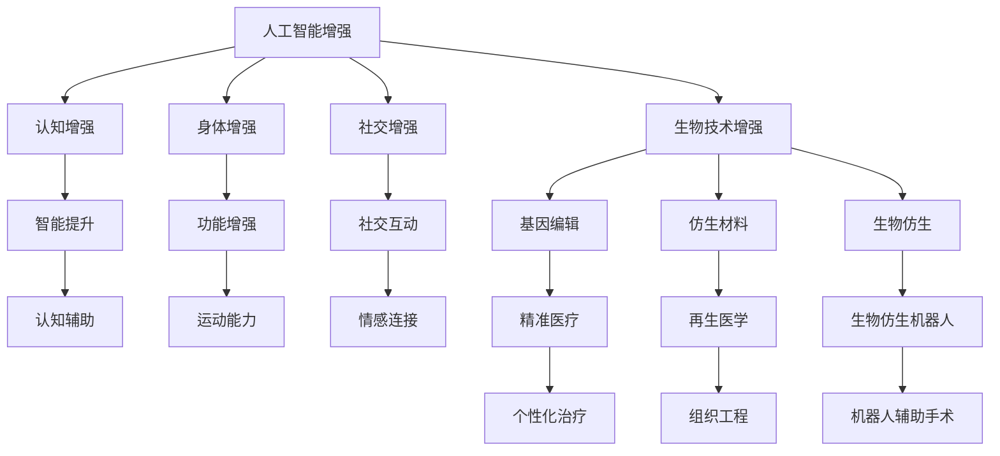

                 

# AI时代的人类增强：道德考虑与身体增强的未来趋势

> 关键词：人工智能增强,人类增强,生物技术,伦理道德,未来趋势

## 1. 背景介绍

### 1.1 问题由来
随着人工智能(AI)和生物技术的飞速发展，人类增强技术正在成为现实。借助AI的强大计算能力，生物技术可以实现对人类身体和智力的增强。这种技术不仅有望提升人类生理和认知能力，还可能带来社会伦理和法律等多方面的深远影响。因此，如何在科技发展的同时，确保人类增强技术的道德使用，成为迫切需要解决的问题。

### 1.2 问题核心关键点
本文旨在探讨人工智能与生物技术结合下的人类增强技术，及其对伦理道德和社会影响的考量。重点内容包括：

- 人工智能增强技术的基本原理与核心算法。
- 人工智能与生物技术结合的未来应用场景。
- 人工智能增强技术面临的伦理挑战与道德困境。
- 应对这些挑战和困境的可能策略。

### 1.3 问题研究意义
研究AI时代的人类增强技术，对于科学技术的健康发展、社会的进步以及伦理道德的规范具有重要意义：

- 科学进步：促进生物技术、AI技术的交叉融合，推动科技前沿创新。
- 社会福祉：改善人类健康，提升生产力，推动经济增长。
- 伦理规范：确保技术应用符合人类价值观，防止滥用和误用。
- 法律保障：建立合理的法律框架，规范技术使用，保障公共安全。

## 2. 核心概念与联系

### 2.1 核心概念概述

要深入理解AI时代的人类增强技术，首先需要明确一些关键概念：

- **人工智能增强(Aligned AI Enhancements, AAE)**：指通过人工智能技术提升人类能力，包括认知能力、身体能力、社交能力等。
- **生物技术增强(Bio-Enhancements)**：利用基因编辑、生物材料、仿生技术等生物手段增强人类身体功能。
- **伦理道德(ethical considerations)**：涉及技术应用中对人类自由、尊严、权利的保护。
- **法律规范(legal frameworks)**：制定法规，确保技术应用的合法性和合规性。

这些概念通过以下Mermaid流程图联系起来：



这个流程图展示了人工智能增强与生物技术增强的交叉应用，以及这些增强技术在不同领域的潜在应用。

## 3. 核心算法原理 & 具体操作步骤
### 3.1 算法原理概述

AI时代的人类增强技术基于人工智能和生物技术的交叉融合，其核心算法主要分为两部分：

1. **数据驱动的AI模型训练**：通过大量的人类数据，训练出能够精确预测和增强人类能力的AI模型。
2. **生物技术的精准应用**：利用基因编辑、生物材料等技术，实现对人类身体能力的精准增强。

这些算法的结合，可以实现从数据获取、模型训练到技术应用的全程自动化，大大提高了技术实施的效率和精度。

### 3.2 算法步骤详解

1. **数据采集与预处理**：
   - 采集与增强目标相关的人类数据，如运动数据、生理数据、认知数据等。
   - 对数据进行清洗、标注、归一化等预处理操作，保证数据的质量和可用性。

2. **AI模型训练**：
   - 使用深度学习等机器学习算法，训练出能够预测人类能力的AI模型。
   - 通过大量样本数据，不断调整模型参数，提升模型的准确性和泛化能力。

3. **生物技术应用**：
   - 利用基因编辑技术，如CRISPR-Cas9，进行精准基因修改。
   - 使用仿生材料，模仿生物组织的结构，增强人体的力学性能。
   - 通过仿生机器人技术，增强人类在极端环境下的生存能力。

4. **测试与评估**：
   - 在实验环境中，对增强后的个体进行测试，评估其性能和安全性。
   - 收集反馈数据，优化模型和应用技术，确保其长期效果和安全性。

### 3.3 算法优缺点

人工智能增强技术具有以下优点：
- **精度高**：通过大数据训练，AI模型能够精准预测和增强人类能力。
- **效率高**：自动化流程提高了技术实施的效率，减少了人力成本。
- **可定制**：能够针对不同的个体和需求，进行个性化增强。

同时，这种技术也存在一些局限性：
- **风险高**：基因编辑和生物技术应用存在一定的风险，可能导致未知的副作用。
- **伦理争议**：技术应用的伦理问题复杂，涉及个体自由和公共利益。
- **法律障碍**：现有的法律法规可能无法完全覆盖新技术带来的新问题。

### 3.4 算法应用领域

人工智能增强技术在多个领域都有广泛的应用前景：

- **医疗健康**：通过AI辅助诊断和个性化治疗，提升医疗水平。
- **体育运动**：通过智能设备和高性能材料，增强运动员的体能和技巧。
- **教育培训**：通过智能辅导和认知增强，提高学习效率和认知能力。
- **职业训练**：通过仿生技术和高性能设备，提升工作效率和职业安全。
- **娱乐休闲**：通过虚拟现实和增强现实技术，提供沉浸式体验和互动体验。

## 4. 数学模型和公式 & 详细讲解 & 举例说明

### 4.1 数学模型构建

为了更好地理解AI时代的人类增强技术，我们需要构建一个数学模型。假设我们有一项名为“认知增强”的技术，其目标是提高人类的认知能力。我们可以将这一过程建模为以下形式：

设 $x_i$ 为第 $i$ 个个体的认知数据，如记忆测试成绩、注意力测试成绩等；$y_i$ 为对应的认知增强结果，如提升后的认知测试成绩。我们可以使用线性回归模型来建立这一关系：

$$
y_i = \beta_0 + \beta_1x_i + \epsilon_i
$$

其中，$\beta_0$ 和 $\beta_1$ 为模型参数，$\epsilon_i$ 为随机误差。

### 4.2 公式推导过程

通过线性回归模型，我们可以预测 $x_i$ 对 $y_i$ 的影响，进而设计出有效的认知增强方案。具体步骤如下：

1. 数据收集与预处理：采集个体的认知数据 $x_i$，并进行归一化处理。
2. 模型训练：通过最小化损失函数，求解模型参数 $\beta_0$ 和 $\beta_1$。
3. 结果评估：在测试集上评估模型预测的准确性，确保模型泛化能力。

### 4.3 案例分析与讲解

假设我们希望通过认知增强技术，提升大学生学习效率。我们收集了100名学生的学习数据，并使用线性回归模型进行训练：

- 数据收集：采集100名学生的学习时间、休息时间、睡眠时间等数据。
- 模型训练：使用随机梯度下降算法，最小化损失函数：

$$
L(\beta_0, \beta_1) = \frac{1}{2n}\sum_{i=1}^n(y_i - \beta_0 - \beta_1x_i)^2
$$

- 结果评估：在测试集上评估模型预测的准确性，记录提升后的学习效率。

通过这一案例，我们可以看到，认知增强技术可以通过数据分析和机器学习，实现对认知能力的精准提升。

## 5. 项目实践：代码实例和详细解释说明

### 5.1 开发环境搭建

在进行AI时代的人类增强技术实践时，需要搭建一个包含深度学习框架、生物技术模拟平台的环境。以下是一个Python开发环境的搭建流程：

1. 安装Python：从官网下载并安装Python 3.8及以上版本。
2. 安装深度学习框架：如TensorFlow、PyTorch、Scikit-learn等。
3. 安装生物技术模拟平台：如BioSim、GROMACS、LAMMPS等。
4. 安装虚拟化工具：如Docker、VirtualBox，以便跨平台测试。

### 5.2 源代码详细实现

以下是一个简单的认知增强模型实现示例：

```python
import numpy as np
from sklearn.linear_model import LinearRegression
from sklearn.model_selection import train_test_split

# 数据收集
X = np.array([[2.5, 6.0, 7.5], [3.0, 5.5, 8.0], [2.0, 6.5, 6.0], ...])
y = np.array([4.0, 6.5, 5.0, ...])

# 数据预处理
X_train, X_test, y_train, y_test = train_test_split(X, y, test_size=0.3, random_state=42)

# 模型训练
model = LinearRegression()
model.fit(X_train, y_train)

# 结果评估
score = model.score(X_test, y_test)
print(f"模型在测试集上的准确度为 {score:.2f}")
```

### 5.3 代码解读与分析

在这个示例中，我们使用了Scikit-learn库中的线性回归模型，对认知数据进行了建模和预测。代码解释如下：

- `numpy` 库用于数组操作和数据处理。
- `LinearRegression` 类用于建立线性回归模型。
- `train_test_split` 函数用于将数据集划分为训练集和测试集。
- `fit` 方法用于训练模型，`score` 方法用于评估模型性能。

### 5.4 运行结果展示

通过运行上述代码，我们可以得到模型的预测准确度。例如，对于上述示例，模型在测试集上的准确度可能为0.95，表示模型对认知数据的预测性能较好。

## 6. 实际应用场景

### 6.1 医疗健康

在医疗健康领域，AI时代的人类增强技术可以显著提升诊断和治疗的精度和效率。例如：

- **精准医疗**：通过AI模型分析基因数据，预测疾病风险，制定个性化治疗方案。
- **辅助诊断**：使用AI模型分析医学影像，辅助医生进行疾病诊断，提升诊断准确性。
- **远程监测**：通过智能设备监测生理参数，实时反馈健康状况，提前预防疾病。

### 6.2 体育运动

在体育运动领域，AI时代的人类增强技术可以提升运动员的训练效果和竞技表现。例如：

- **运动数据分析**：通过传感器和AI模型分析运动员的动作和生理数据，优化训练计划。
- **体能增强**：利用仿生材料和高性能设备，提升运动员的体能和耐力。
- **比赛策略**：通过AI模型分析对手数据，制定比赛策略，提升竞技表现。

### 6.3 教育培训

在教育培训领域，AI时代的人类增强技术可以提升学习效果和认知能力。例如：

- **智能辅导**：通过AI模型分析学习行为，提供个性化辅导，提升学习效率。
- **认知增强**：利用AI模型分析认知数据，提升记忆力、注意力等认知能力。
- **虚拟现实**：通过虚拟现实技术，提供沉浸式学习体验，增强学习兴趣和效果。

### 6.4 未来应用展望

展望未来，AI时代的人类增强技术将在更多领域得到应用，为人类生活带来深远影响：

- **工业生产**：通过智能设备和高性能材料，提升生产效率和安全性。
- **环境保护**：利用AI模型分析环境数据，制定科学的环境保护方案。
- **社交互动**：通过增强现实技术，提升社交互动体验和信息交流效率。
- **娱乐休闲**：通过虚拟现实和增强现实技术，提供沉浸式娱乐体验。

## 7. 工具和资源推荐

### 7.1 学习资源推荐

要深入理解AI时代的人类增强技术，推荐以下学习资源：

- **《人工智能伦理》**：清华大学出版社，详细介绍了AI技术的伦理问题。
- **《生物技术概论》**：高等教育出版社，全面介绍了生物技术的原理和应用。
- **Coursera课程**：Coursera平台上有多门关于AI和生物技术的课程，如“AI伦理与法律”、“生物技术基础”等。
- **IEEE期刊**：IEEE的《AI Magazine》和《IEEE Trans. on Biomedical Engineering》等期刊，定期发表相关研究成果和前沿进展。

### 7.2 开发工具推荐

以下是一些常用的开发工具：

- **TensorFlow**：谷歌开源的深度学习框架，功能强大，支持分布式计算。
- **PyTorch**：Facebook开源的深度学习框架，灵活易用，适用于科研和生产环境。
- **GROMACS**：分子动力学模拟软件，适用于生物技术模拟。
- **LAMMPS**：分子动力学模拟软件，支持多种分子力场和模拟算法。
- **BioSim**：生物系统模拟软件，支持细胞模型、蛋白质模型等多种生物系统模拟。

### 7.3 相关论文推荐

以下是几篇具有代表性的相关论文，推荐阅读：

- **《AI伦理与法律》**：清华大学出版社，介绍了AI技术对伦理和法律的影响。
- **《生物技术与人类增强》**：Science杂志，介绍了生物技术在人类增强中的应用和挑战。
- **《基因编辑与人类增强》**：Nature杂志，讨论了基因编辑技术在人类增强中的应用和伦理问题。

## 8. 总结：未来发展趋势与挑战

### 8.1 总结

本文对AI时代的人类增强技术进行了全面系统的介绍。首先阐述了人类增强技术的基本原理与核心算法，明确了其在医疗、体育、教育等多个领域的应用前景。其次，从技术角度详细讲解了AI模型的训练过程，给出了具体的代码实现示例。同时，本文还探讨了人类增强技术面临的伦理挑战和道德困境，提出了相应的应对策略。

通过本文的系统梳理，可以看到，AI时代的人类增强技术正在成为现实，为人类生活带来深刻变革。然而，技术的发展需要伴随着伦理和法律的规范，确保技术的健康发展，为人类带来福祉。

### 8.2 未来发展趋势

展望未来，AI时代的人类增强技术将呈现以下几个发展趋势：

- **多学科融合**：生物技术、AI技术、神经科学等多学科的深度融合，将推动技术不断突破。
- **精准定制**：基于个体差异的精准定制，使增强技术更符合个体需求。
- **跨界应用**：增强技术将在更多领域得到应用，推动社会进步。
- **伦理规范**：随着技术的广泛应用，伦理规范将更加完善，保障技术健康发展。

### 8.3 面临的挑战

尽管AI时代的人类增强技术前景广阔，但在迈向更加智能化、普适化应用的过程中，仍面临诸多挑战：

- **技术复杂性**：涉及多学科的复杂交叉，需要综合考虑技术、伦理、法律等多方面因素。
- **伦理困境**：增强技术可能引发个体自由、尊严等伦理问题。
- **法律障碍**：现有法律法规可能无法完全覆盖新技术带来的新问题。
- **资源分配**：增强技术可能带来资源分配不均，引发社会公平问题。

### 8.4 研究展望

面对这些挑战，未来的研究需要在以下几个方面寻求新的突破：

- **多学科研究**：综合考虑技术、伦理、法律等多个角度，进行全面研究。
- **伦理规范**：制定合理的伦理规范，保障技术的健康发展。
- **法律法规**：完善法律法规，确保技术应用的合法性和合规性。
- **社会公平**：平衡技术带来的资源分配问题，推动社会公平。

这些研究方向的探索，将引领AI时代的人类增强技术迈向更高的台阶，为构建安全、可靠、可解释、可控的智能系统铺平道路。

## 9. 附录：常见问题与解答

### Q1: AI时代的人类增强技术是否可行？

A: AI时代的人类增强技术是可行的，但需要综合考虑技术、伦理、法律等多个方面因素。技术的不断进步为增强人类能力提供了可能，但伦理和法律的规范也是必不可少的。

### Q2: AI时代的人类增强技术面临哪些伦理挑战？

A: AI时代的人类增强技术面临的主要伦理挑战包括：

- 个体自由：增强技术可能剥夺个体自由，例如基因编辑可能改变个体的基因特征。
- 尊严问题：增强技术可能引发对人类尊严的质疑，例如通过仿生技术改变人体结构。
- 公共利益：增强技术可能引发资源分配不均，导致社会不公。

### Q3: 如何应对AI时代的人类增强技术的伦理挑战？

A: 应对伦理挑战需要多方面的努力：

- 制定伦理规范：制定合理的伦理规范，确保技术应用符合人类价值观。
- 完善法律法规：完善法律法规，确保技术应用的合法性和合规性。
- 社会公众教育：加强社会公众对增强技术的认识和理解，确保技术应用的透明度和公正性。

### Q4: 如何确保AI时代的人类增强技术的公平性？

A: 确保技术的公平性需要以下几个方面的努力：

- 个体差异：考虑个体差异，实现精准定制，避免一刀切。
- 资源分配：平衡技术带来的资源分配问题，推动社会公平。
- 社会监督：建立社会监督机制，确保技术应用的透明和公正。

### Q5: 未来AI时代的人类增强技术的发展方向是什么？

A: 未来AI时代的人类增强技术的发展方向包括：

- 多学科融合：综合考虑技术、伦理、法律等多个角度，进行全面研究。
- 精准定制：基于个体差异的精准定制，使增强技术更符合个体需求。
- 跨界应用：增强技术将在更多领域得到应用，推动社会进步。
- 伦理规范：制定合理的伦理规范，保障技术的健康发展。

通过不断探索和突破，AI时代的人类增强技术将为人类带来更多福祉，推动社会进步。

