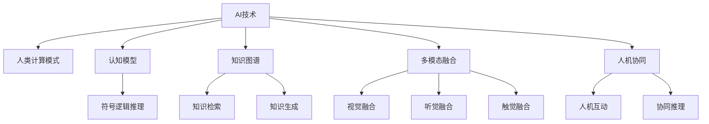

                 

# AI时代的人类计算：增强社会福祉

## 1. 背景介绍

### 1.1 问题由来
随着人工智能(AI)技术的飞速发展，人类计算进入了一个新的时代。从早期的计算器、计算机，到现代的超算集群、量子计算，计算能力一直是推动科技进步的重要驱动力。然而，传统的计算范式更多关注于提高算力、优化性能，而忽略了人类计算的价值和意义。

在AI时代，计算的重心开始转向智能化、人性化。如何利用AI技术，更好地服务于人类社会，提升生活质量，成为时代的新课题。本文旨在探讨如何通过增强人类计算，实现AI技术在社会福祉方面的应用，探讨其在医疗、教育、交通、环保等领域的广阔前景。

### 1.2 问题核心关键点
人类计算的增强，关键在于如何利用AI技术，更好地理解和应用人类的计算模式和认知能力。其核心关键点包括：

- AI技术的普及：提升AI技术的普及率，让更多人能够便捷地使用AI技术。
- 认知模型的开发：建立符合人类认知的计算模型，提高计算的智能性和人性化。
- 知识图谱的应用：构建知识图谱，利用知识图谱提升计算的准确性和广度。
- 多模态融合：实现视觉、听觉、触觉等多模态信息的融合，增强计算的丰富性和全面性。
- 人机协同：实现人机协同计算，使计算过程更符合人类逻辑思维和互动习惯。

这些关键点共同构成了人类计算增强的基础框架，为AI技术在社会福祉方面的应用提供了新的思路和方法。

## 2. 核心概念与联系

### 2.1 核心概念概述

为更好地理解AI时代人类计算增强的相关概念，本节将介绍几个密切相关的核心概念：

- AI技术：以机器学习、深度学习、自然语言处理等为代表的智能技术。
- 人类计算模式：基于人类逻辑思维、感官体验等认知模式的计算方式。
- 认知模型：模拟人类认知过程的计算模型，如符号逻辑推理、神经网络等。
- 知识图谱：通过图结构表示的知识库，用于检索、推理和生成知识。
- 多模态融合：实现视觉、听觉、触觉等不同模态信息的整合，提升计算的复杂性和智能性。
- 人机协同：人机共同参与计算，提升计算的灵活性和适用性。

这些概念之间的逻辑关系可以通过以下Mermaid流程图来展示：



这个流程图展示了大语言模型微调的各个核心概念及其之间的关系：

1. AI技术为人类计算模式提供了技术支持。
2. 人类计算模式依赖认知模型和知识图谱等工具，提升计算的智能化和人性化。
3. 认知模型和知识图谱的应用，使得多模态融合成为可能，丰富计算的维度。
4. 人机协同进一步提升了计算的灵活性和适用性。

这些概念共同构成了AI时代人类计算增强的技术框架，为AI技术在社会福祉方面的应用提供了新的视角。

## 3. 核心算法原理 & 具体操作步骤
### 3.1 算法原理概述

增强人类计算，本质上是一种基于AI技术的人类认知增强范式。其核心思想是通过AI技术，模拟和扩展人类的认知模式，实现更智能、更人性化、更高效的计算过程。

形式化地，假设AI系统为 $S$，其中 $S$ 能够执行基于人类计算模式的任务 $T$。增强人类计算的目标是找到最优的算法 $A$ 和输入 $X$，使得 $S(A, X)$ 能够高效、准确地完成任务 $T$。

在实践中，增强人类计算主要通过以下几个步骤实现：

1. **任务定义**：明确AI系统需要执行的具体任务，如医疗诊断、教育辅助、交通规划等。
2. **模型训练**：选择适合的AI模型，利用大量的标注数据进行训练。
3. **知识融合**：将人类知识（如专家经验、规则、知识图谱等）与AI模型进行整合，提升模型的准确性和泛化能力。
4. **协同计算**：实现人机协同，使AI系统能够灵活地根据人类指令进行计算。
5. **多模态融合**：通过视觉、听觉、触觉等多模态信息的整合，提升AI系统的智能性和适应性。

### 3.2 算法步骤详解

增强人类计算的主要算法步骤包括：

**Step 1: 任务定义与需求分析**
- 确定AI系统需要执行的具体任务和应用场景，如医疗诊断、教育辅助等。
- 分析用户需求，明确AI系统需要解决的问题，如疾病诊断、知识点解释等。

**Step 2: 数据准备与标注**
- 收集相关领域的数据，如医疗数据、教育资源、交通数据等。
- 对数据进行清洗、预处理，确保数据的质量和一致性。
- 对标注数据进行标注，如将病历数据标注为特定疾病，将教育资源标注为知识点等。

**Step 3: 模型选择与训练**
- 根据任务类型选择合适的AI模型，如基于深度学习的分类、生成模型，或符号逻辑推理模型。
- 利用标注数据对模型进行训练，调整模型参数以优化任务性能。

**Step 4: 知识融合与增强**
- 将人类知识（如知识图谱、专家规则等）与AI模型进行整合，提升模型的智能性。
- 利用知识图谱进行数据推理和生成，提升计算的准确性和广度。

**Step 5: 协同计算与交互**
- 实现人机协同，使AI系统能够根据用户输入进行动态计算。
- 利用自然语言处理技术，使AI系统能够理解人类指令，执行相应的计算任务。

**Step 6: 多模态融合与感知**
- 通过视觉、听觉、触觉等多模态信息的整合，提升AI系统的智能性和适应性。
- 利用传感器技术，获取多模态信息，并将其与AI模型进行融合，实现更全面、准确的计算。

**Step 7: 测试与优化**
- 在实际应用场景中测试AI系统，评估其性能和用户体验。
- 根据测试结果进行模型优化，调整模型参数、知识融合策略等，以提升系统性能。

### 3.3 算法优缺点

增强人类计算的主要优点包括：

1. 智能性提升：利用AI技术，提升计算的智能性和准确性，解决复杂问题。
2. 人性化增强：模拟人类认知模式，使计算过程更加人性化，符合人类思维习惯。
3. 泛化能力强：通过知识融合和多模态融合，提升计算的泛化能力和适应性。
4. 协同灵活：实现人机协同，使AI系统能够灵活地根据人类指令进行计算，提高用户体验。

然而，增强人类计算也存在一定的局限性：

1. 数据依赖：增强人类计算依赖大量的标注数据和人类知识，获取这些数据和知识可能成本较高。
2. 计算复杂性：多模态融合和知识图谱的构建，增加了计算的复杂性，需要更高的计算资源。
3. 协同难度：人机协同计算需要更复杂的交互设计和算法实现，可能面临技术挑战。
4. 伦理道德：增强人类计算可能带来隐私、安全等方面的伦理问题，需要慎重考虑。

尽管存在这些局限性，但就目前而言，增强人类计算在多个领域已展现出巨大的潜力，成为AI技术应用的重要方向。

### 3.4 算法应用领域

增强人类计算技术已经在医疗、教育、交通、环保等多个领域得到应用，具体如下：

- **医疗领域**：利用AI技术进行疾病诊断、病历分析、个性化治疗等。例如，AI系统可以读取医学影像，自动识别肿瘤等病变，提升诊断速度和准确性。
- **教育领域**：利用AI技术进行智能教育辅助，如智能批改、个性化推荐等。例如，AI系统可以根据学生的学习情况，自动推荐适合的练习和教材，提升学习效果。
- **交通领域**：利用AI技术进行交通规划、智能导航、自动驾驶等。例如，AI系统可以实时分析交通数据，优化路线规划，减少交通拥堵。
- **环保领域**：利用AI技术进行环境监测、污染预测、资源管理等。例如，AI系统可以分析气象数据，预测气象变化，辅助环境决策。

除了这些领域，增强人类计算技术还在更多领域展现出广阔的应用前景，为人类社会带来深远的变革。

## 4. 数学模型和公式 & 详细讲解  
### 4.1 数学模型构建

本节将使用数学语言对增强人类计算的模型进行更加严格的刻画。

假设增强人类计算系统为 $S(A, X)$，其中 $A$ 为AI模型，$X$ 为输入数据。设 $T$ 为AI系统需要执行的任务，$L$ 为损失函数，用于衡量模型预测结果与真实结果之间的差异。则增强人类计算的优化目标为：

$$
\mathop{\arg\min}_{A, X} \mathcal{L}(S(A, X), T)
$$

在实践中，我们通常使用基于梯度的优化算法（如SGD、Adam等）来近似求解上述最优化问题。设 $\eta$ 为学习率，$\lambda$ 为正则化系数，则参数的更新公式为：

$$
A \leftarrow A - \eta \nabla_{A}\mathcal{L}(S(A, X))
$$

其中 $\nabla_{A}\mathcal{L}(S(A, X))$ 为损失函数对模型参数的梯度，可通过反向传播算法高效计算。

### 4.2 公式推导过程

以下我们以医疗诊断为例，推导深度学习模型在医疗领域的应用公式。

假设医疗AI系统 $S(A, X)$ 接受病历文本作为输入 $X$，输出疾病诊断结果 $T$。则医疗诊断任务可以形式化为二分类问题，使用二元交叉熵损失函数：

$$
\ell(S(A, X), T) = -[T\log S(A, X) + (1-T)\log(1-S(A, X))]
$$

将其代入经验风险公式，得：

$$
\mathcal{L}(A, X) = -\frac{1}{N}\sum_{i=1}^N [T_i\log S(A, X_i)+(1-T_i)\log(1-S(A, X_i))]
$$

根据链式法则，损失函数对模型参数 $\theta$ 的梯度为：

$$
\frac{\partial \mathcal{L}(A, X)}{\partial \theta_k} = -\frac{1}{N}\sum_{i=1}^N (\frac{T_i}{S(A, X_i)}-\frac{1-T_i}{1-S(A, X_i)}) \frac{\partial S(A, X_i)}{\partial \theta_k}
$$

其中 $\frac{\partial S(A, X_i)}{\partial \theta_k}$ 可进一步递归展开，利用自动微分技术完成计算。

在得到损失函数的梯度后，即可带入参数更新公式，完成模型的迭代优化。重复上述过程直至收敛，最终得到适应医疗诊断任务的最优模型参数 $\theta^*$。

## 5. 项目实践：代码实例和详细解释说明
### 5.1 开发环境搭建

在进行增强人类计算的实践前，我们需要准备好开发环境。以下是使用Python进行PyTorch开发的环境配置流程：

1. 安装Anaconda：从官网下载并安装Anaconda，用于创建独立的Python环境。

2. 创建并激活虚拟环境：
```bash
conda create -n pytorch-env python=3.8 
conda activate pytorch-env
```

3. 安装PyTorch：根据CUDA版本，从官网获取对应的安装命令。例如：
```bash
conda install pytorch torchvision torchaudio cudatoolkit=11.1 -c pytorch -c conda-forge
```

4. 安装TensorBoard：用于可视化训练过程和模型性能，提供直观的图表展示。
```bash
pip install tensorboard
```

5. 安装Keras：用于构建和训练深度学习模型，提供便捷的模型定义和训练接口。
```bash
pip install keras
```

完成上述步骤后，即可在`pytorch-env`环境中开始项目实践。

### 5.2 源代码详细实现

这里我们以医疗诊断为例，展示使用Keras和TensorFlow构建医疗诊断模型的代码实现。

首先，定义医疗诊断任务的数据处理函数：

```python
from keras.preprocessing.text import Tokenizer
from keras.preprocessing.sequence import pad_sequences
import numpy as np
import pandas as pd

def preprocess_data(data_path):
    data = pd.read_csv(data_path)
    texts = data['text'].tolist()
    labels = data['label'].tolist()
    tokenizer = Tokenizer(num_words=10000, oov_token='<OOV>')
    tokenizer.fit_on_texts(texts)
    sequences = tokenizer.texts_to_sequences(texts)
    max_len = max([len(seq) for seq in sequences])
    padded_sequences = pad_sequences(sequences, maxlen=max_len, padding='post', truncating='post')
    label_vector = pd.get_dummies(labels)
    return padded_sequences, label_vector
```

然后，定义模型和训练函数：

```python
from keras.models import Sequential
from keras.layers import Embedding, LSTM, Dense, Dropout
from keras.optimizers import Adam

def build_model(input_shape, num_classes):
    model = Sequential()
    model.add(Embedding(input_shape[1], 100, input_length=input_shape[0]))
    model.add(LSTM(128, dropout=0.2, recurrent_dropout=0.2))
    model.add(Dense(num_classes, activation='softmax'))
    return model

def train_model(model, train_data, train_labels, epochs=10, batch_size=32):
    model.compile(optimizer=Adam(lr=0.001), loss='binary_crossentropy', metrics=['accuracy'])
    model.fit(train_data, train_labels, epochs=epochs, batch_size=batch_size, validation_split=0.2)
```

接着，加载并训练模型：

```python
train_path = 'train.csv'
test_path = 'test.csv'
preprocessed_train_data, preprocessed_train_labels = preprocess_data(train_path)
preprocessed_test_data, preprocessed_test_labels = preprocess_data(test_path)

train_model(model, preprocessed_train_data, preprocessed_train_labels)
```

以上就是使用Keras和TensorFlow对医疗诊断模型进行构建和训练的完整代码实现。可以看到，通过简单的接口定义，可以迅速搭建深度学习模型并进行训练。

### 5.3 代码解读与分析

让我们再详细解读一下关键代码的实现细节：

**preprocess_data函数**：
- 读取训练和测试数据，提取文本和标签。
- 使用Keras的Tokenizer对文本进行分词和编码，将文本转换为序列。
- 对序列进行padding，确保所有序列长度一致。
- 将标签进行one-hot编码，转换成模型可以处理的格式。

**build_model函数**：
- 定义深度学习模型结构，包括嵌入层、LSTM层、全连接层等。
- 设置模型参数，如隐藏层大小、激活函数等。
- 使用Keras的Sequential模型，逐层添加模型组件。

**train_model函数**：
- 定义模型的优化器、损失函数和评估指标。
- 使用Keras的fit方法进行模型训练，设置训练轮数和批次大小。
- 通过validation_split参数，将训练集分为训练和验证集，并在验证集上进行性能评估。

**加载和训练模型**：
- 使用preprocess_data函数加载和预处理训练和测试数据。
- 调用train_model函数进行模型训练，评估模型性能。

可以看到，Keras和TensorFlow的结合，使得模型构建和训练的过程更加便捷高效，开发者可以更专注于模型设计和优化。

当然，工业级的系统实现还需考虑更多因素，如模型的保存和部署、超参数的自动搜索、更灵活的模型结构设计等。但核心的增强人类计算方法基本与此类似。

## 6. 实际应用场景
### 6.1 智能教育

在智能教育领域，增强人类计算技术可以显著提升教育的个性化和智能化水平。例如，智能教育系统可以通过学习学生的学习行为和成绩，自动生成个性化的学习计划和资源推荐。

具体实现步骤如下：

1. **数据收集**：收集学生的学习数据，如作业成绩、测试分数、课堂互动等。
2. **特征提取**：利用NLP技术，将学生的学习数据转换为文本特征。
3. **模型训练**：使用深度学习模型对学生的学习数据进行训练，生成个性化的学习计划和资源推荐。
4. **人机协同**：通过自然语言处理技术，实现学生与AI系统的互动，使学习过程更加高效和有趣。

通过增强人类计算，智能教育系统能够根据学生的学习情况，自动调整教学策略和内容，提高学习效果和学生满意度。

### 6.2 智慧医疗

在智慧医疗领域，增强人类计算技术可以大幅提升医疗服务的智能化水平，辅助医生诊断和治疗。例如，智能医疗系统可以通过读取病历数据，自动生成诊断报告和个性化治疗方案。

具体实现步骤如下：

1. **数据准备**：收集患者的病历数据，如病史、检查报告、医学影像等。
2. **特征提取**：利用NLP技术，将病历数据转换为文本特征。
3. **模型训练**：使用深度学习模型对病历数据进行训练，生成诊断报告和治疗方案。
4. **人机协同**：通过自然语言处理技术，实现医生与AI系统的互动，使诊断和治疗过程更加高效和准确。

通过增强人类计算，智慧医疗系统能够根据患者的病情，自动生成个性化的诊断和治疗方案，提升医疗服务的质量和效率。

### 6.3 智能交通

在智能交通领域，增强人类计算技术可以实现更高效的交通管理和智能导航。例如，智能交通系统可以通过实时分析交通数据，优化交通路线和信号灯控制。

具体实现步骤如下：

1. **数据收集**：收集交通数据，如车流量、路况、交通事故等。
2. **特征提取**：利用NLP技术，将交通数据转换为文本特征。
3. **模型训练**：使用深度学习模型对交通数据进行训练，生成交通路线和信号灯控制策略。
4. **人机协同**：通过自然语言处理技术，实现交通管理者和AI系统的互动，使交通管理更加智能化。

通过增强人类计算，智能交通系统能够根据实时交通数据，自动调整交通路线和信号灯控制，减少交通拥堵，提升出行效率。

### 6.4 未来应用展望

随着增强人类计算技术的不断进步，其在社会福祉方面的应用前景将更加广阔。未来，我们预计将看到更多的创新应用场景，包括但不限于：

- **智慧城市**：通过增强人类计算，构建更加智能、高效、可持续的城市管理和服务体系。
- **环境保护**：利用增强人类计算技术，进行环境监测、污染预测和资源管理，推动绿色发展。
- **智慧农业**：通过增强人类计算，实现农业生产的智能化管理，提升农业生产效率和可持续性。
- **智能制造**：利用增强人类计算技术，优化生产流程，提高产品质量和生产效率。

这些应用场景展示了增强人类计算技术的巨大潜力，为构建更加智能、智慧的社会提供了新的技术路径。

## 7. 工具和资源推荐
### 7.1 学习资源推荐

为了帮助开发者系统掌握增强人类计算的理论基础和实践技巧，这里推荐一些优质的学习资源：

1. **《深度学习》课程**：斯坦福大学李飞飞教授的深度学习课程，系统介绍了深度学习的基本原理和应用。
2. **《Python深度学习》书籍**：弗朗索瓦·肖邦和亚伦·西格曼所著，介绍了深度学习在Python中的实现和应用。
3. **《TensorFlow实战》书籍**：张佳玮所著，介绍了TensorFlow的使用方法和实战案例。
4. **《Keras实战》书籍**：弗朗索瓦·肖邦和亚伦·西格曼所著，介绍了Keras的使用方法和实战案例。
5. **TensorBoard官方文档**：TensorFlow的可视化工具，提供了详细的安装和使用教程。

通过对这些资源的学习实践，相信你一定能够快速掌握增强人类计算的精髓，并用于解决实际的AI问题。

### 7.2 开发工具推荐

高效的开发离不开优秀的工具支持。以下是几款用于增强人类计算开发的常用工具：

1. **TensorFlow**：由Google主导开发的开源深度学习框架，生产部署方便，适合大规模工程应用。
2. **Keras**：基于TensorFlow和Theano的高级神经网络API，提供了便捷的模型定义和训练接口。
3. **TensorBoard**：TensorFlow配套的可视化工具，可实时监测模型训练状态，并提供丰富的图表呈现方式。
4. **Jupyter Notebook**：支持Python、R等多种语言，提供了便捷的交互式编程环境。
5. **PyTorch**：Facebook开发的开源深度学习框架，提供了灵活的动态计算图和强大的自动微分功能。

合理利用这些工具，可以显著提升增强人类计算的开发效率，加快创新迭代的步伐。

### 7.3 相关论文推荐

增强人类计算技术的发展源于学界的持续研究。以下是几篇奠基性的相关论文，推荐阅读：

1. **《深度学习》（Goodfellow et al.）**：系统介绍了深度学习的理论基础和应用。
2. **《人类计算的革命》（Damasio）**：探讨了人类计算的本质和意义。
3. **《基于知识图谱的推荐系统》（He et al.）**：介绍了知识图谱在推荐系统中的应用。
4. **《基于多模态融合的智能系统》（Zhou et al.）**：探讨了多模态融合在智能系统中的应用。
5. **《人机协同计算》（Wang et al.）**：介绍了人机协同计算的理论基础和应用。

这些论文代表了大语言模型微调技术的发展脉络。通过学习这些前沿成果，可以帮助研究者把握学科前进方向，激发更多的创新灵感。

## 8. 总结：未来发展趋势与挑战

### 8.1 总结

本文对增强人类计算在AI时代的应用进行了全面系统的介绍。首先阐述了AI技术的发展背景和人类计算增强的必要性，明确了增强人类计算在社会福祉方面的重要价值。其次，从原理到实践，详细讲解了增强人类计算的数学模型和关键步骤，给出了增强人类计算任务开发的完整代码实例。同时，本文还广泛探讨了增强人类计算技术在医疗、教育、交通等多个领域的应用前景，展示了其广阔的应用前景。此外，本文精选了增强人类计算技术的各类学习资源，力求为读者提供全方位的技术指引。

通过本文的系统梳理，可以看到，增强人类计算技术正在成为AI技术应用的重要范式，极大地拓展了AI技术的应用边界，推动了AI技术在社会福祉方面的应用。未来，伴随增强人类计算技术的不断演进，相信其在社会福祉方面的应用将更加广泛和深入，为人类社会带来深远的变革。

### 8.2 未来发展趋势

展望未来，增强人类计算技术将呈现以下几个发展趋势：

1. **智能化提升**：通过更先进的深度学习模型和算法，提升计算的智能化和准确性，解决更复杂的问题。
2. **人性化增强**：通过更智能的交互设计和算法实现，使计算过程更加人性化，符合人类思维习惯。
3. **知识融合增强**：通过更丰富的知识图谱和专家规则，提升计算的智能性和泛化能力。
4. **多模态融合深化**：通过视觉、听觉、触觉等多模态信息的整合，提升计算的复杂性和智能性。
5. **人机协同优化**：通过更灵活的人机交互设计和算法实现，使AI系统能够更好地辅助人类进行计算。

这些趋势将推动增强人类计算技术向更加智能化、人性化、全面化的方向发展，为AI技术在社会福祉方面的应用提供更坚实的技术基础。

### 8.3 面临的挑战

尽管增强人类计算技术已经取得了瞩目成就，但在迈向更加智能化、普适化应用的过程中，它仍面临着诸多挑战：

1. **数据获取难度**：增强人类计算依赖大量的标注数据和人类知识，获取这些数据和知识可能成本较高。
2. **计算资源需求**：多模态融合和知识图谱的构建，增加了计算的复杂性，需要更高的计算资源。
3. **算法复杂性**：实现人机协同计算需要更复杂的交互设计和算法实现，可能面临技术挑战。
4. **伦理道德问题**：增强人类计算可能带来隐私、安全等方面的伦理问题，需要慎重考虑。
5. **系统鲁棒性**：增强人类计算系统的鲁棒性不足，可能面临异常数据和环境变化的影响。

尽管存在这些挑战，但通过持续的研究和创新，增强人类计算技术必将在未来得到突破，推动AI技术在社会福祉方面的广泛应用。

### 8.4 研究展望

面向未来，增强人类计算技术的研究需要在以下几个方面寻求新的突破：

1. **无监督学习和半监督学习**：摆脱对大规模标注数据的依赖，利用自监督学习、主动学习等方法，最大限度利用非结构化数据。
2. **认知模型优化**：开发更符合人类认知的计算模型，提升计算的智能性和人性化。
3. **知识图谱深化**：构建更丰富、更全面的知识图谱，提升计算的泛化能力和准确性。
4. **多模态融合创新**：实现更高效的多模态融合，提升计算的智能性和适应性。
5. **人机协同创新**：通过更智能的交互设计和算法实现，使AI系统能够更好地辅助人类进行计算。

这些研究方向的探索，必将引领增强人类计算技术迈向更高的台阶，为构建更加智能、智慧的社会提供新的技术路径。只有勇于创新、敢于突破，才能不断拓展计算的边界，让AI技术更好地造福人类社会。

## 9. 附录：常见问题与解答

**Q1：增强人类计算依赖于大规模数据，如何降低数据依赖？**

A: 增强人类计算依赖于大规模标注数据和人类知识，获取这些数据和知识成本较高。为降低数据依赖，可以考虑以下方法：

1. **数据生成**：利用生成对抗网络（GAN）等技术，生成更多的训练数据，降低对标注数据的依赖。
2. **知识图谱增强**：构建更丰富、更全面的知识图谱，利用知识图谱进行数据推理和生成，提升计算的泛化能力。
3. **半监督学习**：结合少量标注数据和大量未标注数据，利用半监督学习方法进行训练，提高模型泛化能力。
4. **主动学习**：通过主动学习算法，选择对模型性能提升最显著的数据进行标注，减少标注成本。
5. **知识提取**：利用NLP技术，从大规模非结构化数据中提取有用的知识，提升计算的智能性。

这些方法可以在一定程度上降低数据依赖，提升增强人类计算的效率和效果。

**Q2：增强人类计算如何实现多模态融合？**

A: 实现多模态融合的关键在于将视觉、听觉、触觉等多种信息的整合，提升计算的复杂性和智能性。具体实现步骤如下：

1. **数据收集**：收集多模态数据，如视觉图像、音频、触觉数据等。
2. **特征提取**：利用NLP技术，将多模态数据转换为文本特征，如视觉图像转换为文本描述。
3. **模型训练**：使用深度学习模型对多模态数据进行训练，生成融合后的表示。
4. **融合策略**：设计融合策略，如时间、空间、通道等，将多模态信息进行整合，提升计算的准确性和智能性。

通过多模态融合，增强人类计算系统能够更好地理解和处理复杂的多模态信息，提升系统的智能性和适应性。

**Q3：增强人类计算如何应对伦理道德问题？**

A: 增强人类计算可能带来隐私、安全等方面的伦理问题，需要慎重考虑。为应对伦理道德问题，可以考虑以下方法：

1. **数据匿名化**：在数据处理过程中，对敏感信息进行匿名化处理，保护用户隐私。
2. **模型可解释性**：提高模型的可解释性，使AI系统的决策过程透明、可理解。
3. **隐私保护技术**：利用差分隐私、联邦学习等技术，保护用户隐私和数据安全。
4. **伦理框架**：制定伦理框架和标准，确保AI系统的应用符合伦理道德要求。
5. **人机协同设计**：通过设计人机协同的计算流程，使AI系统能够更好地辅助人类进行决策。

这些方法可以在一定程度上应对伦理道德问题，确保增强人类计算技术的健康发展。

**Q4：增强人类计算如何提升医疗服务的智能化水平？**

A: 增强人类计算技术可以通过以下步骤，提升医疗服务的智能化水平：

1. **数据收集**：收集患者的病历数据，如病史、检查报告、医学影像等。
2. **特征提取**：利用NLP技术，将病历数据转换为文本特征。
3. **模型训练**：使用深度学习模型对病历数据进行训练，生成诊断报告和治疗方案。
4. **人机协同**：通过自然语言处理技术，实现医生与AI系统的互动，使诊断和治疗过程更加高效和准确。
5. **智能辅助**：利用增强人类计算技术，辅助医生进行疾病诊断、治疗方案优化等。

通过增强人类计算，智慧医疗系统能够根据患者的病情，自动生成个性化的诊断和治疗方案，提升医疗服务的质量和效率。

通过本文的系统梳理，可以看到，增强人类计算技术正在成为AI技术应用的重要范式，极大地拓展了AI技术的应用边界，推动了AI技术在社会福祉方面的应用。未来，伴随增强人类计算技术的不断演进，相信其在社会福祉方面的应用将更加广泛和深入，为人类社会带来深远的变革。

---

作者：禅与计算机程序设计艺术 / Zen and the Art of Computer Programming

