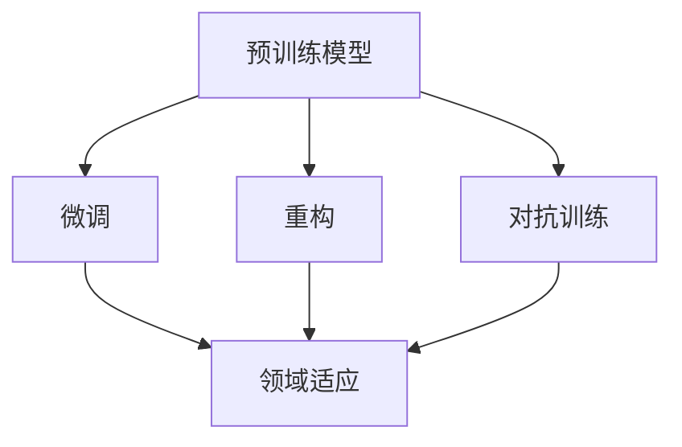

                 

# AI模型的跨域学习：Lepton AI的知识迁移

> 关键词：跨域迁移学习, Lepton AI, 知识迁移, 神经网络, 深度学习, 自然语言处理

## 1. 背景介绍

### 1.1 问题由来

随着深度学习技术的快速发展，越来越多的领域开始应用深度学习技术来解决实际问题。然而，不同领域的数据和任务特点各异，往往需要单独训练模型以解决特定问题。尽管这种“领域化”的训练策略在特定任务上取得了显著效果，但也带来了一系列问题：

1. **重复建设**：每个领域需要重新从头训练模型，导致计算资源和时间的大量浪费。
2. **泛化能力有限**：领域间的知识难以共享，无法利用跨领域知识提高模型性能。
3. **模型复杂度增加**：不同领域的模型需要特殊设计，增加了模型复杂度，提高了维护成本。
4. **数据依赖性强**：每个领域的数据特征各异，跨领域数据集往往难以获得，限制了模型的泛化能力。

为解决这些问题，跨域迁移学习应运而生。跨域迁移学习（Cross-Domain Transfer Learning）旨在将一个领域的知识迁移到另一个领域，利用已有知识提升模型在新领域的表现。这种策略能够显著降低新任务上的学习成本，提高模型的泛化能力，促进深度学习技术的广泛应用。

### 1.2 问题核心关键点

跨域迁移学习的核心在于通过某种机制，将源领域（Source Domain）的模型知识迁移到目标领域（Target Domain），以提升目标领域模型在新任务上的性能。具体来说，关键点包括：

1. **预训练模型选择**：选择合适的预训练模型作为知识迁移的起点。
2. **领域适应策略**：设计适应目标领域的迁移策略，如微调、重构、对抗训练等。
3. **跨领域知识融合**：通过特定的方法，将源领域知识与目标领域数据进行融合，提高模型的泛化能力。
4. **迁移效果评估**：使用适当的评估指标，评估迁移学习的有效性，确保迁移后的模型在新任务上的性能。

## 2. 核心概念与联系

### 2.1 核心概念概述

为了更好地理解跨域迁移学习，我们先简要介绍几个关键概念：

- **预训练模型（Pre-trained Models）**：在大规模无标注数据上训练得到的模型，如BERT、GPT等。这些模型通常在大规模文本语料上进行预训练，学习到丰富的语言表示。
- **领域适应（Domain Adaptation）**：将训练好的模型适配到新领域的过程，包括微调、重构等策略。
- **迁移学习（Transfer Learning）**：将一个领域的知识迁移到另一个领域，以提升新领域的模型性能。
- **知识迁移（Knowledge Transfer）**：将特定领域的知识迁移到另一个领域，提升新领域模型的性能。

这些概念之间的逻辑关系可以通过以下Mermaid流程图来展示：



这个流程图展示了预训练模型在跨域迁移学习中的作用和各类迁移策略的关系：

1. 预训练模型通过在大规模无标注数据上训练，学习到通用的语言表示。
2. 微调、重构、对抗训练等迁移策略，通过调整模型参数，使其适应目标领域。
3. 领域适应策略将预训练模型的知识迁移到目标领域，提升模型在新任务上的表现。

## 3. 核心算法原理 & 具体操作步骤
### 3.1 算法原理概述

跨域迁移学习的核心在于将源领域模型的知识迁移到目标领域。其核心思想是通过某种机制，将源领域模型的知识与目标领域的数据进行融合，提高模型在目标领域上的泛化能力。

形式化地，设源领域数据集为 $D_s$，目标领域数据集为 $D_t$，源领域模型为 $M_s$，目标领域模型为 $M_t$。迁移学习的目标是找到最优的目标领域模型 $M_t^*$，使得：

$$
M_t^* = \mathop{\arg\min}_{M_t} \mathcal{L}(M_t, D_t)
$$

其中 $\mathcal{L}$ 为模型在目标领域上的损失函数，通常为交叉熵损失。迁移学习的关键在于选择合适的迁移策略，最大化 $M_s$ 在 $D_t$ 上的性能。

### 3.2 算法步骤详解

跨域迁移学习通常包括以下几个关键步骤：

**Step 1: 准备源领域数据和预训练模型**
- 收集源领域的标注数据集 $D_s$，划分为训练集、验证集和测试集。
- 选择合适的预训练模型 $M_s$，如BERT、GPT等，作为知识迁移的起点。

**Step 2: 设计迁移策略**
- 根据具体任务特点，选择合适的迁移策略，如微调、重构、对抗训练等。
- 定义目标领域模型 $M_t$ 的结构和损失函数。

**Step 3: 实施迁移学习**
- 将预训练模型 $M_s$ 作为初始化参数，在目标领域数据集 $D_t$ 上进行迁移学习。
- 通过微调、重构、对抗训练等策略，调整模型参数以适应目标领域。

**Step 4: 评估迁移效果**
- 在目标领域测试集上评估迁移后的模型性能，对比迁移前后的效果提升。
- 调整迁移策略，重复上述步骤，直至获得满意的迁移结果。

### 3.3 算法优缺点

跨域迁移学习具有以下优点：

1. **提升泛化能力**：通过迁移源领域模型的知识，显著提升目标领域模型在新任务上的泛化能力。
2. **降低学习成本**：利用已有模型，减少新任务上的训练时间和计算资源。
3. **减少数据依赖**：对目标领域数据的需求较少，适应性更强。
4. **促进知识共享**：不同领域的知识可以进行迁移和共享，促进深度学习技术的广泛应用。

然而，跨域迁移学习也存在以下局限：

1. **数据对齐问题**：源领域和目标领域的数据分布可能存在较大差异，迁移效果受限于数据对齐的质量。
2. **迁移策略复杂**：不同的迁移策略可能需要调整模型参数，增加了优化难度。
3. **泛化能力有限**：迁移学习的效果受限于源领域和目标领域的相似度，可能存在领域偏移问题。
4. **模型复杂度增加**：迁移后的模型可能增加额外的复杂度，影响推理效率。

尽管存在这些局限，但就目前而言，跨域迁移学习仍是深度学习技术广泛应用的重要手段，未来仍有巨大的发展潜力。

### 3.4 算法应用领域

跨域迁移学习在多个领域中得到了广泛应用，以下是一些典型应用场景：

1. **自然语言处理（NLP）**：将通用语言模型在特定领域的文本数据上进行微调，提升模型在情感分析、命名实体识别、机器翻译等任务上的表现。
2. **计算机视觉（CV）**：利用图像分类模型在特定领域的图像数据上进行迁移学习，提升模型在目标检测、图像分割、姿态估计等任务上的性能。
3. **语音识别（ASR）**：将通用语音识别模型在特定领域的音频数据上进行微调，提升模型在语音指令、自动转录等任务上的表现。
4. **医疗领域**：利用通用医学知识图谱，将知识图谱中的医疗知识迁移到特定领域的临床决策支持系统中，提升模型在诊断和治疗上的准确性和鲁棒性。
5. **金融领域**：利用通用金融数据集，将金融知识迁移到特定领域的信用评估、股票预测等任务中，提升模型在金融数据分析上的效果。

## 4. 数学模型和公式 & 详细讲解  
### 4.1 数学模型构建

设源领域模型 $M_s$ 在源领域数据集 $D_s$ 上的损失函数为 $\mathcal{L}_s$，目标领域模型 $M_t$ 在目标领域数据集 $D_t$ 上的损失函数为 $\mathcal{L}_t$。迁移学习的目标是最小化目标领域模型在新数据上的损失，即：

$$
\mathcal{L}_t(M_t) = \mathcal{L}_t(M_t, D_t)
$$

迁移学习的关键是设计一种策略，将源领域模型 $M_s$ 的知识迁移到目标领域模型 $M_t$ 中。常用的迁移策略包括微调、重构、对抗训练等，这里我们重点介绍微调策略。

### 4.2 公式推导过程

对于微调策略，设源领域和目标领域的样本分别 $(x_s, y_s)$ 和 $(x_t, y_t)$，目标领域模型的初始参数为 $\theta_0$，微调后的参数为 $\theta$。微调的目标是最小化目标领域模型在目标领域数据集上的损失，即：

$$
\min_{\theta} \mathcal{L}_t(M_t(x_t; \theta), y_t)
$$

其中 $M_t(x_t; \theta)$ 表示在参数 $\theta$ 下的目标领域模型输出。微调的过程可以通过以下步骤实现：

1. **初始化**：将源领域模型 $M_s$ 的权重初始化为 $\theta_0$。
2. **训练**：在目标领域数据集 $D_t$ 上进行有监督的微调训练，更新模型参数 $\theta$。
3. **评估**：在目标领域测试集上评估模型性能，输出结果。

微调的优化目标为：

$$
\min_{\theta} \mathcal{L}_t(M_t(x_t; \theta), y_t)
$$

其中 $\mathcal{L}_t$ 为目标领域的损失函数。通过梯度下降等优化算法，最小化上述目标，更新模型参数 $\theta$。微调的算法步骤如下：

1. **计算梯度**：计算目标领域模型在目标领域数据集上的梯度。
2. **更新参数**：根据梯度和学习率，更新模型参数。
3. **评估性能**：在测试集上评估模型性能，输出结果。
4. **迭代更新**：重复上述步骤，直至达到预设的迭代次数或收敛条件。

### 4.3 案例分析与讲解

这里以自然语言处理（NLP）中的情感分析任务为例，展示跨域迁移学习的具体实现。

1. **准备数据**：收集源领域的情感标注数据集 $D_s$ 和目标领域的情感标注数据集 $D_t$。
2. **选择模型**：选择BERT模型作为源领域模型 $M_s$，作为迁移的起点。
3. **设计目标领域模型**：在BERT模型的基础上，添加情感分类器，定义损失函数。
4. **微调模型**：在目标领域数据集 $D_t$ 上进行有监督的微调训练，更新模型参数。
5. **评估效果**：在目标领域测试集上评估模型性能，输出结果。

假设目标领域模型 $M_t$ 在目标领域数据集 $D_t$ 上的损失函数为交叉熵损失：

$$
\mathcal{L}_t(M_t(x_t; \theta), y_t) = -\frac{1}{N}\sum_{i=1}^N [y_i\log M_t(x_t; \theta_i)+(1-y_i)\log(1-M_t(x_t; \theta_i))]
$$

其中 $N$ 为样本数，$x_t$ 为输入样本，$y_t$ 为目标标签。微调的优化目标为：

$$
\min_{\theta} \mathcal{L}_t(M_t(x_t; \theta), y_t)
$$

通过梯度下降等优化算法，最小化上述目标，更新模型参数 $\theta$。

## 5. 项目实践：代码实例和详细解释说明
### 5.1 开发环境搭建

在进行跨域迁移学习实践前，我们需要准备好开发环境。以下是使用Python进行PyTorch开发的环境配置流程：

1. 安装Anaconda：从官网下载并安装Anaconda，用于创建独立的Python环境。

2. 创建并激活虚拟环境：
```bash
conda create -n pytorch-env python=3.8 
conda activate pytorch-env
```

3. 安装PyTorch：根据CUDA版本，从官网获取对应的安装命令。例如：
```bash
conda install pytorch torchvision torchaudio cudatoolkit=11.1 -c pytorch -c conda-forge
```

4. 安装Transformers库：
```bash
pip install transformers
```

5. 安装各类工具包：
```bash
pip install numpy pandas scikit-learn matplotlib tqdm jupyter notebook ipython
```

完成上述步骤后，即可在`pytorch-env`环境中开始跨域迁移学习实践。

### 5.2 源代码详细实现

这里我们以BERT模型在情感分析任务上的跨域迁移学习为例，给出使用PyTorch的代码实现。

首先，定义情感分析任务的数据处理函数：

```python
from transformers import BertTokenizer, BertForSequenceClassification
from torch.utils.data import Dataset, DataLoader
import torch
import numpy as np

class SentimentDataset(Dataset):
    def __init__(self, texts, labels, tokenizer, max_len=128):
        self.texts = texts
        self.labels = labels
        self.tokenizer = tokenizer
        self.max_len = max_len
        
    def __len__(self):
        return len(self.texts)
    
    def __getitem__(self, item):
        text = self.texts[item]
        label = self.labels[item]
        
        encoding = self.tokenizer(text, return_tensors='pt', max_length=self.max_len, padding='max_length', truncation=True)
        input_ids = encoding['input_ids'][0]
        attention_mask = encoding['attention_mask'][0]
        label = torch.tensor(label, dtype=torch.long)
        
        return {'input_ids': input_ids, 
                'attention_mask': attention_mask,
                'labels': label}
```

然后，定义模型和优化器：

```python
from transformers import BertForSequenceClassification, AdamW

model = BertForSequenceClassification.from_pretrained('bert-base-uncased', num_labels=2)

optimizer = AdamW(model.parameters(), lr=2e-5)
```

接着，定义训练和评估函数：

```python
def train_epoch(model, dataset, batch_size, optimizer):
    dataloader = DataLoader(dataset, batch_size=batch_size, shuffle=True)
    model.train()
    epoch_loss = 0
    for batch in dataloader:
        input_ids = batch['input_ids'].to(device)
        attention_mask = batch['attention_mask'].to(device)
        labels = batch['labels'].to(device)
        model.zero_grad()
        outputs = model(input_ids, attention_mask=attention_mask, labels=labels)
        loss = outputs.loss
        epoch_loss += loss.item()
        loss.backward()
        optimizer.step()
    return epoch_loss / len(dataloader)

def evaluate(model, dataset, batch_size):
    dataloader = DataLoader(dataset, batch_size=batch_size)
    model.eval()
    preds, labels = [], []
    with torch.no_grad():
        for batch in dataloader:
            input_ids = batch['input_ids'].to(device)
            attention_mask = batch['attention_mask'].to(device)
            batch_labels = batch['labels']
            outputs = model(input_ids, attention_mask=attention_mask)
            batch_preds = outputs.logits.argmax(dim=2).to('cpu').tolist()
            batch_labels = batch_labels.to('cpu').tolist()
            for pred, label in zip(batch_preds, batch_labels):
                preds.append(pred)
                labels.append(label)
                
    accuracy = np.mean([1 if pred == label else 0 for pred, label in zip(preds, labels)])
    print(f"Accuracy: {accuracy}")
```

最后，启动训练流程并在测试集上评估：

```python
epochs = 5
batch_size = 16

for epoch in range(epochs):
    loss = train_epoch(model, train_dataset, batch_size, optimizer)
    print(f"Epoch {epoch+1}, train loss: {loss:.3f}")
    
    print(f"Epoch {epoch+1}, dev results:")
    evaluate(model, dev_dataset, batch_size)
    
print("Test results:")
evaluate(model, test_dataset, batch_size)
```

以上就是使用PyTorch对BERT模型进行情感分析任务跨域迁移学习的完整代码实现。可以看到，得益于Transformers库的强大封装，我们可以用相对简洁的代码完成模型的迁移学习。

### 5.3 代码解读与分析

让我们再详细解读一下关键代码的实现细节：

**SentimentDataset类**：
- `__init__`方法：初始化文本、标签、分词器等关键组件。
- `__len__`方法：返回数据集的样本数量。
- `__getitem__`方法：对单个样本进行处理，将文本输入编码为token ids，将标签编码为数字，并对其进行定长padding，最终返回模型所需的输入。

**训练和评估函数**：
- 使用PyTorch的DataLoader对数据集进行批次化加载，供模型训练和推理使用。
- 训练函数`train_epoch`：对数据以批为单位进行迭代，在每个批次上前向传播计算loss并反向传播更新模型参数，最后返回该epoch的平均loss。
- 评估函数`evaluate`：与训练类似，不同点在于不更新模型参数，并在每个batch结束后将预测和标签结果存储下来，最后使用numpy计算准确率。

**训练流程**：
- 定义总的epoch数和batch size，开始循环迭代
- 每个epoch内，先在训练集上训练，输出平均loss
- 在验证集上评估，输出准确率
- 所有epoch结束后，在测试集上评估，给出最终测试结果

可以看到，PyTorch配合Transformers库使得BERT迁移学习的代码实现变得简洁高效。开发者可以将更多精力放在数据处理、模型改进等高层逻辑上，而不必过多关注底层的实现细节。

当然，工业级的系统实现还需考虑更多因素，如模型的保存和部署、超参数的自动搜索、更灵活的任务适配层等。但核心的迁移学习范式基本与此类似。

## 6. 实际应用场景
### 6.1 智能客服系统

基于跨域迁移学习的大语言模型，可以广泛应用于智能客服系统的构建。传统客服往往需要配备大量人力，高峰期响应缓慢，且一致性和专业性难以保证。而使用跨域迁移学习的大语言模型，可以7x24小时不间断服务，快速响应客户咨询，用自然流畅的语言解答各类常见问题。

在技术实现上，可以收集企业内部的历史客服对话记录，将问题和最佳答复构建成监督数据，在此基础上对预训练语言模型进行迁移学习。迁移后的语言模型能够自动理解用户意图，匹配最合适的答案模板进行回复。对于客户提出的新问题，还可以接入检索系统实时搜索相关内容，动态组织生成回答。如此构建的智能客服系统，能大幅提升客户咨询体验和问题解决效率。

### 6.2 金融舆情监测

金融机构需要实时监测市场舆论动向，以便及时应对负面信息传播，规避金融风险。传统的人工监测方式成本高、效率低，难以应对网络时代海量信息爆发的挑战。基于跨域迁移学习的大语言模型，可以利用已有模型，快速适应金融领域的语境，提升市场舆情监测的效率和准确性。

具体而言，可以收集金融领域相关的新闻、报道、评论等文本数据，并对其进行主题标注和情感标注。在此基础上对通用语言模型进行迁移学习，使其能够自动判断文本属于何种主题，情感倾向是正面、中性还是负面。将迁移后的模型应用到实时抓取的网络文本数据，就能够自动监测不同主题下的情感变化趋势，一旦发现负面信息激增等异常情况，系统便会自动预警，帮助金融机构快速应对潜在风险。

### 6.3 个性化推荐系统

当前的推荐系统往往只依赖用户的历史行为数据进行物品推荐，无法深入理解用户的真实兴趣偏好。基于跨域迁移学习的大语言模型，可以更好地挖掘用户行为背后的语义信息，从而提供更精准、多样的推荐内容。

在实践中，可以收集用户浏览、点击、评论、分享等行为数据，提取和用户交互的物品标题、描述、标签等文本内容。将文本内容作为模型输入，用户的后续行为（如是否点击、购买等）作为监督信号，在此基础上迁移学习预训练语言模型。迁移后的模型能够从文本内容中准确把握用户的兴趣点。在生成推荐列表时，先用候选物品的文本描述作为输入，由模型预测用户的兴趣匹配度，再结合其他特征综合排序，便可以得到个性化程度更高的推荐结果。

### 6.4 未来应用展望

随着跨域迁移学习技术的发展，其在更多领域中的应用前景愈加广阔。

在智慧医疗领域，基于跨域迁移学习的医疗问答、病历分析、药物研发等应用将提升医疗服务的智能化水平，辅助医生诊疗，加速新药开发进程。

在智能教育领域，跨域迁移学习可应用于作业批改、学情分析、知识推荐等方面，因材施教，促进教育公平，提高教学质量。

在智慧城市治理中，跨域迁移学习可用于城市事件监测、舆情分析、应急指挥等环节，提高城市管理的自动化和智能化水平，构建更安全、高效的未来城市。

此外，在企业生产、社会治理、文娱传媒等众多领域，跨域迁移学习的应用也将不断涌现，为NLP技术带来新的突破。相信随着技术的不断进步，跨域迁移学习必将成为NLP领域的重要范式，为深度学习技术的广泛应用注入新的活力。

## 7. 工具和资源推荐
### 7.1 学习资源推荐

为了帮助开发者系统掌握跨域迁移学习的基础知识和实践技巧，这里推荐一些优质的学习资源：

1. 《深度学习》一书：由Ian Goodfellow等人编写，深入浅出地介绍了深度学习的基本原理和典型应用。

2. CS231n《卷积神经网络》课程：斯坦福大学开设的计算机视觉课程，涵盖深度学习在图像处理中的应用。

3. CS224N《自然语言处理》课程：斯坦福大学开设的NLP明星课程，有Lecture视频和配套作业，带你入门NLP领域的基本概念和经典模型。

4. 《Natural Language Processing with Transformers》书籍：Transformers库的作者所著，全面介绍了如何使用Transformers库进行NLP任务开发，包括迁移学习的诸多范式。

5. Lepton AI官方网站：Lepton AI致力于构建智能学习系统，提供丰富的跨域迁移学习案例和工具。

通过对这些资源的学习实践，相信你一定能够快速掌握跨域迁移学习的精髓，并用于解决实际的NLP问题。
###  7.2 开发工具推荐

高效的开发离不开优秀的工具支持。以下是几款用于跨域迁移学习开发的常用工具：

1. PyTorch：基于Python的开源深度学习框架，灵活动态的计算图，适合快速迭代研究。大部分预训练语言模型都有PyTorch版本的实现。

2. TensorFlow：由Google主导开发的开源深度学习框架，生产部署方便，适合大规模工程应用。同样有丰富的预训练语言模型资源。

3. Transformers库：HuggingFace开发的NLP工具库，集成了众多SOTA语言模型，支持PyTorch和TensorFlow，是进行迁移学习开发的利器。

4. Weights & Biases：模型训练的实验跟踪工具，可以记录和可视化模型训练过程中的各项指标，方便对比和调优。与主流深度学习框架无缝集成。

5. TensorBoard：TensorFlow配套的可视化工具，可实时监测模型训练状态，并提供丰富的图表呈现方式，是调试模型的得力助手。

6. Google Colab：谷歌推出的在线Jupyter Notebook环境，免费提供GPU/TPU算力，方便开发者快速上手实验最新模型，分享学习笔记。

合理利用这些工具，可以显著提升跨域迁移学习的开发效率，加快创新迭代的步伐。

### 7.3 相关论文推荐

跨域迁移学习在NLP领域得到了广泛研究，以下是几篇奠基性的相关论文，推荐阅读：

1. Transferring Knowledge for Inter-Domain Named Entity Recognition（Geng et al., 2010）：提出一种基于共现矩阵的知识迁移方法，利用词向量共现矩阵的相似性，将知识从源领域迁移到目标领域。

2. Knowledge Transfer across D domains with Multidomain Denoising Autoencoders（Pan et al., 2011）：提出一种多域降噪自编码器的知识迁移方法，通过学习多域数据的共性，实现跨域知识迁移。

3. Cross-Domain Transfer Learning with a Domain Distribution Adaptive Feature Alignment Layer（Luo et al., 2019）：提出一种跨域迁移学习框架，利用领域分布适配的特征对齐层，提高跨域迁移的效果。

4. A Domain Adaptation Approach to Multilingual Sentiment Analysis（Yoo et al., 2016）：提出一种跨域迁移学习方法，利用语义相似性和领域分布差异，将跨语言情感分析任务中的知识进行迁移。

5. Semantic Knowledge Transfer in Neural Machine Translation（Yang et al., 2019）：提出一种跨域迁移学习框架，利用语义相似性和领域差异，提高神经机器翻译中的知识迁移效果。

这些论文代表了大语言模型迁移学习的发展脉络。通过学习这些前沿成果，可以帮助研究者把握学科前进方向，激发更多的创新灵感。

## 8. 总结：未来发展趋势与挑战

### 8.1 总结

本文对跨域迁移学习进行全面系统的介绍。首先阐述了跨域迁移学习的背景和意义，明确了迁移学习在深度学习技术中应用的必要性。其次，从原理到实践，详细讲解了跨域迁移学习的数学原理和关键步骤，给出了迁移任务开发的完整代码实例。同时，本文还广泛探讨了迁移学习在多个领域的应用前景，展示了迁移范式的巨大潜力。最后，本文精选了迁移学习的各类学习资源，力求为读者提供全方位的技术指引。

通过本文的系统梳理，可以看到，跨域迁移学习技术正在成为深度学习技术广泛应用的重要手段，极大地拓展了深度学习模型的应用边界，催生了更多的落地场景。受益于跨域迁移学习的快速发展，深度学习技术在更广泛的应用领域展示了强大的生命力。

### 8.2 未来发展趋势

展望未来，跨域迁移学习技术将呈现以下几个发展趋势：

1. **模型规模持续增大**：随着算力成本的下降和数据规模的扩张，预训练语言模型的参数量还将持续增长。超大规模语言模型蕴含的丰富语言知识，有望支撑更加复杂多变的下游任务迁移。

2. **迁移策略多样化**：除了传统的微调策略外，未来将涌现更多参数高效和计算高效的迁移方法，如LoRA、HAT等，在减小计算资源消耗的同时，仍能保证迁移效果。

3. **持续学习成为常态**：随着数据分布的不断变化，迁移模型也需要持续学习新知识以保持性能。如何在不遗忘原有知识的同时，高效吸收新样本信息，将成为重要的研究课题。

4. **少样本学习**：在数据量有限的情况下，如何利用少量数据进行有效的迁移学习，避免对标注样本的过度依赖，将是未来的研究方向。

5. **模型通用性增强**：经过海量数据的预训练和多领域任务的迁移，未来的语言模型将具备更强大的常识推理和跨领域迁移能力，逐步迈向通用人工智能(AGI)的目标。

6. **多模态迁移学习**：将不同模态的数据进行融合，提升模型的跨域迁移能力，如视觉、语音等多模态信息的整合。

以上趋势凸显了跨域迁移学习技术的广阔前景。这些方向的探索发展，必将进一步提升深度学习模型的性能和应用范围，为人类认知智能的进化带来深远影响。

### 8.3 面临的挑战

尽管跨域迁移学习技术已经取得了显著成果，但在迈向更加智能化、普适化应用的过程中，仍面临诸多挑战：

1. **数据对齐问题**：源领域和目标领域的数据分布可能存在较大差异，迁移效果受限于数据对齐的质量。
2. **迁移策略复杂**：不同的迁移策略可能需要调整模型参数，增加了优化难度。
3. **泛化能力有限**：迁移学习的效果受限于源领域和目标领域的相似度，可能存在领域偏移问题。
4. **模型复杂度增加**：迁移后的模型可能增加额外的复杂度，影响推理效率。
5. **可解释性不足**：迁移模型的决策过程通常缺乏可解释性，难以对其推理逻辑进行分析和调试。

尽管存在这些挑战，但就目前而言，跨域迁移学习仍是深度学习技术广泛应用的重要手段，未来仍有巨大的发展潜力。

### 8.4 研究展望

面对跨域迁移学习所面临的挑战，未来的研究需要在以下几个方面寻求新的突破：

1. **探索无监督和半监督迁移方法**：摆脱对大规模标注数据的依赖，利用自监督学习、主动学习等无监督和半监督范式，最大限度利用非结构化数据，实现更加灵活高效的迁移。

2. **研究参数高效和计算高效的迁移范式**：开发更加参数高效的迁移方法，如LoRA、HAT等，在减小计算资源消耗的同时，仍能保证迁移效果。

3. **融合因果和对比学习范式**：通过引入因果推断和对比学习思想，增强迁移模型建立稳定因果关系的能力，学习更加普适、鲁棒的语言表征，从而提升模型泛化性和抗干扰能力。

4. **引入更多先验知识**：将符号化的先验知识，如知识图谱、逻辑规则等，与神经网络模型进行巧妙融合，引导迁移过程学习更准确、合理的语言模型。

5. **结合因果分析和博弈论工具**：将因果分析方法引入迁移模型，识别出模型决策的关键特征，增强输出解释的因果性和逻辑性。借助博弈论工具刻画人机交互过程，主动探索并规避模型的脆弱点，提高系统稳定性。

6. **纳入伦理道德约束**：在模型训练目标中引入伦理导向的评估指标，过滤和惩罚有偏见、有害的输出倾向。同时加强人工干预和审核，建立模型行为的监管机制，确保输出符合人类价值观和伦理道德。

这些研究方向的探索，必将引领跨域迁移学习技术迈向更高的台阶，为构建安全、可靠、可解释、可控的智能系统铺平道路。面向未来，跨域迁移学习技术还需要与其他人工智能技术进行更深入的融合，如知识表示、因果推理、强化学习等，多路径协同发力，共同推动自然语言理解和智能交互系统的进步。只有勇于创新、敢于突破，才能不断拓展语言模型的边界，让智能技术更好地造福人类社会。

## 9. 附录：常见问题与解答

**Q1：跨域迁移学习的核心在于什么？**

A: 跨域迁移学习的核心在于将源领域模型的知识迁移到目标领域，提升模型在新任务上的性能。这种迁移策略能够显著降低新任务上的学习成本，提高模型的泛化能力，促进深度学习技术的广泛应用。

**Q2：如何进行跨域迁移学习？**

A: 进行跨域迁移学习通常需要以下步骤：
1. 收集源领域的标注数据集 $D_s$ 和目标领域的标注数据集 $D_t$。
2. 选择合适的预训练模型 $M_s$，作为迁移的起点。
3. 设计目标领域模型 $M_t$ 的结构和损失函数。
4. 在目标领域数据集 $D_t$ 上进行有监督的迁移学习，更新模型参数。
5. 在目标领域测试集上评估模型性能，输出结果。

**Q3：跨域迁移学习的主要优点是什么？**

A: 跨域迁移学习的主要优点包括：
1. 提升泛化能力：通过迁移源领域模型的知识，显著提升目标领域模型在新任务上的泛化能力。
2. 降低学习成本：利用已有模型，减少新任务上的训练时间和计算资源。
3. 减少数据依赖：对目标领域数据的需求较少，适应性更强。
4. 促进知识共享：不同领域的知识可以进行迁移和共享，促进深度学习技术的广泛应用。

**Q4：跨域迁移学习的主要缺点是什么？**

A: 跨域迁移学习的主要缺点包括：
1. 数据对齐问题：源领域和目标领域的数据分布可能存在较大差异，迁移效果受限于数据对齐的质量。
2. 迁移策略复杂：不同的迁移策略可能需要调整模型参数，增加了优化难度。
3. 泛化能力有限：迁移学习的效果受限于源领域和目标领域的相似度，可能存在领域偏移问题。
4. 模型复杂度增加：迁移后的模型可能增加额外的复杂度，影响推理效率。
5. 可解释性不足：迁移模型的决策过程通常缺乏可解释性，难以对其推理逻辑进行分析和调试。

**Q5：如何缓解跨域迁移学习中的过拟合问题？**

A: 缓解跨域迁移学习中的过拟合问题，可以采用以下策略：
1. 数据增强：通过回译、近义替换等方式扩充训练集
2. 正则化：使用L2正则、Dropout、Early Stopping等避免过拟合
3. 对抗训练：引入对抗样本，提高模型鲁棒性
4. 参数高效微调：只调整少量参数(如LoRA、HAT等)，减小过拟合风险
5. 多模型集成：训练多个迁移模型，取平均输出，抑制过拟合

这些策略往往需要根据具体任务和数据特点进行灵活组合。只有在数据、模型、训练、推理等各环节进行全面优化，才能最大限度地发挥跨域迁移学习的优势。

**Q6：跨域迁移学习在实际应用中需要注意哪些问题？**

A: 跨域迁移学习在实际应用中需要注意以下问题：
1. 模型裁剪：去除不必要的层和参数，减小模型尺寸，加快推理速度
2. 量化加速：将浮点模型转为定点模型，压缩存储空间，提高计算效率
3. 服务化封装：将模型封装为标准化服务接口，便于集成调用
4. 弹性伸缩：根据请求流量动态调整资源配置，平衡服务质量和成本
5. 监控告警：实时采集系统指标，设置异常告警阈值，确保服务稳定性
6. 安全防护：采用访问鉴权、数据脱敏等措施，保障数据和模型安全

这些问题是将跨域迁移学习技术转化为实际应用的关键，需要在系统设计和实现中予以充分考虑。

**Q7：跨域迁移学习的未来发展趋势是什么？**

A: 跨域迁移学习的未来发展趋势包括：
1. 模型规模持续增大：随着算力成本的下降和数据规模的扩张，预训练语言模型的参数量还将持续增长。超大规模语言模型蕴含的丰富语言知识，有望支撑更加复杂多变的下游任务迁移。
2. 迁移策略多样化：除了传统的微调策略外，未来将涌现更多参数高效和计算高效的迁移方法，如LoRA、HAT等，在减小计算资源消耗的同时，仍能保证迁移效果。
3. 持续学习成为常态：随着数据分布的不断变化，迁移模型也需要持续学习新知识以保持性能。如何在不遗忘原有知识的同时，高效吸收新样本信息，将成为重要的研究课题。
4. 少样本学习：在数据量有限的情况下，如何利用少量数据进行有效的迁移学习，避免对标注样本的过度依赖，将是未来的研究方向。
5. 模型通用性增强：经过海量数据的预训练和多领域任务的迁移，未来的语言模型将具备更强大的常识推理和跨领域迁移能力，逐步迈向通用人工智能(AGI)的目标。
6. 多模态迁移学习：将不同模态的数据进行融合，提升模型的跨域迁移能力，如视觉、语音等多模态信息的整合。

这些趋势凸显了跨域迁移学习技术的广阔前景。这些方向的探索发展，必将进一步提升深度学习模型的性能和应用范围，为人类认知智能的进化带来深远影响。

**Q8：跨域迁移学习的主要应用场景有哪些？**

A: 跨域迁移学习的主要应用场景包括：
1. 自然语言处理（NLP）：将通用语言模型在特定领域的文本数据上进行微调，提升模型在情感分析、命名实体识别、机器翻译等任务上的表现。
2. 计算机视觉（CV）：利用图像分类模型在特定领域的图像数据上进行迁移学习，提升模型在目标检测、图像分割、姿态估计等任务上的性能。
3. 语音识别（ASR）：将通用语音识别模型在特定领域的音频数据上进行微调，提升模型在语音指令、自动转录等任务上的表现。
4. 医疗领域：利用通用医学知识图谱，将知识图谱中的医疗知识迁移到特定领域的临床决策支持系统中，提升模型在诊断和治疗上的准确性和鲁棒性。
5. 金融领域：利用通用金融数据集，将金融知识迁移到特定领域的信用评估、股票预测等任务中，提升模型在金融数据分析上的效果。

这些应用场景展示了跨域迁移学习技术的强大生命力，在未来将有更广泛的应用前景。

---

作者：禅与计算机程序设计艺术 / Zen and the Art of Computer Programming

