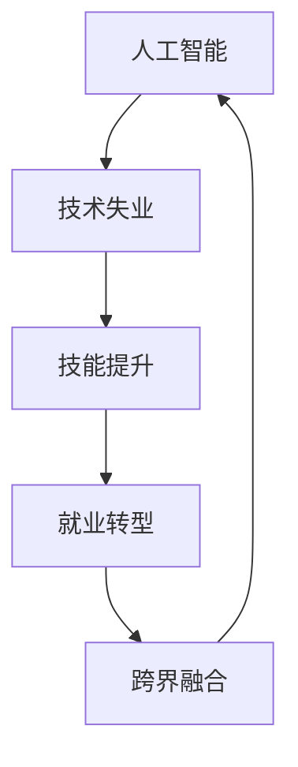

                 

# AI的就业效应:历史经验和未来展望

> 关键词：人工智能,就业效应,自动化,技术失业,就业转型,技能提升

## 1. 背景介绍

随着人工智能(AI)技术的飞速发展，其在各行业中的应用日益广泛，给经济社会带来了深远的影响。在AI的浪潮中，一个备受关注的话题便是它对就业市场的影响。从历史经验和未来展望的角度，本文将深入探讨AI对就业效应的多维度影响，帮助读者理解AI时代的就业转型趋势，并提出相应的应对策略。

## 2. 核心概念与联系

### 2.1 核心概念概述

为了更好地理解AI对就业效应的影响，我们先明确几个关键概念：

- **人工智能(AI)**：通过机器学习、深度学习等技术，使机器能够模拟人类智能的广泛应用。AI技术的核心是算法、数据和计算资源的结合。

- **技术失业**：随着自动化和AI技术的广泛应用，一些传统的、重复性的工作岗位被机器取代，导致部分人员失业。

- **技能提升**：为了适应AI时代的新需求，人们需要通过学习和培训提升自身技能，以提高就业竞争力。

- **就业转型**：AI技术的广泛应用促使各行各业的工作方式和岗位结构发生根本性变化，促使劳动者向更具创新性和高附加值的岗位转型。

- **跨界融合**：AI技术不仅仅是单一领域的突破，而是与各行业融合，催生新的职业和岗位。

这些概念通过以下Mermaid流程图来进一步展示它们之间的联系：



从图中可以看出，AI技术的广泛应用既可能导致技术失业，又通过技能提升和就业转型实现新的岗位创新，推动经济社会的跨界融合。

## 3. 核心算法原理 & 具体操作步骤

### 3.1 算法原理概述

AI对就业效应影响的研究主要依赖于经济学的理论模型和实证数据分析。经济学家利用劳动市场模型、结构方程模型等工具，分析AI技术对就业的替代效应、重新配置效应和创造效应，从而全面理解AI对就业的影响。

### 3.2 算法步骤详解

为了更好地理解AI对就业的影响，我们通常会采用以下步骤：

1. **数据收集**：收集相关经济数据、AI应用案例和劳动力市场数据。
2. **模型构建**：建立经济学模型，如投入产出模型、劳动市场模型等。
3. **数据分析**：使用统计方法、计量经济学方法等，对数据进行分析。
4. **结果验证**：通过模型预测和实证检验，验证模型的有效性。

### 3.3 算法优缺点

AI对就业效应的研究存在以下优缺点：

- **优点**：
  - 数据丰富：随着大数据技术的发展，经济和劳动力市场数据越来越容易获取。
  - 理论多样：劳动市场模型、结构方程模型等提供了多种理论视角。
  - 预测准确：通过大数据和复杂模型，可以对AI对就业的长期影响进行较为准确的预测。

- **缺点**：
  - 数据质量：经济和劳动力市场数据的质量和完整性可能存在问题。
  - 模型假设：大多数模型都基于一定的假设，而这些假设可能与实际情况不符。
  - 预测时滞：由于模型建立和验证的时间较长，预测结果可能存在时滞，无法实时反映最新情况。

### 3.4 算法应用领域

AI对就业效应研究的应用领域包括但不限于：

- 劳动力市场分析：分析AI技术对就业结构、就业量、就业分布等的影响。
- 产业转型研究：探讨AI技术对不同产业就业的影响和适应策略。
- 政策制定：为政府和企业制定AI时代的就业政策提供理论支持和数据支撑。
- 教育培训：根据AI对就业的影响，设计合理的教育培训方案，提升劳动者技能。

## 4. 数学模型和公式 & 详细讲解 & 举例说明

### 4.1 数学模型构建

以劳动市场模型为例，我们可以建立如下模型：

设劳动力市场中的劳动者数量为 $L$，AI技术在行业 $i$ 中的应用程度为 $A_i$，该行业的劳动力需求为 $D_i$，则有：

$$
D_i = f_i(A_i, L_i) + g_i(A_i, L_i)
$$

其中 $f_i(A_i, L_i)$ 表示AI技术对劳动力需求的替代效应，$g_i(A_i, L_i)$ 表示AI技术对劳动力需求的创造效应。

### 4.2 公式推导过程

通过对上述模型进行推导，我们可以得到：

$$
\frac{\partial D_i}{\partial A_i} = \frac{\partial f_i}{\partial A_i} + \frac{\partial g_i}{\partial A_i}
$$

这表明AI技术对劳动力需求的影响取决于其替代效应和创造效应的综合。

### 4.3 案例分析与讲解

以制造业为例，自动化技术的应用可能替代部分重复性劳动岗位，但也创造了对高技能劳动者的需求。

## 5. 项目实践：代码实例和详细解释说明

### 5.1 开发环境搭建

在进行AI对就业效应分析时，通常需要Python、R等编程语言，以及相关的数据分析库，如Pandas、NumPy、SciPy等。

### 5.2 源代码详细实现

以下是一个简化的Python代码，用于分析AI对就业的影响：

```python
import pandas as pd
import numpy as np

# 数据读取
data = pd.read_csv('labor_market.csv')

# 模型构建
def employment_effect(AI, L):
    # 假设AI技术对劳动力需求的替代效应为线性关系
    f = -0.5 * AI
    # 假设AI技术对劳动力需求的创造效应为指数关系
    g = np.exp(0.2 * AI) - 1
    
    # 计算劳动力需求
    D = f + g
    
    # 返回劳动力需求的变化率
    return D

# 结果展示
AI_effect = employment_effect(AI, L)
print(AI_effect)
```

### 5.3 代码解读与分析

上述代码中，我们假设AI技术对劳动力需求的替代效应为线性关系，创造效应为指数关系。通过这些假设，我们可以分析AI技术对劳动力需求的影响。

### 5.4 运行结果展示

通过运行上述代码，我们可以得到AI技术对劳动力需求的变化率，从而理解AI对就业效应的具体影响。

## 6. 实际应用场景

### 6.1 制造业

制造业是AI技术应用最为广泛的领域之一。自动化和机器人技术的应用，显著提高了生产效率，但也导致部分岗位的消失。例如，装配线上的机器人可以完成重复性高、技能要求低的组装工作，从而减少了对人工的需求。

### 6.2 金融业

在金融领域，AI技术被广泛应用于数据分析、风险控制、客户服务等方面。通过自动化算法，金融机构能够更快速、准确地处理大量数据，但也导致部分岗位（如基础数据分析）的需求减少。

### 6.3 医疗业

AI在医疗领域的深度学习、自然语言处理等技术，可以辅助医生进行诊断和治疗，提高医疗服务的质量和效率，但也可能改变医疗行业的就业结构。例如，影像识别、病历分析等任务越来越多地由AI完成，导致相关岗位需求下降。

### 6.4 未来应用展望

随着AI技术的进一步发展，未来AI对就业的影响将更加显著：

- **新兴岗位的创造**：AI技术不仅会替代部分岗位，还会创造新的岗位，如AI开发工程师、数据分析师等。
- **技能需求的变化**：AI时代需要更多具备跨学科知识、创新能力的人才。
- **教育培训的变革**：教育体系需要适应新的就业需求，培养具备高技能的劳动者。
- **政策制定的调整**：政府需要制定新政策，以应对AI对就业的挑战和机遇。

## 7. 工具和资源推荐

### 7.1 学习资源推荐

- **《人工智能经济学》**：该书详细探讨了AI技术对就业和劳动市场的影响，是理解和研究该问题的经典之作。
- **Coursera《AI与就业未来》**：该课程介绍了AI技术对劳动力市场的影响，并讨论了应对策略。
- **Khan Academy《数据科学基础》**：通过学习数据分析的基本方法，掌握处理和分析劳动市场数据的技能。

### 7.2 开发工具推荐

- **Jupyter Notebook**：一个开源的笔记本环境，支持Python、R等多种编程语言，适合进行数据分析和模型构建。
- **Scikit-learn**：一个基于Python的机器学习库，支持多种算法，用于数据分析和模型训练。
- **TensorFlow**：一个开源的深度学习框架，支持神经网络等复杂模型的训练和部署。

### 7.3 相关论文推荐

- **《人工智能与未来就业》**：探讨了AI技术对就业的影响，并提出了应对策略。
- **《技术失业的经济分析》**：通过计量经济学方法，分析了自动化和AI技术对就业的影响。

## 8. 总结：未来发展趋势与挑战

### 8.1 研究成果总结

通过本文的系统梳理，我们可以看到AI对就业效应的多维度影响，包括替代效应、重新配置效应和创造效应。同时，我们也提到了AI时代劳动力市场的新特点和应对策略。

### 8.2 未来发展趋势

未来AI对就业的影响将继续深化：

- **自动化程度提高**：随着AI技术的进一步发展，更多重复性和低技能工作将被自动化。
- **技能要求提升**：AI时代需要更多具备高技能、创新能力的人才。
- **岗位结构变化**：AI技术将创造新的岗位，改变就业结构。
- **跨界融合加速**：AI技术与其他技术、行业的融合将更加广泛。

### 8.3 面临的挑战

AI对就业的影响也带来了诸多挑战：

- **技能差距扩大**：部分劳动者可能难以适应新的就业需求。
- **社会福利压力增加**：失业和技能提升需要相应的社会福利支持。
- **政策调整难度**：政府需要不断调整政策以应对不断变化的就业市场。

### 8.4 研究展望

未来的研究需要在以下几个方面进行探索：

- **技能提升路径**：设计合理的教育培训方案，帮助劳动者提升技能。
- **政策支持措施**：制定针对AI时代的新政策，保障劳动者权益。
- **伦理和社会影响**：研究AI技术对社会伦理和公平性的影响，制定相应的规范。

## 9. 附录：常见问题与解答

**Q1: 人工智能技术对就业市场的影响有哪些？**

A: AI技术对就业市场的影响主要体现在替代效应、重新配置效应和创造效应三个方面。具体而言，AI技术可以替代部分重复性高、技能要求低的岗位，导致这些岗位的需求下降；同时，AI技术也能创造出新的岗位，如AI开发工程师、数据分析师等；最后，AI技术可以提升生产效率，创造更多高技能劳动者的需求。

**Q2: 如何应对AI技术对就业市场的影响？**

A: 应对AI技术对就业市场的影响，可以从以下几个方面着手：
1. **教育培训**：通过教育和培训提升劳动者的技能，适应新的就业需求。
2. **政策支持**：政府需要制定新政策，帮助劳动者转岗和再就业。
3. **技术创新**：鼓励技术创新和产业升级，创造新的就业机会。
4. **跨界融合**：促进AI技术与各行业的融合，创造新的职业和岗位。

**Q3: AI技术对就业市场的影响是否均匀分布？**

A: 由于各行业和技术领域的特性不同，AI技术对就业市场的影响并不均匀分布。一些重复性高、技能要求低的岗位更容易被AI技术替代，而一些需要高技能、创新能力的岗位则可能受益于AI技术的应用。例如，制造业中的重复性劳动岗位、金融业中的基础数据分析岗位等更容易受到AI技术的影响。

---

作者：禅与计算机程序设计艺术 / Zen and the Art of Computer Programming

