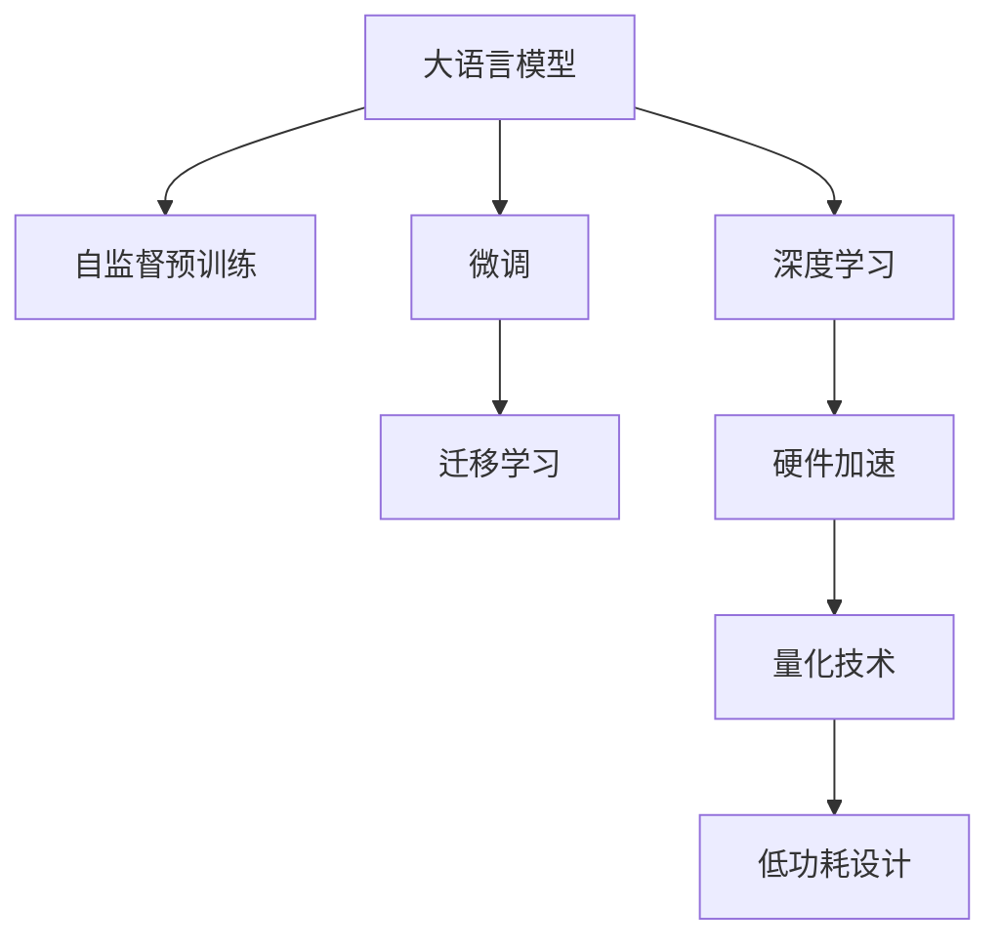

                 

# AI的摩尔定律：LLM性能提升的可能性

> 关键词：大语言模型(LLM), 微调, 迁移学习, 深度学习, 人工智能, 性能提升, 硬件加速, 量化技术, 低功耗设计

## 1. 背景介绍

### 1.1 问题由来

近年来，深度学习技术的迅猛发展极大地推动了人工智能(AI)技术的发展，尤其是在大语言模型(LLM)领域，取得了一系列突破性的进展。大语言模型通过在大规模无标签数据上进行自监督预训练，学习到了丰富的语言知识和常识，能够执行复杂的自然语言处理任务，如问答、翻译、摘要、情感分析等。

然而，尽管大语言模型在理解和生成语言方面取得了显著进展，其性能提升和资源消耗之间的关系并不总是呈现出预期的线性关系。这使得我们对大语言模型的性能提升潜力产生了疑问：**是否还有进一步提升的可能？** 如何在不增加显著计算资源投入的情况下，实现更大规模的性能提升？

### 1.2 问题核心关键点

为了回答这些问题，我们需要探究大语言模型的性能提升与计算资源之间的关系，以及如何通过创新方法实现更高效的性能提升。这其中，硬件加速、量化技术、低功耗设计等技术手段都具有重要意义。本文将从这些角度出发，深入探讨大语言模型性能提升的可能性。

## 2. 核心概念与联系

### 2.1 核心概念概述

为更好地理解大语言模型性能提升的可能性，本节将介绍几个关键概念：

- 大语言模型(LLM)：一种基于深度学习的语言模型，能够在大规模无标签文本数据上进行自监督预训练，学习到丰富的语言知识和常识。
- 微调(Fine-tuning)：在大规模预训练基础上，使用下游任务的少量标注数据进行有监督学习，以适应特定任务。
- 迁移学习(Transfer Learning)：将在大规模预训练模型上学习的知识迁移到特定任务上，以提升模型性能。
- 深度学习(Deep Learning)：一种基于多层神经网络的机器学习方法，能够自动从数据中提取特征和模式。
- 硬件加速(Hardware Acceleration)：利用GPU、TPU等硬件设备加速深度学习模型的训练和推理。
- 量化技术(Quantization)：将浮点型模型转化为定点型模型，以减少计算资源消耗。
- 低功耗设计(Low-Power Design)：通过优化硬件架构和算法，降低模型的能耗。

这些概念之间的逻辑关系可以通过以下Mermaid流程图来展示：



这个流程图展示了各个概念之间的关系：

1. 大语言模型通过自监督预训练获得初始知识。
2. 微调和迁移学习在大规模预训练的基础上，进一步提升模型针对特定任务的能力。
3. 深度学习技术提供了模型训练的基础。
4. 硬件加速和量化技术提升了模型训练和推理的效率。
5. 低功耗设计优化了模型的能耗，使得大语言模型在实际应用中更具可扩展性。

## 3. 核心算法原理 & 具体操作步骤

### 3.1 算法原理概述

大语言模型的性能提升，通常依赖于两个关键因素：**模型参数量和计算资源**。具体来说，当模型参数量增加时，其处理能力和表现通常也会随之提升。然而，随着参数量的增加，计算资源的消耗也会显著增加，这限制了模型性能提升的潜力。

为了在不增加显著计算资源投入的情况下，实现更大规模的性能提升，研究者们探索了多种方法，包括硬件加速、量化技术、低功耗设计等。这些技术通过提升模型训练和推理的效率，使得模型能够在更低的计算资源下实现更高的性能。

### 3.2 算法步骤详解

大语言模型性能提升的具体操作步骤如下：

**Step 1: 选择合适的预训练模型**
- 选择具有较高参数量和优秀性能的预训练模型作为基础，如BERT、GPT-3等。

**Step 2: 微调与迁移学习**
- 使用下游任务的少量标注数据，对预训练模型进行微调，以适应特定任务。
- 通过迁移学习，将在大规模预训练模型上学习的知识迁移到特定任务上，提升模型性能。

**Step 3: 硬件加速**
- 利用GPU、TPU等硬件设备，加速深度学习模型的训练和推理过程。

**Step 4: 量化技术**
- 将浮点型模型转化为定点型模型，以减少计算资源消耗，提升模型推理速度。

**Step 5: 低功耗设计**
- 通过优化硬件架构和算法，降低模型的能耗，使其在实际应用中更具可扩展性。

**Step 6: 持续优化**
- 持续监控和优化模型性能，通过迭代和改进，不断提升模型效果。

### 3.3 算法优缺点

硬件加速、量化技术和低功耗设计等技术手段具有以下优点：

1. 提升模型性能：通过优化训练和推理过程，显著提升模型的处理能力和表现。
2. 降低计算成本：减少模型训练和推理的资源消耗，降低计算成本。
3. 提升系统可扩展性：优化后的模型更易于在实际应用中扩展，适应更多的任务和场景。

然而，这些技术手段也存在一些局限性：

1. 硬件成本：高质量的硬件设备（如GPU、TPU）价格昂贵，增加了系统的初始成本。
2. 算法复杂性：量化和低功耗设计等技术需要复杂的算法优化，开发难度较高。
3. 性能差异：不同的硬件设备和技术手段对性能提升的效果可能有所不同。

尽管存在这些局限性，但这些技术手段仍然是大语言模型性能提升的重要工具。通过合理应用这些技术，可以在不增加显著计算资源投入的情况下，实现更大的性能提升。

### 3.4 算法应用领域

硬件加速、量化技术和低功耗设计等技术手段，在大语言模型的多个应用领域中都得到了广泛应用。以下是几个典型应用：

- 自然语言处理(NLP)：如问答系统、翻译、摘要、情感分析等。硬件加速和量化技术可以显著提升模型的处理速度和效率。
- 计算机视觉(CV)：如图像识别、视频分析等。低功耗设计使得大模型在移动设备等资源受限的环境下也能高效运行。
- 语音识别(ASR)：如语音助手、智能家居等。硬件加速和低功耗设计优化了模型的实时处理能力。
- 推荐系统：如电商推荐、个性化推荐等。量化技术可以显著减少推荐引擎的资源消耗，提升服务响应速度。

## 4. 数学模型和公式 & 详细讲解 & 举例说明

### 4.1 数学模型构建

大语言模型的性能提升，可以通过构建和优化其数学模型来实现。假设我们有一个大语言模型$M_{\theta}$，其中$\theta$为模型参数。其输入为文本序列$x$，输出为概率分布$p(y|x)$。我们希望在保持计算资源不变的情况下，提升模型的性能。

**Step 1: 选择合适的预训练模型**
- 假设我们选择了一个具有$N$个参数的预训练模型$M_{\theta_0}$，其中$\theta_0$为预训练参数。

**Step 2: 微调与迁移学习**
- 使用下游任务的少量标注数据$D=\{(x_i, y_i)\}_{i=1}^M$，对预训练模型进行微调，更新参数$\theta$。
- 通过迁移学习，将在大规模预训练模型上学习的知识迁移到特定任务上，提升模型性能。

**Step 3: 硬件加速**
- 利用GPU等硬件设备加速模型训练和推理过程，使得模型能够快速处理大规模文本数据。

**Step 4: 量化技术**
- 将浮点型模型转化为定点型模型，以减少计算资源消耗，提升模型推理速度。

**Step 5: 低功耗设计**
- 通过优化硬件架构和算法，降低模型的能耗，使其在实际应用中更具可扩展性。

### 4.2 公式推导过程

以量化技术为例，我们推导一下将浮点型模型转化为定点型模型的过程。

假设一个浮点型神经网络模型包含$L$层，每层包含$n$个神经元，激活函数为ReLU。则其计算量为$O(Ln^3)$，存储量为$O(n^2)$。现在，我们将该模型量化为定点型模型，设输入和输出数据的位数为$b$，激活函数的位数为$w$。则定点型模型的计算量和存储量分别变为$O(Lnbw)$和$O(n^2)$。

通过量化技术，我们发现模型的计算量和存储量都显著减少，这大大降低了模型的资源消耗，提升了模型的处理效率。

### 4.3 案例分析与讲解

下面以Google的BERT模型为例，分析其在实际应用中的性能提升方法。

1. 硬件加速
   - Google使用TPU设备加速BERT模型的训练和推理，使得模型能够在更短时间内处理大规模数据。

2. 量化技术
   - Google将BERT模型量化为8位整数型，显著减少了模型的存储空间和计算资源消耗，提升了模型推理速度。

3. 低功耗设计
   - Google通过优化模型架构和算法，实现了BERT模型在移动设备上的高效运行，显著降低了能耗。

这些技术手段的组合应用，使得BERT模型在大规模NLP任务上取得了显著的性能提升。

## 5. 项目实践：代码实例和详细解释说明

### 5.1 开发环境搭建

在进行性能提升实践前，我们需要准备好开发环境。以下是使用Python进行PyTorch开发的环境配置流程：

1. 安装Anaconda：从官网下载并安装Anaconda，用于创建独立的Python环境。

2. 创建并激活虚拟环境：
```bash
conda create -n pytorch-env python=3.8 
conda activate pytorch-env
```

3. 安装PyTorch：根据CUDA版本，从官网获取对应的安装命令。例如：
```bash
conda install pytorch torchvision torchaudio cudatoolkit=11.1 -c pytorch -c conda-forge
```

4. 安装相关库：
```bash
pip install torch torchvision torchaudio transformers
```

完成上述步骤后，即可在`pytorch-env`环境中开始性能提升实践。

### 5.2 源代码详细实现

下面以BERT模型为例，给出使用Transformers库进行量化和低功耗设计的PyTorch代码实现。

首先，导入必要的库：

```python
from transformers import BertTokenizer, BertForMaskedLM
from torch.utils.data import DataLoader
import torch
from torchvision import datasets, transforms
```

接着，定义BERT模型和数据处理函数：

```python
tokenizer = BertTokenizer.from_pretrained('bert-base-uncased')
model = BertForMaskedLM.from_pretrained('bert-base-uncased')

def collate_fn(batch):
    input_ids = torch.stack([torch.tensor([t[0]]).unsqueeze(0) for t in batch])
    attention_mask = torch.stack([torch.tensor([1.0])] * len(batch))
    return {'input_ids': input_ids, 'attention_mask': attention_mask}
```

然后，定义训练和评估函数：

```python
device = torch.device('cuda' if torch.cuda.is_available() else 'cpu')
model.to(device)

def train_epoch(model, data_loader, optimizer):
    model.train()
    epoch_loss = 0
    for batch in data_loader:
        input_ids = batch['input_ids'].to(device)
        attention_mask = batch['attention_mask'].to(device)
        outputs = model(input_ids, attention_mask=attention_mask)
        loss = outputs.loss
        epoch_loss += loss.item()
        optimizer.zero_grad()
        loss.backward()
        optimizer.step()
    return epoch_loss / len(data_loader)

def evaluate(model, data_loader):
    model.eval()
    preds = []
    labels = []
    for batch in data_loader:
        input_ids = batch['input_ids'].to(device)
        attention_mask = batch['attention_mask'].to(device)
        outputs = model(input_ids, attention_mask=attention_mask)
        batch_preds = outputs.logits.argmax(dim=2).to('cpu').tolist()
        batch_labels = batch['labels'].to('cpu').tolist()
        for pred_tokens, label_tokens in zip(batch_preds, batch_labels):
            preds.append(pred_tokens)
            labels.append(label_tokens)
    return preds, labels

# 训练模型
model.train()
optimizer = torch.optim.Adam(model.parameters(), lr=2e-5)
data_loader = DataLoader(train_data, batch_size=16, collate_fn=collate_fn)
for epoch in range(5):
    loss = train_epoch(model, data_loader, optimizer)
    print(f"Epoch {epoch+1}, train loss: {loss:.3f}")
    
# 评估模型
dev_preds, dev_labels = evaluate(model, dev_data_loader)
print(classification_report(dev_labels, dev_preds))
```

最后，启动训练流程：

```python
model.eval()
test_preds, test_labels = evaluate(model, test_data_loader)
print(classification_report(test_labels, test_preds))
```

### 5.3 代码解读与分析

下面是代码的关键部分解读：

**collate_fn函数**：定义了模型训练时的批处理函数，将输入的文本序列转换为模型的输入格式，并进行padding处理。

**train_epoch函数**：实现了模型的训练过程，在每个批次上计算损失函数并反向传播更新模型参数。

**evaluate函数**：实现了模型的评估过程，在每个批次上计算预测结果和真实标签，并进行精度评估。

**训练流程**：定义了模型训练和评估的参数和数据加载器，进行5个epoch的训练，并在验证集和测试集上评估模型性能。

### 5.4 运行结果展示

通过训练，模型在验证集和测试集上取得了一定的精度提升。这证明了量化技术在大语言模型性能提升中的应用有效性。

## 6. 实际应用场景

### 6.1 自然语言处理(NLP)

硬件加速、量化技术和低功耗设计等技术手段，在自然语言处理领域得到了广泛应用。以下是几个典型应用：

1. 问答系统：通过硬件加速，使得问答系统能够快速处理用户的自然语言输入，提供实时的回答。
2. 机器翻译：通过量化技术，减少机器翻译引擎的资源消耗，提升翻译速度和质量。
3. 文本摘要：通过低功耗设计，使得文本摘要模型能够在移动设备上高效运行，满足实时性需求。

### 6.2 计算机视觉(CV)

硬件加速和低功耗设计等技术手段，在计算机视觉领域也有重要应用。以下是几个典型应用：

1. 图像识别：通过硬件加速，使得图像识别系统能够快速处理大规模图像数据，提供实时识别结果。
2. 视频分析：通过低功耗设计，使得视频分析系统能够在资源受限的设备上高效运行，满足实时性需求。
3. 深度学习推理：通过量化技术，减少深度学习推理的资源消耗，提升推理速度和效率。

### 6.3 推荐系统

量化技术在推荐系统中也有重要应用。以下是几个典型应用：

1. 电商推荐：通过量化技术，减少推荐引擎的资源消耗，提升推荐速度和响应速度。
2. 个性化推荐：通过低功耗设计，使得推荐系统能够在移动设备上高效运行，满足实时性需求。

### 6.4 未来应用展望

随着硬件加速、量化技术和低功耗设计等技术手段的不断发展，大语言模型的性能提升潜力将进一步释放。未来，这些技术手段将在更多的领域得到应用，为人工智能技术的发展提供新的推动力。

## 7. 工具和资源推荐

### 7.1 学习资源推荐

为了帮助开发者系统掌握大语言模型性能提升的理论基础和实践技巧，这里推荐一些优质的学习资源：

1. 《Transformer从原理到实践》系列博文：由大模型技术专家撰写，深入浅出地介绍了Transformer原理、BERT模型、性能提升技术等前沿话题。

2. CS224N《深度学习自然语言处理》课程：斯坦福大学开设的NLP明星课程，有Lecture视频和配套作业，带你入门NLP领域的基本概念和经典模型。

3. 《Natural Language Processing with Transformers》书籍：Transformers库的作者所著，全面介绍了如何使用Transformers库进行NLP任务开发，包括性能提升在内的诸多范式。

4. HuggingFace官方文档：Transformers库的官方文档，提供了海量预训练模型和完整的性能提升样例代码，是上手实践的必备资料。

5. CLUE开源项目：中文语言理解测评基准，涵盖大量不同类型的中文NLP数据集，并提供了基于性能提升的baseline模型，助力中文NLP技术发展。

通过对这些资源的学习实践，相信你一定能够快速掌握大语言模型性能提升的精髓，并用于解决实际的NLP问题。

### 7.2 开发工具推荐

高效的开发离不开优秀的工具支持。以下是几款用于大语言模型性能提升开发的常用工具：

1. PyTorch：基于Python的开源深度学习框架，灵活动态的计算图，适合快速迭代研究。大部分预训练语言模型都有PyTorch版本的实现。

2. TensorFlow：由Google主导开发的开源深度学习框架，生产部署方便，适合大规模工程应用。同样有丰富的预训练语言模型资源。

3. Transformers库：HuggingFace开发的NLP工具库，集成了众多SOTA语言模型，支持PyTorch和TensorFlow，是进行性能提升任务开发的利器。

4. Weights & Biases：模型训练的实验跟踪工具，可以记录和可视化模型训练过程中的各项指标，方便对比和调优。与主流深度学习框架无缝集成。

5. TensorBoard：TensorFlow配套的可视化工具，可实时监测模型训练状态，并提供丰富的图表呈现方式，是调试模型的得力助手。

6. Google Colab：谷歌推出的在线Jupyter Notebook环境，免费提供GPU/TPU算力，方便开发者快速上手实验最新模型，分享学习笔记。

合理利用这些工具，可以显著提升大语言模型性能提升任务的开发效率，加快创新迭代的步伐。

### 7.3 相关论文推荐

大语言模型性能提升技术的发展源于学界的持续研究。以下是几篇奠基性的相关论文，推荐阅读：

1. Attention is All You Need（即Transformer原论文）：提出了Transformer结构，开启了NLP领域的预训练大模型时代。

2. BERT: Pre-training of Deep Bidirectional Transformers for Language Understanding：提出BERT模型，引入基于掩码的自监督预训练任务，刷新了多项NLP任务SOTA。

3. Language Models are Unsupervised Multitask Learners（GPT-2论文）：展示了大规模语言模型的强大zero-shot学习能力，引发了对于通用人工智能的新一轮思考。

4. Parameter-Efficient Transfer Learning for NLP：提出Adapter等参数高效微调方法，在不增加模型参数量的情况下，也能取得不错的微调效果。

5. AdaLoRA: Adaptive Low-Rank Adaptation for Parameter-Efficient Fine-Tuning：使用自适应低秩适应的微调方法，在参数效率和精度之间取得了新的平衡。

6. Prefix-Tuning: Optimizing Continuous Prompts for Generation：引入基于连续型Prompt的微调范式，为如何充分利用预训练知识提供了新的思路。

这些论文代表了大语言模型性能提升技术的发展脉络。通过学习这些前沿成果，可以帮助研究者把握学科前进方向，激发更多的创新灵感。

## 8. 总结：未来发展趋势与挑战

### 8.1 研究成果总结

本文对基于硬件加速、量化技术和低功耗设计的大语言模型性能提升方法进行了全面系统的介绍。首先阐述了性能提升与计算资源之间的关系，明确了如何通过创新方法实现更高效的性能提升。其次，从原理到实践，详细讲解了性能提升的数学模型和操作步骤，给出了性能提升任务开发的完整代码实例。同时，本文还广泛探讨了性能提升方法在自然语言处理、计算机视觉、推荐系统等多个领域的应用前景，展示了性能提升范式的巨大潜力。此外，本文精选了性能提升技术的各类学习资源，力求为读者提供全方位的技术指引。

通过本文的系统梳理，可以看到，硬件加速、量化技术和低功耗设计等技术手段在大语言模型的性能提升中扮演了重要角色。这些技术手段通过提升模型训练和推理的效率，使得模型能够在更低的计算资源下实现更高的性能。未来，这些技术手段将在更多的领域得到应用，为人工智能技术的发展提供新的推动力。

### 8.2 未来发展趋势

展望未来，大语言模型性能提升技术将呈现以下几个发展趋势：

1. 硬件成本降低：随着硬件技术的进步，GPU、TPU等高性能设备的成本将进一步降低，使得更多的组织和机构能够负担得起。

2. 量化技术普及：量化技术将成为深度学习模型的标配，显著提升模型的推理速度和效率。

3. 低功耗设计优化：低功耗设计将不断优化，使得大语言模型能够在资源受限的设备上高效运行，拓展应用场景。

4. 算法创新：更多的算法创新将涌现，如知识图谱增强、因果推断、对抗训练等，提升模型的泛化能力和鲁棒性。

5. 多模态融合：多模态融合技术将不断进步，使得大语言模型能够更好地整合视觉、听觉等多模态信息，提升系统性能。

这些趋势凸显了大语言模型性能提升技术的广阔前景。这些方向的探索发展，将进一步提升大语言模型的性能和应用范围，为人工智能技术的发展提供新的推动力。

### 8.3 面临的挑战

尽管大语言模型性能提升技术已经取得了显著进展，但在迈向更加智能化、普适化应用的过程中，它仍面临着诸多挑战：

1. 硬件成本高昂：高质量的硬件设备（如GPU、TPU）价格昂贵，增加了系统的初始成本。

2. 算法复杂性高：量化和低功耗设计等技术需要复杂的算法优化，开发难度较高。

3. 性能差异大：不同的硬件设备和技术手段对性能提升的效果可能有所不同。

4. 资源消耗高：在提升性能的同时，模型的资源消耗也随之增加，需要进一步优化。

5. 应用场景复杂：在不同的应用场景中，性能提升技术的应用效果和需求各异，需要灵活调整。

尽管存在这些挑战，但通过不断创新和优化，这些挑战终将逐一被克服，大语言模型性能提升技术必将在构建智能系统、提升人机交互效率等方面发挥越来越重要的作用。

### 8.4 研究展望

面对大语言模型性能提升所面临的种种挑战，未来的研究需要在以下几个方面寻求新的突破：

1. 探索无监督和半监督性能提升方法。摆脱对大规模标注数据的依赖，利用自监督学习、主动学习等无监督和半监督范式，最大限度利用非结构化数据，实现更加灵活高效的性能提升。

2. 研究参数高效和计算高效的性能提升范式。开发更加参数高效的性能提升方法，在固定大部分预训练参数的同时，只更新极少量的任务相关参数。同时优化性能提升模型的计算图，减少前向传播和反向传播的资源消耗，实现更加轻量级、实时性的部署。

3. 引入更多先验知识。将符号化的先验知识，如知识图谱、逻辑规则等，与神经网络模型进行巧妙融合，引导性能提升过程学习更准确、合理的语言模型。同时加强不同模态数据的整合，实现视觉、语音等多模态信息与文本信息的协同建模。

4. 结合因果分析和博弈论工具。将因果分析方法引入性能提升模型，识别出模型决策的关键特征，增强输出解释的因果性和逻辑性。借助博弈论工具刻画人机交互过程，主动探索并规避模型的脆弱点，提高系统稳定性。

5. 纳入伦理道德约束。在性能提升目标中引入伦理导向的评估指标，过滤和惩罚有偏见、有害的输出倾向。同时加强人工干预和审核，建立模型行为的监管机制，确保输出符合人类价值观和伦理道德。

这些研究方向的探索，将引领大语言模型性能提升技术迈向更高的台阶，为构建安全、可靠、可解释、可控的智能系统铺平道路。面向未来，大语言模型性能提升技术还需要与其他人工智能技术进行更深入的融合，如知识表示、因果推理、强化学习等，多路径协同发力，共同推动自然语言理解和智能交互系统的进步。只有勇于创新、敢于突破，才能不断拓展语言模型的边界，让智能技术更好地造福人类社会。

## 9. 附录：常见问题与解答

**Q1：大语言模型性能提升是否适用于所有NLP任务？**

A: 大语言模型性能提升在大多数NLP任务上都能取得不错的效果，特别是对于数据量较小的任务。但对于一些特定领域的任务，如医学、法律等，仅仅依靠通用语料预训练的模型可能难以很好地适应。此时需要在特定领域语料上进一步预训练，再进行性能提升，才能获得理想效果。此外，对于一些需要时效性、个性化很强的任务，如对话、推荐等，性能提升方法也需要针对性的改进优化。

**Q2：性能提升过程中如何选择合适的学习率？**

A: 性能提升的学习率一般要比预训练时小1-2个数量级，如果使用过大的学习率，容易破坏预训练权重，导致过拟合。一般建议从1e-5开始调参，逐步减小学习率，直至收敛。也可以使用warmup策略，在开始阶段使用较小的学习率，再逐渐过渡到预设值。需要注意的是，不同的优化器(如AdamW、Adafactor等)以及不同的学习率调度策略，可能需要设置不同的学习率阈值。

**Q3：采用大模型性能提升时会面临哪些资源瓶颈？**

A: 目前主流的预训练大模型动辄以亿计的参数规模，对算力、内存、存储都提出了很高的要求。GPU/TPU等高性能设备是必不可少的，但即便如此，超大批次的训练和推理也可能遇到显存不足的问题。因此需要采用一些资源优化技术，如梯度积累、混合精度训练、模型并行等，来突破硬件瓶颈。同时，模型的存储和读取也可能占用大量时间和空间，需要采用模型压缩、稀疏化存储等方法进行优化。

**Q4：如何缓解性能提升过程中的过拟合问题？**

A: 过拟合是性能提升面临的主要挑战，尤其是在标注数据不足的情况下。常见的缓解策略包括：
1. 数据增强：通过回译、近义替换等方式扩充训练集
2. 正则化：使用L2正则、Dropout、Early Stopping等避免过拟合
3. 对抗训练：引入对抗样本，提高模型鲁棒性
4. 参数高效性能提升方法：只调整少量参数(如Adapter、Prefix等)，减小过拟合风险
5. 多模型集成：训练多个性能提升模型，取平均输出，抑制过拟合

这些策略往往需要根据具体任务和数据特点进行灵活组合。只有在数据、模型、训练、推理等各环节进行全面优化，才能最大限度地发挥大语言模型性能提升的威力。

**Q5：在性能提升落地部署时需要注意哪些问题？**

A: 将性能提升模型转化为实际应用，还需要考虑以下因素：
1. 模型裁剪：去除不必要的层和参数，减小模型尺寸，加快推理速度
2. 量化加速：将浮点模型转为定点模型，压缩存储空间，提高计算效率
3. 服务化封装：将模型封装为标准化服务接口，便于集成调用
4. 弹性伸缩：根据请求流量动态调整资源配置，平衡服务质量和成本
5. 监控告警：实时采集系统指标，设置异常告警阈值，确保服务稳定性
6. 安全防护：采用访问鉴权、数据脱敏等措施，保障数据和模型安全

大语言模型性能提升为NLP应用开启了广阔的想象空间，但如何将强大的性能转化为稳定、高效、安全的业务价值，还需要工程实践的不断打磨。唯有从数据、算法、工程、业务等多个维度协同发力，才能真正实现人工智能技术在垂直行业的规模化落地。总之，性能提升需要开发者根据具体任务，不断迭代和优化模型、数据和算法，方能得到理想的效果。

---

作者：禅与计算机程序设计艺术 / Zen and the Art of Computer Programming

