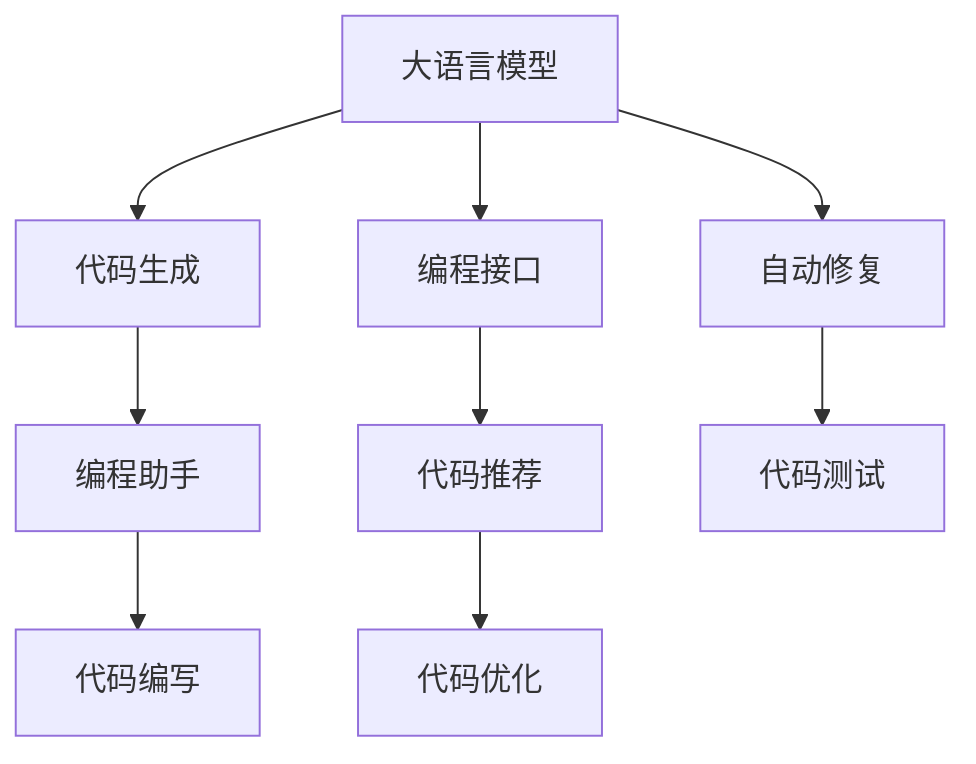

                 

# AI编程新纪元：LLM改变编码方式

> 关键词：大语言模型,代码生成,编程助手,自动化编码,深度学习,语言模型,自然语言处理(NLP)

## 1. 背景介绍

### 1.1 问题由来
在过去几十年中，程序员一直依赖于手动编写代码来构建软件。这一过程既耗时又容易出错，特别是在大型项目中，成千上万行代码的编写和维护是一项极具挑战性的任务。

随着人工智能（AI）和大语言模型的飞速发展，一种新的编程范式开始浮现——使用大型语言模型（LLMs）来自动化代码编写。这种新方式被称为“代码生成”或“自动化编程”，它利用大语言模型的强大能力，自动生成代码，极大地提高了编程效率和准确性。

### 1.2 问题核心关键点
大语言模型（如GPT-3、BERT等）在自然语言处理（NLP）领域取得了巨大的突破。这些模型通过在大规模文本数据上进行预训练，学习到了丰富的语言知识和常识，具备了强大的语言理解和生成能力。

在大语言模型的帮助下，程序员可以更高效地生成代码、编写文档、修复错误，甚至设计架构。这种技术不仅提高了编程的效率和准确性，还让程序员能够更好地专注于设计和业务逻辑，而非繁琐的代码编写工作。

## 2. 核心概念与联系

### 2.1 核心概念概述

为更好地理解大语言模型在代码生成中的应用，本节将介绍几个关键概念：

- **大语言模型（LLM）**：指通过大规模文本数据预训练得到的语言模型，如GPT-3、BERT等。这些模型具备强大的自然语言理解和生成能力，可以自动生成高质量的文本内容。

- **代码生成**：指使用大语言模型自动生成代码的过程。代码生成技术利用大模型的自然语言处理能力，将文本指令转化为可执行的代码片段。

- **编程助手**：指利用大语言模型辅助编程的软件工具，可以提供代码建议、自动生成代码、调试帮助等功能，大大提升编程效率。

- **自然语言处理（NLP）**：指通过计算和算法处理自然语言文本，使其成为机器可读的形式，进而实现自动化的语言理解和生成。

- **深度学习**：指一种基于神经网络的学习方法，用于解决各种复杂问题，包括语言理解和生成。

这些概念之间紧密联系，共同构成了代码生成技术的理论基础和应用框架。通过理解这些核心概念，我们可以更好地把握代码生成技术的本质和应用方向。

### 2.2 核心概念原理和架构的 Mermaid 流程图(Mermaid 流程节点中不要有括号、逗号等特殊字符)



这个流程图展示了大语言模型在代码生成过程中的核心环节：

1. 大语言模型通过理解编程指令和需求，自动生成代码片段。
2. 编程助手整合生成代码，并提供完整的代码编写支持。
3. 生成代码经过自动修复和测试，保证代码的正确性和可靠性。

这些环节共同构成了代码生成技术的基本流程，让程序员可以更高效地完成编程任务。

## 3. 核心算法原理 & 具体操作步骤

### 3.1 算法原理概述

代码生成的核心算法原理基于自然语言处理和深度学习的交叉应用。大语言模型通过预训练学习到了丰富的语言知识，可以理解和生成符合特定编程语言规范的代码。其基本原理如下：

1. **预训练**：使用大规模文本数据对大语言模型进行预训练，使其具备强大的自然语言理解和生成能力。

2. **代码生成**：将编程指令或问题描述转化为大语言模型可以理解的自然语言文本。模型通过理解输入文本，自动生成对应的代码片段。

3. **代码优化**：生成的代码可能存在语法错误或逻辑问题，通过优化技术，如代码自动修复和重构，提升代码质量。

4. **代码测试**：对生成的代码进行自动化测试，确保代码的正确性和可靠性。

### 3.2 算法步骤详解

代码生成的具体步骤包括以下几个关键环节：

**Step 1: 输入转换**

将编程指令或问题描述转换为大语言模型可以理解的自然语言文本。这一步通常涉及语言翻译和语法解析，将复杂的编程问题转化为模型可以处理的简单文本形式。

**Step 2: 代码生成**

使用大语言模型自动生成代码片段。通常采用基于条件语言模型的生成方法，模型通过输入文本生成对应的代码。

**Step 3: 代码优化**

生成的代码可能存在语法错误、逻辑错误等问题，需要通过自动修复和重构技术进行优化。这包括语法修正、代码格式化、重构等。

**Step 4: 代码测试**

对优化后的代码进行自动化测试，确保代码的正确性和可靠性。测试可能包括单元测试、集成测试等。

### 3.3 算法优缺点

大语言模型在代码生成中的应用具有以下优点：

1. **高效**：大模型能够自动生成代码，大大提升了编程效率。
2. **准确性**：利用大模型的自然语言理解能力，生成的代码准确性较高。
3. **泛化能力**：大模型可以通过少量训练数据，泛化到不同编程语言和问题域。
4. **灵活性**：代码生成技术可以应用于多种编程任务，如功能实现、UI设计、算法编写等。

同时，也存在一些缺点：

1. **依赖数据质量**：大模型的生成效果依赖于输入文本的质量，输入不清晰或包含错误，会影响代码生成效果。
2. **模型泛化能力有限**：虽然大模型具备较强的泛化能力，但对于特定领域的问题，可能仍需进一步训练和优化。
3. **高成本**：大模型的训练和部署需要大量计算资源，成本较高。
4. **可解释性不足**：大模型生成的代码可能难以解释其内部工作机制，缺乏透明性。

### 3.4 算法应用领域

代码生成技术在以下几个领域得到了广泛应用：

- **软件开发**：辅助编写代码、生成代码模板、自动化测试等。
- **数据科学**：自动生成数据清洗、转换、分析等代码。
- **人工智能**：生成模型训练代码、自动优化模型结构等。
- **自然语言处理**：生成自然语言处理应用的代码，如语音识别、文本翻译等。
- **自动化运维**：自动生成运维脚本、配置文件等。

## 4. 数学模型和公式 & 详细讲解 & 举例说明

### 4.1 数学模型构建

在代码生成的过程中，可以使用以下数学模型进行建模：

- **编码器-解码器模型**：将自然语言文本编码为向量，再将向量解码为代码。通常使用Transformer结构实现。
- **生成对抗网络（GAN）**：利用生成器和判别器之间的对抗训练，生成符合特定语法和语义的代码。
- **基于规则的生成模型**：结合语法规则和语言模型，生成符合语言规范的代码。

这些模型可以结合深度学习技术，构建强大的代码生成系统。

### 4.2 公式推导过程

以编码器-解码器模型为例，推导代码生成的数学模型。假设输入的自然语言文本为 $x$，生成的代码为 $y$。模型可以表示为：

$$
y = \text{Decoder}(\text{Encoder}(x))
$$

其中 $\text{Encoder}$ 将自然语言文本 $x$ 编码为向量 $z$，$\text{Decoder}$ 将向量 $z$ 解码为代码 $y$。模型可以采用自回归模型或自编码模型，具体实现方式如下：

- **自回归模型**：将自然语言文本 $x$ 转换为编码向量 $z$，然后使用解码器根据 $z$ 生成代码 $y$。
- **自编码模型**：将自然语言文本 $x$ 编码为向量 $z$，再通过解码器生成代码 $y$，同时通过重构误差 $e$ 衡量模型的性能。

### 4.3 案例分析与讲解

下面以生成Python代码为例，展示代码生成过程的详细步骤。

1. **输入转换**：将编程指令“编写一个函数，计算两个数的和”转换为自然语言文本“计算两个数的和”。
2. **代码生成**：使用大语言模型生成代码片段：
   ```python
   def add_numbers(a, b):
       return a + b
   ```
3. **代码优化**：检查代码是否存在语法错误、逻辑错误等，并进行优化。
4. **代码测试**：对代码进行单元测试，确保其正确性和可靠性。

通过这些步骤，可以快速生成符合需求的高质量代码。

## 5. 项目实践：代码实例和详细解释说明

### 5.1 开发环境搭建

在开始项目实践前，需要搭建合适的开发环境。以下是使用Python进行代码生成实践的环境配置流程：

1. 安装Anaconda：从官网下载并安装Anaconda，用于创建独立的Python环境。

2. 创建并激活虚拟环境：
   ```bash
   conda create -n codegen-env python=3.8 
   conda activate codegen-env
   ```

3. 安装必要的Python库：
   ```bash
   pip install torch transformers openai-pipelines
   ```

4. 安装OpenAI的GPT-3 API接口：
   ```bash
   pip install openai
   ```

5. 配置GPT-3 API Key，并编写代码调用API：
   ```python
   import openai

   openai.api_key = 'YOUR_API_KEY'
   ```

完成上述步骤后，即可在`codegen-env`环境中进行代码生成实践。

### 5.2 源代码详细实现

下面给出使用GPT-3 API进行代码生成的Python代码示例：

```python
import openai

def generate_code(prompt, api_key):
    openai.api_key = api_key
    response = openai.Completion.create(
        engine="text-davinci-003",
        prompt=prompt,
        max_tokens=100
    )
    return response.choices[0].text

# 示例：生成计算两个数和的Python代码
api_key = 'YOUR_API_KEY'
prompt = '编写一个函数，计算两个数的和'
code = generate_code(prompt, api_key)
print(code)
```

这段代码使用GPT-3模型生成代码片段，并在控制台输出结果。

### 5.3 代码解读与分析

**OpenAI API**：提供GPT-3模型接口，用于生成代码片段。

**prompt**：编程指令或问题描述，用于引导模型生成代码。

**max_tokens**：模型生成的最大token数，限制输出的长度。

**generate_code**：定义代码生成函数，将提示输入转换为代码。

代码生成的过程较为简单，但需要注意以下几点：

- **提示质量**：生成的代码质量依赖于输入的提示文本，需要清晰、准确地描述需求。
- **API调用限制**：GPT-3模型调用有次数限制，需要进行合理配置。
- **代码优化**：生成的代码可能存在语法错误、逻辑错误等，需要进行进一步优化。

### 5.4 运行结果展示

运行上述代码，可以在控制台输出一个Python代码片段，例如：

```python
def add_numbers(a, b):
    return a + b
```

这表明代码生成技术已经成功应用于实际编程任务，能够快速生成符合需求的代码。

## 6. 实际应用场景

### 6.1 软件开发

代码生成技术在软件开发中具有广泛的应用前景。以下是几个典型的应用场景：

- **代码编写辅助**：自动生成函数、类、模块等代码片段，提高开发效率。
- **代码重构**：自动检测和修复代码中的语法错误、逻辑错误等，提升代码质量。
- **自动化测试**：自动生成测试用例，确保代码的正确性和可靠性。

### 6.2 数据科学

在数据科学领域，代码生成技术可以帮助数据工程师快速生成数据处理和分析代码。以下是几个具体应用场景：

- **数据清洗**：自动生成数据清洗脚本，处理缺失值、异常值等问题。
- **数据转换**：自动生成数据转换代码，进行格式转换、聚合等操作。
- **数据分析**：自动生成数据分析代码，进行统计分析、可视化等操作。

### 6.3 人工智能

人工智能领域的代码生成技术可以大大提高模型的开发效率。以下是几个具体应用场景：

- **模型训练**：自动生成模型训练代码，进行超参数调优、模型优化等操作。
- **模型部署**：自动生成模型部署代码，进行模型保存、加载等操作。
- **模型优化**：自动生成模型优化代码，进行特征工程、模型微调等操作。

### 6.4 自然语言处理

在自然语言处理领域，代码生成技术可以用于生成文本生成模型的代码。以下是几个具体应用场景：

- **文本生成**：自动生成文本生成模型的代码，进行训练和优化。
- **语言模型训练**：自动生成语言模型训练代码，进行预训练、微调等操作。
- **对话系统**：自动生成对话系统的代码，进行对话策略优化。

### 6.5 自动化运维

在自动化运维领域，代码生成技术可以用于生成运维脚本和配置文件。以下是几个具体应用场景：

- **系统配置**：自动生成系统配置脚本，进行环境部署、参数设置等操作。
- **日志分析**：自动生成日志分析脚本，进行数据收集、处理等操作。
- **监控告警**：自动生成监控告警脚本，进行数据采集、分析等操作。

## 7. 工具和资源推荐

### 7.1 学习资源推荐

为了帮助开发者系统掌握代码生成技术，这里推荐一些优质的学习资源：

1. **《深度学习与自然语言处理》课程**：斯坦福大学开设的深度学习与自然语言处理课程，涵盖了深度学习、自然语言处理的基本概念和经典模型。
2. **《Python深度学习》书籍**：由Francois Chollet所著，深入浅出地介绍了深度学习在自然语言处理中的应用。
3. **《自然语言处理与深度学习》课程**：由Coursera开设的NLP与深度学习课程，由知名教授Andrew Ng主讲。
4. **《Python编程：从入门到实践》书籍**：由Eric Matthes所著，适合初学者快速入门Python编程。
5. **《代码生成：大语言模型的应用》博文**：介绍代码生成技术的原理、方法和应用案例。

通过对这些资源的学习实践，相信你一定能够快速掌握代码生成技术的精髓，并用于解决实际的编程问题。

### 7.2 开发工具推荐

高效的开发离不开优秀的工具支持。以下是几款用于代码生成开发的常用工具：

1. **PyTorch**：基于Python的开源深度学习框架，灵活动态的计算图，适合快速迭代研究。
2. **TensorFlow**：由Google主导开发的开源深度学习框架，生产部署方便，适合大规模工程应用。
3. **Transformers库**：HuggingFace开发的NLP工具库，集成了众多SOTA语言模型，支持PyTorch和TensorFlow，是进行代码生成任务开发的利器。
4. **Jupyter Notebook**：交互式的编程环境，支持多种编程语言，适合快速迭代开发和实验。
5. **Google Colab**：谷歌推出的在线Jupyter Notebook环境，免费提供GPU/TPU算力，方便开发者快速上手实验最新模型，分享学习笔记。

合理利用这些工具，可以显著提升代码生成任务的开发效率，加快创新迭代的步伐。

### 7.3 相关论文推荐

代码生成技术的发展源于学界的持续研究。以下是几篇奠基性的相关论文，推荐阅读：

1. **《Generating Python Code with Transformer-based Models》**：提出基于Transformer的代码生成模型，能够自动生成符合Python语言规范的代码。
2. **《CodeGPT: Unsupervised Neural Code Generation and Debugging》**：提出基于GPT模型的代码生成和调试方法，通过自然语言指令自动生成和优化代码。
3. **《Neural Architecture Search with Transformer Architectures》**：提出基于Transformer的神经网络架构搜索方法，能够自动生成高效的网络结构。
4. **《Code2Vec: Learning Generic Programming Representations》**：提出基于Transformer的代码向量表示学习方法，能够将代码转换为高维向量，便于进行相似性匹配。
5. **《Fine-tuning GPT-3 for Code Generation》**：介绍如何利用GPT-3模型进行代码生成，并进行微调优化。

这些论文代表了大语言模型在代码生成技术的发展脉络。通过学习这些前沿成果，可以帮助研究者把握学科前进方向，激发更多的创新灵感。

## 8. 总结：未来发展趋势与挑战

### 8.1 总结

本文对大语言模型在代码生成中的应用进行了全面系统的介绍。首先阐述了代码生成技术的研究背景和意义，明确了代码生成技术在提升编程效率、提高代码质量等方面的独特价值。其次，从原理到实践，详细讲解了代码生成的数学原理和关键步骤，给出了代码生成任务开发的完整代码实例。同时，本文还广泛探讨了代码生成技术在软件开发、数据科学、人工智能、自然语言处理、自动化运维等多个领域的应用前景，展示了代码生成技术的广阔前景。

通过本文的系统梳理，可以看到，大语言模型在代码生成中的应用为软件开发注入了新的动力，极大地提升了编程效率和代码质量。未来，伴随大语言模型的不断进步，代码生成技术必将在更多领域得到应用，为人类认知智能的进化带来深远影响。

### 8.2 未来发展趋势

展望未来，代码生成技术将呈现以下几个发展趋势：

1. **模型规模持续增大**：随着算力成本的下降和数据规模的扩张，代码生成模型的参数量还将持续增长。超大规模模型蕴含的丰富代码知识，有望支撑更加复杂多变的代码生成任务。
2. **生成质量不断提高**：未来的代码生成模型将具备更强的语言理解能力和生成准确性，能够生成更符合编程语言规范的代码。
3. **应用领域不断扩展**：代码生成技术将广泛应用于更多领域，如智能客服、金融舆情、个性化推荐等，为各行各业带来变革性影响。
4. **用户交互更加自然**：未来的代码生成模型将具备更强的自然语言理解和生成能力，能够通过自然语言与用户进行交互，提升用户体验。
5. **技术集成更加紧密**：代码生成技术将与其他人工智能技术进行更深入的融合，如知识表示、因果推理、强化学习等，共同推动自然语言理解和智能交互系统的进步。

以上趋势凸显了代码生成技术的广阔前景。这些方向的探索发展，必将进一步提升代码生成模型的性能和应用范围，为人类认知智能的进化带来深远影响。

### 8.3 面临的挑战

尽管代码生成技术已经取得了瞩目成就，但在迈向更加智能化、普适化应用的过程中，它仍面临着诸多挑战：

1. **依赖数据质量**：生成的代码质量依赖于输入的文本质量，输入不清晰或包含错误，会影响代码生成效果。
2. **模型泛化能力有限**：尽管大模型具备较强的泛化能力，但对于特定领域的问题，可能仍需进一步训练和优化。
3. **高成本**：大模型的训练和部署需要大量计算资源，成本较高。
4. **可解释性不足**：大模型生成的代码可能难以解释其内部工作机制，缺乏透明性。
5. **伦理和安全问题**：大模型可能生成有害代码，如恶意代码、欺诈代码等，带来伦理和安全风险。

### 8.4 研究展望

面对代码生成技术所面临的挑战，未来的研究需要在以下几个方面寻求新的突破：

1. **探索无监督和半监督生成方法**：摆脱对大规模标注数据的依赖，利用自监督学习、主动学习等无监督和半监督范式，最大限度利用非结构化数据，实现更加灵活高效的代码生成。
2. **开发参数高效和计算高效的生成模型**：开发更加参数高效的生成模型，在固定大部分预训练参数的情况下，只更新极少量的任务相关参数。同时优化生成模型的计算图，减少前向传播和反向传播的资源消耗，实现更加轻量级、实时性的部署。
3. **引入更多先验知识**：将符号化的先验知识，如知识图谱、逻辑规则等，与神经网络模型进行巧妙融合，引导生成过程学习更准确、合理的代码生成模型。
4. **结合因果分析和博弈论工具**：将因果分析方法引入生成模型，识别出模型生成代码的关键特征，增强输出解释的因果性和逻辑性。借助博弈论工具刻画人机交互过程，主动探索并规避模型的脆弱点，提高系统稳定性。
5. **纳入伦理道德约束**：在生成目标中引入伦理导向的评估指标，过滤和惩罚有害的输出倾向。加强人工干预和审核，建立生成模型的监管机制，确保输出的合法性和伦理性。

这些研究方向的探索，必将引领代码生成技术迈向更高的台阶，为构建安全、可靠、可解释、可控的智能系统铺平道路。面向未来，代码生成技术还需要与其他人工智能技术进行更深入的融合，如知识表示、因果推理、强化学习等，多路径协同发力，共同推动自然语言理解和智能交互系统的进步。只有勇于创新、敢于突破，才能不断拓展语言模型的边界，让智能技术更好地造福人类社会。

## 9. 附录：常见问题与解答

**Q1：大语言模型是否适用于所有编程语言？**

A: 大语言模型可以在理论上适用于任何编程语言，但在实际应用中，需要根据特定语言的语法规则和语言特性进行相应的调整和优化。例如，不同的编程语言具有不同的代码结构、注释习惯等，需要在生成模型中引入相应的语言知识。

**Q2：代码生成的效果是否依赖于输入文本的质量？**

A: 是的，代码生成的效果在很大程度上依赖于输入文本的质量。输入文本需要清晰、准确地描述需求，避免歧义和模糊描述。此外，输入文本的长度和复杂度也会影响生成效果，输入过于简单可能无法生成完整代码，输入过于复杂可能导致生成失败或错误。

**Q3：代码生成的过程是否需要标注数据？**

A: 通常情况下，代码生成的过程不需要标注数据，而是依赖于大语言模型的预训练知识和自然语言理解能力。但为了提高生成的代码质量和可解释性，可以在训练过程中引入少量标注数据，进行微调和优化。

**Q4：代码生成技术是否存在过拟合风险？**

A: 是的，代码生成技术在训练过程中可能存在过拟合风险，特别是在标注数据不足或输入文本质量不高的场景下。为避免过拟合，可以采用数据增强、正则化等技术，并合理调整超参数，如学习率、批量大小等。

**Q5：代码生成的过程是否需要大量计算资源？**

A: 是的，大语言模型的训练和推理需要大量计算资源，特别是在模型参数量较大的情况下。为了提高效率，可以采用分布式训练、混合精度训练等技术，优化计算资源的利用。

通过这些常见问题的解答，相信你一定能够更好地理解大语言模型在代码生成中的应用，并应用于实际的编程任务中。

