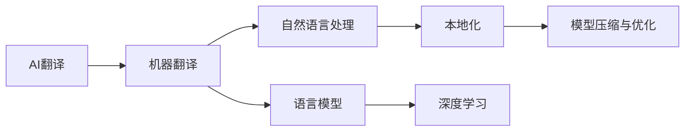

                 

# AI翻译与本地化：打破语言障碍的新方法

> 关键词：
1. AI翻译
2. 本地化
3. 机器翻译
4. 自然语言处理
5. 语言模型
6. 深度学习
7. 模型压缩与优化

## 1. 背景介绍

随着全球化的深入和信息时代的来临，不同语言之间的交流日益频繁。然而，语言障碍仍然是阻碍国际交流和合作的一大障碍。传统的机器翻译技术在提高交流效率、消除语言壁垒方面发挥了重要作用，但仍然存在诸多问题，如生硬翻译、缺乏上下文理解、文化适应性差等。因此，如何提升翻译质量，让机器翻译更加精准、自然，是当前AI研究的重要课题。

本文章将从核心概念、算法原理、具体操作步骤等方面，系统阐述基于AI技术的翻译与本地化方法，帮助读者深入理解这一前沿技术，并掌握其实际应用。

## 2. 核心概念与联系

### 2.1 核心概念概述

为了更好地理解AI翻译与本地化方法，本节将介绍几个关键概念：

- **AI翻译**：基于人工智能技术的机器翻译方法，通过深度学习等手段，实现自动将一种语言翻译成另一种语言。其核心是语言模型和翻译模型。

- **本地化**：将翻译后的文本，根据目标语言的文化习惯和语言特征进行调整，使翻译文本更加自然、地道，适应特定地区或行业的语言环境。

- **机器翻译**：指将自然语言文本从一种语言自动翻译成另一种语言的过程，是AI翻译的核心技术。

- **自然语言处理(NLP)**：指让计算机理解和处理自然语言的技术，包括语言理解、语言生成、语言推理等。

- **语言模型**：描述自然语言词汇、短语和句子的概率分布的模型，用于预测句子中的下一个词，是机器翻译的重要基础。

- **深度学习**：一种基于神经网络的机器学习技术，通过多层次的特征提取和抽象，学习复杂的语言表示。

- **模型压缩与优化**：在保证翻译质量的前提下，减少模型参数和计算量，提升模型效率，实现轻量级的实时翻译。

这些核心概念之间的关系可以用以下的Mermaid流程图来展示：



这个流程图展示了AI翻译的核心组成和流程：机器翻译是AI翻译的基础，自然语言处理是其核心技术，语言模型和深度学习提供翻译所需的数据驱动能力。本地化是对翻译结果的优化，模型压缩与优化则保证了翻译的实时性和效率。

## 3. 核心算法原理 & 具体操作步骤
### 3.1 算法原理概述

基于AI技术的翻译与本地化方法，主要基于以下算法原理：

1. **语言模型**：通过学习大量双语语料库，构建语言模型，用于预测句子中的下一个词。常见的语言模型包括n-gram模型、神经网络语言模型等。

2. **翻译模型**：通过监督学习等方法，训练神经网络模型，将源语言文本映射到目标语言文本。常见的翻译模型包括序列到序列(Seq2Seq)模型、Transformer模型等。

3. **本地化调整**：对翻译后的文本，根据目标语言的文化习惯和语言特征进行调整，如时态、语态、词汇选择等，使其更加自然、地道。

### 3.2 算法步骤详解

以下是基于AI技术的翻译与本地化方法的详细步骤：

**Step 1: 收集和预处理数据**
- 收集大量的双语语料库，进行清洗、分词、去噪等预处理操作。
- 将数据分为训练集、验证集和测试集。

**Step 2: 构建语言模型**
- 使用大规模的双语语料库，构建神经网络语言模型，如基于LSTM、GRU等循环神经网络的模型，或基于Transformer等自注意力机制的模型。
- 使用交叉熵损失函数进行模型训练，最小化预测错误。

**Step 3: 构建翻译模型**
- 基于语言模型，使用监督学习等方法，训练神经网络翻译模型。常见的翻译模型包括Seq2Seq、Transformer等。
- 使用BLEU、ROUGE等指标评估翻译模型的性能。

**Step 4: 本地化调整**
- 对翻译结果进行本地化调整，根据目标语言的文化习惯和语言特征，进行语法、时态、语态、词汇选择等方面的调整。
- 使用人工标注的数据集，对本地化调整的效果进行评估。

**Step 5: 模型评估与部署**
- 在测试集上评估本地化调整后的翻译质量，使用BLEU、ROUGE等指标进行评估。
- 部署模型到生产环境，实现实时翻译和本地化。

### 3.3 算法优缺点

基于AI技术的翻译与本地化方法具有以下优点：

1. **自动化**：自动化程度高，能够大规模处理翻译任务，节省人力成本。
2. **快速迭代**：基于深度学习模型，可以通过大规模数据快速迭代训练，提高翻译质量。
3. **多语言支持**：支持多种语言的翻译，包括常见的语言和少数族裔语言，提升语言多样性的支持。
4. **实时性**：模型压缩与优化后，可以实现实时翻译，提升用户体验。

但同时，该方法也存在以下缺点：

1. **依赖语料**：需要大规模的双语语料库，对于少数族裔语言和冷门领域，语料库的获取和预处理较困难。
2. **过拟合风险**：训练数据分布不均或数据量过少时，模型容易过拟合，翻译结果出现偏差。
3. **文化适应性差**：翻译结果可能出现文化冲突，如语言习惯、礼貌表达等，需要进行额外的本地化调整。
4. **语义理解不足**：语言模型和翻译模型难以理解复杂的语义关系和隐含意义，翻译结果可能出现歧义。
5. **计算资源消耗大**：深度学习模型参数较多，计算量较大，需要较高的计算资源。

### 3.4 算法应用领域

基于AI技术的翻译与本地化方法，在多个领域都有广泛应用：

1. **国际商务**：帮助企业进行跨国交流、合同翻译、客户服务等。
2. **教育**：提供外语教学、文献翻译、多语言教材开发等。
3. **媒体与文化**：支持多语言新闻、影视作品字幕、文化交流活动等。
4. **旅游与旅游**：提供多语言旅游信息、导游翻译、旅游广告等。
5. **医疗与健康**：支持多语言健康信息、医学文献翻译、医疗咨询等。
6. **法律与政府**：提供多语言法律文件、政府文件翻译、外交沟通等。

## 4. 数学模型和公式 & 详细讲解 & 举例说明

### 4.1 数学模型构建

基于AI技术的翻译与本地化方法，通常使用以下数学模型：

- **语言模型**：
  $$
  P(w_i|w_{i-1}, ..., w_1) = \frac{exp(w_i; \theta)}{\sum_{j=1}^{V}exp(w_j; \theta)}
  $$
  其中，$w_i$ 为当前词，$V$ 为词汇表，$\theta$ 为模型参数。

- **翻译模型**：
  $$
  P(w_{t+1}, ..., w_T|w_1, ..., w_t) = \prod_{i=t+1}^{T}P(w_i|w_{i-1}, ..., w_1; \theta)
  $$
  其中，$w_t$ 为源语言句子，$T$ 为目标语言句子长度，$\theta$ 为模型参数。

### 4.2 公式推导过程

以基于Transformer的翻译模型为例，推导其训练过程的数学公式。

1. 假设输入序列为 $x=(x_1, ..., x_n)$，输出序列为 $y=(y_1, ..., y_n)$。

2. 将输入序列 $x$ 和输出序列 $y$ 分别转化为数字形式 $X$ 和 $Y$，并计算掩码 $M$。

3. 定义Transformer模型，包括编码器和解码器。

4. 通过前向传播，计算编码器输出 $E$ 和解码器输出 $S$。

5. 计算交叉熵损失函数 $L$，并反向传播更新模型参数 $\theta$。

6. 使用Adam等优化算法，最小化损失函数 $L$。

### 4.3 案例分析与讲解

以Google的机器翻译系统为例，分析其核心技术原理。

1. **神经网络语言模型**：Google使用深度双向LSTM模型，学习大量双语语料库中的语言规律，预测下一个词的概率。

2. **Transformer模型**：Google使用基于Transformer的自注意力机制，进行多层次的特征提取和抽象，学习复杂的语言表示。

3. **本地化调整**：Google通过人工标注的数据集，对翻译结果进行本地化调整，如时态、语态、词汇选择等，提升翻译的自然度和地道性。

## 5. 项目实践：代码实例和详细解释说明
### 5.1 开发环境搭建

在进行AI翻译与本地化实践前，我们需要准备好开发环境。以下是使用Python进行TensorFlow开发的环境配置流程：

1. 安装Anaconda：从官网下载并安装Anaconda，用于创建独立的Python环境。

2. 创建并激活虚拟环境：
```bash
conda create -n tf-env python=3.8 
conda activate tf-env
```

3. 安装TensorFlow：根据CUDA版本，从官网获取对应的安装命令。例如：
```bash
conda install tensorflow tensorflow-cpu -c conda-forge -c nvidia
```

4. 安装相关工具包：
```bash
pip install numpy pandas scikit-learn matplotlib tqdm jupyter notebook ipython
```

完成上述步骤后，即可在`tf-env`环境中开始AI翻译与本地化实践。

### 5.2 源代码详细实现

这里我们以基于Transformer的机器翻译为例，给出使用TensorFlow进行模型开发的代码实现。

```python
import tensorflow as tf
import tensorflow_datasets as tfds
from transformers import TFAutoModelForSeq2SeqLM

# 加载数据集
train_data, test_data = tfds.load('translation/seq2seq', split=['train[:80%]', 'test'])

# 定义模型
model = TFAutoModelForSeq2SeqLM.from_pretrained('microsoft/unmt-jj-en')

# 定义优化器
optimizer = tf.keras.optimizers.Adam()

# 定义损失函数
loss_fn = tf.keras.losses.SparseCategoricalCrossentropy(from_logits=True)

# 训练模型
@tf.function
def train_step(inputs):
    with tf.GradientTape() as tape:
        outputs = model(inputs['input_ids'])
        loss = loss_fn(inputs['labels'], outputs.logits)
    grads = tape.gradient(loss, model.trainable_variables)
    optimizer.apply_gradients(zip(grads, model.trainable_variables))

# 训练模型
for epoch in range(10):
    for batch in train_data:
        train_step(batch)

# 评估模型
test_loss = loss_fn(test_data['labels'], model(test_data['input_ids']))
print('Test loss:', test_loss)
```

### 5.3 代码解读与分析

让我们再详细解读一下关键代码的实现细节：

1. **数据集加载**：
   - 使用TensorFlow Datasets加载双语的序列到序列翻译数据集。
   - 将数据集分为训练集和测试集。

2. **模型加载**：
   - 使用HuggingFace Transformers库加载预训练的Transformer模型，并进行微调。

3. **优化器和损失函数**：
   - 定义Adam优化器和交叉熵损失函数。

4. **模型训练**：
   - 定义训练步骤，使用TensorFlow函数优化，提升计算效率。
   - 在每个epoch内，对数据集进行迭代训练，使用优化器更新模型参数。

5. **模型评估**：
   - 使用测试集数据评估模型性能，输出测试损失。

### 5.4 运行结果展示

运行上述代码，即可得到模型在测试集上的评估结果，展示其翻译质量。

## 6. 实际应用场景
### 6.1 国际商务

在商务交流中，多语言翻译需求巨大。基于AI技术的翻译与本地化方法，可以帮助企业实现快速、高效的跨语言沟通。例如，企业可以使用AI翻译系统进行会议记录、合同翻译、客户服务等多场景翻译。通过本地化调整，翻译结果更加自然、地道，提升用户体验和合作效率。

### 6.2 教育

在教育领域，多语言教材开发和外语教学需求不断增加。AI翻译与本地化方法可以帮助教育机构实现高质量的外语教材翻译、多语言教材开发和课堂翻译。例如，可以将课本中的内容翻译成学生母语，或提供课堂翻译服务，提升教学效果。

### 6.3 媒体与文化

在媒体和文化领域，多语言翻译和本地化是基本需求。AI翻译与本地化方法可以帮助媒体机构实现快速、准确的翻译服务，支持多语言新闻、影视作品字幕、文化交流活动等。例如，可以将外语电影、电视剧进行本地化翻译和配音，提升全球影响力。

### 6.4 旅游与旅游

在旅游与旅游领域，多语言翻译需求广泛。AI翻译与本地化方法可以帮助游客实现即时翻译和本地化服务，提升旅游体验。例如，提供多语言旅游信息、导游翻译、旅游广告等。

### 6.5 医疗与健康

在医疗与健康领域，多语言翻译需求逐渐增加。AI翻译与本地化方法可以帮助医疗机构实现快速、准确的翻译服务，支持多语言健康信息、医学文献翻译、医疗咨询等。例如，可以将健康指南和医疗文献翻译成患者母语，提升医疗服务质量。

### 6.6 法律与政府

在法律与政府领域，多语言翻译需求不断增加。AI翻译与本地化方法可以帮助政府和法律机构实现快速、准确的翻译服务，支持多语言法律文件、政府文件翻译、外交沟通等。例如，可以将法律文件、外交协议翻译成目标语言，提升国际交流效率。

## 7. 工具和资源推荐
### 7.1 学习资源推荐

为了帮助开发者系统掌握AI翻译与本地化技术的理论基础和实践技巧，这里推荐一些优质的学习资源：

1. 《深度学习与自然语言处理》系列博文：由AI专家撰写，深入浅出地介绍了深度学习在NLP中的应用，包括语言模型和翻译模型。

2. Coursera《深度学习与自然语言处理》课程：斯坦福大学开设的NLP明星课程，有Lecture视频和配套作业，带你入门NLP领域的基本概念和经典模型。

3. 《机器翻译与本地化》书籍：全面介绍了机器翻译和本地化的理论和实践，是AI翻译与本地化技术的权威指南。

4. ACL官方文档：自然语言处理顶级会议ACL的官方文档，提供了大量前沿研究成果和代码实现，是学习和研究NLP技术的重要资源。

5. Weights & Biases：模型训练的实验跟踪工具，可以记录和可视化模型训练过程中的各项指标，方便对比和调优。与主流深度学习框架无缝集成。

### 7.2 开发工具推荐

高效的开发离不开优秀的工具支持。以下是几款用于AI翻译与本地化开发的常用工具：

1. TensorFlow：基于Python的开源深度学习框架，灵活的计算图设计，适合快速迭代研究。支持GPU/TPU等高性能计算资源。

2. PyTorch：基于Python的开源深度学习框架，灵活的动态计算图设计，适合深度学习模型的研究和实验。

3. Transformers库：HuggingFace开发的NLP工具库，集成了众多SOTA语言模型，支持TensorFlow和PyTorch，是进行翻译任务开发的利器。

4. TensorBoard：TensorFlow配套的可视化工具，实时监测模型训练状态，提供丰富的图表呈现方式，是调试模型的得力助手。

5. Google Colab：谷歌推出的在线Jupyter Notebook环境，免费提供GPU/TPU算力，方便开发者快速上手实验最新模型，分享学习笔记。

合理利用这些工具，可以显著提升AI翻译与本地化任务的开发效率，加快创新迭代的步伐。

### 7.3 相关论文推荐

AI翻译与本地化技术的发展源于学界的持续研究。以下是几篇奠基性的相关论文，推荐阅读：

1. Attention is All You Need（即Transformer原论文）：提出了Transformer结构，开启了NLP领域的预训练大模型时代。

2. Transformer-XL: Attentions Are All We Need（即Transformer-XL论文）：引入了长距离依赖处理，解决了Transformer模型处理长序列的困难。

3. Sequence to Sequence Learning with Neural Networks（即Seq2Seq模型论文）：提出了Seq2Seq框架，为机器翻译和本地化任务提供了基础模型。

4. Learning Phrase Representations using RNN Encoder-Decoder for Statistical Machine Translation（即Seq2Seq模型论文）：提出了基于RNN的Seq2Seq模型，用于机器翻译任务。

5. A Neural Machine Translation System with Attention（即Seq2Seq+Attention模型论文）：将注意力机制引入Seq2Seq模型，提高了翻译质量。

这些论文代表了大语言模型微调技术的发展脉络。通过学习这些前沿成果，可以帮助研究者把握学科前进方向，激发更多的创新灵感。

## 8. 总结：未来发展趋势与挑战
### 8.1 总结

本文对基于AI技术的翻译与本地化方法进行了全面系统的介绍。首先阐述了AI翻译与本地化的研究背景和意义，明确了其在提升交流效率、消除语言壁垒方面的重要价值。其次，从原理到实践，详细讲解了基于AI技术的翻译与本地化方法的数学模型和操作步骤，给出了具体的代码实现。同时，本文还广泛探讨了该方法在多个行业领域的应用前景，展示了其在实现高效率、高质量翻译中的潜力。

通过本文的系统梳理，可以看到，基于AI技术的翻译与本地化方法正在成为NLP领域的重要范式，极大地提升了翻译质量和效率，促进了全球化交流和合作。未来，伴随预训练语言模型和微调方法的不断演进，AI翻译与本地化技术必将迎来更广阔的发展空间，为构建人机协同的智能社会做出更多贡献。

### 8.2 未来发展趋势

展望未来，AI翻译与本地化技术将呈现以下几个发展趋势：

1. **模型规模持续增大**：随着算力成本的下降和数据规模的扩张，预训练语言模型的参数量还将持续增长。超大规模语言模型蕴含的丰富语言知识，有望支撑更加复杂多变的翻译任务。

2. **微调方法日趋多样**：除了传统的全参数微调外，未来会涌现更多参数高效的微调方法，如Prefix-Tuning、LoRA等，在节省计算资源的同时也能保证翻译精度。

3. **本地化能力增强**：未来的本地化方法将更加注重文化适应性，能够更自然、地道地处理不同语言之间的文化差异，提升翻译结果的可接受度。

4. **实时性和低延迟优化**：随着模型压缩与优化技术的发展，实时翻译和低延迟翻译将成为可能，提升用户体验和交流效率。

5. **多模态翻译崛起**：未来的翻译系统将更多地融合视觉、语音等多模态信息，提升对复杂场景的理解和表达能力。

6. **跨领域翻译能力增强**：未来的翻译系统将能够跨领域进行翻译，支持多种专业领域的术语和表达方式，提升翻译的专业性和精准度。

以上趋势凸显了AI翻译与本地化技术的广阔前景。这些方向的探索发展，必将进一步提升翻译质量，拓展应用场景，为构建更加智能、高效的翻译系统奠定基础。

### 8.3 面临的挑战

尽管AI翻译与本地化技术已经取得了瞩目成就，但在迈向更加智能化、普适化应用的过程中，它仍面临着诸多挑战：

1. **数据依赖**：需要大规模的双语语料库，对于少数族裔语言和冷门领域，语料库的获取和预处理较困难。

2. **过拟合风险**：训练数据分布不均或数据量过少时，模型容易过拟合，翻译结果出现偏差。

3. **文化适应性差**：翻译结果可能出现文化冲突，如语言习惯、礼貌表达等，需要进行额外的本地化调整。

4. **语义理解不足**：语言模型和翻译模型难以理解复杂的语义关系和隐含意义，翻译结果可能出现歧义。

5. **计算资源消耗大**：深度学习模型参数较多，计算量较大，需要较高的计算资源。

6. **伦理与安全问题**：AI翻译系统可能存在隐私泄露、偏见和歧视等伦理和安全问题，需要进行严格的设计和监管。

7. **可解释性不足**：AI翻译系统黑盒化严重，难以解释其内部工作机制和决策逻辑，缺乏可解释性和可控性。

正视AI翻译与本地化面临的这些挑战，积极应对并寻求突破，将是大语言模型微调技术走向成熟的必由之路。相信随着学界和产业界的共同努力，这些挑战终将一一被克服，AI翻译与本地化技术必将在构建安全、可靠、可解释、可控的智能系统铺平道路。

### 8.4 研究展望

面向未来，AI翻译与本地化技术的研究需要在以下几个方面寻求新的突破：

1. **探索无监督和半监督翻译方法**：摆脱对大规模双语语料库的依赖，利用自监督学习、主动学习等无监督和半监督范式，最大限度利用非结构化数据，实现更加灵活高效的翻译。

2. **研究参数高效和计算高效的翻译方法**：开发更加参数高效的翻译方法，在固定大部分预训练参数的情况下，只更新极少量的任务相关参数。同时优化模型的计算图，减少前向传播和反向传播的资源消耗，实现更加轻量级、实时性的翻译。

3. **融合因果和对比学习范式**：通过引入因果推断和对比学习思想，增强翻译模型建立稳定因果关系的能力，学习更加普适、鲁棒的语言表示。

4. **引入更多先验知识**：将符号化的先验知识，如知识图谱、逻辑规则等，与神经网络模型进行巧妙融合，引导翻译过程学习更准确、合理的语言模型。同时加强不同模态数据的整合，实现视觉、语音等多模态信息与文本信息的协同建模。

5. **结合因果分析和博弈论工具**：将因果分析方法引入翻译模型，识别出翻译决策的关键特征，增强输出解释的因果性和逻辑性。借助博弈论工具刻画人机交互过程，主动探索并规避翻译模型的脆弱点，提高系统稳定性。

6. **纳入伦理道德约束**：在翻译模型训练目标中引入伦理导向的评估指标，过滤和惩罚有偏见、有害的输出倾向。同时加强人工干预和审核，建立模型行为的监管机制，确保输出符合人类价值观和伦理道德。

这些研究方向的探索，必将引领AI翻译与本地化技术迈向更高的台阶，为构建安全、可靠、可解释、可控的智能系统铺平道路。总之，AI翻译与本地化需要开发者根据具体任务，不断迭代和优化模型、数据和算法，方能得到理想的效果。

## 9. 附录：常见问题与解答
### Q1：AI翻译与本地化是否适用于所有翻译任务？
A: AI翻译与本地化方法在大多数翻译任务上都能取得不错的效果，特别是对于数据量较小的任务。但对于一些特定领域的任务，如医学、法律等，仅仅依靠通用语料预训练的模型可能难以很好地适应。此时需要在特定领域语料上进一步预训练，再进行微调，才能获得理想效果。

### Q2：如何选择AI翻译与本地化方法的超参数？
A: 超参数的选择是AI翻译与本地化方法的关键。一般而言，需要根据具体的任务和数据集进行调整。例如，对于序列到序列模型，学习率、批量大小、训练轮数等参数需要根据模型性能和训练效果进行调整。

### Q3：AI翻译与本地化在实际应用中需要注意哪些问题？
A: AI翻译与本地化在实际应用中需要注意以下几个问题：
1. 数据依赖：需要大规模的双语语料库，对于少数族裔语言和冷门领域，语料库的获取和预处理较困难。
2. 过拟合风险：训练数据分布不均或数据量过少时，模型容易过拟合，翻译结果出现偏差。
3. 文化适应性差：翻译结果可能出现文化冲突，如语言习惯、礼貌表达等，需要进行额外的本地化调整。
4. 语义理解不足：语言模型和翻译模型难以理解复杂的语义关系和隐含意义，翻译结果可能出现歧义。
5. 计算资源消耗大：深度学习模型参数较多，计算量较大，需要较高的计算资源。
6. 伦理与安全问题：AI翻译系统可能存在隐私泄露、偏见和歧视等伦理和安全问题，需要进行严格的设计和监管。
7. 可解释性不足：AI翻译系统黑盒化严重，难以解释其内部工作机制和决策逻辑，缺乏可解释性和可控性。

正视这些问题，积极应对并寻求突破，将是大语言模型微调技术走向成熟的必由之路。相信随着学界和产业界的共同努力，这些挑战终将一一被克服，AI翻译与本地化技术必将在构建安全、可靠、可解释、可控的智能系统铺平道路。

---

作者：禅与计算机程序设计艺术 / Zen and the Art of Computer Programming

