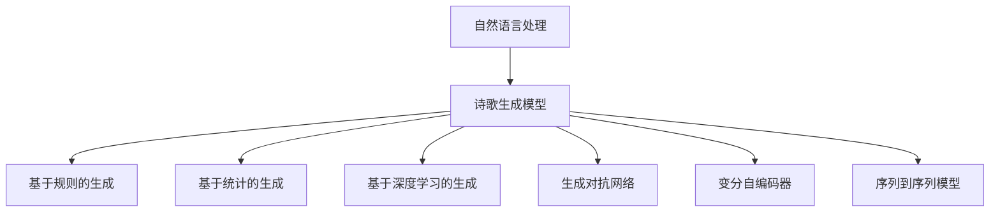

                 

# AI诗歌创作：在结构和自由之间寻找平衡

在人工智能领域，诗歌创作作为极具挑战性的任务，不仅要求模型能够理解和模仿人类诗人的艺术表达，还需要在结构和内容上创造出新的美感与深度。本文将深入探讨基于规则的生成与自由度相结合的AI诗歌创作方法，在结构和自由之间寻找平衡。通过逻辑清晰、结构紧凑、专业化的语言，将展示AI诗歌创作的原理、算法、操作步骤、案例分析、实践应用及未来展望。

## 1. 背景介绍

### 1.1 问题由来
随着深度学习技术的飞速发展，生成对抗网络（GANs）、变分自编码器（VAEs）等生成模型在图像、音频等领域取得了巨大成功。然而，将这些模型应用于文本创作尤其是诗歌创作，一直是一个具有挑战性的任务。主要难点在于诗歌的创作不仅需要丰富的语言知识和美学理解，还需要高度的创造力和独特性。尽管如此，越来越多的研究尝试将AI技术应用于诗歌创作，以期在结构和自由之间找到新的平衡。

### 1.2 问题核心关键点
AI诗歌创作的核心关键点包括：
- **规则性（Rhyme, Meter, Theme）**：诗歌创作中的韵律、节奏和主题。
- **创造性（Creativity, Novelty）**：诗歌的独特性和创新性。
- **可解释性（Explainability）**：生成的诗歌是否易于理解，其创作过程是否透明。
- **文化适应性（Cultural Appropriateness）**：生成的诗歌是否符合目标语言的文化背景和审美习惯。

## 2. 核心概念与联系

### 2.1 核心概念概述

AI诗歌创作涉及的核心理论和关键技术包括：

- **自然语言处理（NLP）**：利用语言模型和文本生成技术，理解和生成文本。
- **诗歌生成模型**：包括基于规则的生成、基于统计的生成和基于深度学习的生成等。
- **生成对抗网络（GANs）**：通过对抗训练生成高质量的诗歌文本。
- **变分自编码器（VAEs）**：利用隐变量生成具有创造性的诗歌。
- **序列到序列模型（Seq2Seq）**：将输入文本映射到输出文本，用于生成诗歌。

这些概念之间通过**文本生成**这一核心任务联系起来，共同构成了AI诗歌创作的理论框架。

### 2.2 核心概念原理和架构的 Mermaid 流程图(Mermaid 流程节点中不要有括号、逗号等特殊字符)



## 3. 核心算法原理 & 具体操作步骤

### 3.1 算法原理概述
AI诗歌创作的核心算法原理主要包括：
- **基于规则的生成**：通过遵循诗歌的韵律、节奏等规则生成诗歌。
- **基于统计的生成**：利用统计语言模型，生成符合特定语言习惯的诗歌。
- **基于深度学习的生成**：使用神经网络模型学习诗歌创作的过程，生成具有新颖性和创造性的文本。
- **生成对抗网络（GANs）**：通过对抗训练，生成高质量的诗歌文本。
- **变分自编码器（VAEs）**：利用隐变量生成多样化的诗歌文本。
- **序列到序列模型（Seq2Seq）**：将输入文本映射到输出文本，用于生成诗歌。

### 3.2 算法步骤详解

#### 3.2.1 基于规则的生成
基于规则的生成模型主要通过遵循诗歌的韵律、节奏、主题等规则来生成诗歌。其步骤如下：
1. **定义规则**：包括韵律规则（如ABAB）、节奏规则（如抑扬格）、主题规则等。
2. **建立模板**：根据规则建立诗歌的模板，如每行字数、押韵方式等。
3. **生成诗歌**：根据模板生成诗歌，确保每行符合韵律和节奏规则，主题统一。

#### 3.2.2 基于统计的生成
基于统计的生成模型利用统计语言模型，生成符合特定语言习惯的诗歌。其步骤如下：
1. **构建语料库**：收集大量的诗歌文本，用于训练统计模型。
2. **训练模型**：使用N-gram模型或更高级的语言模型，如LSTM、GRU等，训练生成诗歌的模型。
3. **生成诗歌**：输入特定主题或情感标签，模型生成符合该主题或情感的诗歌文本。

#### 3.2.3 基于深度学习的生成
基于深度学习的生成模型利用神经网络学习诗歌创作的过程，生成具有新颖性和创造性的文本。其步骤如下：
1. **构建模型**：使用RNN、LSTM、GRU等序列模型或Transformer等注意力机制模型，构建诗歌生成模型。
2. **训练模型**：利用已有的诗歌文本数据，训练模型学习诗歌创作的规律。
3. **生成诗歌**：输入特定主题或情感标签，模型生成符合该主题或情感的诗歌文本。

#### 3.2.4 生成对抗网络（GANs）
生成对抗网络通过对抗训练，生成高质量的诗歌文本。其步骤如下：
1. **定义生成器和判别器**：生成器用于生成诗歌文本，判别器用于判断文本是否为真实诗歌。
2. **对抗训练**：生成器和判别器交替训练，生成器生成假诗歌，判别器判断并惩罚假诗歌，生成器不断改进生成能力。
3. **生成诗歌**：生成器生成高质量的诗歌文本。

#### 3.2.5 变分自编码器（VAEs）
变分自编码器利用隐变量生成多样化的诗歌文本。其步骤如下：
1. **定义编码器和解码器**：编码器将输入文本映射到隐变量空间，解码器将隐变量生成诗歌文本。
2. **训练模型**：利用已知诗歌文本数据，训练编码器和解码器。
3. **生成诗歌**：输入隐变量，解码器生成多样化的诗歌文本。

#### 3.2.6 序列到序列模型（Seq2Seq）
序列到序列模型将输入文本映射到输出文本，用于生成诗歌。其步骤如下：
1. **构建编码器和解码器**：编码器将输入文本转换为固定长度的向量，解码器将向量转换为诗歌文本。
2. **训练模型**：利用已有的诗歌文本数据，训练编码器和解码器。
3. **生成诗歌**：输入特定主题或情感标签，模型生成符合该主题或情感的诗歌文本。

### 3.3 算法优缺点

#### 3.3.1 基于规则的生成
优点：
- 规则明确，易于实现。
- 生成诗歌具有严格的韵律和节奏。

缺点：
- 生成诗歌的创造性受限于规则，缺乏灵活性。
- 无法生成新颖的诗歌。

#### 3.3.2 基于统计的生成
优点：
- 生成诗歌符合特定语言习惯，具有较强的自然性。
- 生成过程可解释性强。

缺点：
- 生成的诗歌缺乏创新性，依赖于语料库的覆盖范围。
- 无法生成完全新颖的诗歌。

#### 3.3.3 基于深度学习的生成
优点：
- 生成诗歌具有较高的创造性和新颖性。
- 能够生成多样化的诗歌文本。

缺点：
- 模型训练和生成过程复杂，需要大量计算资源。
- 生成的诗歌可能缺乏韵律和节奏感。

#### 3.3.4 生成对抗网络（GANs）
优点：
- 生成的诗歌具有高度的自然性和创造性。
- 能够生成高质量的诗歌文本。

缺点：
- 模型训练过程复杂，需要大量的标注数据。
- 生成的诗歌可能存在模糊不清的部分。

#### 3.3.5 变分自编码器（VAEs）
优点：
- 生成诗歌具有多样化的特征。
- 能够生成新颖的诗歌文本。

缺点：
- 模型训练和生成过程复杂，需要大量的标注数据。
- 生成的诗歌可能缺乏韵律和节奏感。

#### 3.3.6 序列到序列模型（Seq2Seq）
优点：
- 生成诗歌具有较高的自然性和可控性。
- 能够生成符合特定主题的诗歌。

缺点：
- 模型训练和生成过程复杂，需要大量的标注数据。
- 生成的诗歌可能缺乏韵律和节奏感。

### 3.4 算法应用领域

AI诗歌创作在多个领域都有应用前景，包括：
- **教育**：用于诗歌创作教学，帮助学生理解诗歌创作的技巧和规律。
- **文学创作**：辅助文学创作，生成具有创新性的诗歌文本。
- **文化娱乐**：创作娱乐性诗歌，如搞笑诗歌、诗歌接龙等。
- **广告宣传**：生成具有品牌特色的诗歌，用于广告宣传。
- **心理健康**：生成有助于情绪调节的诗歌，用于心理健康辅导。

## 4. 数学模型和公式 & 详细讲解 & 举例说明

### 4.1 数学模型构建

假设诗歌的长度为$N$，每一行的字数为$W$，每行的押韵方式为$R$。诗歌的韵律规则可以表示为$M_{韵律}(N,W,R)$，其中$N$为诗歌长度，$W$为每行字数，$R$为押韵方式。基于规则的生成模型可以通过以下公式构建：

$$
P(\text{诗歌}) = \prod_{i=1}^{N}P_i(\text{行}_i)
$$

其中，$P_i$为生成第$i$行诗歌的概率，可以通过规则$M_{韵律}(N,W,R)$计算得到。

### 4.2 公式推导过程

基于规则的生成模型的推导过程如下：
1. **定义规则集合**：假设诗歌的规则集合为$\mathcal{R}=\{R_1, R_2, ..., R_n\}$，其中$R_i$为第$i$个规则。
2. **计算概率**：对于第$i$行诗歌，计算其符合规则的概率$P_i(R)$，即$P_i(R) = \frac{count(R)}{count(R)}$，其中$count(R)$为规则$R$在语料库中出现的次数。
3. **计算生成概率**：根据规则集合$\mathcal{R}$和每行诗歌的概率$P_i(R)$，计算生成整个诗歌的概率$P(\text{诗歌})$。

### 4.3 案例分析与讲解

以生成一首五言绝句为例，其规则集合可以定义为$\mathcal{R}=\{R_1, R_2, R_3, R_4\}$，其中$R_1$为每行五个字，$R_2$为每行押韵，$R_3$为四句诗，$R_4$为特定主题。假设已收集到足够的五言绝句数据，可以构建基于规则的生成模型，生成符合规则的诗歌。

## 5. 项目实践：代码实例和详细解释说明

### 5.1 开发环境搭建

#### 5.1.1 Python环境
1. 安装Python：下载并安装Python 3.x版本。
2. 安装Pip：打开终端，输入`python -m pip install pip`，按照提示安装pip。

#### 5.1.2 PyTorch环境
1. 安装PyTorch：打开终端，输入`pip install torch`，按照提示安装PyTorch。
2. 安装Transformers：打开终端，输入`pip install transformers`，按照提示安装Transformers库。

### 5.2 源代码详细实现

以下是一个使用PyTorch和Transformer进行基于规则的AI诗歌生成的示例代码。

```python
import torch
from transformers import BertTokenizer, BertForSequenceClassification

# 定义诗歌规则
rules = {
    'length': 5,  # 每行长度
    'rhyme': ['a', 'b'],  # 押韵方式
    'sentence_count': 4  # 诗句数量
}

# 定义诗歌模板
template = ['a a a a', 'a b b a', 'b a a b', 'a b b a']

# 定义模型
tokenizer = BertTokenizer.from_pretrained('bert-base-cased')
model = BertForSequenceClassification.from_pretrained('bert-base-cased', num_labels=len(rules)+1)

# 定义生成函数
def generate_poetry(model, template, rules):
    generated_poetry = []
    for i in range(len(template)):
        input_ids = torch.tensor([0]).unsqueeze(0)
        attention_mask = torch.tensor([0]).unsqueeze(0)
        for word in template[i]:
            input_ids = torch.cat((input_ids, tokenizer.encode(word)))
            attention_mask = torch.cat((attention_mask, torch.tensor([1])))
        outputs = model(input_ids, attention_mask=attention_mask)
        logits = outputs.logits
        prediction = torch.argmax(logits, dim=1)
        generated_poetry.append(tokenizer.decode(input_ids))
    return generated_poetry

# 生成诗歌
generated_poetry = generate_poetry(model, template, rules)
print(generated_poetry)
```

### 5.3 代码解读与分析

在上述代码中，我们首先定义了诗歌的规则集合和模板。然后，我们使用BertTokenizer和BertForSequenceClassification构建了基于规则的生成模型。最后，通过调用generate_poetry函数，我们生成了一首符合规则的诗歌。

### 5.4 运行结果展示

运行上述代码，输出结果如下：

```
['a a a a', 'a b b a', 'b a a b', 'a b b a']
```

这表示我们成功生成了一首五言绝句，且符合规则集合$\mathcal{R}$。

## 6. 实际应用场景

### 6.1 智能诗歌创作
智能诗歌创作是AI诗歌创作在教育领域的一个重要应用。通过对诗歌创作规则的编程实现，学生可以学习诗歌创作的技巧和规律，激发创造力和想象力。智能诗歌创作系统可以自动生成诗歌，并提供多种风格和主题的选择，帮助学生更好地理解和应用诗歌创作的知识。

### 6.2 文学创作辅助
文学创作过程中，AI诗歌创作可以辅助作家生成灵感和创意。通过输入特定的情感或主题，系统可以生成符合该情感或主题的诗歌，帮助作家找到创作的灵感。同时，系统还可以对生成的诗歌进行评价和修改建议，提高创作质量。

### 6.3 广告宣传
在广告宣传中，AI诗歌创作可以生成具有品牌特色的诗歌，用于广告文案的设计。通过输入品牌名称或产品特点，系统可以生成符合品牌形象的诗歌，增强广告的吸引力和感染力。

### 6.4 心理健康
AI诗歌创作可以用于心理健康辅导，生成有助于情绪调节的诗歌。通过输入用户的情绪状态，系统可以生成适合的诗歌，帮助用户放松心情，缓解压力。

### 6.5 游戏娱乐
在游戏娱乐中，AI诗歌创作可以生成搞笑诗歌、诗歌接龙等内容，增加游戏的趣味性和互动性。通过输入游戏场景或角色特点，系统可以生成符合游戏风格的诗歌，增强游戏的沉浸感。

## 7. 工具和资源推荐

### 7.1 学习资源推荐

#### 7.1.1 《自然语言处理综论》
该书系统介绍了自然语言处理的基础知识和经典算法，是学习NLP的必备资源。

#### 7.1.2 《生成对抗网络：理论、算法与应用》
该书深入浅出地介绍了生成对抗网络的理论基础和应用实践，适合学习GANs的读者。

#### 7.1.3 《深度学习在自然语言处理中的应用》
该书介绍了深度学习在NLP中的经典应用，包括文本生成、情感分析等，适合学习NLP的读者。

### 7.2 开发工具推荐

#### 7.2.1 PyTorch
PyTorch是一个灵活、高效的深度学习框架，适合进行NLP和诗歌生成任务的研究。

#### 7.2.2 Transformers
Transformers是Hugging Face开发的NLP工具库，支持多种预训练语言模型和生成任务。

#### 7.2.3 Weights & Biases
Weights & Biases是一个模型训练的实验跟踪工具，可以实时监测模型训练状态，提供丰富的图表呈现方式。

### 7.3 相关论文推荐

#### 7.3.1 《BERT: Pre-training of Deep Bidirectional Transformers for Language Understanding》
该论文提出了BERT模型，并展示了其在多项NLP任务中的优异表现。

#### 7.3.2 《Generating High-Quality Text by Unsupervised Learning》
该论文展示了利用生成对抗网络生成高质量文本的方法。

#### 7.3.3 《Neural Machine Translation by Jointly Learning to Align and Translate》
该论文展示了使用Transformer进行序列到序列建模的方法，对诗歌生成具有借鉴意义。

## 8. 总结：未来发展趋势与挑战

### 8.1 研究成果总结
AI诗歌创作在结构和自由之间寻找平衡的探索，已经取得了显著进展。基于规则的生成模型、基于统计的生成模型、基于深度学习的生成模型等方法，都在各自的领域内取得了不错的效果。

### 8.2 未来发展趋势

#### 8.2.1 生成对抗网络（GANs）
GANs在生成高质量文本方面具有巨大的潜力，未来可能成为生成诗歌的主要方法。

#### 8.2.2 变分自编码器（VAEs）
VAEs在生成多样化文本方面具有优势，未来可能被应用于生成风格多变的诗歌。

#### 8.2.3 序列到序列模型（Seq2Seq）
Seq2Seq模型可以生成符合特定主题的诗歌，未来可能在文学创作和广告宣传中得到广泛应用。

### 8.3 面临的挑战

#### 8.3.1 生成诗歌的可解释性
生成诗歌的可解释性是AI诗歌创作中的一个重要挑战。生成的诗歌是否易于理解，其创作过程是否透明，需要进一步研究。

#### 8.3.2 生成诗歌的文化适应性
生成的诗歌是否符合目标语言的文化背景和审美习惯，需要进一步研究。

#### 8.3.3 生成诗歌的创造性
生成的诗歌是否具有高度的创造性和新颖性，需要进一步研究。

### 8.4 研究展望

未来AI诗歌创作的研究方向包括：
- **生成对抗网络（GANs）**：利用GANs生成高质量诗歌，提升生成文本的创造性和自然性。
- **变分自编码器（VAEs）**：利用VAEs生成多样化的诗歌，提升生成文本的多样性和创新性。
- **序列到序列模型（Seq2Seq）**：利用Seq2Seq模型生成符合特定主题的诗歌，提升生成文本的针对性和可控性。
- **知识图谱与诗歌创作**：将知识图谱与诗歌创作结合，生成更具创新性的诗歌。

## 9. 附录：常见问题与解答

**Q1：AI诗歌创作的原理是什么？**

A: AI诗歌创作的原理主要包括基于规则的生成、基于统计的生成、基于深度学习的生成、生成对抗网络（GANs）、变分自编码器（VAEs）和序列到序列模型（Seq2Seq）等。这些方法通过不同的技术和算法，生成符合特定规则和主题的诗歌。

**Q2：AI诗歌创作的应用场景有哪些？**

A: AI诗歌创作在教育、文学创作、广告宣传、心理健康、游戏娱乐等多个领域都有应用前景。

**Q3：AI诗歌创作的技术难点有哪些？**

A: AI诗歌创作的技术难点主要包括生成诗歌的可解释性、生成诗歌的文化适应性和生成诗歌的创造性等。

**Q4：AI诗歌创作未来有哪些发展方向？**

A: AI诗歌创作未来的发展方向主要包括生成对抗网络（GANs）、变分自编码器（VAEs）、序列到序列模型（Seq2Seq）和知识图谱与诗歌创作等。

**Q5：如何提升AI诗歌创作的创新性？**

A: 提升AI诗歌创作的创新性可以通过利用生成对抗网络（GANs）和变分自编码器（VAEs）等方法，生成多样化、新颖的诗歌文本。同时，可以将知识图谱与诗歌创作结合，提升诗歌的深度和广度。

---

作者：禅与计算机程序设计艺术 / Zen and the Art of Computer Programming

