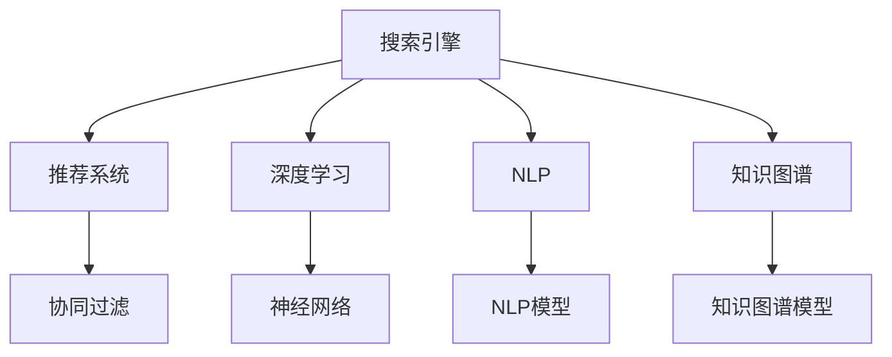

                 

# AI赋能电商：搜索推荐系统的革命性突破

## 1. 背景介绍

### 1.1 问题由来

随着电商行业的蓬勃发展，越来越多的用户涌向网络平台，希望通过便捷的方式完成购物体验。然而，电商网站面临着用户需求多元化、信息过载、搜索效率低、推荐准确度不高的问题，这些都在挑战电商平台的运营效率。如何利用先进的技术手段提升搜索和推荐系统的效果，成为电商行业亟需解决的关键问题。

### 1.2 问题核心关键点

提高电商搜索和推荐系统的准确度和效率，需要解决以下核心问题：

- **信息过载**：用户面对海量的商品信息，如何高效地筛选出最符合自己需求的商品？
- **搜索准确度**：如何精准捕捉用户的搜索意图，并提供最相关的搜索结果？
- **推荐个性化**：如何针对用户的行为和偏好，提供个性化的推荐商品？
- **系统性能**：如何在保障推荐准确度的同时，提升搜索和推荐的响应速度，优化用户体验？

电商平台的搜索和推荐系统是连接用户与商品的桥梁，高效、准确的搜索推荐系统不仅能提升用户满意度，还能显著提升平台交易转化率，带来更大的商业价值。

### 1.3 问题研究意义

构建高效、精准、个性化的电商搜索推荐系统，对于电商平台的业务发展具有重要意义：

1. **提升用户体验**：准确理解和满足用户需求，提升购物体验，增加用户粘性。
2. **提高转化率**：通过个性化推荐，引导用户进行购买决策，提升交易转化率。
3. **优化运营成本**：通过智能搜索推荐，减少用户查找商品的时间，降低运营成本。
4. **促进商业创新**：技术驱动的搜索推荐系统，为电商平台的商业模式带来新的可能。
5. **强化竞争优势**：技术领先能够帮助电商平台在激烈的市场竞争中脱颖而出。

## 2. 核心概念与联系

### 2.1 核心概念概述

为了更好地理解AI赋能的电商搜索推荐系统，本节将介绍几个关键概念及其联系：

- **搜索引擎**：用于处理用户的搜索请求，返回与查询意图匹配的网页列表的系统。
- **推荐系统**：根据用户的行为、兴趣和偏好，推荐潜在商品的系统。
- **深度学习**：使用深层神经网络处理数据和做出决策的技术。
- **协同过滤**：基于用户的历史行为和偏好，推荐用户可能感兴趣的商品。
- **自然语言处理**（NLP）：理解、处理和生成人类语言的技术。
- **知识图谱**：以图结构表示实体间关系的知识库，用于提升推荐的准确性和解释性。

这些概念之间的逻辑关系可以通过以下Mermaid流程图来展示：



这个流程图展示了一些核心概念及其之间的关系：

1. 搜索引擎使用深度学习等技术，处理用户的查询，返回相关网页。
2. 推荐系统利用协同过滤、知识图谱等技术，推荐商品。
3. 深度学习、NLP、知识图谱技术可以增强推荐系统的效果。

## 3. 核心算法原理 & 具体操作步骤

### 3.1 算法原理概述

电商搜索推荐系统的核心在于利用AI技术，对用户行为和商品信息进行深入分析，生成高效的搜索和推荐结果。其基本原理可以概括为以下几点：

- **用户行为分析**：通过深度学习模型，分析用户的浏览、点击、购买等行为，构建用户画像。
- **商品信息抽取**：使用NLP技术，从商品标题、描述、评价等文本信息中，抽取有价值的信息，如品牌、分类、情感等。
- **查询意图理解**：使用NLP技术，理解用户搜索的意图，判断搜索结果的相关性。
- **个性化推荐**：利用协同过滤、知识图谱等技术，生成个性化的推荐列表，提升用户体验。
- **搜索优化**：通过深度学习模型，优化搜索结果排序，提升搜索效率和准确度。

### 3.2 算法步骤详解

基于AI的电商搜索推荐系统开发通常包括以下关键步骤：

**Step 1: 数据预处理和特征工程**

- 收集电商平台的历史交易数据、用户行为数据、商品信息数据等。
- 对数据进行清洗和标注，构建用户画像、商品标签等特征。
- 进行特征选择和降维，去除无关特征，减少数据维度。

**Step 2: 模型构建和训练**

- 选择合适的模型，如深度学习模型、协同过滤模型、知识图谱模型等。
- 设计模型结构，确定输入和输出，定义损失函数。
- 选择优化器，如SGD、Adam等，设置学习率、批大小、迭代轮数等。
- 对模型进行训练，优化模型参数，最小化损失函数。

**Step 3: 模型评估和调优**

- 在验证集上评估模型性能，使用如精确率、召回率、F1-score等指标。
- 根据评估结果，调整模型结构、优化超参数、增加数据增强等手段，提升模型效果。
- 重复以上过程，直到模型在验证集上达到满意的性能。

**Step 4: 模型部署和监控**

- 将训练好的模型部署到生产环境，与电商搜索推荐系统集成。
- 监控模型的在线表现，收集用户的反馈，及时进行调整和优化。
- 使用A/B测试等方法，验证新模型的效果，确认是否替换原有模型。

**Step 5: 持续学习**

- 根据用户的新行为和新数据，持续训练模型，保持模型性能的稳定和提升。
- 定期更新模型，集成新的知识和信息，适应电商平台的变化。

### 3.3 算法优缺点

基于AI的电商搜索推荐系统具有以下优点：

- **高效**：利用深度学习等技术，快速处理大量数据，生成高效的结果。
- **精准**：通过深入理解用户行为和商品信息，提供精准的搜索和推荐。
- **个性化**：能够根据用户的历史行为和兴趣，提供个性化的服务，提升用户体验。
- **灵活**：易于扩展和集成，适应电商平台的多样化需求。

同时，这些系统也存在一些局限性：

- **数据依赖**：需要大量历史数据进行训练，对于新平台或小规模用户，可能效果不佳。
- **算法复杂**：深度学习和知识图谱等模型较为复杂，需要较高的计算资源和专业知识。
- **偏见和误差**：模型可能学习到用户偏见和历史误差，影响推荐结果的公正性。
- **冷启动问题**：对于新用户或新商品，模型可能无法提供合适的推荐。
- **计算成本高**：深度学习等模型计算成本高，需要高性能的硬件设备支持。

### 3.4 算法应用领域

基于AI的电商搜索推荐系统已经在多个领域得到应用，包括但不限于：

- **智能搜索**：通过深度学习和自然语言处理技术，快速响应用户的搜索请求。
- **个性化推荐**：根据用户的历史行为和兴趣，推荐相关商品。
- **商品分类和推荐**：利用知识图谱技术，实现商品分类和推荐。
- **库存管理和优化**：预测商品需求，优化库存管理和供应链。
- **广告投放和分析**：根据用户行为和商品特征，优化广告投放策略和效果分析。
- **客户服务**：通过聊天机器人和语音助手，提升客户服务体验。

## 4. 数学模型和公式 & 详细讲解

### 4.1 数学模型构建

为了更好地理解基于AI的电商搜索推荐系统的数学模型，本节将详细讲解其构建过程。

假设搜索引擎的输入为用户的查询 $q$，输出为相关网页列表 $R$。推荐系统的输入为用户的历史行为 $u$ 和商品特征 $i$，输出为推荐商品列表 $I$。

**搜索引擎的损失函数**：
$$
L_{search} = \sum_{i=1}^N (1 - y_i) \log P(R_i|q) + y_i \log (1 - P(R_i|q))
$$

其中 $y_i$ 为网页 $i$ 是否与查询 $q$ 相关，$P(R_i|q)$ 为网页 $i$ 与查询 $q$ 相关的概率。

**推荐系统的损失函数**：
$$
L_{recommend} = \sum_{i=1}^M \sum_{j=1}^N (1 - y_{ij}) \log P(I_i|u,j) + y_{ij} \log (1 - P(I_i|u,j))
$$

其中 $y_{ij}$ 为商品 $i$ 是否为用户 $j$ 感兴趣，$P(I_i|u,j)$ 为用户 $j$ 对商品 $i$ 感兴趣的概率。

### 4.2 公式推导过程

以下我们以基于协同过滤的推荐系统为例，推导推荐模型的训练过程。

假设用户 $u$ 对商品 $i$ 的评分 $r_{ui}$ 服从高斯分布，即：
$$
r_{ui} \sim \mathcal{N}(\mu_{ui}, \sigma^2)
$$

其中 $\mu_{ui} = \theta_u \cdot \phi_i$，$\theta_u$ 和 $\phi_i$ 分别表示用户 $u$ 和商品 $i$ 的隐向量表示。

推荐系统的目标是最大化目标函数：
$$
\max_{\theta_u, \theta_i} \sum_{u=1}^U \sum_{i=1}^I r_{ui} \log P(I_i|u)
$$

利用最大似然估计，可以得到推荐模型的参数更新公式：
$$
\theta_u \leftarrow \theta_u - \eta \nabla_{\theta_u} L_{recommend}
$$
$$
\theta_i \leftarrow \theta_i - \eta \nabla_{\theta_i} L_{recommend}
$$

其中 $\nabla_{\theta_u} L_{recommend}$ 和 $\nabla_{\theta_i} L_{recommend}$ 分别为 $\theta_u$ 和 $\theta_i$ 的梯度。

### 4.3 案例分析与讲解

以协同过滤推荐系统为例，假设用户 $u$ 对商品 $i$ 的评分向量为 $r_u$，商品 $i$ 的评分向量为 $r_i$。协同过滤的目标是最小化用户和商品的评分差异：
$$
\min_{r_u, r_i} \sum_{u=1}^U \sum_{i=1}^I (r_{ui} - r_u \cdot r_i)^2
$$

可以通过矩阵分解方法求解 $r_u$ 和 $r_i$，其中 $r_u$ 和 $r_i$ 可以表示为：
$$
r_u = V_uU^T
$$
$$
r_i = V_iU
$$

其中 $V_u$ 和 $V_i$ 为用户和商品的隐向量，$U$ 为矩阵 $V_u$ 和 $V_i$ 的共轭转置。

## 5. 项目实践：代码实例和详细解释说明

### 5.1 开发环境搭建

在进行电商搜索推荐系统的开发前，我们需要准备好开发环境。以下是使用Python进行TensorFlow开发的环境配置流程：

1. 安装Anaconda：从官网下载并安装Anaconda，用于创建独立的Python环境。

2. 创建并激活虚拟环境：
```bash
conda create -n tf-env python=3.8 
conda activate tf-env
```

3. 安装TensorFlow：根据CUDA版本，从官网获取对应的安装命令。例如：
```bash
pip install tensorflow
```

4. 安装TensorBoard：
```bash
pip install tensorboard
```

5. 安装各类工具包：
```bash
pip install numpy pandas scikit-learn matplotlib tqdm jupyter notebook ipython
```

完成上述步骤后，即可在`tf-env`环境中开始电商搜索推荐系统的开发。

### 5.2 源代码详细实现

下面我们以基于深度学习的电商推荐系统为例，给出使用TensorFlow构建推荐模型的PyTorch代码实现。

首先，定义推荐模型的输入和输出：

```python
import tensorflow as tf
from tensorflow.keras import layers

input_dim = 10 # 用户行为特征维度
num_items = 1000 # 商品数量

# 定义推荐模型的输入和输出
user_input = layers.Input(shape=(input_dim,))
item_input = layers.Input(shape=(input_dim,))

# 用户和商品的特征向量
user_vector = layers.Dense(64, activation='relu')(user_input)
item_vector = layers.Dense(64, activation='relu')(item_input)

# 预测用户对商品的评分
rating = layers.Dot(axes=1)([user_vector, item_vector])

# 定义模型
model = tf.keras.Model(inputs=[user_input, item_input], outputs=rating)
```

接着，定义模型训练过程：

```python
from tensorflow.keras.optimizers import Adam

# 定义损失函数和优化器
loss = tf.keras.losses.MeanSquaredError()
optimizer = Adam(learning_rate=0.01)

# 编译模型
model.compile(optimizer=optimizer, loss=loss)

# 定义训练过程
def train_epoch(model, dataset, batch_size, optimizer):
    dataloader = tf.data.Dataset.from_generator(lambda: dataset, output_signature=(tf.float32, tf.float32, tf.float32))
    dataloader = dataloader.batch(batch_size, drop_remainder=True)
    for batch in dataloader:
        user, item, label = batch
        with tf.GradientTape() as tape:
            output = model(user, item)
            loss_value = loss(output, label)
        grads = tape.gradient(loss_value, model.trainable_variables)
        optimizer.apply_gradients(zip(grads, model.trainable_variables))
```

最后，启动训练流程：

```python
epochs = 10
batch_size = 32

for epoch in range(epochs):
    train_epoch(model, train_dataset, batch_size, optimizer)
    # 在验证集上评估模型
    evaluate(model, test_dataset, batch_size)
```

以上就是使用TensorFlow构建电商推荐系统的完整代码实现。可以看到，使用TensorFlow和Keras等工具，可以很方便地搭建和训练深度学习模型，大大提升了开发的效率和便捷性。

### 5.3 代码解读与分析

让我们再详细解读一下关键代码的实现细节：

**推荐模型的输入和输出定义**：
- 使用`Input`层定义用户行为和商品特征的输入维度。
- 通过`Dense`层构建用户和商品的特征向量。
- 使用`Dot`层计算用户对商品的评分预测。

**模型训练过程**：
- 定义`MeanSquaredError`作为损失函数。
- 使用`Adam`优化器进行模型训练。
- 通过`compile`方法编译模型。
- 在`train_epoch`函数中，使用`tf.data.Dataset`构建数据集，并按批次加载数据。
- 计算损失函数和梯度，使用优化器更新模型参数。

**训练和评估流程**：
- 在每个epoch内，调用`train_epoch`函数进行模型训练。
- 在每个epoch结束时，使用`evaluate`函数在测试集上评估模型性能。

可以看到，TensorFlow提供的高层API使得模型训练过程简洁高效，开发者可以更多地关注模型设计、特征工程和业务逻辑。

## 6. 实际应用场景

### 6.1 智能搜索

基于AI的搜索推荐系统能够显著提升电商平台的搜索效果。在用户输入搜索关键词后，系统能够快速响应，返回最相关的商品列表，满足用户的查询需求。通过深度学习模型对用户查询意图进行理解，并结合商品信息，生成精准的搜索结果。

例如，在用户输入“家居”关键词后，系统能够自动匹配相关的家居商品，如沙发、床、灯具等，并根据用户的历史行为和偏好，调整搜索结果的排序，提升搜索结果的相关性。

### 6.2 个性化推荐

个性化推荐是电商推荐系统的核心功能，通过深度学习模型，系统能够根据用户的历史行为和兴趣，推荐用户可能感兴趣的商品。例如，当用户浏览某类商品时，系统能够根据用户的行为特征，推荐相关商品，提升用户的购物体验和满意度。

例如，某用户浏览了若干件运动装备后，系统会推荐类似商品，如健身器材、运动服饰、运动鞋等，甚至推荐相关配件，如运动水瓶、运动表等，满足用户的全面需求。

### 6.3 商品分类和推荐

基于知识图谱的推荐系统能够实现商品分类和推荐。通过构建商品之间的关联关系，系统能够根据用户的历史行为和兴趣，推荐相关商品类别。例如，当用户搜索“家居”时，系统能够推荐相关的家居用品，如家具、床上用品、装饰品等。

例如，系统能够根据用户对不同类别的商品偏好，推荐类似类别下的其他商品，如用户喜欢家居用品，系统可以推荐户外用品、家居装饰品等。

### 6.4 未来应用展望

随着AI技术的不断发展，电商搜索推荐系统将呈现以下几个发展趋势：

1. **多模态数据融合**：结合图像、语音、视频等多模态数据，提升搜索和推荐的全面性和准确性。例如，系统可以通过分析用户的语音指令，快速找到对应的商品。
2. **深度学习和协同过滤结合**：将深度学习模型与协同过滤技术结合，提升推荐的精度和个性化程度。例如，系统可以使用深度学习模型提取用户和商品的特征，结合协同过滤推荐算法，生成个性化推荐。
3. **实时推荐**：通过流式学习算法，实时分析用户行为和商品信息，动态更新推荐列表，提升用户体验。例如，系统能够根据用户最新行为，实时更新推荐商品。
4. **跨平台推荐**：通过打通不同平台的用户数据，实现跨平台推荐，提升用户覆盖和推荐效果。例如，系统可以结合用户在不同平台的购物行为，推荐更全面的商品列表。
5. **AI与人类交互结合**：结合自然语言处理技术，实现与用户的智能交互，提升推荐的灵活性和人性化。例如，系统可以回答用户的问题，引导用户进行购物决策。

## 7. 工具和资源推荐

### 7.1 学习资源推荐

为了帮助开发者系统掌握AI赋能的电商搜索推荐技术，这里推荐一些优质的学习资源：

1. 《深度学习与推荐系统》课程：由斯坦福大学开设的深度学习与推荐系统课程，深入浅出地讲解了推荐系统的基本原理和实现方法。
2. 《TensorFlow实战》书籍：TensorFlow官方文档，详细介绍了TensorFlow的使用方法和API，适合深度学习初学者的入门学习。
3. 《推荐系统实战》书籍：详细介绍了推荐系统的设计思路和工程实现，提供了丰富的案例和代码实例。
4. 《深度学习模型与应用》书籍：深入浅出地讲解了深度学习模型的构建和应用，适合全面了解AI技术。
5. 《TensorFlow与Keras深度学习实战》书籍：结合TensorFlow和Keras，讲解了深度学习模型的构建和应用，适合实战练习。

通过学习这些资源，相信你一定能够快速掌握AI赋能的电商搜索推荐技术，并用于解决实际的电商问题。

### 7.2 开发工具推荐

高效的开发离不开优秀的工具支持。以下是几款用于电商搜索推荐系统开发的常用工具：

1. TensorFlow：由Google主导开发的开源深度学习框架，适合大规模工程应用。
2. TensorBoard：TensorFlow配套的可视化工具，可实时监测模型训练状态，提供丰富的图表呈现方式。
3. PyTorch：基于Python的开源深度学习框架，灵活动态的计算图，适合快速迭代研究。
4. Keras：高层次的深度学习API，易于使用，适合快速构建和调试模型。
5. Jupyter Notebook：交互式的开发环境，支持代码编写和数据可视化，适合实验和调试。

合理利用这些工具，可以显著提升电商搜索推荐系统的开发效率，加快创新迭代的步伐。

### 7.3 相关论文推荐

AI赋能的电商搜索推荐技术的发展源于学界的持续研究。以下是几篇奠基性的相关论文，推荐阅读：

1. 《深度学习在推荐系统中的应用》：详细介绍了深度学习在推荐系统中的应用，如协同过滤、知识图谱等。
2. 《基于多模态数据的推荐系统》：探讨了多模态数据在推荐系统中的应用，提供了多模态特征融合的方法。
3. 《实时推荐系统的构建与优化》：介绍了实时推荐系统的构建和优化方法，提供了流式学习的算法。
4. 《跨平台推荐系统的设计与实现》：探讨了跨平台推荐系统的设计与实现，提供了跨平台推荐的策略。
5. 《智能搜索系统的构建与优化》：介绍了智能搜索系统的构建和优化方法，提供了搜索排序和自然语言处理的应用。

这些论文代表了大语言模型微调技术的发展脉络。通过学习这些前沿成果，可以帮助研究者把握学科前进方向，激发更多的创新灵感。

## 8. 总结：未来发展趋势与挑战

### 8.1 研究成果总结

本文对AI赋能的电商搜索推荐系统进行了全面系统的介绍。首先阐述了该系统的背景和意义，明确了搜索推荐系统在电商平台的独特价值。其次，从原理到实践，详细讲解了搜索推荐系统的数学模型和实现流程，给出了代码实例和详细解释。同时，本文还广泛探讨了搜索推荐系统在智能搜索、个性化推荐、商品分类和推荐等多个场景的应用前景，展示了AI技术在电商平台的广阔应用空间。最后，本文精选了推荐系统的学习资源和工具，力求为开发者提供全方位的技术指引。

通过本文的系统梳理，可以看到，AI赋能的电商搜索推荐系统已经成为电商平台的重要技术支撑，极大地提升了用户的购物体验和平台的运营效率。未来，伴随技术的不断演进，该系统必将在更广泛的电商应用场景中发挥更大作用。

### 8.2 未来发展趋势

展望未来，电商搜索推荐系统将呈现以下几个发展趋势：

1. **多模态融合**：结合图像、语音、视频等多模态数据，提升搜索和推荐的全面性和准确性。
2. **深度学习与协同过滤结合**：将深度学习模型与协同过滤技术结合，提升推荐的精度和个性化程度。
3. **实时推荐**：通过流式学习算法，实时分析用户行为和商品信息，动态更新推荐列表，提升用户体验。
4. **跨平台推荐**：通过打通不同平台的用户数据，实现跨平台推荐，提升用户覆盖和推荐效果。
5. **AI与人类交互结合**：结合自然语言处理技术，实现与用户的智能交互，提升推荐的灵活性和人性化。
6. **个性化服务**：通过深入理解用户行为和商品信息，提供个性化推荐，提升用户满意度。

这些趋势凸显了AI技术在电商平台的巨大潜力，必将进一步提升搜索推荐系统的效果和用户体验。

### 8.3 面临的挑战

尽管AI赋能的电商搜索推荐系统已经取得了瞩目成就，但在迈向更加智能化、普适化应用的过程中，它仍面临着诸多挑战：

1. **数据质量**：电商平台的交易数据和用户行为数据可能存在噪声和不完整性，影响推荐效果。
2. **用户隐私**：用户数据的安全和隐私保护成为挑战，需要设计和实现有效的数据保护机制。
3. **计算资源**：深度学习模型的计算成本高，需要高性能的硬件设备支持，增加了部署成本。
4. **模型复杂性**：深度学习模型的构建和调试复杂，需要专业的知识和技能。
5. **冷启动问题**：对于新用户或新商品，推荐系统可能无法提供合适的推荐。
6. **算法公平性**：推荐算法可能存在偏见，导致某些用户或商品被低估或忽视。

正视这些挑战，积极应对并寻求突破，将是大语言模型微调技术走向成熟的必由之路。相信随着学界和产业界的共同努力，这些挑战终将一一被克服，搜索推荐系统必将在构建人机协同的智能时代中扮演越来越重要的角色。

### 8.4 研究展望

面对AI赋能的电商搜索推荐系统所面临的种种挑战，未来的研究需要在以下几个方面寻求新的突破：

1. **多模态数据融合**：结合图像、语音、视频等多模态数据，提升搜索和推荐的全面性和准确性。
2. **深度学习和协同过滤结合**：将深度学习模型与协同过滤技术结合，提升推荐的精度和个性化程度。
3. **实时推荐**：通过流式学习算法，实时分析用户行为和商品信息，动态更新推荐列表，提升用户体验。
4. **跨平台推荐**：通过打通不同平台的用户数据，实现跨平台推荐，提升用户覆盖和推荐效果。
5. **AI与人类交互结合**：结合自然语言处理技术，实现与用户的智能交互，提升推荐的灵活性和人性化。
6. **个性化服务**：通过深入理解用户行为和商品信息，提供个性化推荐，提升用户满意度。

这些研究方向的探索，必将引领AI赋能的电商搜索推荐系统迈向更高的台阶，为电商平台的运营带来新的可能性。面向未来，搜索推荐系统需要与其他人工智能技术进行更深入的融合，如知识表示、因果推理、强化学习等，多路径协同发力，共同推动人工智能技术在垂直行业的规模化落地。

## 9. 附录：常见问题与解答

**Q1：电商搜索推荐系统如何处理冷启动问题？**

A: 冷启动问题是电商搜索推荐系统面临的常见问题，对于新用户或新商品，系统无法提供合适的推荐。常见的处理方法包括：

- **用户画像**：通过用户注册信息、历史行为等数据，构建用户画像，预测新用户的兴趣和偏好。
- **商品特征**：利用商品特征和用户行为数据，预测新商品的市场表现和用户接受度。
- **多模态数据**：结合图像、语音、视频等多模态数据，提升对新用户和新商品的理解能力。
- **用户反馈**：收集新用户的反馈，快速调整推荐策略，逐步优化推荐效果。

**Q2：如何提升电商搜索推荐系统的推荐精度？**

A: 提升推荐精度是电商搜索推荐系统的核心目标，以下是一些常见的方法：

- **深度学习模型**：使用更先进的深度学习模型，如BERT、Transformer等，提升推荐模型的表达能力和泛化能力。
- **多模态融合**：结合图像、语音、视频等多模态数据，提升推荐的全面性和准确性。
- **协同过滤**：利用用户和商品之间的协同关系，生成个性化推荐。
- **知识图谱**：利用知识图谱技术，提升推荐的解释性和合理性。
- **用户反馈**：通过收集用户的反馈，动态调整推荐策略，优化推荐效果。

**Q3：电商搜索推荐系统如何保护用户隐私？**

A: 保护用户隐私是电商搜索推荐系统的重要责任，以下是一些常见的方法：

- **数据匿名化**：对用户数据进行匿名化处理，防止个人信息泄露。
- **差分隐私**：在数据处理和分析过程中，引入差分隐私技术，保护个体隐私。
- **用户控制**：允许用户选择是否分享自己的数据，并给予用户数据使用的知情权和同意权。
- **安全存储**：采用加密和访问控制等技术，保护数据存储的安全性。
- **合规性检查**：确保数据处理和分析过程符合法律法规和行业标准。

这些措施可以帮助电商搜索推荐系统在保护用户隐私的同时，提供高质量的推荐服务。

**Q4：电商搜索推荐系统如何优化计算资源？**

A: 电商搜索推荐系统的计算资源优化是实现高效率、高性能的重要保障，以下是一些常见的方法：

- **模型裁剪**：去除不必要的层和参数，减小模型尺寸，加快推理速度。
- **量化加速**：将浮点模型转为定点模型，压缩存储空间，提高计算效率。
- **模型并行**：采用模型并行技术，分布式计算，提升计算能力。
- **数据分批**：将数据分批处理，减少计算资源占用。
- **硬件加速**：使用GPU、TPU等硬件设备，加速计算过程。

这些措施可以帮助电商搜索推荐系统在有限的计算资源下，实现高性能的推荐服务。

**Q5：电商搜索推荐系统如何提升实时推荐能力？**

A: 提升实时推荐能力是电商搜索推荐系统的关键需求，以下是一些常见的方法：

- **流式学习**：通过流式学习算法，实时更新模型参数，动态生成推荐列表。
- **增量更新**：在用户行为发生时，实时更新模型，快速响应新需求。
- **缓存机制**：利用缓存机制，保存常用推荐结果，减少计算开销。
- **预处理优化**：优化推荐过程的预处理步骤，提升实时推荐效率。
- **异步处理**：采用异步处理技术，提高系统的并发处理能力。

这些措施可以帮助电商搜索推荐系统在实时性要求高的情况下，快速响应用户需求，提升用户体验。

