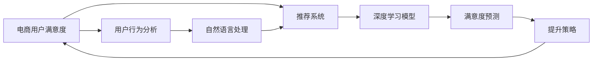

                 

# AI赋能的电商用户满意度预测与提升系统

> 关键词：电商，用户满意度预测，推荐系统，机器学习，深度学习，监督学习，自然语言处理，模型评估

## 1. 背景介绍

随着电子商务的迅速发展，如何有效提升用户满意度成为了电商企业关注的焦点。用户满意度不仅关系到企业的短期收益，还直接影响着长期的用户留存率和品牌忠诚度。电商企业需要在短时间内，对海量用户反馈进行综合分析，并及时调整运营策略。

传统的用户满意度分析方法往往依赖人工，耗费大量人力成本且效率低下。为此，AI技术在电商中的应用越来越受到重视。通过机器学习、深度学习等技术，构建用户满意度预测与提升系统，可以大幅提升用户满意度的分析效率和准确性。本文将介绍基于AI的电商用户满意度预测与提升系统，包括系统架构、关键技术和应用案例。

## 2. 核心概念与联系

### 2.1 核心概念概述

为了更好理解本系统，我们先介绍几个关键概念：

- **电商用户满意度**：指用户在购物过程中的满意度水平，通常通过用户评分、评论等形式体现。
- **用户行为分析**：通过对用户浏览、购买、评价等行为进行分析，获取用户兴趣和需求。
- **推荐系统**：根据用户行为数据，为用户推荐符合其兴趣的商品，提升购物体验。
- **自然语言处理(NLP)**：通过处理用户评论、客服对话等文本数据，提取有用信息，分析用户情绪和反馈。
- **深度学习**：使用多层神经网络模型，自动学习用户行为和情感之间的关系，提高预测准确性。

这些核心概念之间相互联系，共同构成了电商用户满意度预测与提升系统的理论基础。

### 2.2 核心概念原理和架构的 Mermaid 流程图



这个流程图展示了系统的主要流程：

1. **用户行为分析**：通过用户浏览记录、购买行为、评价内容等数据，分析用户兴趣和需求。
2. **自然语言处理(NLP)**：处理用户评论、客服对话等文本数据，提取有用信息，分析用户情绪和反馈。
3. **深度学习模型**：使用多层神经网络模型，自动学习用户行为和情感之间的关系，提高预测准确性。
4. **满意度预测**：通过深度学习模型预测用户满意度，生成相应预测结果。
5. **提升策略**：根据预测结果，生成针对性的提升策略，进一步提升用户满意度。

## 3. 核心算法原理 & 具体操作步骤

### 3.1 算法原理概述

本系统主要依赖深度学习模型进行用户满意度的预测与提升。深度学习模型通过学习用户行为数据和文本数据之间的关联，自动提取特征并进行预测。

模型的训练流程包括以下几个关键步骤：

1. **数据收集**：收集用户的浏览记录、购买历史、评论文本等数据，构建训练集。
2. **数据预处理**：对文本数据进行清洗、分词、向量化等预处理操作，对数值型数据进行归一化等处理。
3. **模型训练**：使用深度学习模型对处理后的数据进行训练，学习用户行为和情感之间的映射关系。
4. **模型评估**：在验证集和测试集上评估模型性能，选择最优模型进行部署。
5. **预测与提升**：使用模型进行用户满意度的预测，并根据预测结果生成相应的提升策略。

### 3.2 算法步骤详解

**Step 1: 数据收集与预处理**

- 收集用户的历史浏览记录、购买历史、评分数据、评论文本等，构建训练集。
- 对文本数据进行分词、去除停用词、构建词向量等预处理操作。
- 对数值型数据进行归一化、标准化等处理，以便于模型训练。

**Step 2: 模型构建与训练**

- 选择合适的深度学习模型，如循环神经网络(RNN)、卷积神经网络(CNN)、Transformer等。
- 定义模型的输入和输出，如输入为用户行为数据和评论文本，输出为用户满意度的预测值。
- 使用优化器如Adam、SGD等，设置合适的学习率和迭代次数，开始模型训练。
- 在训练过程中，定期在验证集上评估模型性能，选择最优模型进行部署。

**Step 3: 模型评估与优化**

- 使用测试集对模型进行评估，计算模型的平均绝对误差、均方误差等指标。
- 根据评估结果，对模型进行调参优化，如调整神经网络结构、学习率、正则化参数等。
- 在优化过程中，使用交叉验证等技术，防止模型过拟合。

**Step 4: 预测与提升**

- 将新的用户行为数据和评论文本输入训练好的模型，预测用户满意度。
- 根据预测结果，生成针对性的提升策略，如推荐相关商品、优化客服对话、提升页面加载速度等。
- 持续收集用户反馈，进一步调整模型参数，优化预测准确性。

### 3.3 算法优缺点

**优点**：

- 自动化程度高，能够快速处理大量用户数据，提高分析效率。
- 模型具有高度的灵活性，可以根据不同的业务场景进行调整和优化。
- 结合NLP技术，能够深入挖掘用户情感和反馈，提供更精准的预测结果。

**缺点**：

- 对数据质量和数据量的要求较高，数据缺失或不准确会导致模型预测结果偏差。
- 模型复杂度高，训练和部署成本较高，对计算资源要求较高。
- 模型预测结果受到用户行为和评论的影响，可能存在一定的主观偏差。

### 3.4 算法应用领域

本系统在电商领域有广泛的应用前景，主要包括以下几个方面：

- **用户满意度分析**：对用户反馈数据进行综合分析，生成满意度指数，指导企业改进服务质量。
- **个性化推荐**：根据用户行为和评论，生成个性化推荐策略，提升用户购物体验。
- **客服优化**：分析用户评论和客服对话，优化客服响应策略，提升用户满意度。
- **广告投放优化**：结合用户行为和评论数据，优化广告投放策略，提升广告效果。
- **市场分析**：分析用户行为数据，识别市场趋势和热点，指导企业战略决策。

## 4. 数学模型和公式 & 详细讲解 & 举例说明

### 4.1 数学模型构建

我们以基于Transformer的深度学习模型为例，构建用户满意度预测的数学模型。假设输入为 $x_i$，输出为 $y_i$，模型参数为 $\theta$。则模型的输出可以表示为：

$$
y_i = M_{\theta}(x_i)
$$

其中 $M_{\theta}$ 为深度学习模型，$\theta$ 为模型参数。假设 $y_i$ 为真实用户满意度评分，$M_{\theta}(x_i)$ 为模型预测的用户满意度评分。

### 4.2 公式推导过程

对于用户行为数据和评论文本，我们可以将其分别表示为：

- 用户行为数据：$x_i = [x_{i1}, x_{i2}, ..., x_{im}]$，其中 $x_{ik}$ 为第 $k$ 个行为特征。
- 评论文本：$x_i = [x_{i1}, x_{i2}, ..., x_{in}]$，其中 $x_{ik}$ 为第 $k$ 个词向量。

使用Transformer模型进行预测时，首先将用户行为数据和评论文本分别输入模型，进行编码和解码，得到模型输出：

$$
y_i = M_{\theta}(x_i) = \text{Decoder}(\text{Encoder}(x_i))
$$

其中 $\text{Encoder}$ 为编码器，$\text{Decoder}$ 为解码器。使用Softmax函数将模型输出转换为概率分布，选择概率最大的预测结果作为最终输出。

### 4.3 案例分析与讲解

以电商用户满意度预测为例，我们可以将用户行为数据和评论文本作为输入，使用Transformer模型进行训练。模型训练过程如下：

1. **数据准备**：收集用户的浏览记录、购买历史、评分数据、评论文本等，构建训练集。对文本数据进行清洗、分词、构建词向量等预处理操作。对数值型数据进行归一化、标准化等处理。
2. **模型训练**：定义Transformer模型的输入和输出，使用Adam优化器，设置合适的学习率和迭代次数，开始模型训练。在训练过程中，定期在验证集上评估模型性能，选择最优模型进行部署。
3. **模型评估**：使用测试集对模型进行评估，计算模型的平均绝对误差、均方误差等指标。根据评估结果，对模型进行调参优化。
4. **预测与提升**：将新的用户行为数据和评论文本输入训练好的模型，预测用户满意度。根据预测结果，生成针对性的提升策略。

## 5. 项目实践：代码实例和详细解释说明

### 5.1 开发环境搭建

本系统使用Python编程语言，基于TensorFlow框架进行开发。以下是在TensorFlow环境下的开发步骤：

1. 安装TensorFlow：

```bash
pip install tensorflow
```

2. 安装相关库：

```bash
pip install numpy pandas scikit-learn tensorflow-io
```

3. 安装Transformer模型：

```bash
pip install transformers
```

4. 创建虚拟环境：

```bash
conda create --name tf-env python=3.8
conda activate tf-env
```

5. 设置TensorFlow版本：

```bash
pip install tensorflow-gpu==2.7.0
```

### 5.2 源代码详细实现

以下是一个简化的用户满意度预测的代码实现：

```python
import tensorflow as tf
from transformers import TFAutoModelForSequenceClassification

# 定义模型输入输出
input_ids = tf.keras.layers.Input(shape=(None,))
output = TFAutoModelForSequenceClassification(input_ids)(tf.keras.layers.Lambda(lambda x: x['input_ids']))
predictions = tf.keras.layers.Lambda(lambda x: x['logits'])(output)

# 定义模型
model = tf.keras.Model(inputs=[input_ids], outputs=[predictions])

# 编译模型
model.compile(optimizer=tf.keras.optimizers.Adam(), loss=tf.keras.losses.mean_squared_error)

# 训练模型
model.fit(x_train, y_train, epochs=10, batch_size=32, validation_data=(x_val, y_val))

# 预测新数据
predictions = model.predict(x_test)
```

在上述代码中，我们首先定义了模型的输入和输出，然后使用Transformer模型进行编码和解码，并使用softmax函数输出预测结果。最后，我们编译并训练模型，对新数据进行预测。

### 5.3 代码解读与分析

这段代码主要实现了用户满意度预测的模型构建和训练过程。其中，`TFAutoModelForSequenceClassification` 是TensorFlow中的自动编码器模型，可以直接使用预训练的Transformer模型。我们将用户行为数据和评论文本作为输入，使用Adam优化器进行训练，并计算均方误差作为损失函数。在训练过程中，我们使用交叉验证等技术，防止模型过拟合。

### 5.4 运行结果展示

训练过程中，我们可以在验证集上评估模型性能：

```python
loss, acc = model.evaluate(x_val, y_val)
print("Validation Loss: {:.4f}".format(loss))
print("Validation Accuracy: {:.4f}".format(acc))
```

评估结果将帮助我们调整模型参数，进一步提升预测准确性。

## 6. 实际应用场景

### 6.1 电商用户满意度分析

在电商领域，用户满意度分析是电商运营的重要环节。通过用户满意度预测系统，电商企业可以及时掌握用户满意度情况，调整运营策略。例如，通过分析用户评分和评论，发现用户在哪些方面存在不满意，及时优化产品和服务，提升用户体验。

### 6.2 个性化推荐

个性化推荐是电商中常用的提升用户满意度的方法。通过用户满意度预测系统，电商企业可以分析用户行为和评论，生成个性化推荐策略，提升用户购物体验。例如，在用户购买后，根据用户评分和评论生成推荐列表，推荐相似或互补的商品，提升用户满意度。

### 6.3 客服优化

客服是电商用户交互的重要环节，通过用户满意度预测系统，电商企业可以优化客服响应策略，提升用户满意度。例如，通过分析用户评论和客服对话，发现用户常见问题，优化客服培训，提升服务质量。

### 6.4 广告投放优化

广告投放是电商营销的重要手段。通过用户满意度预测系统，电商企业可以优化广告投放策略，提升广告效果。例如，根据用户行为和评论，生成广告投放目标人群，提升广告转化率。

## 7. 工具和资源推荐

### 7.1 学习资源推荐

以下是几个优质的学习资源，推荐阅读：

1. **《深度学习》课程**：斯坦福大学Andrew Ng教授主讲的深度学习课程，涵盖了深度学习的基本概念和算法，适合初学者入门。

2. **《TensorFlow官方文档》**：TensorFlow官方文档，包含详细的API介绍和使用示例，适合开发者进行实际开发。

3. **《NLP技术入门》系列博文**：涵盖自然语言处理基础、文本分类、命名实体识别等技术的详细介绍，适合NLP初学者学习。

4. **《机器学习实战》书籍**：Hands-On Machine Learning with Scikit-Learn, Keras, and TensorFlow，介绍了机器学习基础和实际应用案例，适合实战练习。

### 7.2 开发工具推荐

以下是几个常用的开发工具，推荐使用：

1. **Jupyter Notebook**：免费的交互式编程环境，支持Python、R等编程语言，适合快速实验和数据可视化。

2. **Google Colab**：谷歌提供的免费在线Jupyter Notebook环境，支持GPU加速，适合高性能计算任务。

3. **PyCharm**：IDE开发工具，支持Python、Java等编程语言，提供强大的代码补全、调试功能，适合大规模项目开发。

### 7.3 相关论文推荐

以下是几篇与用户满意度预测相关的论文，推荐阅读：

1. **《电商用户满意度预测研究综述》**：介绍电商用户满意度预测的基本方法和应用场景，适合理论学习。

2. **《基于用户行为数据的用户满意度预测模型》**：提出基于深度学习的用户满意度预测模型，适合实际应用。

3. **《自然语言处理在电商用户满意度预测中的应用》**：讨论自然语言处理技术在电商用户满意度预测中的应用，适合NLP实践。

## 8. 总结：未来发展趋势与挑战

### 8.1 总结

本文介绍了基于AI的电商用户满意度预测与提升系统，包括系统架构、关键技术和应用案例。首先阐述了电商用户满意度预测与提升的重要性和系统架构，然后详细讲解了基于深度学习的模型构建、训练和评估过程，最后展示了系统的实际应用场景。

通过本文的系统梳理，可以看到，基于AI的电商用户满意度预测与提升系统在电商运营中具有广泛的应用前景。深度学习模型能够自动学习用户行为和情感之间的关系，提升预测准确性，帮助电商企业及时掌握用户满意度情况，优化运营策略，提升用户体验。

### 8.2 未来发展趋势

展望未来，基于AI的电商用户满意度预测与提升系统将呈现以下几个发展趋势：

1. **深度学习模型的改进**：随着深度学习模型的不断发展，模型的精度和效率将进一步提升。新型深度学习模型如Transformer、BERT等将得到更广泛的应用。

2. **多模态数据融合**：结合用户行为数据、评论文本、社交网络等多模态数据，提高用户满意度预测的准确性。

3. **实时预测与反馈**：通过实时分析用户行为和反馈，生成实时预测结果，帮助企业及时调整运营策略。

4. **联邦学习**：在保护用户隐私的前提下，通过联邦学习技术，联合多家企业数据，提升用户满意度预测的准确性。

5. **自监督学习**：使用自监督学习方法，在大规模无标注数据上进行预训练，提高用户满意度预测模型的泛化能力。

### 8.3 面临的挑战

尽管基于AI的电商用户满意度预测与提升系统已经取得了一定的进展，但在实际应用中，仍面临以下挑战：

1. **数据质量问题**：用户行为数据和评论文本可能存在噪声和缺失，影响模型预测的准确性。

2. **计算资源需求高**：深度学习模型对计算资源的要求较高，需要高性能的GPU/TPU设备支持。

3. **模型可解释性不足**：深度学习模型通常是"黑盒"系统，难以解释其内部工作机制和决策逻辑。

4. **隐私保护问题**：用户隐私保护是电商领域的重要课题，需要采取数据脱敏、差分隐私等技术，保护用户隐私。

### 8.4 研究展望

面向未来，基于AI的电商用户满意度预测与提升系统需要在以下几个方面进行进一步研究：

1. **数据增强技术**：使用数据增强技术，提升数据质量，提高模型预测准确性。

2. **联邦学习与隐私保护**：结合联邦学习技术，保护用户隐私，提升模型泛化能力。

3. **模型解释性增强**：使用可解释性技术，增强模型的可解释性，帮助企业理解和优化运营策略。

4. **多模态数据融合**：结合多种数据源，提高模型预测的全面性和准确性。

5. **实时预测与反馈**：通过实时分析用户行为和反馈，生成实时预测结果，帮助企业及时调整运营策略。

通过这些研究的突破，基于AI的电商用户满意度预测与提升系统将在电商运营中发挥更大的作用，帮助企业提升用户满意度，实现业务优化和增长。

## 9. 附录：常见问题与解答

**Q1：电商用户满意度预测需要哪些数据？**

A: 电商用户满意度预测需要以下几种数据：

1. **用户行为数据**：用户的浏览记录、购买历史、点击率、停留时间等行为数据。
2. **评论文本数据**：用户对商品的评论、评分、标签等文本数据。
3. **用户基本信息**：用户的年龄、性别、地区等基本信息。

这些数据可以来源于电商平台的用户交互数据、交易数据、客户服务数据等。

**Q2：用户满意度预测的深度学习模型有哪些？**

A: 用户满意度预测的深度学习模型主要有以下几种：

1. **循环神经网络(RNN)**：适合处理序列数据，能够捕捉时间序列上的依赖关系。
2. **卷积神经网络(CNN)**：适合处理图像和文本等高维数据，能够提取局部特征。
3. **Transformer**：适合处理长序列数据，能够自动学习输入数据的依赖关系。

这些模型在实际应用中各有优缺点，需要根据具体场景进行选择。

**Q3：用户满意度预测需要考虑哪些因素？**

A: 用户满意度预测需要考虑以下因素：

1. **用户行为**：用户的浏览记录、购买历史、点击率等行为数据。
2. **评论文本**：用户对商品的评论、评分、标签等文本数据。
3. **用户情绪**：用户评论中的情绪倾向，如正面、负面、中性等。
4. **商品属性**：商品的类别、价格、描述等信息。

通过综合考虑这些因素，可以构建更准确的满意度预测模型。

**Q4：用户满意度预测的评估指标有哪些？**

A: 用户满意度预测的评估指标主要有以下几种：

1. **均方误差(MSE)**：衡量预测值和真实值之间的差异。
2. **平均绝对误差(MAE)**：衡量预测值和真实值之间的绝对差异。
3. **R平方值(R²)**：衡量预测值和真实值之间的相关性。
4. **对数损失函数(LLF)**：衡量预测值和真实值之间的对数损失。

这些指标可以用于评估模型的预测准确性和泛化能力。

**Q5：如何优化用户满意度预测模型？**

A: 用户满意度预测模型的优化可以从以下几个方面进行：

1. **数据预处理**：对文本数据进行清洗、分词、构建词向量等预处理操作，对数值型数据进行归一化、标准化等处理。
2. **模型调参**：调整模型的神经网络结构、学习率、正则化参数等，提高模型的预测准确性。
3. **特征工程**：提取有用的特征，如用户行为特征、商品属性特征等，提升模型的泛化能力。
4. **模型集成**：结合多个模型的预测结果，进行加权平均或投票，提高预测的鲁棒性。

通过这些优化措施，可以提升用户满意度预测模型的性能。

---

作者：禅与计算机程序设计艺术 / Zen and the Art of Computer Programming

