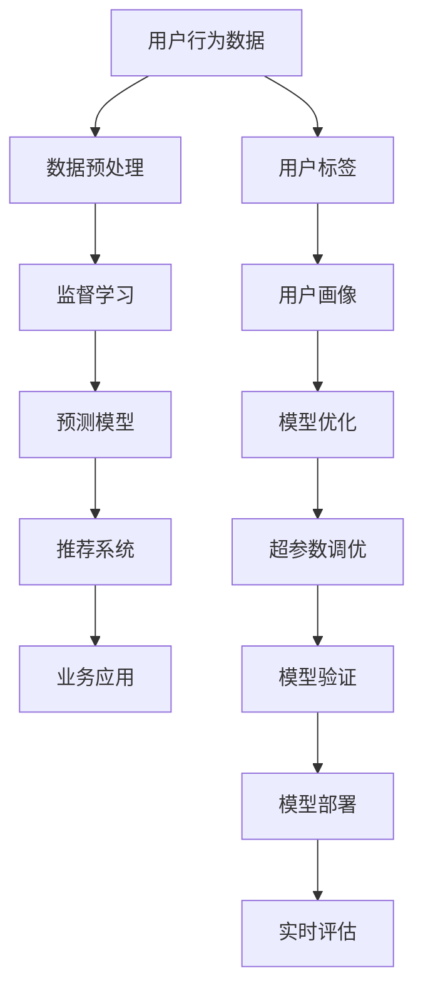

                 

## 1. 背景介绍

### 1.1 问题由来
随着电商行业的高速发展，商家越来越需要了解消费者的购买行为和购买力，以便制定更有针对性的营销策略和定价策略。传统的用户购买力评估方法，如问卷调查、历史消费数据分析等，存在成本高、响应率低、数据不全面等问题。近年来，随着人工智能技术的成熟，基于用户行为数据分析的用户购买力精准评估技术应运而生。

### 1.2 问题核心关键点
用户购买力评估的核心问题在于如何从海量用户行为数据中提取有用的信息，并准确预测用户的购买意愿和消费能力。主要面临以下挑战：
- 数据不平衡：用户行为数据通常不平衡，部分用户的消费数据缺失较多。
- 数据复杂性：用户行为数据包含多种形式，如浏览、点击、购买、评论等，需要处理和融合。
- 预测精度：如何提高模型预测的准确性和鲁棒性，避免偏差和过拟合。
- 隐私保护：在收集和分析用户数据时，如何保障用户隐私和数据安全。

### 1.3 问题研究意义
通过精准评估用户购买力，电商商家能够实现更精准的个性化推荐、定制化营销和定价策略，提升用户体验和转化率。精准评估技术不仅有助于商家提升销售业绩，还能帮助用户发现更多合适的商品，提高购物效率。此外，精准评估技术的研究有助于推动电商行业的健康发展，促进数字经济的繁荣。

## 2. 核心概念与联系

### 2.1 核心概念概述

用户购买力评估涉及多个关键概念：

- **用户行为数据**：包括用户浏览、点击、购买、评价等多种形式的数据，是评估用户购买力的基础。
- **用户购买力模型**：通过机器学习算法建立，用于预测用户未来购买行为和消费能力。
- **监督学习**：基于标注数据，训练模型对新数据进行预测。
- **深度学习**：包括神经网络等高级算法，能够处理复杂数据和抽取高阶特征。
- **推荐系统**：基于用户购买力模型，实现个性化推荐，提升用户体验。
- **预测模型**：如线性回归、决策树、随机森林、神经网络等，用于构建用户购买力评估模型。
- **数据预处理**：包括数据清洗、特征工程、数据增强等，提升数据质量。

这些概念相互联系，共同构成了用户购买力评估的完整技术框架。

### 2.2 核心概念原理和架构的 Mermaid 流程图(Mermaid 流程节点中不要有括号、逗号等特殊字符)



该流程图示意了用户购买力评估的整个技术框架，从数据收集、预处理到模型构建、业务应用，再到持续优化和部署评估，各个环节相互关联，共同支撑用户购买力精准评估的实现。

## 3. 核心算法原理 & 具体操作步骤

### 3.1 算法原理概述

用户购买力评估的核心算法为监督学习，其基本原理是通过已有标注数据训练预测模型，利用模型对用户未来购买行为进行预测。具体包括以下步骤：

1. **数据收集**：从电商平台、社交媒体、搜索引擎等渠道收集用户行为数据，构建用户行为数据集。
2. **数据预处理**：对收集的数据进行清洗、归一化、特征工程等预处理操作，生成可用于训练的特征向量。
3. **模型构建**：选择适合的预测模型，如线性回归、决策树、随机森林、神经网络等，训练模型参数。
4. **模型评估**：在测试集上评估模型预测准确性，调整模型超参数，提升模型性能。
5. **业务应用**：将训练好的模型集成到电商推荐系统中，根据用户购买力进行个性化推荐和定价策略调整。

### 3.2 算法步骤详解

以下详细介绍用户购买力评估的算法步骤：

**Step 1: 数据收集与预处理**

1. **数据收集**：
   - 电商网站：记录用户浏览、点击、购买、评价等行为数据。
   - 社交媒体：采集用户评论、点赞、分享等互动数据。
   - 搜索引擎：分析用户在搜索中的关键词和行为轨迹。

2. **数据清洗**：
   - 去除无效数据，如缺失值、重复记录等。
   - 去除噪声数据，如异常值、错误记录等。

3. **特征工程**：
   - 提取特征，如用户ID、浏览时间、浏览页面数、浏览商品ID、购买金额、评论情感等。
   - 特征归一化，将不同尺度的特征转换为相同范围。
   - 特征选择，选择对购买力预测有重要影响的特征。

**Step 2: 模型选择与训练**

1. **模型选择**：
   - 线性回归：适用于预测数值型数据。
   - 决策树和随机森林：适用于分类和回归任务。
   - 神经网络：适用于处理复杂数据和抽取高阶特征。
   - 梯度提升树：适用于处理不平衡数据。

2. **模型训练**：
   - 划分训练集和测试集。
   - 使用随机梯度下降法或Adam等优化算法，训练模型参数。
   - 使用交叉验证等方法，防止过拟合和欠拟合。

**Step 3: 模型评估与优化**

1. **模型评估**：
   - 使用ROC曲线、AUC等指标评估模型预测准确性。
   - 使用均方误差、平均绝对误差等指标评估模型预测精度。

2. **模型优化**：
   - 调整模型超参数，如学习率、正则化系数等。
   - 使用集成学习、模型融合等方法，提升模型鲁棒性。

**Step 4: 业务应用与部署**

1. **业务应用**：
   - 集成预测模型到电商推荐系统中。
   - 根据用户购买力评估结果，生成个性化推荐列表。
   - 根据用户购买力，动态调整商品价格和营销策略。

2. **模型部署**：
   - 将模型封装为API服务，方便调用和集成。
   - 使用Docker、Kubernetes等容器化技术，实现模型的高可用性和可扩展性。
   - 在生产环境中，实时监测模型性能，及时调整优化。

### 3.3 算法优缺点

用户购买力评估的监督学习算法具有以下优点：
- **数据利用率高**：能够高效利用用户行为数据，构建准确的预测模型。
- **预测精度高**：通过学习大量历史数据，预测用户未来购买行为准确性高。
- **业务适用性强**：适用于电商、社交媒体、金融等多个领域。

同时，也存在以下缺点：
- **数据依赖性强**：模型性能依赖标注数据的质量和数量。
- **模型复杂度高**：复杂模型需要较长时间训练和调参。
- **预测解释性差**：黑盒模型难以解释预测逻辑和决策依据。
- **隐私风险高**：大量用户行为数据可能带来隐私和安全风险。

### 3.4 算法应用领域

用户购买力评估在多个领域有广泛应用，包括：

- **电商推荐系统**：根据用户历史行为和购买力，生成个性化推荐商品。
- **广告投放优化**：通过评估用户购买力，精准投放广告，提升广告效果。
- **信用评分体系**：根据用户购买力和行为数据，评估用户信用等级，提供个性化服务。
- **市场细分**：通过用户购买力评估，对用户进行市场细分，实现差异化营销。
- **用户画像**：结合用户购买力评估结果，生成用户画像，用于客户关系管理。

## 4. 数学模型和公式 & 详细讲解 & 举例说明

### 4.1 数学模型构建

用户购买力评估的数学模型主要包括线性回归和神经网络模型。以线性回归模型为例，假设用户购买力 $Y$ 与用户行为特征 $X$ 之间存在线性关系：

$$
Y = \beta_0 + \beta_1X_1 + \beta_2X_2 + \cdots + \beta_pX_p + \epsilon
$$

其中 $\beta_0, \beta_1, \cdots, \beta_p$ 为模型系数，$\epsilon$ 为误差项。目标是最小化预测误差：

$$
\min_{\beta} \sum_{i=1}^n (Y_i - \hat{Y}_i)^2
$$

其中 $Y_i$ 为实际购买力，$\hat{Y}_i$ 为模型预测值。

### 4.2 公式推导过程

线性回归模型训练过程如下：
1. **初始化系数**：随机初始化模型系数 $\beta$。
2. **计算预测值**：对每个样本 $i$，计算预测值 $\hat{Y}_i = \beta_0 + \beta_1X_{1,i} + \cdots + \beta_pX_{p,i}$。
3. **计算损失函数**：计算预测误差 $e_i = Y_i - \hat{Y}_i$，并计算损失函数 $J(\beta) = \frac{1}{2n}\sum_{i=1}^n e_i^2$。
4. **求解最优系数**：使用梯度下降法等优化算法，求解 $J(\beta)$ 的最小值。

### 4.3 案例分析与讲解

以电商推荐系统为例，介绍线性回归模型的应用。假设电商网站收集了用户的浏览、点击、购买等行为数据，目标是预测用户未来购买概率。

1. **数据准备**：
   - 收集用户历史行为数据，包括用户ID、浏览时间、浏览页面数、浏览商品ID、购买金额、购买时间等。
   - 清洗数据，去除重复和无效记录。
   - 选择与购买相关的特征，如浏览页面数、浏览商品ID、购买金额等。

2. **模型训练**：
   - 划分训练集和测试集，比例为70%和30%。
   - 使用线性回归模型，对训练集进行拟合。
   - 使用交叉验证等方法，防止过拟合和欠拟合。

3. **模型评估**：
   - 在测试集上评估模型预测准确性，计算AUC和均方误差。
   - 根据评估结果，调整模型超参数，如正则化系数、学习率等。

4. **业务应用**：
   - 将训练好的模型集成到推荐系统中。
   - 根据用户购买力评估结果，生成个性化推荐商品列表。
   - 根据用户购买力，动态调整商品价格和营销策略。

## 5. 项目实践：代码实例和详细解释说明

### 5.1 开发环境搭建

在进行用户购买力评估的项目实践前，需要准备开发环境。以下是使用Python进行TensorFlow开发的环境配置流程：

1. 安装Anaconda：从官网下载并安装Anaconda，用于创建独立的Python环境。

2. 创建并激活虚拟环境：
```bash
conda create -n tf-env python=3.8 
conda activate tf-env
```

3. 安装TensorFlow：根据CUDA版本，从官网获取对应的安装命令。例如：
```bash
conda install tensorflow -c pytorch -c conda-forge
```

4. 安装各类工具包：
```bash
pip install numpy pandas scikit-learn matplotlib tqdm jupyter notebook ipython
```

完成上述步骤后，即可在`tf-env`环境中开始用户购买力评估项目的开发。

### 5.2 源代码详细实现

下面以线性回归模型为例，给出使用TensorFlow进行用户购买力评估的PyTorch代码实现。

首先，定义数据处理函数：

```python
import pandas as pd
from sklearn.model_selection import train_test_split
from sklearn.preprocessing import StandardScaler

def load_data():
    # 从CSV文件中加载数据
    data = pd.read_csv('user_behavior.csv')
    
    # 划分特征和标签
    X = data[['浏览时间', '浏览页面数', '浏览商品ID', '购买金额']]
    y = data['购买概率']
    
    # 数据归一化
    scaler = StandardScaler()
    X = scaler.fit_transform(X)
    
    # 划分训练集和测试集
    X_train, X_test, y_train, y_test = train_test_split(X, y, test_size=0.3, random_state=42)
    
    return X_train, X_test, y_train, y_test
```

然后，定义模型和优化器：

```python
import tensorflow as tf
from tensorflow.keras.layers import Dense
from tensorflow.keras.models import Sequential

def build_model(X_train, y_train):
    # 定义模型
    model = Sequential([
        Dense(32, input_shape=(X_train.shape[1],), activation='relu'),
        Dense(1, activation='sigmoid')
    ])
    
    # 编译模型
    model.compile(loss='binary_crossentropy', optimizer='adam', metrics=['accuracy'])
    
    # 训练模型
    model.fit(X_train, y_train, epochs=10, batch_size=32, validation_split=0.2)
    
    return model
```

最后，启动训练流程并在测试集上评估：

```python
# 加载数据
X_train, X_test, y_train, y_test = load_data()

# 构建模型
model = build_model(X_train, y_train)

# 评估模型
test_loss, test_acc = model.evaluate(X_test, y_test)
print(f'Test Loss: {test_loss:.4f}')
print(f'Test Accuracy: {test_acc:.4f}')
```

以上就是使用TensorFlow进行用户购买力评估的完整代码实现。可以看到，TensorFlow提供了强大的深度学习框架，使得构建和训练模型变得简单高效。

### 5.3 代码解读与分析

让我们再详细解读一下关键代码的实现细节：

**load_data函数**：
- 从CSV文件中加载数据，并进行特征和标签划分、数据归一化和数据分割。

**build_model函数**：
- 定义神经网络模型，包括一个隐层和输出层，使用ReLU激活函数和sigmoid激活函数。
- 编译模型，指定损失函数、优化器和评价指标。
- 训练模型，使用随机梯度下降法和Adam优化器。

**训练流程**：
- 加载数据，构建模型，训练模型。
- 在测试集上评估模型，输出测试损失和准确率。

## 6. 实际应用场景

### 6.1 智能推荐系统

基于用户购买力评估的智能推荐系统，能够根据用户的历史行为数据和购买力评估结果，生成个性化推荐商品，提升用户体验和转化率。

具体实现过程如下：
1. **数据收集**：收集用户浏览、点击、购买等行为数据。
2. **数据预处理**：对数据进行清洗、归一化和特征工程。
3. **模型构建**：使用线性回归或神经网络模型，训练用户购买力预测模型。
4. **推荐生成**：根据用户购买力评估结果，生成个性化推荐列表。
5. **业务应用**：将推荐列表展示给用户，提供购买建议。

### 6.2 广告投放优化

通过评估用户购买力，广告主可以更精准地投放广告，提升广告效果和投放效率。具体实现过程如下：
1. **数据收集**：收集用户浏览、点击、购买等行为数据，以及广告点击数据。
2. **数据预处理**：对数据进行清洗、归一化和特征工程。
3. **模型构建**：使用线性回归或神经网络模型，训练用户购买力预测模型。
4. **广告投放优化**：根据用户购买力评估结果，优化广告投放策略，提升广告效果。

### 6.3 信用评分体系

结合用户购买力评估结果，金融机构可以评估用户的信用等级，提供个性化服务。具体实现过程如下：
1. **数据收集**：收集用户购买行为数据、历史信用记录等。
2. **数据预处理**：对数据进行清洗、归一化和特征工程。
3. **模型构建**：使用线性回归或神经网络模型，训练用户购买力预测模型。
4. **信用评分**：根据用户购买力评估结果，评估用户信用等级，提供个性化服务。

## 7. 工具和资源推荐

### 7.1 学习资源推荐

为了帮助开发者系统掌握用户购买力评估的理论基础和实践技巧，这里推荐一些优质的学习资源：

1. 《深度学习入门》系列博文：由大模型技术专家撰写，深入浅出地介绍了深度学习的基本概念和前沿技术，包括用户购买力评估等实际应用。

2. Coursera《深度学习》课程：由斯坦福大学教授Andrew Ng开设的深度学习入门课程，涵盖深度学习的基础理论、算法和实践。

3. 《深度学习与Python编程》书籍：全面介绍了深度学习的基础知识和Python编程技巧，包括用户购买力评估等应用案例。

4. Kaggle平台：全球最大的数据科学竞赛平台，提供大量用户行为数据分析和机器学习实践项目，供开发者学习和练习。

5. GitHub开源项目：包括多个用户购买力评估的开源项目，如推荐系统、广告投放优化等，提供了丰富的代码和资源。

通过对这些资源的学习实践，相信你一定能够快速掌握用户购买力评估的精髓，并用于解决实际的电商问题。

### 7.2 开发工具推荐

高效的开发离不开优秀的工具支持。以下是几款用于用户购买力评估开发的常用工具：

1. Python：作为数据科学和机器学习的主要语言，Python提供了丰富的库和工具，方便开发和部署模型。

2. TensorFlow：由Google主导开发的深度学习框架，功能强大，支持分布式训练和生产部署。

3. PyTorch：由Facebook主导开发的深度学习框架，易于使用，支持动态图和静态图，适合研究和工程应用。

4. Jupyter Notebook：开源的交互式笔记本环境，方便开发和共享代码。

5. Git和GitHub：版本控制和代码托管平台，方便团队协作和代码共享。

合理利用这些工具，可以显著提升用户购买力评估的开发效率，加快创新迭代的步伐。

### 7.3 相关论文推荐

用户购买力评估研究源于学界的持续研究。以下是几篇奠基性的相关论文，推荐阅读：

1. Machine Learning: A Probabilistic Perspective：由Tom Mitchell所著，介绍了机器学习的基本理论和应用，包括用户购买力评估等实际问题。

2. Predicting Click-Through Rates in Online Advertising: A Multifaceted Approach：通过多角度方法，预测在线广告点击率，为用户购买力评估提供了理论基础。

3. A Survey on Customer Behavior Prediction：综述了客户行为预测的研究现状和未来趋势，为用户购买力评估提供了丰富的参考。

4. Deep Learning for Customer Behavior Prediction：介绍了深度学习在客户行为预测中的应用，包括用户购买力评估等实际问题。

5. Neural Networks and Deep Learning：由Michael Nielsen所著，全面介绍了神经网络的基本概念和深度学习技术，包括用户购买力评估等实际应用。

这些论文代表了大模型微调技术的发展脉络。通过学习这些前沿成果，可以帮助研究者把握学科前进方向，激发更多的创新灵感。

## 8. 总结：未来发展趋势与挑战

### 8.1 总结

本文对用户购买力评估技术进行了全面系统的介绍。首先阐述了用户购买力评估的研究背景和意义，明确了该技术在提升电商业务和用户体验中的独特价值。其次，从原理到实践，详细讲解了用户购买力评估的数学模型和核心算法，给出了代码实现和优化策略。同时，本文还广泛探讨了用户购买力评估技术在多个领域的实际应用前景，展示了该技术的多样性和强大潜力。

通过本文的系统梳理，可以看到，基于深度学习的大规模数据驱动的用户购买力评估技术，正在成为电商行业的重要工具，极大地提升了电商业务的智能化水平。未来，伴随深度学习技术的进一步发展，用户购买力评估技术还将迎来更多的创新和突破。

### 8.2 未来发展趋势

展望未来，用户购买力评估技术将呈现以下几个发展趋势：

1. **深度学习应用更加广泛**：随着深度学习算法的不断演进，用户购买力评估技术将更广泛地应用于电商、金融、社交媒体等多个领域。

2. **个性化推荐更加精准**：基于用户购买力评估，推荐系统能够提供更个性化、更精准的推荐服务，提升用户购物体验。

3. **实时评估和动态优化**：通过实时监测用户行为数据，动态调整推荐策略和定价策略，提升业务响应速度和效果。

4. **多模态数据融合**：结合用户浏览、评论、社交媒体等多模态数据，提升用户购买力评估的准确性和鲁棒性。

5. **数据隐私和安全保护**：随着用户隐私保护意识的提升，用户购买力评估技术将更加注重数据隐私和安全，采用差分隐私、联邦学习等技术，保障用户数据安全。

以上趋势凸显了用户购买力评估技术的广阔前景。这些方向的探索发展，必将进一步提升电商业务的智能化水平，推动电商行业的健康发展。

### 8.3 面临的挑战

尽管用户购买力评估技术已经取得了显著成效，但在向更智能、更普及的落地应用迈进的过程中，仍面临诸多挑战：

1. **数据收集和预处理**：用户行为数据通常不平衡，数据质量和完整性难以保证，给数据收集和预处理带来挑战。

2. **模型鲁棒性不足**：用户购买力评估模型对数据噪声和异常值敏感，难以应对复杂的市场环境。

3. **模型复杂性高**：深度学习模型参数量大，训练和调参复杂，需要高性能计算资源。

4. **业务应用复杂性高**：模型评估和优化涉及多方面因素，如推荐策略、定价策略等，需要综合考虑。

5. **隐私保护难度大**：用户购买力评估需要收集和分析大量用户数据，如何保障用户隐私和数据安全是重要问题。

6. **技术门槛高**：用户购买力评估技术涉及多个领域知识，需要跨学科的合作和技术积累。

正视用户购买力评估面临的这些挑战，积极应对并寻求突破，将是大模型微调技术走向成熟的必由之路。相信随着学界和产业界的共同努力，这些挑战终将一一被克服，用户购买力评估技术必将在构建智能电商中扮演越来越重要的角色。

### 8.4 研究展望

面对用户购买力评估所面临的挑战，未来的研究需要在以下几个方面寻求新的突破：

1. **数据增强技术**：通过数据增强、迁移学习等技术，提升数据质量和数量，提高模型泛化能力。

2. **鲁棒性增强技术**：引入鲁棒性增强技术，如对抗训练、噪声注入等，提升模型鲁棒性，应对市场环境变化。

3. **分布式训练技术**：采用分布式训练、模型压缩等技术，优化深度学习模型的计算效率，降低训练和调参成本。

4. **多模态数据融合技术**：引入多模态数据融合技术，结合多种数据源，提升用户购买力评估的准确性和鲁棒性。

5. **隐私保护技术**：引入差分隐私、联邦学习等技术，保障用户数据隐私和安全，提升用户信任度。

6. **实时动态优化技术**：引入实时动态优化技术，根据市场环境变化，动态调整推荐策略和定价策略，提升业务响应速度和效果。

这些研究方向和技术的不断探索和突破，将为用户购买力评估技术带来新的进展和应用，推动电商行业向更智能化、个性化、安全化的方向发展。

## 9. 附录：常见问题与解答

**Q1：用户购买力评估是否适用于所有电商场景？**

A: 用户购买力评估技术适用于大多数电商场景，但需要根据具体业务需求进行调整。例如，对于高频低值的小商品，可能需要使用短期的购买行为数据进行评估；对于高价值商品，可能需要使用更长期的购买行为数据进行评估。

**Q2：如何选择最适合的用户行为特征？**

A: 用户购买力评估的关键在于选择合适的特征进行模型训练。一般而言，可以选用以下特征：
- 浏览行为：浏览时间、浏览页面数等。
- 点击行为：点击次数、点击停留时间等。
- 购买行为：购买次数、购买金额、购买时间等。
- 用户画像：用户年龄、性别、地域等。

选择合适的特征需要根据具体业务场景进行测试和调优。

**Q3：用户购买力评估模型的训练时间如何优化？**

A: 用户购买力评估模型的训练时间主要受数据规模和模型复杂度的影响。优化训练时间的方法包括：
- 数据采样：对数据进行采样，减少训练数据量。
- 特征工程：通过特征选择和特征降维，减少模型参数量。
- 分布式训练：使用分布式训练技术，加快模型训练速度。
- 模型压缩：对模型进行剪枝、量化等操作，减小模型大小。

这些方法可以显著缩短训练时间，提高模型开发效率。

**Q4：用户购买力评估模型的预测结果如何解释？**

A: 用户购买力评估模型的预测结果通常是黑盒模型，难以解释其内部工作机制和决策依据。为了提高模型的可解释性，可以引入可解释性技术，如特征重要性分析、局部可解释性方法等。

**Q5：用户购买力评估的模型如何部署和维护？**

A: 用户购买力评估模型部署和维护需要考虑以下几个方面：
- 模型部署：将模型封装为API服务，方便调用和集成。
- 实时监控：在生产环境中，实时监测模型性能，及时调整优化。
- 模型更新：定期更新模型，避免模型过时和泛化能力下降。
- 数据回流：收集新数据，进行持续学习和模型更新。

通过合理的部署和维护，可以确保用户购买力评估模型的长期稳定运行。

---

作者：禅与计算机程序设计艺术 / Zen and the Art of Computer Programming

