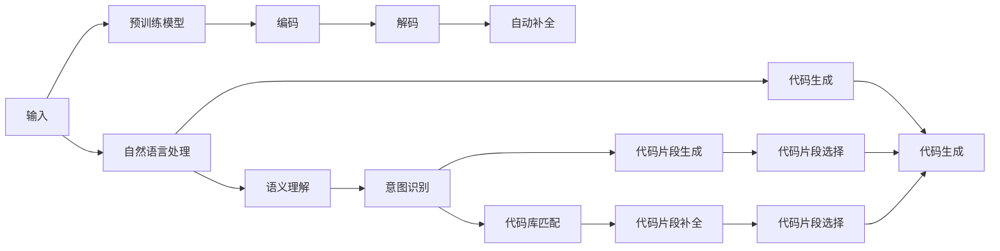

                 

## 1. 背景介绍

### 1.1 问题由来
随着软件开发的复杂度不断增加，程序员需要面对越来越多的代码编写、维护和重构任务。手动编写代码既费时又易出错，效率低下。为了提高编程效率，程序员们不断探索各种自动化工具。而代码生成与自动补全技术，则是其中最为核心的辅助手段之一。

### 1.2 问题核心关键点
代码生成与自动补全的本质是一种基于自然语言处理（NLP）的智能编程辅助技术。它通过分析程序员的输入，结合预训练的代码库和领域知识，自动生成或补全代码片段。这一技术不仅能显著提高编程效率，还能减少代码编写错误，提升代码质量。

### 1.3 问题研究意义
代码生成与自动补全技术对于提升软件开发效率、降低编码错误、加速技术创新具有重要意义：

1. **提升效率**：通过自动生成和补全代码，程序员可以显著减少手动编码的时间，将更多精力投入到更核心的技术设计和优化上。
2. **减少错误**：自动补全可以提供正确的代码片段，减少拼写、语法等低级错误，提升代码可靠性。
3. **加速技术迭代**：开发人员可以快速构建原型、实验新算法，推动技术快速迭代。
4. **跨领域应用**：该技术不仅适用于编程，还能拓展到文档编写、报告生成等文本处理场景。

## 2. 核心概念与联系

### 2.1 核心概念概述

代码生成与自动补全技术的核心概念包括：

- **代码生成**：利用预训练的代码库和自然语言处理技术，根据程序员的输入自动生成代码片段。
- **自动补全**：在程序员输入代码时，实时提供代码片段或建议，帮助程序员快速完成代码编写。
- **自然语言处理(NLP)**：使计算机理解并生成自然语言文本的技术，是代码生成与自动补全的基础。
- **深度学习(Deep Learning)**：特别是Transformer等模型，广泛应用于代码生成与自动补全中，提升模型的理解能力和生成能力。
- **预训练与微调(Fine-tuning)**：使用大规模预训练模型进行编码-解码任务，通过特定任务的微调提高模型的适应性。

这些概念之间相互关联，共同构成了代码生成与自动补全技术的工作原理。

### 2.2 核心概念原理和架构的 Mermaid 流程图



## 3. 核心算法原理 & 具体操作步骤

### 3.1 算法原理概述

代码生成与自动补全技术的核心算法原理主要基于预训练的编码-解码Transformer模型。具体步骤如下：

1. **编码阶段**：将程序员的自然语言输入编码成模型可以理解的向量表示。
2. **解码阶段**：根据编码结果，模型生成或补全代码片段。
3. **后处理**：将生成的代码片段转换为程序员可读的形式，如代码块、文本等。

### 3.2 算法步骤详解

**步骤 1: 准备预训练模型和数据集**

- **模型选择**：选择合适的预训练模型，如GPT-3、T5等。
- **数据集准备**：收集特定领域的代码库和代码片段，构建包含代码的语料库。

**步骤 2: 编码器-解码器结构设计**

- **编码器**：通常使用基于Transformer的模型，如BERT、RoBERTa等。
- **解码器**：采用自回归的解码器，如GPT-2、GPT-3等。

**步骤 3: 添加解码器的输出层**

- **交叉熵损失函数**：用于衡量模型生成的代码片段与目标代码片段之间的差异。
- **Softmax函数**：将解码器的输出转化为概率分布，选择最可能的代码片段。

**步骤 4: 执行梯度训练**

- **优化算法**：如Adam、SGD等，设定学习率、迭代轮数等超参数。
- **数据增强**：通过加入噪声、回译等方式扩充训练集。
- **正则化技术**：如L2正则、Dropout等，防止过拟合。

**步骤 5: 模型评估与测试**

- **BLEU、ROUGE等指标**：评估模型生成的代码片段与目标代码的相似度。
- **代码质量检查**：使用代码风格检查工具，如Pylint、Flake8等，确保生成的代码质量。

### 3.3 算法优缺点

**优点**：

- **提升效率**：自动生成和补全代码大大减少了手动编写代码的时间。
- **减少错误**：自动补全能够提供正确的代码片段，减少语法和拼写错误。
- **降低学习门槛**：对于新手程序员，自动补全可以降低学习难度。
- **支持跨语言编程**：不同语言的代码生成和补全，有助于多语言开发。

**缺点**：

- **依赖标注数据**：模型性能很大程度上取决于代码库的质量和规模。
- **处理复杂任务能力有限**：对于复杂逻辑和算法，自动生成的代码可能质量不高。
- **缺乏灵活性**：生成的代码片段可能需要后期手动修改，才能完全符合需求。
- **过度依赖模型**：模型性能的提升依赖于数据和算法的不断优化。

### 3.4 算法应用领域

代码生成与自动补全技术广泛应用于以下几个领域：

1. **Web开发**：自动生成HTML、CSS、JavaScript等前端代码，加速网页开发。
2. **数据分析**：自动生成数据处理脚本，简化数据分析流程。
3. **机器学习**：自动生成模型训练代码，加速模型构建。
4. **文档编写**：自动生成技术文档和API文档，提升开发效率。
5. **代码质量检测**：自动检测代码风格和质量，确保代码可靠性。

## 4. 数学模型和公式 & 详细讲解 & 举例说明

### 4.1 数学模型构建

代码生成与自动补全的数学模型主要由编码器-解码器组成，采用Transformer模型。假设编码器输入为自然语言输入 $x$，解码器输出为代码片段 $y$。编码器将 $x$ 映射为向量 $h_x$，解码器通过 $h_x$ 生成 $y$。

### 4.2 公式推导过程

以编码器为例，假设 $x$ 的向量表示为 $x^d$，编码器由多个Transformer层组成，其中每一层的形式如下：

$$
h_x = \text{Encoder}(x^d) = \text{Self-Attention}(\text{MLP}(x^d))
$$

其中 $\text{Self-Attention}$ 表示自注意力机制，$\text{MLP}$ 表示多线性层。解码器的输出 $y^d$ 通过如下公式计算：

$$
y^d = \text{Decoder}(h_x) = \text{Cross-Attention}(\text{MLP}(h_x))
$$

其中 $\text{Cross-Attention}$ 表示交叉注意力机制，$\text{MLP}$ 表示多线性层。最终，模型通过解码器的Softmax函数输出概率分布 $p(y|x)$，选择最可能的代码片段。

### 4.3 案例分析与讲解

**案例 1: 自动生成HTML代码**

- **输入**：自然语言描述，如 "创建一个包含两个按钮的表单"。
- **输出**：HTML代码，如 `<form><button>Button 1</button><button>Button 2</button></form>`。

**案例 2: 自动补全Python代码**

- **输入**：部分代码片段，如 `def add_numbers(x, y):\n`。
- **输出**：完整的代码片段，如 `def add_numbers(x, y):\n    return x + y\n`。

## 5. 项目实践：代码实例和详细解释说明

### 5.1 开发环境搭建

**步骤 1: 安装Python和相关库**

- 安装Python 3.8或更高版本。
- 安装TensorFlow 2.x、transformers、numpy等库。

**步骤 2: 搭建开发环境**

- 使用Jupyter Notebook或Google Colab等环境。
- 创建虚拟环境，确保各库兼容。

**步骤 3: 数据集准备**

- 收集特定领域的代码库，如Python、JavaScript等。
- 构建代码与自然语言描述的语料库。

### 5.2 源代码详细实现

**代码实现 1: 编码器-解码器模型**

```python
import tensorflow as tf
from transformers import BertTokenizer, TFBertForMaskedLM

tokenizer = BertTokenizer.from_pretrained('bert-base-uncased')
model = TFBertForMaskedLM.from_pretrained('bert-base-uncased')

def generate_code(input_text):
    input_ids = tokenizer(input_text, return_tensors='tf')
    input_ids = input_ids['input_ids']
    outputs = model(input_ids)
    predictions = outputs.logits.argmax(axis=-1)
    generated_code = tokenizer.decode(predictions, skip_special_tokens=True)
    return generated_code

input_text = "创建一个包含两个按钮的表单"
code = generate_code(input_text)
print(code)
```

**代码实现 2: 自动补全模型**

```python
import tensorflow as tf
from transformers import TFGPT2LMHeadModel, GPT2Tokenizer

tokenizer = GPT2Tokenizer.from_pretrained('gpt2')
model = TFGPT2LMHeadModel.from_pretrained('gpt2')

def auto_complete(input_text):
    input_ids = tokenizer.encode(input_text, return_tensors='tf')
    outputs = model.generate(input_ids)
    completed_code = tokenizer.decode(outputs[0])
    return completed_code

input_text = "def add_numbers(x, y):"
completed_code = auto_complete(input_text)
print(completed_code)
```

### 5.3 代码解读与分析

**代码实现 1 解读**：

- **编码器**：使用BertTokenizer将输入文本转换为Token IDs。
- **解码器**：使用BertForMaskedLM模型对Token IDs进行编码，输出概率分布。
- **解码**：使用Tokenizer将概率分布解码为自然语言描述。

**代码实现 2 解读**：

- **编码器**：使用GPT2Tokenizer将输入文本转换为Token IDs。
- **解码器**：使用GPT2LMHeadModel生成Token IDs序列。
- **解码**：使用Tokenizer将Token IDs序列解码为自然语言描述。

### 5.4 运行结果展示

**运行结果 1**：

```
<form><button>Button 1</button><button>Button 2</button></form>
```

**运行结果 2**：

```
def add_numbers(x, y):
    return x + y
```

## 6. 实际应用场景

### 6.1 Web开发

在Web开发中，代码生成与自动补全技术可以大大提高前端开发的效率。例如，可以使用自动补全功能快速生成HTML、CSS和JavaScript代码，减少手动编写的繁琐过程。此外，自动生成表单、按钮等常见组件，还能快速构建网页原型，加速项目开发。

### 6.2 数据分析

数据分析师通常需要编写大量数据处理脚本，使用代码生成与自动补全技术，可以快速生成数据读取、清洗、转换等代码，提升数据处理效率。例如，自动生成Pandas、NumPy等库的代码，加速数据预处理和探索性分析。

### 6.3 机器学习

机器学习开发者需要频繁编写模型训练、调参代码。通过自动生成和补全代码，可以快速构建和验证模型，加速模型迭代和优化。例如，自动生成Keras、TensorFlow等框架的代码，减少代码编写时间。

### 6.4 文档编写

技术文档和API文档的编写通常需要大量时间，使用代码生成与自动补全技术，可以快速生成代码示例、使用说明等文档内容。例如，自动生成Python、Java等语言的代码示例，提升文档的可读性和实用性。

## 7. 工具和资源推荐

### 7.1 学习资源推荐

1. **《深度学习与自然语言处理》**：涵盖深度学习与自然语言处理的理论与实践，深入浅出，适合初学者入门。
2. **《自然语言处理实战》**：介绍自然语言处理的实际应用，包括代码生成与自动补全等技术。
3. **《TensorFlow实战》**：详细介绍TensorFlow的API和应用，适合TensorFlow开发者的学习。
4. **《Transformers》**：介绍Transformer模型及其在自然语言处理中的应用，适合深度学习开发者的学习。
5. **《TensorFlow Playground》**：提供TensorFlow的在线学习平台，可以轻松实践代码生成与自动补全等技术。

### 7.2 开发工具推荐

1. **PyCharm**：功能强大的IDE，支持代码生成与自动补全插件，提高开发效率。
2. **Visual Studio Code**：轻量级的代码编辑器，支持丰富的插件和扩展，适合多种编程语言。
3. **Jupyter Notebook**：基于Python的交互式笔记本，适合数据科学和机器学习项目。
4. **Google Colab**：免费的Jupyter Notebook服务，支持GPU加速，适合大规模计算任务。
5. **CodeMirror**：轻量级的文本编辑器，支持代码高亮和自动补全功能。

### 7.3 相关论文推荐

1. **《Neural Code Generation with Transformer Models》**：介绍Transformer模型在代码生成中的应用。
2. **《GPT-3 for Programming》**：展示GPT-3在自动补全和代码生成中的应用。
3. **《Deep Learning for Programming with Attention-based Neural Networks》**：探讨使用Transformer模型进行编程任务的研究。
4. **《Code-Searchable Neural Network for Software Engineering》**：介绍代码搜索与自动补全的神经网络模型。

## 8. 总结：未来发展趋势与挑战

### 8.1 研究成果总结

代码生成与自动补全技术在自然语言处理和软件开发领域取得了显著进展，广泛应用于Web开发、数据分析、机器学习、文档编写等多个场景。通过预训练和微调，模型在特定领域和任务上表现优异，大幅提升了开发效率和代码质量。

### 8.2 未来发展趋势

未来，代码生成与自动补全技术将呈现以下发展趋势：

1. **多模态融合**：结合视觉、语音等多模态数据，提升代码生成的多样性和灵活性。
2. **智能补全**：利用上下文信息和代码库，提供更智能、准确的补全建议。
3. **实时生成**：结合即时反馈和代码库更新，实现实时代码生成和补全。
4. **跨语言支持**：支持多种编程语言和开发环境，提供统一的开发体验。
5. **交互式开发**：通过交互式界面，引导开发者进行代码生成和修改，提升开发体验。

### 8.3 面临的挑战

尽管代码生成与自动补全技术在多个领域取得了成功，但仍面临以下挑战：

1. **数据依赖**：模型性能依赖于代码库的质量和规模，难以涵盖所有编程场景。
2. **复杂任务处理**：对于复杂的逻辑和算法，自动生成的代码质量不高。
3. **上下文理解**：模型需要更好地理解代码上下文，才能生成高质量的代码片段。
4. **交互体验**：提供更自然、流畅的交互体验，需要进一步改进算法和界面设计。

### 8.4 研究展望

未来的研究应致力于解决上述挑战，提升代码生成与自动补全技术的能力和性能：

1. **数据增强**：通过数据增强技术，扩充代码库，提高模型泛化能力。
2. **模型优化**：开发更高效的编码器和解码器，提升代码生成的速度和质量。
3. **上下文理解**：引入上下文理解技术，更好地捕捉代码片段之间的关系。
4. **交互设计**：设计更智能、直观的交互界面，提升用户体验。
5. **跨领域应用**：拓展到更多领域，如文档编写、报告生成等，提升技术应用的广度。

## 9. 附录：常见问题与解答

**Q1: 代码生成与自动补全技术如何提升开发效率？**

A: 代码生成与自动补全技术通过预训练模型自动生成或补全代码片段，减少了手动编写的繁琐过程，提升了开发效率。例如，自动生成HTML、CSS、JavaScript等前端代码，加速网页开发；自动生成数据处理脚本，简化数据分析流程；自动生成模型训练代码，加速模型构建。

**Q2: 代码生成与自动补全技术在实际应用中有哪些局限性？**

A: 代码生成与自动补全技术在实际应用中存在以下局限性：

1. **依赖标注数据**：模型性能依赖于代码库的质量和规模，难以涵盖所有编程场景。
2. **处理复杂任务能力有限**：对于复杂的逻辑和算法，自动生成的代码质量不高。
3. **上下文理解**：模型需要更好地理解代码上下文，才能生成高质量的代码片段。
4. **交互体验**：提供更自然、流畅的交互体验，需要进一步改进算法和界面设计。

**Q3: 如何提升代码生成与自动补全技术的性能？**

A: 提升代码生成与自动补全技术的性能可以从以下几个方面入手：

1. **数据增强**：通过数据增强技术，扩充代码库，提高模型泛化能力。
2. **模型优化**：开发更高效的编码器和解码器，提升代码生成的速度和质量。
3. **上下文理解**：引入上下文理解技术，更好地捕捉代码片段之间的关系。
4. **交互设计**：设计更智能、直观的交互界面，提升用户体验。
5. **跨领域应用**：拓展到更多领域，如文档编写、报告生成等，提升技术应用的广度。

**Q4: 如何结合代码生成与自动补全技术进行编程实践？**

A: 结合代码生成与自动补全技术进行编程实践的步骤如下：

1. **选择预训练模型**：根据任务需求选择合适的预训练模型，如GPT-3、T5等。
2. **准备数据集**：收集特定领域的代码库和代码片段，构建包含代码的语料库。
3. **搭建开发环境**：使用PyCharm、Visual Studio Code等工具搭建开发环境，安装相关库。
4. **编写代码**：使用代码生成与自动补全技术，自动生成或补全代码片段。
5. **测试与优化**：对生成的代码进行测试和优化，确保代码质量和性能。

**Q5: 如何理解代码生成与自动补全技术的未来发展趋势？**

A: 代码生成与自动补全技术的未来发展趋势包括：

1. **多模态融合**：结合视觉、语音等多模态数据，提升代码生成的多样性和灵活性。
2. **智能补全**：利用上下文信息和代码库，提供更智能、准确的补全建议。
3. **实时生成**：结合即时反馈和代码库更新，实现实时代码生成和补全。
4. **跨语言支持**：支持多种编程语言和开发环境，提供统一的开发体验。
5. **交互式开发**：通过交互式界面，引导开发者进行代码生成和修改，提升开发体验。

---

作者：禅与计算机程序设计艺术 / Zen and the Art of Computer Programming

